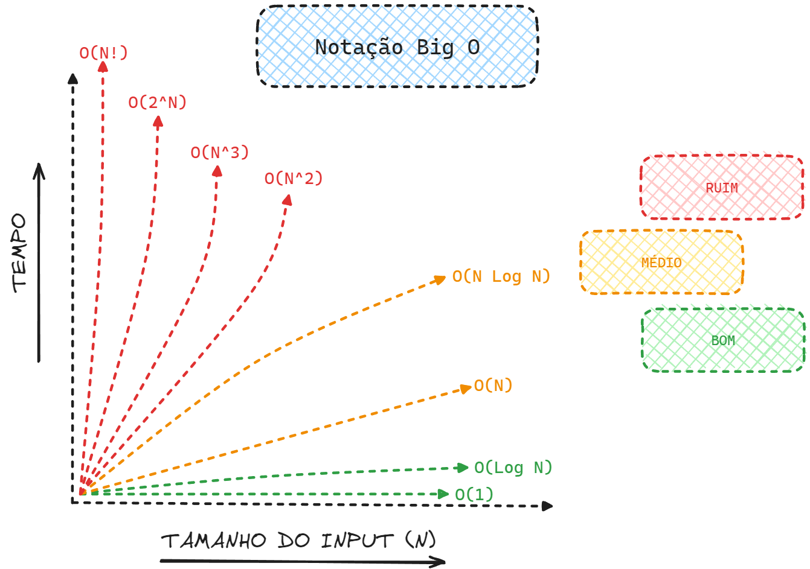

# Capítulo 1 – Introdução e Complexidade de Algoritmos

Quando desenvolvemos soluções computacionais, é fundamental compreender que nem todos os algoritmos resolvem um problema com a mesma eficiência. O estudo da **complexidade de algoritmos** serve exatamente para isso: medir o custo computacional associado à execução de um algoritmo, seja em termos de **tempo**, **espaço** ou outros recursos computacionais.

De forma mais ampla, a complexidade permite classificar problemas de acordo com sua **dificuldade inerente**, fornecendo ferramentas para comparar diferentes algoritmos destinados a resolver o mesmo problema. Esse conhecimento é essencial não apenas para escolher o algoritmo mais eficiente, mas também para entender os limites do que é computacionalmente viável.

Ao longo desta apostila, analisaremos detalhadamente algoritmos de ordenação e de busca. Contudo, antes de mergulharmos nesses tópicos, é indispensável que compreendamos como funciona a análise de complexidade, pois ela será frequentemente utilizada nas discussões que se seguirão.

## Busca por uma Métrica Justa

A princípio, pode parecer natural medir a eficiência de um algoritmo pelo **tempo absoluto de execução**. No entanto, essa abordagem não é adequada, pois o tempo depende de uma série de fatores externos:

- O tipo e a velocidade do processador;
- A quantidade de memória disponível;
- As otimizações realizadas pelo compilador;
- A linguagem de programação utilizada;
- As características do sistema operacional.

Diante disso, comparar algoritmos com base no tempo absoluto não é uma estratégia justa ou confiável.

Outro caminho seria analisar o consumo de **memória (espaço)**. Contudo, essa métrica sofre dos mesmos problemas: depende do ambiente de execução, das escolhas de implementação e de fatores externos.

A alternativa mais robusta é analisar a **quantidade de operações realizadas** por um algoritmo, em função do tamanho da entrada de dados. Este método é independente de hardware, linguagem ou ambiente de execução. Com isso, passamos a focar nas características intrínsecas do algoritmo, utilizando modelos matemáticos para prever seu comportamento.

## Pior, Melhor e Caso Médio

Ao analisarmos a complexidade de um algoritmo, levamos em consideração três cenários possíveis:

- **Melhor caso:** ocorre quando a entrada de dados está na configuração mais favorável para o algoritmo.
- **Pior caso:** ocorre quando a entrada está na configuração mais desfavorável.
- **Caso médio:** representa o comportamento esperado considerando entradas aleatórias.

Por exemplo, magine um jogo de baralho. Suponha que, no início da partida, você precise ordenar suas cartas para tomar decisões mais rápidas durante o jogo. Agora, considere dois cenários:

- Suas cartas já estão ordenadas: você está no **melhor caso**.
- Suas cartas estão em ordem inversa: você está no **pior caso**.
- As cartas foram embaralhadas aleatoriamente: você está no **caso médio**.

Essa analogia ilustra bem como a disposição inicial dos dados influencia o desempenho dos algoritmos, principalmente nos de ordenação e busca.

## Análise Assintótica

Para estudar o comportamento dos algoritmos de forma geral e independente de implementações específicas, utilizamos a chamada **Análise Assintótica**. Ela busca compreender como o tempo de execução (ou o uso de memória) de um algoritmo cresce à medida que o tamanho da entrada aumenta.

A análise assintótica abstrai detalhes irrelevantes, como constantes e fatores menores, focando no comportamento dominante conforme o problema escala.

## Notação Big-O

A **Notação Big-O (O)** é uma ferramenta matemática utilizada para descrever a **cota superior do tempo de execução** de um algoritmo. Ela indica, de forma simplificada, como a quantidade de operações cresce com o tamanho da entrada.

Em outras palavras, Big-O responde à seguinte pergunta:

> "Qual é o pior crescimento possível do número de operações quando o tamanho da entrada tende ao infinito?"

Por exemplo, suponha que você queira somar dois números muito grandes, representados dígito a dígito. Se cada número possui **n dígitos**, você precisará fazer **n operações de soma**, uma para cada par de dígitos.

Portanto, dizemos que o algoritmo de soma possui complexidade **O(n)** — ou seja, crescimento linear em relação ao número de dígitos.

Em outro exemplo, quando dizemos que um algoritmo é **O(n²)**, estamos afirmando que, no pior caso, a quantidade de operações necessárias cresce proporcionalmente ao **quadrado** do tamanho da entrada.

Por exemplo, se você possui uma entrada de tamanho **20**, então serão necessárias, aproximadamente, **400 operações**. Claro que isso é uma simplificação — nem toda operação custa o mesmo, e nem todo algoritmo tem comportamento uniforme —, mas é uma excelente aproximação para avaliar e comparar algoritmos.

Além da Notação Big-O, existem outras formas de expressar a análise assintótica de um algoritmo:

- **Big-Ômega (Ω):** descreve a **cota inferior**, ou seja, o melhor desempenho possível.
- **Big-Theta (Θ):** descreve o **comportamento médio ou exato**, quando as cotas inferior e superior são equivalentes.

Na prática, o mais comum é encontrarmos a notação **Big-O**, pois em muitos contextos é suficiente conhecer o pior caso.

### Observação sobre Logaritmos

Uma dúvida bastante comum entre estudantes é sobre a base dos logaritmos na análise de algoritmos. Afinal, vemos expressões como **O(log n)**, mas... logaritmo na base 2, base 10 ou base neperiana?

Na verdade, a **base do logaritmo é irrelevante na análise assintótica**, desde que ela seja uma constante. Isso ocorre porque a mudança de base em logaritmos é feita por meio de multiplicação por uma constante, e constantes são desprezadas na análise assintótica.

Portanto, **O(log₂ n)**, **O(log₁₀ n)** ou **O(ln n)** representam a mesma classe de complexidade.

## Classes de Complexidade

A seguir, apresentamos as classes de complexidade mais frequentes na análise de algoritmos, organizadas da menor para a maior taxa de crescimento:

| Notação     | Nome            |
| ----------- | --------------- |
| O(1)        | Constante       |
| O(log n)    | Logarítmica     |
| O((log n)ᶜ) | Polilogarítmica |
| O(n)        | Linear          |
| O(n log n)  | Linearítmica    |
| O(n²)       | Quadrática      |
| O(n³)       | Cúbica          |
| O(nᶜ)       | Polinomial      |
| O(cⁿ)       | Exponencial     |
| O(n!)       | Fatorial        |

  

Conforme podemos ver na imagem, se desejamos ordenar uma lista de elementos. Se o algoritmo possui complexidade **O(n log n)**, significa que ele será muito mais eficiente que um algoritmo **O(n²)** à medida que a quantidade de dados cresce.

Por outro lado, algoritmos de complexidade **O(n!)**, como alguns algoritmos de força bruta, tornam-se inviáveis mesmo para entradas pequenas, dado seu crescimento extremamente acelerado.

## Considerações Finais

Estudar a complexidade de algoritmos é uma etapa fundamental na formação de qualquer programador, cientista de dados ou engenheiro de software. Ao compreender como o tempo e o espaço crescem com o tamanho da entrada, somos capazes de tomar decisões mais informadas, escolhendo algoritmos que ofereçam desempenho aceitável para o problema e os recursos disponíveis.

Embora nossa abordagem aqui seja introdutória, ela fornecerá uma base sólida para que possamos, nos próximos capítulos, analisar detalhadamente os principais algoritmos de busca e ordenação, suas vantagens, limitações e suas respectivas complexidades.
