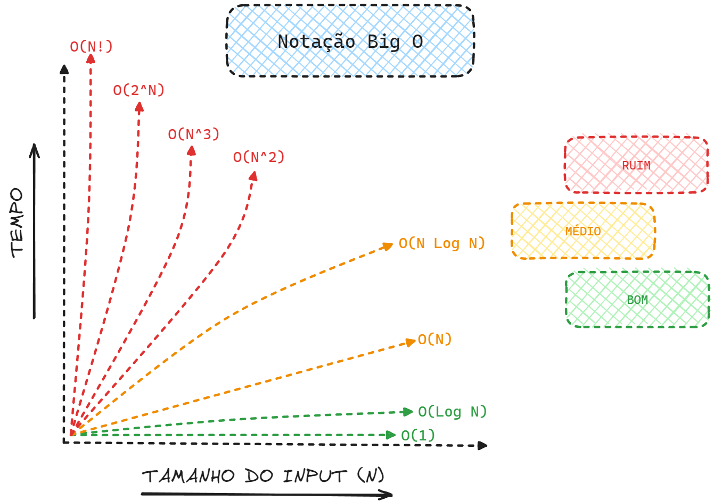

# Capítulo 1 – Introdução à Análise de Algoritmos

No vasto universo da computação, um "problema" pode ser resolvido de inúmeras maneiras. Cada uma dessas maneiras, descrita passo a passo de forma lógica e não ambígua, é o que chamamos de **algoritmo**. Contudo, um dos pilares fundamentais da Ciência da Computação é a compreensão de que nem todas as soluções são criadas iguais. Algumas são extraordinariamente rápidas e eficientes, enquanto outras podem ser tão lentas a ponto de se tornarem impraticáveis. O estudo da **complexidade de algoritmos** é a disciplina que nos permite analisar, comparar e classificar essas soluções, fornecendo uma medida objetiva do custo computacional associado à execução de um algoritmo. Esse custo pode ser medido em termos de **tempo de execução** (quantas operações ele realiza) ou **espaço de memória** (quanta memória ele consome), entre outros recursos.

Compreender a complexidade nos permite não apenas escolher o algoritmo mais eficiente para uma tarefa, mas também entender os limites fundamentais do que é computacionalmente viável. Ao longo desta apostila, nosso foco principal será a análise de algoritmos clássicos de ordenação e busca. Antes de mergulharmos nesses algoritmos específicos, é indispensável construir uma base sólida sobre como funciona a análise de complexidade, pois ela será a nossa principal ferramenta para avaliar e justificar por que um algoritmo é preferível a outro.

## Necessidade de uma Métrica Justa

A primeira pergunta que surge ao tentar comparar dois algoritmos é: "Como medimos qual é o 'melhor'?" Uma abordagem intuitiva seria simplesmente implementar os dois algoritmos e medir o tempo que cada um leva para executar, usando um cronômetro. Esta métrica é conhecida como **tempo absoluto de execução** (ou _wall clock time_).

No entanto, essa abordagem é fundamentalmente falha e injusta. O tempo absoluto de execução é contaminado por uma série de fatores externos que nada têm a ver com a eficiência intrínseca do algoritmo:

- **Hardware:** O tipo e a velocidade do processador (CPU), a quantidade e velocidade da memória RAM, e até mesmo a eficiência dos discos de armazenamento.
- **Ambiente de Software:** A linguagem de programação utilizada (código em C é geralmente mais rápido que código em Python para a mesma tarefa), as otimizações feitas pelo compilador e o próprio sistema operacional (processos em segundo plano, gerenciamento de memória, etc.).
- **Estado do Sistema:** A carga atual do processador ou a presença de outros programas competindo por recursos no momento do teste.

Se executarmos o mesmo algoritmo em um supercomputador e em um _smartphone_ antigo, os tempos absolutos serão drasticamente diferentes, mas o algoritmo em si não mudou. Portanto, precisamos de uma métrica que seja abstrata, universal e independente de hardware ou software.

A solução é parar de medir segundos e começar a medir algo mais fundamental: a **quantidade de operações elementares** que o algoritmo executa. Operações como uma soma, uma atribuição de variável, uma comparação entre dois números ou o acesso a um índice de vetor são consideradas operações elementares.

Ao adotar essa abordagem, não estamos mais interessados no tempo, mas sim na _taxa de crescimento_ do número de operações. A pergunta-chave muda de "Quantos segundos este algoritmo leva?" para:

> "Como o número de operações cresce à medida que o tamanho da entrada de dados aumenta?"

Chamamos o "tamanho da entrada" genericamente de **n**. Se estamos ordenando uma lista, **n** é o número de elementos na lista. Se estamos processando um texto, **n** pode ser o número de caracteres. Ao focar na relação entre **n** e o número de operações, obtemos uma métrica justa e poderosa para comparar a eficiência intrínseca dos algoritmos.

## Pior Caso, Melhor Caso e Caso Médio

Ao analisar um algoritmo, rapidamente percebemos que o número de operações não depende apenas do _tamanho_ da entrada, mas também da _configuração_ ou _arranjo_ dessa entrada. Um algoritmo de ordenação, por exemplo, se comportará de maneira muito diferente se a lista de entrada já estiver ordenada ou se estiver em ordem completamente inversa.

Para lidar com isso, dividimos nossa análise em três cenários distintos:

- **Melhor Caso:** Representa a configuração de entrada mais favorável possível para o algoritmo, resultando no menor número de operações.
- **Pior Caso:** Representa a configuração de entrada mais desfavorável, resultando no maior número de operações.
- **Caso Médio:** Descreve o comportamento esperado do algoritmo para uma entrada de dados aleatória ou "típica".

Vamos usar um exemplo prático: um algoritmo simples de **busca linear**. A função deste algoritmo é encontrar a posição de um `elemento` específico dentro de um `vetor` (lista) de tamanho `n`. Ele faz isso verificando cada posição, da primeira (índice 0) até a última.

```java
// Exemplo de Busca Linear
public int buscaLinear(int[] vetor, int elementoBuscado) {
    // 'n' é o tamanho do vetor
    int n = vetor.length; 
    
    // Loop que percorre o vetor
    for (int i = 0; i < n; i++) {
        // Operação de comparação
        if (vetor[i] == elementoBuscado) {
            return i; // Elemento encontrado, retorna o índice
        }
    }
    return -1; // Elemento não encontrado
}
```

Agora, vamos analisar os três cenários para este algoritmo, focando na operação principal (a comparação `vetor[i] == elementoBuscado`):

1. **Melhor Caso:** Ocorre quando o `elementoBuscado` é o **primeiro** item do vetor (`vetor[0]`). O algoritmo executa o loop apenas uma vez, faz uma única comparação e retorna imediatamente.
2. **Pior Caso:** Ocorre em duas situações: ou o `elementoBuscado` é o **último** item do vetor, ou ele **não está presente** no vetor. Em ambos os cenários, o algoritmo é forçado a percorrer o vetor _inteiro_, realizando **n** comparações.
3. **Caso Médio:** Se o elemento tem a mesma probabilidade de estar em qualquer posição, esperamos, em média, ter que percorrer metade do vetor. O número médio de comparações seria de aproximadamente **n / 2**.

Na prática da engenharia de software, o **pior caso** é frequentemente o mais importante. Quando construímos um sistema, queremos garantias de performance. Precisamos saber qual é o desempenho máximo que o sistema pode atingir em condições de estresse, para garantir que ele permaneça estável e responsivo.

## Análise Assintótica e a Notação Big-O

A análise dos três cenários nos dá uma boa ideia do comportamento, mas ainda podemos ser mais rigorosos e formais. A **Análise Assintótica** é o estudo matemático de como o número de operações (tempo) ou o uso de memória (espaço) de um algoritmo se comporta à medida que o tamanho da entrada **n** cresce, tendendo ao infinito.

O objetivo da análise assintótica é abstrair detalhes de implementação e focar na "ordem de grandeza" do crescimento. Para fazer isso, utilizamos uma linguagem formal chamada **Notação Big-O**.

### Notação Big-O (O)

A Notação Big-O é a ferramenta mais comum na análise de algoritmos. Ela é usada para descrever a **cota superior assintótica** do tempo de execução, ou seja, ela nos dá uma classificação formal do **pior caso**.

Big-O responde à pergunta:

> "Qual é a taxa de crescimento mais rápida possível para o número de operações, à medida que **n** fica arbitrariamente grande?"

Vamos revisitar nosso exemplo da `buscaLinear`. Vimos que, no pior caso, ela realiza **n** comparações. Dizemos, portanto, que a busca linear é um algoritmo de complexidade **O(n)**, o que lemos como "O de n" ou "ordem n". Isso significa que o tempo de execução cresce de forma **linear** em relação ao tamanho da entrada. Se dobrarmos o tamanho da lista, o tempo de execução, no pior caso, também dobrará.

### Simplificando Expressões

A grande vantagem da Notação Big-O é sua capacidade de simplificar a análise. Ao analisar um algoritmo, podemos chegar a uma função de custo complexa, como `f(n) = 2n² + 10n + 50`.

A análise assintótica nos permite simplificar isso seguindo duas regras:

1. **Desprezar Termos Não Dominantes:** À medida que **n** cresce, o termo `2n²` se tornará astronomicamente maior que `10n` e `50`. Para `n = 1000`, `2n²` é 2.000.000, enquanto `10n` é apenas 10.000. Os termos menores se tornam irrelevantes. Nossa função se simplifica para `f(n) ≈ 2n²`.
2. **Desprezar Constantes Multiplicativas:** A notação não se importa se o custo é `2n²` ou `50n²`. O que importa é a _natureza_ do crescimento, que é **quadrática** (`n²`). A constante `2` depende de fatores de implementação, e a análise assintótica os ignora.

Portanto, um algoritmo com custo `f(n) = 2n² + 10n + 50` é classificado simplesmente como **O(n²)**.

### Exemplo de O(n²)

Quando um algoritmo é **O(n²)**, dizemos que ele tem complexidade **quadrática**. Isso significa que se o tamanho da entrada dobrar, o tempo de execução aumentará aproximadamente quatro vezes (2²). Se a entrada triplicar, o tempo aumentará nove vezes (3²).

Um exemplo clássico é um algoritmo que precisa comparar cada elemento de uma lista com todos os outros elementos. Imagine que queremos saber se existem elementos duplicados em um vetor:

```java
// Exemplo de algoritmo O(n²)
public boolean contemDuplicatas(int[] vetor) {
    int n = vetor.length;
    for (int i = 0; i < n; i++) {
        // Loop externo executa 'n' vezes
        for (int j = i + 1; j < n; j++) {
            // Loop interno executa aproximadamente 'n' vezes para cada 'i'
            if (vetor[i] == vetor[j]) {
                return true; // Encontrou uma duplicata
            }
        }
    }
    return false; // Nenhuma duplicata encontrada
}
```

Neste caso, temos um loop dentro de outro (_loops aninhados_). O loop externo executa `n` vezes. Para cada iteração do loop externo, o loop interno executa (em média) `n/2` vezes. O número total de operações é proporcional a `n * n`, o que nos leva a uma complexidade de **O(n²)**.

### Observação sobre Logaritmos

É muito comum encontrarmos a complexidade **O(log n)**. Uma dúvida frequente é: qual a base desse logaritmo? É base 2 (log₂ n), base 10 (log₁₀ n) ou base natural (ln n)?

Na análise assintótica, a **base do logaritmo é irrelevante**, desde que seja uma constante. Isso se deve a uma propriedade matemática dos logaritmos: a mudança de base é feita através da multiplicação por uma constante.

Por exemplo, para converter de log₂ n para log₁₀ n:

$log_{2} n = log_{10} n / log_{10} 2$

Como $1 / log_{10} 2$ é apenas uma constante, e a Notação Big-O despreza constantes, O(log₂ n) é exatamente equivalente a O(log₁₀ n) ou O(ln n). Por convenção em Ciência da Computação, quando se escreve log n, geralmente se assume a base 2, pois muitos algoritmos eficientes (como a busca binária) funcionam dividindo o problema pela metade a cada passo.

## Classes de Complexidade Comuns

Os algoritmos são agrupados em "classes de complexidade" com base em sua taxa de crescimento assintótico. A seguir, apresentamos as classes mais comuns, ordenadas da mais eficiente (crescimento mais lento) para a menos eficiente (crescimento mais rápido).

| **Notação**    | **Nome**         | **Descrição e Exemplo de Código**                                                                                                                                                                                                                                                                                                           |
| -------------- | ---------------- | ------------------------------------------------------------------------------------------------------------------------------------------------------------------------------------------------------------------------------------------------------------------------------------------------------------------------------------------- |
| **O(1)**       | **Constante**    | O tempo de execução não depende do tamanho da entrada. **Exemplo:** Acessar um elemento de um vetor pelo seu índice (`int valor = vetor[3];`). Não importa se o vetor tem 10 ou 10 milhões de elementos, essa operação leva o mesmo tempo constante.                                                                                        |
| **O(log n)**   | **Logarítmica**  | Crescimento extremamente lento. O tempo aumenta muito pouco quando `n` cresce exponencialmente. **Exemplo:** A **Busca Binária**. Em uma lista ordenada, a cada passo, o algoritmo descarta metade dos elementos restantes. Para encontrar um item em 1 milhão de elementos, ele leva cerca de 20 comparações. Em 1 bilhão, leva apenas 30. |
| **O(n)**       | **Linear**       | O tempo de execução cresce na mesma proporção que a entrada. **Exemplo:** A **Busca Linear** que vimos, ou um algoritmo para encontrar o maior valor em um vetor (é preciso olhar todos os `n` elementos uma vez).                                                                                                                          |
| **O(n log n)** | **Linearítmica** | Uma classe de complexidade muito importante e eficiente. É considerada a "medalha de ouro" para algoritmos de ordenação baseados em comparação. **Exemplo:** Algoritmos de ordenação eficientes como o **Merge Sort** e o **Quick Sort** (no caso médio) operam em O(n log n).                                                              |
| **O(n²)**      | **Quadrática**   | O tempo de execução cresce proporcionalmente ao quadrado de `n`. **Exemplo:** O algoritmo de busca por duplicatas que vimos, ou algoritmos de ordenação simples como **Bubble Sort**, **Selection Sort** e **Insertion Sort** (no pior caso).                                                                                               |
| **O(n³)**      | **Cúbica**       | Crescimento rápido, comum em algoritmos com três loops aninhados. **Exemplo:** Multiplicação de matrizes (na sua forma mais simples) ou resolução de alguns sistemas de equações lineares.                                                                                                                                                  |
| **O(cⁿ)**      | **Exponencial**  | (Onde `c` é uma constante maior que 1). O tempo de execução dobra a cada novo elemento adicionado à entrada. Tornam-se rapidamente inviáveis. **Exemplo:** O cálculo recursivo da sequência de Fibonacci (sem otimização) ou a resolução de problemas por força bruta, testando todas as combinações possíveis de um conjunto.              |
| **O(n!)**      | **Fatorial**     | A pior classe de complexidade. O tempo de execução cresce de forma astronômica. **Exemplo:** O problema do Caixeiro-Viajante (encontrar o menor caminho que passa por `n` cidades) resolvido por força bruta, testando todas as `n!` permutações de cidades.                                                                                |

A imagem a seguir ilustra visualmente a diferença drástica na taxa de crescimento entre essas classes.

<div align="center">

</div>

Como o gráfico demonstra, algoritmos com complexidade constante `O(1)` ou logarítmica `O(log n)` (linha verde) são ideais, pois mal sofrem impacto com o aumento da entrada. Algoritmos lineares `O(n)` e linearítmicos `O(n log n)` (linha laranja) são considerados muito bons e escalam bem. Já os algoritmos polinomiais como `O(n²)` e `O(n³)` (linha vermelha) começam a se tornar lentos para entradas grandes, enquanto os exponenciais `O(2ⁿ)` e fatoriais `O(n!)` (linha vermelha) são computacionalmente inviáveis para qualquer entrada que não seja trivialmente pequena.

## Outras Notações Assintóticas (Ω e Θ)

Embora a Notação Big-O (pior caso) seja a mais utilizada, ela é apenas uma parte da história. Para uma análise completa, existem outras duas notações:

### Big-Ômega (Ω)

A Notação Big-Ômega descreve a **cota inferior assintótica**, ou seja, o **melhor caso** de um algoritmo. Ela responde à pergunta:

> "Qual é a taxa de crescimento mais lenta possível para o número de operações, mesmo na melhor configuração de entrada?"

- **Exemplo:** Vimos que na `buscaLinear`, o melhor caso é encontrar o item na primeira posição. Isso leva um tempo constante. Portanto, dizemos que a busca linear é **Ω(1)** (lê-se "ômega de 1").

Note que o mesmo algoritmo (`buscaLinear`) é **O(n)** (pior caso) e **Ω(1)** (melhor caso).

### Big-Theta (Θ)

A Notação Big-Theta descreve o **limite assintótico justo** ou **caso médio**. Um algoritmo só é classificado como Θ (Theta) quando o seu pior caso (Big-O) e o seu melhor caso (Big-Ômega) possuem a _mesma_ taxa de crescimento.

- **Exemplo:** Considere um algoritmo para encontrar o maior valor em um vetor.
    
    - **Pior Caso:** O maior valor é o último. O algoritmo precisa percorrer o vetor inteiro. Custo: `O(n)`.
    - **Melhor Caso:** O maior valor é o primeiro. O algoritmo... ainda precisa percorrer o vetor inteiro para ter certeza de que não há um valor maior depois. Custo: `Ω(n)`.

Como o melhor e o pior caso são, ambos, de ordem `n`, dizemos que este algoritmo é **Θ(n)**. Seu desempenho é linear, não importa a configuração da entrada.

Na prática, continuamos focando no Big-O porque, em muitos contextos, é suficiente e mais seguro conhecer a garantia do pior cenário.

## Considerações Finais

O estudo da complexidade de algoritmos é uma ferramenta essencial e fundamental na formação de qualquer profissional de computação. Ele nos liberta de comparações baseadas em hardware e nos fornece uma linguagem matemática universal, a Análise Assintótica, para avaliar a eficiência intrínseca de uma solução.

Neste capítulo, estabelecemos a necessidade de uma métrica justa, focando no número de operações em função do tamanho da entrada (`n`). Definimos os três cenários de análise (Melhor, Pior e Caso Médio) e mergulhamos na Notação Big-O, que classifica o comportamento de pior caso de um algoritmo. Detalhamos as principais classes de complexidade, de `O(1)` (constante) a `O(n!)` (fatorial), ilustrando cada uma com exemplos práticos. Por fim, complementamos nosso conhecimento com as notações Big-Ômega (melhor caso) e Big-Theta (caso justo).

Com esta base sólida, estamos agora preparados para analisar os algoritmos que são o foco principal desta apostila. Nos próximos capítulos, começaremos a explorar os principais algoritmos de ordenação, e usaremos constantemente as notações de complexidade que aprendemos aqui para comparar suas vantagens, desvantagens e cenários de aplicação.