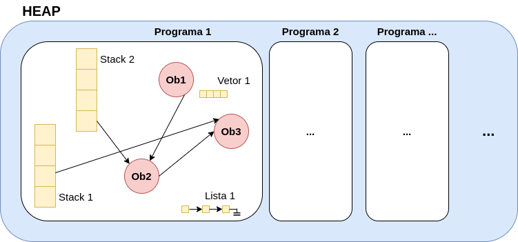

# Capítulo 6 – Introdução a Estruturas de Dados

Após uma jornada pelos principais algoritmos de ordenação e busca, chegamos a um pilar fundamental da Ciência da Computação: o estudo das **estruturas de dados**. Nos capítulos anteriores, vimos que a eficiência de um algoritmo, como a Busca Binária, depende crucialmente de uma condição prévia — neste caso, que os dados estejam ordenados. Essa interdependência não é uma coincidência; algoritmos e estruturas de dados são duas faces da mesma moeda. Um algoritmo é o conjunto de passos para realizar uma tarefa, e a estrutura de dados é o contêiner que armazena e organiza os dados sobre os quais a tarefa será realizada.

O estudo de estruturas de dados é essencial para compreender como os programas armazenam, organizam e manipulam dados de maneira eficiente. A escolha da estrutura correta pode ser a diferença entre um programa que executa instantaneamente e um que leva minutos para responder. Antes de nos aprofundarmos nas estruturas propriamente ditas (Pilhas, Filas, Listas, Árvores), é fundamental entender os conceitos basilares que dão suporte a todo este campo: o que são dados, como eles são abstraídos e, o mais importante, como eles são fisicamente gerenciados na memória do computador.

## Dados, Informações e Estruturas

Em computação, um **dado** é um valor bruto, atômico, que por si só não possui um significado claro ou utilidade imediata. São a matéria-prima de todo processamento.

- `10` (um valor numérico)
- `"b"` (um caractere)
- `true` (um valor lógico)

Tudo o que um computador faz é manipular dados para nos auxiliar na tomada de decisões. Esses dados podem ser originados da interação com usuários ou da comunicação entre sistemas.

Isoladamente, esses valores não transmitem muito. É apenas quando um dado ganha um **contexto** que ele se transforma em **informação**. A informação é o dado processado, organizado e com significado semântico.

- O dado `10` torna-se a informação: "O carro tem **10** anos de uso."
- O dado `"b"` torna-se a informação: "A letra **'b'** é a resposta correta."
- O dado `true` torna-se a informação: "O seguro está habilitado: **true**."

Uma **estrutura**, por sua vez, é o arranjo, a forma como organizamos um conjunto de dados para que eles possam ser manipulados e transformados em informação. É aqui que entra o conceito de **Estrutura de Dados**: um modelo lógico e organizacional que define como os dados serão representados na memória do computador e quais operações (uma **álgebra**) podem ser aplicadas sobre eles. A escolha da estrutura de dados adequada é fundamental para o desempenho, a eficiência no uso de memória e a confiabilidade de qualquer software.

## Tipos de Dados (TD)

O nível mais básico de organização de dados é o **Tipo de Dado (TD)**. Um TD é uma categoria primária de dado que uma linguagem de programação entende nativamente. Eles são implementações concretas que dizem ao compilador ou interpretador quanto espaço de memória reservar e que tipo de valores podem ser armazenados ali. Estes são comumente chamados de **tipos primitivos**.

Exemplos clássicos de TDs incluem:

- **Numéricos:** `int` (inteiro), `float` (ponto flutuante).
- **Lógicos:** `boolean` (verdadeiro ou falso).
- **Literais:** `char` (um único caractere).

Muitas linguagens subdividem esses tipos para otimizar o uso da memória. O Java, por exemplo, oferece `byte`, `short`, `int` e `long` para números inteiros, cada um com um tamanho e capacidade diferentes. Já o JavaScript, embora tenha menos tipos primitivos, possui o `Symbol` para representar valores únicos. O TD é a implementação; é o "como" a linguagem armazena "10" ou "true".

## Tipos Abstratos de Dados (TAD)

Enquanto os TDs são os "tijolos" concretos, os **Tipos Abstratos de Dados (TADs)** são o "projeto" ou a "planta" da engenharia de software. Um TAD é um modelo conceitual e matemático que define uma estrutura de dados com base em seu **comportamento** (quais operações ele suporta) e não em sua **implementação** (como essas operações são codificadas).

Um TAD foca no **"o quê"** (a interface), e não no **"como"** (a implementação).

O exemplo clássico é o TAD **Fila (Queue)**. Conceitualmente, uma fila é uma estrutura que obedece à política **FIFO (First In, First Out)** – o primeiro que entra é o primeiro que sai, como uma fila de banco. O TAD Fila define um conjunto de operações, independentemente de como elas serão implementadas:

- `enfileirar(dado)`: Adiciona um item ao final da fila.
- `desenfileirar()`: Remove e retorna o item do início da fila.
- `primeiro()`: Retorna o item no início da fila sem removê-lo.
- `estaVazia()`: Retorna `true` se a fila não contiver elementos.

A beleza do TAD é que podemos _implementar_ essa "ideia" de Fila de várias maneiras:

1. **Implementação com Vetor (Array):** Poderíamos usar um vetor e dois índices (`inicio` e `fim`). `enfileirar` adiciona um item em `fim`, e `desenfileirar` retorna o item de `inicio`. Isso é rápido, mas pode ter um tamanho fixo ou exigir o deslocamento de todos os elementos.
2. **Implementação com Lista Ligada:** Poderíamos usar nós que apontam uns para os outros, com um ponteiro para a `cabeça` (início) e outro para a `cauda` (fim). `enfileirar` cria um novo nó na `cauda`, e `desenfileirar` remove o nó da `cabeça`. Isso é flexível em tamanho.

Ambas são implementações válidas do _mesmo TAD_. Os TADs nos permitem pensar em um nível mais alto de abstração, focando na lógica do problema. Como mencionado no material de origem, os TADs podem ser vistos como tipos complexos, uma evolução dos tipos primitivos, constituídos a partir deles e com maior poder de representação.

## Gerenciamento de Memória

Para que os TADs e TDs possam ser usados pelos programas, eles precisam existir fisicamente em algum lugar. Esse lugar é a **memória do computador**. A memória é o componente que armazena tanto os dados quanto as instruções (programas) que os manipulam.

É crucial distinguir entre dois tipos principais de memória:

1. **Memória Principal (MP):** Geralmente a **RAM** (Random Access Memory). É extremamente rápida, de acesso direto, mas **volátil** — seus dados são perdidos quando a energia é desligada. É aqui que os programas são carregados para serem executados.
2. **Memória Secundária (MS):** Geralmente o **HD** (Disco Rígido) ou **SSD** (Solid State Drive), ou historicamente a ROM. É mais lenta, mas **durável** (não-volátil) — seus dados persistem após o desligamento. É usada para armazenamento de longo prazo.

O estudo de estruturas de dados foca quase inteiramente na **Memória Principal (RAM)**, pois é nela que a execução e a manipulação ativa de dados ocorrem. Dentro da RAM, a alocação de espaço para nossos dados pode ocorrer de duas formas:

- **Alocação Estática:** O espaço de memória necessário é definido em tempo de compilação. O tamanho é fixo e alocado de forma sequencial, mesmo que o programa não use todo o espaço. Exemplo: `int meuVetor[100];` em C. É rápido e simples, mas rígido.
- **Alocação Dinâmica:** O espaço de memória é alocado sob demanda, em tempo de execução. Os blocos de memória não precisam ser sequenciais. Isso permite que as estruturas de dados cresçam e encolham conforme a necessidade, sendo gerenciado pelo alocador de memória do Sistema Operacional (SO).

### Ponteiros e Referências

Para que a alocação dinâmica funcione, precisamos de um mecanismo para encontrar os blocos de memória não sequenciais. Esse mecanismo é o **ponteiro**.

Um **ponteiro** é uma variável especial que não armazena um dado (como `10` ou `"b"`), mas sim um **endereço de memória**. Ele "aponta" para o local onde o dado real está guardado.

Linguagens de baixo nível como C e C++ usam ponteiros explícitos, onde o programador manipula os endereços diretamente.

```c
#include <stdio.h>

int main() {
    int x = 10;
    int *p = &x;  // 'p' é um ponteiro que armazena o endereço de 'x'

    printf("Valor de x: %d\n", *p);  // Usa '*' para acessar o valor apontado por 'p'
    printf("Endereço de x: %p\n", p); // Imprime o endereço de memória
    return 0;
}
```

Linguagens de alto nível como Python, Java e JavaScript usam ponteiros de forma implícita, chamando-os de **referências**. O programador não vê o endereço de memória, mas o comportamento é o mesmo.

```python
x = [1, 2, 3]  # 'x' não é a lista, é uma referência para o objeto-lista
y = x          # 'y' copia a referência, não a lista

y.append(4)    # Modifica o objeto apontado por 'y'
print(x)       # Saída: [1, 2, 3, 4] -> 'x' também muda, pois aponta para o MESMO objeto
```

Ponteiros e referências são a base para a criação de quase todas as estruturas de dados dinâmicas (listas, árvores, grafos), permitindo que aloquemos e conectemos "nós" de dados de forma flexível na memória.

## Espaços de Trabalho: Stack e Heap

Quando um programa é executado, o Sistema Operacional aloca para ele um espaço de memória. Para nosso estudo, duas regiões dessa memória são fundamentais para entender como as estruturas de dados funcionam: a **Stack (Pilha de Execução)** e o **Heap (Monte)**.

### Stack (Pilha de Execução)

A **Stack** (Pilha) é uma região de memória gerenciada automaticamente pelo processador, usada para controlar a **execução do programa**. Ela funciona com uma política **LIFO (Last-In, First-Out)**.

Sua principal finalidade é gerenciar as **chamadas de funções/métodos**. Quando um programa chama uma função (ou método), um "quadro" (stack frame) é "empilhado" (push) no topo da Stack. Esse quadro contém:

1. **Parâmetros** da função/método.
2. **Endereço de Retorno** (para onde o programa deve voltar quando a função terminar).
3. **Endereço anterior** da "cabeça" da stack.
4. **Variáveis locais** declaradas _dentro_ da função/método.

<div align="center">

</div>

Se uma função chama outra, e essa chama uma terceira, novos quadros são empilhados.

<div align="center">

</div>

Quando uma função termina, seu quadro é "desempilhado" (pop), suas variáveis locais são destruídas, e a execução retorna ao endereço salvo.

A alocação na Stack é extremamente rápida (apenas mover um ponteiro do topo). No entanto, a Stack tem um **tamanho fixo e limitado** (definido pelo SO quando o programa inicia). Se uma cadeia de chamadas recursivas for muito profunda, ela pode estourar esse limite, causando o famoso erro **Stack Overflow**.

**O que vai para a Stack:** Tipos primitivos (como `int x = 10;` em Java ou C) e **referências** (ponteiros) para objetos.

### Heap (Monte)

O **Heap** (Monte) é a principal região de memória para **alocação dinâmica**. É um "monte" de memória desorganizado (daí o nome) onde o programa pode solicitar blocos de espaço de qualquer tamanho, em qualquer ordem, durante a execução.

Diferente da Stack, que é gerenciada automaticamente (LIFO), o Heap é mais flexível:

- Os dados alocados no Heap **persistem** mesmo após o término da função que os criou.
- Em linguagens como C, o programador é responsável por **liberar (free)** manualmente a memória do Heap. Esquecer de fazer isso causa "vazamentos de memória" (memory leaks).
- Em linguagens como Java, Python e JavaScript, um processo chamado **Garbage Collector (Coletor de Lixo)** monitora o Heap e libera automaticamente a memória de objetos que não são mais referenciados.

**O que vai para o Heap:** **Objetos** (criados com `new` em Java, ou por padrão em Python/JS) e dados alocados dinamicamente (com `malloc` em C).

A imagem a seguir ilustra perfeitamente essa relação. O Heap é o grande espaço de memória que contém os objetos reais (Ob1, Ob2, Ob3) e outras estruturas (Vetor 1, Lista 1). As Stacks (Pilha de Execução de cada programa ou thread) contêm apenas as referências (ponteiros, as setas) que apontam para esses objetos.

<div align="center">

</div>

### Exemplos Práticos de Alocação

Vamos solidificar essa diferença crucial com os exemplos fornecidos:

**Exemplo em Java:**

```java
public class PilhaHeapExemplo {
    public static void main(String[] args) {
        int x = 10; // 'x' (primitivo) é armazenado na Stack.
        Pessoa p = new Pessoa("João"); // 'p' (referência) é armazenado na Stack.
                                       // O objeto 'new Pessoa("João")' é criado
                                       // no Heap.
    }
}

class Pessoa {
    String nome;
    Pessoa(String nome) { this.nome = nome; }
}
```

**Exemplo em Python:**

```python
x = 10                       # 'x' é uma referência na Stack para um
							 # objeto '10' no Heap.*
							 
pessoa = {"nome": "Carlos"}  # 'pessoa' é uma referência na Stack.
                             # O dicionário '{"nome": "Carlos"}' é um
                             # objeto no Heap.
```

\*Nota: Em Python, tudo é objeto, então até mesmo `10` é um objeto no Heap, e `x` é uma referência na Stack para ele.

**Exemplo em C:**

```c
#include <stdlib.h>
#include <string.h>

int main() {
    int y = 20;  // 'y' é alocado diretamente na Stack.
    char *nome = malloc(20 * sizeof(char)); // 'nome' (ponteiro) está na Stack.
                                            // 'malloc' aloca 20 bytes no Heap.
    strcpy(nome, "Ana");
    free(nome);  // Desalocação manual obrigatória do espaço no Heap.
    return 0;
}
```

Compreender essa divisão Stack/Heap é talvez o conceito mais importante para dominar estruturas de dados, pois explica por que algumas operações são rápidas, por que os objetos se comportam como se comportam (passagem por referência) e como os vazamentos de memória ocorrem.

## Considerações Finais

Este capítulo estabeleceu os alicerces conceituais indispensáveis para o estudo de estruturas de dados. Partimos da unidade mais básica, o **dado**, e vimos como ele ganha significado para se tornar **informação**. Diferenciamos os **Tipos de Dados (TDs)**, que são as implementações concretas da linguagem (os "tijolos"), dos **Tipos Abstratos de Dados (TADs)**, que são os projetos conceituais focados no comportamento (o "o quê", não o "como").

Em seguida, mergulhamos na realidade física da computação, explorando como a memória é organizada. Discutimos a diferença entre alocação estática (rígida, rápida) e dinâmica (flexível, sob demanda), e identificamos os **ponteiros e referências** como os mecanismos que conectam tudo.

Finalmente, dissecamos as duas principais áreas de trabalho da memória de um programa: a **Stack (Pilha de Execução)**, responsável pelo gerenciamento automático das chamadas de funções e variáveis locais; e o **Heap (Monte)**, a vasta área de alocação dinâmica onde nossos objetos e estruturas complexas residem.

A seguir, apresentamos duas imagens que resumem as classificações expostas. A primeira imagem foca em como os tipos de dados podem ser constituídos, desde os primitivos até os estruturados (homogêneos e heterogêneos).

<div align="center">

</div>

A segunda imagem foca em como os dados podem ser estruturados, apresentando as principais famílias de TADs que exploraremos nos próximos capítulos: Lineares, Hierárquicas, Hash e Conjuntos.

<div align="center">

</div>

Com essa base sólida, estamos prontos para começar a construir. Nos próximos capítulos, usaremos esses conceitos de memória, ponteiros e TADs para implementar e analisar, uma por uma, as estruturas de dados mais importantes da computação, começando pelas estruturas lineares.