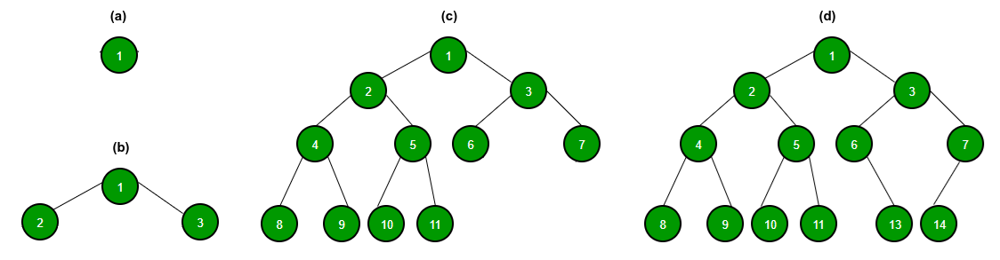
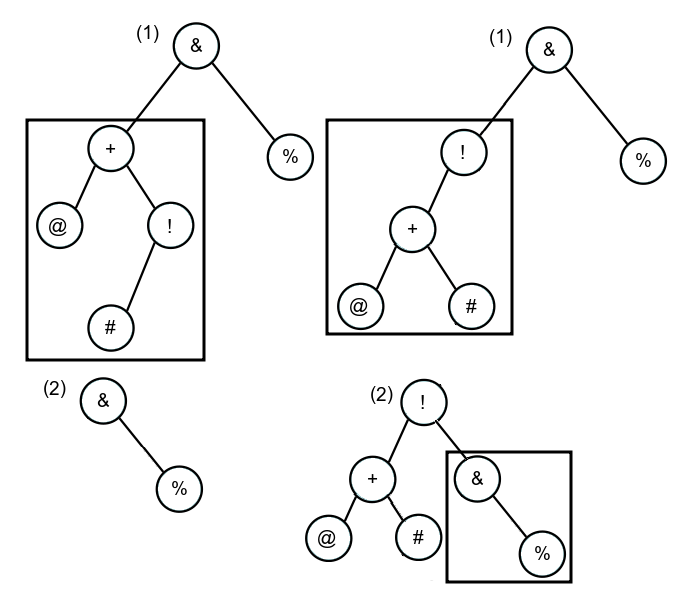

# Capítulo 10 – Árvores

Após explorarmos as estruturas de dados lineares (Vetores, Listas, Pilhas e Filas), onde cada elemento possui um sucessor e (opcionalmente) um predecessor, adentramos agora o mundo das estruturas **não-lineares**. As **árvores** constituem uma das mais importantes e versáteis estruturas de dados da computação, utilizadas extensivamente em algoritmos de busca, estruturas de banco de dados, sistemas de arquivos e na representação de hierarquias em geral. Diferente de uma lista, uma árvore organiza seus dados de forma hierárquica, composta por elementos chamados **nós**, conectados por **arestas** que definem relações de ancestralidade e descendência.

Este capítulo estudará a fundo essa estrutura, começando por sua terminologia fundamental, seus métodos de travessia e, em seguida, mergulhando em suas variações mais importantes, como as Árvores Binárias de Busca e as árvores autobalanceadas, como AVL.

## Estrutura e Terminologias Fundamentais

Uma árvore é uma estrutura de dados hierárquica que começa em um nó de origem e se ramifica em nós descendentes. Cada nó contém um valor (ou chave) e referências (ponteiros) para seus nós "filhos". A regra essencial é que cada nó pode ter vários filhos, mas apenas um "pai", exceto o nó inicial, que não possui pai. A árvore genealógica de uma família é um exemplo clássico dessa estrutura no dia a dia.

Por ser uma estrutura mais complexa que as lineares, a árvore possui um vocabulário rico de termos. A imagem a seguir ilustra uma árvore genérica e suas principais terminologias:

<div align="center">

</div>

- **Nó (Node):** É o elemento que constitui a árvore, contendo um valor (chave) e conectores (arestas) para outros nós. Na imagem, `A`, `B`, `C`, etc., são todos nós.
- **Raiz (Root):** É o nó inicial (ou superior) de uma árvore, por onde se inicia qualquer percurso. É o único nó que não possui pai. Na imagem, a raiz é `A`.
- **Aresta (Edge):** É a conexão (ponteiro) entre um nó pai e um nó filho. Na imagem, a linha que conecta `A` e `C` é uma aresta.
- **Pai (Parent):** Um nó que possui conexões com nós descendentes. `B` é pai de `D` e `E`.
- **Filho (Child):** Um nó que descende de outro. `D` e `E` são filhos de `B`.
- **Irmãos (Siblings):** Nós que compartilham o mesmo pai. `D` e `E` são irmãos.
- **Nó Interno:** Um nó que possui pelo menos um filho. Na imagem, `B`, `C`, `D`, `E`, `F`, `H`, `I` e `J` são nós internos. A raiz `A` também é um nó interno.
- **Nó Externo (Folha):** Um nó que não possui nenhum filho. São os nós que se encontram no final dos ramos. Na imagem, `G`, `K`, `L`, `M`, `N`, `O` e `P` são nós folha.
- **Grau do Nó:** A quantidade de filhos que um nó possui. O grau de `A` é 2, o grau de `D` é 1, e o grau de `G` é 0.
- **Grau da Árvore:** O maior grau entre todos os nós da árvore. Na imagem, o grau da árvore é 2.
- **Nível (Level):** A "geração" de um nó. A raiz está no Nível 0. Seus filhos (`B`, `C`) estão no Nível 1. Os filhos destes (`D`, `E`, `G`, `F`) estão no Nível 2, e assim por diante.
- **Profundidade de um Nó (Depth):** A "distância" (em número de arestas) da raiz até um nó. A profundidade de `H` é 3 (caminho A $\rightarrow$ B $\rightarrow$ D $\rightarrow$ H).
- **Altura da Árvore (Height):** A maior profundidade entre todos os nós da árvore (ou a distância da raiz até a folha mais distante). Na imagem, a altura é 4 (caminho até `K`, `L`, `M`, `N`, `O` ou `P`).
- **Subárvore (Subtree):** Uma árvore formada por um nó e todos os seus descendentes. Na imagem, o nó `B` e todos os seus descendentes (`D`, `E`, `H`, `I`, `K`, `L`, `M`, `N`) formam uma subárvore.
- **Floresta (Forest):** Um conjunto de árvores (subárvores) desconectadas. Se removêssemos a raiz `A`, teríamos uma floresta composta por duas subárvores, com raízes `B` e `C`.
- **Tamanho da Árvore (Size):** A quantidade total de nós que a árvore possui. A árvore de exemplo tem um tamanho de 16 nós.

## Árvores Binárias

Embora a árvore clássica possa ter qualquer número de filhos por nó, a variação mais estudada e utilizada na computação é a **Árvore Binária**.

Uma árvore binária é aquela em que cada nó pai pode ter, no máximo, **dois filhos**: um "filho à esquerda" e um "filho à direita".

**Pseudocódigo (Nó de Árvore Binária):**

```
classe NoBinario
    dado // O valor (chave) armazenado
    esquerda // Ponteiro para a subárvore esquerda
    direita // Ponteiro para a subárvore direita
fim_classe
```

A figura a seguir ilustra essa característica:

<div align="center">

</div>

Em **(a)**, temos a árvore mais simples possível, com 0 filhos. Em **(b)**, o nó `1` possui exatamente 2 filhos. Em **(c)** e **(d)**, vemos árvores mais complexas que ainda obedecem à regra. Uma árvore binária pode ser:

- **Completa (ou Estritamente Binária):** Quando _todo_ nó interno (não-folha) possui exatamente dois filhos. As árvores **(b)** e **(c)** (parcialmente) exemplificam isso.
- **Cheia:** Quando todos os níveis estão completamente preenchidos, exceto (talvez) o último, e neste último, todos os nós estão o mais à esquerda possível.
- **Perfeita:** Quando todos os níveis estão completamente preenchidos.

## Percorrendo uma Árvore Binária (Traversal)

Para executar operações em uma árvore (como buscar ou imprimir todos os elementos), precisamos de um método sistemático para "visitar" todos os nós. Como a estrutura não é linear, temos três formas principais de travessia, baseadas na recursão. A diferença entre elas é a ordem em que visitamos a **Raiz**, a subárvore **Esquerda** e a subárvore **Direita**.

A navegação à esquerda é a mais universalmente utilizada.

### Pré-ordem (Pre-order)

A pré-ordem segue a sequência: Raiz, Esquerda, Direita.

Inicia-se visitando a raiz, depois visita-se recursivamente toda a subárvore esquerda e, finalmente, visita-se recursivamente toda a subárvore direita. É útil para copiar uma árvore ou obter expressões em notação pré-fixada.

Levando em consideração a árvore de exemplo a seguir, o resultado do percurso em pré-ordem (esquerda) seria: `%`, `*`, `$`, `!`, `=`, `@`, `&`, `/`, `+` e `#`. A imagem com setas tracejadas ilustra a ordem conceitual da visitação.

<div align="center">

</div>

Embora a imagem anterior mostre o resultado, o percurso real que o algoritmo executa para atingir esse resultado é mais complexo, visitando alguns nós múltiplas vezes para navegar pela estrutura. A imagem a seguir ilustra esse caminho real.

<div align="center">

</div>

**Pseudocódigo (Pré-ordem):**

```
procedimento PreOrder(no)
    se no == NULL então 
        retornar
    fim_se
    
    visitar(no.dado)       // 1. Visita a RAIZ
    PreOrder(no.esquerda)  // 2. Visita a subárvore ESQUERDA
    PreOrder(no.direita)   // 3. Visita a subárvore DIREITA
fim_procedimento
```

### Pós-ordem (Post-order)

A pós-ordem segue a sequência: Esquerda, Direita, Raiz.

Inicia-se visitando recursivamente a subárvore esquerda, depois a direita, e somente no final visita-se a raiz. É muito usada para excluir nós de uma árvore (pois você exclui os filhos antes de excluir o pai) ou para obter expressões em notação pós-fixada.

Na árvore de exemplo, o resultado em pós-ordem (esquerda) seria: `$`, `=`, `!`, `@`, `*`, `#`, `+`, `/`, `&` e `%`.

<div align="center">

</div>

Assim como na pré-ordem, o percurso real executado pelo algoritmo para obter essa sequência envolve visitar nós repetidamente, como mostra a imagem a seguir.

<div align="center">

</div>

**Pseudocódigo (Pós-ordem):**

```
procedimento PostOrder(no)
    se no == NULL então 
        retornar
    fim_se
    
    PostOrder(no.esquerda)  // 1. Visita a subárvore ESQUERDA
    PostOrder(no.direita)   // 2. Visita a subárvore DIREITA
    visitar(no.dado)       // 3. Visita a RAIZ
fim_procedimento
```

### Em-ordem (In-order)

A em-ordem segue a sequência: Esquerda, Raiz, Direita.

Visita-se recursivamente a subárvore esquerda, depois a raiz, e então a subárvore direita. Sua principal característica é que, se a árvore for uma Árvore Binária de Busca, a travessia em-ordem visita os nós em ordem crescente (ordenada).

Na árvore de exemplo, o resultado em-ordem (esquerda) seria: `$`, `*`, `=`, `!`, `@`, `%`, `&`, `+`, `#` e `/`.

<div align="center">

</div>

O percurso real executado pelo algoritmo é ilustrado pela imagem a seguir.

<div align="center">

</div>

**Pseudocódigo (Em-ordem):**

```
procedimento InOrder(no)
    se no == NULL então 
        retornar
    fim_se
    
    InOrder(no.esquerda)  // 1. Visita a subárvore ESQUERDA
    visitar(no.dado)       // 2. Visita a RAIZ
    InOrder(no.direita)   // 3. Visita a subárvore DIREITA
fim_procedimento
```

## Árvore Binária de Busca (BST - Binary Search Tree)

A Árvore Binária de Busca é uma variação da árvore binária que impõe uma regra de ordenação estrita, conhecida como **propriedade da BST**:

> Para qualquer nó `N`, todos os valores na subárvore **esquerda** de `N` devem ser **menores** que o valor de `N`. Todos os valores na subárvore **direita** de `N` devem ser **maiores** que o valor de `N`.

Esta propriedade é válida para _todos_ os nós da árvore. A imagem a seguir ilustra uma BST: todos os nós à esquerda da raiz `8` são menores, e todos à direita são maiores, uma regra que se aplica recursivamente. Esta estrutura combina a flexibilidade de uma lista encadeada (inserções dinâmicas) com a eficiência de uma busca binária.

<div align="center">

</div>

### Operações em BST

**Pesquisar (Search):** A propriedade da BST torna a busca extremamente eficiente. Começando pela raiz:

1. Se o valor buscado é igual ao nó atual, encontramos.
2. Se o valor buscado é _menor_, descartamos toda a subárvore direita e continuamos a busca recursivamente pela esquerda.
3. Se o valor buscado é _maior_, descartamos toda a subárvore esquerda e continuamos a busca pela direita.

**Pseudocódigo (Busca em BST):**

```
função Search(no, valor)
    se no == NULL
        retornar falso // Não encontrou
    fim_se
    
    se valor == no.dado
        retornar verdadeiro // Encontrou
    senão se valor < no.dado
        retornar Search(no.esquerda, valor) // Busca na esquerda
    senão
        retornar Search(no.direita, valor) // Busca na direita
    fim_se
fim_função
```

**Inserir (Insert):** A inserção segue a mesma lógica da busca. O algoritmo desce pela árvore como se estivesse buscando o valor. Quando chega a um nó `NULL` (um "beco sem saída"), ele insere o novo nó naquela posição.

**Pseudocódigo (Inserção em BST):**

```
função Insert(no, valor)
    // Se chegou em um galho vazio, insere o novo nó aqui
    se no == NULL
        retornar novo NoBinario(valor)
    fim_se
    
    // Se não, continua descendo recursivamente
    se valor < no.dado
        no.esquerda = Insert(no.esquerda, valor)
    senão se valor > no.dado
        no.direita = Insert(no.direita, valor)
    fim_se
    
    retornar no // Retorna o nó (potencialmente modificado)
fim_função
```

**Excluir (Delete):** A exclusão é a operação mais complexa. Temos três casos:

- **Caso 1: Nó a ser removido é uma folha (0 filhos).** Simples: basta remover o nó e ajustar o ponteiro do pai para `NULL`.
- **Caso 2: Nó a ser removido tem 1 filho.** Simples: "puxamos" o filho para cima, fazendo o pai do nó removido apontar diretamente para o filho dele (contornando o nó removido).
- **Caso 3: Nó a ser removido tem 2 filhos.** Este é o caso complexo. Não podemos simplesmente removê-lo. A estratégia é:
    1. Encontrar o **sucessor em-ordem** do nó (o menor nó da subárvore direita).
    2. Copiar o valor do sucessor para o nó que queremos "remover".
    3. Agora, recursivamente, remover o nó sucessor (que, por definição, terá no máximo 1 filho, caindo no Caso 1 ou 2).

### Complexidade da BST

- **Caso Médio (Árvore Balanceada):** Em uma árvore razoavelmente "cheia" (balanceada), cada comparação elimina metade dos nós restantes. A altura da árvore é $\log n$. Portanto, as operações de `search`, `insert` e `delete` têm complexidade de tempo **$O(\log n)$**.
- **Pior Caso (Árvore Desbalanceada):** Se os dados forem inseridos em ordem (ex: 1, 2, 3, 4, 5), a árvore degenera em uma lista encadeada. A altura da árvore se torna $n$. A complexidade de todas as operações degrada para **$O(n)$**.

## Árvores Autobalanceadas

O pior caso $O(n)$ da BST é um problema sério. Para garantir que a complexidade permaneça sempre $O(\log n)$, foram criadas as **árvores autobalanceadas**. Elas são BSTs que realizam operações extras (chamadas **rotações**) durante inserções e exclusões para garantir que a árvore nunca fique "torta" ou desbalanceada.

### Árvore AVL

As árvores AVL (Adelson-Velskii e Landis) são árvores binárias de busca autobalanceadas. Elas garantem o balanceamento mantendo uma regra estrita:

> Para _qualquer_ nó na árvore, a **diferença de altura** entre sua subárvore esquerda e sua subárvore direita pode ser no máximo **1**.

Esse valor (`altura_esquerda - altura_direita`) é chamado de **Fator de Balanceamento (FB)**. Em uma AVL, o FB de todos os nós deve ser `-1`, `0` ou `1`.

<div align="center">

</div>

Na imagem, **(a)** e **(d)** são árvores AVL válidas. Em **(b)** e **(c)**, o nó `+` (e em (c) o nó `&`) viola a regra, pois a diferença de altura entre suas subárvores é maior que 1.

Quando uma inserção ou exclusão quebra essa regra (cria um FB de `-2` ou `+2`), a árvore executa **rotações** para se reorganizar e restaurar o balanceamento.

### Rotações em Árvores AVL

As rotações são movimentos locais de nós para rebalancear a árvore.

#### Rotação Simples à Esquerda (Desbalanceamento Direita-Direita)

Usada quando um nó fica desbalanceado para a direita (FB = `-2`) e seu filho direito também está pesado à direita (FB = `-1`).

- **Passos:** O filho direito (`&` em (1)) se torna o novo pai. O nó original (`@`) se torna o filho esquerdo do novo pai. A subárvore esquerda do filho (`#`) é movida para se tornar a subárvore direita do nó original (`@`).
- **Resultado:** A árvore está balanceada e a ordem em-ordem é preservada.

<div align="center">

</div>

#### Rotação Simples à Direita (Desbalanceamento Esquerda-Esquerda)

O oposto da anterior. Usada quando um nó fica desbalanceado para a esquerda (FB = `+2`) e seu filho esquerdo também está pesado à esquerda (FB = `+1`).

- **Passos:** O filho esquerdo (`&` em (1)) se torna o novo pai. O nó original (`$`) se torna o filho direito do novo pai. A subárvore direita do filho (`@`) é movida para se tornar a subárvore esquerda do nó original (`$`).
- **Resultado:** A árvore está balanceada e a ordem em-ordem é preservada.

<div align="center">

</div>

#### Rotação Dupla Direita-Esquerda (RL)

Usada quando o nó está desbalanceado para a direita (FB = `-2`), mas seu filho direito está desbalanceado para a esquerda (FB = `+1`), formando uma "quina".

- **Passos:**
    1. Primeiro, aplica-se uma Rotação Simples à Direita na subárvore direita (`&` em (1)).
    2. Isso transforma o caso em um desbalanceamento Direita-Direita.
    3. Aplica-se uma Rotação Simples à Esquerda no nó desbalanceado original (`#`).

<div align="center">

</div>

#### Rotação Dupla Esquerda-Direita (LR)

O oposto do caso RL. Usada quando o nó está desbalanceado para a esquerda (FB = +2), mas seu filho esquerdo está desbalanceado para a direita (FB = -1).

- **Passos:**
    1. Primeiro, aplica-se uma Rotação Simples à Esquerda na subárvore esquerda (`+` em (1)).
    2. Isso transforma o caso em um desbalanceamento Esquerda-Esquerda.
    3. Aplica-se uma Rotação Simples à Direita no nó desbalanceado original (`&`).

<div align="center">

</div>

### Árvore Rubro-Negra (Red-Black Tree)

As Árvores Rubro-Negras são outra variação das árvores AVL, ou seja, são BSTs autobalanceadas. Elas usam uma estratégia diferente para garantir o balanceamento. Em vez de um Fator de Balanceamento, elas usam "cores" (Rubro ou Negro) e um conjunto de propriedades:

1. Todo nó é Rubro (vermelho) ou Negro (preto).
2. A raiz é sempre Negra.
3. Nós folhas (representados por `NILL` ou `NULL`) são sempre Negros.
4. Se um nó é Rubro, seus filhos devem ser Negros. (Não pode haver dois Rubros seguidos).
5. Todo caminho de um nó até qualquer um de seus descendentes `NILL` (folhas) contém o mesmo número de nós Negros ("altura negra").

A imagem a seguir ilustra essas propriedades. A raiz `13` é negra; os nós rubros (`8`, `17`, `6`, `22`, `27`) possuem filhos negros (sejam outros nós ou os `NIL`); e todos os caminhos da raiz até as folhas `NIL` possuem a mesma quantidade de nós negros (neste caso, 3).

<div align="center">

</div>

Essas regras garantem que a árvore rubro-negra esteja sempre "quase balanceada", pois os filhos nulos (`NIL`) mantêm a altura balanceada, mesmo sem dados. Em contrapartida, as AVLs, por serem totalmente balanceadas, requerem mais rotações.

### Comparação e Outros Tipos

#### AVL vs. Rubro-Negra

Tanto AVL quanto Rubro-Negra garantem $O(\log n)$, mas com _trade-offs_ diferentes:

- **Árvore AVL:** É _mais estritamente_ balanceada. Isso a torna **mais rápida para buscas** (pois a altura é minimizada). No entanto, as inserções e remoções são **mais lentas**, pois ela precisa realizar rotações com mais frequência para manter seu balanceamento estrito.
- **Árvore Rubro-Negra:** É _menos_ balanceada (mas ainda "quase balanceada"). Isso a torna **mais lenta para buscas** (em média) do que a AVL. No entanto, as inserções e remoções são **mais rápidas**, pois ela requer menos rotações para satisfazer suas regras mais flexíveis.

**Escolha:** Se sua aplicação faz muitas buscas e poucas modificações, use AVL. Se faz muitas inserções e remoções, use Rubro-Negra.

#### Árvores Binárias vs. N-Árias

Árvores binárias (máximo 2 filhos) podem ficar muito profundas, o que pode aumentar o consumo de memória com chamadas recursivas. Árvores N-Árias (com mais filhos) podem ter uma altura menor, consumindo menos memória em profundidade, mas tornando o processo de pesquisa em cada nó (para decidir qual galho seguir) potencialmente mais lento.

#### Outros Tipos de Árvores

Existem dezenas de outros tipos de árvores para usos específicos:

- **Árvores B e B+:** São generalizações da BST onde os nós podem ter _muitos_ filhos. Ao ter um grau alto, a altura da árvore fica extremamente baixa. Elas são a estrutura de dados padrão para **índices de bancos de dados**, pois minimizam as lentas leituras de disco.
- **Árvore Heap (Monte):** (Não confundir com a memória Heap). É uma árvore binária que obedece à "propriedade do heap": o pai é sempre maior (ou menor) que os filhos. Não é uma árvore de busca, mas é a estrutura ideal para implementar **Filas de Prioridade**.
- **Árvore Trie (Árvore de Prefixos):** Uma árvore N-ária usada para armazenar strings. Cada nó representa um caractere. É extremamente rápida para buscas de prefixo (ex: autocompletar de celular).

## Considerações Finais

As árvores representam um salto fundamental das estruturas lineares para as hierárquicas. Elas oferecem soluções poderosas que equilibram a flexibilidade dinâmica (como as listas) com a eficiência de busca (como a busca binária em vetores).

Vimos que a Árvore Binária de Busca (BST) oferece um desempenho médio de $O(\log n)$, mas pode degenerar para $O(n)$. Para resolver isso, as árvores autobalanceadas como AVL e Rubro-Negra usam rotações complexas para garantir um desempenho $O(\log n)$ em _todos_ os casos.

Como sempre, não existe um tipo de árvore "melhor". A escolha correta depende do problema: a frequência das buscas versus as inserções, a natureza dos dados e os requisitos de memória. Compreender essas estruturas é vital, pois elas formam a base para bancos de dados, sistemas de arquivos e algoritmos complexos.