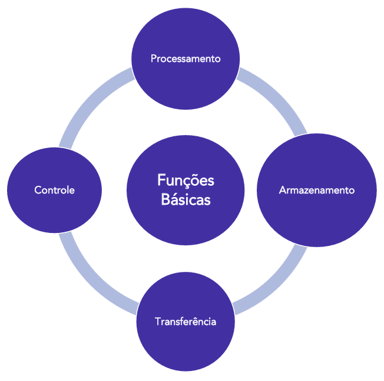

# Capítulo 1 – Introdução à Arquitetura e Organização de Computadores

Neste capítulo inaugural, mergulharemos nos conceitos que formam a base de toda a computação moderna. Iniciaremos nossa jornada definindo o que é um computador sob a ótica do processamento de dados, diferenciando os conceitos fundamentais de "dado" e "informação". Em seguida, desvendaremos os dois principais pontos de vista para o estudo de um sistema computacional: a **Arquitetura**, que define seu modelo lógico e funcional, e a **Organização**, que trata de sua implementação física. Exploraremos a evolução das arquiteturas clássicas, **Von Neumann** e **Harvard**, que moldaram os computadores como os conhecemos. Por fim, detalharemos as quatro funções essenciais de um computador e o papel vital dos **barramentos**, o sistema de comunicação que interliga todos os componentes. Ao final deste capítulo, você terá uma compreensão sólida dos pilares que sustentam o funcionamento de qualquer sistema digital.

## Computadores como Sistemas de Processamento de Dados

Desde suas origens, os computadores foram concebidos como máquinas capazes de coletar, processar e produzir informações. Durante décadas, eles foram chamados de **equipamentos de processamento eletrônico de dados**, uma expressão que sintetiza seu papel central na sociedade moderna: transformar dados em informações úteis. A manipulação dessas informações é o que chamamos de **processamento**.

Para entender essa transformação, é crucial distinguir os termos **dado** e **informação**. Embora comumente usados como sinônimos, em contextos técnicos, eles possuem significados distintos. **Dado** é a matéria-prima do processamento 3: valores brutos, não processados, coletados de uma ou mais fontes, como sensores, um teclado ou arquivos4. Já a **informação** é o produto final, o resultado do processamento; ou seja, é o dado estruturado, interpretado e contextualizado, pronto para uso em tomadas de decisão ou para alimentar novos processos computacionais5.

  

Por exemplo, imagine que um usuário digite o número "42" em um teclado. Esse número, isoladamente, é um dado. Ele não possui significado intrínseco. No entanto, após passar por cálculos no sistema — digamos, ser somado a outro número dentro de uma planilha, ser interpretado como a idade de um cliente em um cadastro, ou ser formatado como parte de um relatório financeiro — ele se torna uma informação com valor semântico e contextual. A essência do funcionamento de um computador, portanto, está nesse ciclo de entrada (coleta de dados), processamento (manipulação) e saída (apresentação da informação).

## Arquitetura e Organização: Dois Olhares Complementares

Ao estudar como um computador funciona, é essencial compreender que existem dois pontos de vista distintos, porém complementares: o da **organização** e o da **arquitetura** do computador.

A **Organização** de um computador refere-se à sua implementação física e aos detalhes de hardware. Trata-se dos aspectos técnicos e eletrônicos que dizem respeito ao projeto e à construção dos componentes — como a escolha dos circuitos, as tecnologias utilizadas na fabricação da memória, os sinais de controle que governam as micro-operações e a frequência do relógio (clock) que sincroniza as atividades internas. Esses aspectos são, em grande parte, "transparentes" para um programador de software, mas são de interesse vital para engenheiros de hardware e projetistas de sistemas.

Por exemplo, a frequência do relógio de um processador — medida em gigahertz (GHz) — determina quantas operações básicas ele pode realizar por segundo. Da mesma forma, o tipo de tecnologia usada para construir uma memória RAM (como DDR4 ou DDR5) influencia diretamente sua velocidade, capacidade e consumo energético. Esses detalhes, embora invisíveis para quem desenvolve software, são cruciais na fabricação de sistemas eficientes.

Já a **Arquitetura** de um computador refere-se ao modelo lógico de funcionamento do sistema, ou seja, aos atributos que são visíveis ao programador e que têm impacto direto no desenvolvimento de programas. Esse conceito define como os componentes interagem do ponto de vista do software:

- O **conjunto de instruções** que o processador reconhece (como `ADD`, `SUB`, `JUMP`).
- A quantidade de bits que formam uma **"palavra"** de dados (ex: 32 ou 64 bits).
- Os **modos de endereçamento** da memória (como o acesso a dados é especificado nas instruções).
- Os **tipos de dados** que o hardware pode manipular diretamente.

A arquitetura é o “contrato” entre o hardware e o software. Para ilustrar, pense na famosa arquitetura **x86**, definida pela Intel. A Intel estabeleceu os elementos característicos dessa arquitetura, de modo que um software escrito para o antigo processador 80386, lançado nos anos 1980, ainda pode funcionar em versões muito mais modernas da mesma família, como o Pentium ou um Core i9. Isso só é possível porque, embora a **organização** (a engenharia interna) de cada chip tenha mudado drasticamente, a **arquitetura** (o conjunto de instruções e o comportamento visível ao software) se manteve compatível. Essa compatibilidade retroativa é um pilar da indústria de computadores pessoais.

Uma analogia eficaz é comparar com a construção civil: a **arquitetura** do computador é como a planta de uma casa (a visão do arquiteto, focada na funcionalidade e na experiência do morador), enquanto a **organização** é como a engenharia civil por trás da obra (a escolha dos materiais, as técnicas de construção, a fiação elétrica – a parte "pesada" e de baixo nível). Ambas são necessárias, mas servem a propósitos e públicos distintos.

## A Evolução das Arquiteturas Clássicas

Os computadores modernos são herdeiros diretos de projetos pioneiros do século XX. O primeiro modelo de arquitetura amplamente reconhecido, e cuja essência perdura até hoje, é a **Arquitetura de von Neumann**, idealizada pelo matemático John von Neumann e seus colaboradores na década de 1940.

Antes dessa proposta, os computadores eram máquinas limitadas, que precisavam ser reconfiguradas fisicamente para cada nova tarefa. Von Neumann revolucionou o campo ao propor uma estrutura onde **dados e instruções (programas) seriam armazenados na mesma memória**. Essa memória única seria acessada pela Unidade Central de Processamento (CPU), que, por sua vez, conteria uma unidade de controle e uma unidade lógica e aritmética. Essa ideia transformou os computadores em máquinas de propósito geral, flexíveis e programáveis. Vale ressaltar que a memória secundária (como HDs) não costuma aparecer em diagramas clássicos do modelo, que geralmente mostram apenas "Memória" de forma genérica.

Apesar de sua genialidade e simplicidade, o compartilhamento de um único barramento (caminho de comunicação) entre a CPU e a memória para buscar tanto dados quanto instruções introduz um gargalo de desempenho conhecido como **von Neumann bottleneck**. Como o processador não pode ler uma instrução e ler/escrever um dado ao mesmo tempo, essas operações se tornam sequenciais, limitando a velocidade máxima do sistema.

Como uma solução para este gargalo, surgiu a **Arquitetura de Harvard**. Originalmente desenvolvida para microcontroladores que exigiam maior velocidade, sua característica distintiva é a utilização de **duas memórias fisicamente separadas**: uma exclusivamente para instruções (o programa) e outra para dados. Cada memória possui seu próprio barramento de comunicação com o processador.

Essa separação permite que a CPU acesse dados e instruções de forma simultânea. Por exemplo, enquanto uma instrução de soma está sendo executada (acessando a memória de dados para obter os operandos), o processador já pode buscar a próxima instrução na memória de programa. Isso resulta em um desempenho superior, pois paraleliza operações que seriam sequenciais em um modelo Von Neumann.

Hoje, a Arquitetura de Harvard é amplamente utilizada em processadores de sinais digitais (DSPs) e microcontroladores. Um exemplo prático é um forno de micro-ondas: ele precisa responder rapidamente aos comandos do painel (dados de entrada) enquanto executa com precisão o programa de controle de tempo e potência (instruções). Além disso, os princípios de Harvard são adotados em computadores modernos de forma híbrida: embora a memória RAM principal siga o modelo Von Neumann, as **memórias cache** internas ao processador (L1, L2, L3) são frequentemente divididas em cache de instruções e cache de dados, aplicando o conceito de Harvard para acelerar o acesso.

## Funções Fundamentais de um Sistema Computacional

Independentemente da arquitetura adotada, todos os computadores, desde supercomputadores até dispositivos embarcados, executam quatro funções básicas e interdependentes:

- **Processamento de dados**: É a função central, realizada pela **CPU (Unidade Central de Processamento)**. A CPU é o cérebro do computador, contendo internamente a **Unidade Lógica e Aritmética (ULA)**, que realiza operações matemáticas (soma, subtração) e lógicas (E, OU, NÃO), e a **Unidade de Controle (UC)**, que interpreta as instruções do programa e orquestra as ações de todos os outros componentes. A CPU também possui **registradores**, que são pequenas e ultrarrápidas memórias para armazenamento temporário de dados e instruções em uso.
- **Armazenamento de dados**: Essencial para guardar tanto os programas quanto os dados sobre os quais eles operam. O armazenamento é hierárquico:
    - **Armazenamento temporário**: Realizado pela **memória principal (RAM)**, que é volátil e guarda informações apenas enquanto o computador está ligado e os dados estão em uso pelo processador.
    - **Armazenamento de longo prazo**: Realizado pela **memória secundária** (HDs, SSDs, pen drives), que não é volátil e armazena dados e programas permanentemente.
- **Transferência de dados**: É a movimentação de informações entre o computador e o mundo exterior ou entre seus componentes internos. Isso é feito por meio de dispositivos de Entrada e Saída (E/S) e seus sistemas de interconexão. Essa função abrange desde a leitura de um caractere do teclado até a transmissão de um arquivo por uma rede de computadores.
- **Controle**: Esta função é gerenciada pela Unidade de Controle (UC) dentro da CPU. Ela é responsável por gerenciar os recursos do computador e garantir que as instruções sejam executadas na sequência correta, coordenando as outras três funções. A UC envia sinais de controle para a memória, a ULA e os dispositivos de E/S, ditando o fluxo de dados e operações em todo o sistema.

## Barramentos: O Sistema Nervoso do Computador

Para que as funções de processamento, armazenamento e transferência ocorram de forma integrada, os componentes do computador precisam se comunicar. Essa comunicação acontece através dos **barramentos**, um conjunto de vias elétricas que interligam a CPU, a memória e os controladores dos dispositivos periféricos, formando o "sistema nervoso" do computador.

O barramento do sistema é tipicamente dividido em três tipos funcionais:

- **Barramento de Dados**: Transporta os dados entre a CPU, a memória e os periféricos. A largura deste barramento (o número de linhas/fios) determina quantos bits podem ser transferidos simultaneamente. Um barramento de 64 bits, por exemplo, pode transferir 64 bits (ou 8 bytes) de uma só vez, oferecendo um desempenho muito maior que um barramento de 32 bits.
- **Barramento de Endereços**: Especifica a origem e o destino dos dados. Quando a CPU quer ler ou escrever em uma posição da memória, ela coloca o endereço dessa posição no barramento de endereços. A largura deste barramento determina a quantidade máxima de memória que o sistema pode endereçar. Por exemplo, um barramento de 32 bits pode endereçar 232 posições de memória (4 Gigabytes).
- **Barramento de Controle**: Gerencia o acesso e o uso dos outros dois barramentos. Ele transporta sinais de comando e temporização que sincronizam as operações. Por exemplo, sinais como "leitura de memória", "escrita em memória" ou "requisição de interrupção" são transmitidos por aqui. As linhas de controle são cruciais para coordenar o fluxo e garantir que os componentes não tentem usar o barramento de dados ao mesmo tempo, evitando conflitos.

## Considerações Finais

Neste primeiro capítulo, estabelecemos os alicerces para o estudo da Arquitetura e Organização de Computadores. Apresentamos o computador como um sistema de processamento, diferenciamos os conceitos cruciais de arquitetura (a visão lógica) e organização (a implementação física), e exploramos os modelos históricos de von Neumann e Harvard, cujos princípios ainda definem os sistemas atuais. Além disso, detalhamos as quatro funções básicas de um computador e o papel fundamental dos barramentos como sistema de comunicação interna.

Compreender esses pilares é o passo inicial e essencial para aprofundar o estudo das estruturas internas dos sistemas computacionais. Nos capítulos seguintes, exploraremos detalhadamente cada um desses componentes — processadores, hierarquia de memórias, dispositivos de entrada e saída — sempre com ênfase no seu funcionamento, nas suas implicações para o desempenho e em exemplos práticos de sua aplicação.