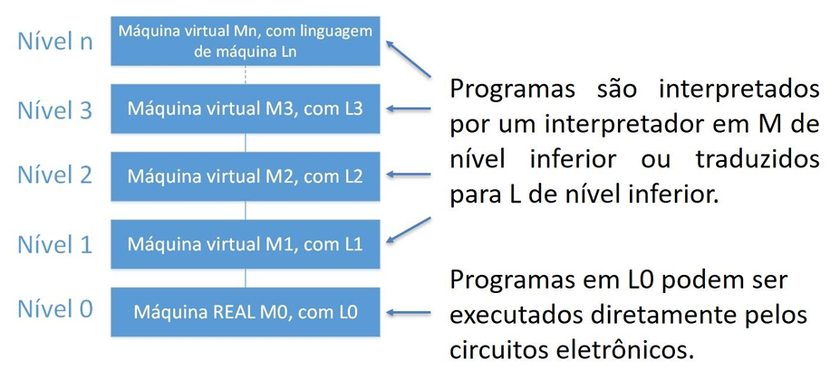
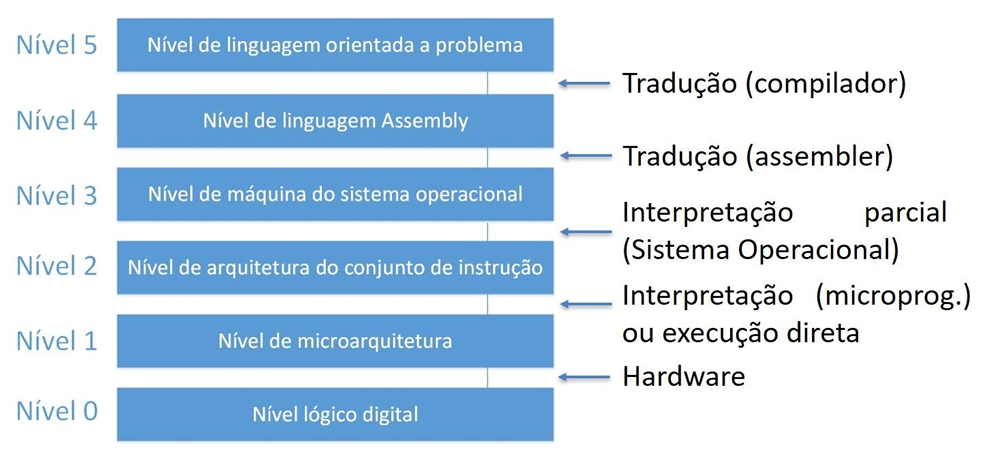

# Capítulo 3 – Hardware e Software

## Relação entre Hardware e Software

Um sistema computacional é composto por duas grandes partes interdependentes: o **hardware** e o **software**. O **hardware** refere-se à parte física do computador: os circuitos, chips, placas, memórias, cabos, conectores, teclado, monitor, impressoras e outros dispositivos que fazem parte da estrutura tangível da máquina. Já o **software** corresponde à parte lógica e intangível, ou seja, aos programas e sistemas que comandam o hardware para que ele execute tarefas úteis.

A interação entre hardware e software é a essência do funcionamento de qualquer computador. O hardware, por si só, não executa nenhuma tarefa significativa sem o controle de programas. Por outro lado, o software precisa do hardware para ser executado. Essa interdependência é o que torna possível o funcionamento eficiente de sistemas computacionais, dos mais simples aos mais complexos.

Mas como, exatamente, o software consegue "comandar" o hardware? Para responder a essa pergunta, é necessário entender que o software é escrito em **linguagens de programação**, que precisam ser convertidas em uma linguagem que o hardware compreenda: a **linguagem de máquina**. Esse processo é feito por programas especiais chamados **compiladores**, **interpretadores**, **montadores** ou **tradutores**, dependendo do tipo de linguagem utilizada.

Por exemplo, um programa escrito em linguagem Python precisa ser traduzido para uma série de instruções que o processador seja capaz de entender. Essas instruções são compostas por sequências de bits (0s e 1s), que ativam circuitos eletrônicos dentro da Unidade Central de Processamento (CPU) para realizar operações como somar, comparar, mover dados e outras ações fundamentais.

## Máquina Multinível

Para facilitar a compreensão do funcionamento de um sistema computacional moderno, costuma-se representá-lo de forma hierárquica, dividindo-o em vários **níveis de abstração**. Cada nível possui uma função específica e fornece uma **interface simplificada** para o nível imediatamente superior. Essa organização é chamada de **modelo de máquina multinível**.

O modelo de máquina multinível permite que diferentes profissionais (como engenheiros de hardware, programadores de baixo nível e desenvolvedores de software) atuem em níveis distintos de abstração, cada um com seu próprio conjunto de ferramentas, linguagens e objetivos, mas todos interagindo com um mesmo sistema computacional. Basicamente temos duas técnicas:

- **Tradução**: Executa um programa escrito em L1 (nível 1), substituindo cada instrução por uma sequência equivalente de instruções em L0 (nível 0);
- **Interpretação**: Escreve-se um programa em L0 que considere os programas em L1 como dados de entrada e os executa, uma instrução por vez, sem criar um novo programa em L0.

Abaixo podemos ver uma estrutura em níveis de uma forma genérica.

  

A seguir, podemos ver uma estrutura em níveis de máquinas contemporâneas e na sequência uma breve descrição dos principais níveis da máquina multinível:

  

### Nível 0 – Nível Lógico Digital

Neste nível mais fundamental, encontramos os **circuitos lógicos digitais**, formados por **portas lógicas** (AND, OR, NOT, etc.), flip-flops e outros componentes eletrônicos básicos. Esses circuitos constituem o **hardware físico**, responsável pelo comportamento elétrico que sustenta toda a execução computacional, são essas portas que formam componentes mais complexos, como somadores, multiplexadores, registradores e a própria UCP. As operações realizadas neste nível são puramente elétricas, regidas por sinais binários presentando os valores 0 (desligado) e 1 (ligado).

- **Responsável**: Hardware.
- **Tecnologia**: Transistores, portas lógicas, flip-flops.

### Nível 1 – Nível da Microarquitetura

Neste nível, as estruturas eletrônicas construídas no nível digital lógico são organizadas para formar as **unidades funcionais** do processador, responsáveis por executar instruções básicas. A CPU (Unidade Central de Processamento), por exemplo, é composta pela Unidade de Controle, pela Unidade Lógica e Aritmética (ULA), pelos registradores e pelo barramento interno. Neste nível, uma **microprogramação** pode ser utilizada para interpretar as instruções da arquitetura (nível 2), ou, em arquiteturas mais simples, as instruções são executadas diretamente.

- **Responsável**: Microprogramação (interpretação) ou execução direta.
- **Exemplo**: Execução interna da instrução `ADD` nos registradores.

### Nível 2 – Nível de Arquitetura do Conjunto de Instruções

Esse nível define o **conjunto de instruções (ISA – Instruction Set Architecture)** que o processador entende, como `MOV`, `ADD`, `SUB`, etc. É neste nível que o **programador de baixo nível** atua. As instruções aqui definidas são interpretadas ou executadas pela microarquitetura. É o ponto de contato entre o software e o hardware. Essas instruções são codificadas como sequências de bits (por exemplo, `10011011`) e interpretadas pelo hardware graças à estrutura estabelecida nos níveis anteriores.

- **Responsável**: CPU (via microarquitetura).
- **Exemplo**: Instruções Assembly.
- **Observação**: Este nível pode ser parcialmente interpretado pela microarquitetura ou microprogramado.

### Nível 3 – Nível de Máquina do Sistema Operacional

Neste nível, entra em cena o **sistema operacional**, que implementa instruções mais complexas, chamadas de **instruções de máquina virtual** ou **instruções interpretadas**, como chamadas de sistema (`open`, `read`, `write`, etc.). Essas instruções não fazem parte do ISA do processador, mas são interpretadas pelo sistema operacional para fornecer funcionalidades ao usuário.

- **Responsável**: Sistema Operacional.
- **Processo**: Interpretação parcial.
- **Exemplo**: Chamadas de sistema, manipulação de arquivos.

### Nível 4 – Nível da Linguagem de Montagem (Assembly)

Embora seja possível programar diretamente em linguagem de máquina, isso é extremamente trabalhoso e propenso a erros. Para facilitar, foi criada a **linguagem de montagem**, ou **Assembly**, que representa cada instrução de máquina com um **mnemônico**, como `ADD` (adição), `SUB` (subtração), `MOV` (movimentação de dados), entre outros.

O Assembly é uma representação textual próxima do código de máquina, permitindo que humanos escrevam instruções do nível 2 de forma mais compreensível. O código Assembly é **traduzido (montado)** para linguagem de máquina por um programa chamado **montador** ou **assembler**. Ainda que Assembly seja mais legível do que código binário, continua sendo uma linguagem de baixo nível, voltada para tarefas específicas e com controle direto sobre o hardware.

- **Responsável**: Montador (assembler).
- **Processo**: Tradução.
- **Exemplo**: `MOV AX, 01h`

### Nível 5 – Nível das Linguagens Orientadas a Problemas

Com o avanço da computação, surgiram linguagens de programação mais próximas da linguagem humana, chamadas de **linguagens de alto nível**. Exemplos incluem Pascal, C, Java, Python e muitas outras. Essas linguagens permitem que o programador se concentre na lógica do problema, sem se preocupar com detalhes da arquitetura do processador ou com instruções de máquina. Os programas escritos em linguagens de alto nível precisam ser convertidos para linguagem de máquina por **compiladores** (que traduzem todo o código de uma vez) ou **interpretadores** (que traduzem e executam o código linha por linha).

- **Responsável**: Compilador (tradução) ou interpretador (execução).
- **Exemplo**: `print("Olá, mundo!")`

Alguns ainda consideram um nível superior, que eleva ainda mais a abstração. Ele é representado por linguagens e ferramentas voltadas para **resolução de problemas específicos**, como linguagens de consulta a banco de dados (SQL), planilhas eletrônicas, ambientes de análise de dados (como R e MATLAB), entre outros.

Nesse nível, o usuário não precisa conhecer algoritmos, lógica de programação ou estruturas de dados, pois a ferramenta ou linguagem já incorpora esses elementos internamente, permitindo uma interação ainda mais direta com o problema a ser resolvido.

## Considerações Finais

O modelo de máquina multinível mostra como o funcionamento de um computador é dividido em camadas, desde os circuitos eletrônicos até as linguagens voltadas a usuários finais. Cada nível abstrai a complexidade do nível inferior, tornando possível que diferentes profissionais desenvolvam soluções em diferentes graus de abstração. Ao compreender essa estrutura, ganhamos uma visão mais ampla e fundamentada sobre como os softwares são executados nos sistemas computacionais.
