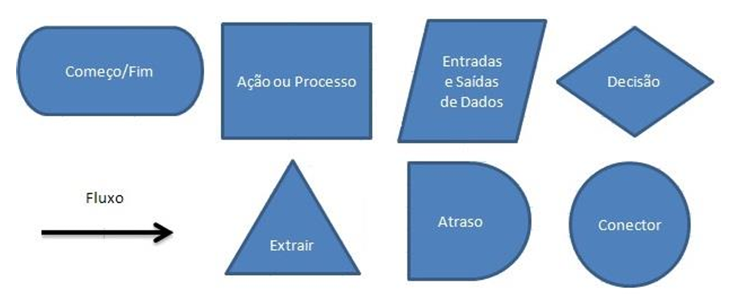

# Capítulo 4 – Algoritmos e Linguagens de Programação de Alto Nível

## O Pensamento Algorítmico: da Ideia ao Código

Quando falamos em computadores, tendemos a pensar imediatamente em tecnologia avançada, circuitos, chips e softwares sofisticados. No entanto, por trás de toda essa complexidade está um conceito fundamental, simples e poderoso: o algoritmo. A programação e, por consequência, o funcionamento dos computadores, baseia-se na construção de algoritmos — passos bem definidos para resolver problemas.

A jornada de resolução computacional de um problema começa no nível mais alto possível: a mente humana. É o ser humano quem identifica uma necessidade ou desafio, desenvolve uma solução lógica e transforma essa solução em uma sequência de passos claros e finitos: o algoritmo. Somente após essa elaboração conceitual é que partimos para a implementação do algoritmo por meio de uma linguagem de programação, seja de alto ou baixo nível.

Um exemplo simples ajuda a ilustrar o conceito. Imagine que você deseja preparar um bolo de laranja. Para isso, você consulta uma receita: uma lista de ingredientes e uma sequência detalhada de etapas para misturá-los e assar a massa. Essa receita é, essencialmente, um algoritmo. O “problema” é a ausência de um bolo; a “solução” é seguir um conjunto de passos que leva ao produto final. Curiosamente, assim como existem várias formas de preparar um bolo de laranja, também existem várias formas de resolver um mesmo problema computacional por meio de diferentes algoritmos.

## O Que é um Algoritmo?

Do ponto de vista matemático, um algoritmo é uma sequência finita de regras ou operações que, aplicadas a um conjunto de dados, resolve um problema ou classe de problemas. Já na computação, definimos algoritmo como um conjunto de regras e procedimentos lógicos perfeitamente definidos, que levam à solução de um problema em um número finito de etapas.

O aspecto mais importante de um algoritmo é a clareza e a ausência de ambiguidades. Um ser humano pode interpretar uma instrução mal formulada e ainda assim realizar a ação corretamente. Um computador, por outro lado, depende de instruções absolutamente precisas. Um erro ou ambiguidade pode resultar em falhas de execução ou comportamentos inesperados.

Além da clareza, é importante compreender que os algoritmos manipulam dados armazenados na memória por meio de variáveis — nomes simbólicos associados a posições de memória. Em nossa analogia da receita de bolo, as variáveis são os ingredientes, e o programa (escrito em alguma linguagem de programação) é o texto da receita.

Portanto, a lógica de um programa é a representação formal de um algoritmo. Essa representação pode ser escrita em pseudocódigo, fluxogramas ou linguagens de programação, como veremos a seguir.

## Tipos de Algoritmos: Recursão e Iteração

Um mesmo problema pode ser resolvido de maneiras distintas, dependendo da abordagem adotada. No campo da programação, destacam-se duas formas principais de implementar algoritmos: a abordagem **recursiva** e a abordagem **iterativa**.

### Algoritmos Recursivos

A recursão é uma técnica que consiste em uma função que se chama a si mesma para resolver subproblemas menores. É como olhar para um espelho colocado na frente de outro — a imagem se repete infinitamente, mas cada vez menor. Em termos computacionais, a recursão é útil para problemas que apresentam estrutura repetitiva e podem ser resolvidos ao quebrar o problema em versões menores de si mesmo.

Um exemplo clássico é o cálculo do fatorial de um número natural nn, definido como:

  $0! = 1$
  $n!=n × (n - 1)!$

Esse conceito se traduz de forma elegante em código:

```python
def fatorial(n):
    if n == 0:
        return 1
    return n * fatorial(n - 1)
```

Nesse algoritmo, a função `fatorial` se chama novamente com o valor `n - 1`, até que `n` atinja o valor 0, que é o caso base. Essa implementação reflete diretamente a definição matemática do fatorial.

A principal vantagem da recursão é a clareza conceitual: a implementação se assemelha muito à definição formal do problema. No entanto, a desvantagem está no desempenho. Como cada chamada recursiva requer uma nova entrada na pilha de execução, problemas mal modelados recursivamente podem gerar consumo excessivo de memória ou trabalho repetido.

### Algoritmos Iterativos

A iteração, por sua vez, resolve o problema por meio de repetições controladas, utilizando estruturas de repetição como `for` ou `while`. O mesmo problema do fatorial pode ser resolvido de forma iterativa:

```python
def fatorial_iterativo(n):
    resultado_fatorial = 1
    for i in range(1, n + 1):
        resultado_fatorial *= i
    return resultado_fatorial
```

Ou ainda:

```python
def fatorial_iterativo(n):
    resultado_fatorial = 1
    while n:
        resultado_fatorial *= n
        n -= 1
    return resultado_fatorial
```

A diferença está na abordagem: enquanto a recursão divide o problema em subproblemas, a iteração simplesmente repete um bloco de código até atingir a condição de parada. Em termos de desempenho, algoritmos iterativos tendem a ser mais eficientes, pois evitam a sobrecarga de chamadas recursivas.

## Representação de Algoritmos com Fluxogramas

Além da representação textual por meio de pseudocódigo ou linguagens de programação, os algoritmos também podem ser representados visualmente através de fluxogramas. Um fluxograma é um diagrama que utiliza símbolos gráficos para ilustrar a sequência de etapas de um algoritmo.

Entre os símbolos mais utilizados estão:

<div align="center">
  
</div>

Com esses elementos, é possível representar visualmente a lógica de um algoritmo de forma intuitiva. Esse tipo de representação é especialmente útil no ensino da lógica de programação, facilitando a compreensão dos passos executados pelo computador.

## Da Lógica ao Código: Linguagens de Programação

Um algoritmo é apenas um plano lógico. Para que o computador possa executá-lo, é necessário traduzi-lo para uma linguagem que ele entenda. Surge então o conceito de **linguagem de programação**: um conjunto de regras sintáticas e semânticas utilizadas para descrever algoritmos de forma precisa.

As linguagens de programação permitem que o programador defina:

- Quais dados serão manipulados;
- Como esses dados serão processados;
- Em que ordem as ações devem ocorrer.

A principal vantagem das linguagens de alto nível é a **produtividade**. Elas permitem descrever algoritmos com maior clareza, facilitando a escrita, leitura e manutenção dos programas. Além disso, por serem portáveis, um mesmo código pode ser executado em diferentes plataformas com poucas ou nenhuma modificação.

Um ponto importante é que o computador não entende diretamente o código escrito em linguagens de alto nível. Esse código (código-fonte) precisa ser traduzido para **linguagem de máquina**. Essa tradução pode ocorrer de duas formas:

- **Compilação**: o código-fonte é totalmente convertido em código de máquina antes da execução. Exemplo: linguagens como C, C++ e Java.
- **Interpretação**: o código é lido e executado linha por linha por um interpretador. Exemplo: Python, Ruby.

## Paradigmas de Programação

As linguagens de programação se agrupam em diferentes **classificações** e **paradigmas** — estilos ou modelos de programação que influenciam a estrutura e organização dos programas.

- **Programação estruturada**: é uma forma de programação que preconiza que todos os programas possíveis podem ser reduzidos a apenas três estruturas: sequência, decisão e repetição. A programação estruturada orienta os programadores para a criação de estruturas simples em seus programas, usando as sub-rotinas e as funções.
- **Programação modular**: é uma forma de programação no qual o desenvolvimento das rotinas de programação é feito através de módulos, que são interligados através de uma interface comum.
- **Programação orientada a objetos (POO)**: é um paradigma de análise, projeto e programação de sistemas de software baseado na composição e interação entre diversas unidades de software chamadas de objetos. O extensivo uso de objetos, particularmente em conjunção com o mecanismo de herança, caracteriza o estilo de programação orientada a objetos.
- **Programação linear**: em matemática, problemas de programação linear são problemas de otimização nos quais a função objetivo e as restrições são todas lineares. Trata-se de um tipo de programação mais complexo.

Diferentes linguagens de programação podem ser agrupadas segundo o **paradigma** que seguem para abordar a sua sintaxe e semântica. Os paradigmas se dividem em dois grandes grupos: **imperativo** e **declarativo**.

Os paradigmas imperativos são aqueles que facilitam a computação por meio de mudanças de estado e são divididos em:

- **Paradigma procedural**: os programas são executados através de chamadas sucessivas a procedimentos separados. Exemplos: Fortran e BASIC;
- **Paradigma de estruturas de blocos**: possui como característica principal os escopos aninhados. Exemplos: Pascal e C;
- **Paradigma de orientação a objetos**: descreve linguagens que suportam a interação entre objetos. Exemplos: C++, Java e Python;
- **Paradigma da computação distribuída**: suporta que mais de uma rotina possa ser executada independentemente. Exemplo: Ada.

Os paradigmas declarativos são aqueles nos quais um programa especifica uma relação ou função, ou seja, descrevem o que deve ser feito, não como fazer. Dividem-se em:

- **Paradigma funcional**: linguagens que não incluem qualquer provisão para atribuição ou dados mutáveis. O mapeamento entre os valores de entrada e saída são alcançados mais diretamente. Um programa é uma função (ou grupo de funções), tipicamente constituída de outras funções mais simples. Exemplo: Lisp;
- **Paradigma da programação lógica**: baseia-se na noção de que um programa implementa uma relação ao invés de um mapeamento. Exemplo: Prolog.

Quanto a estrutura de tipos, as linguagens de programação podem ser definidas de duas formas:

- **Fortemente tipada**: quando o tipo da variável se mantém o mesmo até ser descartada da memória, ou seja, se uma variável foi declarada como inteiro, ela não pode receber outro tipo de dado. Exemplos: Java e Python.
- **Fracamente tipada**: quando o tipo da variável muda dinamicamente conforme a situação, ou seja, uma variável pode receber um valor do tipo inteiro, depois string, e por aí vai. Exemplo: PHP.

Em relação a ser dinâmica ou estaticamente tipada:

- **Estática**: os tipos são definidos em tempo de compilação. Ex: C, Java.
- **Dinâmica**: os tipos são definidos em tempo de execução. Ex: Python, Ruby e Perl.

## Teste de Mesa: A Arte de Simular um Programa

O teste de mesa é uma técnica que permite simular a execução de um algoritmo, passo a passo, anotando os valores das variáveis à medida que as instruções são executadas. É uma ferramenta útil para identificar erros lógicos ou para compreender o funcionamento de algoritmos desconhecidos.

Considere o seguinte pseudocódigo:

```
inteiro a, b, soma, diferenca
escreva("Digite dois números inteiros\n")
leia(a, b)
soma = a + b
diferenca = a - b
escreva("A diferença dos dois números é ", diferenca, "\n")
```

O teste de mesa fazendo o companhamento de múltiplas execuções do código seria:

|a|b|soma|diferenca|
|---|---|---|---|
|4|3|7|1|
|20|10|30|10|
|10|15|25|-5|

Esse tipo de análise é bastante utilizado no ensino de lógica de programação e em ambientes de depuração, sendo uma forma simples e eficaz de verificar o comportamento esperado do código.

## Considerações Finais

Neste capítulo, discutimos a importância das **linguagens de programação de alto nível** como instrumento essencial para o desenvolvimento de algoritmos e a construção de soluções computacionais. Essas linguagens, por serem mais próximas da linguagem humana e independentes da arquitetura física da máquina, desempenham um papel fundamental na **abstração da complexidade do hardware**.

Exploramos como os algoritmos — conjuntos bem definidos de passos — podem ser expressos de maneira clara e estruturada, onde apesar de não interagirmos diretamente com o hardware ao escrever um programa em alto nível, esse código será eventualmente **traduzido para níveis inferiores** até ser compreendido pelo processador.

Outro ponto importante foi o entendimento de que diferentes linguagens atendem a diferentes paradigmas e objetivos. Algumas são mais indicadas para aplicações científicas, outras para desenvolvimento de sistemas, outras ainda para aplicações web, inteligência artificial, jogos, entre muitos outros domínios. Essa diversidade demonstra a **evolução das linguagens de programação como resposta às crescentes demandas do mundo real**.
