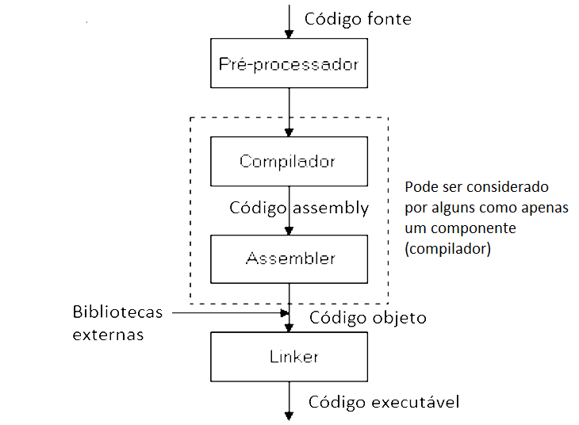
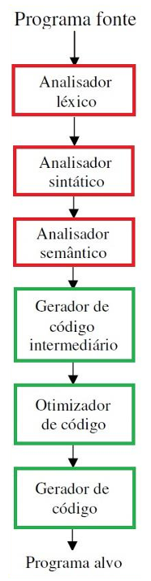
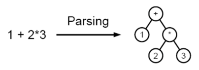

# Capítulo 6 – Compiladores, Montadores, Ligadores e Interpretadores

Nos capítulos anteriores, viajamos desde as linguagens de alto nível, onde algoritmos são expressos, até as linguagens de baixo nível, o dialeto nativo do processador. Agora, vamos desvendar os mecanismos que tornam essa comunicação possível. Este capítulo é dedicado aos "artesãos" do software: as ferramentas que traduzem, unem e executam nosso código.

Estudaremos o **compilador**, o grande arquiteto que converte a lógica humana em um plano técnico; o **montador**, o especialista que transforma esse plano nos blocos de construção binários; o **ligador**, o mestre de obras que une esses blocos e os conecta a bibliotecas externas; e o **interpretador**, que adota uma abordagem diferente, executando o plano instrução por instrução, em tempo real. Compreender o papel de cada um é fundamental para dominar o ciclo de vida completo de um programa.

## O Caminho da Linguagem de Alto Nível ao Executável

Linguagens de programação de alto nível como C, Pascal ou Python foram desenvolvidas com o objetivo de facilitar a escrita de programas por seres humanos. Elas são mais legíveis, portáveis e expressivas do que a linguagem de máquina, mas precisam ser traduzidas para que o processador possa compreendê-las.

Esse processo de tradução pode ocorrer por meio de **compilação** ou **interpretação**, com o apoio de ferramentas como **montadores** e **ligadores**. No caso de linguagens como C, há várias etapas envolvidas: o código fonte é analisado, convertido para uma linguagem intermediária, otimizado, transformado em código objeto (geralmente em Assembly), montado e, finalmente, ligado a outras bibliotecas para gerar um executável.

Esse caminho, que pode parecer complexo, é essencial para garantir que programas de alto nível possam ser executados com desempenho e confiabilidade. A figura a seguir resume esse percurso:

<div align="center">
  
</div>

Cada uma dessas etapas será discutida em detalhes nas próximas seções.

## Compilador: Tradutor de Alto Desempenho

O **compilador** é o principal responsável por converter o código escrito em uma linguagem de alto nível em um formato que o processador possa entender — geralmente, código de máquina ou código Assembly. Essa tradução ocorre **antes da execução**, e o resultado final é um arquivo executável.

<div align="center">
  
</div>

A compilação pode ser dividida em **duas grandes fases**: **análise** (compreensão do código-fonte, em vermelho) e **síntese** (geração de código, em verde). Cada fase envolve várias etapas internas, que veremos a seguir.

### Etapas da Compilação

#### a) Análise Léxica

O **analisador léxico**, também chamado de **scanner**, é o primeiro componente do compilador. Ele varre o código-fonte da esquerda para a direita, agrupando os caracteres em unidades chamadas **tokens**, que representam elementos com significado próprio — como palavras-chave, operadores, identificadores, constantes e delimitadores.

Por exemplo, considere a linha:

```c
if (x == 10) {
```

Ela será dividida em tokens como:

- `"if"` → palavra-chave
- `"("` → delimitador
- `"x"` → identificador
- `"=="` → operador lógico
- `"10"` → constante
- `")"` e `"{"` → delimitadores

Essa etapa elimina espaços em branco, comentários e valida a composição básica dos elementos do código.

#### b) Análise Sintática

Na sequência, o **analisador sintático** (ou **parser**) recebe a sequência de tokens e verifica se sua organização respeita as regras da linguagem. Ele constrói uma **árvore sintática**, também chamada de **árvore de derivação**, representando a estrutura gramatical do código.

Por exemplo, ao analisar a expressão `1 + 2 * 3`, o parser identifica que a multiplicação tem prioridade sobre a adição, construindo a seguinte estrutura:

<div align="center">
  
</div>

A análise sintática cuida exclusivamente da **forma** das sentenças.

#### c) Análise Semântica

Com a estrutura construída, entra em cena o **analisador semântico**, que verifica **o significado** do código. Ele valida, por exemplo, se variáveis foram declaradas antes do uso, se tipos de dados são compatíveis em uma operação, se há conflitos de escopo ou usos indevidos de identificadores. Por exemplo, um erro semântico seria tentar somar uma string com um número inteiro em C, como `3 + "texto"`.

Além disso, essa etapa geralmente constrói uma representação intermediária do programa, chamada de **código intermediário**.

#### d) Geração de Código Intermediário

O **código intermediário** serve como uma ponte entre as fases de análise e síntese. Ele não depende diretamente da arquitetura do processador, mas representa as instruções de forma simplificada e padronizada.

Um exemplo de código intermediário para a instrução `x = a + b * c` pode ser:

```
T = b * c
x = a + T
```

Esse formato facilita a portabilidade do compilador entre arquiteturas diferentes.

#### e) Otimização de Código

A etapa de **otimização**, embora opcional, é extremamente importante para o desempenho. Ela transforma o código intermediário em uma versão mais eficiente, sem alterar sua lógica. Os ganhos podem estar relacionados a:

- **Tempo de execução**: reduzindo o número de instruções ou operações.
- **Espaço de memória**: eliminando variáveis ou instruções redundantes.
- **Eficiência energética**: reduzindo acessos desnecessários à memória.

Exemplo de otimização:

```c
x = 2 * 4;
```

Pode ser transformado diretamente em:

```c
x = 8;
```

#### f) Geração de Código

Por fim, o compilador converte o código intermediário (já otimizado) para o **código da arquitetura alvo** (como x86, ARM, MIPS etc.), gerando o **programa objeto**. Este ainda não é o executável final, pois pode depender de outras bibliotecas ou arquivos.

### Variantes de Compilação

Além do compilador tradicional, há variantes importantes:

- **Compilador cruzado (Cross Compiler)**: executa em uma plataforma, mas gera código para outra. Por exemplo, um compilador rodando em Linux que gera código para Windows.
- **Compilação Just-In-Time (JIT)**: utilizada em linguagens como Java. O código é compilado em tempo de execução, convertendo **bytecodes** em **código nativo** no momento da execução para melhorar a performance.

## Montador: Tradutor de Assembly para Código Objeto

O **montador**, ou **assembler**, é o responsável por traduzir o código Assembly em **código objeto**, ou seja, uma versão binária do programa que já pode ser parcialmente executada pela CPU.

Na prática, um código escrito em Assembly como:

```asm
MOV AX, 0005h
ADD AX, 0003h
```

É convertido em uma sequência de instruções de máquina como:

```
10111000 00000101
00000101 00000011
```

Nos sistemas Unix-like, os arquivos resultantes dessa tradução geralmente têm a extensão `.o`.

Vale ressaltar que muitos compiladores modernos já incluem o montador em seu processo interno, gerando o código objeto diretamente a partir do código-fonte em C, por exemplo. No entanto, para fins didáticos, é essencial conhecer essa separação de responsabilidades.

## Ligador: Montando o Programa Final

O **ligador**, também conhecido como **link-editor** ou **linker**, é o componente que une vários arquivos objeto (gerados por compiladores e montadores) em um único **arquivo executável**. Além de unir os arquivos, ele resolve **referências externas** — por exemplo, chamadas a funções que estão em bibliotecas ou em outros módulos.

Imagine que um programa utiliza a função `printf()` da linguagem C. Essa função está definida na biblioteca `stdio.h`. O linker garante que o código objeto do programa seja unido corretamente ao código necessário para que `printf()` funcione. Quando o programador utiliza a diretiva `#include`, ele está incluindo a definição das funções; o código propriamente dito dessas funções será anexado durante o processo de linkedição.

É importante destacar a diferença entre dois tipos de bibliotecas:

- **Bibliotecas estáticas**: são incluídas no executável final em tempo de compilação, o que pode aumentar o tamanho do arquivo final.
- **Bibliotecas dinâmicas (DLLs ou .so)**: são carregadas em **tempo de execução**, permitindo que o programa use funcionalidades externas sem incorporá-las diretamente ao executável. Isso economiza espaço e facilita atualizações.

## Interpretador: Execução em Tempo Real

Ao contrário do compilador, que gera um arquivo executável, o **interpretador** lê o código-fonte e **executa diretamente as instruções, uma a uma**, sem gerar um executável intermediário.

Esse processo é mais lento do que a execução de um código compilado, pois cada linha precisa ser analisada e executada no momento da execução. No entanto, interpretadores oferecem maior flexibilidade e são úteis em linguagens voltadas para prototipagem rápida, automação de tarefas e scripts.

Exemplos clássicos de linguagens interpretadas incluem: **Python**, **BASIC**, **Perl** e **JavaScript**. Além disso, os **shells Unix/Linux** como o Bash também funcionam como interpretadores.

Em um exemplo simples de código Python como o seguinte:

```python
print("Olá, mundo!")
```

O interpretador Python lê essa instrução e imediatamente imprime a mensagem, sem compilar o programa por completo.

Linguagens como **Java** adotam um modelo híbrido: o código-fonte é **compilado para Bytecode**, que é então **interpretado pela Máquina Virtual Java (JVM)**. Em ambientes mais modernos, o bytecode pode ser convertido em código nativo em tempo de execução com a técnica **JIT**.

## Considerações Finais

Ao longo deste capítulo, desmistificamos o processo que transforma um simples arquivo de texto em um programa funcional. Vimos que o caminho do código-fonte à execução é uma linha de montagem sofisticada, onde cada ferramenta desempenha um papel crucial e insubstituível. 

O **compilador** e o **interpretador** representam duas filosofias distintas: a primeira, focada na otimização e no desempenho bruto da execução nativa; a segunda, na flexibilidade e na agilidade do desenvolvimento. O **montador** atua como o tradutor final para a linguagem da máquina, enquanto o **ligador** resolve o quebra-cabeça da modularidade, permitindo que nossos programas reutilizem códigos e se conectem a ecossistemas de bibliotecas.

Dominar esses conceitos nos capacita a tomar decisões de arquitetura mais informadas, depurar problemas complexos e entender por que certos programas são mais rápidos ou portáveis que outros. Em última análise, deixamos de ser meros usuários de linguagens para nos tornarmos engenheiros conscientes de todo o processo de construção do software, do conceito à execução no silício.