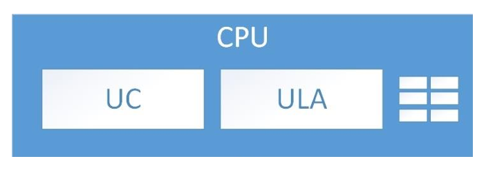

# Capítulo 7 – Unidade Central de Processamento (CPU)

A Unidade Central de Processamento, conhecida pela sigla **CPU** (Central Processing Unit), é frequentemente chamada de **cérebro do computador**. Essa denominação, embora metafórica, não é exagerada: a CPU é o componente responsável por interpretar e executar as instruções que compõem os programas. É ela quem lê as ordens armazenadas na memória principal, decodifica seu significado e realiza as ações necessárias para seu cumprimento. Toda atividade significativa em um sistema computacional — desde os cálculos mais simples até o controle de periféricos — passa, direta ou indiretamente, pela CPU.

Neste capítulo, vamos estudar os componentes internos da CPU, entender como ela se comunica com os demais elementos do sistema, e como executa, passo a passo, o chamado **ciclo de instrução**. Também abordaremos os tipos de registradores utilizados, o papel das interrupções e até mesmo a questão prática da instalação física dos processadores em placas-mãe.

## Estrutura Interna da CPU

Embora os avanços tecnológicos tenham tornado os processadores modernos extremamente sofisticados, sua estrutura interna continua sendo composta por quatro componentes fundamentais:

- **Unidade de Controle (UC)**
- **Unidade Lógica e Aritmética (ULA)**
- **Registradores**
- **Sistema de Interconexão Interna**

  

Esses elementos trabalham de maneira sincronizada para realizar as operações que tornam possível o funcionamento de um computador. A comunicação entre eles é viabilizada por **barramentos internos** dedicados à transferência de dados, endereços e sinais de controle.

## Unidade de Controle (UC)

A **Unidade de Controle** é o componente da CPU encarregado de coordenar e orquestrar todas as atividades internas do processador. Ela **não executa as instruções diretamente**, mas desempenha um papel crucial: **lê a instrução da memória**, **decodifica** o seu significado e **ativa os circuitos internos necessários** para sua execução. Em outras palavras, a UC é como o maestro de uma orquestra, que não toca os instrumentos, mas determina quando e como cada um deve atuar.

Essa unidade opera de forma síncrona, ou seja, **é comandada por um sinal de clock**, o qual define o ritmo com que as instruções são processadas. A cada pulso de clock, a UC avança um passo no ciclo de execução.

O clock é uma espécie de metrônomo digital que define a velocidade do processador, medida em Hertz (Hz). Um processador que opera a 3 GHz, por exemplo, realiza 3 bilhões de ciclos por segundo. Cada ciclo permite realizar uma ou mais micro-operações internas, como transferir dados entre registradores ou ativar a ULA.

A UC se comunica com a memória principal por meio do **barramento de endereços**, que serve para informar onde a próxima instrução está armazenada, e do **barramento de dados**, que transporta a instrução em si. Após receber uma instrução, a Unidade de Controle a interpreta e envia comandos para os demais componentes da CPU, como a ULA ou os registradores, instruindo-os sobre como proceder.

## Unidade Lógica e Aritmética (ULA)

A **Unidade Lógica e Aritmética (ULA)** é o componente responsável por **executar as operações matemáticas e lógicas** requeridas pelos programas. Isso inclui operações como adição, subtração, multiplicação, divisão e também operações lógicas, como AND, OR, NOT, entre outras.

A ULA recebe **operandos** (dados de entrada) dos registradores ou da memória, realiza a operação solicitada e armazena o **resultado** no destino especificado — que pode ser outro registrador ou um endereço de memória.

As instruções que utilizam a ULA podem ser classificadas de duas formas:

- **Registrador–Registrador**: os operandos estão em registradores internos da CPU. A operação é rápida e não envolve acesso à memória.
- **Registrador–Memória**: um dos operandos (ou o resultado) está localizado na memória principal. Isso torna a operação mais lenta, pois requer acesso externo.

Por exemplo, suponha que um programa deseje somar dois números armazenados nos registradores R1 e R2. A ULA será ativada pela UC para realizar a soma R1 + R2 e armazenar o resultado em R3.

## Registradores e o Ciclo de Instrução

Os **registradores** são pequenas unidades de armazenamento localizadas no interior da CPU. Por serem construídos com tecnologia **SRAM** (Static RAM), possuem **altíssima velocidade**, sendo muito mais rápidos que a memória principal (tipicamente do tipo DRAM). Eles armazenam dados temporários, endereços, instruções e códigos de status.

Os registradores podem ser classificados em dois grupos:

- **Registradores de uso geral**: utilizados pelo programador para armazenar temporariamente variáveis e resultados intermediários.
- **Registradores de uso específico**: controlam o funcionamento interno da CPU. São os mais importantes no ciclo de execução das instruções.

Alguns dos principais registradores específicos são:

- **PC (Program Counter)**: contém o endereço da próxima instrução a ser buscada na memória e lida.
- **IR (Instruction Register)**: armazena a instrução que está sendo executada no momento.
- **MAR (Memory Address Register)**: guarda o endereço da posição de memória a ser acessada.
- **MBR (Memory Buffer Register)**: armazena o dado a ser escrito ou o valor lido mais recentemente da memória.
- **SP (Stack Pointer)**: aponta para o topo da pilha, uma estrutura de dados usada no controle de sub-rotinas.
- **PSW (Program Status Word)**: contém informações de status da CPU, como flags de zero, carry, overflow, bit de interrupção habilitada/desabilitada e o **bit de modo supervisor/usuário**, crucial para a segurança e proteção do sistema.

O **bit de modo supervisor/usuário** presente no PSW determina se a instrução em execução é privilegiada ou não. Instruções privilegiadas só podem ser executadas no **modo supervisor**, geralmente pelo sistema operacional. Isso impede que programas comuns acessem diretamente o hardware, protegendo a integridade do sistema.

### O Ciclo de Instrução: Buscar–Decodificar–Executar

A execução de um programa segue um ciclo repetitivo conhecido como **ciclo de instrução**, composto por três fases principais:

1. **Busca**: O conteúdo do PC é usado para acessar a memória. A instrução encontrada é carregada no IR.
2. **Decodificação**: Unidade de Controle interpreta a instrução armazenada no IR, determinando sua natureza e os recursos envolvidos. Se a instrução utilizar uma palavra na memória, determinar onde ela está. Traz a palavra para um registrador da CPU, se necessário.
3. **Execução**: A instrução é executada. Isso pode envolver a ULA, registradores, a memória ou até periféricos.

Ao final da execução, o PC é incrementado, apontando para a próxima instrução, e o ciclo se repete. Esse processo se repete **milhões ou bilhões de vezes por segundo**, dependendo da frequência do clock do processador.

## Interrupções e Controle de Fluxo

O funcionamento da CPU não se resume a uma sequência linear de instruções. Diversos eventos podem **interromper** o ciclo normal de execução, como uma tecla pressionada, a chegada de dados pela rede ou até mesmo erros internos. Esses eventos são chamados de **interrupções**.

Ao ocorrer uma interrupção, a CPU suspende temporariamente a tarefa atual, salva o seu contexto (conteúdo dos registradores, especialmente o PC e o PSW) e passa a atender a **rotina de tratamento de interrupção** correspondente. Ao final, a CPU retoma a execução do ponto onde parou.

As interrupções podem ser classificadas de acordo com sua origem:

- **Programa**: causadas por erros no código, como divisão por zero ou instruções ilegais.
- **Timer**: geradas por temporizadores internos para controle de tempo.
- **Controlador de E/S**: indicam que uma operação de entrada ou saída foi concluída.
- **Falhas de hardware**: como erro de paridade de memória ou falhas em dispositivos.

## Questões Práticas: Instalação Física do Processador

Do ponto de vista físico, a CPU é instalada sobre a **placa-mãe**, conectando-se a ela através de um componente chamado **socket**. O socket é um tipo de conector que garante a compatibilidade elétrica e mecânica entre o processador e a placa.

É importante destacar que **cada geração de processadores** possui compatibilidade com **um ou mais tipos específicos de socket**, o que impede, por exemplo, que um processador moderno seja instalado em uma placa-mãe mais antiga.

Exemplos práticos:

- Processadores **Intel Core i3, i5 e i7 da série 4000** utilizam o socket **LGA1150**.
- Processadores **AMD das linhas A4, A6 e A8** utilizam o socket **FM2**.

Portanto, ao montar um computador ou realizar um upgrade, é essencial verificar a compatibilidade entre o modelo da CPU e o tipo de socket da placa-mãe.

## Considerações Finais

A Unidade Central de Processamento é o componente mais essencial de um sistema computacional. É nela que reside o controle e a capacidade de execução de todas as instruções que compõem os programas de software. Compreender seu funcionamento interno — desde o papel da Unidade de Controle e da ULA, até o uso dos registradores e o gerenciamento do ciclo de instrução — é fundamental para qualquer profissional da área da computação.

Além disso, aspectos práticos como o uso do PSW, o tratamento de interrupções e a instalação física do processador ilustram como a teoria se aplica diretamente à prática. Ao dominar a estrutura e o funcionamento da CPU, o estudante avança significativamente na compreensão da arquitetura e organização de computadores como um todo.
