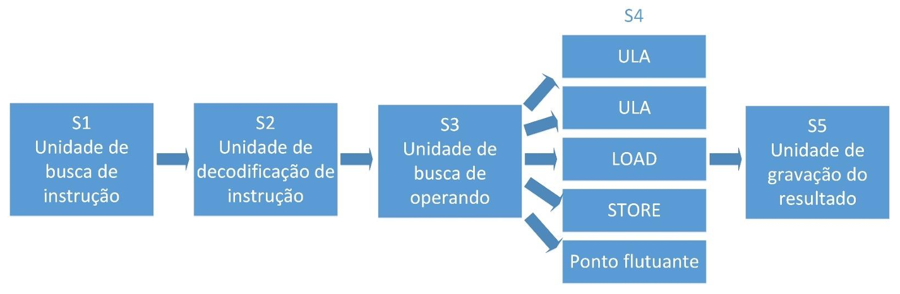

# Capítulo 8 – Arquiteturas de Multiprocessamento e Paralelismo

Até aqui, analisamos as arquiteturas tradicionais de computadores sob a ótica sequencial, ou seja, sob o paradigma definido pela arquitetura de von Neumann: instruções são buscadas, decodificadas e executadas uma de cada vez, em sequência. Esse modelo, embora eficiente para muitas aplicações, se tornou uma limitação com o passar do tempo. À medida que a demanda por desempenho computacional cresceu — impulsionada por aplicações científicas, jogos, inteligência artificial, simulações gráficas e bancos de dados massivos — tornou-se necessário repensar como os processadores poderiam operar.

O **paralelismo computacional** surge como resposta a essa limitação, oferecendo diferentes formas de executar **mais de uma instrução por vez**. A adoção do paralelismo pode ser realizada em múltiplos níveis e assume diferentes formatos: desde arquiteturas com múltiplos núcleos até técnicas de otimização interna do processador, como o pipeline ou estruturas superescalares.

Neste capítulo, exploraremos essas estratégias detalhadamente, começando com uma taxonomia clássica, passando por abordagens modernas como **multiprocessamento**, **superpipeline**, **superescalaridade** e **VLIW**. Vamos compreender como essas técnicas funcionam, quais são suas vantagens, limitações e implicações práticas.

## Introdução ao Paralelismo Computacional

Paralelismo, em termos gerais, consiste na **execução simultânea de várias tarefas ou instruções**. No contexto dos processadores, ele se manifesta basicamente em dois níveis:

- **Paralelismo em nível de instrução**: visa acelerar a execução sequencial de programas por meio da **sobreposição de etapas** do ciclo de instrução. É o caso das técnicas de pipeline, superpipeline e superescalaridade.
- **Paralelismo em nível de processador**: envolve **múltiplos processadores (ou núcleos)** atuando simultaneamente em tarefas independentes ou cooperativas. Essa abordagem é conhecida como **multiprocessamento** e constitui o foco da chamada **arquitetura paralela**.

Um conceito importante dentro do paralelismo em nível de processador é a **escalabilidade**: a capacidade de aumentar o desempenho do sistema adicionando mais processadores. Em arquiteturas bem projetadas, esse acréscimo resulta em ganhos quase lineares de performance.

## Taxonomia de Flynn

Para classificar as diferentes arquiteturas paralelas, o cientista Michael Flynn propôs, em 1972, uma taxonomia baseada na **quantidade de fluxos de dados e de instruções** processados simultaneamente. Essa classificação permanece atual e didática, sendo amplamente utilizada até hoje.

Flynn dividiu as arquiteturas computacionais em quatro categorias:

||**Single Data**|**Multiple Data**|
|---|---|---|
|**Single Instruction**|SISD|SIMD|
|**Multiple Instruction**|MISD|MIMD|

### SISD (Single Instruction Single Data)

Essa categoria representa as arquiteturas **convencionais**, baseadas no modelo de von Neumann. Apenas **uma instrução** é executada por vez e sobre **um único dado**. É o caso de processadores clássicos como os Intel 8080 e 8085. Embora limitadas, essas arquiteturas ainda predominam em dispositivos simples e são o ponto de partida para entender computação sequencial.

### SIMD (Single Instruction Multiple Data)

Aqui, uma **única instrução** é aplicada **simultaneamente a múltiplos dados**. Essa abordagem é comum em aplicações que exigem operações repetitivas em grandes conjuntos de dados, como vetores ou matrizes. Um exemplo são as **unidades de vetor** presentes em GPUs modernas, que aplicam a mesma operação aritmética sobre milhares de elementos ao mesmo tempo. SIMD é bastante eficiente em aplicações científicas, de imagem e vídeo.

### MISD (Multiple Instruction Single Data)

Trata-se de uma arquitetura rara na prática. Nela, **múltiplas instruções** atuam sobre o **mesmo conjunto de dados**. O exemplo clássico seria o uso redundante de processadores para aumentar a confiabilidade em sistemas críticos (como aviões ou reatores nucleares), onde os dados são analisados simultaneamente por diversas unidades de controle para garantir a consistência dos resultados.

### MIMD (Multiple Instruction Multiple Data)

É a forma **mais geral e poderosa de paralelismo**. Diferentes processadores executam **instruções distintas sobre dados diferentes**, ao mesmo tempo. Essa categoria engloba desde **sistemas multiprocessados** com memória compartilhada até redes de computadores que colaboram entre si. É a base das arquiteturas paralelas modernas, como clusters, grids e sistemas multinúcleo (multicore).

## Multiprocessamento e Escalabilidade

O **multiprocessamento** consiste na utilização de mais de um processador físico (ou núcleo) para realizar tarefas de forma cooperativa ou paralela. Essa abordagem permite que o sistema distribua diferentes partes de um programa — ou múltiplos programas — entre os processadores, acelerando a execução.

Essa divisão pode ser feita de diversas formas:

- **Multiprocessamento simétrico (SMP)**: todos os processadores compartilham o mesmo sistema operacional e memória, trabalhando de forma cooperativa.
- **Multiprocessamento assimétrico (AMP)**: há distinção entre processadores mestre e escravos, sendo que o controle fica centralizado.

A escalabilidade é uma propriedade desejável nesse tipo de arquitetura: quanto mais processadores são adicionados, maior deve ser o ganho de desempenho. Idealmente, se um sistema leva 10 segundos para executar uma tarefa com 1 processador, deveria levar 5 segundos com 2 processadores e 2,5 segundos com 4 — mas, na prática, fatores como a comunicação entre processadores e o balanceamento de carga dificultam essa linearidade.

## Pipeline: Executando Etapas em Paralelo

A técnica de **pipeline** é uma das mais antigas e eficazes formas de introduzir paralelismo na execução de instruções. Nela, cada instrução é dividida em etapas (como buscar, decodificar, executar e gravar), e essas etapas são realizadas **de forma sobreposta**, como em uma linha de montagem industrial.

Imagine que cada instrução passe por 4 estágios:

1. **Busca da instrução** (Fetch)
2. **Decodificação** (Decode)
3. **Execução** (Execute)
4. **Escrita do resultado** (Write-back)

No primeiro ciclo de clock, a instrução 1 entra na fase 1. No segundo ciclo, a instrução 1 vai para a fase 2 enquanto a instrução 2 entra na fase 1, e assim por diante. Ao fim do quarto ciclo, uma instrução é completada a cada novo ciclo.

  

Com isso, o pipeline aumenta significativamente o **throughput** (número de instruções executadas por segundo), sem elevar a frequência do processador.

## Superescalaridade: Paralelismo de Hardware e Instruções

O **processamento superescalar** amplia a ideia de pipeline ao permitir a execução **realmente paralela** de múltiplas instruções em um único ciclo de clock, utilizando **várias unidades funcionais**. Em vez de apenas sobrepor etapas de instruções diferentes, o processador superescalar busca **executar instruções diferentes simultaneamente**.

  

Para isso, são necessários:

- **Vários pipelines independentes**
- **Unidades de execução duplicadas** (por exemplo, duas ALUs)
- **Análise em tempo real de dependências entre instruções**
- **Mecanismos para reordenamento e despache dinâmico**

Suponha que o processador possua dois pipelines completos. Ele poderá buscar duas instruções por vez, verificar se são independentes e enviá-las para execução paralela. Essa técnica é amplamente usada em processadores modernos, como os Intel Core e AMD Ryzen.

  

Agora imagine uma estrutura superescalar com cinco unidades funcionais de execução (fase 4):

  

Contudo, a superescalaridade impõe desafios:

- **Hazards de dados (data hazards)**: quando uma instrução depende do resultado de outra que ainda não terminou.
- **Hazards de controle**: mudanças no fluxo do programa, como desvios condicionais, podem invalidar as instruções que estavam sendo preparadas.
- **Conflitos de recursos**: quando duas instruções precisam da mesma unidade funcional.

Para mitigar esses problemas, técnicas como **reordenação dinâmica**, **predição de desvios** e **renomeação de registradores** podem ser empregadas.

## Superpipeline: Estágios Menores, Mais Instruções

A técnica de **superpipeline** consiste em **dividir ainda mais os estágios do pipeline**, criando fases mais curtas e aumentando a frequência do clock. Se cada etapa tradicional consumia um ciclo de clock, agora pode ser realizada em meio ciclo, permitindo que o processador inicie uma nova instrução duas vezes mais rápido.

Essa técnica não aumenta o número de instruções executadas simultaneamente, mas sim **a velocidade com que novas instruções entram no pipeline**. O resultado é um maior rendimento global, especialmente em aplicações que não dependem de dados intermediários.

  

Muitos processadores baseados na arquitetura MIPS utilizam pipelines com 4 estágios (como na figura acima):

1. **Fetch**
2. **ALU**
3. **Memory**
4. **Write**

O superpipeline divide essas fases em subetapas, permitindo o aproveitamento mais eficiente do clock.

## VLIW: Paralelismo Decidido pelo Compilador

A abordagem **VLIW (Very Long Instruction Word)** representa uma estratégia distinta de exploração de paralelismo. Em vez de deixar a decisão de quais instruções podem ser executadas em paralelo para a **CPU em tempo de execução**, como ocorre em arquiteturas superescalares, a VLIW transfere essa responsabilidade para o **compilador**.

Em VLIW, as instruções são agrupadas em “pacotes” de instruções que serão executadas simultaneamente, desde que sejam independentes entre si. Esses pacotes formam **instruções muito longas**, compostas por diversas operações menores.

Para que isso funcione, o processador deve possuir múltiplas **unidades funcionais** (ALUs, unidades de ponto flutuante, etc.), capazes de processar essas instruções simultâneas.

A vantagem dessa abordagem é que o **hardware se torna mais simples**, pois não precisa realizar reordenação dinâmica de instruções. Por outro lado, o **compilador precisa ser extremamente sofisticado**, analisando dependências e criando os pacotes corretos com antecedência.

A arquitetura VLIW é usada em domínios específicos, como **processamento de sinais digitais** e **sistemas embarcados**, onde os padrões de execução são previsíveis e bem definidos.

## Considerações Finais

A evolução dos processadores passou, necessariamente, pela busca de mecanismos para **aumentar o paralelismo**. Seja através da execução simultânea de instruções dentro de um mesmo núcleo (pipeline, superescalaridade, superpipeline, VLIW), seja por meio do uso de **múltiplos processadores cooperando entre si** (multiprocessamento), o objetivo comum é obter **mais desempenho com maior eficiência energética e menor tempo de execução**.

Compreender essas arquiteturas e suas técnicas permite não apenas apreciar o funcionamento interno dos processadores modernos, mas também tomar decisões conscientes no desenvolvimento de software, levando em conta aspectos como concorrência, paralelismo e otimização de desempenho.
