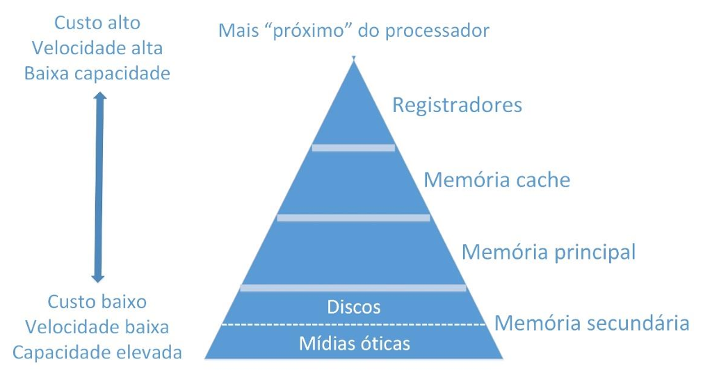
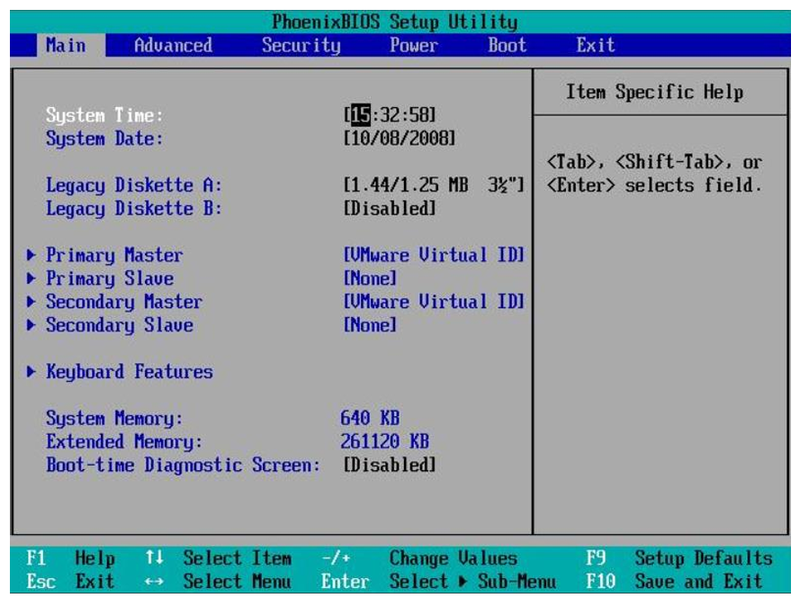
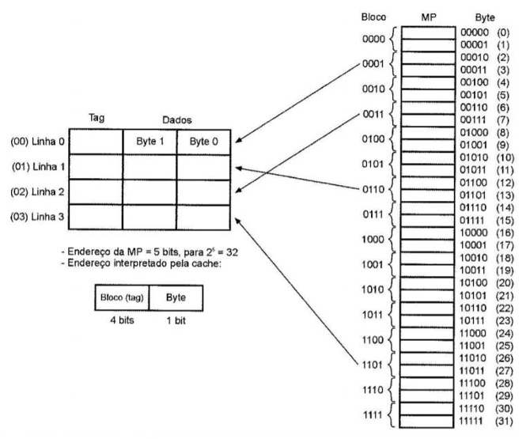

# Capítulo 9 – Memória

A memória é um dos pilares fundamentais da arquitetura de computadores. Sem ela, seria impossível armazenar programas e dados para execução, tampouco manter a comunicação fluida entre os componentes do sistema. Neste capítulo, abordaremos em profundidade a organização da memória nos computadores, desde seus princípios mais gerais até aspectos técnicos específicos frequentemente cobrados em concursos e explorados em sistemas reais.

Inicialmente, veremos uma visão ampla sobre o papel da memória no contexto do hardware de um computador, para então aprofundar o estudo de arquiteturas de acesso, hierarquias de armazenamento e os tipos mais comuns de memória primária e secundária.

## A Memória no Contexto do Hardware

A arquitetura básica de um computador é composta por três blocos funcionais essenciais: a **CPU (processador)**, os **dispositivos de entrada/saída** e a **memória principal**. Esses elementos estão interligados por meio dos **barramentos**, que são canais responsáveis pela troca de sinais e dados entre os componentes.

  

A memória principal, geralmente representada pela memória RAM, exerce a função de armazenar os programas em execução e os dados temporários necessários ao processamento. Mais próxima ainda da CPU, encontramos a **memória cache**, usada para acelerar o acesso às informações mais requisitadas. Já os **dispositivos de armazenamento secundário**, como discos rígidos (HDs) e unidades SSD, guardam dados de forma permanente.

A memória se distribui, portanto, em diferentes camadas, variando em **velocidade**, **custo**, **capacidade** e **função específica**. Entender como essas camadas interagem é essencial para compreender o desempenho e o comportamento dos sistemas computacionais.

## Acesso à Memória: UMA e NUMA

Em arquiteturas paralelas, especialmente quando se trabalha com múltiplos processadores, o acesso à memória pode ser realizado de diferentes maneiras. Os modelos **UMA (Uniform Memory Access)** e **NUMA (Non-Uniform Memory Access)** representam duas abordagens fundamentais sobre como o processador interage com a memória principal.

  

No modelo **UMA**, todos os processadores do sistema compartilham uma memória principal comum, e **o tempo de acesso é igual para todos**, independentemente de qual parte da memória esteja sendo acessada. Esse modelo é simples e fácil de gerenciar, sendo comum em sistemas com poucos processadores ou arquiteturas simétricas.

Já no modelo **NUMA**, todos os processadores ainda podem acessar toda a memória, mas **o tempo de acesso depende da localização dos dados**. Cada processador possui sua própria memória local (mais rápida para ele), mas pode acessar a memória de outros processadores (mais lenta). Essa abordagem melhora a escalabilidade do sistema, pois reduz os gargalos no acesso à memória central.

O modelo **CC-NUMA (Cache Coherent NUMA)** é uma evolução do NUMA, em que é garantida a **coerência de cache entre os processadores**. Ou seja, mesmo que os dados estejam armazenados em caches diferentes, mecanismos são utilizados para manter a consistência entre as cópias.

Esse tópico tem grande relevância prática, pois influencia diretamente a performance em sistemas multiprocessados e multicore. Conhecer as distinções entre UMA, NUMA e CC-NUMA pode ajudar a identificar arquiteturas em ambientes reais e responder corretamente a questões de concursos.

## Hierarquia de Memória: Velocidade versus Capacidade

Uma das características mais marcantes da organização de memória em computadores modernos é sua **distribuição em níveis hierárquicos**. A hierarquia de memória é uma estratégia que visa **conciliar custo, desempenho e capacidade de armazenamento**.

Quanto mais próximo da CPU, mais **rápida** e **cara** é a memória, mas também **menor** é sua capacidade. À medida que nos afastamos da CPU, as memórias tornam-se mais **lentas**, **baratas** e **espaçosas**.

  

A hierarquia típica de memória é composta por:

- **Registradores**: localizados dentro do processador, têm acesso quase instantâneo, mas capacidade extremamente reduzida (tipicamente 64 bits por registrador).
- **Memória cache**: dividida em níveis (L1, L2 e L3), é construída com tecnologia SRAM, mais rápida e cara que a RAM tradicional. Atua como um intermediário entre a CPU e a memória principal.
- **Memória principal (RAM)**: armazenamento volátil usado para guardar dados e programas em execução. Construída com tecnologia DRAM.
- **Memória secundária**: unidades como HDs e SSDs, onde dados são armazenados permanentemente.
- **Memória terciária**: dispositivos como mídias óticas (CDs, DVDs) e fitas magnéticas, geralmente acessadas sob demanda, com menor velocidade e custo por bit ainda mais baixo.

Um ponto importante é que, em algumas literaturas, a memória terciária é diferenciada da secundária por depender de operações de montagem (por exemplo, inserir um DVD ou fita), enquanto a memória secundária é acessível de forma direta pelo sistema.

A seguir, um exemplo comparativo de capacidades típicas nos diferentes níveis:

- **Registrador**: 64 bits (~8 bytes)
- **Cache L3**: até 6 MB
- **RAM (DRAM)**: até 16 GB (ou mais)
- **HD/SSD**: 1 TB (HD), 512 GB ou mais (SSD)
- **DVD-ROM**: 4,7 GB

Essa organização hierárquica não é arbitrária. Ela permite que a CPU acesse rapidamente os dados mais utilizados, enquanto os dados menos acessados permanecem armazenados em níveis inferiores, com custo por bit reduzido.

## Memória Principal: RAM e ROM

A **memória principal** de um computador é o local onde os **programas em execução** e os **dados em uso** são armazenados temporariamente. A principal função dessa memória é servir como área de trabalho para o processador. Toda operação computacional (desde abrir um navegador até compilar um programa) passa obrigatoriamente pela memória principal.

Existem dois tipos principais de memória principal: **RAM** e **ROM**.

### Memória RAM (Random Access Memory)

A **RAM** é a **memória de leitura e escrita volátil**, ou seja, seus dados são perdidos quando o computador é desligado. Ela é essencial para o funcionamento do sistema operacional e dos programas em execução.

A memória RAM pode ser endereçada por **bytes**, e sua unidade mais fundamental é o **bit**. Em linguagens de baixo nível, como C, é possível manipular individualmente os bits de uma variável, o que reforça o papel essencial do bit como unidade mínima da informação.

Existem dois tipos fundamentais de RAM: **DRAM** e **SRAM**.

A **DRAM (Dynamic RAM)** precisa ser constantemente atualizada para manter os dados. É usada na memória principal dos computadores. A versão mais comum é a **SDRAM** (Synchronous DRAM), que opera em sincronia com o clock do sistema.

A evolução da SDRAM deu origem aos padrões **DDR (Double Data Rate)**: DDR, DDR2, DDR3, DDR4, DDR5. Eles se diferenciam por velocidade de acesso, largura de banda e consumo de energia.

  

Um pente de memória DDR3 com especificação “PC3-12800”, por exemplo, tem uma taxa de transferência de pico de **12,8 GB/s**. Outras especificações, como frequência e capacidade também são essenciais. Um exemplo de especificações comuns seria:

**ESPECIFICAÇÕES TÉCNICAS**
- **Características**:
	- Marca: Kingston
	- Modelo: KVR16S11S8/4
- **Especificações**:
	- Capacidade: 4GB
	- Velocidade: 1600MHz
	- Tipo: DDR3
	- PC3-12800

Instalar corretamente os pentes de memória é crucial: as travas laterais devem estar completamente encaixadas, caso contrário o sistema pode falhar na inicialização.

Já a **SRAM (Static RAM)** é mais rápida e estável, porém mais cara. É utilizada principalmente em **memória cache**, como veremos mais a frente.

### Memória ROM (Read-Only Memory)

A **ROM** é uma memória **não volátil**, utilizada para armazenar dados fixos, que não se perdem quando o computador é desligado. Ela é utilizada para guardar **informações essenciais do hardware**, como o firmware de inicialização do sistema.

Os principais tipos de memória ROM são:

- **PROM** (Programmable Read-Only Memory): programável apenas uma vez.
- **EPROM** (Erasable Programmable Read-Only Memory): pode ser apagada com luz ultravioleta e reprogramada.
- **EEPROM** (Electrically Erasable Programmable Read-Only Memory): pode ser apagada e regravada eletricamente, mesmo com o chip instalado.

A **BIOS (Basic Input/Output System)**, Sistema Básico de Entrada e Saída, por exemplo, é armazenada em uma ROM. Ao ligar o computador, ela executa o **POST (Power-On Self-Test)** e inicia o sistema a partir de uma mídia de boot definida. O **SETUP da BIOS** permite alterar configurações como a ordem de boot, data/hora e parâmetros de hardware.

  

Uma falha comum é quando o sistema perde a data e hora a cada inicialização. Isso geralmente indica que a **bateria da placa-mãe** (responsável por manter a configuração da memória CMOS) está esgotada. Para resetar o SETUP, basta remover temporariamente essa bateria.

Curiosamente, algumas BIOS (como as da Phoenix) usam **sequências de bipes sonoros** para indicar erros de hardware durante a inicialização. Embora decorar essas sequências não seja exigido com frequência, é útil saber que elas existem. Uma sequência como **1-3-1-1**, por exemplo, indica um erro no refresh da DRAM.

Além disso, algumas BIOS modernas incluem recursos como **spread spectrum** (espalhamento espectral), que pode ser ativado para **reduzir a interferência eletromagnética** gerada pelo clock do barramento do processador.

## Memória Cache

Conforme exploramos na seção anterior, a hierarquia de memória em computadores modernos é projetada para equilibrar três fatores fundamentais: **velocidade**, **custo** e **capacidade de armazenamento**. Nesse contexto, a **memória cache** ocupa um papel de destaque, situando-se estrategicamente entre o processador e a memória principal. Seu propósito é claro: **reduzir a latência no acesso aos dados e instruções mais frequentemente utilizados**.

Para compreender por que a cache é tão eficiente, precisamos inicialmente entender um conceito essencial: o **princípio da localidade**.

### Princípio da Localidade

O comportamento de execução de programas segue certos padrões previsíveis. Esses padrões são descritos pelo **princípio da localidade**, que se divide em dois tipos principais:

- **Localidade Temporal**: um dado acessado recentemente tem alta probabilidade de ser acessado novamente em um futuro próximo. Isso acontece porque muitas instruções são repetidas em laços e sub-rotinas, e variáveis usadas recentemente tendem a ser reutilizadas diversas vezes.
- **Localidade Espacial**: se um dado foi acessado, é provável que dados vizinhos também sejam acessados em breve. Isso ocorre devido à organização sequencial dos programas e à alocação contígua de estruturas de dados como vetores e matrizes.

Esses princípios fundamentam a lógica da memória cache: **armazenar os dados e instruções mais próximos, tanto no tempo quanto no espaço, do que está sendo processado no momento**. Assim, o processador evita o tempo de acesso mais elevado da memória principal e, em vez disso, busca os dados diretamente em um armazenamento intermediário e rápido: a **cache**.

### Organização da Memória Cache

A memória cache é organizada em **níveis hierárquicos** — L1, L2 e L3 — cada um com características distintas em termos de **capacidade, velocidade e proximidade com o núcleo do processador**. Em geral, quanto mais próxima da CPU, mais rápida (e menor) é a cache.

  

#### Cache L1

A **cache L1** é a mais próxima do núcleo do processador. Por isso, é também a mais rápida e a mais cara. Sua capacidade é bastante limitada — normalmente entre 32 KB e 128 KB por núcleo —, mas seu acesso ocorre praticamente na mesma velocidade dos registradores.

Em muitos processadores, a cache L1 é **dividida em dois blocos distintos**:

- **L1 de instruções**: armazena instruções do programa.
- **L1 de dados**: armazena os dados utilizados pelas instruções.

Essa separação permite que o processador **busque uma instrução e um dado simultaneamente**, aumentando a taxa de processamento.

#### Cache L2

A **cache L2** funciona como um segundo nível de cache. É maior que a L1, mas um pouco mais lenta. Em processadores modernos, a L2 normalmente varia entre **256 KB e 1 MB por núcleo**, e em muitos casos ainda permanece integrada ao núcleo.

Em gerações anteriores, a L2 podia ser externa à CPU, o que aumentava a latência. Atualmente, mesmo quando ainda existe fisicamente fora do núcleo, o acesso é feito de forma rápida e eficiente por canais internos dedicados.

#### Cache L3

A **cache L3** representa o terceiro nível de cache. Em geral, é compartilhada entre todos os núcleos do processador, servindo como uma camada intermediária antes de recorrer à memória principal. Sua capacidade costuma variar entre **4 MB e 64 MB**, dependendo da arquitetura.

Em alguns processadores, como o Intel Core i7 (2011), temos a seguinte configuração:

- **L1**: 64 KB por núcleo
- **L2**: 256 KB por núcleo
- **L3**: de 12 a 20 MB (compartilhada)

Mesmo representando uma **fração mínima da capacidade da RAM**, a memória cache consegue atingir uma **taxa de acertos (hits)** de **90 a 95%**. Isso significa que, na maioria das vezes, os dados requisitados pelo processador já estão na cache, evitando a ida à memória RAM.

Quando a cache não possui a informação necessária, ocorre um **miss**, e a busca precisa ser feita em níveis inferiores da hierarquia (L2, L3 ou RAM).

### Estratégias de Mapeamento da Cache

Dado que a memória cache é muito menor do que a memória principal, é necessário um **mecanismo eficiente para selecionar quais blocos da memória principal serão carregados para a cache**. Esse processo é definido pelas **estratégias de mapeamento**, que controlam onde e como os dados são posicionados na cache.

#### Mapeamento Direto

No **mapeamento direto**, cada bloco da memória principal pode ser carregado apenas em **uma posição específica da cache**. Por exemplo, se a cache possui 8 linhas (endereços de 000 a 111), o bloco de memória com endereço final “001” será mapeado para a linha “001” da cache — e somente essa.

  

Essa estratégia é simples e rápida, mas tem como limitação o alto risco de **conflitos**: dois blocos diferentes que compartilham o mesmo endereço final competirão pela mesma linha de cache, gerando substituições constantes.

#### Mapeamento Associativo Completo

No **mapeamento associativo completo**, qualquer bloco da memória principal pode ser carregado **em qualquer linha da cache**. Isso aumenta a flexibilidade e reduz os conflitos, mas exige **mecanismos mais complexos de controle**, incluindo um campo chamado **tag**, que identifica qual bloco da memória principal está armazenado em cada linha da cache.

  

Como a cache pode ficar cheia, torna-se necessário definir **políticas de substituição** para decidir qual bloco será descartado ao inserir um novo. Exemplos comuns são:

- **FIFO (First In, First Out)**: substitui o bloco mais antigo.
- **LRU (Least Recently Used)**: substitui o bloco que ficou mais tempo sem ser acessado.

#### Mapeamento Associativo por Conjuntos

O **mapeamento associativo por conjuntos** é um modelo **intermediário** entre os dois anteriores. A cache é dividida em vários **conjuntos de linhas**, e cada bloco da memória principal pode ser mapeado para **qualquer linha dentro de um conjunto específico**, mas **não em qualquer linha da cache**.

  

Essa abordagem combina a eficiência do mapeamento direto com parte da flexibilidade do associativo completo. Por isso, é a estratégia **mais comum em caches modernas**.

### Tecnologia de Implementação: SRAM

A memória cache é geralmente construída utilizando a tecnologia **SRAM (Static RAM)**. Em comparação com a **DRAM**, usada na memória principal, a SRAM:

- **Não precisa de atualização constante** (refresh);
- **É muito mais rápida**;
- **É mais cara por bit armazenado**;
- **Ocupa mais espaço físico**.

A principal razão da superioridade da SRAM está no uso de **flip-flops** — circuitos digitais que armazenam um bit de forma estável e sem a necessidade de recarga constante. Por isso, é chamada de “estática”.

  

Entretanto, devido ao alto custo, a SRAM é usada em pequenas quantidades, **restrita à cache**, enquanto a DRAM permanece a escolha para a **memória principal**.

### Considerações sobre Desempenho e Eficiência

A presença da memória cache é fundamental para **minimizar o impacto da diferença de velocidade entre a CPU e a memória principal**. Sem cache, o processador passaria a maior parte do tempo esperando dados serem carregados da RAM.

Com o uso da cache, dados e instruções frequentemente usados são armazenados em níveis mais rápidos da hierarquia. Essa estratégia é tão eficiente que, mesmo representando menos de 1% da RAM, a cache consegue fornecer **mais de 90% dos dados solicitados pela CPU** diretamente, evitando a necessidade de recorrer à DRAM.

Além disso, o uso de múltiplos níveis (L1, L2 e L3) permite que o sistema equilibre a relação entre custo, desempenho e eficiência energética, otimizando o funcionamento do processador em diferentes cenários.

## Memória Secundária

Ao contrário da memória principal, a **memória secundária** — também chamada de **memória auxiliar** — **não é essencial para o funcionamento imediato do processador**, mas **é indispensável para a armazenagem permanente dos dados e programas** de um sistema computacional. Seu papel é complementar a memória principal, oferecendo **grande capacidade de armazenamento não volátil**, ou seja, **dados que não se perdem quando o computador é desligado**.

O conceito de memória secundária inclui **discos rígidos (HDs)**, **unidades SSD**, **dispositivos externos** (como pendrives e cartões SD) e **mídias removíveis** (como CDs, DVDs e Blu-rays). Embora um computador possa tecnicamente funcionar sem uma unidade de armazenamento secundária, seu uso seria extremamente limitado, já que **não haveria onde armazenar o sistema operacional, os aplicativos ou os arquivos do usuário**.

### Discos Rígidos (HDs): A Tradição Magnética

O **disco rígido** ou **HD (Hard Disk Drive)** é o exemplo mais clássico de memória secundária. Sua estrutura física é composta por um ou mais **pratos metálicos** recobertos por uma fina camada de material magnético. Esses discos giram continuamente a alta velocidade, enquanto um **braço mecânico** com uma ou mais **cabeças de leitura/gravação** posiciona-se sobre as trilhas para acessar os dados.

  

O funcionamento do HD é baseado na leitura e escrita magnética. Os dados são gravados magneticamente na superfície dos pratos e permanecem armazenados mesmo sem alimentação elétrica, o que caracteriza o HD como uma **memória não volátil**. Embora esteja sendo gradualmente substituído por tecnologias mais modernas, o HD ainda é amplamente utilizado, especialmente em sistemas que demandam **grande espaço de armazenamento com baixo custo por gigabyte**.

Internamente, a organização lógica de um HD inclui **trilhas**, **setores** e **clusters**. Cada prato é dividido em **trilhas circulares concêntricas**, as quais, por sua vez, são subdivididas em **setores** — as menores unidades físicas de armazenamento do disco, tradicionalmente com 512 bytes, embora versões mais modernas adotem setores de 4096 bytes (tecnologia Advanced Format).

  

Os **clusters**, por outro lado, são as **menores unidades lógicas** de armazenamento reconhecidas pelo sistema operacional. Um cluster pode conter múltiplos setores. Por exemplo, um cluster de 1024 bytes pode conter dois setores de 512 bytes. Se um arquivo ocupar 3 KB, ele precisará de 3 clusters de 1 KB cada. **Importante: um cluster não pode ser compartilhado por dois arquivos diferentes.**

Assim, mesmo arquivos pequenos podem acabar ocupando mais espaço do que o necessário, levando a um fenômeno chamado de **fragmentação interna**.

As capacidades dos HDs modernos são expressas em **gigabytes (GB)** ou **terabytes (TB)**. Antigamente, era comum encontrar discos de 540 MB (megabytes), mas hoje é padrão encontrar HDs de **1 TB ou mais**. A unidade de medida segue a progressão decimal (1 GB = 1 bilhão de bytes; 1 TB = 1 trilhão de bytes).

Apesar de suas vantagens em custo e capacidade, os HDs apresentam uma **grande desvantagem em termos de desempenho**. Por possuírem componentes mecânicos, como motores e braços móveis, seu **tempo de acesso é alto**. A leitura ou gravação de dados depende da movimentação física do braço até a trilha correta (**seek time**) e da rotação dos discos até o ponto desejado (**latência rotacional**). As velocidades típicas de rotação dos discos são **5400 rpm** e **7200 rpm** — e quanto maior a rotação, menor tende a ser o tempo de espera.

### SSDs (Solid State Drives): A Revolução Sem Partes Móveis

Com o avanço da tecnologia de semicondutores, surgiram os **SSDs (Solid State Drives)** como alternativa aos discos rígidos tradicionais. A principal diferença está na **ausência de partes móveis**. Os SSDs utilizam **memória flash** — geralmente do tipo **NAND** — para armazenar dados de forma não volátil.

Isso traz uma série de vantagens:

- **Velocidade muito superior**: o tempo de acesso à memória flash é quase instantâneo, não havendo necessidade de movimentos mecânicos.
- **Menor consumo de energia**: ideal para notebooks e dispositivos móveis.
- **Maior resistência física**: por não possuírem partes móveis, os SSDs são menos suscetíveis a danos causados por quedas ou impactos.
- **Funcionamento silencioso**: como não há motores ou discos girando, não há ruído.

A única desvantagem notável dos SSDs é o **custo por gigabyte** mais elevado. Assim, ainda são vendidos com capacidades menores do que os HDs, sendo comuns modelos de 240 GB, 480 GB ou 960 GB.

Além disso, os SSDs utilizam diferentes **interfaces de conexão**, cada uma com características específicas:

- **SATA (Serial ATA)**: mesma interface usada por HDs, é mais limitada em termos de velocidade (até 600 MB/s), mas ainda comum em muitos desktops e notebooks.

  

- **M.2**: interface compacta e moderna, utilizada em ultrabooks e placas-mãe atuais. Suporta tanto **protocolo SATA** quanto **NVMe** (protocolo mais rápido, que utiliza o barramento PCIe). Os SSDs M.2 NVMe podem atingir velocidades de leitura de **3.000 MB/s ou mais**.

  

Essa compactação permitida pelo padrão M.2 tornou-se especialmente útil em **notebooks ultrafinos**, onde o espaço físico é um recurso crítico.

### Comparando HDs e SSDs

A escolha entre HDs e SSDs depende das necessidades do sistema e das prioridades do usuário. A seguir, um panorama comparativo das principais características:

**HD (Disco Rígido):**
- **Vantagens**:
    - Maior capacidade por menor preço.
    - Ampla disponibilidade no mercado.
- **Desvantagens**:
    - Lento tempo de acesso devido às partes mecânicas.
    - Maior consumo de energia e emissão de calor.
    - Mais suscetível a falhas físicas (impacto, desgaste mecânico).

**SSD (Unidade de Estado Sólido):**
- **Vantagens**:
    - Altíssima velocidade de leitura e gravação.
    - Baixo consumo de energia e calor.
    - Maior resistência a choques.
    - Funcionamento silencioso.
- **Desvantagens**:
    - Custo mais alto por GB.
    - Capacidade de armazenamento ainda inferior, especialmente em modelos acessíveis.

## Considerações Finais

Neste capítulo, exploramos os diversos tipos de memória que compõem a **hierarquia de armazenamento** em um sistema computacional. Compreendemos o papel fundamental da **memória principal** no funcionamento dos programas, a importância estratégica da **memória cache** na redução da latência de acesso e a função da **memória secundária** na persistência dos dados.

Cada nível apresenta características distintas em termos de velocidade, capacidade e custo, refletindo decisões de projeto que buscam equilibrar desempenho e viabilidade. O domínio dessa hierarquia é essencial para entender o comportamento do hardware e otimizar o uso de recursos computacionais.
