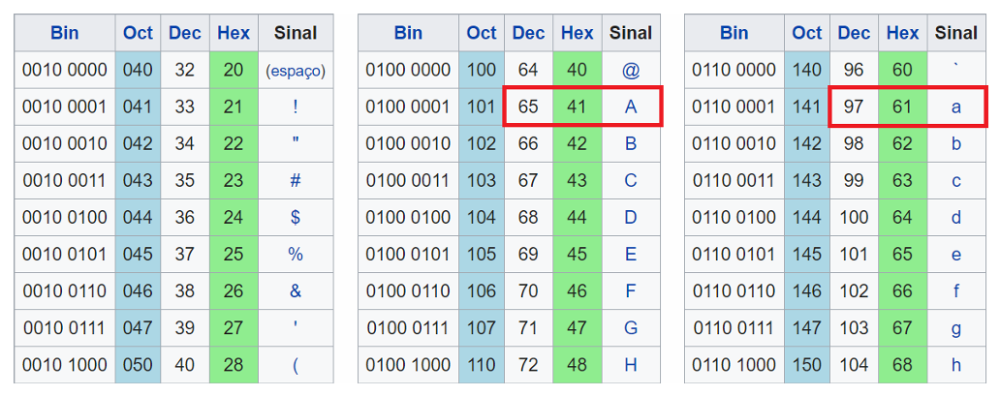
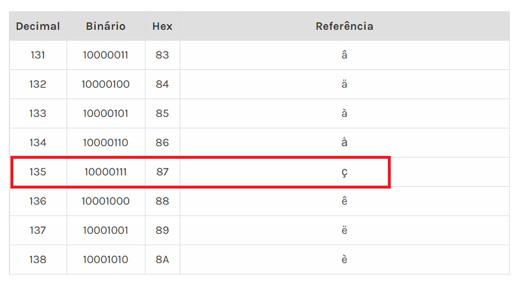

# Capítulo 10 – Sistemas de Numeração, Aritmética Binária e Representação de Dados

## Sistemas de Numeração

O mundo em que vivemos é, sem dúvida, moldado pelo sistema decimal. Afinal, desde os primeiros registros da civilização, aprendemos a contar utilizando os dez dedos das mãos, o que, muito provavelmente, foi o fator que levou à adoção natural da **base 10**. Assim, crescemos lidando com os números de 0 a 9, sem sequer imaginar que poderiam existir outros sistemas numéricos. No entanto, quando migramos para o universo dos computadores, essa lógica muda drasticamente. As máquinas não entendem dez dígitos, mas sim dois: **0 e 1**.

Este é o ponto de partida para compreendermos os **sistemas de numeração**, que são conjuntos de símbolos e regras que permitem representar quantidades, informações e dados.

### Sistema Decimal: Nossa Linguagem Numérica Natural

No sistema decimal, cada número é composto por uma sequência de dígitos que varia de 0 a 9. Cada posição desses dígitos possui um peso, determinado por uma potência de 10 — que é justamente a **base do sistema decimal**.

Por exemplo, quando olhamos para o número **95**, entendemos que ele representa:

$$(9 \times 10^1) + (5 \times 10^0) = 90 + 5 = 95$$

Se aumentarmos a quantidade de dígitos, a lógica se mantém. O número **5893** representa:

$$(5 \times 10^3) + (8 \times 10^2) + (9 \times 10^1) + (3 \times 10^0) = 5000 + 800 + 90 + 3 = 5893$$

Essa lógica também se aplica a números com frações decimais. Por exemplo, o número **0,368** é interpretado assim:

$$(3 \times 10^{-1}) + (6 \times 10^{-2}) + (8 \times 10^{-3}) = 0,3 + 0,06 + 0,008 = 0,368$$

Em qualquer número decimal, o dígito mais à **esquerda** representa o valor mais significativo, enquanto o da **direita** é o menos significativo.

### Sistema Binário: A Linguagem dos Computadores

Diferente dos seres humanos, os computadores não operam na base 10. Eles utilizam a base **2**, ou seja, trabalham exclusivamente com dois dígitos: **0 e 1**, que representam os estados **desligado (0)** e **ligado (1)** de seus circuitos eletrônicos.

Na prática, todo número binário segue o mesmo princípio posicional do sistema decimal, mas com potências de 2. Vejamos um exemplo com o número binário **1110**:

$$(1 \times 2^3) + (1 \times 2^2) + (1 \times 2^1) + (0 \times 2^0) = 8 + 4 + 2 + 0 = 14$$

Portanto, **11102 = 1410**.

Essa conversão é fundamental no mundo da computação, pois permite compreender como os números que conhecemos são codificados na linguagem da máquina.

### Convertendo Decimal para Binário

O processo inverso — converter de decimal para binário — é igualmente essencial e bastante simples. Ele consiste em realizar **divisões sucessivas por 2**, anotando os restos e, ao final, lendo esses restos de baixo para cima.

Por exemplo, para converter o número **2310** para binário:

|Operação|Quociente|Resto|
|---|---|---|
|23 ÷ 2|11|1|
|11 ÷ 2|5|1|
|5 ÷ 2|2|1|
|2 ÷ 2|1|0|
|1 ÷ 2|0|1|

Lendo os restos de baixo para cima, o resultado é **101112**.

Existe também uma técnica auxiliar muito eficiente, especialmente útil quando se trabalha com máscaras de sub-rede, por exemplo. Ela consiste em utilizar uma tabela de pesos binários:

|512|256|128|64|32|16|8|4|2|1|
|---|---|---|---|---|---|---|---|---|---|
||||||1|0|1|1|1|

Somando os valores associados aos bits "1", temos:

$$16 + 4 + 2 + 1 = 23$$

Portanto, o binário **101112** corresponde a **2310**.

### Sistema Hexadecimal: Compactando a Informação

Se o sistema binário é eficiente para as máquinas, para os humanos ele não é muito prático — especialmente quando os números começam a ficar longos. Surge então o **sistema hexadecimal**, cuja base é **16**. Ele utiliza os dígitos de **0 a 9** e as letras **A, B, C, D, E e F**, que representam os valores de **10 a 15**, respectivamente.

Por que hexadecimal? Porque **4 bits binários correspondem exatamente a um dígito hexadecimal**, já que:

$$2^4 = 16$$

Observe a tabela de equivalência:

|Binário|Decimal|Hexadecimal|
|---|---|---|
|0000|0|0|
|0001|1|1|
|0010|2|2|
|0011|3|3|
|0100|4|4|
|0101|5|5|
|0110|6|6|
|0111|7|7|
|1000|8|8|
|1001|9|9|
|1010|10|A|
|1011|11|B|
|1100|12|C|
|1101|13|D|
|1110|14|E|
|1111|15|F|

Por exemplo, o número **0xFA** (onde o prefixo **0x** indica que o número está em hexadecimal) corresponde ao binário:

$$F = 1111 \quad A = 1010$$
$$0xFA = 11111010$$

Para converter de hexadecimal para decimal, aplicamos o mesmo princípio das potências:

$$(F \times 16^1) + (A \times 16^0)$$
$$(15 \times 16) + (10 \times 1) = 240 + 10 = 250$$

Se quisermos validar, podemos converter o binário correspondente (**11111010**) para decimal usando a tabela de pesos:

|512|256|128|64|32|16|8|4|2|1|
|---|---|---|---|---|---|---|---|---|---|
|||1|1|1|1|1|0|1|0|

Somando os bits "1":

$$128 + 64 + 32 + 16 + 8 + 2 = 250$$

Correto!

### Sistema Octal: Outra Forma de Compactação

Outro sistema utilizado em computação, especialmente em ambientes Unix/Linux, é o **sistema octal**, de base **8**, com dígitos que vão de **0 a 7**. Uma aplicação prática muito comum ocorre no comando **chmod**, usado para definir permissões de arquivos.

No octal, cada grupo de **3 bits binários** corresponde a um dígito:

|Binário|Octal|
|---|---|
|000|0|
|001|1|
|010|2|
|011|3|
|100|4|
|101|5|
|110|6|
|111|7|

Vamos converter o número **3728** para decimal:

$$(3 \times 8^2) + (7 \times 8^1) + (2 \times 8^0) = 192 + 56 + 2 = 250$$

O processo inverso, de decimal para octal, utiliza a divisão sucessiva por 8:

|Operação|Quociente|Resto|
|---|---|---|
|77 ÷ 8|9|5|
|9 ÷ 8|1|1|
|1 ÷ 8|0|1|

Lendo os restos de baixo para cima, temos o número **1158**, equivalente a 7710.

## Aritmética Binária

Ao contrário dos seres humanos, que utilizam majoritariamente a base decimal para realizar cálculos, os computadores executam operações matemáticas exclusivamente no sistema binário. Essa limitação ocorre não por capricho, mas por necessidade física: os circuitos eletrônicos reconhecem dois estados, geralmente representados pelos níveis de tensão — ligados e desligados, ou simplesmente **1 e 0**.

Porém, ao realizar operações matemáticas em binário, surge uma necessidade natural: como representar números negativos? Afinal, grande parte dos cálculos do cotidiano e dos algoritmos computacionais envolve não apenas números positivos, mas também negativos. É justamente nesse ponto que surgem os métodos de representação binária para números com sinal.

### Representação de Números Negativos

Existem diferentes métodos para representar números negativos no sistema binário. Contudo, alguns métodos são mais eficientes e adotados na prática computacional, enquanto outros possuem limitações que inviabilizam seu uso em arquiteturas modernas.

#### Sinal e Magnitude

O método mais simples, do ponto de vista conceitual, é o chamado **sinal-magnitude**. Nele, o bit mais à esquerda — conhecido como **bit mais significativo (MSB)** — é utilizado para indicar o sinal. Se o MSB for **0**, o número é positivo; se for **1**, o número é negativo. Os demais bits representam a magnitude, ou seja, o valor absoluto do número.

Por exemplo, considerando uma representação de 8 bits:

- **+15** é representado por:  
    $$00001111$$
- **-15** é representado por:  
    $$10001111$$

Apesar de ser intuitiva, essa abordagem possui sérios problemas. O mais evidente é a existência de duas representações para o zero:

$$+0 = 00000000$$
$$-0 = 10000000$$

Essa duplicidade do zero gera complicações no projeto dos circuitos, aumentando a complexidade para realizar operações como comparação e soma. Por essa razão, a representação sinal-magnitude é praticamente abandonada na implementação dos processadores modernos, sendo utilizada mais em aplicações específicas, como alguns sistemas de ponto flutuante.

#### Complemento de Dois: A Solução Mais Elegante

A arquitetura dos computadores modernos adota quase universalmente o método de **complemento de dois** para a representação de números negativos. Esse método, além de eliminar a ambiguidade do zero, simplifica a lógica da Unidade Lógica e Aritmética (ULA), pois as operações de soma e subtração passam a ser realizadas da mesma maneira tanto para números positivos quanto negativos.

O funcionamento é relativamente simples:

- Para números positivos, a representação em complemento de dois é exatamente igual à representação binária pura, ou seja, sem nenhuma alteração.
- Para números negativos, o processo envolve dois passos:
    1. **Inverter todos os bits do número positivo** (isso gera o chamado **complemento de um**).
    2. **Somar 1** ao resultado da inversão, obtendo o **complemento de dois**.

Vamos exemplificar a conversão do número **-2**, utilizando 8 bits:

1. Representação de +2:  
    $$00000010$$
2. Inversão dos bits (complemento de um):  
    $$11111101$$
3. Soma de 1 (resultado em complemento de dois, que representa -2):  
    $$11111110$$

Um macete prático consiste em percorrer o número da direita para a esquerda até encontrar o primeiro bit **1**. Esse bit (e todos à direita dele) permanece iguais. A partir do próximo bit à esquerda, todos os bits são invertidos. Essa técnica costuma ser muito utilizada em provas, concursos e até na prática profissional por sua agilidade.

### Faixa de Representação

Um aspecto crucial do complemento de dois é entender qual a faixa de valores possível para um determinado número de bits. Por exemplo, com **n bits**, a faixa é:

$$-2^{(n-1)} \text{ até } (2^{(n-1)} - 1)$$

Portanto, com 8 bits:

$$-128 \text{ até } +127$$

E com 4 bits:

$$-8 \text{ até } +7$$

A Tabela Comparativa a seguir faz uma comparação entre as representações de sinal-magnitude e complemento de dois considerando o uso de **4 bits**:

| Decimal | Sinal-magnitue | Complemento de dois |
| --- | --- | --- |
| +8 | Não tem! | Não tem! |
| +7 | 0111 | 0111 |
| +6 | 0110 | 0110 |
| +5 | 0101 | 0101 |
| +4 | 0100 | 0100 |
| +3 | 0011 | 0011 |
| +2 | 0010 | 0010 |
| +1 | 0001 | 0001 |
| +0 | 0000 | 0000 |
| -0 | 1000 | Não tem! |
| -1 | 1001 | 1111 |
| -2 | 1010 | 1110 |
| -3 | 1011 | 1101 |
| -4 | 1100 | 1100 |
| -5 | 1101 | 1011 |
| -6 | 1110 | 1010 |
| -7 | 1111 | 1001 |
| -8 | Não tem! | 1000 |

Observe que no complemento de dois não existe um $-0$, além de permitir a representação de um número negativo a mais.

### Conversão de Complemento de Dois para Decimal

Uma maneira eficiente de realizar a conversão é utilizando uma tabela de pesos, na qual o bit mais significativo tem peso negativo. Vejamos um exemplo utilizando 8 bits:

Número: **10000111**

|-128|64|32|16|8|4|2|1|
|---|---|---|---|---|---|---|---|
|1|0|0|0|0|1|1|1|

Soma dos bits:

$$-128 + 4 + 2 + 1 = -121$$

Portanto, **10000111** em complemento de dois representa **-121** em decimal.

### Operações Aritméticas: Soma e Subtração

A beleza do complemento de dois reside no fato de que a **adição** é realizada normalmente, sem distinção se os números são positivos ou negativos.

Por exemplo:

Soma de **-7 + 5**, utilizando 4 bits:

1. Representação de -7: **1001**
2. Representação de +5: **0101**
3. Soma: **1110**

Convertendo **1110**, obtemos **-2**, que é o resultado correto.

Outro exemplo com soma de números positivos: **3 + 4**

- **0011 + 0100 = 0111**, que é **7**, resultado esperado.

### Detecção de Overflow

O **overflow** ocorre quando o resultado de uma operação excede a faixa de valores que pode ser representada.

A regra para detectar overflow em complemento de dois é simples e direta:

- Se dois números **positivos** são somados e o resultado é **negativo**, houve overflow.
- Se dois números **negativos** são somados e o resultado é **positivo**, houve overflow.

Exemplo de overflow: **5 + 4**, utilizando 4 bits.

1. 5 = **0101**
2. 4 = **0100**
3. Soma: **1001** → que representa **-7** (um erro!)

Ocorreu overflow porque **positivo + positivo → deu negativo**, o que é inválido.

### Subtração com Complemento de Dois

A subtração é convertida em adição, bastando aplicar o complemento de dois no subtraendo e realizar a soma.

Exemplo: **2 – 7**

1. Representação de 2: **0010**
2. Complemento de dois de 7: **1001**
3. Soma: **0010 + 1001 = 1011**, que é **-5**, resultado correto.

### Multiplicação e Divisão por Potências da Base

Da mesma forma que no sistema decimal deslocamos a vírgula para direita ou esquerda ao multiplicar ou dividir por 10, no sistema binário isso acontece com a base 2. 

Por exemplo, para a base decimal:

$$1035 \div 10 = 103,5$$
$$1035 \div 100 = 10,35$$
$$1035 \times 10 = 10350$$
$$1035 \times 100 = 103500$$

Já para a base binária:

$$101010,11 \times 2 = 1010101,1$$
$$101010,11 \times 4 = 10101011$$
$$101010,11 \div 2 = 10101,011$$
$$101010,11 \div 4 = 1010,1011$$

O mesmo se aplica à base hexadecimal, mas com deslocamentos em grupos de 4 bits, já que **16 = 2⁴**.

$$F,A5 \times 16 = FA,5$$
$$F,A5 \times 256 = FA5$$
$$FA5 \div 16 = FA,5$$
$$FA5 \div 256 = F,A5$$

### Ponto Flutuante

Quando se trata de representar números reais — aqueles que possuem parte fracionária —, o sistema binário adota o conceito de **ponto flutuante**. Assim como fazemos na notação científica (ex.: 6,022 × 10²³), o ponto flutuante permite representar números muito grandes ou muito pequenos com uma quantidade limitada de bits.

O padrão mais utilizado é o **IEEE 754**, que define uma estrutura composta por três partes:

- **Bit de sinal:** indica se o número é positivo (0) ou negativo (1).
- **Expoente:** define o deslocamento da vírgula, representando a ordem de magnitude.
- **Mantissa:** representa os dígitos significativos do número.

Por exemplo, para representar **-128** em precisão simples (32 bits):

  

- Bit de sinal: **1** (negativo)
- Expoente: **10000000**
- Mantissa: **00000000000000000000000** (mantissa zerada para números inteiros)

O número é então codificado como:

$$1\ 10000000\ 00000000000000000000000$$

Essa padronização permite que processadores diferentes possam trabalhar com valores de ponto flutuante de forma consistente e padronizada, seja em aplicações científicas, financeiras ou gráficas.

## Representação de Dados

Ao longo de todo este capítulo, ficou claro que o computador é, essencialmente, uma máquina que opera exclusivamente com sinais binários, ou seja, com apenas dois estados possíveis: **0** e **1**. Mas surge uma pergunta bastante natural: **como é possível que, a partir de simples dígitos binários, o computador consiga representar textos, números, imagens, sons e até vídeos?** A resposta para essa pergunta reside no conceito de **representação dos dados**.

Todo dado, informação ou instrução, para ser compreendido e processado por um computador, deve ser convertido para um formato binário. Isto significa que, por trás de qualquer operação — seja a digitação de um texto, a reprodução de uma música ou o processamento de uma planilha —, existe um padrão binário correspondente, interpretado pelos circuitos eletrônicos.

### Por Que a Máquina É Binária?

A escolha pelo uso de dois estados — representados pelos dígitos 0 e 1 — não foi uma decisão arbitrária. Trata-se, na verdade, de uma solução engenhosa para um problema prático. Se tentássemos criar um computador que representasse diretamente cada caractere ou dado por diferentes níveis de voltagem elétrica (como 1V para 'a', 2V para 'b', 3V para 'c' e assim por diante), isso geraria um sistema extremamente complexo, sensível a ruídos elétricos e com baixa confiabilidade.

Ao optar por apenas dois estados possíveis — tensão alta e tensão baixa, corrente presente ou ausente —, o sistema torna-se robusto, simples de construir, mais barato e altamente confiável. Além disso, essa binarização permite a aplicação direta da **Álgebra Booleana**, que é a base matemática da eletrônica digital.

Portanto, tudo o que vemos em um computador, desde textos até gráficos tridimensionais, não passa de uma sequência bem estruturada de bits — **binary digits**, ou seja, dígitos binários.

### O Bit e o Byte: Unidades Fundamentais

O bit é a menor unidade de informação armazenável ou processável por um computador, representando um único valor binário: **0 ou 1**.

Porém, na prática, é comum agrupar os bits em conjuntos maiores para tornar as operações mais eficientes e padronizadas. O agrupamento mais tradicional é o **byte**, que corresponde a **8 bits**. Este grupo é capaz de representar até **256 combinações diferentes**, suficiente para codificar os caracteres básicos utilizados na maioria dos idiomas ocidentais.

### Codificação de Caracteres: ASCII, ASCII Estendido e Unicode

Para que um computador consiga trabalhar com texto, é necessário que cada caractere — seja uma letra, número ou símbolo — tenha uma representação binária bem definida. Essa correspondência é feita por meio de tabelas de codificação.

A codificação mais antiga e bastante conhecida é o **ASCII (American Standard Code for Information Interchange)**. Nessa tabela, cada caractere é representado por um valor binário de **7 bits**, permitindo até **128 símbolos diferentes**, incluindo letras, números, sinais de pontuação e alguns caracteres de controle (como Enter, Tab e Backspace).

  

Por exemplo:

- A letra **'A'** é representada pelo número decimal **65**, que em binário equivale a **1000001**.
- A letra **'a'** é representada pelo número decimal **97**, que em binário é **1100001**.

O **ASCII Estendido** surge para suprir a necessidade de representar caracteres especiais, como **ç**, **ã**, **é**, entre outros, muito comuns em idiomas além do inglês. Ele amplia a tabela para **8 bits**, permitindo representar até **256 caracteres**, onde os primeiros 128 são idênticos ao ASCII original, e os demais foram utilizados para símbolos gráficos, letras acentuadas e caracteres especiais.

  

Com o advento da globalização da computação, surgiu a necessidade de representar um número muito maior de caracteres, abrangendo todos os idiomas do planeta, inclusive alfabetos como o cirílico, árabe, hebraico e os milhares de ideogramas utilizados no mandarim, japonês e coreano. Assim nasceu o **Unicode**, uma codificação que utiliza inicialmente **16 bits**, permitindo representar até **65.536 caracteres diferentes**, além de versões estendidas que ultrapassam esse limite.

É possível calcular rapidamente quantos bits são necessários para representar uma determinada quantidade de símbolos utilizando a seguinte relação matemática:

$$2^x \geq \text{número de símbolos}$$

Por exemplo:

- Se desejamos representar até **128 caracteres**, são necessários **7 bits**, pois $27=1282^7 = 128$.
- Para representar até **256 caracteres**, precisamos de **8 bits**, pois $28=2562^8 = 256$.
- Para representar até **65.536 caracteres**, são necessários **16 bits**, pois $2^{16} = 65.536$.

### Unidades de Medida em Armazenamento

O conceito de agrupamento de bits se estende também às unidades de armazenamento. Termos como **kilobyte, megabyte, gigabyte, terabyte**, entre outros, são recorrentes no nosso dia a dia e estão diretamente ligados à quantidade de bits e bytes.

Apesar do Sistema Internacional definir **1 kilobyte (KB) como 1000 bytes**, na computação frequentemente se adota a base binária, onde:

- **1 KB = 2¹⁰ = 1024 bytes**
- **1 MB = 1024 KB = 1.048.576 bytes**
- **1 GB = 1024 MB = mais de 1 bilhão de bytes**
- E assim sucessivamente, chegando a unidades como **terabyte (TB)**, **petabyte (PB)**, **exabyte (EB)**, **zettabyte (ZB)** e **yottabyte (YB)**.

| Nome da unidade | Valor em potência de 2 | Valor em unidades |
| --- | --- | --- |
| 1K (quilo) | $2^{10}$ | 1024 |
| 1M (mega) | $2^{20} = 1024 \text{K}$ | 1048576 |
| 1G (giga) | $2^{30} = 1024\text{M}$ | Mais que 1 bilhão |
| 1T (tera) | $2^{40} = 1024\text{G}$ | Mais que 1 trilhão |
| 1P (peta) | $2^{50} = 1024\text{T}$ | Mais que 1 quatrilhão |
| 1Ex (exa) | $2^{60} = 1024\text{P}$ | ... |
| 1Z (zeta) | $2^[70] = 1024\text{Ex}$ | ... |

É importante destacar que, embora essa convenção binária seja muito utilizada, a indústria e até alguns sistemas operacionais podem adotar a convenção decimal, considerando 1 KB como 1000 bytes. Por isso, é sempre essencial interpretar o contexto — inclusive em provas e avaliações.

### Endianess: Big Endian e Little Endian

Um aspecto técnico extremamente relevante no armazenamento e na transmissão de dados em sistemas computacionais é a **ordem dos bytes**, conhecida como **endianess**.

Existem dois modelos principais:

- **Big Endian:** o **byte mais significativo** (aquele que representa a maior ordem de grandeza) é armazenado no endereço de memória mais baixo. Esse método corresponde à forma como os seres humanos costumam escrever números, da esquerda para a direita.
- **Little Endian:** o **byte menos significativo** é armazenado no endereço de memória mais baixo. Ou seja, os bytes são armazenados de trás para frente, em relação à ordem natural de escrita dos números.

Vamos tomar como exemplo um valor hexadecimal de 32 bits: **0x84F1D6E4**. Suponhamos que ele seja armazenado nos endereços de memória **2000 a 2003**.

- No formato **Big Endian**, ele será armazenado exatamente como é lido:

$$\text{Endereço 2000} = 84,\ \text{2001} = F1,\ \text{2002} = D6,\ \text{2003} = E4$$

- Já no formato **Little Endian**, a ordem dos bytes é invertida:

$$\text{Endereço 2000} = E4,\ \text{2001} = D6,\ \text{2002} = F1,\ \text{2003} = 84$$

De forma bem resumida, podemos dizer que o **Big Endian** organiza os bytes como estamos acostumados a ler, da esquerda para a direita. Já o **Little Endian** faz o inverso, armazenando da direita para a esquerda. Esse detalhe, embora pareça pequeno, é fundamental quando estamos trabalhando com transferência de dados entre arquiteturas diferentes ou na análise direta de dados em memória — como ocorre em depurações, engenharia reversa, análise forense digital ou desenvolvimento de drivers e sistemas operacionais.

### Representação de Dados Gráficos

Assim como os textos precisam ser codificados em bits, as imagens também devem ser representadas em formatos que o computador consiga entender e manipular. Basicamente, uma imagem digital nada mais é do que uma **matriz de pixels**, onde cada pixel representa um pequeno ponto da imagem e contém informações sobre sua cor.

Por exemplo, imagine uma imagem simples de 100x100 pixels. Isso significa que ela possui uma grade de 10.000 pequenos quadrados (pixels). Para cada pixel, é necessário armazenar a sua cor, e isso depende diretamente da profundidade de cor utilizada.

O modelo mais comum de representação de cores em computadores é o modelo **RGB (Red, Green, Blue)**. Nesse modelo, cada cor é composta por três componentes:

- Vermelho (Red)
- Verde (Green)
- Azul (Blue)

Cada componente normalmente utiliza **8 bits (1 byte)**, permitindo valores entre **0 e 255**. Isso significa que um pixel é representado por **3 bytes**, ou seja, 24 bits. A combinação desses três valores define a cor do pixel.

Por exemplo, um pixel branco seria:

$$(255,\ 255,\ 255) \text{ → Máxima intensidade de todas as cores (branco)}$$

Um pixel preto seria:

$$(0,\ 0,\ 0) \text{ → Nenhuma intensidade (preto)}$$

E um pixel vermelho puro seria:

$$(255,\ 0,\ 0)$$

Logo, uma imagem de 1920x1080 pixels (resolução Full HD) e profundidade de cor de 24 bits ocuparia, sem compressão:

$$1920 \times 1080 \times 3 \text{ bytes} = 6.220.800 \text{ bytes} \approx 6 \text{ MB}$$

Por essa razão, imagens costumam ser comprimidas usando algoritmos como JPEG (com compressão com perdas) ou PNG (compressão sem perdas), que reduzem o tamanho dos arquivos sem comprometer — ou comprometendo minimamente — a qualidade.

### Representação de Dados de Áudio

O áudio analógico, como nossa voz ou música, precisa ser convertido para dados digitais. Esse processo é chamado de **amostragem**, onde o sinal é capturado várias vezes por segundo.

Dois parâmetros principais definem a qualidade da digitalização do áudio:

1. **Taxa de amostragem (sampling rate)**: quantidade de amostras por segundo. Quanto maior, melhor a fidelidade. O padrão de CD de áudio, por exemplo, é de **44.100 Hz**, o que significa que o som é capturado 44.100 vezes por segundo.
2. **Profundidade de bits (bit depth)**: define quantos bits são usados para representar cada amostra. Um CD de áudio utiliza **16 bits**, permitindo representar valores que capturam variações sutis na amplitude do som.

**Vamos a um exemplo prático**: Um áudio estéreo (dois canais, esquerdo e direito) com qualidade de CD (44.100 Hz, 16 bits por canal) terá um tamanho bruto de:

$$44100 \times 2 \times 16 \text{ bits por segundo} = 1.411.200 \text{ bits por segundo} \approx 176.400 \text{ bytes por segundo}$$

Portanto, cada minuto de áudio ocupa:

$$176.400 \times 60 = 10.584.000 \text{ bytes} \approx 10 \text{ MB}$$

Daí surge a necessidade de formatos de compressão, como **MP3**, **AAC** ou **OGG**, que reduzem drasticamente esse tamanho, muitas vezes para 1/10 do tamanho original.

### Representação de Dados de Vídeo

O vídeo é, na prática, uma sequência de imagens (quadros) mostradas rapidamente, junto com uma trilha de áudio sincronizada. Por exemplo, um vídeo padrão de 30 quadros por segundo significa que 30 imagens são exibidas a cada segundo.

Se cada quadro for uma imagem Full HD (1920x1080), com 3 bytes por pixel (24 bits RGB), o tamanho de **um quadro** seria aproximadamente 6 MB. Então, um segundo de vídeo com 30 quadros ocuparia:

$$6 \text{ MB} \times 30 = 180 \text{ MB por segundo (sem compressão)}$$

É fácil perceber que, sem compressão, seria inviável armazenar ou transmitir vídeos. Por isso, utiliza-se compressão massiva de dados, através de codecs como **H.264**, **H.265 (HEVC)**, **VP9** e **AV1**, que permitem redução de até 90% no tamanho, mantendo boa qualidade visual.

Esses codecs usam diversas técnicas, como:

- Detecção de blocos estáticos (partes que não mudam entre quadros);
- Compressão dos quadros apenas quando há mudança;
- Compressão dentro do próprio quadro (como JPEG faz com imagens).

### Compressão de Dados

A compressão de dados é uma técnica fundamental para reduzir o tamanho de arquivos e tornar possível o armazenamento e a transmissão eficiente de informações.

Existem dois tipos principais de compressão:

- **Compressão sem perda (lossless)**: os dados são comprimidos, mas podem ser completamente restaurados ao estado original. É utilizada para documentos, planilhas, códigos, bancos de dados e alguns formatos de imagem como **PNG** e compactadores como **ZIP**, **RAR** e **7Z**.
- **Compressão com perda (lossy)**: aceita-se uma perda de qualidade (imperceptível, na maioria das vezes) para obter taxas de compressão muito maiores. É usada em áudio (**MP3**, **AAC**), vídeo (**H.264**, **VP9**) e imagens (**JPEG**).

O funcionamento básico da compressão é baseado em encontrar **padrões ou repetições** nos dados e substituí-los por códigos menores. Por exemplo, um texto com muitas repetições da palavra “computador” pode ser codificado como “#1”, reduzindo o espaço ocupado.

### Codificação de Som e Imagem

Tanto no som quanto na imagem, os algoritmos de codificação são projetados para equilibrar três fatores:

- **Qualidade:** quanto mais fiel ao original, maior o tamanho do arquivo.
- **Tamanho:** quanto menor o arquivo, mais agressiva é a compressão.
- **Velocidade:** codificações rápidas são ideais para transmissões ao vivo, enquanto codificações mais lentas e sofisticadas são usadas para filmes e armazenamento.

Para imagens, temos:

- **PNG:** compressão sem perdas.
- **JPEG:** compressão com perdas, ideal para fotos.
- **WEBP, AVIF:** formatos modernos com compressão eficiente e boa qualidade.

Para som:

- **WAV:** sem compressão (áudio puro).
- **MP3, AAC, OGG:** com compressão, equilíbrio entre qualidade e tamanho.
- **FLAC:** compressão sem perdas, para áudio de alta qualidade.

### Considerações Sobre Eficiência e Desempenho

É importante compreender que a escolha de como os dados são representados e codificados não afeta apenas o tamanho dos arquivos, mas também o desempenho do sistema. Uma imagem muito grande e não comprimida exigirá mais memória RAM e maior largura de banda dos barramentos de dados. Um áudio de altíssima qualidade pode sobrecarregar um sistema embarcado com recursos limitados. Da mesma forma, vídeos em altíssima resolução demandam processadores capazes de decodificar os fluxos comprimidos rapidamente, além de discos rápidos e redes eficientes.

Por isso, projetar um sistema de computadores envolve decidir cuidadosamente **como representar os dados**, **onde armazená-los**, **como transmiti-los** e **como processá-los**, considerando sempre o equilíbrio entre qualidade, desempenho e custo.

## Considerações Finais

Neste capítulo, aprofundamos nosso entendimento sobre como os computadores representam, processam e armazenam informações. Compreender os sistemas de numeração, a aritmética binária e as diferentes formas de representação dos dados é essencial para desvendar o funcionamento interno das máquinas.

Esses conceitos estão na base de toda a arquitetura computacional, impactando diretamente no desempenho, na eficiência e na forma como interagimos com a tecnologia no nosso dia a dia. A partir daqui, seguimos mais preparados para compreender, com ainda mais profundidade, os demais componentes e funcionamento dos sistemas computacionais.
