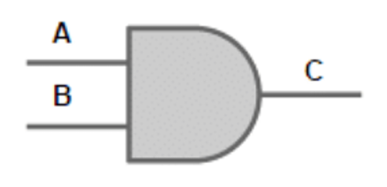
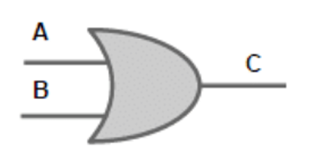
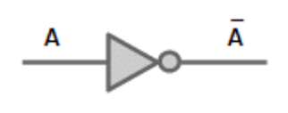
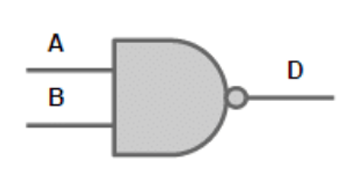
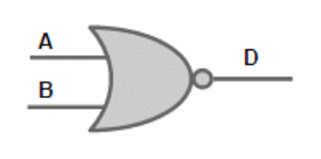
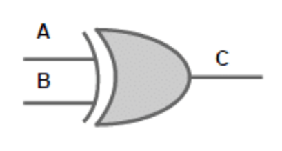
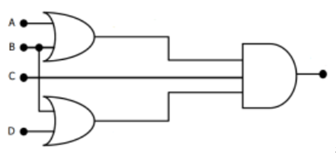
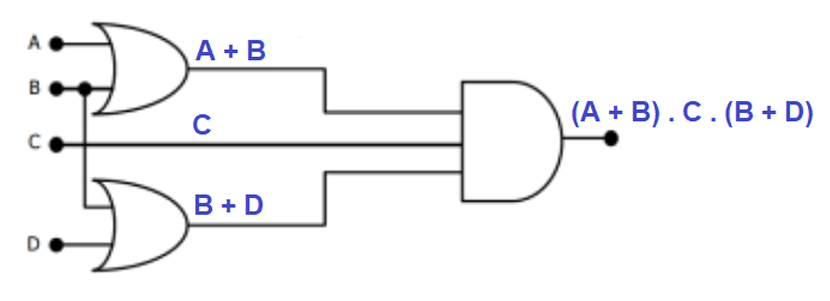

# Capítulo 11 – Proposições, Álgebra Booleana e Circuitos Lógicos

## Proposições e Tabelas Verdade

Para compreender como os circuitos lógicos dos computadores funcionam, é indispensável, antes de tudo, entender a lógica proposicional. A lógica é a base não apenas da eletrônica digital, mas de toda a computação moderna, desde algoritmos até o funcionamento dos processadores.

### Conceito de Proposição

Uma proposição é, de forma bem direta, uma sentença declarativa que, obrigatoriamente, deve poder ser classificada como **verdadeira (V)** ou **falsa (F)**. Ou seja, ela precisa ter um valor lógico bem definido. Por exemplo:

- “Eu estudo para provas.”
- “Eu gosto de viajar.”
- “Se eu estudo para provas, então eu gosto de viajar.”

Todas essas frases são exemplos de proposições, pois podemos julgá-las como verdadeiras ou falsas. Agora vejamos uma frase que **não é uma proposição**:

- “Boa noite!”

Perceba que essa expressão não pode ser classificada como verdadeira ou falsa. Trata-se apenas de uma saudação, portanto, não é uma proposição no contexto da lógica formal.

Nas representações lógicas, as proposições são normalmente representadas por letras minúsculas, como **p, q, r**, e podem ser combinadas através de **conectivos lógicos**, como veremos a seguir.

### Conectivos Lógicos e suas Tabelas Verdade

Os conectivos lógicos são responsáveis por formar **proposições compostas** a partir de proposições simples. Cada conectivo possui uma regra específica para determinar quando a proposição composta é verdadeira ou falsa. Para isso, utilizamos uma ferramenta fundamental: a **tabela verdade**, que mostra todas as combinações possíveis dos valores lógicos das proposições.

#### Negação (¬)

A negação, representada por símbolos como ¬, ~, NOT ou um traço sobre a proposição, simplesmente inverte o valor lógico da proposição. Se a proposição é verdadeira, sua negação é falsa, e vice-versa.

Exemplo:
Se **p = "Gosto de jogar bola"**, então a negação, representada por **¬p**, é "Não gosto de jogar bola".

|p|¬p|
|---|---|
|V|F|
|F|V|

#### Conjunção (E)

A conjunção é representada pelos símbolos **∧, ^, .** ou pela palavra **AND**. Ela é verdadeira **apenas quando ambas as proposições são verdadeiras**.

Exemplo:  
Se **p = "Gosto de jogar bola"** e **q = "Gosto de estudar"**, então **p ∧ q = "Gosto de jogar bola e gosto de estudar"**.

|p|q|p ∧ q|
|---|---|---|
|V|V|V|
|V|F|F|
|F|V|F|
|F|F|F|

#### Disjunção (OU)

A disjunção, representada por **∨, +** ou **OR**, é verdadeira sempre que **pelo menos uma das proposições for verdadeira**.

Exemplo:  
**p = "Gosto de jogar bola"**  
**q = "Gosto de estudar"**  
**p ∨ q = "Gosto de jogar bola ou gosto de estudar"**

|p|q|p ∨ q|
|---|---|---|
|V|V|V|
|V|F|V|
|F|V|V|
|F|F|F|

#### Disjunção Exclusiva (XOR)

A disjunção exclusiva, representada por **<u>∨</u>, ⊕** ou **XOR**, é verdadeira **somente quando uma das proposições for verdadeira, mas não ambas ao mesmo tempo**.

Exemplo:  
**p = "Gosto de jogar bola"**  
**q = "Gosto de estudar"**  
**p <u>∨</u> q = "Ou gosto de jogar bola, ou gosto de estudar (mas não ambos)"**

|p|q|p <u>∨</u> q|
|---|---|---|
|V|V|F|
|V|F|V|
|F|V|V|
|F|F|F|

#### Condicional (Se... Então)

O condicional é expresso por **→**, e lê-se **"Se p, então q"**. A condicional só é falsa quando a condição (**p**) é verdadeira, mas o resultado (**q**) é falso. Nos demais casos, ela é considerada verdadeira.

Exemplo:  
**p = "Gosto de jogar bola"**  
**q = "Gosto de estudar"**  
**p → q = "Se gosto de jogar bola, então gosto de estudar"**

|p|q|p → q|
|---|---|---|
|V|V|V|
|V|F|F|
|F|V|V|
|F|F|V|

#### Bicondicional (Se e Somente Se)

A bicondicional, representada por **↔**, estabelece que duas proposições são verdadeiras ou falsas **juntas**. Ou seja, só é verdadeira quando ambas possuem o mesmo valor lógico.

Exemplo:  
**p = "Gosto de jogar bola"**  
**q = "Gosto de estudar"**  
**p ↔ q = "Gosto de jogar bola se, e somente se, gosto de estudar"**

|p|q|p ↔ q|
|---|---|---|
|V|V|V|
|V|F|F|
|F|V|F|
|F|F|V|

### Quantidade de Linhas em uma Tabela Verdade

Existe uma fórmula simples que nos diz quantas linhas uma tabela verdade terá. Basta calcular **2 elevado ao número de proposições (n)**:

$$\text{Linhas} = 2^n$$

Por exemplo:

- Para 1 proposição: $21=22^1 = 2$ linhas.
- Para 2 proposições: $22=42^2 = 4$ linhas.
- Para 3 proposições: $23=82^3 = 8$ linhas.

### Tautologias, Contradições e Contingências

Uma **tautologia** ocorre quando uma proposição composta é **sempre verdadeira**, independentemente dos valores das proposições simples.

Exemplo clássico:  
**p ∨ ¬p** → "Gosto de estudar ou não gosto de estudar" → sempre verdadeiro.

|p|¬p|p ∨ ¬p|
|---|---|---|
|V|F|V|
|F|V|V|

Uma **contradição** ocorre quando uma proposição composta é **sempre falsa**, qualquer que seja o valor das proposições simples.

Exemplo clássico:  
**p ∧ ¬p** → "Gosto de estudar e não gosto de estudar" → sempre falso.

|p|¬p|p ∧ ¬p|
|---|---|---|
|V|F|F|
|F|V|F|

Uma **contingência** é uma proposição que pode ser verdadeira ou falsa, dependendo dos valores das proposições que a compõem.

Exemplo:  
**p ∧ q** → "Gosto de estudar e gosto de viajar"

|p|q|p ∧ q|
|---|---|---|
|V|V|V|
|V|F|F|
|F|V|F|
|F|F|F|

### Equivalência Lógica

Duas proposições são **equivalentes** quando possuem tabelas verdade idênticas. Ou seja, para qualquer combinação de valores das proposições simples, o valor da proposição composta é o mesmo.

Um exemplo clássico é a equivalência entre:  

**p → q**: “Se gosto de jogar bola, então gosto de estudar”
**¬p ∨ q**: “Não gosto de jogar bola ou gosto de estudar”

**p → q** ↔ **¬p ∨ q**

Vamos comparar suas tabelas:

|p|q|p → q|¬p|¬p ∨ q|
|---|---|---|---|---|
|V|V|V|F|V|
|V|F|F|F|F|
|F|V|V|V|V|
|F|F|V|V|V|

Perceba que a coluna de **p → q** e a de **¬p ∨ q** possuem exatamente os mesmos valores. Portanto, são logicamente equivalentes.

## Álgebra Booleana

A Álgebra Booleana é uma das ferramentas matemáticas mais importantes no universo da Arquitetura e Organização de Computadores. Ela é a base teórica que permite projetar, analisar e construir circuitos digitais. Tudo aquilo que, no tópico anterior, estudamos sob a ótica da lógica proposicional — com proposições, conectivos e tabelas verdade —, agora ganha uma aplicação prática, direta, no funcionamento físico dos circuitos eletrônicos que compõem os processadores e demais dispositivos digitais.

Mas afinal, o que é uma Álgebra Booleana? Trata-se de uma estrutura algébrica composta por um conjunto de elementos e operações que seguem regras específicas. Essas operações são, em essência, versões matemáticas da lógica que usamos no dia a dia — como os conceitos de **"e"**, **"ou"** e **"não"**.

Formalmente, uma Álgebra Booleana é definida como uma **6-upla (X, ∨, ∧, ¬, 0, 1)**, ou seja, um conjunto **X** acompanhado de duas operações binárias (**∨ e ∧**), uma operação unária (**¬**) e dois elementos especiais (**0 e 1**). Vamos compreender cada um desses elementos.

### Operações e Elementos Fundamentais da Álgebra Booleana

A Álgebra Booleana possui três operações fundamentais:

- A **disjunção** (ou lógico), representada por **∨**, por **+**, ou pela palavra **OR**.
- A **conjunção** (e lógico), representada por **∧**, por **.**, por **∗**, ou pela palavra **AND**.
- A **negação**, representada por **¬**, **~**, ou um traço sobre a variável, equivalente ao **NOT**.

Além das operações, existem dois elementos fundamentais:

- O elemento **0**, que representa o valor lógico **Falso** (ou **False**).
- O elemento **1**, que representa o valor lógico **Verdadeiro** (ou **True**).

Esses elementos e operações obedecem a um conjunto de propriedades e regras, chamadas de **axiomas da Álgebra Booleana**, que garantem o seu funcionamento lógico e coerente.

### Axiomas da Álgebra Booleana

Vamos explorar os principais axiomas que regem a Álgebra Booleana, sempre acompanhando com exemplos práticos que facilitam a compreensão.

**Propriedades Associativas:** O agrupamento dos elementos não altera o resultado, seja na operação de **ou** (**∨**) ou de **e** (**∧**).

$$(a ∨ b) ∨ c = a ∨ (b ∨ c)$$
$$(a ∧ b) ∧ c = a ∧ (b ∧ c)$$

Exemplo:  Se a = 1, b = 0 e c = 1, então:

$$(1 ∨ 0) ∨ 1 = 1 ∨ (0 ∨ 1) = 1$$

**Propriedades Comutativas:** A ordem dos operandos não altera o resultado.

$$a ∨ b = b ∨ a$$
$$a ∧ b = b ∧ a$$

Exemplo:

$$1 ∧ 0 = 0 ∧ 1 = 0$$
$$1 ∨ 0 = 0 ∨ 1 = 1$$

**Propriedades Absortivas:** Uma operação entre uma variável e ela mesma combinada com outra não altera o valor da variável.

$$a ∧ (a ∨ b) = a$$
$$a ∨ (a ∧ b) = a$$

Exemplo: Se a = 1 e b = 0:

$$1 ∧ (1 ∨ 0) = 1$$
$$1 ∨ (1 ∧ 0) = 1$$

**Propriedades Distributivas:** Assim como na matemática convencional, as operações podem ser distribuídas.

$$a ∨ (b ∧ c) = (a ∨ b) ∧ (a ∨ c)$$
$$a ∧ (b ∨ c) = (a ∧ b) ∨ (a ∧ c)$$

Exemplo:  Se a = 1, b = 0 e c = 1:

$$1 ∧ (0 ∨ 1) = (1 ∧ 0) ∨ (1 ∧ 1) → 1 = 0 ∨ 1 → 1$$

**Elementos Neutros:** Existe um elemento que, quando usado na operação, não altera o resultado.

$$a ∨ 0 = a$$
$$a ∧ 1 = a$$

Exemplo:

$$1 ∨ 0 = 1$$
$$0 ∧ 1 = 0$$

**Elementos Complementares:** Todo elemento tem seu oposto (complemento), e aplicando operações com ele gera resultados extremos (Verdadeiro ou Falso).

$$a ∨ ¬a = 1$$
$$a ∧ ¬a = 0$$

Exemplo:

$$1 ∨ ¬1 = 1 ∨ 0 = 1$$
$$0 ∧ ¬0 = 0 ∧ 1 = 0$$

### Teoremas Fundamentais da Álgebra Booleana

A partir dos axiomas, podemos derivar teoremas importantes, muito utilizados tanto na simplificação de expressões lógicas quanto na construção de circuitos.

**Idempotência:** Aplicar a mesma operação sobre o mesmo valor não altera o valor.

$$a ∨ a = $$
$$a ∧ a = a$$

Exemplo:

$$1 ∨ 1 = 1$$
$$0 ∧ 0 = 0$$

**Dupla Negação:** Negar duas vezes traz o valor original.

$$¬(¬a) = a$$

Exemplo: Se a = 1, então

$$¬(¬1) = ¬0 = 1$$

**Leis de De Morgan:** Importantíssimas tanto na lógica formal quanto na engenharia de computadores. Elas descrevem como a negação de uma conjunção se transforma em uma disjunção das negações, e vice-versa.

$$¬(a ∨ b) = ¬a ∧ ¬b$$
$$¬(a ∧ b) = ¬a ∨ ¬b$$

Exemplo: Se a = 1 e b = 0:

$$¬(1 ∨ 0) = ¬1 ∧ ¬0 → 0 ∧ 1 = 0$$
$$¬(1 ∧ 0) = ¬1 ∨ ¬0 → 0 ∨ 1 = 1$$

**Absorção:** Permite reduzir expressões complexas.

$$a ∨ (a ∧ b) = a$$
$$a ∧ (a ∨ b) = a$$

Exemplo: Se a = 1, b = 0:

$$1 ∨ (1 ∧ 0) = 1 ∨ 0 = 1$$
$$1 ∧ (1 ∨ 0) = 1 ∧ 1 = 1$$

**Elementos Absorventes:** Algumas combinações anulam ou afirmam diretamente o resultado.

$$a ∨ 1 = 1$$
$$a ∧ 0 = 0$$

Exemplo:

$$1 ∨ 1 = 1$$
$$0 ∧ 1 = 0$$

**Negações de Zero e Um:**

$$¬0 = 1$$
$$¬1 = 0$$

### Definição Formal do XOR na Álgebra Booleana

O operador **XOR** (disjunção exclusiva), que vimos na lógica proposicional, também tem sua definição formal na Álgebra Booleana. Ele pode ser expresso de duas formas equivalentes:

$$a ⊕ b = (a ∨ b) ∧ (¬a ∨ ¬b)$$
$$a ⊕ b = (a ∧ ¬b) ∨ (¬a ∧ b)$$

Ambas as expressões significam o mesmo: o resultado será verdadeiro quando **a** e **b** forem diferentes.

Exemplo com a = 0, b = 0. Primeira definição:

$$(0 ∨ 0) ∧ (¬0 ∨ ¬0) → 0 ∧ (1 ∨ 1) → 0 ∧ 1 = 0$$

Segunda definição:

$$(0 ∧ ¬0) ∨ (¬0 ∧ 0) → (0 ∧ 1) ∨ (1 ∧ 0) → 0 ∨ 0 = 0$$

O mesmo pode ser feito para qualquer combinação de valores.

### Conexão direta com os Circuitos Lógicos

Todo este conjunto de regras e operações que a Álgebra Booleana estabelece não é apenas uma abstração matemática, mas sim a essência do funcionamento dos circuitos digitais. As portas lógicas físicas — como AND, OR, NOT, XOR — implementam essas operações diretamente no hardware, utilizando sinais elétricos que representam os valores 0 e 1. Ou seja, compreender a Álgebra Booleana é um passo essencial para compreender os circuitos que executam as instruções em um computador.

## Circuitos Lógicos

Depois de entendermos profundamente os conceitos de proposições, tabelas verdade e álgebra booleana, é hora de transformar toda essa teoria em prática. Os circuitos lógicos são, na essência, a materialização física da lógica booleana. Toda a operação de um computador — desde as instruções mais simples até os cálculos mais sofisticados — ocorre por meio da combinação de milhões ou bilhões desses circuitos básicos.

Quando falamos de uma porta lógica, estamos nos referindo a um circuito eletrônico capaz de executar uma operação booleana específica. Esses circuitos são formados por transistores, que funcionam como interruptores controlados eletricamente. Com eles, é possível construir desde as unidades lógicas e aritméticas (ULAs) dos processadores até as unidades de controle, memórias e dispositivos de entrada e saída.

### Portas Lógicas Básicas

Vamos revisar agora as portas lógicas fundamentais, relacionando cada uma delas com sua respectiva tabela verdade, operação booleana e aplicação prática.

#### Porta AND (E)

A porta AND representa a conjunção lógica, aquela que retorna verdadeiro apenas quando todas as suas entradas forem verdadeiras. É uma das portas mais utilizadas em circuitos digitais, especialmente na construção de somadores, comparadores e unidades de controle.

Seu funcionamento segue exatamente a tabela verdade da conjunção:

|A|B|A ∧ B|
|---|---|---|
|V|V|V|
|V|F|F|
|F|V|F|
|F|F|F|

Na prática eletrônica, associamos o valor **V** ao nível lógico **1** e o valor **F** ao nível lógico **0**.

A representação algébrica dessa porta é simples:

$$C = A ∧ B \quad \text{ou} \quad C = A \cdot B$$

  

Por exemplo, se A = 1 e B = 1, então C = 1. Já se A = 1 e B = 0, C será 0. A lógica é bem intuitiva: a saída só será 1 se **todas** as entradas forem 1.

#### Porta OR (OU)

A porta OR realiza a disjunção lógica, retornando verdadeiro sempre que pelo menos uma das suas entradas for verdadeira. Esta porta é muito empregada quando se deseja verificar se **alguma condição** é satisfeita.

Veja sua tabela verdade:

|A|B|A ∨ B|
|---|---|---|
|V|V|V|
|V|F|V|
|F|V|V|
|F|F|F|

Sua representação algébrica é:

$$C = A ∨ B \quad \text{ou} \quad C = A + B$$

  

Por exemplo, se A = 1 e B = 0, C será 1. Somente se ambas forem 0 é que a saída será 0.

#### Porta NOT (NÃO)

A porta NOT é responsável pela negação lógica. Ela possui apenas uma entrada e inverte o seu valor: se a entrada é 1, a saída é 0; se a entrada é 0, a saída é 1.

Sua tabela verdade é bem simples:

|A|¬A|
|---|---|
|V|F|
|F|V|

A representação algébrica é:

$$¬A \quad \text{ou} \quad \overline{A}$$

  

Por exemplo, se A = 0, a saída é 1; e se A = 1, a saída é 0.

#### Porta NAND (NOT AND)

A porta NAND é a junção das operações AND e NOT. Primeiro ela calcula a conjunção (AND) e, em seguida, inverte o resultado.

A tabela verdade da porta NAND é a seguinte:

|A|B|¬(A ∧ B)|
|---|---|---|
|V|V|F|
|V|F|V|
|F|V|V|
|F|F|V|

Seu funcionamento pode ser descrito pela expressão:

$$D = ¬(A ∧ B) \quad \text{ou} \quad D = \overline{(A \cdot B)}$$

  

Por exemplo:
- Se A = 1 e B = 1, então A ∧ B = 1, e sua negação dá 0.
- Se A = 1 e B = 0, A ∧ B = 0, e sua negação dá 1.

A importância da porta NAND é tão grande na eletrônica que ela é conhecida como **porta universal**, pois é possível construir qualquer outro tipo de porta lógica (AND, OR, NOT, etc.) utilizando apenas portas NAND.

#### Porta NOR (NOT OR)

A porta NOR realiza primeiro a operação OR e, em seguida, aplica a negação do resultado.

Tabela verdade da NOR:

|A|B|¬(A ∨ B)|
|---|---|---|
|V|V|F|
|V|F|F|
|F|V|F|
|F|F|V|

Sua expressão é:

$$D = ¬(A ∨ B) \quad \text{ou} \quad D = \overline{(A + B)}$$

  

Exemplificando:
- Se A = 0 e B = 0, o OR dá 0, e a negação dá 1.
- Se A = 1 e B = 0, o OR dá 1, e a negação dá 0.

Assim como a NAND, a NOR também é considerada uma **porta universal**, capaz de formar qualquer circuito digital.

#### Porta XOR (OU Exclusivo)

A porta XOR, conhecida como **OU exclusivo**, retorna verdadeiro apenas quando **as entradas são diferentes**.

Veja sua tabela verdade:

|A|B|A ⊕ B|
|---|---|---|
|V|V|F|
|V|F|V|
|F|V|V|
|F|F|F|

Sua expressão algébrica é:  
$$C = A ⊕ B \quad$$

  

Funcionamento prático:
- Se A = 1 e B = 0, a saída é 1.
- Se A = 1 e B = 1, a saída é 0.

A porta XOR é bastante utilizada em somadores, comparadores e operações de paridade (como em detecção de erros).

### Montagem de Circuitos Combinacionais

Agora que entendemos como funcionam as portas lógicas, vamos ver como elas se combinam para formar circuitos capazes de executar funções mais complexas.

Imagine um circuito formado pelas seguintes conexões:

  

1. Uma porta OR recebe como entrada os sinais A e B.
2. O sinal C é passado diretamente, sem alterações.
3. Uma segunda porta OR recebe como entrada os sinais B e D.
4. Por fim, uma porta AND recebe como entrada:
    - O resultado da primeira OR,
    - O sinal C,
    - E o resultado da segunda OR.

Montando a expressão booleana, temos:

$$\text{Saída} = (A + B) \cdot C \cdot (B + D)$$

  

Esse circuito combina três operações lógicas: duas disjunções (OR) e uma conjunção (AND). Cada entrada tem seu papel e qualquer alteração em uma delas impacta diretamente na saída.

### A Relação Entre a Lógica e o Hardware

É fundamental entender que tudo o que ocorre dentro de um processador, desde operações aritméticas até comparações e decisões, é realizado por circuitos como esses. Um simples somador, por exemplo, é construído a partir de portas AND, OR e XOR interconectadas de forma precisa.

E o mais impressionante: enquanto aqui visualizamos um circuito com quatro entradas, um processador moderno possui bilhões de transistores organizados em milhões de portas lógicas, processando informações simultaneamente em velocidades medidas na casa dos gigahertz.

## Considerações Finais

Ao longo deste capítulo, aprofundamos nossa compreensão sobre como os conceitos abstratos da lógica booleana se traduzem em circuitos concretos que compõem os computadores modernos. Desde a análise de proposições e construção de tabelas verdade, até a implementação de portas lógicas, circuitos combinacionais e sequenciais, percebemos que toda a base da arquitetura digital está sustentada pela aplicação rigorosa desses princípios.

Mais do que simplesmente entender como uma porta AND ou OR funciona isoladamente, é fundamental perceber como a interligação dessas portas permite construir sistemas extremamente complexos, capazes de executar bilhões de instruções por segundo.

Por fim, fica evidente que a lógica booleana não é apenas uma abstração matemática, mas a própria linguagem do hardware. Sem ela, não existiria o processamento digital como conhecemos hoje. Este capítulo nos preparou para olhar para dentro de qualquer dispositivo eletrônico — seja um computador, um smartphone ou um sistema embarcado — e entender que, no nível mais básico, tudo se resume a combinações elegantes de zeros e uns, habilmente manipulados por circuitos digitais.
