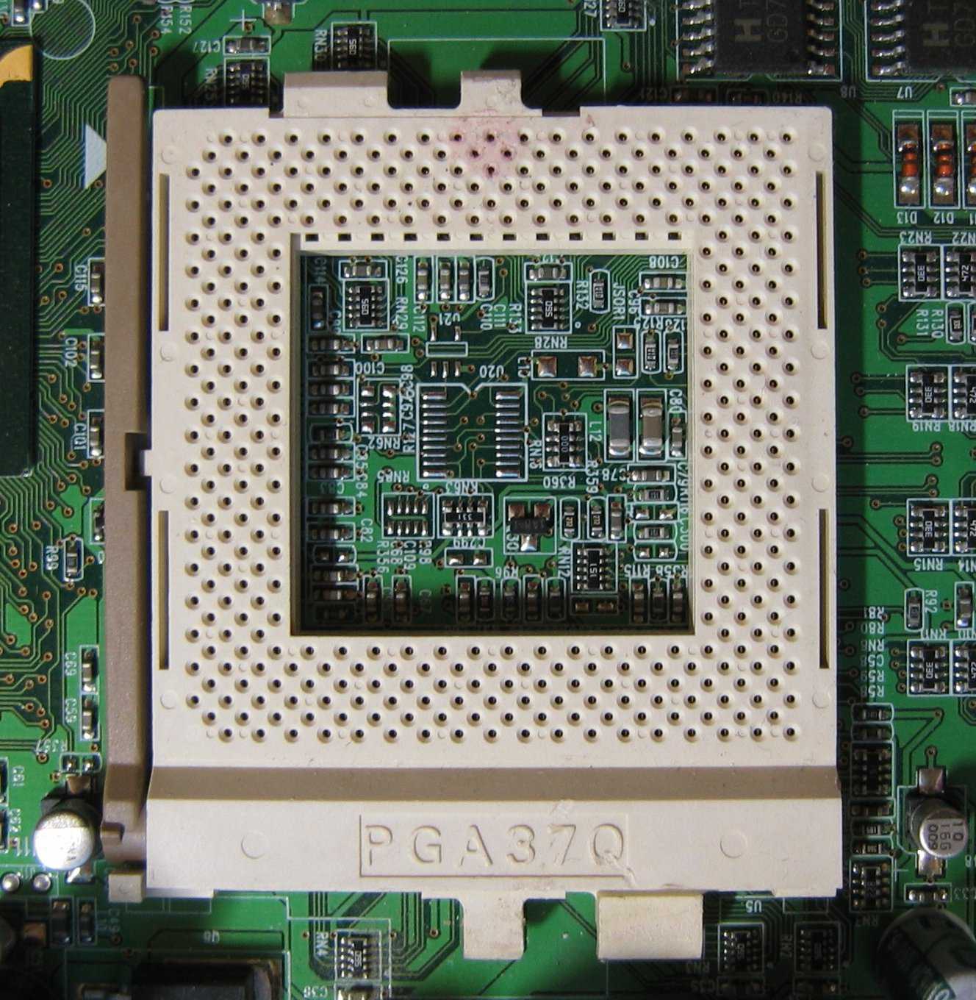

# Capítulo 12 – Hardware: Componentes, Processadores e Manutenção

Nos capítulos anteriores, mergulhamos nos fundamentos lógicos e conceituais que regem a arquitetura e organização dos computadores. Exploramos desde os sistemas de numeração e a álgebra booleana até a complexa dança das instruções dentro da Unidade Central de Processamento e a hierarquia das memórias. Agora, é chegado o momento de transitar do abstrato para o concreto, investigando o **hardware** – o conjunto tangível de componentes que dá vida a essas máquinas fascinantes.

Este capítulo se dedica a desvendar o universo dos componentes físicos que constituem um computador moderno. Iniciaremos nossa jornada identificando as peças fundamentais e os periféricos que permitem a interação e a funcionalidade dos sistemas. Em seguida, focaremos nossa atenção no "cérebro" da máquina, analisando as características e a evolução dos principais processadores disponíveis no mercado. Por fim, abordaremos aspectos práticos essenciais relacionados à instalação, configuração e manutenção desses complexos arranjos eletrônicos, capacitando o leitor não apenas a compreender, mas também a interagir de forma consciente e eficaz com o hardware.

## Desconstruindo o Computador: Componentes Nucleares e Periféricos Essenciais

Um sistema computacional, em sua essência, é uma sinfonia de componentes eletrônicos trabalhando em harmonia. No coração dessa orquestra, encontramos peças vitais como o **processador (CPU)**, a **placa-mãe**, as diversas formas de **memórias** e um conjunto de **dispositivos de entrada e saída (E/S)**. As memórias, como já exploramos, são cruciais para o armazenamento de dados, seja de forma efêmera para processamento imediato (RAM) ou de maneira persistente para futuras consultas (discos rígidos, SSDs). Os dispositivos de E/S, por sua vez, formam a ponte entre o usuário e a máquina, englobando desde o teclado e o mouse, que nos permitem inserir comandos e dados, até o monitor e a impressora, que externalizam os resultados do processamento. Todos esses elementos encontram seu ponto de convergência na placa-mãe, que oferece as interfaces e os caminhos necessários para sua interconexão e comunicação, conforme ilustrado na figura a seguir.

  

  

Esses componentes internos, incluindo o processador, os módulos de memória e a própria placa-mãe, são delicadamente alojados e protegidos dentro de uma estrutura metálica ou plástica conhecida como **gabinete**. É comum, no linguajar popular, referir-se ao gabinete como "CPU", mas é crucial reforçar que CPU é a sigla para Central Processing Unit, ou Unidade Central de Processamento – o processador em si. O gabinete é, portanto, o invólucro que abriga a CPU e os demais componentes. Existem primordialmente dois modelos de gabinetes: o modelo **desktop**, que possui um design horizontal e era frequentemente utilizado como suporte para o monitor, e o modelo **torre** (ou **tower**), que se posiciona verticalmente.

  

### O Processador (CPU): O Cérebro Eletrônico da Máquina

O **processador**, ou Unidade Central de Processamento (CPU), é um microchip de altíssima complexidade, considerado o verdadeiro "cérebro" do computador. Sua função primordial é a execução de operações lógicas e aritméticas em velocidades espantosas. Podemos conceber o processador como uma calculadora extraordinariamente potente e versátil. Suas responsabilidades fundamentais podem ser sumarizadas em três grandes eixos:

1. **Execução de Cálculos e Comparações**: Realizar operações aritméticas (soma, subtração, multiplicação, divisão) e comparações lógicas (maior que, menor que, igual a) sobre os dados.
2. **Gerenciamento e Interpretação de Instruções**: Orquestrar o funcionamento de todos os equipamentos e softwares, interpretando cada instrução de um programa e gerenciando sua execução sequencial ou paralela.
3. **Administração de Dados na Memória**: Controlar a transferência de dados entre os diversos componentes do sistema (como memória principal, dispositivos de E/S e unidades de armazenamento) e a memória central, visando seu subsequente processamento.

Os fabricantes mais proeminentes de processadores para computadores pessoais e servidores são a **Intel** e a **AMD**. A velocidade de operação desses chips é tipicamente medida em Gigahertz (GHz), indicando bilhões de ciclos de processamento por segundo. A figura ilustra a aparência física de um processador moderno da Intel.

  

Devido à natureza de seu trabalho – a execução de milhões ou bilhões de cálculos por segundo – e ao fato de que a passagem de corrente elétrica através dos materiais semicondutores inevitavelmente encontra resistência, os processadores geram uma quantidade significativa de calor. Esse aquecimento, se não controlado, pode levar a instabilidades no sistema, travamentos e, em casos extremos, danos permanentes ao chip.

Para mitigar esse problema, utiliza-se um dispositivo de refrigeração chamado **cooler** (termo inglês para "refrigerador"). O cooler é essencial para manter a temperatura do processador dentro de limites operacionais seguros. A maioria dos computadores desktop possui ao menos dois coolers: um dedicado especificamente ao processador e outro integrado à fonte de alimentação, para dissipar o calor gerado por ela. Sistemas mais robustos, especialmente aqueles voltados para jogos ou tarefas de alta performance, podem incluir coolers adicionais para refrigerar placas de vídeo, discos rígidos e outros componentes geradores de calor. É crucial que o cooler do processador seja adequadamente dimensionado para a sua capacidade de dissipação térmica; um cooler subdimensionado pode resultar em superaquecimento, comprometendo a estabilidade e a longevidade do processador. A seguir temos um exemplo de cooler para CPU, acoplado a um dissipador de calor.

  

Para otimizar a transferência de calor entre a superfície do processador e a base do cooler (geralmente um dissipador metálico), aplica-se uma substância conhecida como **pasta térmica**. Trata-se de um composto viscoso, com alta condutividade térmica, geralmente de coloração branca ou prateada (dependendo de sua composição, que pode incluir prata, cerâmica ou silicone). A pasta térmica preenche as microfissuras e imperfeições existentes nas superfícies de contato do processador e do dissipador, garantindo uma transferência de calor mais eficiente.

  

### A Placa-Mãe: A Espinha Dorsal do Sistema

A **placa-mãe** (do inglês, **motherboard**) é, sem dúvida, a placa de circuito impresso principal de um computador. Ela é constituída por um complexo conjunto de circuitos integrados e trilhas condutoras que servem como plataforma de conexão para todos os demais componentes do sistema. É na placa-mãe que o processador é instalado, os módulos de memória são encaixados, e os conectores para teclado, mouse, impressora, unidades de armazenamento e placas de expansão são disponibilizados. Se o processador é frequentemente comparado ao cérebro, a placa-mãe pode ser vista como a "espinha dorsal", pois é responsável por interligar e facilitar a comunicação entre a CPU e todos os outros periféricos e componentes. A figura apresenta uma visão geral de uma placa-mãe típica.

  

Historicamente, em gerações mais antigas de computadores (como os equipados com processadores 386 e anteriores), os processadores eram frequentemente soldados diretamente na placa-mãe ou encaixados em soquetes de pressão simples. Naquela época, a frequência de operação da placa-mãe era geralmente fixa, e a prática de multiplicar o clock do processador internamente ainda não era comum, o que reduzia a necessidade de substituição do processador. O **soquete** (ou **socket**) é o componente físico na placa-mãe que provê as conexões mecânicas e elétricas necessárias para instalar um microprocessador. Essa interface permite que o processador seja facilmente inserido, removido ou substituído sem a necessidade de soldagem, uma característica crucial para manutenções e upgrades. A figura ilustra um exemplo de soquete de processador.

  

Os nomes atribuídos aos soquetes frequentemente fornecem uma indicação do número de pinos ou contatos que eles suportam. Por exemplo, o soquete **PGA370**, um padrão mais antigo, foi projetado para processadores com 370 pinos e era comumente utilizado para modelos como o Intel Pentium III e Celeron.

  

A compatibilidade entre processador e soquete é um aspecto crítico na montagem ou atualização de um computador. Cada família e geração de processadores é projetada para um tipo específico de soquete. A seguir, apresentamos tabelas que detalham os soquetes utilizados por processadores mais recentes, tanto para computadores de mesa quanto para portáteis. É importante notar que as pinagens marcadas com um asterisco (\*) indicam que o processador é soldado diretamente na placa-mãe (comum em dispositivos portáteis e sistemas embarcados, utilizando a tecnologia BGA - Ball Grid Array), não utilizando um soquete tradicional. Estas tabelas servem como referência para consulta técnica.

**Tabela de Soquetes para Processadores de Computadores de Mesa (Desktop)**

| Soquete | Pinos | Processadores Suportados |
|---|---|---| 
| LGA1150; H3 | 1150 | Core i3 série 4000; Core i5 séries 4000 e 5000; Core i7 séries 4700 e 5700; Pentium série G3000; Celeron série G1800 |
| FCBGA1364* | 1364 | Core i7-4770R |
| FCBGA1170* | 1170 | Pentium série J, Celeron série J | 
| FM2+; FM2r2 | 906 | Athlon, A4, A4 PRO, A6, A6 PRO, A8, A8 PRO, A10 e A10 PRO (soquete FM2+) | 
| AM1; FS1b | 722 | Athlon (soquete AM1), Sempron (soquete AM1) |
| LGA2011v3; R3| 2011 | Core i7 série 5000 | 
| LGA1151; H4 | 1151 | Core i3 séries 6000, 7000 e 8000; Core i5 séries 6000, 7000 e 8000; Core i7 séries 6000, 7700 e 8000; Pentium série G4000; Pentium Gold série G5000; Celeron séries G3000 e G4000 |
| AM4 | 1331 | Ryzen |
| LGA2066; R4 | 2066 | Core i7 série 7800, Core i9 série 7900 |
| TR4; SP3r2 | 4094 | Ryzen Threadripper |

**Tabela de Soquetes para Processadores AMD (Computadores Portáteis - Laptops)**

| Soquete | Pinos | Processadores Suportados | 
|---|---|---| 
| FS1 | 722 | A4, A6, A8, A10, E2-3000M |
| FP2* | 827 | A4, A6, A8, A10 |
| FT3* | 769 | A4 série 1000, A4-5000, A4-5100, A4 PRO-3340B, A6 série 1000, A6-5200, E1 série 2000, E2-3000, E2-3800 |
| FP3* | ND | A6 série 7000, A8 série 7000, A10 série 7000, FX série 7000 | 
| FT3b* | 769 | A4 Micro-6400T, A4-6210, A6-6310, A8-6410, A10 Micro-6700T, E1 Micro6200T, E1-6010, E2-6110 |
| FP4* | ND | A6 série 8000, A8 série 8000, A10 séries 8000 e 9000, A12 séries 8000 e 9000, FX séries 8000 e 9000 |
| FP5* | ND | Ryzen |

**Tabela de Soquetes para Processadores Intel (Computadores Portáteis - Laptops)**

| Soquete | Pinos | Processadores Suportados |
|---|---|---|
| BGA1364* | 1364 | Core i5 série 5000H, Core i7 séries 4000H e 5000H |
| BGA1168* | 1168 | Celeron série 3000U; Pentium série 3000U; Core i3 séries 4000U, 4000Y e 5000U; Core i5 séries 4000U, 4000Y e 5000U; Core i7 séries 4000U, 4000Y e 5000U |
| UTFCBGA1380* | 1380 | Atom séries Z3700, Z3700D e Z3700E |
| BGA1170* | 1170 | Atom série E3800 |
| UTFCBGA592* | 592 | Atom séries Z3700F e Z3700G |
| FCBGA1234* | 1234 | Core M série 5Y00 |
| FCBGA1356* | 1356 | Celeron série 3000U, Pentium série 4000U, Core i3 séries 6000U, 7000U e 8000U, Core i5 séries 6000U e 7000U, Core i7 séries 6000U e 7000U |
| FCBGA1440* | 1440 | Core i3 série 6000H e 7000H; Core i5 séries 6000H, 7000H, 8000B e 8000H; Core i7 séries 6000H, 7000H, 8000B e 8000H; Core i9 série 8000; Xeon E; Xeon E3 v5; Xeon E3 v6 |
| FCBGA1515* | 1515 | Pentium série 4000Y, Core i5 série 7Y00, Core i7 série 7Y00, Core m3 séries 6Y00 e 7Y00, Core m5 série 6Y00, Core m7 série 6Y00 |
| BGA2270* | 2270 | Core i7 série 8000G |
| FCBGA1528* | 1528 | Core i3 série 8000U, Core i5 série 8000U, Core i7 série 8000U |

### O Chipset: O Gerente de Tráfego da Placa-Mãe

O **chipset** é um conjunto de circuitos integrados (chips) na placa-mãe que desempenha um papel crucial no controle e gerenciamento do fluxo de dados entre o processador, a memória e os periféricos. Ele atua como um centro de controle, direcionando o tráfego de informações e garantindo que todos os componentes possam se comunicar eficientemente. Em placas-mãe mais antigas e em algumas atuais, é comum encontrar uma arquitetura de chipset dividida em dois componentes principais: a **Ponte Norte (Northbridge)** e a **Ponte Sul (Southbridge)**.

A **Ponte Norte**, também conhecida como MCH (Memory Controller Hub), está diretamente conectada ao processador através de um barramento de alta velocidade chamado FSB (Front-Side Bus). Suas responsabilidades incluem o gerenciamento das comunicações que exigem maior desempenho e largura de banda, como o acesso à memória RAM e a comunicação com a placa de vídeo (frequentemente através do barramento AGP ou PCI Express).

  

A **Ponte Sul**, ou ICH (I/O Controller Hub), por sua vez, gerencia os componentes e barramentos de menor velocidade. Ela não se conecta diretamente ao processador, mas sim à Ponte Norte. A Ponte Sul controla interfaces como os barramentos PCI, portas USB, interfaces de armazenamento (SATA/PATA), áudio onboard, rede onboard e outros periféricos de entrada e saída. A [Figura - Chip ponte sul] demonstra a arquitetura completa com a Ponte Norte e a Ponte Sul, exemplificando os barramentos tipicamente associados a cada uma.

  

É importante notar que, em arquiteturas de processadores mais modernas (especialmente da Intel a partir da primeira geração Core i e em muitos processadores AMD), as funcionalidades da Ponte Norte, como o controlador de memória e, por vezes, o controlador PCI Express principal, foram integradas diretamente ao próprio processador. Nesses casos, a placa-mãe pode apresentar um único chip principal, muitas vezes chamado de PCH (Platform Controller Hub), que assume as funções remanescentes da Ponte Norte e todas as funções da Ponte Sul. Essa integração visa reduzir a latência e aumentar a largura de banda para componentes críticos.

### Barramentos: As Vias de Comunicação do Hardware

O hardware de um computador é um ecossistema de componentes eletrônicos, circuitos integrados e placas que necessitam trocar informações constantemente. Essa comunicação é viabilizada pelos **barramentos**, que podem ser entendidos como um sistema de interconexão, um conjunto de vias ou canais elétricos que ligam os diversos componentes do computador, permitindo a transferência de dados, endereços e sinais de controle.

  

Existem, fundamentalmente, três tipos de barramentos:

1. **Barramento de Dados**: Transporta os dados propriamente ditos entre o processador, a memória e os periféricos. Sua largura (número de bits que pode transmitir simultaneamente) é um fator crucial para o desempenho.
2. **Barramento de Endereços**: Utilizado pelo processador para especificar a localização (endereço) na memória ou o dispositivo de E/S com o qual deseja se comunicar. A largura deste barramento determina a quantidade máxima de memória que o sistema pode endereçar.
3. **Barramento de Controle**: Transporta sinais de controle e temporização que coordenam as atividades do sistema, como sinais de leitura/escrita, interrupções e status dos dispositivos.

O desempenho de um barramento é caracterizado principalmente por dois fatores:

- **Largura de Banda**: Refere-se à quantidade de bits que podem ser transmitidos simultaneamente. Geralmente, são potências de 2, como 8 bits, 16 bits, 32 bits, 64 bits, e assim por diante. Quanto maior a largura, mais dados podem ser transferidos por ciclo.
- **Velocidade de Transmissão (Clock do Barramento)**: Medida em Hertz (Hz) ou múltiplos (MHz, GHz), indica a frequência com que os dados são transferidos. A taxa de transferência efetiva é frequentemente expressa em bits por segundo (bps) ou bytes por segundo (Bps) e seus múltiplos (Kbps, Mbps, GBps).

Ao longo da evolução dos computadores, diversos padrões de barramento surgiram, cada um com suas características e finalidades:

- **ISA (Industry Standard Architecture)**: Um dos primeiros barramentos utilizados em PCs, introduzido em 1981. Inicialmente operava com 8 bits e, posteriormente, foi expandido para 16 bits, com uma frequência de clock de 8 MHz. É um padrão obsoleto, não encontrado em computadores novos.
- **EISA (Extended ISA)**: Uma evolução do ISA, mantendo a compatibilidade com este. O EISA também operava a 8 MHz, mas suportava palavras de 32 bits. Para garantir a retrocompatibilidade, os slots EISA foram projetados com duas linhas de contatos, permitindo o encaixe tanto de placas EISA quanto de placas ISA (8 ou 16 bits). Uma placa EISA utilizava todos os contatos, enquanto uma placa ISA utilizava apenas a primeira seção. O barramento EISA possuía a capacidade de identificar inteligentemente se a placa instalada era ISA ou EISA.

    

- **PCI (Peripheral Component Interconnect)**: Desenvolvido para superar as limitações do ISA e EISA, o barramento PCI tornou-se um padrão dominante por muitos anos. Ele pode transferir dados a 32 ou 64 bits e operar a frequências de 33 MHz ou 66 MHz. Em sua configuração mais comum (32 bits a 33 MHz), atinge uma taxa de transferência (throughput) de aproximadamente 133 MBps. Os slots PCI são fisicamente menores que os slots ISA, assim como os dispositivos projetados para ele.

    Uma característica importante introduzida com o PCI foi o suporte ao recurso **Plug and Play (PnP)**. Essa funcionalidade permite que o sistema operacional reconheça e configure automaticamente os dispositivos conectados aos slots PCI, simplificando a instalação de novo hardware. O usuário geralmente precisa apenas conectar o dispositivo e, no máximo, instalar os drivers fornecidos pelo fabricante, embora muitos sistemas operacionais modernos consigam instalar drivers genéricos ou buscar os específicos automaticamente.

- **AMR (Audio Modem Riser)**: Um barramento mais simples, projetado especificamente para placas que exigem pouco poder de processamento, como placas de som básicas ou modems analógicos. O slot AMR visava reduzir o custo da implementação dessas funcionalidades.

- **AGP (Accelerated Graphics Port)**: Como o nome sugere, o AGP foi um barramento desenvolvido exclusivamente para o encaixe de placas de vídeo, visando fornecer uma conexão de alta velocidade e dedicada entre a placa gráfica e o sistema (especificamente, a Ponte Norte do chipset ou o processador).

    - **AGP 1.0**: Podia operar em modo 1x (taxa de transferência de até 266 MBps) ou 2x (até 532 MBps), alimentado por 3,3V.
    - **AGP 2.0**: Introduziu o modo 4x, com taxa de transferência de até 1066 MBps e alimentação de 1,5V.
    - **AGP 3.0**: Operava em modo 8x, alcançando até 2133 MBps com alimentação de 0,8V.

    Além da alta taxa de transferência, o AGP oferecia a vantagem de ser um barramento dedicado, evitando a concorrência por largura de banda com outros dispositivos. Outro recurso notável era o **DIME (Direct Memory Execute)**, que permitia à placa de vídeo utilizar uma porção da memória RAM principal do sistema como uma extensão de sua própria memória de vídeo, útil para texturas e outros dados gráficos.
    

- **PCI-Express (PCIe ou PCI-E)**: É o padrão de barramento de expansão de alta velocidade predominante nos computadores modernos, projetado para substituir tanto o PCI quanto o AGP. O PCI Express utiliza uma arquitetura serial ponto-a-ponto, baseada em "pistas" (lanes), onde cada pista consiste em dois pares de fios (um para transmissão e outro para recepção), permitindo comunicação full-duplex. Ele está disponível em diversas configurações, indicadas pelo número de pistas: x1, x2, x4, x8, x16 (e x32 em algumas aplicações de servidor). Quanto maior o número de pistas, maior a taxa de transferência de dados. Essa flexibilidade também se reflete no tamanho físico dos slots.

    - Um slot **PCIe x16**, por exemplo, é o mais longo e oferece a maior largura de banda, sendo universalmente utilizado para placas de vídeo de alto desempenho. Um PCIe 3.0 x16 pode oferecer uma taxa de transferência teórica de aproximadamente 15.75 GBps.
    - Um slot **PCIe x1**, o mais curto, é suficiente para dispositivos com menor demanda de dados, como placas de rede, placas de som ou controladoras USB adicionais, oferecendo cerca de 985 MBps (PCIe 3.0). A [Figura - Slots PCIe x1 e x16] mostra um slot PCIe x1 e um slot PCIe x16 à esquerda, e uma placa de vídeo projetada para o slot PCIe x16 à direita.

    O PCI Express evoluiu através de várias gerações (1.x, 2.x, 3.0, 4.0, 5.0, e mais recentes), cada uma dobrando aproximadamente a taxa de transferência por pista em relação à geração anterior, mantendo, em geral, retrocompatibilidade.

### Interfaces de Conexão para Dispositivos de Armazenamento

Tão importante quanto a velocidade de um dispositivo de armazenamento (como um disco rígido ou SSD) é a interface utilizada para conectá-lo à placa-mãe. A interface define o padrão de comunicação e a largura de banda disponível para a transferência de dados. Vejamos as principais interfaces:

- **IDE (Integrated Drive Electronics) ou PATA (Parallel Advanced Technology Attachment)**: Foi o padrão dominante para conectar discos rígidos e drives ópticos (CD/DVD) por muitos anos. Como o nome PATA sugere, utiliza uma transmissão paralela de dados, onde múltiplos bits são enviados simultaneamente através de um cabo flat (largo e achatado). Uma única porta IDE na placa-mãe tipicamente suportava a conexão de até dois dispositivos, configurados como **master** (mestre/principal) e **slave** (escravo/secundário). Abaixo temos um cabo IDE/PATA de 80 vias; a extremidade preta (ou azul) conecta-se à placa-mãe, enquanto os conectores cinza (meio) e preto (ponta) destinam-se aos dispositivos.

Embora a transmissão paralela possa sugerir maior velocidade, o PATA sofre com problemas de interferência eletromagnética (crosstalk) entre os fios do cabo, especialmente em frequências mais altas, limitando seu desempenho. Os cabos IDE originais possuíam 40 vias (fios). Posteriormente, foram introduzidos cabos de 80 vias, onde os 40 fios adicionais eram terras intercalados para reduzir a interferência e permitir velocidades maiores (modos Ultra DMA). A configuração de um dispositivo como **master** ou **slave** era realizada através de **jumpers**, pequenas peças plásticas com um contato metálico interno, que eram posicionadas em um conjunto de pinos no próprio dispositivo. Veja um jumper configurando um HD como master:

- **SATA (Serial Advanced Technology Attachment)**: É a interface que sucedeu e substituiu o PATA, tornando-se o padrão atual para a conexão de discos rígidos, SSDs e drives ópticos em computadores pessoais. Ao contrário do PATA, o SATA utiliza uma transmissão serial, enviando um bit de cada vez por par de fios. Isso resulta em cabos muito mais finos e flexíveis, o que melhora o fluxo de ar dentro do gabinete. O SATA oferece diversas vantagens sobre o PATA:

    - **Maiores taxas de transmissão de dados**: As versões do SATA evoluíram significativamente:
        - **SATA I (ou SATA 1.5 Gb/s)**: Taxa de transferência teórica de até 150 MB/s.
        - **SATA II (ou SATA 3 Gb/s)**: Taxa de transferência teórica de até 300 MB/s.
        - **SATA III (ou SATA 6 Gb/s)**: Taxa de transferência teórica de até 600 MB/s.
    - **Dispensa o uso de jumpers**: Cada dispositivo SATA é conectado a uma porta SATA individual na placa-mãe, eliminando a necessidade de configurações master/slave.
    - **Cabos mais finos**: Tanto o cabo de dados quanto o cabo de alimentação SATA são mais compactos que os do PATA. A imagem mostra um cabo de dados SATA e um conector de alimentação SATA.
    - Em um cabo SATA não é possível ligar mais de um dispositivo, mas as placas mãe atuais possuem normalmente vários conectores para esse tipo de cabo.

- **SCSI (Small Computer System Interface)**: Pronuncia-se "scuzzy". O SCSI é mais do que apenas uma interface para discos; é um barramento que pode suportar uma variedade de dispositivos, incluindo discos rígidos de alto desempenho, unidades de fita magnética (para backup), scanners e drives de CD/DVD. É uma tecnologia tradicionalmente mais utilizada em servidores e estações de trabalho de alta performance devido ao seu custo mais elevado, robustez e capacidade de lidar com múltiplas solicitações simultâneas. A seguir exibimos um exemplo de conector de um HD SCSI (este com 50 pinos, mais do que os 40 do IDE).

	O SCSI evoluiu através de uma miríade de padrões, inicialmente utilizando interfaces paralelas e, posteriormente, adotando também interfaces seriais:

	- **Paralelo SCSI (Exemplos)**:      
	    - SCSI-1: Barramento de 8 bits, taxa de 5 MB/s.
	    - Fast SCSI: Barramento de 8 bits, taxa de 10 MB/s.
	    - Ultra SCSI: Barramento de 8 bits, taxa de 20 MB/s.
	    - Ultra Wide SCSI: Barramento de 16 bits, taxa de 40 MB/s.
	    - Ultra2 Wide SCSI: Barramento de 16 bits, taxa de 80 MB/s.
	    - Ultra-320 SCSI: Barramento de 16 bits, taxa de 320 MB/s.

	- **Serial SCSI (Exemplos)**:
	    - SSA (Serial Storage Architecture): Taxa de 40 MB/s por porta (80 MB/s full-duplex).
	    - SAS (Serial Attached SCSI): Padrão moderno que combina as vantagens do SCSI com a simplicidade da conexão serial (similar ao SATA fisicamente, mas com protocolo diferente). As velocidades do SAS também evoluíram (ex: 3 Gb/s, 6 Gb/s, 12 Gb/s, 22.5 Gb/s por pista).
	
	    Para que dispositivos SCSI funcionem em um computador, é geralmente necessária uma placa controladora SCSI, chamada de **Host Bus Adapter (HBA)** ou simplesmente "host adapter". Veja um exemplo dessa placa.

O barramento SCSI permite a conexão de múltiplos dispositivos em cadeia (daisy chain), geralmente até 7 ou 15 dispositivos, dependendo do padrão. Cada dispositivo no barramento SCSI é identificado por um ID SCSI único. Uma característica importante do barramento SCSI paralelo é a necessidade de **terminadores**. Os terminadores são resistores colocados nas duas extremidades físicas do barramento SCSI para evitar reflexões de sinal, que podem causar interferência e erros de dados. A seguir vemos exemplos de cabos SCSI, e de um terminador externo.

### Fontes de Alimentação: A Energia Vital do Sistema

Todo computador necessita de energia elétrica para operar, e o componente responsável por fornecer essa energia de forma adequada é a **fonte de alimentação** (PSU - Power Supply Unit). Sua função principal é converter a tensão alternada (AC) da rede elétrica (geralmente 110V ou 220V) em tensões contínuas (DC) estáveis, que são utilizadas pelos delicados componentes eletrônicos do computador. As tensões DC mais comuns fornecidas por uma fonte são +3,3V, +5V, +12V e, em menor medida, -12V e -5V (esta última obsoleta em fontes modernas). Esta é a aparência de uma fonte de alimentação típica de um PC desktop.

A capacidade de uma fonte de alimentação é medida em **Watts (W)**, que indica a potência máxima que ela pode fornecer. A escolha da potência adequada deve levar em consideração o consumo de todos os componentes do sistema (processador, placa de vídeo, discos, etc.). É sempre recomendável ter uma margem de segurança e, se houver planos de upgrade futuro para componentes mais potentes (como uma placa de vídeo de alto desempenho), essa margem deve ser ainda maior. Fontes de alimentação comuns no mercado variam de 300W a mais de 1000W para sistemas de entusiastas. Além da potência total, a qualidade da fonte, sua eficiência energética (selos como 80 Plus) e a estabilidade das tensões fornecidas são cruciais para a longevidade e o bom funcionamento do computador.

### Periféricos: A Interface com o Mundo Exterior

O termo **periférico** refere-se a qualquer equipamento ou acessório conectado à unidade central de processamento (CPU) ou, de forma mais ampla, ao computador como um todo. Eles expandem as capacidades do sistema, permitindo entrada de dados, saída de informações e comunicação.

- **Modem**: A palavra "modem" é uma contração de **MOdulador-DEModulador**. Sua função é converter sinais digitais do computador em sinais analógicos que podem ser transmitidos por linhas telefônicas tradicionais (modulação) e, no destino, reconverter os sinais analógicos recebidos de volta para o formato digital (demodulação). Ambos os modems em uma comunicação devem operar sob os mesmos padrões, que especificam velocidade (medida em bps - bits por segundo, ou baud), algoritmos de compressão de dados, protocolos de correção de erros, etc. A figura à esquerda exibe um dispositivo moderno que combina as funções de modem (para conexão à internet, ex: ADSL, Cabo) e roteador (para compartilhar a conexão em uma rede local). À direita, um modem interno, típico da era da internet discada, que seria instalado em um slot PCI ou ISA na placa-mãe.

- **Kit Multimídia**: Este termo remete a um conjunto de componentes que se popularizou em meados da década de 1990, transformando os PCs em plataformas capazes de lidar com áudio e vídeo de forma mais rica. Um kit multimídia típico incluía uma **placa de som**, **caixas de som** e um **drive de CD-ROM**. Hoje, a maioria dessas funcionalidades (especialmente a placa de som e a capacidade de ler mídias ópticas) já vem integrada à placa-mãe ou é facilmente adicionada.

- **Impressora**: Como o próprio nome indica, é um dispositivo de saída cuja função principal é produzir uma cópia física (impressão) de documentos, gráficos ou qualquer informação visual gerada pelo computador. A tecnologia das impressoras evoluiu consideravelmente desde as primeiras máquinas de escrever adaptadas. As impressoras podem ser classificadas em diversos tipos, com base em sua tecnologia de impressão:
    - **Impressoras de Impacto**: Utilizam um mecanismo que pressiona fisicamente uma fita de tinta contra o papel para formar os caracteres. O exemplo mais conhecido são as **impressoras matriciais**, que usam uma cabeça de impressão com agulhas.

	

	
	

	- **Impressoras de Jato de Tinta**: São as mais comuns em ambientes domésticos e pequenos escritórios. Funcionam expelindo microgotículas de tinta líquida sobre o papel através de minúsculos bicos na cabeça de impressão. Utilizam cartuchos de tinta, como o mostrado abaixo.

	

	
	

    - **Impressoras a Laser**: Comuns em ambientes corporativos, oferecem alta velocidade e qualidade de impressão, especialmente para texto. Seu funcionamento é similar ao de fotocopiadoras, utilizando um feixe de laser para criar uma imagem eletrostática em um cilindro fotossensível (tambor), que atrai um pó fino (toner), transferindo-o para o papel e fundindo-o com calor.

	

	
	

    - **Impressoras Térmicas**: Utilizam calor para imprimir em papel termossensível. São frequentemente encontradas em caixas registradoras (cupons fiscais) e terminais de autoatendimento (extratos bancários).

	

	
	

    - **Impressoras Solvente**: Usam tintas à base de solvente, ideais para impressão em grandes formatos, como banners e outdoors, devido à durabilidade e resistência a intempéries.

	

	
	

    - **Plotter**: Especializadas em desenhos vetoriais de alta precisão, são usadas em aplicações de engenharia, arquitetura e design gráfico para imprimir plantas, mapas e projetos em grandes formatos.

	

	
	

- **Monitor**: Indiscutivelmente, o dispositivo de saída mais utilizado, responsável por exibir visualmente as informações processadas pelo computador. Diversas tecnologias de monitores surgiram e evoluíram:
    
    - **CRT (Cathode Ray Tube - Tubo de Raios Catódicos)**: Tecnologia mais antiga, caracterizada por monitores grandes, pesados e com consumo de energia relativamente alto. Funcionam através de um canhão de elétrons que varre uma tela revestida de fósforo, fazendo com que os pontos de fósforo se iluminem para formar a imagem.

	

	
	

    - **LCD (Liquid Crystal Display - Tela de Cristal Líquido)**: Tornou-se a tecnologia dominante, substituindo os CRTs. As telas LCD são finas, leves e consomem menos energia. Em uma tela de matriz ativa (TFT LCD), cada pixel é controlado por um ou mais transistores. Os cristais líquidos são substâncias cujas propriedades ópticas são alteradas pela aplicação de um campo elétrico; eles não emitem luz própria, mas controlam a passagem da luz de uma fonte de iluminação traseira (backlight).

	

	
	

    - **Plasma**: As telas de plasma utilizam pequenas câmaras seladas contendo gases nobres (como neon e xenon) entre duas placas de vidro. Quando uma tensão é aplicada, o gás se ioniza, tornando-se plasma e emitindo luz ultravioleta. Essa luz UV excita uma camada de fósforo (vermelho, verde ou azul para cada subpixel), que então emite luz visível. As telas de plasma oferecem excelente contraste e reprodução de cores, mas geralmente são maiores, consomem mais energia e têm menor densidade de pixels que os LCDs.

	

	
	

    - **OLED (Organic Light-Emitting Diode - Diodo Orgânico Emissor de Luz)**: Uma tecnologia mais recente que utiliza polímeros orgânicos que emitem luz quando uma corrente elétrica é aplicada. Cada pixel em uma tela OLED é uma pequena fonte de luz individual. Isso permite pretos verdadeiros (pois os pixels podem ser completamente desligados), excelente contraste, cores vibrantes e ângulos de visão amplos. As telas OLED podem ser muito finas e até flexíveis. A principal desvantagem inicial era a vida útil dos compostos orgânicos (especialmente o azul), mas essa questão tem sido progressivamente melhorada.

	

	
	

- **Scanner**: Um dispositivo de entrada que digitaliza documentos físicos (textos, fotos) ou objetos tridimensionais, convertendo-os em dados digitais que podem ser armazenados e manipulados pelo computador. O processo envolve uma varredura do item, capturando reflexos de luz que são convertidos em sinais elétricos. Muitos scanners modernos vêm acompanhados de software com **OCR (Optical Character Recognition - Reconhecimento Óptico de Caracteres)**, capaz de analisar a imagem de um texto digitalizado e convertê-la em texto editável. Isso é extremamente útil para recuperar o conteúdo de documentos impressos. Existem diferentes tipos de scanners:
    
    - **Digitalizador de Mesa (Flatbed Scanner)**: Similar a uma fotocopiadora, possui uma superfície de vidro onde o documento é colocado com a face para baixo, e um mecanismo de varredura se move sob o vidro. A [Figura - Digitalizador de mesa] ilustra este tipo.
        
        [Figura - Digitalizador de mesa]
        
    - **Digitalizador de Mão (Handheld Scanner)**: Dispositivos portáteis, menores, que são passados manualmente sobre o documento a ser digitalizado. Alguns modelos requerem que a folha seja passada através de um mecanismo de leitura. A [Figura - Digitalizador de mão] mostra um exemplo.
        
        [Figura - Digitalizador de mão]
        
- **Webcam**: Essencialmente uma pequena câmera de vídeo digital conectada ao computador, geralmente via USB. É um periférico de entrada de dados, capturando imagens e vídeo que podem ser transmitidos pela internet (videoconferências, streaming) ou gravados no computador. A [Figura - Webcam] exibe uma webcam típica.
    
    [Figura - Webcam]
    

### Portas de Entrada/Saída: Os Pontos de Conexão

Uma **porta** é um ponto de interface, seja físico (hardware) ou lógico (software), através do qual os dados são transferidos entre um dispositivo de entrada/saída e o processador (ou a memória). Focaremos aqui nas portas de hardware, que podem ser classificadas como paralelas ou seriais.

- **Porta Paralela**: Permite o envio de múltiplos bits de dados simultaneamente, através de vários fios paralelos. Um exemplo clássico é a antiga porta de impressora, que utilizava um conector **DB25** (com 25 pinos). A [Figura - Porta paralela] mostra o conector fêmea DB25 na traseira de um computador.
    
    [Figura - Porta paralela]
    
    No conector DB25 de uma porta paralela padrão (Centronics), os pinos 2 a 9 são tipicamente usados para transmitir os 8 bits de dados, enquanto os demais pinos são dedicados a sinais de controle e status (como Strobe, Busy, Ack). A [Figura - Pinos DB25] detalha a pinagem.
    
    [Figura - Pinos DB25]
    
- **Porta Serial**: Transmite dados um bit de cada vez, sequencialmente, através de um único par de fios (um para transmissão, outro para recepção). O padrão **RS-232** foi amplamente utilizado para portas seriais em PCs, conectando dispositivos como mouses antigos e modems externos. Utilizava conectores como o **DB9** (9 pinos). A [Figura - Porta serial] à esquerda mostra um cabo com conector DB9 e à direita um mouse antigo com este tipo de conector. Note que, dos 9 pinos, um é para transmissão (TXD), um para recepção (RXD), e os outros para sinais de controle (RTS, CTS, DTR, DSR, DCD, RI) e terra (GND).
    
    [Figura - Porta serial]
    
- **PS/2**: Um conector mini-DIN de 6 pinos que se tornou padrão para conectar teclados e mouses, substituindo os conectores seriais (para mouses) e os conectores DIN de 5 pinos maiores (para teclados). As interfaces PS/2 para teclado e mouse são eletricamente similares e usam o mesmo protocolo de comunicação, mas as portas no computador geralmente não são intercambiáveis devido a conjuntos de comandos diferentes e, por vezes, codificação por cores (verde para mouse, roxo para teclado). A [Figura - PS/2] mostra os conectores PS/2.
    
    [Figura - PS/2]
    
- **USB (Universal Serial Bus)**: Como o nome sugere, é um barramento serial projetado para ser uma interface "universal", capaz de conectar uma vasta gama de periféricos (teclados, mouses, impressoras, scanners, câmeras, pen drives, HDs externos, smartphones, etc.). Além da transmissão de dados, as portas USB também podem fornecer energia para os dispositivos conectados, permitindo carregar celulares ou alimentar periféricos de baixo consumo. Existem diversos tipos de conectores USB, cada um com formatos e pinagens específicas, que evoluíram ao longo do tempo:
    
    - **USB-A**: O conector retangular clássico, mais comum, encontrado em computadores (host) e em muitos dispositivos como pen drives. Possui quatro contatos principais nas versões 1.x/2.0 (VBUS, D-, D+, GND) e contatos adicionais para SuperSpeed nas versões 3.x.
        
    - **USB-B**: Conector de formato mais quadrado, frequentemente usado em impressoras, scanners e alguns HDs externos. Similarmente, possui quatro contatos principais e contatos adicionais para USB 3.x. A [Figura - USB-A e USB-B] mostra esses dois tipos.
        
        [Figura - USB-A e USB-B]
        
    - **Mini-USB (Mini-A, Mini-B)**: Versões menores dos conectores USB, populares em câmeras digitais antigas, MP3 players e alguns celulares. O Mini-A tem formato trapezoidal e o Mini-B é mais retangular, ambos com cinco contatos. A [Figura - Mini-A e Mini-B] exibe esses conectores.
        
        [Figura - Mini-A e Mini-B]
        
    - **Micro-USB (Micro-A, Micro-B)**: Ainda menores que os Mini-USB, tornaram-se o padrão para smartphones e tablets por muitos anos antes do USB-C. O Micro-B é o mais comum.
        
    - **USB-C (ou USB Type-C)**: O conector mais moderno, caracterizado por seu design simétrico e reversível (pode ser encaixado de qualquer lado). Possui 24 pinos e suporta não apenas os protocolos USB (incluindo USB 3.1, 3.2 e USB4, com velocidades muito altas), mas também outros protocolos como DisplayPort, HDMI (via modo alternativo) e Thunderbolt. É capaz de fornecer potências significativamente maiores (USB Power Delivery). A [Figura - USB-C] ilustra o conector USB-C.
        
        [Figura - USB-C]
        
- **Pen Drive**: Um dispositivo de armazenamento portátil que utiliza **memória flash** (tipicamente do tipo EEPROM NAND flash) e se conecta a uma porta USB (geralmente USB-A). Permite a gravação e leitura de dados de forma não volátil. As capacidades dos pen drives variam enormemente, desde alguns megabytes nas primeiras versões até terabytes nos modelos atuais. A velocidade de transferência de dados depende da versão do padrão USB suportada (ex: USB 2.0 com até 480 Mbps teóricos, ou ~60 MB/s práticos; USB 3.0 com até 5 Gbps teóricos, ou ~600 MB/s práticos) e da qualidade da memória flash utilizada. A [Figura - Pen Drive internamente] mostra os componentes internos de um pen drive.
    
    [Figura - Pen Drive internamente]
    
- **Teclado e Mouse**: São os dispositivos de entrada primários na maioria dos computadores pessoais. Ao longo do tempo, utilizaram diversos tipos de conectores. Os mais antigos incluíam conectores DIN de 5 pinos (para teclados AT), seguidos pelas portas seriais DB9 (para mouses) e, posteriormente, o padrão PS/2 (mini-DIN de 6 pinos) para ambos. Atualmente, a conexão USB é a mais comum tanto para teclados quanto para mouses, oferecendo maior versatilidade e o recurso Plug and Play. A [Figura - DIN x PS/2 x MiniDIN] compara alguns desses conectores mais antigos.
    
    [Figura - DIN x PS/2 x MiniDIN]
    

## O Coração da Máquina: Uma Análise dos Principais Processadores do Mercado

Quando o assunto é o "cérebro" do computador, a Unidade Central de Processamento (CPU), dois gigantes da indústria de semicondutores imediatamente vêm à mente: **Intel** e **AMD**. Essas empresas têm travado uma competição tecnológica acirrada por décadas, impulsionando a inovação e oferecendo ao mercado uma vasta gama de processadores com diferentes níveis de desempenho, recursos e preços. Para quem se prepara para concursos ou busca um entendimento aprofundado do hardware, conhecer as linhas de produtos e as tecnologias dessas fabricantes é fundamental, com um destaque histórico para a Intel em termos de volume de questões em provas.

### Intel: Uma Dinastia de Processadores

A Intel Corporation é uma das mais antigas e influentes fabricantes de microprocessadores do mundo. Sua linha de produtos é extensa, abrangendo desde soluções de baixo consumo para dispositivos móveis até processadores de altíssimo desempenho para servidores e entusiastas.

As famílias de processadores mais conhecidas da Intel para o mercado consumidor são **Celeron**, **Pentium** e, principalmente, a linha **Core (i3, i5, i7, i9)**. A linha Core representa o principal segmento da Intel, com uma hierarquia clara de desempenho:

- **Core i3**: Geralmente posicionado como o modelo de entrada da família Core, oferecendo um bom equilíbrio entre custo e desempenho para tarefas cotidianas. Tipicamente, os Core i3 possuem menos núcleos de processamento (dois ou quatro, dependendo da geração) em comparação com seus irmãos maiores.
    
- **Core i5**: Considerado o segmento intermediário, o Core i5 oferece um salto de desempenho em relação ao i3, muitas vezes com mais núcleos (quatro a seis, por exemplo) e frequências de clock mais elevadas, sendo adequado para jogos e aplicações mais exigentes.
    
- **Core i7**: Voltado para usuários que demandam alta performance, como gamers entusiastas, criadores de conteúdo e profissionais que trabalham com softwares pesados. Os Core i7 costumam apresentar um número ainda maior de núcleos (seis a oito, ou mais), frequências de clock mais altas e tecnologias adicionais como o Hyper-Threading de forma mais consistente.
    
- **Core i9**: Representa o topo de linha para o consumidor, oferecendo o máximo em número de núcleos (podendo ultrapassar 18 núcleos em algumas plataformas HEDT - High-End Desktop), frequências de clock extremamente altas e todos os recursos avançados da Intel. São destinados a usuários que necessitam de poder de processamento extremo.
    

A quantidade de **núcleos de processamento** é um fator determinante: quanto mais núcleos, mais tarefas o processador pode executar simultaneamente ou dividir uma tarefa complexa em múltiplas partes. A **frequência de clock** (velocidade), medida em GHz, também é crucial. Por exemplo, um Core i3 de oitava geração pode operar a 3,6 GHz, enquanto um Core i5 da mesma geração pode atingir 4,3 GHz com Turbo Boost, um Core i7 pode chegar a 4,7 GHz e um Core i9 pode alcançar 4,8 GHz ou mais.

#### Gerações e Nomenclatura Intel

A Intel lança novas gerações de seus processadores Core anualmente ou a cada dois anos. Cada nova geração geralmente traz melhorias na arquitetura, maior eficiência energética, mais núcleos ou frequências mais altas. Portanto, não basta comparar processadores apenas pelo "tipo" (i3, i5, etc.); a geração é igualmente importante. Um Core i3 de décima geração pode, em alguns cenários, superar um Core i5 de uma geração muito mais antiga.

Identificar a geração de um processador Intel Core é relativamente simples observando sua nomenclatura. O número que se segue ao hífen após "i3", "i5", "i7" ou "i9" geralmente indica a geração. Por exemplo:

- `Intel Core i3-**6**XXX`: Pertence à **sexta** geração.
    
- `Intel Core i7-**8**XXX`: Pertence à **oitava** geração.
    
- `Intel Core i5-**10**XXX`: Pertence à **décima** geração.
    
- `Intel Core i9-**13**XXX`: Pertence à **décima terceira** geração.
    

Dentro de uma mesma geração, modelos com numeração subsequente maior geralmente indicam melhor desempenho ou mais recursos. Por exemplo, um `Intel Core i5-13600K` é superior a um `Intel Core i5-13400`.

Para adicionar uma camada extra de especificidade (e, por vezes, complexidade), a Intel utiliza **sufixos** (uma ou duas letras) ao final da numeração do modelo. Esses sufixos indicam características particulares do processador:

- **U** (_Ultra Low Power_): Processadores de baixíssimo consumo, comuns em ultrabooks e notebooks finos, priorizando a vida útil da bateria.
    
- **Y** (_Extremely Low Power_): Consumo ainda menor que a série U, para dispositivos ultraportáteis. (Ex: Core m3/m5/m7 evoluíram para esta nomenclatura em algumas linhas i5/i7).
    
- **T** (_Power Optimized_): Otimizados para um consumo de energia equilibrado em desktops compactos.
    
- **Q** (_Quad-core_): Indica que o processador possui quatro núcleos (mais comum em gerações mais antigas de processadores móveis).
    
- **H** (_High-Performance Graphics_ para mobile, ou _High Performance_ para algumas linhas): Processadores móveis com gráficos integrados de melhor desempenho ou, em geral, voltados para alta performance em notebooks.
    
- **K** (_Unlocked_): Processadores com multiplicador desbloqueado, permitindo overclock (aumento manual da frequência de clock) por parte do usuário. Comum em desktops para entusiastas.
    
- **F**: Requer gráficos discretos (não possui GPU integrada funcional).
    
- **G** (seguido de um número, ex: G1, G4, G7): Indica o nível da placa de vídeo integrada, geralmente em processadores para laptops.
    
- **M** (_Mobile_): Designava processadores para laptops em gerações mais antigas.
    
- **C**: Processadores para desktop com opção de overclock, soquete LGA 1150, com gráficos integrados (geração Broadwell).
    
- **R**: Processadores para desktop soldados (BGA), geralmente com gráficos Iris Pro potentes (ex: Broadwell, Haswell).
    
- **S**: Edição especial ou com otimização para performance.
    
- **X** ou **XE** (_Extreme Edition_): Processadores de altíssimo desempenho para plataformas HEDT.
    
- **KF**: Desbloqueado para overclock e requer gráficos discretos.
    
- **KS**: Edição especial desbloqueada, geralmente com clocks mais altos de fábrica.
    

A [Figura - Nomenclatura de processadores Intel] exemplifica como interpretar essa nomenclatura.

[Figura - Nomenclatura de processadores Intel]

Cada geração de processadores Intel também é conhecida por um **codinome** de desenvolvimento. Alguns exemplos notáveis:

- 1ª geração: Nehalem (desktops), Arrandale (móveis), Gulftown (HEDT)
    
- 2ª geração: Sandy Bridge
    
- 3ª geração: Ivy Bridge
    
- 4ª geração: Haswell
    
- 5ª geração: Broadwell
    
- 6ª geração: Skylake
    
- 7ª geração: Kaby Lake
    
- 8ª geração: Coffee Lake / Kaby Lake Refresh
    
- 9ª geração: Coffee Lake Refresh
    
- 10ª geração: Ice Lake (10nm para móveis), Comet Lake (14nm para desktops e móveis)
    
- 11ª geração: Tiger Lake (móveis), Rocket Lake (desktops)
    
- 12ª geração: Alder Lake
    
- 13ª geração: Raptor Lake
    
- 14ª geração: Raptor Lake Refresh
    

A **litografia** é outro termo técnico importante, referindo-se ao processo de fabricação dos transistores no chip, medido em nanômetros (nm). Gerações mais novas tendem a usar litografias menores (ex: 14nm, 10nm, 7nm), o que geralmente permite maior densidade de transistores, melhor eficiência energética e/ou maior desempenho. Exemplos:

- i7-**10**65G7 (10ª gen Ice Lake): 10 nm
    
- i5-**9**600T (9ª gen Coffee Lake Refresh): 14 nm
    
- i9-**8**950HK (8ª gen Coffee Lake): 14 nm
    
- i3-**4**330 (4ª gen Haswell): 22 nm
    

A Intel também emprega diversas **tecnologias** em seus processadores para otimizar o desempenho:

- **Hyper-Threading (HT)**: Permite que cada núcleo físico do processador execute dois threads (sequências de instruções) simultaneamente, aparecendo para o sistema operacional como o dobro de núcleos lógicos. Isso melhora o desempenho em multitarefa e aplicações otimizadas para paralelismo.
    
- **Turbo Boost Technology (atualmente Turbo Boost 2.0 ou Turbo Boost Max 3.0)**: Aumenta dinamicamente a frequência de clock de um ou mais núcleos do processador acima da frequência base, quando as condições de temperatura, energia e corrente permitem. Isso proporciona um "impulso" de desempenho para cargas de trabalho intensas.
    
- **Intel Dynamic Tuning**: Um conjunto de tecnologias que gerencia dinamicamente a alocação de energia e os limites térmicos entre a CPU e a GPU integrada (se presente), otimizando o desempenho com base na carga de trabalho e no ambiente operacional.
    
- **Intel Virtualization Technology (VT-x)**: Suporte de hardware para virtualização, permitindo que múltiplos sistemas operacionais sejam executados em uma única máquina física com melhor desempenho e isolamento.
    

Além da família Core, a Intel produz outras linhas de processadores como **Atom** (para dispositivos de baixo consumo e embarcados), **Celeron** e **Pentium** (para o segmento de entrada, abaixo dos Core i3), e **Xeon** (para servidores e estações de trabalho, com foco em confiabilidade, múltiplos núcleos e recursos avançados como memória ECC).

### AMD: A Concorrência Inovadora

A Advanced Micro Devices (AMD) é a principal concorrente da Intel no mercado de processadores x86. A AMD também possui uma gama diversificada de produtos, desde CPUs para desktops e laptops até GPUs (sob a marca Radeon) e processadores para servidores.

Algumas das linhas de processadores da AMD incluem:

- **Ryzen**: A linha de processadores mais recente e competitiva da AMD para desktops e laptops, abrangendo desde modelos de entrada (Ryzen 3) até intermediários (Ryzen 5), alta performance (Ryzen 7) e entusiastas (Ryzen 9 e Ryzen Threadripper para HEDT). Os processadores Ryzen são conhecidos por oferecerem um grande número de núcleos e threads a preços competitivos.
    
- **EPYC**: Linha de processadores para servidores, competindo diretamente com os Intel Xeon.
    
- **Athlon**: Nome tradicional da AMD, atualmente usado para processadores de entrada.
    
- **FX**: Linha mais antiga de processadores para entusiastas, baseada na arquitetura Bulldozer e suas sucessoras.
    
- **Sempron**: Linha mais antiga para o segmento de baixo custo. Uma característica notável em algumas versões do Sempron era o controlador de memória DDR integrado, que na época representava uma vantagem arquitetônica ao reduzir a latência de acesso à memória.
    

A AMD também desenvolveu tecnologias para otimizar o desempenho e a eficiência de seus processadores. Uma delas é a **Cool'n'Quiet**, que ajusta dinamicamente a frequência de clock e a voltagem do processador, reduzindo-as quando o sistema está ocioso. Isso resulta em menor consumo de energia e menor geração de calor, consequentemente diminuindo a carga de trabalho do cooler. Essa tecnologia é análoga ao SpeedStep da Intel e ao PowerNow! da própria AMD (focado em portáteis), visando principalmente aumentar a autonomia de bateria em notebooks.

## Mantendo a Máquina em Funcionamento: Instalação e Manutenção de Computadores

Compreender os componentes internos e os processadores é apenas uma parte da jornada no mundo do hardware. Saber como esses componentes são instalados, configurados e mantidos é igualmente crucial para garantir o funcionamento estável e eficiente de um sistema computacional. Esta seção abordará os aspectos práticos da interação com o hardware, desde o reconhecimento de periféricos até a solução de problemas comuns.

### Reconhecimento, Configuração e Instalação de Periféricos

Conforme definido anteriormente, periféricos são todos os dispositivos conectados ao computador que expandem suas funcionalidades. A instalação de um novo periférico, como uma impressora, scanner ou webcam, envolve não apenas a conexão física, mas também a configuração lógica para que o sistema operacional possa se comunicar com ele.

O elemento chave nessa comunicação é o **driver de dispositivo**. Um driver é um software especializado que atua como um tradutor entre o hardware do periférico e o sistema operacional ou as aplicações. Ele permite que o software de alto nível (como um editor de textos) envie comandos genéricos (por exemplo, "imprimir página") sem precisar conhecer os detalhes específicos de como cada modelo de impressora executa essa tarefa. O sistema operacional, utilizando o driver apropriado, converte esses comandos genéricos em instruções específicas que o hardware do periférico entende.

Nos sistemas operacionais modernos, como o Windows e muitas distribuições Linux, o processo de instalação de drivers para periféricos comuns tornou-se largamente automatizado. Ao conectar um novo dispositivo (especialmente via USB), o sistema operacional tenta identificá-lo e:

1. Utilizar um driver genérico já incluído no sistema.
    
2. Buscar e instalar automaticamente o driver adequado a partir de repositórios online (como o Windows Update).
    
3. Solicitar ao usuário que forneça o driver, geralmente através de um CD/DVD que acompanha o produto ou um arquivo baixado do site do fabricante.
    

No Windows, o **Gerenciador de Dispositivos** (acessível através do Painel de Controle ou clicando com o botão direito em "Este Computador" > "Gerenciar") é uma ferramenta essencial para verificar o status de todos os dispositivos de hardware instalados. Ele exibe quais dispositivos estão funcionando corretamente, quais estão com problemas (geralmente marcados com um ícone de exclamação amarelo) ou quais não possuem drivers instalados. A [Figura - Janela de Gerenciador de Dispositivos] mostra a interface do Gerenciador de Dispositivos, indicando dispositivos com possíveis problemas.

[Figura - Janela de Gerenciador de Dispositivos]

Se um dispositivo não está funcionando corretamente, uma das primeiras ações é tentar atualizar seu driver. O Gerenciador de Dispositivos oferece opções para que o Windows busque o driver automaticamente ou para que o usuário indique manualmente a localização dos arquivos do driver (por exemplo, em uma pasta no computador ou em uma mídia removível), como ilustrado na [Figura - Janela de buscar Driver].

[Figura - Janela de buscar Driver]

Um problema comum que exemplifica a importância dos drivers é quando a tela do computador exibe imagens com baixa resolução, com ícones e textos "muito grandes", e as opções para aumentar a resolução nas configurações de vídeo estão limitadas ou ausentes. A causa mais provável para esse sintoma é a falta de um driver adequado para a placa de vídeo ou a utilização de um driver genérico básico pelo sistema operacional. A instalação do driver correto fornecido pelo fabricante da placa de vídeo (NVIDIA, AMD, Intel) geralmente resolve o problema, habilitando todas as resoluções suportadas e otimizando o desempenho gráfico.

### Manutenção Básica de Microcomputadores e Periféricos

A manutenção de computadores e periféricos pode ser dividida em duas categorias principais: preventiva e corretiva. Ambas são importantes para garantir a longevidade e o desempenho ideal do hardware.

- **Manutenção Preventiva**: Como o nome sugere, consiste em um conjunto de ações realizadas proativamente para evitar a ocorrência de falhas ou a degradação do desempenho. Baseia-se na ideia de que é melhor prevenir do que remediar. Exemplos de ações de manutenção preventiva incluem:
    
    - **Limpeza interna**: Remover o acúmulo de poeira e sujeira das partes internas do computador, especialmente dos coolers (do processador, da placa de vídeo, da fonte) e dos dissipadores de calor. O acúmulo de poeira dificulta a refrigeração, podendo levar ao superaquecimento.
        
    - **Limpeza de contatos**: Remover a oxidação dos contatos metálicos das placas de memória RAM e de outras placas de expansão utilizando um produto específico para limpeza de contatos eletrônicos ou uma borracha branca macia (com cuidado para não deixar resíduos).
        
    - **Substituição da pasta térmica**: Com o tempo, a pasta térmica entre o processador e o cooler pode ressecar e perder sua eficiência. Remover a pasta antiga e aplicar uma nova camada pode melhorar significativamente a refrigeração do CPU.
        
    - **Atualizações de software e firmware**: Instalar os pacotes de atualizações (patches) e as versões mais recentes de drivers fornecidos pelos fabricantes dos componentes e pelo desenvolvedor do sistema operacional. Isso pode corrigir bugs, melhorar a segurança e otimizar o desempenho.
        
    - **Verificação de disco e desfragmentação (para HDs)**: Executar utilitários para verificar a integridade do sistema de arquivos e, no caso de discos rígidos mecânicos, desfragmentar os dados para otimizar o tempo de acesso. (SSDs não necessitam de desfragmentação).
        
- **Manutenção Corretiva**: É a intervenção realizada após a ocorrência de uma falha ou problema. É a forma mais reativa de manutenção, resumida pela lógica "quebrou, consertou". Embora inevitável em alguns casos (falhas imprevisíveis), depender exclusivamente da manutenção corretiva pode levar a custos mais altos, maior tempo de inatividade do equipamento e potencial perda de dados. Exemplos incluem a substituição de um disco rígido defeituoso, o reparo de uma placa-mãe danificada ou a reinstalação do sistema operacional após uma falha grave.
    

O **benchmark** é um termo relevante no contexto de avaliação de desempenho. Consiste na execução de um programa de computador específico, um conjunto de programas ou uma série de operações padronizadas com o objetivo de medir e avaliar o desempenho relativo de um componente de hardware (como CPU, GPU, SSD) ou de um sistema como um todo. Os resultados dos benchmarks são frequentemente usados para comparar diferentes produtos ou para verificar se um sistema está operando conforme o esperado.

#### Componentes Onboard vs. Offboard

Ao analisar a configuração de um computador, é comum encontrar os termos "onboard" e "offboard".

- **Componentes Onboard**: São aqueles que vêm integrados diretamente à placa-mãe. Exemplos típicos incluem controladoras de áudio, rede, vídeo (gráficos integrados) e portas USB. As conexões para esses componentes (saídas de áudio, porta de rede RJ-45, saídas de vídeo como VGA/HDMI/DisplayPort) geralmente se localizam no painel traseiro do gabinete, agrupadas com as outras portas da placa-mãe.
    
- **Componentes Offboard**: São placas de expansão que são instaladas em slots na placa-mãe (como PCI, PCIe). Exemplos incluem placas de vídeo dedicadas, placas de som de alta fidelidade, placas de rede especializadas ou controladoras de armazenamento adicionais. Essas placas ocupam os slots de expansão e seus conectores ficam acessíveis na parte traseira do gabinete, nas aberturas correspondentes aos slots.
    

A principal desvantagem dos componentes onboard, especialmente os gráficos integrados, é que eles frequentemente compartilham recursos do sistema, como a memória RAM (memória compartilhada, configurável no SETUP da BIOS/UEFI) e, em certa medida, o poder de processamento da CPU. Isso pode resultar em um desempenho inferior comparado a soluções offboard dedicadas, que possuem seus próprios processadores (GPU no caso de placas de vídeo) e memória (VRAM). Outro ponto é a dificuldade de substituição em caso de defeito; se um componente onboard falha, muitas vezes a única solução é desativá-lo na BIOS/UEFI e instalar uma placa offboard para substituí-lo, ou, em casos mais graves, trocar a placa-mãe inteira. A vantagem dos componentes onboard é o custo reduzido, tornando-os adequados para computadores de escritório ou para usuários com necessidades básicas que não exigem alto desempenho gráfico ou de áudio. Para tarefas exigentes como jogos modernos ou edição de vídeo profissional, uma placa de vídeo offboard (dedicada) é quase sempre indispensável.

#### Eletricidade Estática: Um Inimigo Invisível

A eletricidade estática (ESD - Electrostatic Discharge) representa um risco significativo para os componentes eletrônicos sensíveis de um computador. O corpo humano pode acumular uma carga estática considerável, especialmente em ambientes secos, e uma descarga dessa energia em um componente pode danificá-lo permanentemente, mesmo que o dano não seja imediatamente aparente. Para evitar problemas com ESD ao manusear componentes internos do computador, é recomendável:

- Tocar em um objeto metálico grande e aterrado (como a parte metálica do gabinete, desde que ele esteja conectado à tomada e a tomada possua aterramento) antes de tocar nos componentes, para descarregar qualquer eletricidade estática acumulada.
    
- Utilizar uma **pulseira antiestática** aterrada. Esta pulseira é usada no pulso e possui um cabo com um clipe jacaré que é conectado a um ponto de aterramento, garantindo que o técnico permaneça continuamente descarregado. A [Figura - Pulseira antiestática] mostra este dispositivo.
    

[Figura - Pulseira antiestática]

#### Diagnóstico de Defeitos e Solução de Problemas

Quando um computador apresenta problemas, algumas etapas de diagnóstico podem ajudar a identificar a causa:

- **Limpeza de Contatos da Memória RAM**: Um dos problemas mais comuns que impede o computador de ligar ou que causa instabilidade é o mau contato nos módulos de memória RAM. Retirar os módulos, limpar seus contatos dourados com uma borracha branca macia e reinseri-los firmemente nos slots pode resolver muitos problemas.
    
- **Verificação da Fonte de Alimentação**: Verificar se as tensões fornecidas pela fonte estão corretas, utilizando um multímetro ou um testador de fontes. Tensões incorretas podem causar instabilidade ou impedir que o computador ligue.
    
- **Sinais Sonoros (Beep Codes)**: Muitas BIOS/UEFI emitem uma sequência de bipes sonoros durante o POST (Power-On Self-Test) se detectarem um problema de hardware crítico (ex: falha na memória, placa de vídeo ausente ou defeituosa). Consultar o manual da placa-mãe ou do fabricante da BIOS pode ajudar a interpretar esses códigos sonoros.
    
- **Placas de Diagnóstico (POST Cards)**: São placas de expansão que se conectam a um slot (ISA ou PCI, ou mesmo via USB em alguns casos) e exibem um código hexadecimal que corresponde ao estado do processo de inicialização (POST). Se o computador trava durante o POST, o último código exibido pode indicar o componente ou a etapa que causou a falha. A documentação da placa-mãe ou da BIOS é necessária para interpretar esses códigos. A [Figura - Placa de leitura de Post Error Codes] ilustra uma dessas placas.
    
    [Figura - Placa de leitura de Post Error Codes]
    
- **Superaquecimento do Processador**: Se o processador superaquecer devido a uma falha no cooler, pasta térmica inadequada ou ventilação insuficiente, o computador pode apresentar sintomas como reinicializações constantes, desligamentos abruptos ou travamentos. Muitos sistemas possuem mecanismos de proteção que desligam o computador para evitar danos permanentes ao CPU.
    

#### Falha na Inicialização (Boot Failure)

Uma falha de boot ocorre quando o computador não consegue carregar o sistema operacional. Após o POST, a BIOS/UEFI tenta encontrar um dispositivo de boot válido (HD, SSD, pen drive, DVD) na ordem configurada. Se nenhum dispositivo de boot contendo um sistema operacional funcional for encontrado, mensagens de erro como "No boot device available", "Operating System not found", "Reboot and Select proper Boot device" ou similares são exibidas. A [Figura - Mensagens de Falha de BOOT] mostra exemplos dessas mensagens.

[Figura - Mensagens de Falha de BOOT]

Algumas possíveis causas e soluções para falhas de boot incluem:

- **Cabos Desconectados ou Defeituosos**: Verificar se os cabos de dados (SATA) e de alimentação do disco rígido ou SSD onde o sistema operacional está instalado estão firmemente conectados tanto no dispositivo quanto na placa-mãe. Tentar trocar os cabos pode ajudar.
    
- **Dispositivo de Boot Incorreto na Sequência**: Um pen drive "bootável" (mas talvez com um sistema corrompido ou incompleto) ou um DVD deixado no drive pode estar sendo selecionado como o primeiro dispositivo de boot. Remover esses dispositivos ou alterar a ordem de boot na configuração da BIOS/UEFI para priorizar o HD/SSD principal pode resolver o problema.
    
- **Sistema Operacional Corrompido**: Arquivos críticos do sistema operacional podem ter sido corrompidos. Nesses casos, pode ser necessário utilizar as ferramentas de reparo de inicialização do próprio sistema operacional (geralmente acessíveis a partir de uma mídia de instalação ou recuperação) ou, em último caso, reinstalar o sistema.
    
- **Disco Rígido/SSD Defeituoso**: O dispositivo de armazenamento onde o sistema operacional reside pode estar falhando. Testes de diagnóstico do disco podem ser necessários.
    

## Considerações Finais do Capítulo

Ao longo deste capítulo, navegamos pelo intrincado, porém fascinante, mundo do hardware computacional. Desvendamos os componentes que, juntos, formam a espinha dorsal física de qualquer sistema, desde o gabinete que os protege até o microprocessador que lhes dá inteligência. Exploramos a importância da placa-mãe como centro nevrálgico de conexões, a evolução dos barramentos que permitem a comunicação veloz entre as partes, e a diversidade de periféricos que estendem as capacidades da máquina, tornando-a uma ferramenta versátil para as mais diversas aplicações.

Aprofundamo-nos nas características dos principais processadores do mercado, compreendendo como a arquitetura, o número de núcleos, a frequência de clock e as tecnologias embarcadas impactam diretamente o desempenho e a experiência do usuário. A análise da nomenclatura e das gerações de CPUs da Intel e da AMD nos forneceu um panorama da constante evolução nesse campo.

Finalmente, abordamos os aspectos práticos da instalação e manutenção, ressaltando a importância dos drivers para a correta comunicação entre hardware e software, e as diferenças entre manutenção preventiva e corretiva. Discutimos também a ameaça da eletricidade estática e fornecemos diretrizes para o diagnóstico de problemas comuns, incluindo falhas de inicialização.

O domínio desses conceitos sobre o hardware não é apenas um exercício acadêmico; é uma habilidade fundamental para qualquer profissional da área de tecnologia. Compreender a interação física dos componentes, as capacidades dos processadores e as melhores práticas de manutenção permite não apenas montar e otimizar sistemas, mas também diagnosticar problemas com maior eficácia e tomar decisões mais informadas sobre aquisição e atualização de tecnologia. Este conhecimento do "corpo" da máquina complementa o entendimento de sua "mente" (o software e os níveis lógicos de arquitetura), formando uma visão holística e indispensável sobre a Arquitetura e Organização de Computadores.