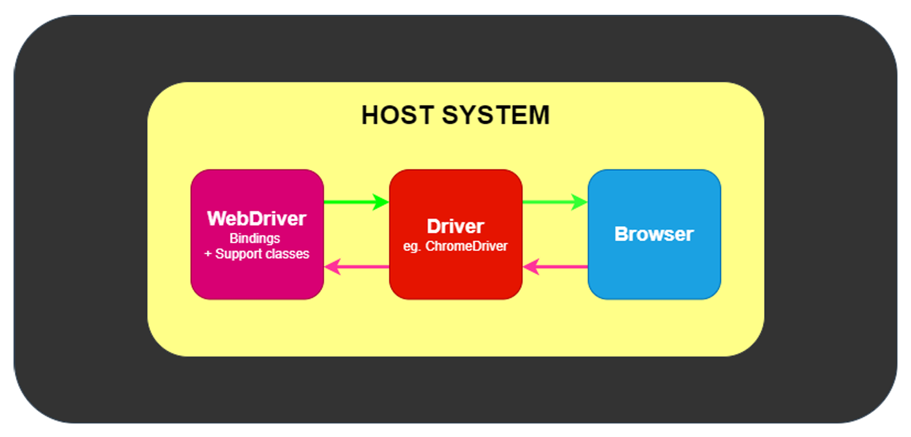
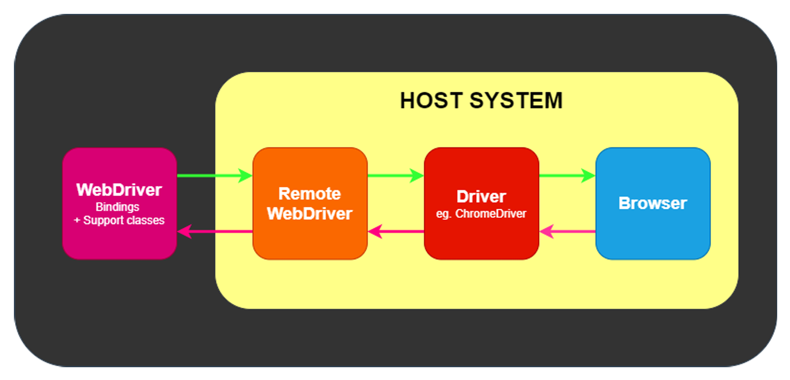
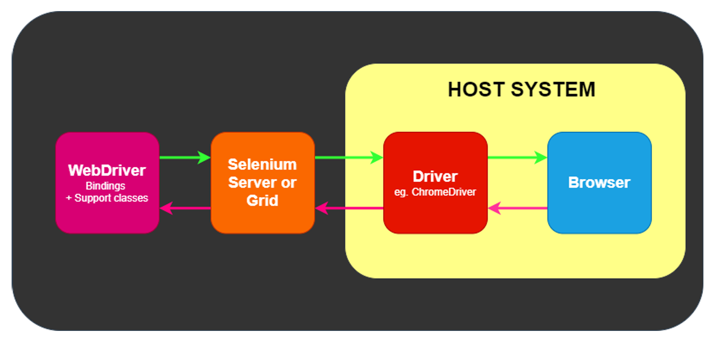
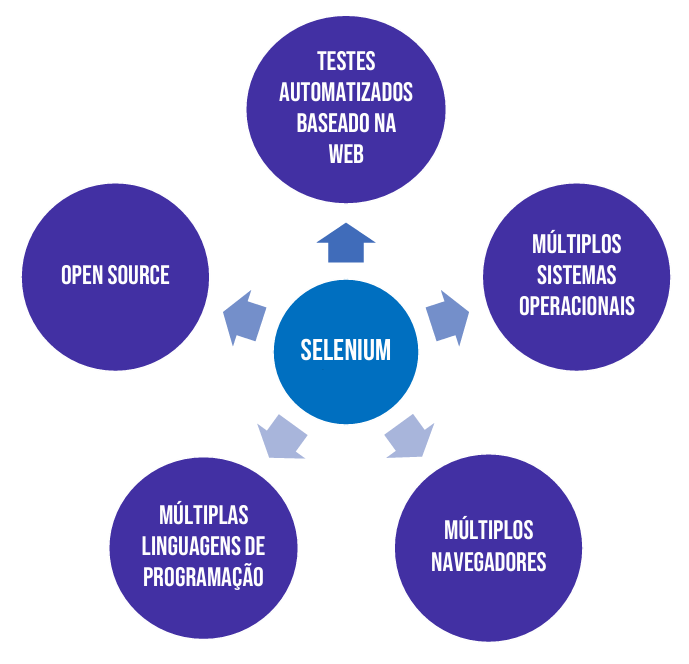

# Capítulo 3 – Selenium

Após explorarmos os fundamentos da automação e um framework de teste unitário como o JUnit, nosso foco agora se volta para uma das suítes de ferramentas mais poderosas e versáteis para a automação de interações com navegadores web: o **Selenium**. É crucial entender desde o início que o Selenium não é apenas uma única ferramenta ou API, mas sim uma **composição de várias ferramentas e bibliotecas** que, juntas, oferecem um suporte robusto para a automação de navegadores.

Neste capítulo, mergulharemos no universo do Selenium. Começaremos desvendando sua natureza como um projeto abrangente e colaborativo. Em seguida, detalharemos seus componentes mais importantes, como o WebDriver, o Selenium IDE e o Selenium Grid, explicando suas funções e como interagem. Discutiremos a arquitetura de comunicação do WebDriver e os termos chave para entender seu ecossistema. Faremos também uma breve retrospectiva ao Selenium RC para contextualização histórica e, por fim, consolidaremos as principais características que fazem do Selenium uma escolha tão popular para a automação de testes web.

## Selenium: Uma Suíte Abrangente para Automação de Navegadores

O Selenium é um projeto de código aberto que engloba uma variedade de ferramentas e bibliotecas com o objetivo principal de **permitir e suportar a automação de navegadores da web**. Ele fornece as bases para que desenvolvedores e testadores possam criar scripts que simulam a interação de um usuário com aplicações web, validando seu comportamento de forma automatizada.

Uma das grandes forças do Selenium reside em sua capacidade de fornecer extensões para emular a interação do usuário com navegadores de forma realista, um servidor de distribuição (Selenium Grid) para dimensionar a alocação de navegadores para execução de testes em paralelo, e a infraestrutura para implementações da especificação **W3C WebDriver**. Esta especificação é um padrão que permite escrever código de automação intercambiável para todos os principais navegadores da web (como Chrome, Firefox, Edge, Safari, entre outros).

É importante destacar que o projeto Selenium é viabilizado por uma comunidade global de **colaboradores voluntários**. Esses indivíduos dedicaram incontáveis horas de seu próprio tempo para desenvolver, manter e aprimorar as ferramentas, disponibilizando todo o código-fonte gratuitamente para que qualquer pessoa possa usar, aproveitar e também contribuir para sua melhoria. Essa natureza colaborativa e aberta é um dos pilares do sucesso e da ampla adoção do Selenium.

## Entendendo os Termos Chave no Universo Selenium

Para construir um conjunto de testes usando WebDriver de forma eficaz, é importante entender alguns termos e componentes fundamentais. Como em qualquer área do software, diferentes pessoas podem usar termos distintos para a mesma ideia. A tabela abaixo descreve como os termos são comumente usados no contexto do Selenium:

|**Termo**|**Descrição**|
|---|---|
|**API**|Interface de Programação de Aplicativos. Este é o conjunto de "comandos" ou funções que você utiliza em seu código para interagir e manipular o WebDriver (e, por extensão, o navegador).|
|**Biblioteca**|Um módulo de código que contém as APIs (as definições das funções) e o código necessário para implementá-las. As bibliotecas do Selenium são específicas para cada linguagem de programação suportada (por exemplo, arquivos `.jar` para Java, arquivos `.dll` para .NET, pacotes Python, etc.).|
|**Driver**|Responsável por controlar o navegador. A maioria dos drivers (como ChromeDriver, GeckoDriver, EdgeDriver) são criados e mantidos pelos próprios fornecedores de navegadores. Os drivers são, geralmente, módulos executáveis que rodam no sistema junto com o navegador, atuando como uma ponte entre os comandos WebDriver e o navegador.|
|**Framework**|No contexto do Selenium, "framework" pode se referir a uma biblioteca adicional usada como suporte para as suítes de testes WebDriver. Isso pode incluir:  - **Frameworks de Teste:** Como JUnit ou NUnit, que fornecem estrutura para organizar, executar e reportar testes.  - **Frameworks de Suporte a Linguagem Natural:** Como Cucumber (para BDD), que permitem escrever testes em um formato mais legível por pessoas não técnicas.  - **Frameworks Customizados:** Podem ser escritos e usados para tarefas como manipulação ou configuração do sistema sob teste, criação de dados de teste, implementação de oráculos de teste, etc.|

## O Ecossistema Selenium: Uma Visão Geral dos Componentes

Como mencionado, o Selenium é uma suíte composta por diferentes ferramentas, cada uma com um propósito específico, mas que podem trabalhar em conjunto para oferecer uma solução completa de automação web. Os principais componentes que exploraremos são:

- **Selenium WebDriver:** O núcleo da automação, permitindo o controle programático dos navegadores.
- **Selenium IDE:** Uma ferramenta para gravação e reprodução de interações, facilitando a criação inicial de scripts de teste.
- **Selenium Grid:** Uma solução para executar testes em paralelo em múltiplas máquinas e navegadores.

Além destes, o Selenium teve um componente histórico importante, o Selenium RC (Remote Control), que pavimentou o caminho para o WebDriver.

## Selenium WebDriver: O Coração da Automação

No núcleo do Selenium está o **WebDriver**. Ele é tanto uma **API (Interface de Programação de Aplicativos)** quanto um **protocolo** que define uma interface neutra em termos de linguagem de programação para controlar o comportamento dos navegadores da web. Essencialmente, o WebDriver permite que você escreva conjuntos de instruções (scripts de teste) em diversas linguagens de programação populares (como Java, C#, Python, Ruby, JavaScript) que podem ser executados de forma consistente em muitos navegadores diferentes.

Depois de configurar o ambiente (instalando as bibliotecas do Selenium para a linguagem escolhida e os drivers dos navegadores), apenas algumas linhas de código são suficientes para iniciar um navegador e começar a interagir com elementos da página.

### Como o WebDriver Funciona?

O WebDriver utiliza **APIs de automação de navegador** que são disponibilizadas pelos próprios fornecedores de navegadores (Google para o Chrome, Mozilla para o Firefox, etc.) para controlar o navegador e executar os testes. Cada navegador é suportado por uma implementação específica do WebDriver, conhecida como **driver** (por exemplo, ChromeDriver para o Chrome, GeckoDriver para o Firefox). Este driver atua como uma ponte, traduzindo os comandos enviados pelos scripts Selenium para ações que o navegador consegue entender e executar.

A grande vantagem dessa abordagem é que o WebDriver interage com o navegador de forma muito similar a como um **usuário real o estaria operando**. Ele pode clicar em botões, preencher formulários, navegar entre páginas, executar JavaScript, e muito mais.

Como o WebDriver não exige que sua API seja compilada diretamente com o código da aplicação web que está sendo testada, ele é considerado **não intrusivo**. Isso significa que você está testando exatamente o mesmo aplicativo que será enviado aos ambientes de produção, sem modificações ou instrumentações que poderiam alterar seu comportamento.

## Arquitetura de Comunicação do WebDriver

A comunicação entre os scripts de teste e o navegador, mediada pelo WebDriver, pode ocorrer de diferentes formas.

### Comunicação Direta

No cenário mais simples, o WebDriver (seu script de teste) se comunica diretamente com o driver do navegador, que por sua vez controla o navegador. O driver é específico para o navegador e, geralmente, é um módulo executável que roda no mesmo sistema que o próprio navegador. Este pode ser, ou não, o mesmo sistema onde os scripts de teste estão sendo executados.

  

A figura anterior ilustra a comunicação direta, onde o script de teste utilizando a API WebDriver envia comandos diretamente para o driver específico do navegador (ex: ChromeDriver). O driver, então, traduz esses comandos em ações que são executadas no navegador.

### Comunicação Remota

A comunicação com o navegador também pode ser **remota**, utilizando o **Selenium Server** (que engloba o Selenium Grid) ou uma instância do **RemoteWebDriver**.

- Com RemoteWebDriver (no mesmo sistema do driver/navegador): Neste caso, o RemoteWebDriver roda no mesmo sistema que o driver e o navegador, mas permite que os scripts de teste sejam executados a partir de outra máquina. Aqui, o script de teste (possivelmente em uma máquina diferente) se comunica através da rede com o componente RemoteWebDriver. O RemoteWebDriver, por sua vez, interage com o driver do navegador localmente na máquina onde o navegador será controlado.

  

2. Com Selenium Server ou Selenium Grid: O Selenium Server ou o Selenium Grid atuam como um hub que recebe os comandos do script WebDriver e os direciona para o driver apropriado no sistema host onde o navegador está sendo executado. Isso é fundamental para a execução de testes em paralelo em diferentes navegadores e sistemas operacionais. Esta arquitetura demonstra como o Selenium Grid ou Selenium Server atua como um intermediário (Hub). Os scripts de teste enviam comandos para o Hub, que os distribui para diferentes nós (máquinas remotas), cada um capaz de executar testes em um navegador específico através do seu respectivo driver.

  

Essa separação entre o script de teste, o driver e o navegador é parte de um esforço consciente para que os fornecedores de navegadores assumam a responsabilidade pela implementação da automação em seus navegadores. O Selenium faz uso desses drivers de terceiros sempre que possível, mas também fornece seus próprios drivers mantidos pelo projeto para certos casos. A estrutura do Selenium une todas essas peças por meio de uma interface voltada para o usuário que permite que os diferentes back-ends de navegador sejam usados de forma transparente, possibilitando a automação entre navegadores (cross-browser) e plataformas cruzadas (cross-platform).

## Selenium IDE: Facilitando a Criação de Testes

O **Selenium IDE (Ambiente de Desenvolvimento Integrado)** é uma ferramenta que você utiliza para desenvolver seus casos de teste Selenium. Trata-se de uma extensão para navegadores (historicamente para Firefox, e mais recentemente com versões para Chrome e Firefox) que é particularmente fácil de usar e, muitas vezes, representa a maneira mais eficiente de iniciar o desenvolvimento de casos de teste, especialmente para quem está começando com Selenium.

A principal funcionalidade do Selenium IDE é a capacidade de **gravar as ações dos usuários no navegador** e traduzi-las em comandos Selenium existentes, com parâmetros definidos pelo contexto do elemento com o qual o usuário interagiu. Por exemplo, se você clica em um botão ou digita texto em um campo, o IDE registra essas ações como comandos Selenium correspondentes.

Isso não é apenas uma grande **economia de tempo** na criação inicial dos testes, mas também uma **maneira excelente de aprender a sintaxe de script do Selenium**. Ao observar os comandos gerados pelo IDE, os usuários podem entender como as diferentes interações são representadas no Selenium.

Posteriormente, você pode usar a opção de **reprodução (playback)** no Selenium IDE para executar novamente os casos de teste gravados e verificar se a aplicação se comporta como esperado. Embora os testes gravados pelo IDE possam precisar de ajustes e refatoração para se tornarem robustos e manuteníveis (especialmente em aplicações complexas e dinâmicas), ele serve como um excelente ponto de partida.

Para execuções mais avançadas e integração com sistemas de CI/CD, existe o **Command-line Runner for Selenium IDE (SIDE Runner)**, que permite executar os testes criados no Selenium IDE em qualquer combinação de navegador/SO em paralelo, a partir da linha de comando.

## Selenium Grid: Escalando a Execução de Testes

À medida que os conjuntos de testes WebDriver crescem, ou quando surge a necessidade de validar a aplicação em múltiplas combinações de navegadores e sistemas operacionais, a execução sequencial de todos os testes pode se tornar muito demorada. É aqui que o **Selenium Grid** entra em cena.

O Selenium Grid permite que você **execute casos de teste em diferentes máquinas (nós) e em diferentes plataformas (navegadores e sistemas operacionais) simultaneamente (em paralelo)**. O controle para acionar os casos de teste geralmente reside na extremidade local (onde o desenvolvedor ou o servidor de CI inicia a suíte de testes), e quando os casos de teste são acionados, eles são automaticamente distribuídos e executados pelos nós remotos configurados no Grid.

A principal vantagem do Grid é a **redução significativa do tempo gasto na execução de uma suíte de testes completa**. Ele é ideal para escalonar suítes de testes grandes ou que precisam ser executadas em múltiplos ambientes, garantindo uma cobertura mais ampla e um feedback mais rápido.

## Uma Breve Olhada no Passado: Selenium RC (Remote Control)

Antes do WebDriver se consolidar como o padrão, o **Selenium RC (Remote Control)** foi um componente crucial da suíte Selenium. Embora hoje seja considerado legado e tenha sido amplamente substituído pelo WebDriver, entender um pouco sobre ele ajuda a contextualizar a evolução do Selenium.

Os principais componentes do Selenium RC eram:

1. **Servidor Selenium (Selenium RC Server):**
    - Atuava como um proxy HTTP, interceptando e verificando mensagens HTTP passadas entre o navegador e a aplicação sendo testada.
    - Iniciava e encerrava navegadores.
    - Interpretava e executava os comandos em **Selenese** (a linguagem de comandos do Selenium) passados pelo programa de teste.
2. **Bibliotecas de Cliente (Client Libraries):**
    - Forneciam a interface entre cada linguagem de programação suportada (Java, C#, Python, etc.) e o Selenium RC Server.
    - Permitiam que os desenvolvedores escrevessem testes em sua linguagem de preferência. A biblioteca cliente pegava um comando em Selenese, passava-o para o servidor Selenium para processamento na aplicação sob teste, e recebia o resultado de volta.

O servidor RC agrupava o **Selenium Core**, que é um programa JavaScript (um conjunto de funções JavaScript que interpretam e executam comandos Selenese usando o interpretador JavaScript embutido do navegador). Quando o programa de teste abria o navegador (usando uma função da API da biblioteca cliente), o Selenium Core era automaticamente injetado no navegador. O servidor recebia os comandos Selenese do programa de teste usando solicitações HTTP GET/POST simples, o que significava que qualquer linguagem de programação capaz de enviar solicitações HTTP poderia, teoricamente, automatizar testes Selenium no navegador através do RC.

O Selenium WebDriver surgiu como uma evolução, oferecendo uma abordagem mais direta e estável para a automação do navegador, comunicando-se diretamente com o navegador através de suas APIs nativas de automação, em vez de depender da injeção de JavaScript e de um servidor proxy como o RC.

## Características Notáveis do Selenium

O Selenium se destaca por um conjunto de características que contribuíram para sua ampla adoção e sucesso:

- **Suporte a Múltiplos Navegadores:** Capacidade de executar os mesmos scripts em diferentes navegadores (Chrome, Firefox, Edge, Safari, etc.), essencial para testes de compatibilidade cross-browser.
- **Suporte a Múltiplas Linguagens de Programação:** Flexibilidade para escrever testes em linguagens populares como Java, C#, Python, Ruby, JavaScript, entre outras.
- **Código Aberto e Comunidade Ativa:** Sendo um projeto open-source, é gratuito, possui uma vasta comunidade de usuários e contribuidores, e está em constante evolução.
- **Suporte à Execução Paralela com Selenium Grid:** Permite distribuir a execução de testes em várias máquinas e navegadores, acelerando o ciclo de feedback.
- **Ferramenta de Gravação e Reprodução (Selenium IDE):** Facilita a criação inicial de scripts, especialmente para iniciantes, e serve como uma ferramenta de aprendizado.
- **Integração com Diversas Ferramentas e Frameworks:** Integra-se bem com frameworks de teste (JUnit, TestNG), ferramentas de build (Maven, Gradle) e sistemas de Integração Contínua (Jenkins, GitLab CI).
- **Conformidade com Padrões Web (W3C WebDriver):** A adoção da especificação W3C WebDriver promove uma maior padronização e interoperabilidade na automação de navegadores.

  

## Considerações Finais

Ao longo deste capítulo, desvendamos o Selenium, não como uma ferramenta isolada, mas como uma poderosa suíte de automação que revolucionou os testes de aplicações web. Vimos que seu coração reside no WebDriver, uma API e protocolo que permite o controle programático e realista dos navegadores, suportado por uma arquitetura flexível de comunicação direta ou remota.

Exploramos o Selenium IDE como um facilitador para a criação e aprendizado de scripts, e o Selenium Grid como a solução para escalar a execução de testes em ambientes distribuídos e paralelos, garantindo agilidade e cobertura. A compreensão dos termos chave e uma breve olhada no legado do Selenium RC nos ajudaram a contextualizar a evolução e a robustez da suíte.

As características notáveis do Selenium, como seu suporte multiplataforma, multilinguagem e sua natureza open-source, o consolidam como uma escolha predominante para equipes que buscam automação de testes web eficaz e sustentável. A sua capacidade de integração com outras ferramentas e a adesão a padrões como o W3C WebDriver reforçam ainda mais sua posição como um pilar na automação de testes moderna. Com o conhecimento adquirido sobre o Selenium, estamos mais preparados para enfrentar os desafios da automação de interfaces de usuário e garantir a qualidade de aplicações web cada vez mais complexas, pavimentando o caminho para a construção de software mais confiável e resiliente.