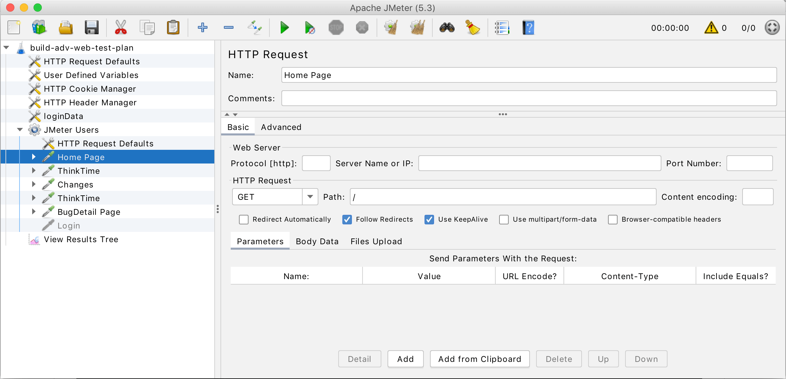
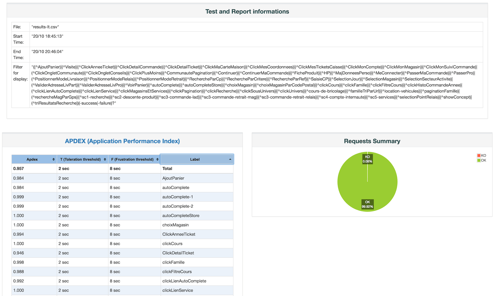

# Capítulo 4 – Apache JMeter

Nos capítulos anteriores, focamos em frameworks e ferramentas voltadas principalmente para testes funcionais e de unidade, como JUnit e Selenium. Agora, vamos direcionar nossa atenção para um aspecto igualmente crítico da qualidade de software: o **desempenho**. Aplicações que são funcionalmente corretas, mas lentas ou incapazes de lidar com a carga de usuários esperada, podem levar a uma péssima experiência do usuário e, consequentemente, ao fracasso. É nesse contexto que ferramentas como o **Apache JMeter™** se tornam indispensáveis.

O Apache JMeter™ é um software de código aberto, desenvolvido como um aplicativo 100% Java puro, projetado especificamente para **realizar testes de performance, carga e estresse**. Embora tenha sido originalmente concebido para testar aplicações Web, sua arquitetura flexível e extensível permitiu que, ao longo do tempo, suas capacidades se expandissem para cobrir uma vasta gama de outras funções de teste e protocolos.

Neste capítulo, exploraremos em profundidade o Apache JMeter. Começaremos entendendo sua natureza e seus objetivos primários. Em seguida, detalharemos seus impressionantes recursos, desde a ampla cobertura de protocolos até sua IDE de teste e capacidade de execução em linha de comando. Discutiremos o modelo operacional do JMeter, enfatizando como ele difere de um navegador convencional. O ponto central da nossa discussão será a estrutura de um Plano de Teste no JMeter e seus elementos essenciais, que são os blocos de construção para qualquer simulação de carga.

## Apache JMeter: Potência e Versatilidade em Testes de Performance

O Apache JMeter destaca-se no mundo do teste de software por sua capacidade de **simular uma carga pesada** em um servidor, grupo de servidores, rede ou objeto específico. O objetivo dessas simulações é duplo:

1. **Testar a robustez (força):** Verificar como o sistema se comporta sob condições extremas de carga, identificando pontos de falha e limites de capacidade.
2. **Analisar o desempenho geral:** Medir e analisar métricas de desempenho (como tempo de resposta, vazão, utilização de recursos) sob diferentes tipos de carga, incluindo testes de estresse que levam o sistema além de sua capacidade operacional normal.

Ele pode ser utilizado para testar o desempenho tanto em **recursos estáticos** (como arquivos HTML, CSS, imagens) quanto em **recursos dinâmicos** e **aplicativos dinâmicos da Web** complexos. A capacidade de simular múltiplos usuários (threads) acessando concorrentemente os recursos da aplicação é uma de suas funcionalidades mais poderosas.

## Recursos Abrangentes do Apache JMeter

A popularidade e eficácia do Apache JMeter derivam de um conjunto rico e abrangente de recursos, que o tornam uma ferramenta versátil para diversos cenários de teste de performance.

### Ampla Cobertura de Protocolos e Aplicações

Uma das grandes vantagens do JMeter é sua capacidade de carregar e testar o desempenho de uma vasta gama de tipos de aplicativos, servidores e protocolos. Essa flexibilidade permite que ele seja usado em arquiteturas de sistemas bastante diversificadas. Os principais protocolos e tecnologias suportados incluem:

- **Web:** HTTP, HTTPS (para aplicações construídas em Java, NodeJS, PHP, ASP.NET, e muitas outras tecnologias web).
- **Webservices:** Suporte completo para testar webservices baseados em SOAP e REST.
- **FTP (File Transfer Protocol):** Para testes de transferência de arquivos.
- **Banco de Dados via JDBC:** Permite enviar requisições SQL diretamente para bancos de dados através de drivers JDBC, testando a performance da camada de persistência.
- **LDAP (Lightweight Directory Access Protocol):** Para testes de serviços de diretório.
- **Middleware Orientado a Mensagens (MOM) via JMS (Java Message Service):** Permite testar sistemas que utilizam filas de mensagens e tópicos para comunicação assíncrona.
- **Correio Eletrônico:** Suporte para os protocolos SMTP(S) (envio), POP3(S) e IMAP(S) (recebimento), permitindo testar a performance de servidores de e-mail.
- **Comandos Nativos ou Scripts de Shell:** Capacidade de executar comandos do sistema operacional ou scripts de shell como parte de um plano de teste.
- **TCP:** Permite enviar e receber dados brutos sobre o protocolo TCP, útil para testar aplicações customizadas baseadas em TCP.
- **Objetos Java:** Possibilidade de testar diretamente classes e métodos Java, estendendo suas capacidades para além do teste de protocolos.

Essa vasta gama de suporte a protocolos faz do JMeter uma ferramenta extremamente adaptável.

### IDE de Teste Completa e Modo de Linha de Comando (CLI)

O JMeter oferece uma **Interface Gráfica do Usuário (GUI)**, que funciona como uma IDE de teste completa. Através desta IDE, os usuários podem:

- **Gravar Planos de Teste rapidamente:** O JMeter inclui um gravador HTTP(S) Test Script Recorder que pode capturar o tráfego entre um navegador e um servidor web, convertendo as requisições em elementos de um Plano de Teste. Também é possível gravar interações de aplicativos nativos, dependendo da configuração.
- **Construir Planos de Teste visualmente:** Adicionar, configurar e organizar os diversos elementos de teste (que veremos em detalhe mais adiante) de forma intuitiva.
- **Depurar Planos de Teste:** Executar os testes em modo de depuração, visualizar resultados parciais e identificar problemas na configuração dos testes.

A interface gráfica do JMeter permite a criação e configuração intuitiva dos Planos de Teste. Na figura abaixo à esquerda, vemos a estrutura em árvore dos elementos do teste, e à direita, as opções de configuração para um elemento específico, como um HTTP Request Sampler.

  

Além da GUI, o JMeter suporta a execução de testes em **modo de linha de comando (CLI)**, anteriormente conhecido como modo Non-GUI ou modo headless. Este modo é crucial para:

- **Execução de testes de carga pesada:** A GUI consome recursos significativos (memória e CPU). Para simulações com um grande número de usuários virtuais, é altamente recomendável executar os testes em modo CLI para obter resultados mais precisos e evitar que a própria ferramenta se torne um gargalo.
- **Integração com sistemas de CI/CD:** O modo CLI permite que os testes do JMeter sejam facilmente integrados em pipelines de Integração Contínua e Entrega Contínua (CI/CD), automatizando a execução dos testes de performance como parte do ciclo de build e deploy.
- **Portabilidade:** A execução em CLI é possível em qualquer sistema operacional compatível com Java (Linux, Windows, Mac OSX, etc.).

### Relatórios Detalhados e Análise Facilitada

Após a execução dos testes, o JMeter é capaz de gerar um **relatório HTML completo e pronto para apresentar**. Este relatório dinâmico contém uma visão geral dos resultados, gráficos de desempenho (tempo de resposta, vazão, erros ao longo do tempo), tabelas com estatísticas detalhadas por requisição, e outras informações valiosas para a análise dos testes.

  

A **correlação fácil** é outro recurso importante. Em aplicações web dinâmicas, é comum que valores gerados pelo servidor (como IDs de sessão, tokens) precisem ser capturados de uma resposta e utilizados em requisições subsequentes. O JMeter facilita esse processo através da capacidade de extrair dados dos formatos de resposta mais populares, como HTML, JSON, XML, ou qualquer outro formato textual, utilizando Pós-Processadores como o Extrator de Expressão Regular ou Extrator JSON/XML.

Sua natureza **100% Java puro** garante portabilidade completa entre diferentes sistemas operacionais que possuam uma JVM compatível.

### Arquitetura Multi-Threading Avançada

O JMeter possui uma **estrutura multi-threading completa**. Isso permite:

- **Amostragem simultânea por muitos threads:** Cada thread (usuário virtual) pode executar o plano de teste de forma independente e concorrente, simulando o acesso simultâneo de múltiplos usuários à aplicação.
- **Amostragem simultânea de diferentes funções por grupos de threads separados:** É possível configurar diferentes Grupos de Usuários (Thread Groups) dentro de um mesmo Plano de Teste, cada um executando um cenário de teste diferente ou testando funcionalidades distintas da aplicação ao mesmo tempo.

Essa capacidade de multi-threading é fundamental para gerar cargas realistas e identificar como o sistema se comporta sob concorrência.

### Cache, Análise Offline e Alta Extensibilidade

Outros recursos notáveis incluem:

- **Cache e análise/reprodução offline dos resultados dos testes:** Os resultados dos testes podem ser salvos em arquivos (geralmente JTL) e analisados posteriormente na GUI do JMeter ou por outras ferramentas, permitindo uma investigação mais aprofundada ou a comparação entre diferentes execuções.
- **Núcleo altamente extensível:** O JMeter foi projetado com a extensibilidade em mente:
    - Diversas **estatísticas de carga** podem ser escolhidas com **temporizadores plugáveis**, que controlam o ritmo das requisições.
    - **Plugins de análise e visualização de dados** permitem grande extensibilidade e personalização dos relatórios e da forma como os resultados são apresentados. A comunidade JMeter e terceiros oferecem uma vasta gama de plugins.
    - **Funções (functions)** podem ser usadas para fornecer entrada dinâmica para um teste (ex: gerar dados aleatórios, obter o timestamp atual) ou para fornecer manipulação de dados durante a execução do teste.
    - **Fácil Integração Contínua** através de bibliotecas Open Source de terceiros para ferramentas de build populares como Maven (com o `jmeter-maven-plugin`) e Gradle, além de integrações diretas ou via plugins com servidores de CI/CD como Jenkins.

## Como o JMeter Funciona: O Modelo em Nível de Protocolo

É fundamental entender uma distinção crucial sobre o funcionamento do JMeter: **o JMeter não é um navegador**.

Embora, no que diz respeito aos serviços da web e serviços remotos, o JMeter **possa parecer** um navegador (ou melhor, simular o comportamento de vários navegadores enviando requisições HTTP/HTTPS), ele opera fundamentalmente em **nível de protocolo**. Isso significa que o JMeter constrói e envia requisições (HTTP, FTP, JDBC, etc.) diretamente para o servidor, e recebe e processa as respostas, sem realizar todas as ações que um navegador completo executaria.

Em particular, o JMeter:

- **Não executa o JavaScript encontrado nas páginas HTML da mesma forma que um navegador.** Se a sua aplicação web depende fortemente de JavaScript do lado do cliente para renderizar conteúdo, manipular o DOM ou realizar lógica de negócios, o JMeter por si só não irá executar esse JavaScript. Existem algumas maneiras de contornar isso (como usar o WebDriver Sampler, que integra o Selenium WebDriver ao JMeter, mas isso adiciona complexidade e consome mais recursos), mas o comportamento padrão do JMeter é focar nas requisições e respostas do protocolo.
- **Não renderiza as páginas HTML como um navegador faz.** Embora seja possível visualizar a resposta de uma requisição HTTP como HTML formatado em alguns Listeners, ou até mesmo em uma "view" que tenta renderizar o HTML de forma básica, os tempos de renderização do cliente não são incluídos nas amostras de tempo de resposta. Apenas uma amostra por vez é exibida em um thread na GUI.

Essa abordagem em nível de protocolo é o que permite ao JMeter gerar uma carga muito alta com um consumo de recursos relativamente baixo em comparação com a automação baseada em navegadores reais (como o Selenium WebDriver usado para testes de carga). No entanto, também significa que os testes precisam ser cuidadosamente projetados para simular com precisão o tráfego que um navegador real geraria, incluindo cabeçalhos HTTP, cookies, e o tratamento de recursos embutidos (como imagens, CSS, JS files), se necessário.

## Construindo Testes com JMeter: O Plano de Teste e Seus Elementos Essenciais

Para qualquer teste que venha a ser realizado utilizando o JMeter, o primeiro e mais fundamental passo é criar um **Plano de Teste (Test Plan)**. O Plano de Teste é o contêiner principal que descreve a sequência de passos que o JMeter executará. Ele é construído a partir de uma hierarquia de **elementos de teste**, cada um com uma função específica.

Vamos explorar os principais elementos que compõem um Plano de Teste:

### Grupos de Usuários (Thread Group): O Ponto de Partida

O **Grupo de Usuários (Thread Group)** é o ponto de início fundamental para qualquer Plano de Teste no JMeter. Todos os outros elementos que definem as ações a serem executadas (como Samplers, Controllers, etc.) devem estar, direta ou indiretamente, sob um Thread Group.

Como o próprio nome ressalta, ele controla os **threads (usuários virtuais)** que serão executados pelo teste. As principais configurações de um Thread Group incluem:

- **Number of Threads (users):** Define o número de usuários virtuais que o JMeter simulará. Cada thread executará o Plano de Teste de forma independente.
- **Ramp-Up Period (in seconds):** Especifica o tempo, em segundos, que o JMeter levará para iniciar todos os threads definidos. Por exemplo, se você tem 100 threads e um ramp-up de 10 segundos, o JMeter iniciará 10 threads por segundo. Um ramp-up gradual ajuda a evitar sobrecargas instantâneas no servidor no início do teste.
- **Loop Count:** Define quantas vezes cada thread repetirá a execução do conjunto de ações (Samplers e Controllers) dentro do Thread Group. Pode ser um número específico ou "Infinite" (o teste continuará até ser interrompido manualmente ou por uma condição de duração).
- **Scheduler (Agendador):** Permite configurar a duração total do teste e um tempo de início (startup delay).

### Controladores (Controllers): Orquestrando a Lógica do Teste

Os **Controladores (Controllers)** são elementos que direcionam o fluxo de execução do teste. Eles determinam a ordem em que as requisições (Samplers) são processadas e podem adicionar lógica condicional, laços de repetição, entre outras estruturas de controle. Eles são divididos em dois grupos principais:

#### Amostradores (Samplers): Simulando Requisições

Os **Amostradores (Samplers)** são os elementos que efetivamente realizam o trabalho de enviar uma requisição para um servidor e aguardar uma resposta. O JMeter possui diversos tipos de Samplers pré-definidos para diferentes protocolos. Alguns dos mais comuns incluem:

- **HTTP Request Sampler:** Envia requisições HTTP ou HTTPS para um servidor web. É o sampler mais utilizado para testes de aplicações web. Permite configurar o método (GET, POST, PUT, DELETE, etc.), o caminho, os parâmetros, os cabeçalhos e o corpo da requisição.
- **FTP Request Sampler:** Envia requisições para um servidor FTP (para download ou upload de arquivos).
- **JDBC Request Sampler:** Envia consultas SQL para um banco de dados.
- **JMS Point-to-Point / JMS Publisher / JMS Subscriber Samplers:** Para interagir com sistemas de mensageria JMS.
- **Debug Sampler:** Um sampler especial que gera uma amostra contendo os valores das variáveis do JMeter, útil para depuração.

Os Samplers podem ser personalizados com a adição de Elementos de Configuração (para definir padrões), Asserções (para validar respostas), Temporizadores (para adicionar pausas), Pré-Processadores e Pós-Processadores.

#### Controladores Lógicos (Logic Controllers): Definindo o Fluxo

Os **Controladores Lógicos (Logic Controllers)** permitem customizar a lógica de como e quando os Samplers (e outros elementos filhos) são executados. Eles são mais genéricos e podem ser usados para:

- **Loop Controller:** Faz com que os elementos filhos sejam executados um número específico de vezes ou até que uma condição seja satisfeita.
- **If Controller:** Executa os elementos filhos somente se uma condição (geralmente uma expressão JMeter ou JavaScript) for verdadeira.
- **Transaction Controller:** Agrupa vários Samplers em uma única "transação" lógica, medindo o tempo total para a execução de todos eles como uma unidade.
- **Random Controller:** Executa apenas um dos elementos filhos, escolhido aleatoriamente.
- **Throughput Controller:** Controla a frequência com que seus elementos filhos são executados, seja por uma porcentagem do total de execuções ou por um número fixo de execuções.

Os Controladores Lógicos podem ser aninhados e combinados para criar fluxos de teste complexos e realistas.

### Ouvintes (Listeners): Visualizando e Coletando Resultados

Os **Ouvintes (Listeners)** são elementos que fornecem acesso às informações obtidas pelo JMeter durante a execução dos testes. Eles coletam dados dos Samplers e os apresentam de diversas formas, seja visualmente na GUI, em tabelas ou salvando-os em arquivos para análise posterior.

Alguns Listeners populares incluem:

- **View Results Tree:** Mostra detalhes de cada amostra individual, incluindo os dados da requisição, os cabeçalhos e os dados da resposta. É extremamente útil para depuração.
- **Summary Report:** Apresenta um resumo estatístico em formato de tabela para cada sampler, incluindo número de amostras, tempo médio, mínimo, máximo, desvio padrão, taxa de erro e vazão (throughput).
- **Aggregate Report:** Similar ao Summary Report, mas agrega os dados para cada sampler ao longo de todo o teste.
- **Graph Results:** Exibe um gráfico simples dos tempos de resposta ao longo do tempo.
- **View Results in Table:** Mostra os resultados das amostras em formato de tabela.
- **Simple Data Writer:** Salva os dados das amostras em um arquivo (JTL) no formato especificado (CSV, XML).

**Importante:** Durante a execução de testes de carga reais (especialmente em modo CLI), é recomendado desabilitar ou usar Listeners que consomem poucos recursos (como o Simple Data Writer). Listeners gráficos e o View Results Tree consomem muita memória e CPU, podendo impactar o desempenho da própria ferramenta JMeter e distorcer os resultados do teste. A análise detalhada dos resultados deve ser feita após a execução, carregando o arquivo JTL em Listeners na GUI.

### Temporizadores (Timers): Introduzindo Pausas Realistas

Por padrão, o JMeter envia requisições uma após a outra, sem pausas entre elas. Em um cenário real, os usuários humanos pausam entre as ações (tempo de pensamento, leitura, etc.). Os **Temporizadores (Timers)** são utilizados para **introduzir pausas (delays) entre as requisições**, tornando a simulação de carga mais realista.

Um Timer é adicionado como filho de um Sampler ou Controller. Se for filho de um Sampler, ele atrasa a execução daquele Sampler. Se for filho de um Controller, ele afeta todos os Samplers dentro daquele Controller.

Tipos comuns de Timers:

- **Constant Timer:** Adiciona uma pausa fixa (em milissegundos).
- **Uniform Random Timer:** Adiciona uma pausa com um componente aleatório distribuído uniformemente, dentro de um intervalo especificado.
- **Gaussian Random Timer:** Adiciona uma pausa com um componente aleatório que segue uma distribuição gaussiana (normal).
- **Constant Throughput Timer:** Ajusta as pausas para manter uma vazão (throughput) alvo em termos de amostras por minuto.

### Asserções (Assertions): Validando as Respostas

As **Asserções (Assertions)** são usadas para **verificar se a resposta obtida em uma requisição é a esperada**. Se uma asserção falhar, o Sampler correspondente será marcado como falho. As asserções são cruciais para determinar se o sistema sob teste está funcionando corretamente sob carga, e não apenas respondendo.

As asserções são adicionadas como filhas de um Sampler. Alguns tipos de Asserções:

- **Response Assertion:** A mais comum. Verifica se a resposta (corpo, código de resposta, mensagem, cabeçalhos) contém, não contém, corresponde ou é igual a um padrão de texto. Expressões regulares (Perl-style regular expressions) podem ser usadas na comparação.
- **Duration Assertion:** Verifica se o tempo de resposta de uma amostra não excede um valor máximo especificado (em milissegundos).
- **Size Assertion:** Verifica se o tamanho da resposta (em bytes) está dentro de um intervalo esperado.
- **HTML Assertion:** Verifica a sintaxe HTML da resposta usando uma biblioteca como JTidy.
- **JSON Assertion / XML Assertion:** Verifica se a resposta é um JSON/XML válido ou se contém caminhos/valores específicos usando JSONPath ou XPath.

### Elementos de Configuração (Configuration Elements): Parâmetros e Variáveis

Os **Elementos de Configuração (Configuration Elements)**, embora geralmente não façam requisições por si próprios (com exceção notável do HTTP(S) Test Script Recorder, que atua como um proxy), podem **adicionar ou modificar as requisições** feitas pelos Samplers em seu escopo. Eles são usados para configurar valores padrão, gerenciar cookies, cache, ou carregar dados de arquivos externos.

Alguns Elementos de Configuração importantes:

- **HTTP Cookie Manager:** Gerencia automaticamente os cookies enviados e recebidos nas requisições HTTP, simulando o comportamento de um navegador.
- **HTTP Cache Manager:** Simula o cache do navegador, evitando que o JMeter baixe recursos já cacheados em iterações subsequentes de um loop.
- **HTTP Header Manager:** Permite adicionar ou sobrescrever cabeçalhos HTTP padrão para as requisições.
- **CSV Data Set Config:** Lê dados de um arquivo CSV e os disponibiliza como variáveis para serem usadas nos Samplers (ex: para parametrizar logins, dados de busca, etc.).
- **User Defined Variables:** Permite definir variáveis com valores fixos que podem ser referenciados em outras partes do Plano de Teste.

### Pré-Processadores (Pre-Processor Elements): Ações Anteriores à Requisição

Os **Pré-Processadores (Pre-Processor Elements)** executam alguma ação **antes** que um Sampler associado faça sua requisição. Eles são frequentemente usados para modificar as configurações de uma requisição imediatamente antes de ela ser enviada, ou para gerar dados que serão usados na requisição.

Exemplos:

- **User Parameters:** Define parâmetros (variáveis) específicos para cada thread (usuário virtual) antes de uma requisição ou iteração.
- **HTML Link Parser:** Analisa uma resposta HTML de uma requisição anterior e extrai links, que podem ser usados em requisições subsequentes (simulando um usuário clicando em links).
- **JSR223 PreProcessor:** Permite executar scripts customizados (em Groovy, JavaScript, etc.) para manipulações complexas antes de uma requisição.

### Pós-Processadores (Post-Processor Elements): Manipulando Dados da Resposta

Os **Pós-Processadores (Post-Processor Elements)** executam alguma ação **depois** que um Sampler associado recebe sua resposta. Seu uso mais comum é para processar os dados da resposta, geralmente para extrair informações que serão usadas em requisições subsequentes (um processo conhecido como correlação).

Exemplos populares:

- **Regular Expression Extractor:** Extrai valores da resposta usando expressões regulares e os armazena em variáveis JMeter.
- **JSON Extractor / JSON JMESPath Extractor:** Extrai dados de respostas JSON usando expressões JSONPath ou JMESPath.
- **XPath Extractor / XPath2 Extractor:** Extrai dados de respostas XML ou XHTML usando expressões XPath.
- **Boundary Extractor:** Extrai valores com base em delimitadores de fronteira esquerda e direita.
- **JSR223 PostProcessor:** Permite executar scripts customizados para processar a resposta de forma complexa.

Dominar esses elementos e como eles interagem é a chave para criar Planos de Teste eficazes e realistas no Apache JMeter.

## Considerações Finais

Neste capítulo, mergulhamos no Apache JMeter, uma ferramenta de código aberto robusta e versátil, fundamental para a realização de testes de performance, carga e estresse. Vimos que sua arquitetura 100% Java e sua operação em nível de protocolo permitem simular cargas intensas com eficiência, abrangendo uma vasta gama de aplicações e tecnologias, desde aplicações web e webservices até bancos de dados e sistemas de mensageria.

Exploramos os inúmeros recursos do JMeter, incluindo sua IDE gráfica para construção e depuração de Planos de Teste, o indispensável modo de linha de comando para execuções de carga, a geração de relatórios HTML detalhados e sua alta extensibilidade através de plugins e funções. Compreendemos a distinção crucial de que o JMeter não é um navegador, mas sim um simulador de requisições em nível de protocolo, o que impacta a forma como os testes devem ser desenhados.

O coração do trabalho com o JMeter reside na construção de Planos de Teste, e dedicamos uma atenção especial aos seus elementos constituintes: os Grupos de Usuários (Thread Groups) para definir os usuários virtuais; os Controladores (Samplers e Logic Controllers) para simular requisições e orquestrar o fluxo; os Ouvintes (Listeners) para coletar e visualizar resultados; os Temporizadores (Timers) para introduzir pausas realistas; as Asserções (Assertions) para validar as respostas; os Elementos de Configuração para gerenciar parâmetros; e os Pré e Pós-Processadores para manipular dados antes e depois das requisições.

Com o Apache JMeter, equipes de desenvolvimento e teste ganham uma capacidade poderosa de antecipar como suas aplicações se comportarão sob pressão, identificar gargalos, otimizar o desempenho e, em última instância, entregar sistemas mais estáveis e resilientes, capazes de atender às expectativas dos usuários mesmo nos momentos de maior demanda. O conhecimento sobre o JMeter é, sem dúvida, um diferencial importante no arsenal de qualquer profissional de qualidade de software.