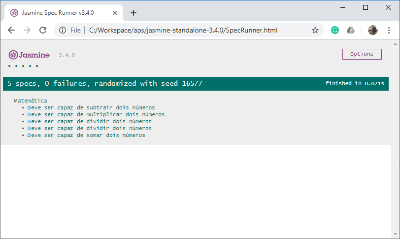

# Capítulo 5 – Jasmine

Nos capítulos anteriores, exploramos frameworks de teste robustos como JUnit e ferramentas versáteis para automação web como Selenium. Agora, voltamos nossa atenção para o universo do JavaScript, uma linguagem onipresente no desenvolvimento web moderno, e um framework de teste que se destaca por sua sintaxe elegante e foco no comportamento: o **Jasmine**.

O Jasmine é um framework de teste de código aberto projetado especificamente para JavaScript. Um de seus principais objetivos é rodar em qualquer plataforma habilitada para JavaScript, seja no navegador ou em ambientes como Node.js. Ele se orgulha de não ser intrusivo, ou seja, não penetra no código da aplicação nem no Ambiente de Desenvolvimento Integrado (IDE) de forma a impor grandes modificações. Sua sintaxe é projetada para ser de fácil leitura, aproximando-se da linguagem natural, o que o torna particularmente alinhado com as práticas de **Desenvolvimento Orientado a Comportamento (Behavior-Driven Development - BDD)**.

A concepção do Jasmine foi fortemente influenciada por outras estruturas de teste de unidade e BDD, como ScrewUnit, JSSpec, JSpec e, notavelmente, o RSpec (um framework de teste para Ruby). Como veremos, ele fornece um rico conjunto de funcionalidades para descrever o comportamento esperado do código e verificar se essas expectativas são atendidas.

É importante notar, como você bem observou, que o Jasmine pode não ser um tópico tão frequente em algumas avaliações formais quanto outros frameworks. Portanto, este capítulo se concentrará em fornecer uma compreensão sólida dos seus conceitos básicos e funcionalidades essenciais, permitindo que você reconheça e entenda sua estrutura e aplicação quando encontrá-la.

## A Estrutura dos Testes em Jasmine: `describe`, `it`, e `expect`

A organização dos testes em Jasmine segue uma estrutura hierárquica e descritiva, que é fundamental para a filosofia BDD. Essa estrutura é construída em torno de três funções globais principais:

1. **Suítes de Teste com `describe(description, specDefinitions)`**: A função `describe` é usada para agrupar um conjunto de testes relacionados, formando uma **suíte de teste**.
    - `description` (string): Descreve o componente, módulo ou funcionalidade que está sendo testado. Por exemplo, "Calculadora" ou "Validação de Formulário de Usuário".
    - `specDefinitions` (function): Uma função que contém as especificações (specs) e outras suítes aninhadas (`describe` aninhados) para este grupo.
	
    As suítes podem ser aninhadas para criar uma hierarquia lógica que espelha a estrutura do código ou da funcionalidade.
    
2. **Especificações (Specs) com `it(description, testFunction)`**: Dentro de uma suíte `describe`, a função `it` define uma **especificação individual de teste (spec)**. Cada `it` representa um caso de teste particular que verifica um comportamento específico da unidade de código.
    - `description` (string): Descreve o comportamento específico que se espera da unidade sob teste nesta especificação. Idealmente, essa descrição deve ser legível como uma frase, por exemplo, "deve somar dois números corretamente" ou "deve retornar erro para entrada inválida".
    - `testFunction` (function): A função que contém a lógica do teste, incluindo a configuração, a execução da ação e as verificações (expectativas).
    
3. **Expectativas (Expectations) com `expect(actual).matcherFunction(expected)`**: Uma especificação `it` contém uma ou mais **expectativas**. Uma expectativa é uma asserção que declara um comportamento esperado. Ela é construída com a função `expect`, que recebe o valor atual (o resultado da execução do código que está sendo testado), seguida por um **matcher** e, opcionalmente, um valor esperado.
    
    - `actual`: O valor produzido pelo código que está sendo testado.
    - `matcherFunction`: Uma função especial (matcher) que compara o valor `actual` com um valor `expected` ou verifica uma condição sobre o `actual`.
    
    Se todas as expectativas dentro de um `it` forem verdadeiras, a especificação passa. Se qualquer expectativa for falsa, a especificação falha.

**Exemplo Básico de Estrutura de Teste em Jasmine:**

```javascript
// Exemplo de teste para uma função simples de soma
// (Supondo que existe uma função 'soma(a, b)' definida em outro lugar)

describe("Calculadora", function() {
  // Suíte de teste para a Calculadora

  describe("Operação de Soma", function() {
    // Suíte aninhada para a funcionalidade de soma

    it("deve somar dois números positivos corretamente", function() {
      // Especificação individual
      let resultado = soma(5, 3);
      expect(resultado).toBe(8); // Expectativa usando o matcher toBe()
    });

    it("deve somar um número positivo e um negativo", function() {
      let resultado = soma(10, -2);
      expect(resultado).toBe(8);
    });

    it("deve somar com zero", function() {
      let resultado = soma(7, 0);
      expect(resultado).toBe(7);
    });
  });

  // Outras suítes para subtração, multiplicação, etc. poderiam ser adicionadas aqui
  // describe("Operação de Subtração", function() { ... });
});
```

## Matchers: O Coração das Asserções em Jasmine

Como vimos, as expectativas são construídas usando **matchers**. Os matchers do Jasmine são responsáveis por realizar a comparação ou a verificação lógica e retornam um valor booleano: `true` se a expectativa for correspondida (indicando que o teste passou, ou pelo menos aquela parte dele) ou `false` se a expectativa não corresponder (indicando uma falha).

Uma boa prática, embora não estritamente obrigatória, é tentar colocar **uma única expectativa lógica principal em uma especificação individual de teste (`it()`)**. Isso torna os testes mais focados e, quando um teste falha, fica mais fácil identificar exatamente qual comportamento não foi atendido.

O Jasmine fornece um rico conjunto de matchers integrados, e também permite a criação de matchers customizados para necessidades mais específicas. Vamos explorar os mais comuns:

### Matchers Fundamentais e Seus Usos

- **`toBe(expected)`**: Verifica se o valor atual (`actual`) é **identicamente igual** ao valor esperado (`expected`), usando o operador `===` do JavaScript. Isso significa que ele compara tanto o valor quanto o tipo, e para objetos, verifica se são o mesmo objeto na memória (identidade).
    
    ```javascript
    describe("Matcher toBe", function() {
      it("verifica identidade (===)", function() {
        let a = 10;
        let b = a;
        let obj1 = { valor: 1 };
        let obj2 = { valor: 1 };
    
        expect(a).toBe(10);
        expect(a).toBe(b);
        expect(obj1).not.toBe(obj2); // São objetos diferentes, embora com mesmo conteúdo
        // expect(obj1).toBe(obj2); // Isso falharia
      });
    });
    ```
    
- **`toEqual(expected)`**: Verifica se o valor atual é **equivalente** ao valor esperado. Para tipos primitivos, funciona de forma similar ao `toBe()`. Para objetos (incluindo arrays), o `toEqual()` realiza uma comparação profunda dos seus atributos e valores, em vez de apenas verificar a identidade do objeto.
    
    ```javascript
    describe("Matcher toEqual", function() {
      it("verifica equivalência de valores", function() {
        let numero = 100;
        let texto = "Jasmine";
        let array1 = [1, 2, 3];
        let array2 = [1, 2, 3];
        let objA = { nome: "Teste", id: 1 };
        let objB = { nome: "Teste", id: 1 };
    
        expect(numero).toEqual(100);
        expect(texto).toEqual("Jasmine");
        expect(array1).toEqual(array2); // Passa, pois o conteúdo é equivalente
        expect(objA).toEqual(objB);     // Passa, pois as propriedades são equivalentes
      });
    });
    ```
    
- **`toBeTruthy()`**: Verifica se o valor atual é avaliado como "truthy" em um contexto booleano JavaScript. Valores "truthy" incluem `true`, números diferentes de zero, strings não vazias, objetos e arrays.
    
    ```javascript
    describe("Matcher toBeTruthy", function() {
      it("avalia se algo é verdadeiro (truthy)", function() {
        expect(true).toBeTruthy();
        expect("Algum texto").toBeTruthy();
        expect(123).toBeTruthy();
        expect({}).toBeTruthy(); // Objeto vazio é truthy
        expect([]).toBeTruthy(); // Array vazio é truthy
      });
    });
    ```
    
- **`toBeFalsy()`**: Verifica se o valor atual é avaliado como "falsy" em um contexto booleano JavaScript. Valores "falsy" incluem `false`, `0`, `""` (string vazia), `null`, `undefined` e `NaN`.
    
    ```javascript
    describe("Matcher toBeFalsy", function() {
      it("avalia se algo é falso (falsy)", function() {
        expect(false).toBeFalsy();
        expect("").toBeFalsy();
        expect(0).toBeFalsy();
        expect(null).toBeFalsy();
        expect(undefined).toBeFalsy();
        expect(NaN).toBeFalsy();
      });
    });
    ```
    
- **`toBeDefined()`**: Verifica se o valor atual é diferente de `undefined`.
    
    ```javascript
    describe("Matcher toBeDefined", function() {
      it("verifica se algo está definido", function() {
        let variavelDefinida = "Estou definida";
        let variavelNaoDefinida;
    
        expect(variavelDefinida).toBeDefined();
        // expect(variavelNaoDefinida).toBeDefined(); // Isso falharia
      });
    });
    ```
    
- **`toBeUndefined()`**: Verifica se o valor atual é `undefined`.
    
    ```javascript
    describe("Matcher toBeUndefined", function() {
      it("verifica se algo está indefinido", function() {
        let variavelDefinida = "Definida";
        let variavelNaoDefinida;
    
        expect(variavelNaoDefinida).toBeUndefined();
        // expect(variavelDefinida).toBeUndefined(); // Isso falharia
      });
    });
    ```
    
- **`toBeNull()`**: Como o nome sugere, verifica se o valor atual é estritamente `null`.
    
    ```javascript
    describe("Matcher toBeNull", function() {
      it("verifica se algo é nulo", function() {
        let valorNulo = null;
        let outroValor = 0;
    
        expect(valorNulo).toBeNull();
        // expect(outroValor).toBeNull(); // Isso falharia
      });
    });
    ```
    
- **`toBeNaN()`**: Verifica se o valor atual é `NaN` (Not a Number). Lembre-se que `NaN` é o único valor em JavaScript que não é igual a ele mesmo (`NaN !== NaN`).
    
    ```javascript
    describe("Matcher toBeNaN", function() {
      it("verifica se algo não é um número (NaN)", function() {
        expect(0 / 0).toBeNaN();
        expect(parseInt("não é número")).toBeNaN();
        // expect(10).toBeNaN(); // Isso falharia
      });
    });
    ```

### Matchers para Comparações e Conteúdo

- **`toBeGreaterThan(expected)`**: Verifica se o valor atual (numérico) é maior que o valor esperado.
    
    ```javascript
    describe("Matcher toBeGreaterThan", function() {
      it("verifica se um número é maior que outro", function() {
        expect(10).toBeGreaterThan(5);
        // expect(5).toBeGreaterThan(10); // Isso falharia
      });
    });
    ```
    
- **`toBeLessThan(expected)`**: Verifica se o valor atual (numérico) é menor que o valor esperado.
    
    ```javascript
    describe("Matcher toBeLessThan", function() {
      it("verifica se um número é menor que outro", function() {
        expect(3).toBeLessThan(7);
        // expect(7).toBeLessThan(3); // Isso falharia
      });
    });
    ```
    
- **`toBeCloseTo(expected, precision)`**: Este matcher de precisão aceita dois parâmetros. Ele verifica se um número (`actual`) está próximo ao primeiro parâmetro (`expected`), dada uma certa quantidade de precisão decimal conforme indicado pelo segundo parâmetro (`precision`). O `precision` indica o número de casas decimais a serem consideradas na comparação.
    
    ```javascript
    describe("Matcher toBeCloseTo", function() {
      it("verifica se um número está próximo de outro com uma precisão", function() {
        expect(3.14159).toBeCloseTo(3.14, 2); // Compara até 2 casas decimais
        expect(0.1 + 0.2).toBeCloseTo(0.3, 5); // Útil para problemas de precisão de ponto flutuante
        // expect(3.14159).toBeCloseTo(3.1, 1); // Isso passaria
        // expect(3.14159).toBeCloseTo(3.15, 2); // Isso falharia
      });
    });
    ```
    
- **`toContain(expected)`**: Usado para verificar se um elemento, objeto ou substring está contido em um array, uma string ou outro objeto iterável (como `arguments` ou uma coleção HTML).
    
    ```javascript
    describe("Matcher toContain", function() {
      it("verifica se um item está contido em um array ou string", function() {
        let meuArray = ["maçã", "banana", "laranja"];
        let minhaString = "Olá Mundo dos Testes!";
    
        expect(meuArray).toContain("banana");
        expect(minhaString).toContain("Mundo");
        // expect(meuArray).toContain("uva"); // Isso falharia
      });
    });
    ```

### Matchers para Exceções

- **`toThrow()`**: O matcher interno especial `toThrow()` é usado para verificar se uma exceção foi lançada ao executar uma função. É importante passar a função que pode lançar a exceção como um argumento para `expect()`.
    
    ```javascript
    describe("Matcher toThrow", function() {
      let funcaoQueLancaErro = function() {
        throw new Error("Algo deu errado!");
      };
      let funcaoNormal = function() {
        return true;
      };
    
      it("verifica se uma função lança qualquer exceção", function() {
        expect(funcaoQueLancaErro).toThrow();
        // expect(funcaoNormal).toThrow(); // Isso falharia
      });
    });
    ```
    
- **`toThrowError(expected)`**: Uma variação mais específica, `toThrowError()`, permite verificar se uma exceção de um tipo específico foi lançada, ou se a mensagem da exceção corresponde a um padrão.
    
    - `expected` (opcional): Pode ser o tipo da exceção (construtor), uma string (para a mensagem da exceção) ou uma expressão regular (para a mensagem da exceção).
    
    ```javascript
    describe("Matcher toThrowError", function() {
      let lancaTypeError = function() {
        throw new TypeError("Erro de tipo específico");
      };
      let lancaMensagemCustomizada = function() {
        throw new Error("Mensagem de erro customizada 123");
      };
    
      it("verifica o tipo da exceção lançada", function() {
        expect(lancaTypeError).toThrowError(TypeError);
        // expect(lancaTypeError).toThrowError(Error); // Isso passaria, pois TypeError é um Error
        // expect(lancaTypeError).toThrowError(RangeError); // Isso falharia
      });
    
      it("verifica a mensagem da exceção lançada", function() {
        expect(lancaMensagemCustomizada).toThrowError("Mensagem de erro customizada 123");
        expect(lancaMensagemCustomizada).toThrowError(/customizada \d+/); // Usando regex
      });
    
      it("verifica o tipo e a mensagem da exceção", function() {
        expect(lancaTypeError).toThrowError(TypeError, "Erro de tipo específico");
      });
    });
    ```
    

### Matcher de Negação: `.not`

Qualquer matcher em Jasmine pode ser negado prefixando-o com `.not`. Isso inverte o resultado do matcher.

```javascript
describe("Negação com .not", function() {
  it("permite inverter a lógica de qualquer matcher", function() {
    expect(true).not.toBe(false);
    expect("abc").not.toContain("xyz");
    expect(function() {}).not.toThrow();
  });
});
```

Dominar esses matchers é essencial para escrever testes expressivos e eficazes com Jasmine.

## Executando Seus Testes Jasmine

O Jasmine foi projetado para ser flexível na forma como os testes são executados.

- **Executor de Teste Embutido e `SpecRunner.html`**: O Jasmine vem com um executor de teste (test runner) embutido. A forma mais tradicional de executar testes Jasmine no contexto de um navegador é através de um arquivo HTML simples, geralmente chamado `SpecRunner.html`. Este arquivo HTML inclui:
    
    - Os arquivos do framework Jasmine (CSS e JS).
    - Os arquivos de código fonte da sua aplicação que você deseja testar.
    - Os seus arquivos de especificação (os arquivos `_spec.js` ou `.spec.js` contendo seus `describe` e `it`).
    
    Ao abrir o `SpecRunner.html` em um navegador, os testes são executados automaticamente, e os resultados (passou/falhou, e as mensagens de erro) são exibidos na página.

<div align="center">
  
</div>

- **Execução via Linha de Comando**: Para automação, integração contínua (CI/CD) e cenários onde não se deseja depender de um navegador visual, os testes Jasmine podem ser executados através de um **executor de teste de linha de comando**.
    
    - Existem runners compatíveis com várias plataformas e linguagens, como **Node.js** (usando pacotes como `jasmine` ou `jasmine-npm`), Python ou Ruby. Esses runners normalmente descobrem e executam os arquivos de especificação e reportam os resultados no console.

- **Outras Ferramentas de Execução (Ex: Karma)**: No passado, e ainda em alguns contextos, ferramentas como o **Karma** eram (e são) frequentemente usadas como executores de teste para JavaScript. O Karma é um executor de testes que pode lançar navegadores, executar os testes Jasmine (ou de outros frameworks) neles e reportar os resultados. Embora o ecossistema Jasmine tenha evoluído com runners próprios mais diretos, o Karma ainda é uma opção robusta, especialmente para testes cross-browser automatizados.

## Filosofia e Flexibilidade do Jasmine

O objetivo do Jasmine é ser o mais **independente** possível:

- **Independente de Navegador:** Embora muitos testes Jasmine sejam executados em navegadores, o núcleo do framework não depende de nenhum navegador específico.
- **Independente de Framework (de aplicação):** O Jasmine não impõe o uso de nenhum framework JavaScript particular (como Angular, React, Vue.js) para sua aplicação. Ele pode testar código JavaScript puro ou código que utiliza qualquer biblioteca ou framework.
- **Independente de Plataforma:** Pode rodar onde JavaScript puder ser executado.
- **Independente de Linguagem (para o runner):** Como mencionado, existem runners em diversas linguagens.

Além do forte alinhamento com o **Desenvolvimento Orientado a Comportamento (BDD)**, evidenciado por sua sintaxe (`describe`, `it`), o Jasmine também oferece suporte eficaz ao **Desenvolvimento Orientado a Testes (Test-Driven Development - TDD)**. A escolha entre focar mais nos aspectos de BDD (descrições de comportamento) ou TDD (testes guiando o design de unidades menores) muitas vezes depende da preferência da equipe e do contexto do projeto.

## Considerações Finais

Neste capítulo, apresentamos o Jasmine, um framework de teste de código aberto para JavaScript que se destaca por sua sintaxe clara e foco no desenvolvimento orientado a comportamento (BDD), embora também seja adequado para TDD. Vimos como sua estrutura, baseada em suítes (`describe`), especificações (`it`) e expectativas (`expect`), permite escrever testes que são não apenas funcionais, mas também altamente legíveis, servindo como uma forma de documentação viva do comportamento esperado do código.

Exploramos o coração das verificações em Jasmine: os **matchers**. Detalhamos uma variedade de matchers integrados, desde verificações de identidade e equivalência (`toBe`, `toEqual`) até validações de veracidade (`toBeTruthy`, `toBeFalsy`), comparações numéricas (`toBeGreaterThan`, `toBeCloseTo`), checagem de conteúdo (`toContain`) e o tratamento de exceções (`toThrow`, `toThrowError`). A capacidade de negar qualquer matcher com `.not` adiciona ainda mais flexibilidade.

Discutimos as diferentes formas de executar os testes Jasmine, seja interativamente no navegador através do `SpecRunner.html` ou de forma automatizada via linha de comando, destacando a filosofia do framework de ser independente de plataformas e outros frameworks.

Embora tenhamos focado nos conceitos básicos, como mencionado na introdução, o Jasmine oferece uma base sólida e elegante para garantir a qualidade do código JavaScript. Sua sintaxe expressiva incentiva os desenvolvedores a pensar sobre o comportamento do software, resultando em testes mais significativos e, consequentemente, em aplicações mais robustas e confiáveis.