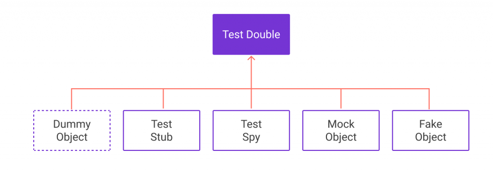

# Capítulo 7 – Mockito

Nos capítulos anteriores, navegamos por diversos frameworks e ferramentas de teste, desde o JUnit para testes unitários em Java, passando pelo Selenium para automação web, até o Jest para o universo JavaScript. Agora, retornamos ao ecossistema Java para explorar o **Mockito**, um framework de **mocking** extremamente popular e poderoso, projetado para nos ajudar a escrever testes unitários mais limpos, eficazes e isolados.

O Mockito é um framework de código aberto que permite a criação de objetos simulados (mocks) de forma elegante e intuitiva. Sua filosofia central é fornecer uma API limpa e simples, resultando em testes que são fáceis de ler, escrever e manter. Como veremos, o Mockito se destaca por produzir mensagens de erro claras durante a verificação, o que facilita a depuração e a compreensão dos problemas nos testes.

Neste capítulo, mergulharemos no mundo do Mockito. Começaremos entendendo o que são "Dublês de Teste" (Test Doubles) e, mais especificamente, o que são "Mocks" e por que são tão cruciais para o teste de unidade eficaz. Em seguida, focaremos no Mockito em si, explorando seus principais recursos, como a criação de mocks e spies, a definição de comportamentos (stubbing) e a verificação de interações. Ilustraremos esses conceitos com exemplos práticos para solidificar o entendimento.

## A Necessidade de Isolar: Introdução aos Dublês de Teste (Test Doubles)

Antes de falarmos especificamente sobre o Mockito, é fundamental entendermos um conceito mais amplo: os **Dublês de Teste (Test Doubles)**. O que é isso? Trata-se de uma categoria de objetos utilizados em testes unitários para substituir os colaboradores reais de uma unidade de código que está sendo testada.

### O Que é um Colaborador?

No contexto de testes de unidade, um **colaborador** é qualquer objeto ou componente do qual a unidade sob teste depende para realizar sua funcionalidade. Por exemplo, se estamos testando uma classe `ServicoDePedido`, ela pode depender de um `RepositorioDePedido` (para acessar o banco de dados) e de um `ServicoDeEmail` (para enviar notificações). Neste caso, `RepositorioDePedido` e `ServicoDeEmail` são colaboradores da classe `ServicoDePedido`.

### Por Que Usar Dublês de Teste?

Às vezes, não é prático ou mesmo possível fazer testes de unidade em um pedaço de código devido à indisponibilidade ou ao comportamento complexo de seus objetos colaboradores. Algumas razões comuns incluem:

- **Indisponibilidade:** O colaborador pode ainda não estar desenvolvido, ou pode ser um sistema externo que não está acessível no ambiente de teste.
- **Custo de Implementação/Configuração:** Configurar o colaborador real para o teste pode ser excessivamente complexo ou demorado (ex: um banco de dados completo, um serviço de terceiros).
- **Comportamento Não Determinístico:** O colaborador pode retornar resultados diferentes a cada chamada (ex: um serviço que retorna a cotação atual de uma moeda) ou ter um comportamento difícil de prever e controlar.
- **Lentidão:** O colaborador real pode ser lento (ex: chamadas de rede, acesso a disco intensivo), tornando os testes unitários demorados e impraticáveis para execução frequente.
- **Efeitos Colaterais Indesejados:** O colaborador real pode ter efeitos colaterais que não queremos disparar durante um teste unitário (ex: enviar um email real, realizar uma transação financeira).

Os **Dublês de Teste** aliviam a necessidade de um colaborador real, fornecendo substitutos controláveis que se passam pelo objeto original.

Pensemos nos **dublês de filmes**! É aquele profissional que substitui um ator em uma cena de ação perigosa, um ator em uma cena de luta complexa, ou até mesmo um ator que precisa demonstrar uma habilidade específica, como tocar um instrumento musical com maestria. Os dublês são utilizados para proteger os atores reais, para substituí-los quando não estão disponíveis, ou quando não possuem a capacidade técnica para realizar determinada cena.

Agora, imaginem que estamos desenvolvendo um sistema de pagamentos que faz interface com um sistema bancário externo. Ora, você vai realizar pagamentos reais, movimentando dinheiro de verdade, apenas para testar se o seu código de processamento de pagamento está funcionando corretamente? Certamente não! Você utilizaria algum tipo de dublê para simular a interação com o sistema bancário, permitindo testar sua lógica de forma segura e controlada.

Os Dublês de Teste são, portanto, **substitutos qualificados para objetos colaboradores**. Existem vários tipos de dublês de teste, como Fakes, Stubs, Spies e, o nosso foco principal aqui, os Mocks.

<div align="center">
  
</div>

## Mocks: Simulação Controlada de Comportamento

O **Mock** é uma técnica e um tipo específico de Dublê de Teste utilizado para simular o comportamento de estruturas de programação (geralmente objetos) de forma controlada. A utilização desta técnica é fundamental para a validação da lógica do código sob teste sem afetar ou depender do ambiente real ou de colaboradores complexos. O termo "Mock" vem do inglês e pode significar algo como imitação, simulação ou, em alguns contextos, zombaria ou falsidade (talvez vocês já tenham ouvido falar em "Mock Debate", que é um debate simulado).

Os Testes de Unidade procuram testar classes (ou métodos) de um sistema **isoladamente**. No entanto, as classes em um sistema orientado a objetos normalmente alcançam seus objetivos com a ajuda de outras classes (seus colaboradores), por mais desacoplado que o design tente ser. Um dos principais desafios no Teste de Unidade é, portanto, isolar a classe que está sendo testada para que nenhuma outra classe do sistema seja envolvida diretamente no teste daquela unidade específica. Nesse momento, entram os mocks.

**Mocks são objetos que simulam o comportamento de objetos reais de forma controlada.** Como assim, "controlada"? Como nós, desenvolvedores ou testadores, criamos e configuramos esses mocks, temos total controle sobre sua implementação e como eles responderão durante o teste. Um objeto sob teste pode ter dependências sobre outros objetos complexos. Para isolar o comportamento do objeto que queremos testar, substituímos esses outros objetos (os colaboradores) por mocks que simulam o comportamento esperado do objeto real.

É crucial que os mocks tenham a **mesma interface** (ou seja, os mesmos métodos públicos) que os objetos reais que eles estão substituindo. Caso contrário, o objeto sob teste não conseguiria se comunicar com o mock da mesma forma que faria com o colaborador real.

Os mocks são particularmente úteis quando temos:

- Objetos que geram **resultados variáveis** ou não determinísticos (ex: um gerador de números aleatórios, um serviço que retorna dados que mudam com o tempo).
- Objetos com **estados difíceis de serem reproduzidos** para um cenário de teste específico.
- Objetos **lentos** (como conexões a bancos de dados que precisam ser inicializadas antes do teste, ou chamadas de rede).
- Objetos que **ainda não existem** (se uma dependência está sendo desenvolvida por outra equipe e ainda não está pronta).
- Objetos cujo **comportamento pode precisar ser alterado** dinamicamente para diferentes cenários de teste (ex: simular uma condição de erro específica).

**Exemplo Prático: O Despertador**

Imagine que estamos fazendo um programa de despertador que deve tocar uma sirene em um horário previamente marcado. Para testar este comportamento de forma unitária, seria impraticável que o teste tivesse que esperar, em tempo real, até chegar a hora programada para verificar se a sirene toca corretamente. Isso tornaria os testes extremamente lentos e dependentes do relógio do sistema.

Se um mock for usado no lugar do objeto real que fornece a hora atual (vamos chamá-lo de `RelogioSistema`), este mock pode ser programado para simular que a hora de programação do despertador chegou, independentemente da hora real.

```java
// Interface do nosso colaborador
public interface Relogio {
    LocalDateTime getHoraAtual();
}

// Classe que queremos testar
public class Despertador {
    private Relogio relogio;
    private LocalDateTime horarioAlarme;
    private boolean alarmeDisparado = false;

    public Despertador(Relogio relogio) {
        this.relogio = relogio;
    }

    public void setAlarme(LocalDateTime horario) {
        this.horarioAlarme = horario;
        this.alarmeDisparado = false;
    }

    public void verificarAlarme() {
        if (horarioAlarme != null && relogio.getHoraAtual().isEqual(horarioAlarme) || relogio.getHoraAtual().isAfter(horarioAlarme)) {
            dispararSirene();
            this.alarmeDisparado = true;
        }
    }

    private void dispararSirene() {
        System.out.println("ALARME DISPARANDO! TRIIIM TRIIIM!");
        // Em um caso real, aqui haveria a lógica para tocar um som, etc.
    }

    public boolean isAlarmeDisparado() {
        return alarmeDisparado;
    }
}

// No nosso teste, usaríamos um mock para Relogio:
// (Conceitual, a sintaxe exata dependerá do framework de mocking)
//
// Relogio mockRelogio = criarMock(Relogio.class);
// configurarMock(mockRelogio.getHoraAtual()).paraRetornar(horarioDoAlarme);
//
// Despertador despertador = new Despertador(mockRelogio);
// despertador.setAlarme(horarioDoAlarme);
// despertador.verificarAlarme();
// verificarQue(despertador.isAlarmeDisparado()).éVerdadeiro();
```

Dessa forma, o código do despertador pode ser testado corretamente, verificando se a lógica de `verificarAlarme()` e `dispararSirene()` funciona como esperado quando a "hora" (fornecida pelo mock) atinge o horário programado, sem qualquer impacto real do tempo de desenvolvimento ou da hora atual do sistema.

Existem diversas bibliotecas (frameworks de mocking) que ajudam na criação e gerenciamento de mocks. Algumas das mais conhecidas incluem:

- **Para Java:** EasyMock, JMock, e o nosso foco, **Mockito**.
- **Para .NET:** NMock, Moq, TypeMock.
- Outras linguagens como Ruby, PHP, Python também possuem seus próprios frameworks de mocking populares.

Embora o conceito de mocks possa parecer um pouco abstrato inicialmente, ele é fundamental para testes unitários eficazes. Entender o propósito dos mocks e como frameworks como o Mockito os facilitam é muito valioso.

## Mockito: Escrevendo Testes Belos e Legíveis

O **Mockito** é um framework de mocking para Java que ganhou imensa popularidade por sua API limpa, simples e intuitiva. A filosofia por trás do Mockito é permitir que você escreva **testes belos**, ou seja, testes que sejam não apenas funcionais, mas também altamente legíveis e fáceis de entender. Um dos slogans do Mockito é que ele "não dá ressaca porque os testes são muito legíveis e produzem erros de verificação limpos".

A comunidade de desenvolvedores Java abraçou o Mockito de forma expressiva. Uma pesquisa da **Massive StackOverflow** (referindo-se provavelmente a enquetes ou análises de popularidade na plataforma) elegeu o Mockito como o melhor framework de mocking para Java. Além disso, uma análise realizada no final de 2013 em 30.000 projetos do GitHub mostrou a forte presença do Mockito. Embora no relatório principal o "mockito" (provavelmente referindo-se a um artefato específico) tenha alcançado a nona posição, ao considerar que `mockito-core` e `mockito-all` são essencialmente a mesma ferramenta, a posição factual do Mockito seria a quarta, superando ferramentas renomadas como Guava ou Spring em termos de inclusão em projetos. Este estudo, embora um pouco datado, serve como um indicador do grande impacto que o Mockito faz diariamente nos testes unitários escritos em Java.

## Principais Recursos do Mockito

A documentação de referência do Mockito destaca vários recursos chave que o tornam tão eficaz. Vamos explorar os mais importantes:

|Recurso|Descrição|
|---|---|
|`mock()` / `@Mock`|Cria um objeto simulado (mock). O método estático `Mockito.mock(ClasseParaMockar.class)` é a forma programática de criar um mock. A anotação `@Mock` (usada com um runner como `MockitoJUnitRunner` ou a `MockitoExtension` para JUnit 5) permite a criação de mocks via injeção de dependência. Opcionalmente, pode-se especificar como o mock deve se comportar globalmente via `Answer` ou `MockSettings`.|
|`when()` / `given()`|As funções `Mockito.when(mock.metodoChamado(...))` ou `BDDMockito.given(mock.metodoChamado(...))` são usadas para **configurar o comportamento de um mock (stubbing)**. Após o `when()` ou `given()`, você especifica o que deve acontecer quando o método do mock for chamado (ex: `thenReturn(valor)`, `thenThrow(excecao)`). Se as respostas fornecidas não atenderem às suas necessidades, você pode escrever uma `Answer` customizada estendendo a interface `org.mockito.stubbing.Answer`.|
|`spy()` / `@Spy`|Permite o **mocking parcial**. Um `spy` envolve um objeto real. Por padrão, quando os métodos de um spy são chamados, os **métodos reais do objeto original são invocados**. No entanto, você ainda pode verificar as interações com o spy e também fazer stubbing de métodos específicos do spy, se necessário, sem afetar o comportamento dos outros métodos reais.|
|`@InjectMocks`|Usada em conjunto com `@Mock` ou `@Spy` e um runner/extensão do Mockito. Esta anotação **injeta automaticamente os campos mocks ou spies** (anotados com `@Mock` ou `@Spy`) nas instâncias da classe que está sendo testada (o objeto anotado com `@InjectMocks`). O Mockito tenta injetar por construtor, depois por setter, e depois por reflexão de campo.|
|`verify()`|Usada para **verificar se certos métodos de um mock (ou spy) foram chamados** com os argumentos esperados, ou um número específico de vezes. Pode-se usar correspondência de argumentos flexível (argument matchers), por exemplo, usando expressões como `Mockito.anyInt()`, `Mockito.anyString()`, ou `Mockito.any(Classe.class)` através do `org.mockito.ArgumentMatchers`.|
|`@Captor`|Usado com `ArgumentCaptor` para **capturar os argumentos** que foram passados para um método de um mock durante sua invocação, permitindo que você faça asserções mais detalhadas sobre esses argumentos.|

Vamos detalhar e exemplificar esses recursos.

### Criando Mocks com `mock()` e `@Mock`

A forma mais básica de usar o Mockito é criando um objeto mock para uma classe ou interface.

**Usando `Mockito.mock()`:**

```java
import org.junit.jupiter.api.Test;
import java.util.List;
import static org.mockito.Mockito.mock;
import static org.mockito.Mockito.verify;
import static org.junit.jupiter.api.Assertions.assertTrue;

public class ExemploMockTest {

    @Test
    void exemploSimplesComMockList() {
        // 1. Criação do Mock
        // Você pode mockar classes concretas, não apenas interfaces
        List<String> mockedList = mock(List.class);

        // 2. Usando o Mock (ainda não definimos comportamento, então os métodos retornam valores padrão)
        mockedList.add("um");
        mockedList.clear();

        // 3. Verificação
        // Queremos verificar se o método add("um") foi chamado no mock
        verify(mockedList).add("um");
        // E se o método clear() foi chamado
        verify(mockedList).clear();

        // Por padrão, para mocks, chamadas a métodos que retornam valores
        // retornam null, zero para primitivos numéricos, ou false para booleanos.
        assertTrue(mockedList.isEmpty()); 
        // Se List.isEmpty() fosse chamado, retornaria false por padrão (se não stubado)
        // No entanto, isEmpty() não foi chamado, então esta asserção não é sobre o mock diretamente.
        // Para uma lista real, após clear(), isEmpty() seria true.
        // Para um mock, precisamos stubar o comportamento de isEmpty() se quisermos um valor específico.
    }
}
```

**Usando a anotação `@Mock` (com JUnit 5 e a Extensão Mockito):** Para usar anotações como `@Mock`, você precisa integrar o Mockito com o seu framework de teste (JUnit, por exemplo). Com JUnit 5, isso é feito usando a `MockitoExtension`.

Primeiro, adicione a dependência do Mockito ao seu projeto (ex: `mockito-junit-jupiter` para integração com JUnit 5).

```java
import org.junit.jupiter.api.Test;
import org.junit.jupiter.api.extension.ExtendWith;
import org.mockito.Mock;
import org.mockito.junit.jupiter.MockitoExtension;
import java.util.List;
import static org.mockito.Mockito.verify;

@ExtendWith(MockitoExtension.class) // Habilita a extensão do Mockito para JUnit 5
public class ExemploAnotacaoMockTest {

    @Mock // Mockito criará uma instância mock desta lista
    private List<String> mockedListComAnotacao;

    @Test
    void testeComMockInjetado() {
        mockedListComAnotacao.add("outro valor");
        mockedListComAnotacao.size(); // Chamada a um método que retorna int

        verify(mockedListComAnotacao).add("outro valor");
        verify(mockedListComAnotacao).size(); // Verifica se size() foi chamado

        // int tamanho = mockedListComAnotacao.size();
        // assertEquals(0, tamanho); // Por padrão, métodos que retornam int em mocks retornam 0
    }
}
```

A anotação `@Mock` é mais concisa e é a forma preferida em muitos projetos, pois reduz o código boilerplate de criação de mocks.

### Definindo Comportamento (Stubbing) com `when().thenReturn()`

Um mock, por si só, não faz muita coisa útil além de registrar invocações. Para que ele simule o comportamento de um objeto real, precisamos "ensinar" a ele como responder a certas chamadas de método. Isso é chamado de **stubbing**.

A forma mais comum de fazer stubbing no Mockito é usando `Mockito.when(chamadaDoMetodoNoMock).thenReturn(valorDeRetorno)`.

```java
import org.junit.jupiter.api.Test;
import java.util.LinkedList; // Classe concreta
import static org.mockito.Mockito.mock;
import static org.mockito.Mockito.when;
import static org.junit.jupiter.api.Assertions.assertEquals;
import static org.junit.jupiter.api.Assertions.assertThrows;

public class ExemploStubbingTest {

    @Test
    void demonstracaoDeStubbing() {
        // Mockando uma classe concreta (LinkedList)
        LinkedList<String> mockedLinkedList = mock(LinkedList.class);

        // Stubbing: Quando o método get(0) for chamado no mock, ele deve retornar "primeiro"
        when(mockedLinkedList.get(0)).thenReturn("primeiro");
        // Stubbing: Quando o método get(1) for chamado, ele deve lançar uma exceção
        when(mockedLinkedList.get(1)).thenThrow(new RuntimeException("Índice inválido para o mock"));

        // Testando o comportamento stubado
        assertEquals("primeiro", mockedLinkedList.get(0)); // Deve retornar "primeiro"
        // System.out.println(mockedLinkedList.get(0)); // Imprimiria "primeiro"

        // Verificando se a exceção é lançada para get(1)
        assertThrows(RuntimeException.class, () -> {
            mockedLinkedList.get(1);
        });
        // System.out.println(mockedLinkedList.get(1)); // Lançaria RuntimeException

        // Chamando um método que não foi stubado (get(99))
        // Por padrão, retorna null para objetos, 0 para int, false para boolean, etc.
        assertEquals(null, mockedLinkedList.get(99));
        // System.out.println(mockedLinkedList.get(99)); // Imprimiria null
    }

    @Test
    void stubbingComChamadasConsecutivas() {
        List<Integer> mockListaInt = mock(List.class);

        // Stubbing para chamadas consecutivas ao mesmo método (com os mesmos argumentos)
        when(mockListaInt.size())
            .thenReturn(10) // Primeira chamada a size()
            .thenReturn(20) // Segunda chamada a size()
            .thenReturn(30); // Terceira e subsequentes chamadas a size()

        assertEquals(10, mockListaInt.size());
        assertEquals(20, mockListaInt.size());
        assertEquals(30, mockListaInt.size());
        assertEquals(30, mockListaInt.size()); // Continua retornando o último valor stubado
    }
}
```

O `BDDMockito.given(chamadaDoMetodoNoMock).willReturn(valorDeRetorno)` é uma alternativa que promove um estilo de escrita mais alinhado com BDD (Behavior-Driven Development), mas funcionalmente é equivalente ao `when().thenReturn()`.

### Verificando Interações com `verify()`

Após interagir com um mock (ou seja, após o código sob teste ter chamado métodos no mock), você frequentemente desejará verificar se essas interações ocorreram como esperado. É para isso que serve o `Mockito.verify()`.

```java
// ... (continuação do ExemploMockTest ou similar)
import static org.mockito.Mockito.*; // Import estático para todos os métodos do Mockito

// ...
    @Test
    void exemploDeVerificacao() {
        List<String> mockedListVerify = mock(List.class);

        // Código sob teste interage com o mock
        mockedListVerify.add("item um");
        mockedListVerify.add("item dois");
        mockedListVerify.add("item dois"); // Chamado duas vezes com "item dois"
        mockedListVerify.clear();

        // Verificações básicas
        verify(mockedListVerify).add("item um"); // Verifica se add("item um") foi chamado exatamente uma vez
        verify(mockedListVerify).clear();      // Verifica se clear() foi chamado exatamente uma vez

        // Verificando o número de invocações
        verify(mockedListVerify, times(1)).add("item um");       // Exatamente uma vez (padrão)
        verify(mockedListVerify, times(2)).add("item dois");    // Exatamente duas vezes
        verify(mockedListVerify, atLeastOnce()).clear();        // Pelo menos uma vez
        verify(mockedListVerify, atLeast(2)).add(anyString());  // add(qualquerString) foi chamado pelo menos 2 vezes
        verify(mockedListVerify, atMost(5)).add(anyString());   // add(qualquerString) foi chamado no máximo 5 vezes
        verify(mockedListVerify, never()).add("item tres");     // Verifica que add("item tres") NUNCA foi chamado

        // Verificando a ordem das invocações (mais avançado)
        InOrder inOrder = inOrder(mockedListVerify);
        inOrder.verify(mockedListVerify).add("item um");
        inOrder.verify(mockedListVerify, times(2)).add("item dois");
        inOrder.verify(mockedListVerify).clear();
    }
```

**Argument Matchers:** Frequentemente, você não se importa com o valor exato de um argumento, mas sim com o fato de que o método foi chamado com _algum_ argumento de um certo tipo, ou que satisfaça uma condição. Para isso, o Mockito oferece **Argument Matchers** (da classe `org.mockito.ArgumentMatchers`):

- `anyString()`: Qualquer string.
- `anyInt()`: Qualquer inteiro.
- `any(MinhaClasse.class)`: Qualquer objeto da classe `MinhaClasse` (ou subtipo).
- `eq(valor)`: Usado quando você precisa misturar um valor literal com outros argument matchers (ex: `verify(mock).metodo(eq("literal"), anyInt());`).
- `argThat(argumentMatcher)`: Para matchers customizados.

**Importante:** Se você usa um argument matcher para um argumento de um método, você **deve** usar argument matchers para **todos** os argumentos daquele método. Você não pode misturar valores literais com argument matchers diretamente, a menos que use `eq()`.

### Spies: Mocking Parcial com `spy()` e `@Spy`

Às vezes, você não quer substituir completamente o comportamento de um objeto, mas sim observar suas interações ou alterar o comportamento de apenas alguns de seus métodos, mantendo a lógica original dos demais. Para isso, o Mockito oferece os **spies**.

Um `spy` envolve um objeto real. Quando você chama um método em um spy, a implementação real do método no objeto original é invocada, a menos que você tenha explicitamente feito stubbing para aquele método no spy.

```java
import org.junit.jupiter.api.Test;
import org.junit.jupiter.api.extension.ExtendWith;
import org.mockito.Spy;
import org.mockito.junit.jupiter.MockitoExtension;
import java.util.ArrayList;
import java.util.List;
import static org.mockito.Mockito.*; // Para spy() estático, when(), verify()
import static org.junit.jupiter.api.Assertions.assertEquals;

@ExtendWith(MockitoExtension.class)
public class ExemploSpyTest {

    @Spy // Mockito criará um spy em torno de uma instância real de ArrayList
    private List<String> spiedList = new ArrayList<>(); // Precisa ser instanciado!

    @Test
    void demonstracaoDeSpy() {
        // Chamando métodos reais no spy
        spiedList.add("um");
        spiedList.add("dois");

        assertEquals(2, spiedList.size()); // O método real size() do ArrayList é chamado
        assertEquals("um", spiedList.get(0)); // O método real get() é chamado

        // Verificando interações com o spy
        verify(spiedList).add("um");
        verify(spiedList).add("dois");

        // Fazendo stubbing de um método específico do spy
        // IMPORTANTE: Para spies, use doReturn().when() ou doThrow().when() para evitar chamar o método real durante o stubbing.
        doReturn(100).when(spiedList).size();
        // when(spiedList.size()).thenReturn(100); // Isso chamaria spiedList.size() real ANTES de stubar, o que pode não ser desejado.

        assertEquals(100, spiedList.size()); // Agora o método size() stubado é chamado
    }

    @Test
    void spyComMetodoEstatico() {
        List<String> listaReal = new ArrayList<>();
        List<String> spyDaLista = spy(listaReal); // Criando spy programaticamente

        spyDaLista.add("A");
        doReturn("B_stubbed").when(spyDaLista).get(0); // Stubando get(0)

        assertEquals("B_stubbed", spyDaLista.get(0)); // Retorna valor stubado
        // assertEquals("A", spyDaLista.get(0)); // Falharia, pois get(0) foi stubado
        
        // Se chamarmos um método não stubado, o real é invocado
        // spyDaLista.add("C");
        // assertEquals("C", spyDaLista.get(1)); // Supondo que "C" foi adicionado no índice 1
    }
}
```

Spies são úteis para testar código legado ou quando você precisa interagir com um objeto real, mas controlar seletivamente algumas de suas respostas.

### Injeção Automática com `@InjectMocks`

Em testes unitários, a classe que você está testando (System Under Test - SUT) frequentemente tem dependências que você substitui por mocks. A anotação `@InjectMocks` simplifica a criação da instância do SUT e a injeção automática desses mocks.

```java
// Colaborador que será mockado
public interface ServicoAutenticacao {
    boolean autenticar(String usuario, String senha);
}

// Classe que queremos testar (SUT)
public class LoginManager {
    private final ServicoAutenticacao servicoAutenticacao;

    // Construtor para injeção de dependência
    public LoginManager(ServicoAutenticacao servicoAutenticacao) {
        this.servicoAutenticacao = servicoAutenticacao;
    }

    public boolean realizarLogin(String usuario, String senha) {
        if (usuario == null || senha == null || usuario.isEmpty() || senha.isEmpty()) {
            return false;
        }
        return servicoAutenticacao.autenticar(usuario, senha);
    }
}

// Teste para LoginManager
import org.junit.jupiter.api.BeforeEach;
import org.junit.jupiter.api.Test;
import org.junit.jupiter.api.extension.ExtendWith;
import org.mockito.InjectMocks;
import org.mockito.Mock;
import org.mockito.junit.jupiter.MockitoExtension;

import static org.junit.jupiter.api.Assertions.assertFalse;
import static org.junit.jupiter.api.Assertions.assertTrue;
import static org.mockito.Mockito.when;
import static org.mockito.ArgumentMatchers.anyString;

@ExtendWith(MockitoExtension.class)
public class LoginManagerTest {

    @Mock // Mock para a dependência
    private ServicoAutenticacao mockServicoAutenticacao;

    @InjectMocks // Mockito tentará injetar os mocks (@Mock ou @Spy) nesta instância
    private LoginManager loginManager;

    // Alternativamente, se não usar @InjectMocks, você faria a instanciação manualmente:
    // private LoginManager loginManagerManual;
    // @BeforeEach
    // void setUp() {
    //     loginManagerManual = new LoginManager(mockServicoAutenticacao);
    // }

    @Test
    void loginBemSucedido() {
        // Configura o mock para retornar true quando autenticar for chamado com quaisquer strings
        when(mockServicoAutenticacao.autenticar(anyString(), anyString())).thenReturn(true);
        // Ou para argumentos específicos:
        // when(mockServicoAutenticacao.autenticar("usuarioValido", "senhaValida")).thenReturn(true);

        assertTrue(loginManager.realizarLogin("usuarioValido", "senhaValida"));
    }

    @Test
    void loginFalhaComCredenciaisInvalidas() {
        when(mockServicoAutenticacao.autenticar("usuarioInvalido", "senhaInvalida")).thenReturn(false);

        assertFalse(loginManager.realizarLogin("usuarioInvalido", "senhaInvalida"));
    }

    @Test
    void loginFalhaComUsuarioNulo() {
        assertFalse(loginManager.realizarLogin(null, "senha"));
    }
}
```

O `@InjectMocks` tenta injetar os mocks por construtor, depois por métodos setter, e por último por atribuição direta a campos (usando reflexão). É uma conveniência que reduz o código de setup dos testes.

## Considerações Finais

Neste capítulo, exploramos o Mockito, um framework de mocking essencial no ecossistema de testes Java, reconhecido por sua API limpa e pela facilidade em criar testes legíveis e eficazes. Iniciamos com a compreensão fundamental dos Dublês de Teste e, mais especificamente, dos Mocks, destacando sua importância para isolar a unidade sob teste de seus colaboradores, permitindo um controle preciso sobre o ambiente de teste.

Analisamos os principais recursos do Mockito, desde a criação de objetos simulados com `mock()` e a anotação `@Mock`, até a definição de seus comportamentos (stubbing) usando `when().thenReturn()`. Vimos como verificar as interações com esses mocks através do `verify()`, utilizando argument matchers para flexibilizar as verificações. A capacidade de criar `spies` para mocking parcial e a conveniência da anotação `@InjectMocks` para a injeção automática de dependências simuladas também foram abordadas.

Os exemplos práticos buscaram ilustrar como o Mockito pode ser aplicado para simular diferentes cenários, controlar retornos de métodos e validar se as interações entre os objetos ocorrem conforme o esperado. A filosofia do Mockito de promover testes "belos" e com mensagens de erro claras contribui significativamente para a produtividade do desenvolvedor e para a manutenção da qualidade do software.

Embora o foco deste capítulo tenha sido nos conceitos fundamentais, é importante lembrar que o Mockito oferece funcionalidades ainda mais avançadas para cenários de teste complexos. No entanto, a base aqui apresentada é suficiente para começar a utilizar este poderoso framework e melhorar significativamente a qualidade e a robustez dos testes unitários em projetos Java. O domínio do Mockito, em conjunto com um bom framework de teste como o JUnit, capacita os desenvolvedores a construir software com maior confiança e manutenibilidade.