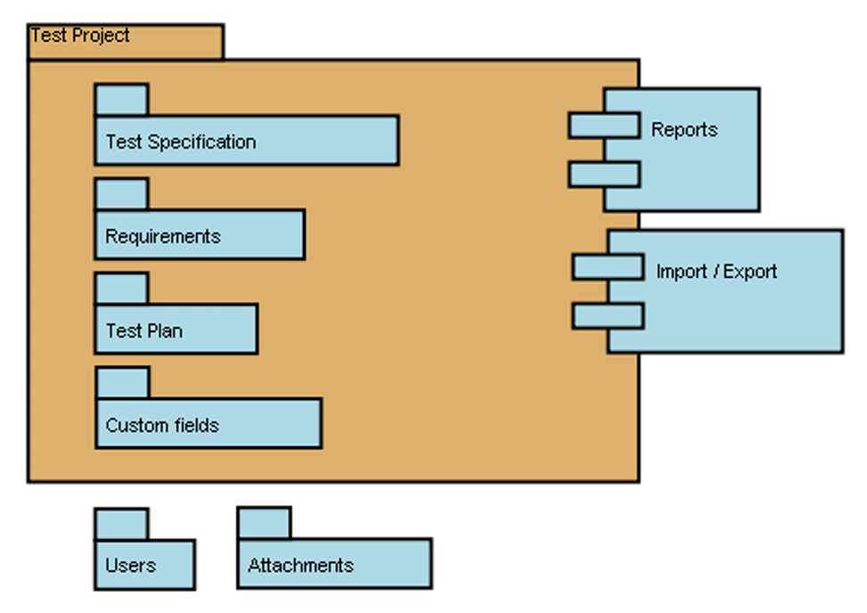

# Capítulo 8 – TestLink: Gerenciamento Centralizado de Testes

Nos capítulos anteriores, exploramos diversas ferramentas e frameworks focados na criação e execução de testes automatizados. No entanto, o processo de teste de software vai além da simples execução de scripts. Ele envolve planejamento, especificação de casos de teste, organização de execuções, acompanhamento de resultados, gerenciamento de defeitos e geração de relatórios. Para orquestrar todas essas atividades de forma eficaz, especialmente em equipes e projetos de maior escala, entram em cena os **Sistemas de Gerenciamento de Testes (Test Management Systems - TMS)**.

Neste capítulo, vamos nos aprofundar no **TestLink**, um sistema de gerenciamento de testes baseado na web e de código aberto (open-source) amplamente utilizado. O TestLink foi projetado para ajudar equipes de teste a colaborar, organizar seus artefatos de teste e acompanhar o progresso das atividades de teste de forma centralizada.

Começaremos entendendo a natureza e os objetivos do TestLink, definindo seus termos e conceitos fundamentais. Em seguida, detalharemos suas principais funcionalidades, desde a criação de projetos e planos de teste até a execução e o relato de resultados, além de suas capacidades de integração. Por fim, discutiremos as vantagens de adotar uma ferramenta como o TestLink para aprimorar a gestão do processo de teste.

## TestLink: Visão Geral e Propósito

O **TestLink** é uma ferramenta robusta que se estabeleceu como uma solução popular para o gerenciamento do ciclo de vida de testes. Por ser uma aplicação baseada na web, ele permite que equipes de teste trabalhem de forma sincronizada e colaborativa, independentemente de estarem no mesmo espaço físico ou distribuídas remotamente. A interface web facilita o acesso e a interação de múltiplos usuários, cada um com seus respectivos níveis de acesso e permissões.

O principal objetivo do TestLink é fornecer uma plataforma centralizada para:

- **Documentar e organizar especificações de requisitos.**
- **Criar, gerenciar e versionar casos de teste.**
- **Elaborar planos de teste detalhados.**
- **Atribuir a execução de testes a membros da equipe.**
- **Registrar os resultados da execução de testes (manuais e automatizados).**
- **Gerar relatórios sobre o progresso e a cobertura dos testes.**
- **Integrar-se com sistemas de rastreamento de defeitos.**

Em essência, o TestLink ajuda a responder perguntas cruciais como: "O que precisa ser testado?", "Como vamos testar?", "Quem vai testar o quê?", "Quais foram os resultados?" e "Quantos defeitos foram encontrados?".

## Estrutura Organizacional e Conceitos Chave no TestLink

Para entender como o trabalho é organizado e gerenciado no TestLink, é crucial familiarizar-se com seus conceitos e termos fundamentais. A ferramenta organiza os dados em torno de três pilares principais: Produto (representado pelo Projeto de Teste), Plano de Teste e Usuário, com todos os outros dados sendo relações ou atributos dessa base.

### Projeto de Teste (Test Project)

O **Projeto de Teste** é a unidade organizacional básica e de mais alto nível dentro do TestLink. Geralmente, um Projeto de Teste corresponde a um produto, sistema ou solução específica que uma empresa está desenvolvendo e que necessita de teste. Ele serve como um contêiner para todos os artefatos e atividades de teste relacionados àquele produto, que pode alterar seus recursos e funcionalidades ao longo do tempo.

  

Características e conteúdo de um Projeto de Teste:

- **Independência:** Os Projetos de Teste são independentes entre si e não compartilham dados diretamente (como casos de teste ou requisitos). Isso garante um isolamento claro entre diferentes produtos ou versões maiores.
- **Documentação de Requisitos:** Permite importar ou criar especificações de requisitos, que podem ser vinculadas a casos de teste para garantir a rastreabilidade.
- **Especificação de Teste (Suítes e Casos de Teste):** É dentro de um Projeto de Teste que as suítes de teste (agrupamentos lógicos) e os casos de teste individuais são criados e mantidos.
- **Planos de Teste:** Contém um ou mais Planos de Teste, que definem como e quando os casos de teste serão executados para uma determinada versão ou ciclo de teste do produto.
- **Palavras-chave (Keywords):** Permite categorizar e organizar casos de teste.
- **Campos Personalizados (Custom Fields):** Oferece flexibilidade para adicionar campos específicos às necessidades do projeto.
- **Direitos de Usuário Específicos:** Permite definir permissões de acesso e papéis para os usuários dentro daquele projeto específico.

Recomenda-se considerar o uso de apenas um Projeto de Teste para uma equipe de teste e/ou um produto específico para manter a organização e clareza.

### Plano de Teste (Test Plan)

O **Plano de Teste** é a base para a atividade de **execução de testes**. Ele define o escopo, a estratégia e os recursos para um ciclo de teste específico dentro de um Projeto de Teste. Um Projeto de Teste pode ter múltiplos Planos de Teste, por exemplo, um para cada release, sprint, ou tipo de teste (como teste de regressão, teste de novas funcionalidades, etc.).

Um Plano de Teste no TestLink normalmente contém:

- **Nome e Descrição:** Identificação clara do propósito do plano.
- **Coleção de Casos de Teste:** Uma seleção dos casos de teste (da Especificação de Teste do projeto) que serão executados como parte deste plano.
- **Builds/Versões:** Permite associar execuções de teste a versões específicas do software sob teste.
- **Resultados de Teste:** Armazena os resultados (Passou, Falhou, Bloqueado, etc.) para cada caso de teste executado dentro do plano.
- **Marcos (Milestones):** Pode ser usado para definir datas ou fases importantes dentro do ciclo de teste.
- **Atribuição de Teste:** Permite atribuir a execução de casos de teste específicos a diferentes testadores.
- **Definição de Prioridade:** Pode-se definir prioridades para a execução dos testes dentro do plano.

Cada Plano de Teste está intrinsecamente relacionado a um (e apenas um) Projeto de Teste. É através do Plano de Teste que a estratégia de teste se materializa em ações concretas de execução e acompanhamento.

### Caso de Teste (Test Case)

O **Caso de Teste** é a unidade fundamental da especificação de teste. Ele descreve um **conjunto de entradas, condições prévias de execução e resultados esperados**, desenvolvidos para um objetivo particular. Esse objetivo pode ser o exercício de um determinado caminho do programa, a verificação da conformidade com um requisito específico, ou a validação de uma funcionalidade.

Um Caso de Teste bem escrito no TestLink geralmente inclui:

- **ID Único:** Gerado automaticamente pelo sistema.
- **Título/Nome:** Um resumo conciso do objetivo do teste.
- **Sumário/Descrição:** Uma explicação mais detalhada do que o teste visa verificar.
- **Pré-condições:** Condições que devem ser verdadeiras antes que o teste possa ser executado.
- **Passos de Execução:** Uma sequência numerada de ações a serem realizadas pelo testador (ou script automatizado).
- **Resultados Esperados:** O comportamento ou saída que se espera observar após a execução de cada passo ou do teste como um todo.
- **Prioridade:** Indica a importância do caso de teste (ex: Alta, Média, Baixa).
- **Status:** Indica o estado do caso de teste (ex: Rascunho, Pronto para Revisão, Final, Obsoleto).
- **Palavras-chave:** Para facilitar a busca e organização.
- **Vínculo com Requisitos:** Permite rastrear quais requisitos são cobertos por este caso de teste.

Os Casos de Teste são criados e organizados dentro da seção "Especificação de Teste" de um Projeto de Teste, geralmente agrupados em "Suítes de Teste" para melhor organização.

### Usuário (User)

O **Usuário** é outro pilar fundamental. O TestLink permite a criação de contas para múltiplos usuários, e a cada usuário pode ser atribuída uma ou mais **funções (roles)**. Essas funções definem o nível de acesso e as permissões que o usuário terá dentro do sistema e dentro de cada Projeto de Teste (ex: administrador, líder de teste, testador, visualizador). O usuário administrador tem a capacidade de gerenciar as contas de usuário e as atribuições de papéis, bem como a tarefa de atribuição de casos de teste para execução.

## Funcionalidades e Vantagens Chave do TestLink

O TestLink oferece um conjunto robusto de funcionalidades que o tornam uma ferramenta valiosa para equipes de teste. Muitas de suas vantagens derivam diretamente dessas funcionalidades.

### Gerenciamento Centralizado e Colaborativo

Como uma ferramenta baseada na web, o TestLink permite que múltiplos usuários acessem e trabalhem no sistema simultaneamente, cada um com suas credenciais e de acordo com as funções que lhes foram atribuídas. Isso facilita a colaboração entre membros da equipe, mesmo que estejam geograficamente distribuídos. Todos os artefatos de teste (requisitos, casos de teste, planos, resultados) são armazenados em um local central, proporcionando uma "única fonte da verdade".

### Sincronização entre Requisitos e Testes

Uma das grandes forças do TestLink é sua capacidade de **sincronizar a especificação de requisitos com a especificação de teste**. Os usuários podem importar ou definir requisitos dentro da ferramenta e, em seguida, vincular casos de teste a esses requisitos. Isso permite:

- **Análise de Cobertura de Requisitos:** Verificar quais requisitos estão sendo cobertos por casos de teste e identificar lacunas.
- **Rastreabilidade:** Entender o impacto de uma falha em um caso de teste sobre os requisitos associados, ou o impacto de uma mudança em um requisito sobre os casos de teste existentes.

Essa rastreabilidade é crucial para garantir que o sistema desenvolvido atenda às necessidades do negócio e do cliente.

### Suporte à Execução de Testes Manuais e Automatizados

O TestLink é projetado para gerenciar a execução de ambos os tipos de teste:

- **Testes Manuais:** Testadores podem seguir os passos definidos nos casos de teste e registrar os resultados (Passou, Falhou, Bloqueado, etc.) diretamente na interface do TestLink, adicionando comentários e evidências (como screenshots) se necessário.
- **Testes Automatizados:** O TestLink suporta a execução automatizada de casos de teste através de sua **API XML-RPC**. Isso permite que ferramentas de automação externas (como Selenium, JUnit, etc.) se integrem com o TestLink para reportar os resultados da execução dos scripts automatizados. Dessa forma, o TestLink pode consolidar os resultados de testes manuais e automatizados em um único local.

### Geração de Planos e Relatórios de Teste

A capacidade de gerar documentação é vital. O TestLink facilita a criação de **Planos de Teste** (documentos que descrevem a estratégia de teste) e **Relatórios de Teste** (que resumem os resultados da execução) em uma fração do tempo que levaria para criá-los manualmente. Ele suporta a exportação desses relatórios em vários formatos populares, como:

- Excel
- MS Word
- Formatos HTML

Esses relatórios são essenciais para comunicar o status do teste, a qualidade do produto e para a tomada de decisões gerenciais.

### Integração com Sistemas de Rastreamento de Defeitos

Quando um teste falha, geralmente é necessário registrar um defeito (bug) em um sistema de rastreamento de defeitos. O TestLink suporta a **integração com muitos sistemas populares de rastreamento de defeitos**, como:

- JIRA
- MantisBT
- Bugzilla
- Trac
- E outros.

Essa integração permite que os testadores criem defeitos diretamente a partir dos resultados de teste no TestLink, vinculando o defeito ao caso de teste que falhou. Isso melhora a rastreabilidade entre testes e defeitos e agiliza o fluxo de trabalho de correção de bugs.

### Outras Vantagens Significativas

Além dos pontos já mencionados, o TestLink oferece outras vantagens importantes:

- **Suporte a Múltiplos Projetos:** Permite gerenciar o teste de diversos produtos ou projetos de forma isolada dentro da mesma instância da ferramenta.
- **Fácil Exportação e Importação de Casos de Teste:** Casos de teste podem ser importados e exportados em formatos como XML ou CSV, facilitando a migração de dados ou a colaboração com outras ferramentas.
- **Filtragem Avançada de Casos de Teste:** Oferece mecanismos robustos para filtrar casos de teste com base em diversos critérios, como versão, palavras-chave, ID do caso de teste, status, prioridade, etc., o que é essencial para selecionar os testes relevantes para um determinado Plano de Teste ou ciclo de execução.
- **Fácil Atribuição de Casos de Teste:** Simplifica o processo de atribuir a execução de casos de teste a diferentes usuários da equipe.
- **Gerenciamento de Builds/Versões:** Permite associar execuções de teste a builds específicos do software, facilitando o rastreamento da qualidade ao longo das diferentes versões.
- **Histórico de Execução:** Mantém um histórico dos resultados de execução para cada caso de teste, permitindo analisar tendências e a estabilidade dos testes.
- **Credenciais e Gerenciamento de Funções:** Fornece um sistema para gerenciar credenciais de múltiplos usuários e atribuir funções específicas a eles, controlando o acesso e as permissões dentro da ferramenta.

## Considerações Finais

Neste capítulo, exploramos o TestLink, uma ferramenta de gerenciamento de testes baseada na web e de código aberto que desempenha um papel crucial na organização e no controle do processo de teste de software. Vimos como sua estrutura, centrada em Projetos de Teste, Planos de Teste e Casos de Teste, permite uma gestão detalhada e colaborativa de todos os artefatos e atividades de teste.

Destacamos as funcionalidades chave do TestLink, como a capacidade de sincronizar requisitos com casos de teste, o suporte à execução de testes manuais e automatizados (via XML-RPC), a geração de relatórios em diversos formatos e, fundamentalmente, sua integração com populares sistemas de rastreamento de defeitos. A natureza web da ferramenta facilita o acesso concorrente e a colaboração entre equipes, mesmo que distribuídas.

As vantagens de utilizar o TestLink são claras: melhor organização, maior rastreabilidade, comunicação eficiente dos resultados e um controle mais apurado sobre a qualidade do produto. Ao centralizar o gerenciamento de testes, o TestLink capacita as equipes a otimizar seus esforços, identificar problemas mais rapidamente e tomar decisões mais bem informadas ao longo do ciclo de vida do desenvolvimento de software. Embora existam diversas ferramentas de gerenciamento de teste no mercado, o TestLink se mantém como uma opção robusta e acessível, especialmente para equipes que buscam uma solução open-source completa para orquestrar suas atividades de teste.