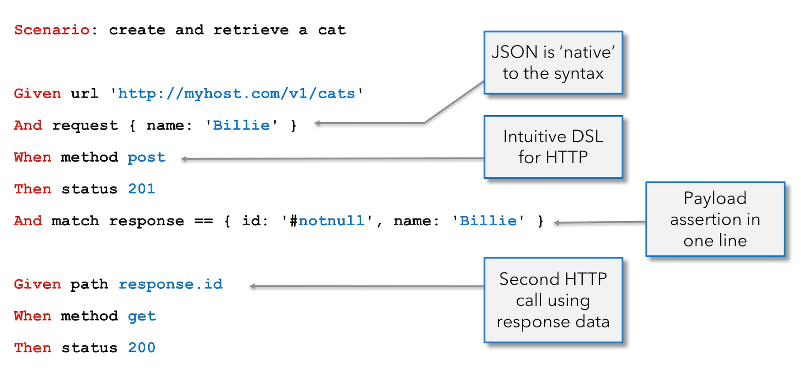

## Capítulo 10 – Karate DSL

Chegamos a um ponto empolgante em nossa jornada pela automação de testes! Nos capítulos anteriores, exploramos uma variedade de ferramentas e frameworks, cada um com suas especialidades, desde testes unitários com JUnit e Mockito, passando pela automação web com Selenium, testes de comportamento com Cucumber, até testes de performance com JMeter e frameworks de teste para JavaScript como Jasmine e Jest. Agora, vamos conhecer o **Karate DSL**, uma ferramenta de código aberto que se destaca por sua proposta singular de unificar diversos tipos de automação de teste em uma única plataforma.

O Karate não é apenas mais uma ferramenta de teste de API; ele se propõe a ser uma solução integrada que combina **automação de testes de API, simulação de serviços (mocks), testes de desempenho e até mesmo automação de interface do usuário (UI)**. Tudo isso utilizando uma sintaxe amigável e neutra em relação à linguagem de programação, o que a torna acessível mesmo para profissionais que não possuem um profundo conhecimento em programação.

Neste capítulo, vamos desvendar o Karate DSL. Começaremos pelos seus conceitos básicos, entendendo sua filosofia e as vantagens que o tornam uma opção atraente. Em seguida, detalharemos suas principais funcionalidades, como a escrita de testes legíveis, a manipulação de dados JSON e XML, as capacidades de asserção, a reutilização de código e a integração com outras ferramentas e protocolos. Prepare-se para descobrir como o Karate DSL pode simplificar e potencializar seus esforços de automação de testes em múltiplas frentes!

### Conceitos Fundamentais do Karate DSL

O **Karate DSL** (Domain Specific Language) é uma ferramenta de teste de código aberto construída sobre o popular framework Cucumber/Gherkin, mas com uma diferença fundamental: ele elimina a necessidade de escrever código adicional de "ligação" ou "definições de passos" (step definitions) em uma linguagem de programação separada como Java para a maioria dos cenários de teste de API. A ideia é que os próprios passos Gherkin contenham a lógica de automação necessária, tornando os testes mais diretos e fáceis de manter.

<div align="center">
  
</div>

A filosofia central do Karate é fornecer uma sintaxe simples, legível e poderosa, projetada especificamente para lidar com os desafios comuns em testes de serviços web, como interações HTTP, manipulação de JSON, GraphQL e XML.

<div align="center">
  
</div>

Algumas das características que definem o Karate são:

- **Unificação de Testes**: É a única ferramenta de código aberto que combina automação de testes de API, simulação de serviços, testes de desempenho e automação de UI em um único framework.
- **Sintaxe Acessível**: A sintaxe é neutra em relação à linguagem de programação e foi cuidadosamente projetada para ser compreensível e utilizável até mesmo por pessoas sem experiência prévia em programação. Isso amplia a participação na criação de testes automatizados, não limitando essa tarefa apenas a desenvolvedores experientes em Java ou outras linguagens.
- **JSON como Cidadão de Primeira Classe**: O Karate trata JSON de forma nativa e intuitiva. É possível expressar payloads JSON e dados esperados diretamente nos scripts de teste, muitas vezes sem a necessidade de envolver nomes de campos em aspas ou "escapar" caracteres especiais, como seria necessário em linguagens como Java.
- **Sem "Step Definitions" Tradicionais**: Para a maioria dos testes de API, não é necessário criar classes Java ou arquivos de código adicionais para implementar a lógica dos passos Gherkin. A própria sintaxe do Karate já embute essa capacidade.
- **Relatórios e Asserções Integrados**: Relatórios detalhados em HTML e um sistema robusto de asserções são funcionalidades nativas, facilitando a visualização dos resultados e a validação das respostas.
- **Execução Paralela**: Suporta a execução de testes em paralelo para otimizar o tempo total de execução, uma característica crucial para suítes de teste extensas.
- **Scripts em Texto Simples**: Os scripts do Karate são escritos em arquivos de texto simples (geralmente com a extensão `.feature`), dispensando a necessidade de compilação ou de um Ambiente de Desenvolvimento Integrado (IDE) complexo. Isso facilita a colaboração e o versionamento usando sistemas como Git.
- **Baseado em Cucumber/Gherkin**: Por se basear no padrão Cucumber/Gherkin, o Karate se beneficia do suporte de IDEs para destaque de sintaxe e de uma estrutura familiar para muitos profissionais da área.
- **Suporte Nativo a JSON e XML**: A DSL oferece suporte nativo para manipulação de JSON e XML, incluindo o uso de expressões JsonPath e XPath para extrair e validar dados.
- **Menos Código Boilerplate**: Elimina a necessidade de criar "Java Beans" ou classes auxiliares para representar payloads ou endpoints HTTP, resultando em testes mais enxutos e fáceis de manter.
- **Ideal para GraphQL**: Suas capacidades integradas de manipulação de texto e JsonPath o tornam particularmente eficaz para testar as respostas dinâmicas e complexas de APIs GraphQL.
- **Estrutura de Projeto Padrão**: Adota uma estrutura de projeto Java/Maven padrão, o que facilita sua integração com pipelines de Integração Contínua (CI) e Entrega Contínua (CD). Além disso, possui suporte nativo ao JUnit 5, permitindo que os testes sejam organizados e executados dentro dessa conhecida estrutura.
- **Executável Independente**: Para equipes menos familiarizadas com Java ou que preferem uma abordagem mais leve, o Karate oferece uma versão executável independente e multiplataforma, que não exige a compilação de código ou uma configuração extensa de ambiente Java.
- **API Java Disponível**: Para cenários que exigem uma integração mais profunda ou programática, o Karate também disponibiliza uma API em Java, permitindo que suas funcionalidades de automação e asserção sejam incorporadas em projetos Java existentes.

Essa combinação de simplicidade, poder e versatilidade faz do Karate uma ferramenta atraente para uma ampla gama de necessidades de teste, especialmente no contexto de microsserviços e APIs modernas.

### Funcionalidades Detalhadas do Karate DSL

Vamos aprofundar em algumas das funcionalidades que tornam o Karate uma ferramenta tão eficaz e popular para a automação de testes, especialmente de APIs.

#### Legibilidade Excepcional dos Testes

Um dos pilares do Karate é a **legibilidade** dos seus scripts de teste. Isso é alcançado permitindo que os dados dos cenários de teste sejam expressos de forma direta e compreensível, mesmo para quem não é programador.

- **Dados Inseridos Diretamente**: É possível inserir dados de payloads (JSON ou XML) diretamente no arquivo `.feature` de uma maneira que é muito próxima da representação natural desses formatos.

```gherkin
Feature: Gerenciamento de Usuários

Scenario: Criar um novo usuário
  Given url 'https://api.example.com/users'
  And request
  """
  {
	"name": "John Doe",
	"email": "john.doe@example.com",
	"age": 30
  }
  """
  When method post
  Then status 201
  And match response.id == '#present'
  And match response.name == 'John Doe'
```

Note como o JSON no bloco `request` é limpo e fácil de ler, sem a necessidade de aspas excessivas ou caracteres de escape.

- **Flexibilidade na Expressão de Dados**: Além da inserção direta, o Karate permite o uso de tabelas do `Scenario Outline` (herança do Gherkin) ou abordagens de construção de carga útil dinâmicas dentro do próprio script.

#### Manipulação e Asserção de Resultados em JSON/XML

O Karate simplifica enormemente a tarefa de validar respostas de API, especialmente quando elas estão em formatos como JSON ou XML.

**Resultados Esperados Legíveis**: Você pode expressar a estrutura e os dados esperados de uma resposta JSON ou XML de forma clara e bem-formada diretamente no seu teste.

**Asserções Poderosas em Uma Única Etapa**: É possível verificar se um payload de resposta completo, por mais complexo ou aninhado que seja, está conforme o esperado em uma única instrução `match`.

```gherkin
Scenario: Obter detalhes do usuário
  Given url 'https://api.example.com/users/123'
  When method get
  Then status 200
  And match response ==
  """
  {
	"id": 123,
	"name": "Jane Doe",
	"email": "jane.doe@example.com",
	"address": {
	  "street": "123 Main St",
	  "city": "Anytown"
	},
	"tags": ["vip", "frequent-buyer"]
  }
  """
```

A palavra-chave `match` é extremamente versátil. Ela pode comparar o payload inteiro, partes dele usando JsonPath ou XPath, verificar tipos de dados, presença de campos, e muito mais.

- `'#present'`: Verifica se um campo está presente, independentemente do seu valor.
- `'#notnull'`: Verifica se um campo não é nulo.
- `'#null'`: Verifica se um campo é nulo.
- `'#boolean'`: Verifica se o valor é um booleano.
- `'#number'`: Verifica se o valor é um número.
- `'#string'`: Verifica se o valor é uma string.
- `'#array'`: Verifica se o valor é um array (e opcionalmente seu tamanho).
- `'#object'`: Verifica se o valor é um objeto.
- `'##string'`: Permite que o valor seja uma string ou nulo.
- `'#regex ... '`: Verifica se uma string corresponde a uma expressão regular.

**Relatórios de Falha Claros**: Mesmo com respostas grandes e complexas, quando uma asserção `match` falha, o Karate reporta de forma precisa qual elemento de dados (e seu caminho JsonPath/XPath) não está conforme o esperado. Isso simplifica enormemente a depuração.

#### Extensibilidade com Java

Embora um dos grandes atrativos do Karate seja a redução da necessidade de código Java, ele oferece total flexibilidade para invocar código Java quando necessário.

- **Invocar Classes do JDK ou Bibliotecas Externas**: Você pode facilmente chamar métodos de classes do Java Development Kit (JDK) ou de quaisquer bibliotecas Java padrão ou personalizadas que estejam no classpath do seu projeto.

```gherkin
Scenario: Usar uma função Java customizada
  * def MyUtils = Java.type('com.mycompany.MyUtils')
  * def randomNumber = MyUtils.generateRandomNumber(1, 100)
  * print 'Número aleatório gerado:', randomNumber
```

 Isso permite que você estenda as capacidades do Karate para atender a requisitos de teste muito específicos ou para integrar com lógicas de negócio existentes.

- **API Java para Invocação Programática**: O Karate pode ser invocado e controlado através de uma API Java. Isso permite que os testes do Karate sejam integrados em suítes de teste Java existentes (por exemplo, JUnit ou TestNG) ou até mesmo em fluxos de automação de UI legados. Essa flexibilidade é crucial para empresas que já possuem uma infraestrutura de testes baseada em Java.

#### Reutilização para Testes de Desempenho com Gatling

Uma característica notável do Karate é a capacidade de reutilizar os scripts de teste de API existentes como base para testes de desempenho usando o Gatling. Isso representa uma economia de esforço significativa, pois os mesmos testes que validam a funcionalidade e a precisão das respostas da API podem ser adaptados para avaliar como o servidor se comporta sob carga. A integração nativa com o Gatling permite que os desenvolvedores e testadores criem cenários de carga robustos, validando não apenas a correção funcional, mas também a escalabilidade e a capacidade de resposta do sistema.

### Ferramentas e Facilidades Adicionais

O Karate vai além do básico de requisição e resposta, oferecendo um conjunto de ferramentas e facilidades que enriquecem a experiência de desenvolvimento de testes.

- **Depurador (Debugger) Avançado**: O Karate inclui uma ferramenta de depuração que permite não apenas inspecionar variáveis, mas também retroceder passos ("step-back") e até mesmo reexecutar um passo que está sendo editado em tempo real. Essa capacidade de depuração interativa é uma grande economia de tempo, permitindo uma análise detalhada e correção rápida dos scripts.
- **Validação de Schema (Alternativa ao JSONschema)**: O Karate oferece uma maneira poderosa e, muitas vezes, mais simples do que o JSONschema para validar a estrutura, os tipos de dados e até mesmo regras de negócio entre campos de um payload. É possível verificar se todos os campos esperados estão presentes, se os tipos de dados estão corretos e até mesmo realizar validações cruzadas entre diferentes partes do payload.

```gherkin
Scenario: Validar schema do produto
  Given url 'https://api.example.com/products/1'
  When method get
  Then status 200
  And match response ==
  """
  {
	"id": "#number",
	"name": "#string",
	"price": "#number",
	"inStock": "#boolean",
	"tags": "#[] #string" 
  }
  """
  # '#[] #string' valida que 'tags' é um array onde cada elemento é uma string.
  # Ou, para validar que 'price' deve ser maior que zero se 'inStock' for true:
  And assert response.inStock ? response.price > 0 : true
```

- **Chamada de Outros Scripts (Reutilização)**: Scripts do Karate podem chamar outros scripts do Karate. Isso é fundamental para a reutilização de fluxos comuns, como autenticação, configuração de dados de teste ou sequências de chamadas que são pré-requisitos para outros testes. Ajuda a criar testes modulares, mais organizados e fáceis de manter.

```gherkin
# main.feature
Scenario: Realizar uma ação que requer login
  * def loginResult = call read('classpath:com/mytests/auth/login.feature') { user: 'testuser', pass: 'secret' }
  * def authToken = loginResult.authToken
  # Usar authToken em chamadas subsequentes
  Given url 'https://api.example.com/protected/resource'
  And header Authorization = 'Bearer ' + authToken
  # ...
```

- **Engine JavaScript Incorporada**: O Karate possui uma engine JavaScript (GraalVM JavaScript) embutida. Isso permite que você escreva funções de utilidade em JavaScript diretamente nos seus arquivos `.feature` ou em arquivos `.js` separados, que podem ser chamados de qualquer script Karate. Essa capacidade é útil para manipulação de dados complexa, lógica condicional ou para criar bibliotecas de funções reutilizáveis específicas para o seu ambiente ou organização.

```gherkin
Scenario: Usar função JavaScript
  * def Utils = read('classpath:com/mytests/utils.js')
  * def today = Utils.getCurrentDateFormatted()
  * print 'Data formatada:', today
```

- **Configuração por Ambiente**: O Karate oferece suporte nativo para alternar configurações com base no ambiente em que os testes estão sendo executados (ex: desenvolvimento, homologação, produção). Isso é geralmente feito através de um arquivo `karate-config.js`, onde você pode definir variáveis e lógicas que se adaptam ao ambiente especificado. Isso evita a necessidade de modificar os scripts de teste para cada ambiente.
- **Testes Orientados por Dados e Agrupamento**: O Karate suporta testes orientados por dados (Data-Driven Testing) através de `Scenario Outline` e `Examples` (herdados do Gherkin) ou lendo dados de arquivos CSV ou JSON. Também permite agrupar ou marcar testes usando tags, eliminando a necessidade de depender de frameworks externos como JUnit ou TestNG para essa funcionalidade básica de organização e execução seletiva.
- **Validação Visual (Comparação de Imagens)**: O Karate possui capacidades integradas para automação de UI que incluem a comparação de imagens. Isso é útil para testes visuais, onde se verifica se a interface do usuário está sendo renderizada corretamente, comparando screenshots atuais com imagens de referência.

### Integrações e Suporte a Protocolos

O Karate é projetado para se integrar bem com o ecossistema de desenvolvimento e teste, além de suportar uma variedade de protocolos e formatos de dados.

- **Leitura de YAML e CSV**: Além de JSON e XML, o Karate oferece suporte nativo para ler dados de arquivos YAML e CSV, que podem ser usados para alimentar testes orientados por dados.
- **Templates HTML para Relatórios**: Embora os relatórios padrão sejam abrangentes, o Karate permite a criação de templates HTML customizados para estender os relatórios de teste, tornando-os mais legíveis e adaptados às necessidades de comunicação da equipe.
- **Mocks de API (Test Doubles)**: O Karate inclui um poderoso servidor de mocks que pode simular endpoints de API. Esses mocks podem manter o estado entre chamadas (suportando operações CRUD - Create, Read, Update, Delete). Isso é extremamente útil para o Desenvolvimento Orientado a Testes (TDD) de microsserviços e para validar Contratos Orientados pelo Consumidor (Consumer Driven Contracts), permitindo que você teste um serviço isoladamente, mesmo que suas dependências ainda não estejam prontas ou disponíveis.
- **Suporte Assíncrono**: O Karate pode lidar com cenários assíncronos, permitindo a integração com sistemas de tratamento de eventos personalizados ou a escuta de filas de mensagens.
- **Relatórios Compatíveis com Cucumber**: Os relatórios HTML gerados pelo Karate são compatíveis com o formato de relatório JSON do Cucumber. Isso significa que você pode usar plugins Maven de terceiros (ou de outros sistemas de build) projetados para relatórios Cucumber para gerar visualizações mais elaboradas ou integradas.
- **Integração com Gatling para Testes de Desempenho**: Como mencionado anteriormente, a integração com Gatling é um diferencial. Essa integração permite conectar-se a código Java personalizado, possibilitando testes de desempenho até mesmo em protocolos não HTTP, como gRPC.
- **Amplo Suporte a HTTP**:
    - **SOAP e XML**: Lida eficientemente com requisições SOAP e XML.
    - **HTTPS/SSL**: Suporta chamadas HTTPS/SSL sem a complexidade de configurar certificados, keystores ou truststores na maioria dos casos.
    - **Proxy HTTP**: Permite configurar e usar servidores proxy HTTP.
    - **Dados de Formulário HTML**: Suporta codificação URL para dados de formulário (`application/x-www-form-urlencoded`).
    - **Upload de Arquivos**: Permite o upload de arquivos usando `multipart/form-data`, incluindo `multipart/mixed` e `multipart/related`.
    - **Gerenciamento de Cookies**: Trata cookies de forma similar a um navegador ("browser-like").
    - **Controle Total de Cabeçalhos e Parâmetros**: Oferece controle completo sobre cabeçalhos HTTP, parâmetros de caminho e de consulta.
    - **Retentativas (Retry)**: Permite configurar retentativas para uma requisição até que uma condição específica seja atendida.
    - **WebSockets**: Suporta testes de comunicação via WebSockets, essencial para aplicações em tempo real.

### Recursos Adicionais e Vantagens Operacionais

O Karate oferece diversos recursos que otimizam o fluxo de trabalho e a eficiência dos testes.

- **Execução Paralela Multi-Threaded**: Um dos recursos mais impactantes do Karate é sua capacidade de executar testes em paralelo usando múltiplas threads. Isso pode reduzir drasticamente o tempo total de execução da suíte de testes, especialmente para testes de integração e ponta a ponta, que tendem a ser mais demorados.
- **Reutilização de Dados e Funções**: O Karate incentiva a reutilização de dados de carga útil (payloads) e funções definidas pelo usuário (sejam elas em JavaScript ou outros scripts Karate) entre diferentes testes. Isso promove a consistência, reduz a duplicação de código e simplifica a manutenção dos testes.
- **Logs Detalhados nos Relatórios**: Os relatórios HTML gerados pelo Karate incluem logs in-line das requisições e respostas HTTP completas (cabeçalhos e corpo). Essa informação detalhada é invaluable para a depuração e resolução de problemas, permitindo que desenvolvedores e testadores identifiquem rapidamente a causa de falhas.
- **Sistema de Plugins para Autenticação**: O Karate possui um sistema de plugins simples para gerenciar a autenticação e a manipulação de cabeçalhos HTTP. Isso é projetado para lidar com esquemas de autenticação complexos do mundo real (como OAuth2) de forma flexível e customizável.
- **Automação de Desktop Multiplataforma**: Além de APIs e UI web, o Karate oferece capacidades para automação de aplicações desktop de forma multiplataforma. Isso pode ser útil para fluxos de teste que envolvem interações com aplicações desktop como parte de um cenário de ponta a ponta, e pode ser integrado de forma transparente com os fluxos de automação web.

### Automação de Interface do Usuário (UI)

Embora o Karate seja primariamente conhecido por seus testes de API, ele também estende suas capacidades para a **automação de interface do usuário (UI)**. Ele se integra com tecnologias subjacentes como o WebDriver (semelhante ao Selenium) para permitir a interação com navegadores web.

A vantagem aqui é a possibilidade de usar a mesma sintaxe e o mesmo framework para testar diferentes camadas da aplicação – desde a API até a interface do usuário. Isso pode ser particularmente útil para:

- Escrever testes de ponta a ponta que cobrem tanto as interações de UI quanto as chamadas de API subjacentes.
- Reutilizar a lógica de preparação de dados ou chamadas de API (feitas com Karate) como setup para testes de UI.
- Permitir que equipes com conhecimento em Karate para APIs expandam seus testes para a camada de UI sem precisar aprender um framework completamente novo e complexo apenas para UI.

O suporte a automação de UI do Karate visa ser mais simples e direto para certos casos de uso em comparação com frameworks de UI dedicados, aproveitando a sintaxe concisa do Karate.

### Considerações Finais

Ao longo deste capítulo, exploramos o Karate DSL, uma ferramenta multifacetada que se propõe a unificar a automação de testes de API, simulações de serviço, testes de desempenho e automação de UI sob um mesmo framework. Sua abordagem baseada em Gherkin, mas com a lógica de automação embutida nos próprios passos, elimina a necessidade de "step definitions" em código separado para a maioria dos cenários de API, tornando os testes notavelmente concisos e legíveis.

Destacamos a forma intuitiva como o Karate lida com JSON e XML, suas poderosas capacidades de asserção com o comando `match`, e a facilidade de reutilização de código através da chamada de outros scripts e do uso de JavaScript incorporado. A capacidade de executar testes em paralelo, o depurador avançado e a integração nativa com ferramentas como Gatling e JUnit 5 solidificam sua posição como uma solução robusta e eficiente.

A flexibilidade do Karate, permitindo desde a escrita de testes por não programadores até a extensão com código Java e a integração com pipelines de CI/CD, o torna adaptável a uma vasta gama de projetos e equipes. Seja para testar APIs RESTful, GraphQL, SOAP, ou mesmo para orquestrar testes de UI e desempenho, o Karate DSL oferece uma alternativa atraente que prioriza a simplicidade, a legibilidade e a produtividade do desenvolvedor de testes. Com o conhecimento adquirido, você está mais preparado para avaliar como o Karate pode se encaixar em sua estratégia de automação e contribuir para a entrega de software de alta qualidade.