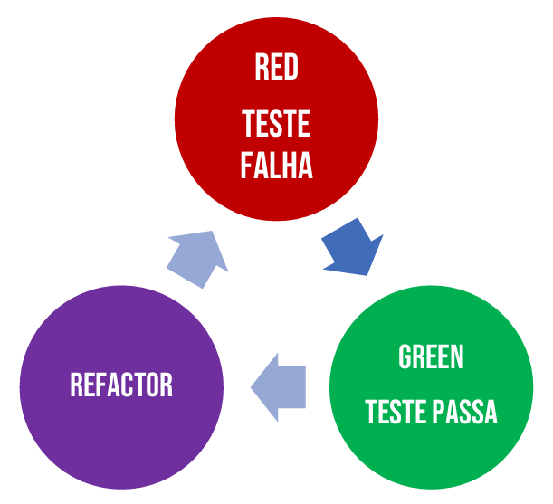

## Capítulo 11 – TDD, BDD, ATDD e DDD: Desenvolvimento de Software Guiado por Testes

Nos capítulos anteriores, navegamos por um vasto oceano de ferramentas e frameworks de teste, cada um com seu propósito específico. Agora, é o momento de darmos um passo atrás e compreendermos algumas das filosofias e metodologias de desenvolvimento que frequentemente andam de mãos dadas com a automação de testes e que influenciam profundamente como construímos software de alta qualidade: **TDD (Test-Driven Development), BDD (Behavior-Driven Development), ATDD (Acceptance Test-Driven Development) e DDD (Domain-Driven Design)**.

Estas não são apenas siglas da moda, mas sim abordagens estratégicas que visam melhorar a comunicação, o design do código e, em última análise, o valor entregue ao usuário. Embora cada uma tenha seu foco particular, todas compartilham o objetivo comum de criar software que seja robusto, compreensível e alinhado com as necessidades do negócio.

Neste capítulo, desvendaremos os princípios e práticas de cada uma dessas abordagens. Começaremos com o **TDD**, entendendo seu ciclo "Red-Green-Refactor" e como ele guia o desenvolvimento incremental. Em seguida, exploraremos o **BDD**, que estende o TDD ao enfatizar o comportamento do sistema a partir da perspectiva do usuário, utilizando uma linguagem ubíqua. Depois, abordaremos o **ATDD**, que foca na colaboração para definir testes de aceitação antes da implementação. Por fim, mergulharemos no **DDD**, uma abordagem para modelar software em torno do domínio do negócio, e como conceitos como "Naked Objects" se relacionam com ele. Prepare-se para uma jornada conceitual que conectará muitas das práticas de teste que vimos com as estratégias de desenvolvimento que as impulsionam.

### TDD – Desenvolvimento Orientado a Testes (Test-Driven Development)

O **Desenvolvimento Orientado a Testes (Test-Driven Development - TDD)** é uma abordagem disciplinada para o desenvolvimento de software onde o ciclo de escrita de testes e o desenvolvimento do código de produção são intercalados de forma muito próxima e incremental. A premissa central é que você não escreve nenhum código de produção antes de ter um teste automatizado que falhe para aquele código. Ou seja, o teste "dirige" o desenvolvimento.

  

O TDD foi popularizado como parte integral de metodologias ágeis, como o Extreme Programming (XP), mas seus princípios podem ser aplicados com sucesso também em processos de desenvolvimento mais tradicionais ou orientados a planos. A essência do TDD não é apenas testar, mas usar os testes como uma ferramenta de design e especificação.

Kent Beck, frequentemente considerado o "descobridor" ou popularizador da técnica, afirmou em 2003 que o TDD encoraja designs de código simples e inspira confiança nos desenvolvedores. É uma técnica que se relaciona intimamente com os conceitos de verificação e validação contínuas.

#### O Ciclo Clássico do TDD: Red-Green-Refactor

O TDD é caracterizado por um ciclo curto e repetitivo, conhecido como "Red-Green-Refactor":

  

1. **Red (Vermelho)**: O ciclo começa com a escrita de um **teste automatizado** para uma pequena funcionalidade ou melhoria desejada que ainda não foi implementada. Como o código de produção ainda não existe (ou não atende ao novo requisito), este teste deve, obrigatoriamente, **falhar** quando executado. A falha é indicada (frequentemente por uma barra vermelha em ferramentas de teste) e é um sinal positivo, pois confirma que o teste está verificando a condição correta e que a funcionalidade ainda precisa ser desenvolvida.
2. **Green (Verde)**: O próximo passo é escrever a **quantidade mínima de código de produção** necessária para fazer com que o teste que falhou (e todos os outros testes existentes) passe. Neste estágio, o foco é apenas fazer o teste passar; a elegância ou otimização do código não são a prioridade principal. O objetivo é alcançar a barra verde, indicando que a funcionalidade testada agora está implementada corretamente conforme especificado pelo teste.
3. **Refactor (Refatorar)**: Com os testes passando (luz verde), o desenvolvedor agora tem a segurança para **refatorar** o código de produção que acabou de escrever, e também, se necessário, o próprio código de teste. Refatorar significa melhorar a estrutura interna do código sem alterar seu comportamento externo. Isso pode envolver eliminar redundâncias, melhorar a clareza dos nomes, simplificar a lógica, aplicar padrões de design, etc.. Após cada pequena refatoração, os testes são executados novamente para garantir que nenhuma funcionalidade foi quebrada.

Este ciclo é repetido para cada pequena funcionalidade, levando a um desenvolvimento incremental e contínuo, onde o software está sempre em um estado funcional e bem testado.

#### Aprofundando o Ciclo de Vida do TDD

Vamos detalhar um pouco mais as etapas e considerações dentro do ciclo TDD:

1. **Adicionar um Teste**:
    - A implementação de um novo recurso ou a correção de um bug começa com a escrita de um teste que passará somente se as especificações desse recurso forem atendidas.
    - O desenvolvedor define essas especificações frequentemente através da análise de casos de uso, histórias de usuário ou requisitos funcionais.
    - Um benefício crucial aqui é que o TDD força o desenvolvedor a pensar sobre os requisitos e o comportamento esperado _antes_ de escrever qualquer linha de código de produção. Isso contrasta com a prática mais comum onde os testes unitários são escritos _após_ o código já estar pronto, muitas vezes como uma reflexão tardia.

2. **Executar Todos os Testes (e Ver o Novo Teste Falhar)**:
    - Após escrever o novo teste, toda a suíte de testes é executada. O novo teste deve falhar pelos motivos esperados (geralmente porque a funcionalidade ainda não existe).
    - Esta etapa é vital:
        - Ela confirma que o novo teste não é trivialmente falho e que ele realmente passaria se a funcionalidade estivesse implementada (ou seja, o teste não é um "falso positivo" que sempre passa).
        - Valida que o "chicote de teste" (o ambiente e as ferramentas de execução de teste) está funcionando corretamente.
        - Prova que o novo código que será escrito é, de fato, necessário para satisfazer o requisito.

3. **Escrever o Código de Produção Mínimo**:
    - O desenvolvedor então escreve a menor quantidade de código de produção possível que faça o novo teste (e todos os testes anteriores) passar.
    - Neste momento, código que pode parecer "feio" ou subótimo é aceitável, desde que funcione e passe nos testes. A melhoria virá na etapa de refatoração.
    - É fundamental não adicionar nenhuma funcionalidade além daquela que está sendo especificamente testada pelo teste atual.

4. **Executar Todos os Testes Novamente (e Ver Todos Passarem)**:
    - Após escrever o código de produção, todos os testes são executados novamente. Agora, todos eles devem passar.
    - Se algum teste falhar, o código recém-escrito deve ser revisado e corrigido até que todos os testes passem.
    - Isso garante que a nova funcionalidade atende aos requisitos do teste e, crucialmente, que não quebrou nenhuma funcionalidade existente que já era coberta por testes anteriores.

5. **Refatorar o Código**:
    - Com a segurança de uma suíte de testes passando, o código pode ser refatorado para melhorar sua legibilidade, manutenibilidade e design geral.
    - Exemplos de refatoração incluem:
        - Mover código para onde ele pertence logicamente (melhorando a coesão e o acoplamento).
        - Remover código duplicado (princípio DRY - Don't Repeat Yourself).
        - Tornar nomes de variáveis, métodos e classes auto-documentáveis e claras.
        - Dividir métodos longos e complexos em pedaços menores e mais gerenciáveis.
        - Reorganizar hierarquias de herança ou composição para melhor representar as relações entre os objetos.
        - Remover dados de teste "hardcoded" ou valores mágicos, substituindo-os por constantes ou configurações mais flexíveis.
    - Após cada pequena refatoração, é importante executar novamente o conjunto de testes para garantir que nenhuma funcionalidade existente foi inadvertidamente quebrada.

Este ciclo de "Red-Green-Refactor" é repetido para cada nova pequena funcionalidade ou correção. Os testes devem ser pequenos e focados, e os commits no sistema de controle de versão devem ser frequentes. Se, após adicionar um novo código, os testes começarem a falhar de forma inesperada, essa abordagem de pequenos incrementos e commits frequentes permite ao programador reverter facilmente para um estado estável anterior, em vez de se envolver em sessões de depuração longas e complexas.

Ao trabalhar com bibliotecas externas, é importante não escrever testes que sejam tão granulares a ponto de estarem, na verdade, testando a própria biblioteca. O foco deve ser testar a _sua_ integração e uso da biblioteca, a menos que haja uma razão específica para suspeitar de bugs na biblioteca ou que ela não atenda completamente aos seus requisitos.

#### Ferramentas e Pré-requisitos para o TDD

Um ambiente de teste automatizado é essencial para a prática eficaz do TDD. Frameworks como o JUnit (para Java), que vimos no Capítulo 2, são exemplos de ferramentas que suportam a criação e execução rápida de testes. Como o desenvolvimento ocorre em incrementos muito pequenos, a capacidade de executar todos os testes rapidamente (idealmente em segundos) sempre que uma nova funcionalidade é adicionada ou uma refatoração é feita é crucial. Portanto, os testes são geralmente incorporados em um programa ou script separado que executa os testes e interage com o sistema sob teste.

Para escrever um teste eficaz, o desenvolvedor precisa ter um entendimento claro do que a funcionalidade pretendida deve fazer. Se esse entendimento estiver incompleto ou incorreto, o TDD por si só não resolverá o problema; o teste refletirá essa má compreensão.

#### Benefícios do TDD

Um dos benefícios mais significativos do TDD é a drástica **redução nos custos dos testes de regressão**. Teste de regressão é o processo de reexecutar testes que já passaram anteriormente para garantir que as alterações recentes no sistema não introduziram novos bugs ou quebraram funcionalidades existentes.

Quando os testes são predominantemente manuais, o teste de regressão pode ser extremamente caro e demorado, tornando-se muitas vezes impraticável executá-lo completamente a cada pequena mudança. Nesses cenários, as equipes podem ser forçadas a selecionar um subconjunto de testes para reexecutar, correndo o risco de deixar passar regressões importantes.

No entanto, com os testes automatizados que são o cerne do TDD, os custos de regressão são drasticamente reduzidos. A suíte de testes existente pode ser executada de forma rápida e barata quantas vezes forem necessárias. Após qualquer alteração no sistema, todos os testes devem passar antes que qualquer nova funcionalidade seja adicionada, dando ao programador uma alta confiança de que as mudanças não tiveram efeitos colaterais indesejados no código existente.

Outros benefícios incluem:

- **Feedback Rápido**: Os desenvolvedores recebem feedback quase imediato sobre suas alterações.
- **Design Melhorado**: Escrever testes primeiro frequentemente leva a um design de código mais modular, com baixo acoplamento e alta coesão, pois o código precisa ser "testável".
- **Documentação Viva**: Os testes servem como uma forma de documentação executável que descreve como o sistema deve se comportar.
- **Menos Depuração**: Como os erros são pegos cedo e em pequenos incrementos, o tempo gasto em depuração complexa é geralmente reduzido.
- **Confiança para Refatorar**: A suíte de testes abrangente atua como uma rede de segurança, permitindo que os desenvolvedores refatorem o código com mais confiança.

#### Limitações do TDD

Embora poderoso, o TDD não é uma bala de prata e possui algumas limitações:

- É mais comumente usado e talvez mais eficaz no desenvolvimento de **novos softwares**, onde a funcionalidade é implementada em código novo ou utilizando bibliotecas padrão já bem testadas.
- Ao lidar com a reutilização de **grandes componentes de código legado** ou sistemas existentes, pode ser necessário escrever testes para esses sistemas como um todo antes que o TDD possa ser aplicado efetivamente em novas partes que interagem com eles.
- O TDD pode ser **ineficaz ou mais complexo com sistemas multithreaded**. A natureza não determinística da intercalação de threads pode fazer com que os testes produzam resultados diferentes em execuções diferentes, mesmo sem alterações no código, tornando os testes "flaky" (instáveis).

Apesar dessas limitações, o TDD continua sendo uma prática fundamental para muitas equipes que buscam alta qualidade e agilidade no desenvolvimento de software.

### BDD – Desenvolvimento Orientado a Comportamento (Behavior-Driven Development)

O **Desenvolvimento Orientado a Comportamento (Behavior-Driven Development - BDD)** é uma técnica de desenvolvimento ágil que evoluiu a partir do TDD, com o objetivo de melhorar a comunicação e a colaboração entre desenvolvedores, especialistas em qualidade (QAs) e as partes interessadas do negócio (pessoas não técnicas). Concebido originalmente por Dan North em 2003, o BDD surgiu como uma resposta a alguns dos desafios percebidos no TDD, especialmente em relação à clareza do propósito dos testes e à sua conexão com os requisitos de negócio.

O foco principal do BDD está na **linguagem e nas interações** usadas durante todo o processo de desenvolvimento de software. Ele incentiva as equipes a usar conversas e exemplos concretos do mundo real para formalizar um entendimento compartilhado de como a aplicação deve se comportar do ponto de vista do usuário e do negócio.

#### Princípios Chave do BDD

O BDD se baseia em alguns princípios fundamentais:

- **Colaboração Multifuncional**: O BDD promove a colaboração estreita entre todas as funções envolvidas no projeto (negócios, desenvolvimento, teste) para construir um entendimento compartilhado do problema a ser resolvido e da solução desejada.
- **Linguagem Ubíqua (Ubiquitous Language)**: As equipes utilizam uma linguagem comum, derivada do domínio do negócio, para descrever o comportamento do sistema. Essa linguagem é usada tanto nas conversas quanto nas especificações de teste (frequentemente escritas em Gherkin, como vimos no Capítulo 9 com o Cucumber). Isso minimiza mal-entendidos e traduções entre a linguagem técnica do código e a linguagem do negócio.
- **Foco no Comportamento, Não na Implementação**: Os testes BDD descrevem _o que_ o sistema faz e _por que_ (o valor de negócio), em vez de _como_ ele faz (detalhes de implementação).
- **Exemplos Concretos**: O comportamento é especificado através de exemplos concretos e realistas que ilustram como o sistema deve responder a determinadas entradas ou eventos.
- **Documentação Viva**: As especificações BDD, por serem executáveis, servem como uma documentação viva e sempre atualizada do comportamento do sistema.
- **Iterações Rápidas**: O BDD incentiva o trabalho em iterações pequenas e rápidas, dividindo os problemas do usuário em pedaços gerenciáveis que podem fluir rapidamente pelo processo de desenvolvimento, aumentando o feedback e o fluxo de valor.

#### O Processo Iterativo do BDD

Essencialmente, a atividade diária de BDD pode ser vista como um processo iterativo de três etapas principais:

1. **Descobrir e Concordar (Discussão e Exemplos)**:
    - Comece com uma pequena mudança futura no sistema (por exemplo, uma história de usuário).
    - Reúna as partes interessadas (negócios, desenvolvedores, testadores) para discutir exemplos concretos da nova funcionalidade.
    - O objetivo é explorar, descobrir e concordar sobre os detalhes do que se espera que o sistema faça. Essas conversas são frequentemente chamadas de "Three Amigos" (representando as perspectivas de Negócios, Desenvolvimento e Teste).

2. **Formalizar e Automatizar (Documentar com Exemplos)**:
    - Documente os exemplos acordados de uma maneira que possa ser automatizada (por exemplo, usando Gherkin em um arquivo `.feature`).
    - Verifique se há concordância sobre essa documentação. Essas especificações se tornam a "fonte da verdade" para o comportamento esperado.

3. **Implementar e Verificar (Desenvolver Guiado por Comportamento)**:
    - Implemente o comportamento descrito por cada exemplo documentado.
    - Comece escrevendo um teste automatizado (baseado na especificação Gherkin) que inicialmente falhará.
    - Em seguida, escreva o código de produção necessário para fazer o teste passar.
    - Refatore o código conforme necessário.

A ideia é manter cada mudança pequena e iterar rapidamente, voltando um nível (para mais discussões e exemplos) sempre que mais informações forem necessárias. Cada vez que um novo exemplo é automatizado e implementado, algo de valor é adicionado ao sistema, e a equipe está pronta para responder ao feedback.

#### BDD vs. TDD: Uma Evolução "Outside-In"

O BDD é frequentemente descrito como uma evolução do TDD, mas com uma distinção importante: ele adota uma perspectiva **"outside-in"** (de fora para dentro).

- **TDD**, como vimos, é uma abordagem onde o desenvolvedor primeiro pensa sobre o que está prestes a escrever em termos de código, depois como testaria essa unidade de código, escreve o teste (que falha) e, em seguida, escreve o código de produção para fazer o teste passar. O TDD é excelente para garantir que os desenvolvedores escrevam testes automatizados e pensem sobre o design do código de duas perspectivas diferentes (implementação e teste).
- A "fraqueza" percebida do TDD puro, segundo alguns proponentes do BDD, é que os desenvolvedores podem acabar testando se o código funciona da maneira que _eles pretendem_ que funcione, em vez de testar se o código faz o que os _requisitos de negócio_ dizem que ele deve fazer.

É aqui que o BDD busca aprimorar, começando com uma compreensão clara do comportamento desejado do sistema do ponto de vista do usuário e do negócio, e usando essa compreensão para guiar o desenvolvimento. Os testes BDD são escritos na linguagem do domínio, tornando-os mais acessíveis e verificáveis pelas partes interessadas do negócio. A maioria das ferramentas de BDD (como Cucumber) gera relatórios em formato legível por humanos, o que reduz o risco de má interpretação dos requisitos. Ao revisar os requisitos, as equipes podem escrever testes "vazios" (cenários Gherkin sem step definitions implementados), que servem como uma declaração explícita de seu entendimento. Quando o analista de negócios revisa esse resultado, ele pode confirmar se os requisitos foram comunicados de forma eficaz.

#### Ferramentas e Linguagem Específica de Domínio (DSL)

A prática do BDD é amplamente facilitada pelo uso de ferramentas de software especializadas, como Cucumber, JBehave, SpecFlow, etc. Essas ferramentas permitem a escrita de especificações de comportamento em uma DSL simples, usando construções de linguagem natural (como o Gherkin). Embora essas ferramentas sejam frequentemente desenvolvidas para uso em projetos BDD, elas podem ser vistas como formas especializadas de ferramentas que também suportam o desenvolvimento orientado a testes. Elas servem para adicionar automação à linguagem ubíqua, que é um tema central do BDD.

O BDD é considerado uma prática técnica eficaz, especialmente quando o "espaço do problema" do negócio a ser resolvido é complexo. Ele ajuda as equipes de software a fechar a lacuna entre as "pessoas de negócios" e as "pessoas técnicas", promovendo um ambiente de desenvolvimento mais colaborativo e focado no valor.

### ATDD – Desenvolvimento Orientado a Testes de Aceitação (Acceptance Test-Driven Development)

O **Desenvolvimento Orientado a Testes de Aceitação (Acceptance Test-Driven Development - ATDD)** é outra abordagem intimamente relacionada ao TDD e BDD, com um foco particular na colaboração para definir os critérios de aceitação de uma funcionalidade _antes_ de sua implementação. Assim como o TDD, o ATDD envolve a escrita de testes antes do código, mas esses testes são definidos a um nível mais alto, representando a perspectiva do usuário e os critérios que determinarão se uma funcionalidade está "pronta" ou "aceita".

#### Colaboração dos "Três Amigos"

Uma característica central do ATDD é a colaboração entre membros da equipe com diferentes perspectivas: **cliente (ou seu representante), desenvolvimento e teste**. Essas discussões colaborativas para gerar os testes de aceitação são frequentemente chamadas de "Three Amigos" (Três Amigos), representando:

- **Cliente/Negócios**: Foca em "Qual problema estamos tentando resolver?" e o valor de negócio da funcionalidade.
- **Desenvolvimento**: Foca em "Como podemos resolver esse problema?" e as implicações técnicas.
- **Teste**: Foca em "E se...?" ou "Como podemos ter certeza de que isso funciona corretamente em várias situações?" e a testabilidade da solução.

Esses testes de aceitação são escritos do ponto de vista do usuário e servem como uma forma de **requisitos executáveis**, descrevendo como o sistema deve funcionar e, posteriormente, verificando se ele de fato funciona conforme o esperado. Em muitos casos, as equipes automatizam esses testes de aceitação. O objetivo principal do ATDD é capturar e formalizar os critérios de aceitação para as funcionalidades que estão sendo desenvolvidas.

#### ATDD vs. TDD

Embora relacionados, ATDD e TDD têm focos e propósitos distintos:

- **TDD** é primariamente uma **ferramenta do desenvolvedor**. Seu objetivo é ajudar a criar unidades de código bem escritas (funções, classes, módulos) que executem corretamente um conjunto específico de operações, com um forte foco no design interno do código.
- **ATDD** é primariamente uma **ferramenta de comunicação** entre o cliente, o desenvolvedor e o testador. Seu objetivo é garantir que os requisitos sejam bem definidos, compreendidos por todos e que o software resultante atenda a esses requisitos do ponto de vista do usuário.

Outras diferenças incluem:

- **Automação**: TDD requer automação de testes (testes unitários). ATDD não exige estritamente a automação dos testes de aceitação, embora a automação seja altamente benéfica, especialmente para testes de regressão.
- **Derivação de Testes**: Os testes unitários usados no TDD podem frequentemente ser derivados dos testes de aceitação do ATDD, pois as unidades de código implementam partes de um requisito maior.
- **Legibilidade**: Os testes ATDD devem ser legíveis e compreensíveis pelo cliente/usuário, pois eles representam seus critérios. Os testes TDD não têm essa exigência; eles podem ser mais técnicos.

#### Características dos Testes de Aceitação no ATDD

- **Visão Externa**: Os testes de aceitação fornecem uma visão externa do sistema, focando nos efeitos observáveis externamente, como a saída correta para uma entrada específica.
- **Mudanças de Estado e Interações**: Eles podem verificar como o estado de um objeto ou entidade muda (por exemplo, um pedido passando de "pago" para "enviado") ou como o sistema interage com interfaces externas (bancos de dados, serviços web).
- **Independentes de Implementação (Conceitualmente)**: Os testes de aceitação são geralmente definidos de forma independente da implementação técnica, embora sua automação possa depender dela.
- **Criados Antes da Codificação**: São desenvolvidos durante a análise de requisitos e antes do início da codificação, de forma colaborativa.
- **Linguagem Ubíqua**: Os testes são especificados usando termos do domínio de negócios, formando uma linguagem ubíqua compartilhada entre clientes, desenvolvedores e testadores.
- **Relação com Requisitos**: Existe uma forte interligação: um requisito sem um teste de aceitação pode não ser implementado corretamente; um teste de aceitação que não se refere a um requisito pode ser desnecessário; um teste de aceitação criado _após_ o início da implementação geralmente indica um novo requisito ou uma mudança de escopo.

#### ATDD em uma Estratégia Geral de Teste

Os testes de aceitação no ATDD são uma parte crucial de uma estratégia de teste abrangente, que também pode incluir:

- **Testes do Cliente**: Os próprios testes de aceitação que demonstram a intenção de negócio.
- **Testes de Componentes**: Testes de aceitação técnica, muitas vezes definidos por arquitetos, que especificam o comportamento de módulos maiores.
- **Testes de Unidade**: Criados por desenvolvedores (frequentemente usando TDD) para garantir código de fácil manutenção, muitas vezes derivados dos testes de aceitação.
- **Testes Multifuncionais**: Incluem testes de usabilidade, testes exploratórios, testes de propriedades não funcionais como escalabilidade e segurança.

O ATDD visa, portanto, alinhar o desenvolvimento com as expectativas do cliente desde o início, usando os testes de aceitação como um guia e um meio de comunicação constante, o que ajuda a evitar mal-entendidos e a produzir software que realmente satisfaça os requisitos reais de forma mais simples e clara.

### DDD – Design Orientado a Domínio (Domain-Driven Design)

O **Design Orientado a Domínio (Domain-Driven Design - DDD)** é uma abordagem para o desenvolvimento de software complexo que coloca o foco principal no **domínio do negócio** para o qual o software está sendo construído. A premissa é que o software deve ser um reflexo fiel e útil desse domínio, incorporando seus conceitos, regras e processos centrais.

O desenvolvimento de software é frequentemente aplicado para automatizar processos existentes no mundo real ou para fornecer soluções para problemas de negócios concretos. O conjunto desses processos de negócios e problemas do mundo real constitui o **domínio** do software. É fundamental entender que o software se origina e está profundamente interligado a esse domínio.

#### A Importância do Modelo de Domínio

No DDD, um conceito central é o **modelo de domínio**. Este modelo não é apenas um diagrama, mas sim a ideia, o conhecimento estruturado e a abstração rigorosamente organizada do domínio do negócio. Ele é desenvolvido em colaboração com os **especialistas do domínio** (domain experts) – as pessoas que realmente entendem o negócio, como banqueiros para um sistema bancário, por exemplo. Sem um bom conhecimento do domínio, é improvável criar um software complexo que o sirva bem.

O software deve modelar o domínio, ou seja, incorporar os conceitos e elementos centrais do domínio e representar com precisão as relações entre eles. Um código bem escrito dentro de um modelo de domínio deve ser tão claro que alguém sem conhecimento prévio do domínio possa aprender muito sobre ele apenas lendo o código. Um software que não está profundamente enraizado no seu domínio terá dificuldades em se adaptar às mudanças ao longo do tempo.

O processo de criação de um modelo de domínio é iterativo. Começa com o conhecimento bruto dos especialistas e, através de abstração e organização, evolui para um modelo mais claro e preciso. Como o mundo real é vasto e complexo, até mesmo um domínio específico pode ser demais para ser compreendido de uma só vez. Portanto, o modelo de domínio é uma **abstração seletiva**, focando nos aspectos mais relevantes e deixando de fora detalhes desnecessários para o problema em questão.

Um domínio geralmente é extenso e, para torná-lo gerenciável, o DDD frequentemente o divide em **subdomínios** menores e mais focados. O termo "domínio do problema" no DDD é usado para definir uma área funcional específica dentro de um contexto maior, como uma organização ou departamento.

#### Linguagem Ubíqua (Ubiquitous Language)

Para que o modelo de domínio seja eficaz e para que haja uma comunicação clara entre desenvolvedores e especialistas do domínio, o DDD enfatiza a criação e o uso de uma **Linguagem Ubíqua**. Esta é uma linguagem comum, composta por termos bem definidos que são extraídos do domínio do negócio. Essa linguagem deve ser usada por **todos** os envolvidos no processo de desenvolvimento de software – tanto nas conversas diárias quanto no próprio código (nomes de classes, métodos, variáveis, etc.). A linguagem ubíqua garante que todos compartilhem o mesmo entendimento dos conceitos do domínio.

#### Princípios da Orientação a Objetos no DDD

O DDD pode ser visto por alguns como um retorno às boas práticas da programação orientada a objetos (OO), que vão além de apenas classes, herança, polimorfismo e encapsulamento. A essência da OO, que o DDD abraça, inclui:

- **Alinhamento do Código com o Negócio**: O contato constante dos desenvolvedores com os especialistas do domínio é essencial (algo que os métodos ágeis também preconizam).
- **Favorecer Reutilização**: Blocos de construção bem definidos no modelo de domínio facilitam o aproveitamento de conceitos e código em diferentes partes do sistema.
- **Mínimo Acoplamento**: Um modelo de domínio bem organizado resulta em partes do sistema que interagem com baixo acoplamento e alta coesão, ou seja, com pouca dependência desnecessária entre módulos ou classes de conceitos distintos.
- **Independência da Tecnologia**: O DDD não foca primariamente na tecnologia, mas sim em entender as regras de negócio e como elas devem ser refletidas no código e no modelo de domínio. A escolha da tecnologia é importante, mas secundária à compreensão do domínio.

#### Metáfora da Fabricação de Carros

Para ilustrar a importância do design e do entendimento do "todo" antes da produção de "partes", podemos usar a metáfora da fabricação de carros. Os trabalhadores que produzem peças individuais podem ter uma visão limitada do carro inteiro, vendo-o apenas como uma coleção de peças que precisam se encaixar. No entanto, um bom carro começa com uma visão, especificações detalhadas e um extenso processo de design, que inclui a criação de modelos e testes para refinar o projeto até que ele reflita a visão original. Só então as peças são produzidas e montadas.

O desenvolvimento de software complexo é semelhante: não podemos simplesmente sentar e começar a digitar código sem um entendimento profundo do domínio e um modelo que o represente. Isso pode funcionar para casos triviais, mas não para sistemas complexos.

#### Naked Objects: Uma Arquitetura Orientada a Domínio

**Naked Objects** é um padrão de arquitetura de software que leva os princípios do design orientado a domínio a um extremo interessante, com foco na exposição direta dos objetos de domínio na interface do usuário. Ele é definido por três princípios principais:

1. **Toda a lógica de negócios deve ser encapsulada nos objetos de domínio**: Este é um forte compromisso com o encapsulamento, não exclusivo do Naked Objects, mas fundamental para ele.
2. **A interface do usuário (UI) deve ser uma representação direta dos objetos do domínio**: Todas as ações do usuário consistem em criar, recuperar ou invocar métodos diretamente nos objetos do domínio. Isso é uma interpretação de uma UI orientada a objetos.
3. **A UI deve ser criada de forma totalmente automática a partir das definições dos objetos do domínio**: Este é o aspecto inovador e distintivo do padrão. A UI não é codificada manualmente; ela é gerada (usando reflexão ou geração de código-fonte) com base na estrutura e nos métodos dos objetos de domínio.

O padrão Naked Objects foi formalmente descrito na tese de doutorado de Richard Pawson, que investigou suas inspirações, incluindo a interface de usuário mórfica. O primeiro framework open source completo a implementar o padrão foi também chamado de "Naked Objects". Mais recentemente, em 2021, Pawson anunciou que o mesmo padrão foi aplicado ao paradigma de programação funcional, criando uma variante chamada "Naked Functions".

A ideia por trás do Naked Objects é que, ao focar exclusivamente na escrita das classes de domínio principais em Java (ou outra linguagem), o framework cuida do restante da infraestrutura, incluindo a renderização da UI (seja um cliente rico ou HTML). Frameworks Naked Objects podem se integrar com ferramentas como FitNesse para testes de aceitação guiados por histórias de usuário. Uma vez desenvolvido, o aplicativo pode ser implantado em um runtime completo do Naked Objects ou integrado à infraestrutura de aplicativo existente da organização.

O design orientado por domínio (DDD) é sobre focar no que mais importa: o domínio principal do negócio. Usando princípios OO, você desenvolve um modelo de domínio que todos – especialistas de negócios e técnicos – podem entender. No entanto, aplicar os princípios DDD pode ser desafiador. Frameworks como o Naked Objects tentam simplificar esse processo, permitindo que as equipes construam aplicações Java (por exemplo) escrevendo apenas as classes de domínio principais, deixando que o framework lide com a infraestrutura e a UI.

### Considerações Finais

Neste capítulo, exploramos quatro abordagens cruciais que moldam o desenvolvimento de software moderno e a forma como integramos os testes nesse processo: TDD, BDD, ATDD e DDD. Vimos que o **TDD (Desenvolvimento Orientado a Testes)** estabelece um ciclo rigoroso de "Red-Green-Refactor", onde os testes unitários guiam o desenvolvimento incremental do código, promovendo designs simples e alta confiança.

O **BDD (Desenvolvimento Orientado a Comportamento)** evolui do TDD, colocando uma ênfase maior na colaboração e na definição do comportamento do sistema a partir da perspectiva do usuário, utilizando uma linguagem ubíqua e exemplos concretos para garantir um entendimento compartilhado entre todas as partes interessadas.

O **ATDD (Desenvolvimento Orientado a Testes de Aceitação)** foca na definição colaborativa de testes de aceitação antes da implementação, servindo como critérios claros para que uma funcionalidade seja considerada completa e alinhada com as expectativas do cliente.

Por fim, o **DDD (Design Orientado a Domínio)** nos lembra da importância de construir software que seja um reflexo profundo e preciso do domínio do negócio, utilizando modelos de domínio e uma linguagem ubíqua para lidar com a complexidade. Conceitos como "Naked Objects" ilustram como essa filosofia pode ser levada à arquitetura da aplicação.

Embora distintas em seus focos primários, essas metodologias frequentemente se complementam e compartilham o objetivo de produzir software de alta qualidade que atenda efetivamente às necessidades do negócio. A escolha e a aplicação dessas abordagens dependem do contexto do projeto, da cultura da equipe e dos desafios específicos a serem enfrentados. Compreender seus princípios fundamentais capacita as equipes a tomar decisões mais informadas sobre como construir e testar software de maneira mais eficaz e colaborativa.