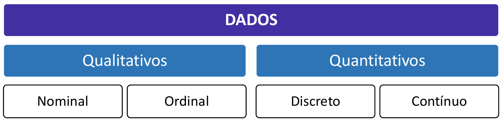
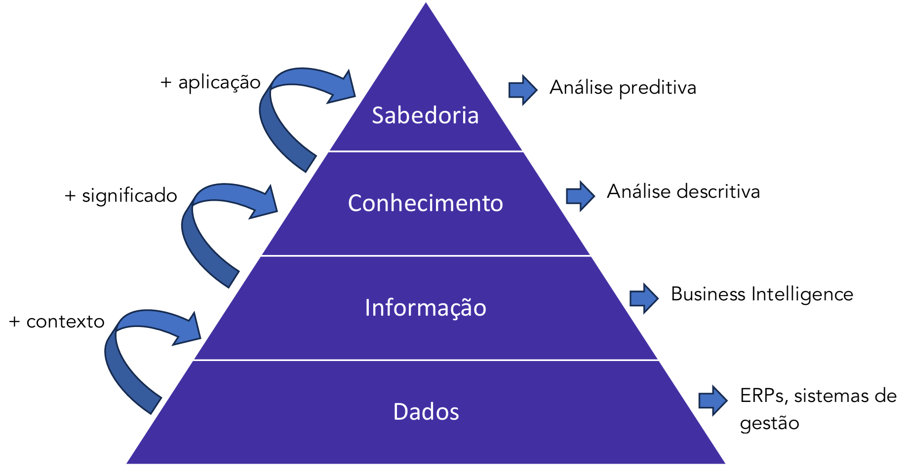
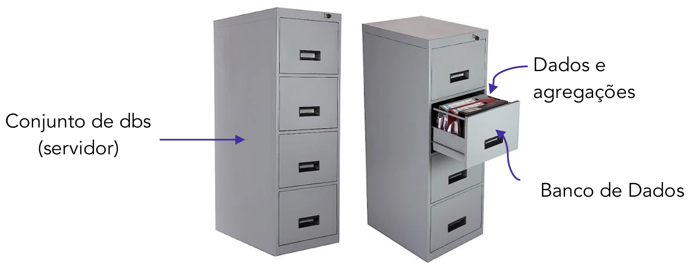
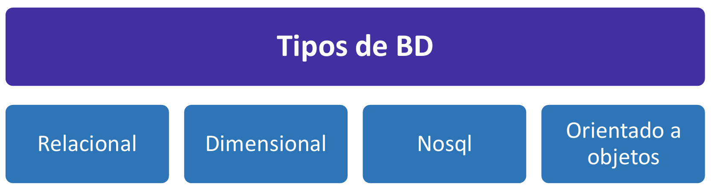
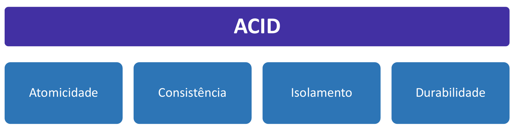
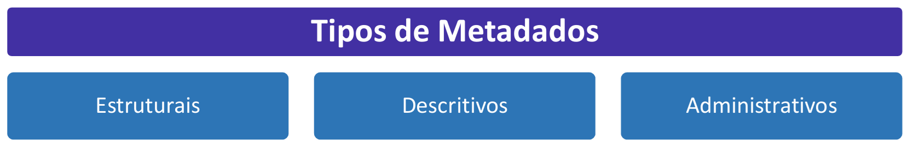
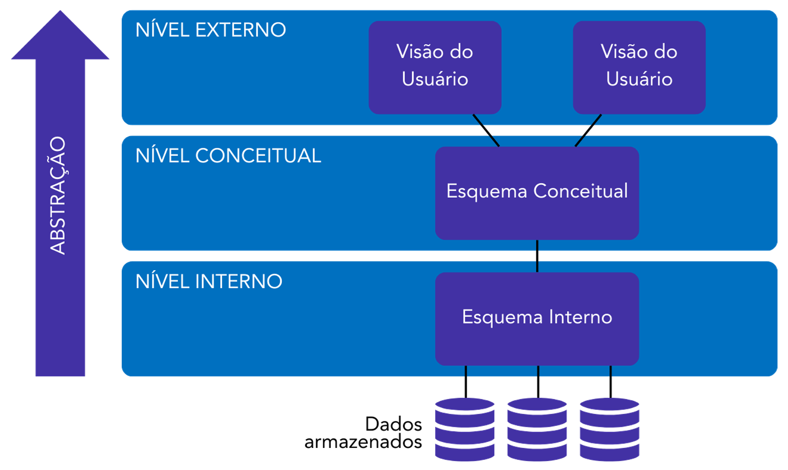
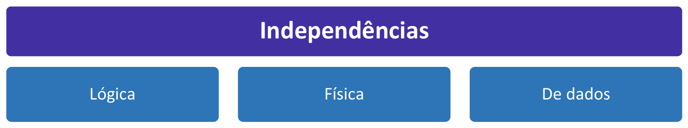
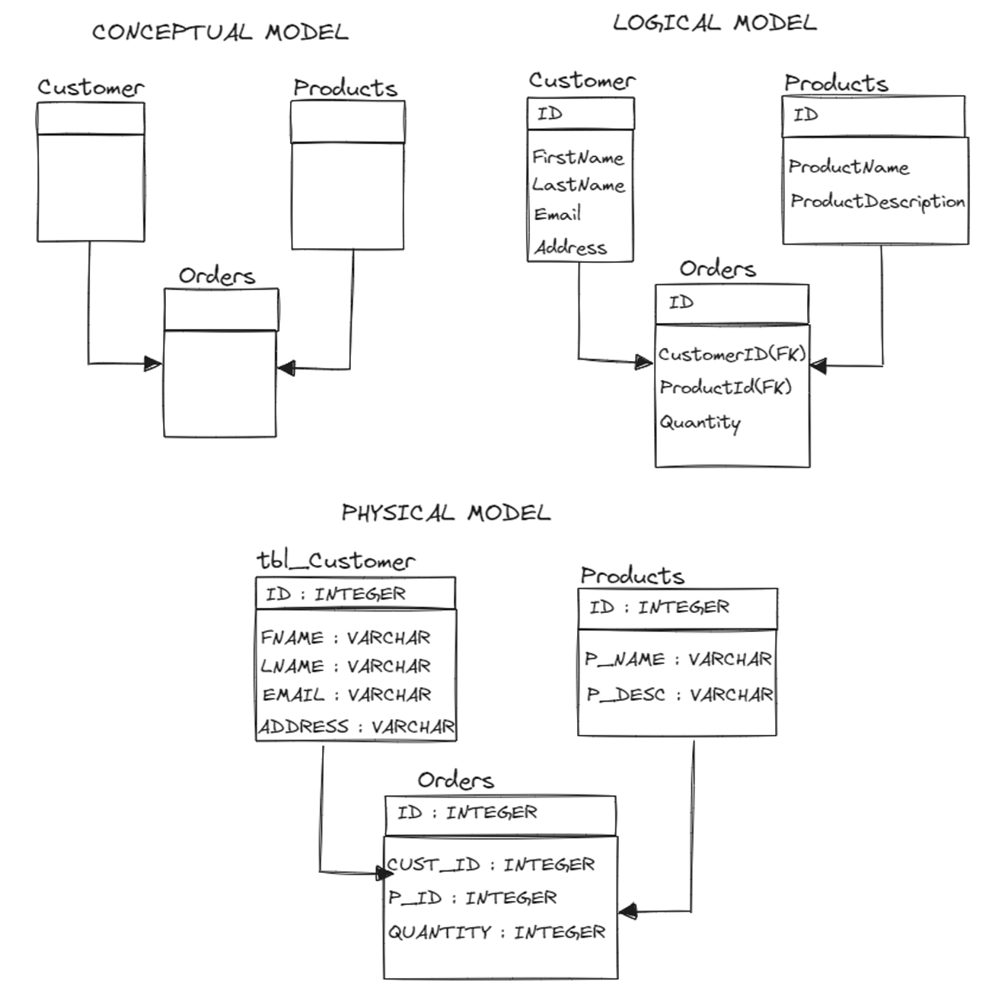
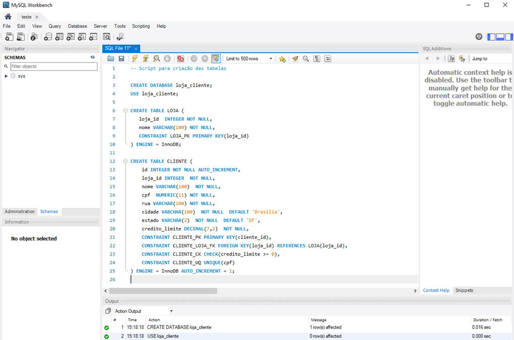

# Capítulo 1 – Fundamentos

Toda a jornada no universo da Tecnologia da Informação, desde a mais simples aplicação até os mais complexos sistemas de inteligência artificial, gira em torno de um elemento central: a manipulação e a análise de dados. Compreender o que são os dados, suas diferentes formas, naturezas e restrições é o alicerce sobre o qual todo o conhecimento em bancos de dados será construído. É o ponto de partida essencial para entendermos como organizar, armazenar e, principalmente, extrair valor das informações que moldam o mundo digital.

## O que são Dados?

No nível mais fundamental, **dados** são uma coleção de valores discretos ou contínuos que, em seu estado bruto, representam fatos, medições, observações ou descrições de algo. Podem ser números, textos, símbolos ou imagens que, isoladamente, podem não ter um significado completo. Por exemplo, o número `37` é um dado. A palavra `Recife` é um dado. A data `26/08/2025` é um dado.

Um conjunto de dados é tecnicamente chamado de _data_, enquanto uma unidade única de dado é referida como _datum_. Contudo, na prática cotidiana e na literatura técnica, o termo "dados" é universalmente utilizado tanto para o singular quanto para o plural.

É crucial, no entanto, distinguir **Dado** de **Informação**. A informação é o resultado do processamento, organização e contextualização dos dados, conferindo-lhes relevância e propósito.

- **Dado:** `37`
- **Informação:** A temperatura registrada em Recife hoje é de `37` graus Celsius.

Neste exemplo, o dado `37` foi contextualizado (temperatura, local, unidade de medida) para se tornar uma informação útil. O principal objetivo de um banco de dados é justamente organizar dados brutos de forma que possam ser facilmente transformados em informações valiosas.

## As Múltiplas Faces dos Dados: Formas de Classificação

Para que possamos trabalhar com os dados de maneira eficaz, precisamos primeiro classificá-los. Existem diversas formas de categorizar os dados, mas três delas são essenciais para o nosso estudo: a classificação quanto à sua **natureza** (o tipo de valor que representam), quanto à sua **estrutura** (a forma como são organizados) e quanto ao seu **nível de acesso** (as restrições de segurança impostas a eles).

### Classificação Quanto à Natureza (Tipo)

A primeira e mais comum forma de classificação diz respeito ao tipo de informação que o dado carrega. Aqui, a divisão se dá em duas grandes categorias: dados qualitativos e dados quantitativos.

- **Dados Qualitativos:** Como o nome sugere, são dados que descrevem uma **qualidade**, uma característica ou um atributo de algo. Eles não são medidos numericamente, mas sim categorizados. Respondem a perguntas como "de que tipo?" ou "qual a categoria?". Eles se subdividem em:
    - **Nominal:** Representa uma categoria que não possui uma ordem ou hierarquia intrínseca. Os valores são apenas rótulos. Exemplos incluem:
        - Cor de um carro (Vermelho, Azul, Prata)
        - Gênero (Masculino, Feminino, Não-binário)
        - Nacionalidade (Brasileiro, Argentino, Alemão)
        - Tipo sanguíneo (A+, O-, AB+)
    - **Ordinal:** Também representa uma categoria, mas, diferentemente do nominal, existe uma **ordem ou uma hierarquia lógica** entre os valores.
        - Nível de escolaridade (Ensino Fundamental, Ensino Médio, Ensino Superior)
        - Grau de satisfação de um cliente (Muito Insatisfeito, Insatisfeito, Neutro, Satisfeito, Muito Satisfeito)
        - Tamanho de uma peça de roupa (P, M, G, GG)
        - Classificação em uma competição (1º lugar, 2º lugar, 3º lugar)
- **Dados Quantitativos:** São dados que representam uma **quantidade** ou uma medida numérica. São o resultado de uma contagem ou de uma medição. Respondem a perguntas como "quanto?" ou "quantos?". Eles também se subdividem em:
    - **Discreto:** É um valor numérico que resulta de uma contagem, sendo, portanto, um número inteiro e finito. Não é possível ter "meio" valor.
        - Quantidade de alunos em um curso (ex: 45 alunos)
        - Número de páginas de um livro (ex: 320 páginas)
        - Total de produtos em estoque (ex: 1.500 unidades)
    - **Contínuo:** É um valor numérico que resulta de uma medição, podendo assumir qualquer valor dentro de um intervalo. Geralmente são representados por números decimais e podem ser infinitamente divididos.
        - Altura de uma pessoa (ex: 1.75m)
        - Velocidade de um veículo (ex: 82.5 km/h)
        - Temperatura de um ambiente (ex: 23.7 °C)
        - Peso de um objeto (ex: 4.68 kg)

A imagem a seguir ilustra essa hierarquia de classificação.

### Classificação Quanto ao Nível de Acesso

Em qualquer organização, nem todos os dados podem ser acessados por todas as pessoas. A segurança e a confidencialidade da informação são cruciais, e por isso os dados são classificados em níveis de restrição. A abordagem mais comum divide os dados em quatro categorias, formando uma escala crescente de sensibilidade.

- **Dados Públicos:** São dados sem qualquer tipo de restrição de confidencialidade. Podem e, muitas vezes, devem ser acessados por qualquer pessoa, dentro ou fora da organização. O vazamento deste tipo de dado não causa nenhum dano.
    - **Exemplos:** Endereços de filiais da empresa, notícias publicadas no site institucional, informações de produtos em um catálogo online, dados do censo do IBGE.
- **Dados Internos (ou de Uso Interno):** Possuem um baixo nível de confidencialidade. São dados que pertencem à organização e não devem ser compartilhados externamente, mas cujo vazamento acidental não representaria um grande impacto estratégico, financeiro ou legal. O acesso é geralmente permitido a todos os colaboradores da empresa.
    - **Exemplos:** Comunicados internos, lista de ramais, políticas de vestimenta, manuais de procedimentos gerais.
- **Dados Restritos:** Apresentam um nível intermediário de proteção. São informações consideradas importantes ou sensíveis, cujo acesso deve ser limitado a grupos específicos de pessoas ou departamentos que necessitam delas para realizar seu trabalho ("need-to-know basis"). Um vazamento poderia causar prejuízos financeiros ou de reputação.
    - **Exemplos:** Folha de pagamento, planejamento estratégico da empresa, informações de contato de clientes, relatórios de vendas.
- **Dados Confidenciais:** Representam o nível mais alto de proteção. São os ativos de informação mais críticos de uma organização. O acesso a esses dados é extremamente controlado e limitado a um número mínimo de pessoas autorizadas. Seu vazamento poderia comprometer gravemente a entidade, resultando em severos danos financeiros, legais, de reputação ou operacionais.
    - **Exemplos:** Segredos industriais (a fórmula de um produto), dados de cartão de crédito de clientes, prontuários médicos de pacientes, informações de segurança nacional.

### Classificação Quanto à Estrutura

Finalmente, podemos classificar os dados pela forma como são organizados e preparados para o processamento por sistemas computacionais.

- **Dados Estruturados:** São dados altamente organizados, que seguem um formato e um modelo de dados rígidos e bem definidos. Eles se encaixam perfeitamente em tabelas, com linhas e colunas, onde cada coluna tem um tipo de dado específico (número, texto, data, etc.) e cada linha representa um registro. São fáceis de armazenar, pesquisar e analisar.
    - **Exemplos:** Uma planilha do Excel, uma tabela de clientes em um banco de dados, informações de um sistema de ponto de funcionários.
- **Dados Não Estruturados:** São o oposto. Não possuem um modelo de dados predefinido ou uma estrutura organizacional fixa. Representam a grande maioria dos dados gerados no mundo hoje. São mais difíceis de processar e analisar por meios tradicionais.
    - **Exemplos:** O corpo de um e-mail, o conteúdo de um arquivo PDF ou de um documento do Word, uma imagem, um arquivo de áudio ou vídeo, uma postagem em uma rede social.

Existe ainda uma categoria intermediária, a de **dados semiestruturados**, que não se encaixam em tabelas rígidas, mas contêm tags ou marcadores para separar elementos semânticos e impor hierarquias. Exemplos clássicos são arquivos **JSON** e **XML**.

Como veremos ao longo desta apostila, os **dados estruturados** são o domínio principal dos bancos de dados relacionais (como MySQL, PostgreSQL), enquanto os **dados não estruturados** e **semiestruturados** são frequentemente gerenciados por bancos de dados NoSQL (como MongoDB, Cassandra).

## Dados Abertos: Transparência e Cidadania

Até agora, classificamos os dados por sua natureza, estrutura e nível de acesso dentro de uma organização. No entanto, existe uma categoria de dados cuja importância reside justamente na quebra de barreiras de acesso: os **Dados Abertos**. Este é um movimento global que defende que certos dados devem estar livremente disponíveis para que todos possam acessá-los, reutilizá-los e redistribuí-los, sem restrições.

A definição formal, consolidada pela Open Knowledge Foundation, estabelece que:

> Os dados são considerados abertos quando qualquer pessoa pode **acessar, usar, modificar e compartilhar livremente** para qualquer finalidade (sujeito a, no máximo, a requisitos que preservem a proveniência e a sua abertura).

Para que essa definição seja plenamente satisfeita, duas condições são essenciais: a publicação dos dados em **formato aberto** e sob uma **licença aberta**. Um formato aberto (como CSV, JSON, XML) garante que ninguém seja impedido de acessar os dados por precisar de um software específico ou proprietário. Uma licença aberta, por sua vez, concede permissão legal explícita para a sua livre reutilização.

No contexto governamental, a prática de Dados Abertos transforma-se em uma poderosa ferramenta para a democracia. Trata-se de uma metodologia para a publicação de dados do governo em formatos reutilizáveis, com o objetivo primordial de aumentar a transparência, fortalecer o controle social e fomentar uma maior participação política por parte dos cidadãos. No Brasil, diversos órgãos da Administração Pública já disponibilizam seus dados na web, não apenas na forma de relatórios estáticos, mas como conjuntos de dados brutos que podem ser processados e analisados. Isso permite que qualquer cidadão, jornalista, pesquisador ou empresa possa acompanhar os resultados das ações de governo de forma muito mais profunda.

Os efeitos dos dados abertos governamentais sobre as políticas públicas são vastos e podem ser compreendidos a partir de três pilares:

- **Inclusão:** Fornecer dados em formatos padronizados, abertos e acessíveis permite que qualquer cidadão, independentemente de seus recursos, possa utilizá-los. Um desenvolvedor pode criar um aplicativo que monitora os gastos com educação em seu município; um jornalista pode cruzar dados de saúde para investigar a eficácia de uma campanha de vacinação. A informação deixa de ser um privilégio.
- **Transparência:** A disponibilização de informações do setor público de forma aberta e acessível eleva o nível de transparência a um novo patamar. Não se trata mais apenas de publicar um resumo das contas públicas, mas de fornecer os dados detalhados que permitem a qualquer interessado auditar e verificar as informações por conta própria, usando as ferramentas que julgar mais adequadas.
- **Responsabilidade (Accountability):** Com acesso aos dados corretos, a sociedade pode construir diferentes visões sobre o desempenho do governo. É possível verificar se as metas de uma política pública foram cumpridas, comparar o desempenho de diferentes municípios em uma mesma área e, consequentemente, cobrar de forma mais eficaz a responsabilidade dos gestores públicos.

### A Política de Dados Abertos no Brasil

No âmbito federal, a gestão da Política de Dados Abertos é uma atribuição coordenada pela **Controladoria-Geral da União (CGU)**, por meio da **Infraestrutura Nacional de Dados Abertos (INDA)**, que é o portal centralizado para a busca e o acesso a esses dados.

A política foi instituída formalmente pelo **Decreto nº 8.777, de 11 de maio de 2016**. Este decreto estabelece as diretrizes para a disponibilização de dados abertos pelos órgãos e entidades da administração pública federal direta, autárquica e fundacional. Recomenda-se a leitura do decreto na íntegra, mas alguns pontos merecem destaque especial em nosso estudo.

O primeiro são os **objetivos** da política, que incluem reforçar a cultura da transparência, franquear o acesso aos dados para a sociedade, fomentar o controle social e promover o compartilhamento de recursos de tecnologia, buscando maior eficiência governamental.

O segundo ponto, e talvez o mais importante para o nosso contexto, são as **definições** que o decreto estabelece, criando um vocabulário comum e preciso para o tema.

|Conceito|Descrição|
|---|---|
|**Dado**|Sequência de símbolos ou valores, representados em qualquer meio, produzidos como resultado de um processo natural ou artificial.|
|**Dado Acessível ao Público**|Qualquer dado gerado ou acumulado pelo Governo que não esteja sob sigilo ou sob restrição de acesso nos termos da Lei nº 12.527, de 18 de novembro de 2011 (Lei de Acesso à Informação).|
|**Dados Abertos**|Dados acessíveis ao público, representados em meio digital, estruturados em **formato aberto**, **processáveis por máquina**, referenciados na internet e disponibilizados sob **licença aberta** que permita sua livre utilização, consumo ou cruzamento, limitando-se a creditar a autoria ou a fonte.|
|**Formato Aberto**|Formato de arquivo não proprietário, cuja especificação esteja documentada publicamente e seja de livre conhecimento e implementação, livre de patentes ou qualquer outra restrição legal quanto à sua utilização.|
|**Plano de Dados Abertos (PDA)**|Documento orientador para as ações de implementação e promoção de abertura de dados de cada órgão ou entidade da administração pública federal, obedecidos os padrões mínimos de qualidade, de forma a facilitar o entendimento e a reutilização das informações.|

### Os 8 Princípios dos Dados Abertos

Para guiar a implementação de políticas de dados abertos ao redor do mundo, um conjunto de princípios foi estabelecido. A lista a seguir, baseada na Open Government Data (OGD), detalha essas diretrizes fundamentais.

| Princípio                         | Descrição                                                                                                                                                                                                |
| --------------------------------- | -------------------------------------------------------------------------------------------------------------------------------------------------------------------------------------------------------- |
| **1. Completude**                 | Todos os dados públicos devem ser tornados disponíveis. Dados públicos são aqueles que não estão sujeitos a limitações de privacidade, segurança ou sigilo legal.                                        |
| **2. Primariedade**               | Os dados devem ser disponibilizados em sua forma bruta, como foram coletados na fonte, com o maior nível de detalhe (granularidade) possível, sem agregações ou modificações que possam ocultar nuances. |
| **3. Atualidade**                 | Os dados devem ser disponibilizados o mais rápido possível após sua coleta ou geração, garantindo que mantenham sua relevância e valor.                                                                  |
| **4. Acessibilidade**             | Os dados devem ser facilmente encontráveis e acessíveis para o maior número possível de usuários e para os mais variados propósitos.                                                                     |
| **5. Processáveis por Máquinas**  | Os dados devem ser estruturados de forma a permitir que computadores possam processá-los e analisá-los de forma automatizada (ex: em planilhas ou APIs, e não em imagens de tabelas ou PDFs).            |
| **6. Acesso Não Discriminatório** | Os dados devem estar disponíveis a todos, sem a necessidade de cadastro, identificação ou justificativa de uso.                                                                                          |
| **7. Formatos Não Proprietários** | Os dados devem ser disponibilizados em formatos sobre os quais nenhuma entidade tenha controle exclusivo, evitando a dependência de softwares específicos e caros.                                       |
| **8. Livres de Licenças**         | Os dados não devem estar sujeitos a direitos autorais, patentes ou outras restrições que impeçam sua reutilização. A única exigência aceitável é a de creditar a fonte original.                         |

## A Hierarquia do Valor: Da Pirâmide de Dados ao Conhecimento (DIKW)

Para compreender como os dados se transformam em ações estratégicas dentro de uma organização, utiliza-se um modelo hierárquico conhecido como **pirâmide DIKW** ou **pirâmide do conhecimento**. O acrônimo DIKW representa os quatro níveis da pirâmide, em inglês: **D**ata (Dados), **I**nformation (Informação), **K**nowledge (Conhecimento) e **W**isdom (Sabedoria). Em português, o modelo é por vezes chamado de DICS.

Essa abordagem estrutura a jornada evolutiva dos dados, mostrando como fatos brutos e isolados podem ser gradualmente refinados até se tornarem insights profundos que orientam decisões inteligentes. Conforme se avança para o topo da pirâmide, a complexidade, o valor e o nível de abstração aumentam, enquanto o volume de itens diminui. A base é composta por uma vasta quantidade de dados, mas o topo representa uma sabedoria concisa e de alto impacto.

Vamos detalhar cada um desses estágios.

#### Dados (A Base da Pirâmide)

Como já vimos, os dados são a matéria-prima. São fatos brutos, símbolos, números e registros sem um contexto imediato. Neste nível, os elementos são discretos e não organizados. Eles simplesmente existem.

- **Exemplo de Negócios:** Em um sistema de vendas, uma lista de registros como `["01/08/2025", "Cliente A", "Produto X", 10, "R$ 50,00"]` e `["01/08/2025", "Cliente B", "Produto Y", 5, "R$ 200,00"]` representa os dados brutos. São apenas os fatos registrados pelas transações.
- **Atividade Associada:** Os dados são tipicamente gerados e armazenados por **sistemas de gestão empresarial (ERPs)**, sistemas de ponto de venda (PDV), CRMs e outras ferramentas operacionais que registram as atividades do dia a dia.

#### Informação (Adicionando Contexto)

A informação surge quando o contexto é adicionado aos dados. É o primeiro nível de processamento, onde os dados são organizados, agrupados, classificados e estruturados para responder a perguntas básicas como "o quê?", "quem?", "quando?" e "onde?". A informação confere relevância aos dados brutos.

- **Fórmula:** `Dados + Contexto = Informação`
- **Exemplo de Negócios:** Ao processar os dados brutos do sistema de vendas, podemos gerar a seguinte informação: "No dia 1º de agosto de 2025, a empresa vendeu um total de R$ 700,00, sendo R$ 500,00 do Produto X e R$ 200,00 do Produto Y". Os dados foram agregados e contextualizados no tempo, gerando um relatório útil.
- **Atividade Associada:** Este é o domínio do **Business Intelligence (BI)**. Ferramentas de BI são utilizadas para conectar-se às fontes de dados, processá-los e apresentá-los em forma de relatórios, painéis (dashboards) e visualizações que permitem aos gestores entender o que aconteceu no negócio.

#### Conhecimento (Atribuindo Significado)

O conhecimento é o próximo passo na cadeia de valor. Ele emerge da análise da informação, da identificação de padrões, tendências e relações. Enquanto a informação nos diz "o que aconteceu", o conhecimento nos ajuda a entender "como" e "por que" aconteceu. O conhecimento é contextualizado e frequentemente atrelado à experiência da organização.

- **Fórmula:** `Informação + Significado = Conhecimento`
- **Exemplo de Negócios:** Analisando as informações de vendas ao longo de vários meses, a equipe pode chegar ao seguinte conhecimento: "O Produto X vende mais no início do mês, logo após o pagamento dos salários, enquanto o Produto Y tem um pico de vendas nos fins de semana. Além disso, a combinação da compra de X e Y pelo mesmo cliente é rara". Aqui, foram identificados padrões de consumo.
- **Atividade Associada:** Este nível envolve a **análise de dados descritiva**. Analistas utilizam técnicas estatísticas e de exploração de dados para "mergulhar" nas informações e extrair insights e aprendizados sobre o comportamento do negócio.

#### Sabedoria (Ação e Aplicação)

A sabedoria representa o topo da pirâmide. É a aplicação do conhecimento para tomar decisões eficazes e fazer previsões sobre o futuro. A sabedoria não está apenas em entender o passado (conhecimento), mas em usar esse entendimento para moldar o futuro. Ela está ligada à ação, ao julgamento e à estratégia.

- **Fórmula:** `Conhecimento + Aplicação = Sabedoria`
- **Exemplo de Negócios:** Com base no conhecimento adquirido, a gestão toma uma decisão estratégica: "Vamos criar uma campanha de marketing para o Produto X focada nos primeiros cinco dias do mês e oferecer um desconto especial na compra conjunta dos produtos X e Y nos fins de semana para incentivar a venda combinada. Devemos também ajustar o estoque para atender a esses picos de demanda". Isso é sabedoria em ação.
- **Atividade Associada:** Aqui entram as **análises preditivas** e prescritivas. Utilizando modelos mais avançados, é possível não apenas prever o que provavelmente acontecerá, mas também simular os resultados de diferentes ações, recomendando o melhor caminho a seguir.

Para solidificar o conceito, um exemplo mais simples do cotidiano pode ser útil. Imagine um semáforo:

- **Dado:** A luz está vermelha.
- **Informação (Dado + Contexto):** A luz do semáforo à minha frente, no cruzamento em que estou dirigindo, está vermelha.
- **Conhecimento (Informação + Significado):** Uma luz vermelha em um semáforo significa que devo parar o veículo, pois, caso contrário, estarei violando uma lei de trânsito e corro o risco de causar um acidente.
- **Sabedoria (Conhecimento + Aplicação):** Eu irei pisar no freio e parar o carro de forma segura antes da faixa de pedestres.

O esquema a seguir resume a interação entre os níveis da pirâmide, as transformações que ocorrem em cada etapa e as atividades empresariais correspondentes.

## A Estrutura dos Dados: Tipos e Domínios

Quando lidamos com dados em um ambiente estruturado, como o que encontraremos nos bancos de dados, a organização é a chave para a consistência e a confiabilidade. Não basta apenas armazenar os dados; é preciso garantir que eles sejam do tipo correto e que obedeçam a certas regras. Para isso, definimos **restrições de domínio** para os dados, mais conhecidas no dia a dia como **tipos de dados**.

O **domínio** de um atributo (ou de uma coluna em uma tabela, como veremos adiante) é o conjunto de todos os valores possíveis e permitidos para ele. Definir que o campo "Idade" é do tipo numérico e inteiro, por exemplo, é uma forma de restringir seu domínio, impedindo que textos como "vinte e cinco" ou números decimais como `25.5` sejam inseridos.

A definição de tipos de dados é crucial por três motivos principais:

1. **Integridade dos Dados:** Garante que apenas dados válidos sejam armazenados. Uma coluna de data não aceitará um texto inválido, e uma coluna de preço não aceitará caracteres não numéricos.
2. **Eficiência de Armazenamento:** O sistema de banco de dados otimiza o espaço em disco com base no tipo de dado. Um número inteiro pequeno (`TINYINT`) ocupa muito menos espaço do que um texto longo (`TEXT`).
3. **Otimização de Desempenho:** O motor do banco de dados pode realizar operações (cálculos, buscas, ordenações) de forma muito mais rápida quando conhece a natureza exata dos dados com os quais está trabalhando.

Embora existam dezenas de tipos de dados específicos para cada sistema de banco de dados, eles podem ser agrupados em cinco grandes categorias.

### Tipos Numéricos

São utilizados para armazenar valores numéricos sobre os quais operações matemáticas podem ser realizadas.

- **INT (ou INTEGER):** Representa números inteiros, positivos ou negativos, sem casas decimais. É ideal para contagens, quantidades e códigos de identificação. Dependendo do sistema, existem variações para otimizar o armazenamento:
    - **TINYINT:** Para inteiros muito pequenos (ex: idade, número de dependentes).
    - **SMALLINT:** Para inteiros pequenos (ex: ano de fabricação).
    - **BIGINT:** Para inteiros muito grandes (ex: população de um país, visualizações de um vídeo).
- **FLOAT e REAL:** Armazenam números com casas decimais, conhecidos como números de ponto flutuante. São úteis para medições científicas e cálculos onde uma pequena imprecisão de arredondamento é aceitável. A diferença entre `FLOAT` e `REAL` geralmente está na precisão (o número de dígitos que podem armazenar).
- **DECIMAL (ou NUMERIC):** É o tipo mais indicado para valores monetários e cálculos financeiros. Diferente do `FLOAT`, ele armazena números com precisão exata, evitando os erros de arredondamento que podem ocorrer com números de ponto flutuante. Geralmente é definido com a precisão e a escala (ex: `DECIMAL(10, 2)` para armazenar um número com até 10 dígitos no total, sendo 2 deles após a vírgula).

### Tipos de Data e Hora

Destinados a armazenar informações temporais.

- **DATE:** Armazena exclusivamente uma data, sem informação de horário. O formato padrão é `'YYYY-MM-DD'` (Ano-Mês-Dia). Exemplo: `'2025-12-25'`.
- **TIME:** Armazena exclusivamente um horário, sem informação de data. O formato padrão é `'HH:MM:SS'` (Hora:Minuto:Segundo). Exemplo: `'15:45:00'`.
- **DATETIME ou TIMESTAMP:** Combina data e hora em um único campo. É o tipo mais comum para registrar momentos exatos, como a data de um cadastro, uma data de publicação ou o momento de uma transação. Embora similares, `DATETIME` e `TIMESTAMP` podem ter diferenças sutis em como lidam com fusos horários, dependendo do sistema de banco de dados. Exemplo: `'2025-08-26 14:30:00'`.

### Tipos de Caractere (String)

Utilizados para armazenar texto.

- **CHAR:** Armazena uma cadeia de caracteres de **tamanho fixo**. Ao definir um campo como `CHAR(10)`, ele sempre ocupará 10 caracteres de espaço, mesmo que o texto inserido seja menor (o restante é preenchido com espaços). É ideal para dados que sempre têm o mesmo tamanho, como siglas de estados ('SP', 'RJ' - `CHAR(2)`) ou CEPs com formato fixo.
- **VARCHAR:** Armazena uma cadeia de caracteres de **tamanho variável**. Ao definir um campo como `VARCHAR(255)`, ele só ocupará o espaço do texto inserido mais um pequeno controle sobre o tamanho. É o tipo mais flexível e recomendado para a maioria dos dados textuais, como nomes, endereços, e-mails, etc.
- **TEXT:** Projetado para armazenar textos muito longos, que excedem o limite do `VARCHAR` (que geralmente é de milhares de caracteres). É ideal para guardar o conteúdo de um post de blog, a descrição de um produto, comentários de usuários, etc.

### Tipos de Caractere Unicode

São variações dos tipos de string, projetadas para garantir a compatibilidade com diferentes idiomas e conjuntos de caracteres. Enquanto os tipos `CHAR` e `VARCHAR` tradicionais podem ter limitações, os tipos Unicode (geralmente prefixados com `N`, de _National_) utilizam padrões como o UTF-8 para armazenar caracteres de praticamente qualquer língua do mundo (ex: "olá", "你好", "Здравствуйте").

- **NCHAR:** Versão Unicode do `CHAR` (tamanho fixo).
- **NVARCHAR:** Versão Unicode do `VARCHAR` (tamanho variável). É a escolha mais segura para aplicações que precisam ser multilíngues.
- **NTEXT:** Versão Unicode do `TEXT` (textos longos).

### Tipos Binários e Booleanos

Utilizados para armazenar dados binários e dados booleanos.

- **BINARY e VARBINARY:** Armazenam dados binários brutos (sequências de bytes) em vez de texto. A lógica fixo vs. variável é a mesma de `CHAR`/`VARCHAR`. São usados para guardar dados como uma pequena imagem, um arquivo de áudio, ou qualquer outro tipo de arquivo diretamente no banco de dados. Para arquivos maiores, o tipo **BLOB** (Binary Large Object) é mais comum.
- **BOOLEAN (ou BOOL, BIT):** Um tipo fundamental para armazenar valores de verdadeiro ou falso (`TRUE`/`FALSE`). É extremamente útil para campos que representam um estado binário, como "ativo/inativo", "pago/não pago", "lido/não lido".

A escolha correta do tipo de dado para cada campo de um banco de dados é um dos primeiros e mais importantes passos no design de um sistema eficiente e confiável. Essa decisão impactará diretamente o armazenamento, o desempenho e, acima de tudo, a integridade das informações que constituem o bem mais valioso de qualquer organização.

## Bancos de Dados

Após entendermos o que são os dados e como eles se transformam em sabedoria, chegamos ao elemento central que torna essa evolução possível em larga escala: o **banco de dados** (ou **DB**, da sigla em inglês _database_). Em sua essência, um banco de dados é uma coleção organizada de dados, armazenados e gerenciados eletronicamente em um sistema de computador.

Contudo, essa definição simples esconde sua verdadeira potência. Um banco de dados não é apenas um "depósito" de arquivos. É um sistema projetado para permitir que os dados sejam **armazenados, gerenciados, atualizados e recuperados** de maneira eficiente, segura e consistente. O objetivo final é transformar grandes volumes de dados brutos em informações úteis para o dia a dia de uma organização.

É importante fazer uma distinção técnica: o banco de dados é a coleção de dados em si. O software que utilizamos para interagir com ele (como MySQL, Oracle, PostgreSQL, etc.) é chamado de **Sistema de Gerenciamento de Banco de Dados (SGBD)**. Na prática, porém, é comum usarmos o termo "banco de dados" para nos referirmos ao conjunto (dados + SGBD).

Ao planejar a arquitetura de dados de uma empresa, é raro que exista apenas um único e monolítico banco de dados. O mais comum é ter um conjunto de bancos de dados distintos rodando em um mesmo sistema central, geralmente um **servidor**. Um servidor é um computador (ou um conjunto de computadores) de alta capacidade, cujo propósito é fornecer recursos, serviços ou dados a outros computadores (os _clientes_) através de uma rede.

Nesse ambiente, cada banco de dados no servidor é criado para atender a um propósito específico, agrupando dados por afinidade de assunto. Uma empresa pode, por exemplo, ter um banco de dados para o setor de **Recursos Humanos** (com dados de funcionários, salários, férias), outro para o **Financeiro** (contas a pagar e a receber, faturamento) e um terceiro para o **Marketing** (dados de clientes, campanhas, resultados).

### Uma Analogia: O Arquivo Organizado

Para visualizar essa estrutura, a melhor analogia é a de um armário de arquivos físico:

- **O Armário (Gabinete):** Representa o **servidor**, a estrutura física e lógica que contém todos os diferentes bancos de dados da organização.
- **Cada Gaveta:** Representa um **banco de dados** individual. Cada gaveta tem um propósito claro e definido. A gaveta "RH" só contém documentos de RH; a gaveta "Financeiro" só contém documentos financeiros.
- **As Pastas dentro da Gaveta:** Representam as **agregações de dados**. São as formas como agrupamos os dados relacionados dentro de um mesmo banco de dados. No tipo mais comum, o banco de dados relacional, essas "pastas" são as **tabelas**. Na gaveta "RH", poderíamos ter a pasta "Funcionários", a pasta "Cargos" e a pasta "Departamentos".
- **Os Arquivos (Fichas) dentro das Pastas:** Representam os **dados** propriamente ditos, os registros individuais. Dentro da pasta "Funcionários", cada ficha seria um funcionário específico, com seu nome, CPF, cargo, salário, etc.

Esses dados são intercambiáveis. Podemos pegar a "ficha" de um funcionário e associá-la a uma pasta de "Projetos" na gaveta de "Operações", criando uma relação entre as informações.

É fundamental reforçar: **um banco de dados deve ser organizado e ter um propósito específico**. Isso, porém, não significa que conterá sempre e apenas dados estruturados. Embora a organização seja um pilar, existem modelos de banco de dados projetados para lidar com dados não estruturados, como veremos mais à frente.

### Organização e Flexibilidade: O Papel do Esquema

Apesar de precisarem de organização, os bancos de dados não são estruturas completamente rígidas. Sua organização é definida por um **esquema** (_schema_), que funciona como a "planta baixa" ou o "blueprint" do banco de dados. O esquema descreve a estrutura, os tipos de dados de cada campo e as relações entre suas diferentes partes.

Contudo, esses esquemas são flexíveis e podem ser modificados ao longo do tempo para se adaptar a novas necessidades do negócio. Essa flexibilidade é garantida por regras de independência de dados. Como será detalhado em um capítulo futuro, a arquitetura de um banco de dados é geralmente separada em três níveis (externo, conceitual e interno), permitindo que um nível seja alterado sem impactar drasticamente os outros.

### As Operações Fundamentais: CRUD

Para que toda essa estrutura de armazenamento seja útil, precisamos de uma forma de interagir com os dados: inserindo novos registros, consultando os existentes, modificando-os quando necessário e removendo-os quando não são mais úteis.

Essas quatro operações básicas de manipulação de dados são a base de praticamente tudo o que fazemos em um banco de dados e são universalmente conhecidas pelo acrônimo **CRUD**:

- **CREATE (Criar):** É a operação de **inserir** um novo registro no banco de dados.
    - _Exemplo:_ Contratar um novo funcionário. Um novo registro com nome, CPF, cargo e salário é **criado** na tabela de funcionários.
- **READ (Ler):** É a operação de **recuperar** ou **consultar** dados que já existem no banco de dados.
    - _Exemplo:_ Buscar as informações de um funcionário específico pelo seu número de matrícula para verificar seu histórico de férias.
- **UPDATE (Atualizar):** É a operação de **modificar** um registro existente.
    - _Exemplo:_ Promover um funcionário. O registro desse funcionário é **atualizado** para refletir seu novo cargo e seu novo salário.
- **DELETE (Remover):** É a operação de **excluir** um registro do banco de dados.
    - _Exemplo:_ Desligar um funcionário da empresa. Seu registro é permanentemente **removido** da tabela de funcionários ativos.

Toda e qualquer interação mais complexa com um banco de dados, desde a emissão de um relatório de vendas até a finalização de uma compra em um site de e-commerce, é, em sua essência, uma combinação sofisticada dessas quatro operações fundamentais.

### Paradigmas de Bancos de Dados: Diferentes Formas de Organizar a Informação

Não existe um único tipo de banco de dados que seja a solução perfeita para todos os problemas. A escolha da tecnologia correta depende fundamentalmente da natureza dos dados a serem armazenados e das operações que serão realizadas sobre eles. Um sistema para processar transações financeiras em tempo real, por exemplo, tem necessidades muito diferentes de um sistema projetado para analisar terabytes de dados de redes sociais.

Esses diferentes modelos de organização, que definem a estrutura interna e a forma como os dados são armazenados e relacionados, são conhecidos como **paradigmas de banco de dados**. Podemos dividi-los em quatro grandes grupos que se destacam no mercado.

#### Bancos de Dados Relacionais

Este é o paradigma mais tradicional, maduro e amplamente utilizado no mundo. Bancos de dados relacionais organizam os dados em uma estrutura intuitiva de **tabelas**, que são compostas por **linhas** (registros) e **colunas** (atributos). A grande força desse modelo está na capacidade de estabelecer **relações** entre as tabelas por meio de chaves, garantindo a consistência e a integridade dos dados. A linguagem padrão para interagir com esses bancos de dados é a **SQL (Structured Query Language)**.

- **Principais Características:** Estrutura rígida (esquema predefinido), alta consistência, e conformidade com as propriedades ACID (Atomicidade, Consistência, Isolamento e Durabilidade), que garantem a confiabilidade das transações.
- **Casos de Uso:** Sistemas transacionais (bancos, e-commerces, ERPs), sistemas que exigem alta integridade referencial e consistência dos dados.
- **Exemplos de SGBDs:** MySQL, PostgreSQL, Oracle Database, Microsoft SQL Server, SQLite.

#### Bancos de Dados NoSQL

O termo **NoSQL** ("Not Only SQL" ou "Não Apenas SQL") não se refere a um único modelo, mas a uma vasta família de bancos de dados que surgiram como uma alternativa ao modelo relacional. Eles foram projetados para atender a necessidades modernas como escalabilidade massiva (distribuição em múltiplos servidores), alta performance e flexibilidade para lidar com dados **não estruturados ou semiestruturados**. Sua principal característica é a ausência de um esquema fixo.

Existem vários tipos de bancos de dados NoSQL:

- **Orientados a Documentos:** Armazenam dados em documentos flexíveis, como JSON ou BSON. Cada documento pode ter sua própria estrutura. (Ex: MongoDB, Couchbase).
- **Chave-Valor:** O modelo mais simples. Cada item é armazenado como um par de chave e valor. Extremamente rápido para leituras e escritas simples. (Ex: Redis, Amazon DynamoDB).
- **Orientados a Colunas:** Armazenam dados em colunas em vez de linhas, otimizando a leitura de grandes volumes de dados para análises. (Ex: Apache Cassandra, Apache HBase).
- **Orientados a Grafos:** Focados em armazenar dados e, principalmente, os relacionamentos entre eles. São ideais para representar redes complexas. (Ex: Neo4j, Amazon Neptune).

#### Bancos de Dados Dimensionais

Este paradigma não foi projetado para as operações do dia a dia (como cadastrar um cliente), mas sim para **análise de dados** em larga escala. São a espinha dorsal de sistemas de **Business Intelligence (BI)** e **Data Warehouses**. O modelo dimensional organiza os dados em uma estrutura otimizada para consultas analíticas complexas, conhecida como esquema em estrela (_star schema_) ou floco de neve (_snowflake schema_).

Nessa estrutura, temos **tabelas de fatos** (que contêm as métricas numéricas a serem analisadas, como `total_de_vendas` ou `quantidade_de_itens`) cercadas por **tabelas de dimensão** (que fornecem o contexto para a análise, como `Tempo`, `Produto`, `Localização` e `Cliente`). Isso permite que os analistas "fatiem e piquem" os dados, analisando as métricas sob diferentes perspectivas de forma muito rápida.

#### Bancos de Dados Orientados a Objetos

Este paradigma surgiu da necessidade de aproximar o mundo da programação orientada a objetos (com linguagens como Java, C++, Python) do mundo dos bancos de dados. Em vez de armazenar dados em tabelas, eles os armazenam na forma de **objetos**, exatamente como são representados na aplicação. Cada objeto pode conter tanto atributos (dados) quanto métodos (comportamentos).

A principal vantagem é a eliminação da chamada "barreira de impedância relacional-objeto", que é a complexidade de ter que "traduzir" objetos da aplicação para o formato de tabelas relacionais.

- **Principais Características:** Capacidade de lidar com estruturas de dados muito complexas e herdadas, persistência transparente de objetos.
- **Casos de Uso:** Aplicações de nicho com modelos de dados muito complexos, como sistemas de engenharia (CAD/CAM), simulações científicas e modelagem financeira avançada.

Cada uma dessas formas de organização dos bancos de dados, que define sua estrutura e como os dados são manipulados e relacionados, é, portanto, um **paradigma**. A escolha do paradigma correto é uma das decisões arquiteturais mais importantes no desenvolvimento de um sistema, influenciando diretamente seu desempenho, sua escalabilidade e sua capacidade de evoluir.

### Características Essenciais de um Banco de Dados

Para que uma coleção de dados seja, de fato, considerada um sistema de banco de dados robusto, ela precisa exibir um conjunto de características fundamentais que garantem sua eficiência, flexibilidade e confiabilidade. Não se trata apenas de armazenar dados, mas de fazê-lo de uma maneira inteligente e gerenciável. As quatro características essenciais são:

- Natureza de autodescrição
- Abstração de dados (ou Independência entre dados e aplicações)
- Suporte a múltiplas visões dos dados
- Suporte a transações concorrentes (multiusuário)

Vamos explorar cada uma delas em detalhe.

#### Natureza de Autodescrição

Um sistema de banco de dados moderno possui a notável capacidade de se **autodescrever**. Isso significa que, além de armazenar os dados do usuário (os dados operacionais), o banco de dados contém uma descrição completa de sua própria estrutura. Essa "descrição da descrição" é conhecida como **metadados**, ou "dados sobre os dados".

Os metadados incluem informações como:

- Os nomes de todas as tabelas no banco de dados.
- Os nomes e os tipos de dados de cada coluna em cada tabela (ex: `nome_cliente` é um `VARCHAR(100)`, `data_nascimento` é um `DATE`).
- As restrições de integridade (ex: a coluna `cpf` não pode ter valores duplicados).
- Os relacionamentos entre as tabelas (ex: a tabela `Pedidos` está ligada à tabela `Clientes`).
- Informações sobre os usuários e seus privilégios de acesso.

Essa coleção de metadados é chamada de **catálogo do sistema** ou **dicionário de dados**. É graças a essa natureza de autodescrição que o SGBD (Sistema de Gerenciamento de Banco de Dados) pode interpretar e executar consultas sem que o programa de aplicação precise conhecer esses detalhes de antemão. O catálogo permite que o próprio sistema saiba como seus dados estão organizados.

#### Abstração de Dados

A abstração de dados, também conhecida como **independência entre dados e aplicações**, é um dos princípios mais poderosos da arquitetura de bancos de dados. Ela estabelece que a forma como os dados estão fisicamente armazenados no disco é completamente independente dos programas e aplicações que os acessam.

Em outras palavras, a coleção de dados (o banco de dados em si) é uma entidade separada do software que a opera (o SGBD) e das aplicações do usuário final. Isso cria uma camada de abstração que permite, por exemplo, que um administrador de banco de dados altere a forma como os dados são armazenados fisicamente (mudando de um disco rígido para um SSD, ou reorganizando os arquivos no servidor) sem que isso exija qualquer modificação no código do sistema de vendas ou do aplicativo que consome esses dados. Diferentes aplicações podem acessar o mesmo repositório de dados de forma consistente e padronizada, graças à mediação do SGBD.

#### Suporte a Múltiplas Visões

Um único banco de dados centralizado serve a múltiplos usuários e departamentos, cada um com suas próprias necessidades e permissões. Seria impraticável e inseguro expor todos os dados da empresa para todos os funcionários. Por isso, um sistema de banco de dados deve suportar **múltiplas visões** (_views_).

Uma visão é um subconjunto dinâmico do banco de dados, customizado para um usuário ou grupo de usuários específico. Ela funciona como uma "janela" virtual que filtra, combina e apresenta os dados de uma maneira particular, sem alterar os dados originais.

- **Exemplo:** Em um banco de dados de uma universidade, podemos ter:
    - **Visão do Aluno:** Permite que o aluno veja apenas suas próprias notas, suas disciplinas matriculadas e seus dados cadastrais.
    - **Visão do Professor:** Permite que o professor veja a lista de alunos de suas turmas e lance as notas apenas para eles.
    - **Visão do Financeiro:** Permite que o setor financeiro veja o status de pagamento das mensalidades de todos os alunos, mas sem acesso às suas notas.

As visões são essenciais tanto para a **segurança** (restringindo o acesso a informações sensíveis) quanto para a **simplificação** (ocultando a complexidade do banco de dados e mostrando a cada usuário apenas o que é relevante para seu trabalho).

#### Suporte a Múltiplas Transações (Concorrência)

Em qualquer sistema do mundo real, múltiplos usuários precisam acessar e, muitas vezes, modificar os mesmos dados ao mesmo tempo. Imagine um site de vendas de ingressos para um show: centenas de pessoas podem tentar comprar os mesmos assentos simultaneamente. Essa capacidade de lidar com acessos concorrentes é uma característica crucial de um banco de dados.

O sistema deve garantir que essas operações simultâneas não causem inconsistências ou corrompam os dados. Para isso, o SGBD gerencia o acesso por meio de **transações**. Uma transação é uma sequência de operações (leituras, escritas, atualizações) que deve ser executada como uma única unidade lógica e atômica: ou todas as operações da transação são concluídas com sucesso, ou nenhuma delas é.

O SGBD utiliza mecanismos de **controle de concorrência** (como o isolamento entre transações) para garantir que uma transação em andamento não interfira em outra. Isso garante que, mesmo em um ambiente com milhares de usuários, a integridade e a consistência dos dados sejam sempre preservadas.

#### Resumindo

| Característica                     | Descrição Resumida                                                                                                    |
| ---------------------------------- | --------------------------------------------------------------------------------------------------------------------- |
| **Natureza de Autodescrição**      | O banco de dados contém sua própria definição (metadados), permitindo que o sistema entenda sua própria estrutura.    |
| **Abstração de Dados**             | A estrutura física de armazenamento é independente das aplicações que acessam os dados, proporcionando flexibilidade. |
| **Suporte a Múltiplas Visões**     | Permite que diferentes usuários tenham visões personalizadas e seguras dos mesmos dados.                              |
| **Suporte a Múltiplas Transações** | Garante que múltiplos usuários possam acessar e modificar os dados simultaneamente de forma segura e consistente.     |

### A Garantia da Integridade: Transações e as Propriedades ACID

Na seção anterior, mencionamos que uma das características essenciais de um banco de dados é o suporte a múltiplas transações concorrentes. Mas o que é, exatamente, uma **transação**?

Uma transação consiste em uma ou mais operações de banco de dados que são agrupadas e tratadas como uma **única unidade de trabalho, lógica e indivisível**. O objetivo de uma transação é garantir a integridade e a consistência dos dados durante operações de modificação, como a inserção, atualização ou exclusão de registros.

A melhor maneira de entender isso é com um exemplo clássico: uma **transferência bancária**. Essa operação, que parece simples para o usuário, envolve pelo menos duas ações distintas no banco de dados:

1. Debitar (subtrair) o valor da conta de origem.
2. Creditar (adicionar) o mesmo valor à conta de destino.

Imagine o que aconteceria se o sistema falhasse após a primeira operação, mas antes da segunda. O dinheiro sairia da conta de origem, mas nunca chegaria à de destino, ficando perdido no "limbo" digital. Seria um desastre para a consistência do banco.

Para evitar esse e outros tipos de problemas, os bancos de dados transacionais (principalmente os relacionais) operam sob um conjunto de quatro princípios sagrados, conhecidos pelo acrônimo **ACID**.

Vamos analisar detalhadamente o que cada um desses princípios significa.

#### Atomicidade

A atomicidade garante que a transação é uma operação do tipo **"tudo ou nada"**. Assim como um átomo é (ou era considerado) a unidade indivisível da matéria, uma transação é a unidade indivisível do trabalho.

Isso significa que todas as operações dentro da transação devem ser concluídas com sucesso para que ela seja efetivada (_commit_). Se qualquer uma das operações falhar por qualquer motivo (seja um erro de sistema, uma queda de energia ou uma violação de regra), a transação inteira é desfeita (_rollback_), e o banco de dados retorna exatamente ao estado em que se encontrava antes de a transação começar.

- **No exemplo da transferência:** Se o débito da conta A for bem-sucedido, mas o crédito na conta B falhar, a atomicidade garante que o débito na conta A seja revertido. Para o banco de dados, é como se a operação nunca tivesse acontecido.

#### Consistência

A consistência assegura que uma transação sempre levará o banco de dados de um **estado válido para outro estado válido**. O sistema deve garantir que todas as regras e restrições de integridade definidas no banco de dados sejam respeitadas ao final da transação. Isso inclui:

- **Regras Estruturais:** Como o tipo de dado de uma coluna (não inserir texto em um campo numérico).
- **Regras de Negócio:** Como a restrição de que o saldo de uma conta não pode ficar negativo ou que o valor total de um pedido deve ser igual à soma de seus itens.
- **No exemplo da transferência:** A consistência garante que, se R$ 100 foram debitados da conta A, exatamente R$ 100 devem ser creditados na conta B. Se a transação terminasse com R$ 100 debitados e apenas R$ 90 creditados, o estado do banco de dados seria inválido (inconsistente), pois R$ 10 teriam desaparecido. A transação seria, portanto, abortada.

#### Isolamento

O isolamento garante que transações executadas de forma **concorrente (ao mesmo tempo) não interfiram umas nas outras**. Do ponto de vista de cada transação, é como se ela estivesse sendo executada sozinha no sistema, em uma "bolha" isolada. As alterações realizadas por uma transação em andamento não são visíveis para as outras até que ela seja concluída e efetivada.

Isso é fundamental para evitar problemas como "leituras sujas" (uma transação lê um dado que outra transação está modificando, mas que ainda não foi confirmado) ou "atualizações perdidas" (duas transações leem o mesmo valor e o atualizam, mas a segunda sobrescreve a alteração da primeira).

- **No exemplo da transferência:** Se duas pessoas tentam transferir R$ 300 de uma mesma conta de R$ 500 ao mesmo tempo, o isolamento impede que ambas leiam o saldo de R$ 500 e prossigam. O SGBD fará com que uma transação espere a outra terminar. A primeira será concluída, deixando o saldo em R$ 200. Quando a segunda for executada, ela lerá o novo saldo de R$ 200 e falhará por falta de fundos, mantendo a consistência.

#### Durabilidade

A durabilidade é a garantia de que, uma vez que uma transação tenha sido confirmada (_commit_), suas alterações são **permanentes e sobreviverão a qualquer falha subsequente do sistema**, como uma queda de energia, um erro de hardware ou uma reinicialização do servidor.

Isso é geralmente alcançado pelo SGBD escrevendo as alterações em um log de transações em um meio de armazenamento não volátil (como um disco rígido ou SSD) _antes_ de confirmar a operação para o usuário. Dessa forma, se o sistema falhar, ele pode usar esse log para restaurar o banco de dados ao seu último estado consistente no momento da reinicialização.

- **No exemplo da transferência:** Assim que o usuário recebe a mensagem "Transferência Concluída", a durabilidade garante que essa operação está permanentemente gravada. Mesmo que o servidor do banco desligue um segundo depois, a transferência não será desfeita.

#### Resumindo

| Característica   | Descrição Resumida                                                                                                    |
| ---------------- | --------------------------------------------------------------------------------------------------------------------- |
| **Atomicidade**  | Garante que todas as operações de uma transação sejam concluídas ou nenhuma delas seja. É o princípio "tudo ou nada". |
| **Consistência** | Assegura que a transação mantenha o banco de dados em um estado válido, respeitando todas as regras e restrições.     |
| **Isolamento**   | Permite que múltiplas transações ocorram simultaneamente sem interferir umas com as outras.                           |
| **Durabilidade** | Garante que, uma vez confirmada, uma transação se torna permanente e sobrevive a falhas do sistema.                   |

### Metadados e o Dicionário de Dados

Anteriormente, estabelecemos que uma das características essenciais de um banco de dados é a sua **natureza de autodescrição**. Essa capacidade é viabilizada por um componente fundamental chamado **metadado**.

De forma concisa, metadados são **"dados sobre os dados"**. Eles consistem em um conjunto de informações que descrevem as características, a estrutura, o conteúdo e o contexto dos dados principais. Pense em um livro: o texto nas páginas é o _dado_. As informações na capa e na folha de rosto — título, autor, editora, ano de publicação, número de páginas, ISBN — são os _metadados_. São eles que nos permitem entender, catalogar e encontrar o livro em uma biblioteca.

O conceito de metadado é universal e não se restringe a bancos de dados. Todo arquivo digital possui metadados:

- Uma **imagem** (arquivo JPEG) possui metadados sobre o modelo da câmera, a data e hora em que foi tirada, a resolução e até as coordenadas de GPS.
- Um **arquivo de áudio** (MP3) contém metadados sobre o nome do artista, o álbum, o número da faixa e o gênero musical.

Esses metadados podem estar embutidos no próprio arquivo ou, como é o caso dos sistemas de banco de dados, podem ser armazenados de forma centralizada em uma estrutura própria.

#### O Dicionário de Dados

Em um ambiente de banco de dados, o conjunto de metadados que descreve toda a estrutura, organização, restrições e conteúdo dos dados armazenados é organizado em um componente especial chamado **Dicionário de Dados** (ou, em muitos contextos, **Catálogo do Sistema**).

O Dicionário de Dados é o coração do SGBD. É um repositório centralizado que o próprio sistema consulta antes de realizar qualquer operação. Quando um usuário executa uma consulta para buscar informações de uma tabela, o SGBD primeiro acessa o Dicionário de Dados para:

- Verificar se a tabela e as colunas solicitadas realmente existem.
- Confirmar se o usuário tem permissão para acessar esses dados.
- Analisar os tipos de dados e os índices disponíveis para determinar a forma mais eficiente de executar a consulta.

É importante notar uma distinção que, embora sutil, é relevante:

- **Dicionário de Dados:** Refere-se classicamente ao conjunto de metadados que descreve o modelo e a estrutura do banco de dados.
- **Catálogo de Dados:** Em um contexto mais amplo de governança de dados, um Catálogo de Dados é um inventário de todos os ativos de dados de uma organização (que pode incluir múltiplos bancos de dados, planilhas, etc.), com foco em facilitar a descoberta, o entendimento e o uso desses dados pelos usuários de negócio.

#### Tipos de Metadados

Os metadados podem ser classificados de acordo com a função que desempenham. Segundo a NISO (_National Information Standards Organization_), uma das classificações mais aceitas os divide em três categorias principais:

- **Metadados Estruturais:** São os metadados que descrevem a arquitetura e a organização dos dados. Eles são a "planta baixa" do banco de dados, informando como os dados estão montados e relacionados.
    - **Exemplos em um banco de dados:** A definição de uma tabela (`CREATE TABLE...`), os nomes e tipos de dados de cada coluna (`ID INT`, `Nome VARCHAR(100)`), a definição de chaves primárias e estrangeiras que estabelecem os relacionamentos, e a estrutura de índices que otimizam as consultas.
- **Metadados Descritivos:** Descrevem o conteúdo intelectual do dado para facilitar sua descoberta, identificação e entendimento por parte dos usuários. Eles adicionam contexto e significado.
    - **Exemplos em um banco de dados:** Uma descrição textual associada a uma tabela ou coluna (ex: "A coluna `status_pedido` armazena o código da situação atual do pedido, onde 1=Pendente, 2=Pago, 3=Enviado"), palavras-chave para facilitar a busca em um catálogo de dados, ou a indicação do "dono" do dado (o departamento responsável por aquela informação).
- **Metadados Administrativos:** Fornecem informações relacionadas ao gerenciamento, ao uso e à preservação dos dados. Estão ligados a aspectos de segurança, controle e ciclo de vida da informação.
    - **Exemplos em um banco de dados:** As permissões de acesso que definem quais usuários podem ler ou modificar determinados dados (`GRANT SELECT ON...`), o histórico de alterações de um registro (logs de auditoria), as políticas de retenção (por quanto tempo um dado deve ser mantido) e as informações sobre o último backup realizado.

### A Arquitetura de Três Níveis: Organizando a Abstração

Em 1975, o comitê ANSI/SPARC propôs um modelo conceitual que se tornou a base para a arquitetura da grande maioria dos Sistemas de Gerenciamento de Banco de Dados (SGBDs) modernos. Conhecida como **arquitetura de três esquemas** ou **arquitetura de três níveis**, ela estrutura o sistema de banco de dados em camadas distintas de **abstração**.

A abstração, neste contexto, refere-se ao nível de detalhe com que os dados são apresentados. Quanto maior a abstração, menos detalhes técnicos são expostos; quanto menor a abstração, mais próximos estamos dos detalhes concretos de armazenamento.

- **Maior nível de detalhe = Menor abstração**
- **Menor nível de detalhe = Maior abstração**

O principal objetivo dessa arquitetura é separar a visão que os usuários têm dos dados da maneira como esses dados são fisicamente armazenados no disco. Isso é alcançado através de três níveis ou esquemas:

#### O Nível Externo (A Visão do Usuário)

Este é o nível de **mais alta abstração** e o mais próximo dos usuários finais e das aplicações. Ele não representa o banco de dados inteiro, mas sim **visões personalizadas** dos dados, que mostram a cada usuário apenas a porção do banco de dados que é relevante para suas tarefas e permissões. Um mesmo banco de dados pode ter múltiplas e variadas visões externas.

- **Exemplo em uma Universidade:**
    - **Visão do Aluno:** Um aluno acessa um portal e vê uma tela com suas disciplinas e notas. Essa visão é o nível externo dele.
    - **Visão do Professor:** O professor acessa o sistema e vê uma visão diferente, com a lista de suas turmas e os alunos matriculados em cada uma.
    - **Visão do Financeiro:** O setor financeiro tem uma visão que mostra o nome dos alunos e o status de suas mensalidades, mas não suas notas.

Essas visões ocultam toda a complexidade da estrutura interna, oferecendo uma interação simplificada e segura.

#### O Nível Conceitual (O Coração do Banco de Dados)

Este é o nível intermediário, que descreve a **estrutura lógica global de todo o banco de dados**. Ele funciona como um mapa unificado que representa todas as entidades (como Alunos, Professores, Disciplinas), os atributos de cada uma delas e os relacionamentos que existem entre elas.

O esquema conceitual é independente tanto do hardware de armazenamento quanto das visões específicas dos usuários. É neste nível que o Administrador do Banco de Dados (DBA) trabalha para modelar e definir a estrutura de dados da organização como um todo, utilizando modelos como o Entidade-Relacionamento (ER) ou o Relacional.

#### O Nível Interno (A Realidade Física)

Este é o nível de **mais baixa abstração**, também chamado de nível físico. Ele descreve **como os dados são fisicamente armazenados** nos dispositivos de armazenamento (discos rígidos, SSDs). Este esquema lida com os detalhes de baixo nível, como:

- A organização dos arquivos que compõem o banco de dados.
- As estruturas de dados utilizadas (como árvores B+ para os índices).
- As estratégias de acesso (como os dados são lidos do disco).

Este nível é de responsabilidade exclusiva do SGBD e é completamente transparente para os usuários e desenvolvedores de aplicações.

### O Poder da Independência: Lógica e Física

A grande vantagem da arquitetura de três níveis é que ela proporciona **independência de dados**. Isso significa que é possível modificar a definição de um esquema em um nível sem afetar o esquema no nível superior. Existem dois tipos principais de independência:

- **Independência Lógica:** É a capacidade de **alterar o esquema conceitual sem afetar os esquemas externos** (as aplicações dos usuários). Isso é extremamente poderoso. Por exemplo, o DBA pode decidir otimizar o banco de dados dividindo uma grande tabela de `Funcionários` em duas tabelas menores, `Dados_Pessoais` e `Dados_Profissionais`. Para a aplicação de RH que consome esses dados, nada muda. O SGBD se encarrega de reconstruir a visão original de "Funcionários" a partir das novas tabelas, e o código da aplicação não precisa ser alterado.
- **Independência Física:** É a capacidade de **alterar o esquema interno sem afetar o esquema conceitual**. Isso permite otimizar o desempenho sem que ninguém, além do DBA, precise saber. Por exemplo, o DBA pode decidir adicionar um novo índice a uma coluna para acelerar as consultas, ou migrar os arquivos do banco de dados para um novo disco SSD mais rápido. Essas são mudanças puramente físicas. O esquema conceitual (a definição das tabelas e relacionamentos) permanece o mesmo, e, consequentemente, nenhuma aplicação precisa ser modificada.

A **independência de dados** é, portanto, o objetivo final alcançado através da independência lógica e física, permitindo que o banco de dados evolua em sua estrutura interna e física sem quebrar as aplicações que dependem dele.

### Projeto de Banco de Dados

Assim como a construção de uma casa avança por diferentes estágios de projeto — do esboço arquitetônico inicial, passando pelo projeto estrutural, até o detalhado projeto executivo que guia a obra —, o desenvolvimento de um banco de dados também segue um processo de refinamento progressivo. Partimos de uma visão de alto nível, abstrata e focada nas regras de negócio, e gradualmente adicionamos detalhes técnicos até chegarmos à implementação física.

Notoriamente, esse processo é classificado em três grandes etapas, ou **três modelos de projeto**. É fundamental ter atenção neste ponto, pois os nomes podem gerar confusão com a arquitetura ANSI/SPARC que acabamos de estudar. A relação, no entanto, é direta e intencional. Cada modelo de projeto corresponde a um nível específico da arquitetura, representando a materialização daquele nível de abstração.

A correspondência se dá da seguinte forma:

|ARQUITETURA ANSI/SPARC|MODELO DE PROJETO|
|---|---|
|Nível Externo|**Modelo Conceitual**|
|Nível Conceitual|**Modelo Lógico**|
|Nível Interno|**Modelo Físico**|

Vamos analisar cada um desses modelos de projeto.

#### Modelo Conceitual ("O Quê?")

O projeto conceitual é o ponto de partida. Seu objetivo é capturar e representar os requisitos de dados de um negócio de uma forma clara, concisa e, acima de tudo, **compreensível para os usuários e stakeholders** — que, em geral, não são especialistas em tecnologia. Portanto, este modelo é desenvolvido na perspectiva do **nível externo** da arquitetura.

A principal característica do modelo conceitual é ser **completamente independente de tecnologia**. Ele não se preocupa com qual SGBD será usado, como os dados serão armazenados ou que linguagem de programação irá acessá-los. Seu foco é puramente em definir:

- As **entidades** principais do negócio (ex: `Cliente`, `Produto`, `Pedido`).
- Os **atributos** (características) de cada entidade (ex: um `Cliente` tem `Nome`, `CPF`, `Email`).
- Os **relacionamentos** entre as entidades (ex: um `Cliente` _faz_ um `Pedido`, um `Pedido` _contém_ `Produtos`).

A ferramenta mais comum para representar o modelo conceitual é o **MER (Modelo Entidade-Relacionamento)**, e sua representação gráfica é o **DER (Diagrama Entidade-Relacionamento)**. Este modelo nos oferece uma visão de altíssima abstração, servindo como uma ponte de comunicação entre a equipe técnica e a área de negócio para validar se a compreensão dos requisitos está correta.

#### Modelo Lógico ("Como?")

Uma vez que o modelo conceitual está definido e validado, o próximo passo é traduzi-lo para uma estrutura mais técnica: o modelo lógico. Este modelo representa como os dados serão estruturados **dentro de um paradigma de banco de dados específico**, como o modelo relacional. É aqui que o projeto começa a tomar a forma que terá dentro do SGBD, correspondendo ao **nível conceitual** da arquitetura ANSI/SPARC.

O processo de conversão do modelo conceitual para o lógico é chamado de **mapeamento**. Nesta fase:

- As entidades do MER são mapeadas para **tabelas**.
- Os atributos se tornam as **colunas** de cada tabela, com seus respectivos tipos de dados definidos (`INT`, `VARCHAR`, etc.).
- Os relacionamentos são implementados através de **chaves primárias** e **chaves estrangeiras**.
- São definidas as **restrições de integridade** para garantir a consistência dos dados.

O resultado do modelo lógico é, geralmente, um diagrama relacional que mostra as tabelas, suas colunas e como elas se conectam. Embora seja mais técnico que o conceitual, o modelo lógico ainda é, em grande parte, independente do SGBD específico (um modelo lógico relacional pode ser implementado em MySQL, PostgreSQL, etc., com pequenas adaptações).

#### Modelo Físico ("Onde?")

O modelo físico é a etapa final e mais detalhada do projeto. Ele traduz o modelo lógico em uma **implementação concreta e específica** para o SGBD e o ambiente de hardware escolhidos. Este modelo corresponde ao **nível interno** da arquitetura, lidando com os detalhes de como os dados serão fisicamente armazenados para otimizar o desempenho, a segurança e o uso de recursos.

Nesta fase, são tomadas decisões puramente técnicas, como:

- A definição exata das estruturas de armazenamento, como a forma que os arquivos de dados serão organizados no disco.
- A criação de **índices** em colunas específicas para acelerar as consultas.
- A configuração de **particionamento** de tabelas muito grandes para melhorar o gerenciamento e a performance.
- A alocação de espaço de armazenamento e outras configurações específicas do SGBD.

O modelo físico é, portanto, totalmente dependente da plataforma. Um modelo físico projetado para um servidor Oracle em um ambiente Linux será diferente de um projetado para o Microsoft SQL Server em um ambiente Windows. É o projeto executivo final que guia a criação e a configuração do banco de dados no mundo real.

### Resumindo as Etapas do Projeto: Uma Análise Comparativa

A distinção entre os modelos conceitual, lógico и físico pode, por vezes, parecer sutil, mas é fundamental para um projeto de banco de dados bem-sucedido. Para facilitar a identificação das suas diferenças e papéis, vamos analisar suas características de forma comparativa.

A tabela a seguir resume os principais aspectos de cada modelo de projeto:

|Característica|Modelo Conceitual|Modelo Lógico|Modelo Físico|
|---|---|---|---|
|**Objetivo**|Representar os dados e suas relações de forma abstrata, compreensível para usuários e desenvolvedores.|Detalhar a estrutura dos dados com base no paradigma escolhido (ex: relacional).|Implementar o modelo lógico em um SGBD específico, considerando restrições físicas e técnicas.|
|**Detalhamento**|Alto nível, focado nos requisitos de negócio, sem preocupações com implementação.|Médio nível, define tabelas, atributos, tipos de dados e relacionamentos (chaves).|Baixo nível, inclui tabelas físicas, índices, partições e configurações de armazenamento.|
|**Elementos Principais**|Entidades, atributos e relacionamentos.|Tabelas, colunas, chaves primárias, chaves estrangeiras, normalização.|Arquivos, índices, estruturas de armazenamento, alocação de memória e otimizações.|
|**Foco**|Compreensão dos dados e das regras de negócio.|Organização lógica dos dados para implementação em um SGBD.|Eficiência no acesso e armazenamento físico dos dados no hardware.|
|**Ferramentas**|Diagramas ER (Modelo Entidade-Relacionamento).|Diagramas de esquemas relacionais, ferramentas CASE.|Scripts SQL (DDL), comandos de criação de índices, especificações de armazenamento do SGBD.|

#### A Dependência Tecnológica em Cada Etapa

Outra forma crucial de diferenciar os modelos é analisar o quanto cada um depende das escolhas tecnológicas — especificamente, a dependência em relação ao **paradigma** do banco de dados (relacional, orientado a objetos, etc.) e ao **SGBD** (o software específico, como MySQL, Oracle, etc.).

|Modelo|Dependência do Paradigma|Dependência do SGBD|
|---|---|---|
|**Conceitual**|Independente|Independente|
|**Lógico**|**Dependente**|Independente|
|**Físico**|**Dependente**|**Dependente**|

- **No Modelo Conceitual,** a independência é total. A discussão é sobre as regras de negócio. Uma "Fatura" se relaciona com um "Cliente" independentemente de o sistema final usar um banco de dados relacional, NoSQL ou qualquer outra tecnologia.
- **No Modelo Lógico,** a primeira grande decisão técnica é tomada: escolhe-se o **paradigma**. Se o paradigma relacional for escolhido, o projeto passa a ser definido em termos de tabelas, colunas e chaves estrangeiras. No entanto, essa estrutura relacional ainda é genérica o suficiente para ser implementada em diversos SGBDs relacionais (MySQL, PostgreSQL, etc.).
- **No Modelo Físico,** a dependência é total. O projeto é detalhado para um **SGBD específico**. A sintaxe para definir um campo de data pode variar (`DATE` vs. `DATETIME`), a forma de criar um índice é diferente, e as opções de otimização de armazenamento (os _storage engines_) são proprietárias de cada SGBD.

#### Visualizando a Evolução: Da Abstração ao Detalhe

O esquema a seguir ilustra perfeitamente a progressão entre os modelos, mostrando como um simples requisito de negócio vai ganhando cada vez mais detalhes técnicos até estar pronto para a implementação.

Analisando o esquema:

- **No Modelo Conceitual,** temos a visão mais abstrata. Vemos apenas as três entidades principais (`Customer`, `Products`, `Orders`) e as linhas que indicam que elas se relacionam. É o suficiente para validar a ideia geral com o cliente.
- **No Modelo Lógico,** o detalhamento aumenta significativamente. As entidades viraram tabelas com colunas definidas (`FirstName`, `ProductName`). Mais importante, os relacionamentos foram materializados através das chaves estrangeiras (`CustomerID(FK)`, `ProductID(FK)`) na tabela `Orders`, definindo a estrutura relacional.
- **No Modelo Físico,** chegamos ao nível de implementação. Vemos os nomes exatos das tabelas (como `tbl_Customer`), os nomes das colunas (muitas vezes abreviados, como `FNAME` e `P_NAME`), e, crucialmente, os **tipos de dados** específicos para cada coluna (`INTEGER`, `VARCHAR`). Este é o projeto final que será traduzido em código SQL para criar o banco de dados.

## Sistemas Gestores de Bancos de Dados (SGBDs)

Ao longo deste capítulo, falamos sobre o banco de dados como uma coleção organizada de dados. No entanto, para que essa coleção seja verdadeiramente útil, segura e eficiente, precisamos de um software especializado para gerenciá-la. Esse software é o **SGBD (Sistema Gestor de Banco de Dados)**, ou DBMS (_DataBase Management System_), em inglês.

O SGBD atua como uma camada intermediária entre o banco de dados físico (os arquivos armazenados em disco) e os usuários ou aplicações. Ele é o motor que permite criar, manipular, consultar e administrar os dados de forma abstrata, sem que o usuário precise ter qualquer conhecimento sobre a complexa estrutura de armazenamento físico. Usando uma analogia, se o banco de dados é uma vasta biblioteca, o SGBD é toda a equipe de bibliotecários junto com o sistema de catalogação, que organiza os livros, controla os empréstimos e ajuda os visitantes a encontrar exatamente o que procuram.

É o SGBD o responsável por implementar as transações e, consequentemente, garantir que os princípios **ACID** (Atomicidade, Consistência, Isolamento e Durabilidade) sejam rigorosamente aplicados. Além disso, ele oferece um conjunto robusto de ferramentas e funcionalidades para controle de concorrência, segurança, backup e recuperação de falhas.

Quando estudarmos a linguagem SQL, estaremos, na prática, enviando comandos para um SGBD. Ele interpreta esses comandos e faz a ponte entre a nossa intenção e os dados armazenados.

#### Principais SGBDs do Mercado

O mercado oferece uma vasta gama de SGBDs, cada um com suas próprias forças e casos de uso ideais. Os mais proeminentes no paradigma relacional são:

- **MySQL:** Um SGBD relacional de código aberto extremamente popular, especialmente em aplicações web (é o "M" da famosa pilha de tecnologia "LAMP" - Linux, Apache, MySQL, PHP). É conhecido por sua performance, simplicidade e facilidade de uso. Será este o SGBD que utilizaremos em nossos exemplos práticos com SQL.
- **Microsoft SQL Server:** O SGBD relacional desenvolvido pela Microsoft, amplamente utilizado em ambientes corporativos que operam com o ecossistema Windows. Destaca-se por sua forte integração com outras tecnologias da Microsoft, como a plataforma .NET e o serviço de nuvem Azure.
- **PostgreSQL:** Um SGBD relacional de código aberto com uma forte reputação de robustez, extensibilidade e conformidade com os padrões SQL. É frequentemente escolhido para aplicações críticas que exigem alta confiabilidade e a capacidade de lidar com tipos de dados complexos.
- **Oracle Database:** Um dos SGBDs relacionais líderes no mercado corporativo. É conhecido por sua escalabilidade, segurança e um conjunto vasto de recursos avançados, sendo a escolha comum para grandes empresas que gerenciam volumes massivos de dados críticos.

#### Papéis e o Administrador do Banco de Dados (DBA)

Um SGBD também é responsável por gerenciar a segurança e o acesso aos dados através da definição de **papéis** (_roles_). Um papel é um conjunto de permissões e privilégios que pode ser atribuído a um ou mais usuários. Em vez de conceder permissões individuais a cada novo funcionário, pode-se criar um papel "Analista_de_Marketing", por exemplo, e atribuí-lo a todos os membros da equipe, simplificando a gestão de acessos.

Nesse contexto hierárquico, uma figura se destaca como central: o **Administrador do Banco de Dados**, ou **DBA** (_DataBase Administrator_). O DBA é o profissional responsável por gerenciar e manter todo o sistema de banco de dados, garantindo que ele esteja disponível, seguro e performático. Suas responsabilidades incluem:

- **Projeto e Implementação:** Trabalhar com os desenvolvedores para criar o modelo físico do banco de dados.
- **Configuração e Instalação:** Instalar e configurar o software do SGBD no servidor.
- **Segurança:** Gerenciar os papéis e usuários, garantindo que cada um tenha acesso apenas aos dados necessários.
- **Performance e Otimização:** Monitorar o desempenho das consultas e realizar ajustes (como a criação de índices) para garantir a rapidez do sistema.
- **Backup e Recuperação:** Definir e executar rotinas de backup para garantir que os dados possam ser restaurados em caso de falha.

#### A Arquitetura de um SGBD

Internamente, um SGBD é um sistema complexo, composto por diversos módulos que trabalham em conjunto para processar as solicitações. Os componentes típicos são:

- **Interface de Usuário:** É a camada com a qual os usuários interagem, seja através de uma linha de comando (CLI), uma interface gráfica (GUI) como a do MySQL Workbench, ou uma interface web.
- **Processador de Consultas:** Recebe os comandos (como uma consulta SQL), verifica sua sintaxe e os traduz para uma forma que o sistema possa executar.
- **Otimizador de Consultas:** Este é um dos componentes mais "inteligentes". Ele analisa a consulta e decide a maneira mais eficiente de executá-la, escolhendo a melhor ordem de acesso às tabelas e os melhores índices a serem utilizados.
- **Gerenciador de Transações:** Garante que todas as operações dentro de uma transação obedeçam aos princípios ACID, controlando a concorrência entre múltiplos usuários.
- **Gerenciador de Arquivos:** É a ponte com o sistema operacional, responsável por gerenciar o armazenamento físico dos dados no disco, controlando a alocação de espaço e a leitura e escrita dos arquivos.
- **Gerenciador de Recuperação e Backups:** Mantém um log de todas as transações para garantir a durabilidade e permitir a restauração do sistema a um estado consistente após uma falha.

A imagem a seguir mostra um exemplo de interface gráfica para um SGBD, no caso o MySQL Workbench.

### Ferramentas e Mecanismos Internos do SGBD

Para que um SGBD possa, de fato, gerenciar um banco de dados de forma segura e eficiente, ele emprega uma série de ferramentas e mecanismos internos. Essas salvaguardas são essenciais para otimizar consultas, controlar o acesso dos usuários, realizar backups e, fundamentalmente, garantir o correto funcionamento das transações concorrentes.

#### Controle de Concorrência

Como vimos, uma das características essenciais de um banco de dados é o suporte a múltiplas transações simultâneas, uma capacidade conhecida como **concorrência**. Em qualquer sistema moderno, é comum que dezenas, centenas ou até milhares de usuários e processos tentem ler e modificar os mesmos dados ao mesmo tempo. O **controle de concorrência** é o conjunto de mecanismos que o SGBD utiliza para gerenciar esses acessos simultâneos, garantindo que o princípio de **Isolamento** do ACID seja respeitado e que a integridade dos dados seja preservada.

Imagine um cenário simples em um site de e-commerce: há apenas uma unidade de um tênis raro em estoque.

- Ao mesmo tempo, o **Cliente A** coloca o tênis em seu carrinho e inicia o processo de compra.
- Exatamente no mesmo instante, o **Cliente B** faz o mesmo.

Sem um controle de concorrência, o sistema poderia ler o estoque "1" para ambos os clientes, processar as duas vendas e gerar uma grande inconsistência: duas pessoas compraram um produto que só tinha uma unidade. É para evitar esse tipo de caos que o controle de concorrência é indispensável.

#### Os Desafios da Concorrência: Problemas Comuns

Quando múltiplas transações operam sem um controle adequado, podem ocorrer vários problemas que corrompem a integridade dos dados. Os quatro mais clássicos são:

- **Atualização Perdida (Lost Update):** Ocorre quando duas transações leem o mesmo dado, ambas o modificam e o salvam de volta. A alteração da primeira transação é sobrescrita e perdida pela segunda.
    - **Exemplo:** (Saldo da conta = R$ 500) A Transação 1 lê o saldo e calcula um depósito de R$ 100 (total R$ 600). Ao mesmo tempo, a Transação 2 lê o mesmo saldo inicial de R$ 500 e calcula um saque de R$ 50 (total R$ 450). Se a Transação 1 salvar primeiro (saldo = R$ 600) e a Transação 2 salvar em seguida (saldo = R$ 450), o depósito de R$ 100 foi completamente perdido.
- **Leitura Suja (Dirty Read):** Ocorre quando uma transação lê um dado que foi modificado por outra transação que **ainda não foi confirmada (commitada)**.
    - **Exemplo:** A Transação 1 atualiza o endereço de um cliente, mas ainda não salvou a alteração permanentemente. A Transação 2 lê esse novo endereço "sujo" para gerar uma etiqueta de envio. Se a Transação 1 falhar e for revertida (rollback), a Transação 2 terá enviado um produto para um endereço que, na verdade, nunca foi válido.
- **Leitura Não Repetível (Non-Repeatable Read):** Ocorre quando uma transação lê o mesmo registro duas vezes e obtém valores diferentes porque outra transação alterou esse registro no meio do caminho.
    - **Exemplo:** A Transação 1 lê o preço de um produto, que é R$ 100. Em seguida, a Transação 2 atualiza o preço para R$ 120 e confirma. Se a Transação 1 ler o preço do mesmo produto novamente, ela verá R$ 120. O valor "mudou" no meio da sua operação, o que pode invalidar cálculos complexos.
- **Leitura Fantasma (Phantom Read):** É semelhante à leitura não repetível, mas ocorre quando uma transação executa a mesma **consulta de intervalo** duas vezes e obtém um conjunto diferente de linhas porque outra transação inseriu ou excluiu registros que satisfazem essa consulta.
    - **Exemplo:** A Transação 1 executa uma consulta para contar quantos funcionários há no departamento de "Vendas" e obtém o resultado `15`. Em seguida, a Transação 2 adiciona um novo funcionário a esse departamento e confirma. Se a Transação 1 executar a mesma contagem novamente, obterá o resultado `16`. Uma nova linha "fantasma" apareceu.

#### Estratégias de Controle: Como o SGBD Garante a Ordem

Para evitar esses problemas, os SGBDs implementam diversas estratégias de controle de concorrência.

- **Bloqueio (Locking):** Esta é a abordagem mais tradicional e pessimista. O SGBD "tranca" os dados que estão sendo utilizados por uma transação, impedindo que outras interfiram.
    - **Bloqueio Exclusivo (Exclusive Lock - X):** Adquirido por transações que vão **escrever** (modificar) dados. Enquanto um dado está com um bloqueio exclusivo, nenhuma outra transação pode ler ou escrever nele.
    - **Bloqueio Compartilhado (Shared Lock - S):** Adquirido por transações que vão apenas **ler** dados. Várias transações podem ter um bloqueio compartilhado sobre o mesmo dado ao mesmo tempo, mas nenhuma pode obter um bloqueio exclusivo até que todos os compartilhados sejam liberados.
- **Controle de Concorrência Multiversão (MVCC):** Uma abordagem mais moderna e otimista, usada por SGBDs como PostgreSQL e Oracle. Em vez de bloquear, o MVCC mantém múltiplas versões de um mesmo registro. Quando uma transação inicia, ela obtém uma "fotografia" (snapshot) consistente do banco de dados naquele momento. Outras transações podem modificar os dados, mas elas criam novas versões, sem afetar a visão da transação original, evitando assim a maioria dos conflitos de leitura.
- **Timestamping:** Cada transação recebe um "carimbo de tempo" (timestamp) único no seu início. O SGBD usa esses timestamps para ordenar as operações. Se uma transação mais antiga tentar acessar um dado que foi modificado por uma transação mais nova, ela pode ser abortada e reiniciada para garantir a ordem cronológica correta.
- **Níveis de Isolamento (Isolation Levels):** Como um controle rigoroso pode afetar o desempenho, os SGBDs permitem configurar o **nível de isolamento** de uma transação, que define o quão rigoroso será o controle. Os quatro níveis padrão são:
    1. **Read Uncommitted:** O mais baixo. Permite todos os problemas, incluindo leituras sujas. Oferece a maior performance.
    2. **Read Committed:** Garante que uma transação só leia dados que já foram confirmados. Evita leituras sujas.
    3. **Repeatable Read:** Garante que, se uma transação reler o mesmo registro, obterá o mesmo valor. Evita leituras sujas e não repetíveis.
    4. **Serializable:** O nível mais alto. Garante que o efeito de transações concorrentes seja o mesmo que se elas tivessem sido executadas uma após a outra (em série). Evita todos os problemas, incluindo leituras fantasma.

As demais estratégias, como **Filas de Espera (Wait-Die e Wound-Wait)** e **Controle de Concorrência Otimista**, são técnicas mais avançadas para prevenção de impasses (_deadlocks_) e resolução de conflitos em cenários de alta concorrência.

#### Controle de Consistência em Sistemas Distribuídos

As propriedades ACID, gerenciadas pelo SGBD, garantem a consistência das transações dentro de um único banco de dados. Mas o que acontece quando uma única transação precisa atualizar dados em **múltiplos bancos de dados**, que podem estar em servidores diferentes, ou até mesmo em locais geográficos distintos? Este é o desafio dos **sistemas distribuídos**.

Imagine um sistema de reservas de viagens. Uma única transação para "reservar pacote de férias" pode envolver:

1. Reservar um assento no banco de dados da companhia aérea.
2. Reservar um quarto no banco de dados da rede de hotéis.
3. Processar o pagamento no banco de dados do sistema financeiro.

Para que a transação seja atômica e consistente, as três operações devem ser bem-sucedidas. Se a reserva do voo e do hotel funcionar, mas o pagamento falhar, as duas primeiras reservas precisam ser desfeitas. Garantir que todos os sistemas independentes (**nós** ou **participantes**) cheguem a uma decisão unânime (confirmar ou abortar) é o objetivo dos **protocolos de confirmação**. Os dois mais conhecidos são o 2PC e o 3PC.

##### 2PC (Two-Phase Commit / Confirmação em Duas Fases)

O 2PC é um protocolo que divide o processo de confirmação de uma transação distribuída em duas fases, coordenadas por um nó central (**coordenador**).

- **Fase 1: Preparação (ou Votação)**
    1. O **coordenador** (o sistema de viagens) envia uma mensagem de `PREPARE` (preparar) para todos os **participantes** (banco de dados da aérea, do hotel e do financeiro).
    2. Cada participante tenta executar sua parte da transação. Ele verifica se pode realizar a operação (ex: se há assento disponível), bloqueia os recursos necessários e se prepara para confirmar, mas **ainda não efetiva a mudança**.
    3. Cada participante responde ao coordenador com um voto: `YES` (estou pronto para confirmar) ou `NO` (não posso confirmar).
- **Fase 2: Decisão Final (ou Confirmação)**
    1. O **coordenador** analisa os votos.
    2. **Se todos os participantes votaram `YES`**, o coordenador envia uma mensagem de `COMMIT` (confirmar) para todos. Cada participante, então, torna suas alterações permanentes. A transação é um sucesso.
    3. **Se pelo menos um participante votou `NO`** (ou não respondeu a tempo), o coordenador envia uma mensagem de `ABORT` (abortar) para todos. Cada participante desfaz qualquer preparação que tenha feito e libera os recursos bloqueados. A transação falha de forma consistente.

O 2PC garante a atomicidade, mas possui um ponto fraco: ele é um **protocolo bloqueante**. Se o coordenador falhar após a fase de preparação, mas antes de enviar a decisão final, todos os participantes ficam "presos", aguardando uma instrução, com recursos bloqueados e sem saber se devem confirmar ou abortar.

##### 3PC (Three-Phase Commit / Confirmação em Três Fases)

Para resolver o problema de bloqueio do 2PC, surgiu o 3PC. Ele introduz uma fase intermediária que torna o protocolo mais resiliente a falhas do coordenador.

- **Fase 1: Preparação:** Similar à fase de preparação do 2PC. O coordenador solicita a preparação e os participantes respondem com `YES` ou `NO`.
- **Fase 2: Pré-confirmação (Pre-commit):** Esta é a grande melhoria. Se o coordenador recebeu `YES` de todos, ele envia uma mensagem de `PRE-COMMIT` para todos os participantes. Esta mensagem atua como uma garantia: "A decisão de confirmar foi tomada. Preparem-se para efetivar, pois não há mais volta". Os participantes recebem essa mensagem, confirmam que estão prontos e sabem que a transação será, eventualmente, confirmada.
- **Fase 3: Confirmação ou Desistência:** O coordenador envia a mensagem final de `COMMIT`.

A vantagem do 3PC é que, se o coordenador falhar após a fase de pré-confirmação, os participantes não ficam bloqueados. Eles podem se comunicar entre si. Se um participante sabe que outro já recebeu a mensagem de `PRE-COMMIT`, ele pode assumir com segurança que a transação deve ser confirmada, mesmo sem o coordenador. Isso torna o 3PC um **protocolo não bloqueante**, embora seja mais complexo e exija mais comunicação entre os nós.

