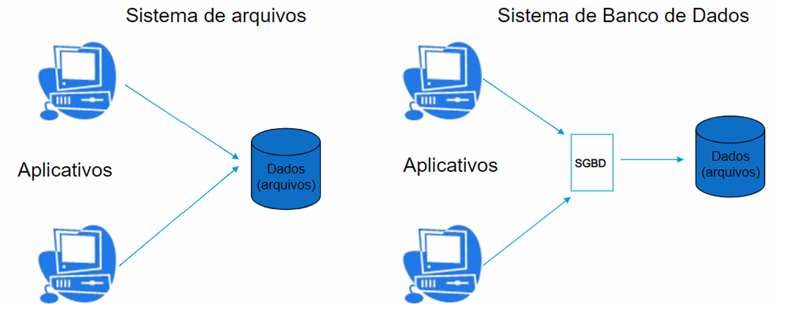
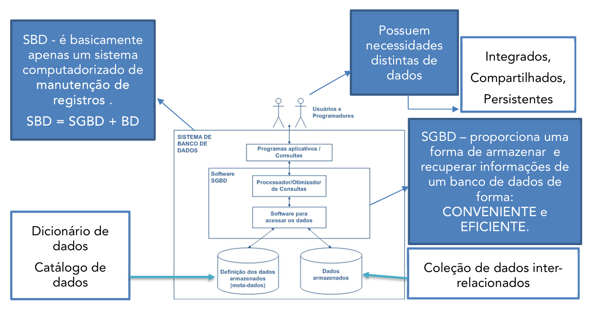

# Capítulo 1 – Fundamentos de Bancos de Dados

## O Mundo Antes dos Bancos de Dados: A Era dos Sistemas de Arquivos

Antes de mergulharmos no universo dos bancos de dados, é essencial compreendermos o cenário que antecedeu seu surgimento: os sistemas de arquivos. A maioria dos dispositivos computacionais, como notebooks, celulares e servidores, ainda hoje possui um sistema de arquivos. Ele é responsável por organizar os dados em diretórios e arquivos, permitindo que o usuário acesse e modifique conteúdos diversos, como documentos de texto, planilhas e imagens.

Imagine a seguinte situação: você trabalha no setor de vendas de uma empresa e precisa manter um cadastro de clientes. A solução inicial adotada pela equipe é utilizar uma planilha do Excel, acessada por todos os vendedores. No começo, tudo funciona relativamente bem. Porém, à medida que mais funcionários precisam acessar e modificar a planilha simultaneamente, começam a surgir problemas: conflitos de acesso, perda de dados, sobreposição de informações e até exclusões acidentais. Como tentativa de contornar esses problemas, cada vendedor passa a manter sua própria cópia da planilha. O que parece ser uma solução rápida, na verdade, inaugura uma nova dor de cabeça: **redundância de dados**.

Ao existir múltiplas cópias da mesma informação, sem qualquer controle centralizado, a chance de surgirem inconsistências é enorme. Um cliente pode estar com nome atualizado em um arquivo, mas desatualizado em outro. Um e-mail pode ter sido corrigido por um vendedor, mas o restante da equipe continua com a versão antiga. A ausência de um mecanismo confiável de sincronização dos dados torna o sistema vulnerável à perda de confiabilidade e integridade.

Esse problema é um retrato fiel do que ocorria nos primórdios da tecnologia da informação. Sistemas empresariais realizavam operações de leitura e escrita diretamente sobre arquivos de texto ou planilhas, sem qualquer software intermediário que garantisse controle e integridade. O resultado era o caos. Foi neste contexto que surgiram os **Sistemas de Gerenciamento de Banco de Dados (SGBDs)**, como uma evolução natural para controlar o acesso aos dados e garantir consistência e segurança. O SGBD passou, então, a ser o mediador entre as aplicações e os dados armazenados, como pode ser visto na figura a seguir:

<div align="center">
  
</div>

A figura mostra dois sistemas. O primeiro representa a estrutura de um sistema de arquivos onde os dados são acessados diretamente pelos aplicativos. Na segunda temos um sistema de banco de dados no qual o SGBD aparece entre os dados e os aplicativos, assumindo o papel de mediador.

## Redundância de Dados

Para entender os avanços trazidos pelos bancos de dados, é fundamental compreender a noção de **redundância de dados**, que pode ocorrer de duas formas distintas:

- **Redundância não controlada**: ocorre quando a replicação da informação é feita de forma manual ou distribuída sem coordenação. O controle da integridade e da atualização correta dos dados está sob responsabilidade exclusiva do usuário. Como vimos no exemplo anterior, múltiplas cópias de uma mesma planilha ilustram essa situação.
- **Redundância controlada**: neste caso, a repetição de dados é intencional e gerenciada por um sistema que conhece todas as representações existentes da informação e garante que estejam sincronizadas. Em um banco de dados, por exemplo, a repetição de dados pode ocorrer por motivos de desempenho, mas sempre sob a supervisão e lógica do SGBD.

A introdução de um **SGBD** transformou o cenário de desorganização para um modelo estruturado e seguro. O SGBD atua como **guardião do banco de dados**, intermediando e controlando todas as operações de acesso aos dados, substituindo os antigos sistemas de arquivos independentes.

## O Que é um Banco de Dados?

Para compreender profundamente o conceito de banco de dados, comecemos pela decomposição do próprio termo. A palavra **"banco"** pode representar, no nosso contexto, uma coleção organizada e categorizada de objetos — como em um banco de imagens, banco de sementes ou banco de leite. Já **"dados"**, no campo da tecnologia da informação, são representações codificadas de eventos ou fatos. Dados, por si só, são desprovidos de significado até que sejam inseridos em um **contexto**.

Considere o seguinte exemplo: a sequência “32260436, cinco, aprovado, Thiago”. Esses elementos, isoladamente, não dizem muito. Porém, se informarmos que esse é o registro de um candidato a uma seleção, com seu telefone, colocação e status de aprovação, os dados agora fazem sentido — eles se transformaram em **informação** contextualizada.

Dessa forma, **um banco de dados pode ser definido como uma coleção de dados relacionados, armazenados de forma organizada com o objetivo de representar aspectos do mundo real**. Essa é uma definição simples, porém eficaz. Importante ressaltar que um banco de dados **não precisa ser digital** — uma agenda telefônica de papel, por exemplo, já representa um banco de dados físico.

Contudo, para aprofundarmos essa definição, consideramos três propriedades essenciais descritas por **Navathe**, autor renomado na área:

1. **Representação de um aspecto do mundo real (minimundo)**: o banco de dados modela uma parte do universo que desejamos descrever e manipular. Um banco de dados de uma escola representa alunos, disciplinas, notas e professores.
2. **Coerência lógica entre os dados**: os dados armazenados devem estar organizados de maneira estruturada e significativa. Não basta um conjunto de dados aleatórios — eles precisam manter uma relação lógica entre si.
3. **Finalidade específica**: o banco de dados é criado com um propósito. Ele atende a um conjunto definido de usuários e aplicações, oferecendo uma estrutura eficiente para recuperar e manipular informações.

A aplicação desses princípios pode ser ilustrada com a agenda telefônica já mencionada. Ela representa contatos reais (minimundo), organiza os dados de forma ordenada e categorizada (coerência lógica) e atende à necessidade prática de localizar rapidamente um número (finalidade).

Diversos autores da literatura trazem definições complementares ao conceito de banco de dados:

- **C. J. Date**: "Um banco de dados é o equivalente eletrônico de um armário de arquivamento; um repositório ou recipiente de uma coleção de arquivos de dados computadorizados."
- **Carlos Heuser**: "Banco de dados é um conjunto de dados integrados que tem por objetivo atender a uma comunidade de usuários."
- **Silberschatz**: "Banco de dados é um conjunto de dados estruturados que são confiáveis, coerentes e compartilhados por usuários com necessidades diferentes."

## SGBD e Sistema de Banco de Dados: Entendendo os Papéis

Para avançarmos na compreensão dos sistemas de informação modernos, precisamos distinguir três conceitos fundamentais: **Banco de Dados (BD)**, **Sistema de Gerenciamento de Banco de Dados (SGBD)** e **Sistema de Banco de Dados (SBD)**.

- O **Banco de Dados (BD)** é a coleção de dados inter-relacionados, organizada para representar aspectos do mundo real.
- O **Sistema de Gerenciamento de Banco de Dados (SGBD)** é o software responsável por armazenar, recuperar, modificar e administrar os dados de forma eficiente. Ele é o coração funcional do ambiente de dados.
- O **Sistema de Banco de Dados (SBD)** é o sistema completo que engloba o banco de dados, o SGBD e os programas de aplicação que interagem com esses dados. De forma simplificada, temos a equação:
    > **SBD = BD + SGBD + Programas de Aplicação**

<div align="center">
  
</div>

O SGBD oferece um ambiente padronizado para gerenciar os dados. Suas funcionalidades incluem:

- Controle de acesso simultâneo por múltiplos usuários.
- Garantia de integridade e consistência dos dados.
- Mecanismos de segurança contra acessos não autorizados.
- Redundância controlada e replicação para alta disponibilidade.
- Controle de transações para evitar inconsistências em operações parciais.
- Recuperação de falhas causadas por erros de hardware, software ou quedas de energia.
- Otimização de consultas e auditoria por meio de registros (logs).

## Características da Abordagem de Bancos de Dados

Segundo Navathe, são quatro as principais características da abordagem de banco de dados que a fazem sobressair em relação às abordagens de processamento de arquivos:

- **Natureza autodescritiva de um sistema de banco de dados**
- **Isolamento entre programas e dados, abstração de dados**
- **Suporte a múltiplas visões dos dados**
- **Compartilhamento de dados e processamento de transações multiusuário**

Essas características visam reduzir a redundância, o que implica em diminuir o desperdício no espaço de armazenamento e os esforços para manter os dados comuns ou duplicados atualizados. Tudo isso é realizado por meio de um único repositório.

A **primeira característica**, conhecida como natureza autodescritiva, é também chamada de catálogo do SGBD, dicionário de dados ou **metadados**. Essa propriedade permite ao SGBD gravar as definições das suas estruturas e restrições. Entre as descrições que podem ser registradas estão: descrição de tabelas, tamanho do campo, tipo dos dados, propriedade de ser nulo ou não, valores padrão, restrições de integridade, entre outros. Um exemplo disso pode ser visto na definição de uma tabela em SQL:

```sql
CREATE TABLE EMPREGADO (
  ID_EMPREGADO INT PRIMARY KEY,
  FK_ID_SUPERVISOR INT,
  PRIMEIRO_NOME VARCHAR2(100) NOT NULL,
  ULTIMO_NOME VARCHAR2(100) NOT NULL,
  EMAIL VARCHAR2(100) NOT NULL,
  DATA_NASC_FUNC DATE NOT NULL,
  DATA_INICIO_FUN DATE DEFAULT SYSDATE,
  DATA_FIM_FUN DATE DEFAULT NULL,
  CONSTRAINT FK_SUP FOREIGN KEY EMPREGADO (ID_EMPREGADO)
);
```

A **segunda característica**, o isolamento entre programas e dados, é uma decorrência da existência do catálogo. Com isso, os dados deixam de estar codificados diretamente nos programas, o que permite a chamada **independência entre dados e aplicações**, viabilizada pela **abstração de dados**. A abstração permite a existência de diferentes níveis de modelos (conceitual, lógico, físico), cada qual revelando uma faceta distinta da estrutura dos dados.

A **terceira característica**, o suporte a múltiplas visões dos dados, parte do princípio de que diferentes usuários têm diferentes necessidades de acesso. No SQL, isso é representado por **views**, que são subconjuntos dos dados do banco de dados. Essas views podem representar tanto dados armazenados quanto dados derivados, como por exemplo a idade de uma pessoa calculada com base na data de nascimento.

Por fim, o **compartilhamento de dados e o suporte a transações multiusuário** garante que vários usuários possam acessar simultaneamente o banco de dados, de forma segura e consistente. Para isso, o SGBD utiliza mecanismos de **controle de concorrência**, assegurando as propriedades **ACID**:

- **Atomicidade** (A): a transação ocorre por completo ou não ocorre.
- **Consistência** (C): o banco de dados permanece em estado válido.
- **Isolamento** (I): transações não interferem umas nas outras.
- **Durabilidade** (D): uma vez realizadas, as alterações persistem.

Além das características apontadas por Navathe, Date destaca os **benefícios da abordagem de banco de dados**:

- Os dados podem ser compartilhados
- A redundância pode ser reduzida
- Inconsistências podem ser evitadas
- Pode-se utilizar o suporte a transações
- A integridade pode ser mantida
- A segurança pode ser aperfeiçoada
- Requisitos conflitantes podem ser balanceados
- Padrões podem ser utilizados

Silberschatz, por sua vez, ressalta os **problemas dos sistemas baseados em arquivos**:

- Redundância e inconsistência dos dados
- Dificuldade de acesso a dados
- Isolamento dos dados
- Problemas de integridade
- Problemas de atomicidade
- Anomalias de acesso concorrente
- Problemas de segurança

Essas comparações ajudam a compreender por que a abordagem de bancos de dados se tornou o padrão nas organizações modernas.

## Metadados

As arquiteturas modernas de dados dependem fortemente de **metadados** para garantir governança, rastreabilidade, segurança e escalabilidade no acesso aos dados. Sem uma base sólida de metadados, essas arquiteturas frequentemente falham em cumprir o que prometem.

Para entender sua importância, podemos fazer uma analogia com empresas de logística: ao enviar um pacote, você quer saber onde ele está e se foi entregue com sucesso. Os metadados oferecem essa mesma **visibilidade** sobre os dados dentro de uma organização, permitindo rastrear alterações, detectar falhas e identificar impactos de modificações.

**Metadados** fornecem informações sobre cada conjunto de dados, como tamanho, estrutura, esquema, data da última modificação, permissões de acesso, histórico de uso, entre outros. Em plataformas como data lakes, os metadados são essenciais para a **governança de dados** e normalmente são armazenados em catálogos centrais.

Os metadados podem ser classificados em **três categorias principais**:

- **Metadados técnicos**: descrevem a **estrutura** dos dados (ex: nomes dos campos, tipos, tamanhos, possibilidade de nulos). São utilizados para garantir que os dados sejam corretamente ingeridos, processados e armazenados.
- **Metadados operacionais**: descrevem a **linhagem, qualidade e proveniência** dos dados, registrando quando e de onde vieram, sua frequência de atualização, sucesso/falha em cargas de dados, e quantidades de dados rejeitados.
- **Metadados comerciais**: descrevem o **significado dos dados para os usuários de negócio**, com nomes amigáveis, descrições, regras de qualidade e glossários comerciais que promovem a consistência na interpretação dos dados.

No contexto dos SGBDs, os metadados exercem funções fundamentais:

- **Descrição da estrutura de dados**: tabelas, campos, chaves primárias e estrangeiras, índices, etc.
- **Controle de acesso**: permissões de usuários e grupos.
- **Otimização de consultas**: fornecem subsídios para que o SGBD crie planos de execução mais eficientes.
- **Recuperação de informações**: tornam os dados mais compreensíveis e acessíveis.
- **Manutenção e administração**: registram histórico de alterações, datas de modificação, versões, etc.

Além disso, podemos classificar os metadados de forma complementar em:

- **Metadados descritivos ou de identificação**: título, autor, assunto, palavras-chave.
- **Metadados estruturais**: indicam como diferentes objetos digitais estão organizados dentro de um mesmo recurso.
- **Metadados administrativos**: informações técnicas e jurídicas para a gestão de documentos digitais (formato, data de criação, direitos de acesso, etc.).

Metadados são, portanto, indispensáveis à organização, compreensão e administração eficaz dos dados em um banco de dados moderno.

## Considerações Finais

Neste capítulo, exploramos a evolução dos sistemas de informação, desde os sistemas de arquivos até os sofisticados sistemas de banco de dados. Compreendemos os problemas iniciais de redundância e inconsistência, e como os SGBDs surgiram como solução robusta para garantir integridade, segurança e desempenho.

Vimos também o conceito de banco de dados sob diferentes perspectivas, destacando suas propriedades fundamentais. Por fim, diferenciamos os elementos que compõem um sistema de banco de dados e destacamos as características que diferenciam a abordagem de banco de dados em relação aos sistemas baseados em arquivos, conforme descrito por autores como Navathe, Date e Silberschatz. Finalizamos com uma análise aprofundada dos metadados, fundamentais para a governança, rastreabilidade, performance e segurança no uso de dados em ambientes corporativos.

O domínio desses conceitos é essencial para qualquer profissional de tecnologia da informação e será a base para os próximos capítulos.
