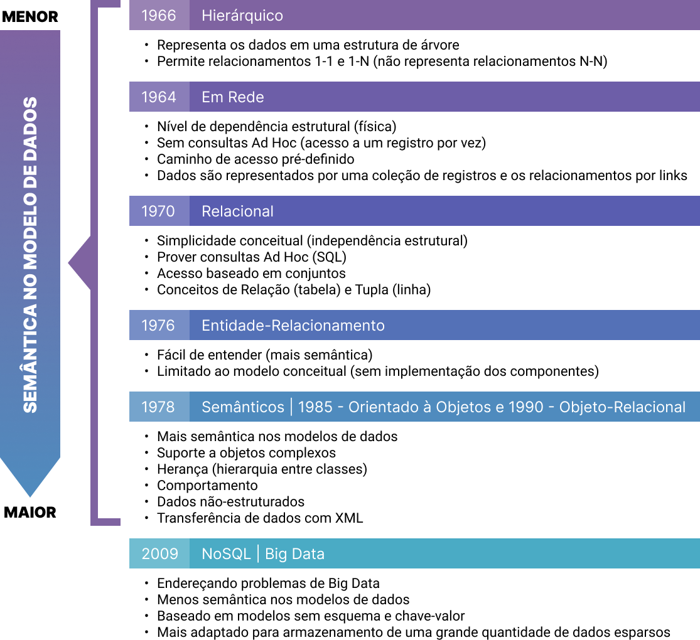
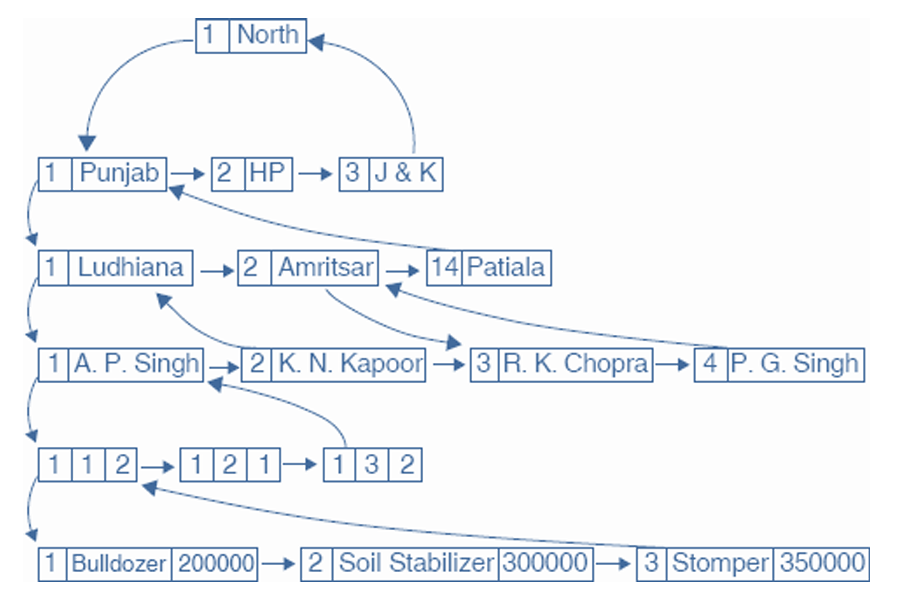
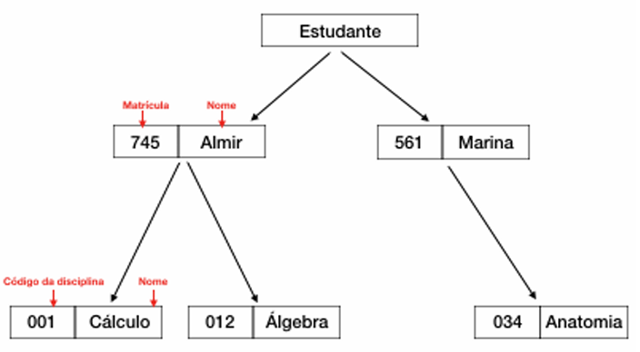
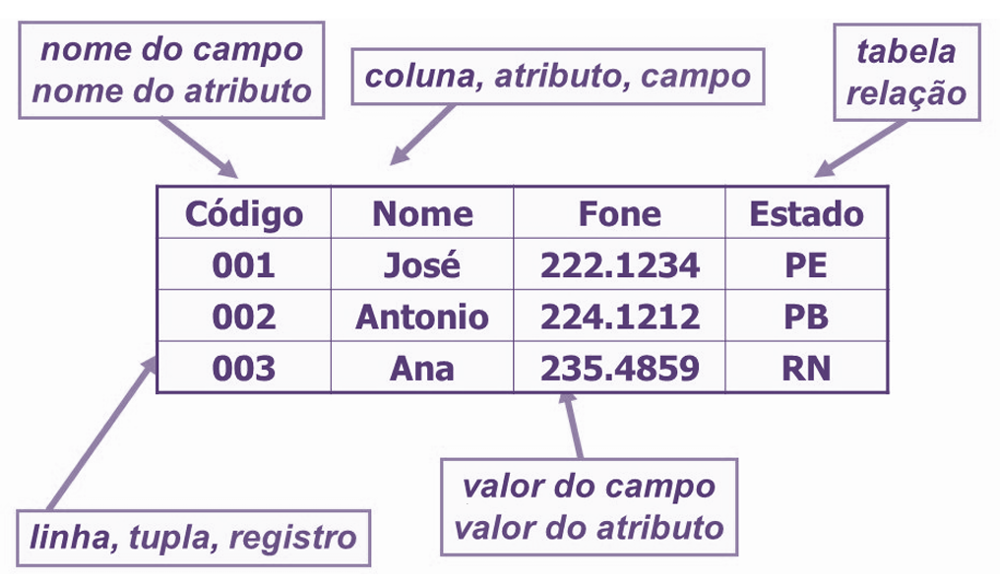
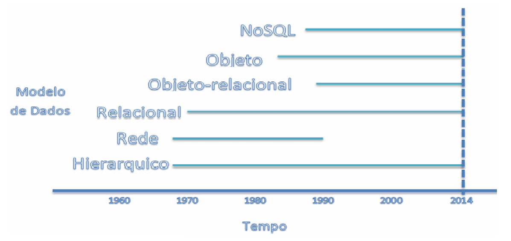

# Capítulo 2 – A Evolução Histórica dos Sistemas de Gerenciamento de Bancos de Dados (SGBDs)

A trajetória dos Sistemas de Gerenciamento de Bancos de Dados (SGBDs) acompanha a própria evolução da computação e reflete os desafios enfrentados ao longo das décadas no armazenamento, organização e recuperação eficiente das informações. Conhecer essa evolução é essencial para entender os paradigmas atuais e suas motivações técnicas e comerciais. Desde as primeiras tentativas de armazenamento de dados em estruturas simples até os modernos sistemas distribuídos e escaláveis, cada etapa introduziu conceitos fundamentais que ainda hoje moldam a forma como tratamos a informação.

  

## As Primeiras Soluções: Modelos Hierárquico e em Rede

A preocupação com o armazenamento estruturado de dados teve início nos anos 1960. Até então, os computadores funcionavam essencialmente como máquinas de cálculo, sendo pouco utilizados para tarefas como controle de estoque, cadastro de clientes ou processamento de pedidos. A necessidade crescente de organizar dados complexos levou ao desenvolvimento dos primeiros SGBDs.

Um dos marcos pioneiros foi o **Integrated Data Store (IDS)**, criado por Charles Bachmann na Honeywell em 1964. Esse sistema introduziu o modelo de rede, no qual os dados e suas relações são representados como grafos. Nessa abordagem, registros estão conectados por ponteiros que permitem transitar de um dado para outro em qualquer direção, facilitando representações do tipo muitos-para-muitos. Por exemplo, em um sistema de biblioteca, onde um livro pode ter vários autores e cada autor pode ter escrito vários livros, o modelo em rede se mostra eficiente.

  

Pouco depois, a IBM lançou o **Information Management System (IMS)**, baseado no modelo hierárquico. Esse modelo organiza os dados em estruturas em árvore, nas quais os registros são divididos entre proprietários (nós pais) e membros (nós filhos). Um exemplo simples pode ser observado em um sistema acadêmico, onde cada estudante (nó pai) está associado a várias disciplinas (nós filhos). Nessa estrutura, se dez alunos estiverem matriculados na mesma disciplina, ela aparecerá dez vezes no banco, uma para cada aluno, pois a hierarquia exige essa replicação. Vale ressaltar que um registro do tipo raiz (no exemplo, Estudante) não participa como registro filho em qualquer relacionamento.

  

Ambos os modelos representavam avanços significativos, mas também apresentavam limitações técnicas importantes:

- O acesso aos dados dependia da navegação por ponteiros, exigindo conhecimento da estrutura física do banco.
- Pequenas alterações no esquema, como a adição de um novo campo, exigiam reescrita dos programas que acessavam os dados.
- Os modelos eram orientados à manipulação de registros e não à modelagem conceitual dos dados como um todo.

Essas limitações resultavam em sistemas difíceis de manter e escalar, especialmente diante da crescente demanda por flexibilidade nas aplicações corporativas.

## O Modelo Relacional: Uma Revolução Conceitual

Para superar os desafios dos modelos anteriores, Edgar F. Codd, pesquisador da IBM, propôs em 1970 o modelo relacional, descrito no artigo "A Relational Model of Data for Large Shared Data Banks". Sua proposta era usar os fundamentos matemáticos da teoria dos conjuntos e da lógica de predicados para modelar dados em estruturas chamadas **relações**, que podemos imaginar como tabelas.

Em uma relação, cada linha é chamada de **tupla** e representa um registro. Cada coluna é um **atributo**, que possui um tipo de dado definido por um **domínio**. A grande inovação de Codd foi a abstração da forma física de armazenamento: os usuários não precisariam mais conhecer os detalhes internos do sistema para manipular dados. Essa separação entre o modelo lógico e o modelo físico é chamada de **independência dos dados**.

  

Nesse modelo, podemos fazer consultas usando uma linguagem declarativa, dizendo **o que** queremos obter, e não **como** obter. Essa linguagem,  originalmente conhecida como SEQUEL (Structured English QUEry Language), foi posteriormente chamada de **Structured Query Language (SQL)** ou linguagem de consulta estruturada, e é hoje o padrão mundial para bancos relacionais.

A proposta de Codd levou à criação do **System R**, projeto interno da IBM que deu origem à linguagem SQL e aos primeiros protótipos de bancos relacionais. O sucesso do modelo levou à adoção em larga escala por diversas empresas e, eventualmente, à padronização da linguagem pela ISO.

## A Emergência dos Modelos Orientados a Objetos

Apesar de suas muitas qualidades, o modelo relacional mostrou-se limitado em certos contextos, como aplicações científicas, sistemas médicos e softwares multimídia, nos quais os dados possuem estrutura complexa e comportamentos associados.

Na década de 1980, com o avanço das linguagens de programação orientadas a objetos como o C++, surgiu a necessidade de armazenar não apenas dados, mas também os métodos que os manipulavam. Surgiram então os **Sistemas de Gerenciamento de Banco de Dados Orientados a Objetos (SGBDOO)**. Esses sistemas permitiam, por exemplo, que uma entidade "Paciente" armazenasse tanto atributos como "nome" e "data de nascimento", quanto métodos como "calcular idade" ou "exibir histórico".

O primeiro SGBDOO comercialmente disponível foi lançado pela Objectivity no início dos anos 1990, sendo amplamente adotado por instituições de pesquisa como o CERN (maior laboratório europeu que trabalha com partículas em pesquisas de física nuclear) e SLAC (Centro de Aceleração Nuclear Norte Americano).

Entretanto, apesar das vantagens, o modelo orientado a objetos não se popularizou tanto quanto o modelo relacional, principalmente por questões de desempenho, interoperabilidade e familiaridade do mercado com SQL. Como resultado, muitas soluções migraram para um modelo híbrido: o modelo **objeto-relacional**. Contudo esse modelo começou a apresentar outra lista de problemas ou desafios:

- Dados na ordem de dezenas ou centenas de TB (terabytes)– abordagem de cluster é cara.
- Poder de crescimento elástico horizontal– controle de transação ACID torna inviável com a elasticidade.
- Fácil distribuição dos dados e/ou processamento– SGBD paralelos são caros.
- Tipos de dados variados, complexos e/ou semiestruturados– modelo de dados objeto-relacional não resolve todos os requisitos.

## As Demandas do Século XXI: Big Data e o Movimento NoSQL

A chegada do século XXI trouxe novos desafios: o volume de dados cresceu exponencialmente, a variedade de formatos aumentou, e a necessidade de análise em tempo real se tornou essencial em muitos domínios, como comércio eletrônico, redes sociais e IoT (Internet das Coisas).

O modelo relacional, apesar de robusto, mostrava dificuldades para escalar horizontalmente (em vários servidores) e lidar com dados semiestruturados ou não estruturados. Surgiu então o movimento NoSQL, nome que não significa "não SQL", mas sim **Not Only SQL**. O movimento propunha alternativas ao modelo relacional para atender a essas novas demandas, especialmente em ambientes distribuídos.

Os bancos NoSQL são classificados em quatro grandes categorias:

- **Colunar**: como o Cassandra, ideal para consultas analíticas em grandes volumes.
- **Documentos**: como o MongoDB, eficaz para dados semiestruturados em formato JSON.
- **Chave-valor**: como o Redis, extremamente rápido para leituras e escritas simples.
- **Grafos**: como o Neo4j, ideal para representar redes complexas, como redes sociais.

Esses bancos seguem um novo conjunto de princípios, conhecido como **BASE (Basically Available, Soft-state, Eventually consistent)**, que flexibiliza a rigidez das propriedades ACID dos bancos relacionais em favor de escalabilidade e desempenho.

O conceito de **Big Data** está intimamente ligado a esse movimento. De acordo com a definição clássica, os sistemas de Big Data devem lidar com os **cinco Vs**:

- **Volume**: trilhões de registros gerados por sensores, redes sociais e dispositivos móveis.
- **Variedade**: dados estruturados, semiestruturados e não estruturados, como vídeos, imagens, logs, etc.
- **Velocidade**: a necessidade de ingestão e análise quase em tempo real.
- **Veracidade**: a confiabilidade dos dados processados.
- **Valor**: a extração de insights úteis que justifiquem o investimento.

A fim de processar esses dados em larga escala, surgiram ferramentas como o **Hadoop**, plataforma de código aberto baseada no paradigma **MapReduce**, que distribui o processamento entre várias máquinas comuns, reduzindo o custo com servidores de alto desempenho.

## Considerações Finais

A evolução dos modelos de dados e dos SGBDs nos revela uma constante tentativa de acompanhar a complexidade crescente das aplicações, a diversidade dos dados e as exigências de escalabilidade. Do modelo hierárquico ao relacional, dos bancos orientados a objetos ao NoSQL, cada solução surgiu para atender a demandas específicas e, em muitos casos, ainda coexistem no cenário atual.

  

A figura a acima resume de maneira visual essa trajetória ao longo do tempo. Ao compreendermos essa linha evolutiva, estamos melhor preparados para tomar decisões arquiteturais informadas e adequadas à realidade de cada projeto, reconhecendo que não existe uma solução única para todos os problemas, mas sim a escolha do modelo mais adequado para cada contexto.