# Capítulo 2 – Modelo Relacional, Conceitual e Normalização

No capítulo anterior, estabelecemos os fundamentos sobre o que são dados, bancos de dados e os sistemas que os gerenciam. Vimos que existem diferentes paradigmas para organizar a informação, cada um com suas forças e finalidades. Agora, vamos nos aprofundar no paradigma que revolucionou a tecnologia da informação e que, até hoje, serve como a espinha dorsal da vasta maioria dos sistemas transacionais: o **Modelo Relacional**. Proposto por Edgar F. Codd em 1970, este modelo introduziu uma forma lógica e matematicamente fundamentada de representar dados, trazendo clareza, consistência e simplicidade a um campo que, até então, era complexo e despadronizado.

## Modelo Relacional

O modelo relacional é, de longe, o principal modelo de banco de dados utilizado no mundo. Sua premissa é representar todos os dados de forma estruturada, em um formato intuitivo de tabelas. No jargão técnico do modelo, essas tabelas são chamadas de **relações**.

Cada relação é projetada para armazenar dados sobre um tipo específico de **entidade**. Uma entidade é qualquer objeto ou conceito do mundo real sobre o qual desejamos guardar informações, como um `Cliente`, um `Produto` ou uma `Nota Fiscal`.

A estrutura de uma relação é composta por:

- **Atributos:** São as **colunas** da tabela. Cada atributo representa uma característica ou propriedade da entidade. Para uma entidade `Cliente`, os atributos poderiam ser `CPF`, `Nome` e `Cidade`.
- **Tuplas:** São as **linhas** da tabela, também conhecidas como **registros**. Cada tupla representa uma ocorrência única da entidade, contendo um conjunto de valores, um para cada atributo.

O diagrama a seguir ilustra a anatomia de uma relação.

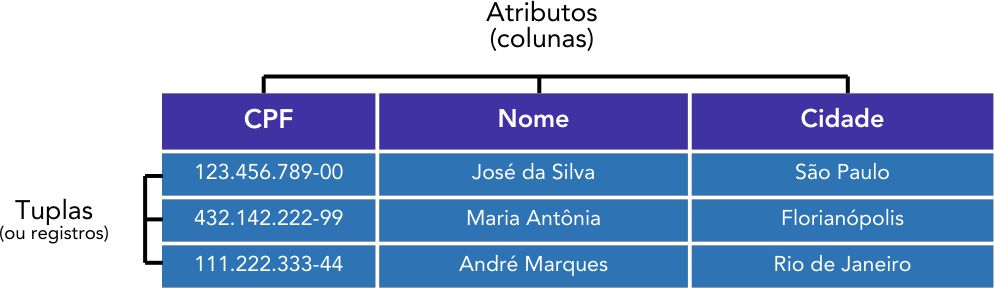

Neste exemplo, a relação (tabela) armazena dados sobre a entidade "Cliente". `CPF`, `Nome` e `Cidade` são seus **atributos**. Cada linha é uma **tupla** que representa um cliente específico, como "José da Silva". O conjunto de todos os valores em uma linha (`123.456.789-00`, `José da Silva`, `São Paulo`) é a tupla, enquanto cada "célula" individual, como `São Paulo`, é um **datum**, a menor unidade de dado.

Conforme vimos no capítulo anterior, cada atributo possui um **domínio**, que é o conjunto de valores permitidos para ele. Ao criar a tabela, definimos o tipo de dado para cada coluna (ex: `CPF` como `CHAR(14)`, `Nome` como `VARCHAR(100)`), restringindo assim seu domínio e garantindo a integridade dos dados. Essa definição é realizada através de comandos na **SQL (Structured Query Language)**, a linguagem padrão para a criação e manipulação de bancos de dados relacionais.

### As Propriedades de uma Relação

A simplicidade visual de uma tabela esconde um rigoroso fundamento matemático baseado na teoria dos conjuntos. É essa base que confere ao modelo relacional sua consistência. Segundo a teoria, popularizada por autores como C.J. Date, toda relação deve obedecer a um conjunto de propriedades fundamentais:

- **Tuplas não são ordenadas de cima para baixo:** Uma relação é um _conjunto_ de tuplas. Na teoria dos conjuntos, os elementos não possuem uma ordem intrínseca. Portanto, a ordem em que as linhas são exibidas em uma consulta não tem significado, a menos que uma ordenação seja explicitamente solicitada (com o comando `ORDER BY` em SQL).
- **Atributos não são ordenados da esquerda para a direita:** Da mesma forma, a ordem das colunas é irrelevante para o modelo. Os atributos são referenciados por seus nomes, não por sua posição.
- **Cada tupla deve ser única:** Como uma relação é um conjunto, ela não pode conter elementos duplicados. Isso significa que não podem existir duas linhas em uma tabela que sejam exatamente idênticas em todos os seus valores. Na prática, essa unicidade é garantida por uma **chave primária**.
- **Os valores dos atributos são atômicos:** Esta é uma das propriedades mais importantes. Cada "célula" da tabela (a intersecção de uma linha e uma coluna) deve conter um único e indivisível valor. Não é permitido, por exemplo, armazenar uma lista de telefones em um único campo `telefone`. Cada telefone deveria ser um registro separado em outra tabela.
- **Cada tupla contém um valor para cada atributo:** Toda tupla deve ser completa, possuindo um valor (do tipo de dado apropriado) para cada um dos atributos da relação. Um valor pode ser `NULL` (nulo), que é um marcador especial para indicar a ausência de um valor, mas o atributo em si está presente na tupla.

### Chaves: Identificando e Relacionando Dados

A verdadeira força do modelo relacional não está apenas em armazenar dados em tabelas, mas na sua capacidade de criar **relações** lógicas e consistentes entre essas tabelas. Os mecanismos que permitem identificar registros de forma única e construir essas pontes entre as tabelas são as **chaves**. As duas mais importantes são a chave primária, que garante a identidade, e a chave estrangeira, que constrói os relacionamentos.

#### Chave Primária (Primary Key - PK)

Uma **chave primária**, ou **PK** (_Primary Key_), é um atributo (coluna) ou um conjunto de atributos cuja finalidade é **identificar de forma única e inequívoca cada tupla (linha)** dentro de uma relação (tabela). Ela é o "CPF" de cada registro, garantindo que não existam duas linhas com o mesmo identificador.

Por exemplo, em uma tabela de `Cidades`, o nome da cidade poderia se repetir em diferentes estados. Portanto, `nome_cidade` não seria uma boa chave primária. Um código `IBGE`, no entanto, que é único para cada município, seria um excelente candidato.

Para cumprir sua função, toda chave primária deve obedecer a três regras fundamentais:

- **Unicidade:** O valor da chave primária não pode se repetir na mesma tabela. O SGBD impõe essa regra através de uma restrição `UNIQUE`.
- **Não Nulidade:** Uma chave primária jamais pode ter um valor nulo (`NULL`), ou seja, desconhecido ou vazio. Um registro precisa de um identificador para existir e ser localizado. O SGBD impõe essa regra com uma restrição `NOT NULL`.
- **Imutabilidade:** Embora tecnicamente possível, o valor de uma chave primária não deve ser alterado após o registro ser criado. Alterar um identificador exigiria a atualização em cascata de todas as outras tabelas que se referem a ele, um processo arriscado e complexo.

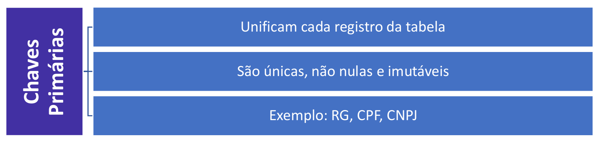

##### Tipos de Chaves Primárias

Existem diferentes abordagens para escolher uma chave primária:

- **Chave Natural:** É um atributo que já existe naturalmente nos dados e que identifica a entidade de forma única. Exemplos incluem o `CPF` para uma pessoa, o `ISBN` para um livro ou o `Chassi` para um veículo.
- **Chave Artificial (ou Surrogate):** É um código, geralmente um número inteiro sequencial, criado artificialmente pelo SGBD com o único propósito de servir como chave primária (ex: `id_cliente`). Esta é a abordagem mais comum e recomendada, pois garante unicidade, é imutável, curta e otimizada para o desempenho das consultas.
- **Chave Composta:** Em alguns casos, uma única coluna não é suficiente para garantir a unicidade. Uma chave primária composta é formada por duas ou more colunas. Por exemplo, em uma tabela de `Itens_de_Pedido`, a chave primária poderia ser a combinação de (`id_pedido`, `id_produto`).

##### Chaves Candidatas

Frequentemente, uma tabela pode ter múltiplos atributos ou conjuntos de atributos que poderiam servir como chave primária. Em uma tabela de `Pessoas`, tanto o `CPF` quanto o `RG` são únicos. O conjunto de todas essas opções (`{CPF}, {RG}`) é chamado de **chaves candidatas**. O projetista do banco de dados escolhe uma delas para ser a chave primária, e as outras podem ser definidas como **chaves alternativas**, mantendo a restrição de unicidade.

#### Chave Estrangeira (Foreign Key - FK)

Uma **chave estrangeira**, ou **FK** (_Foreign Key_), é um atributo ou um conjunto de atributos em uma tabela (a tabela "filha") que estabelece um vínculo com a chave primária de outra tabela (a tabela "pai"). Ela é o mecanismo que efetivamente cria o relacionamento entre os dados.

A chave estrangeira impõe uma regra fundamental chamada **integridade referencial**. Isso significa que o valor de uma chave estrangeira em uma tabela deve, obrigatoriamente, corresponder a um valor de chave primária existente na tabela referenciada, ou ser nulo. Em termos práticos:

- Não é possível matricular um aluno em um curso que não existe.
- Não é possível apagar um cliente da base de dados se ainda existirem pedidos associados a ele.

Diferente das chaves primárias, as chaves estrangeiras **podem ter valores repetidos e, em muitos casos, podem ser nulas**. Isso depende da natureza do relacionamento (a cardinalidade, que veremos adiante).

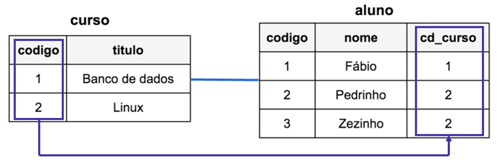

No exemplo acima, temos duas tabelas. A coluna `codigo` é a chave primária da tabela `curso`. Na tabela `aluno`, a coluna `cd_curso` é uma **chave estrangeira** que "aponta" para a coluna `codigo`. Isso garante que um aluno só possa ser associado a um `cd_curso` que exista na tabela `curso` (neste caso, `1` ou `2`). Note que o valor `2` se repete na coluna `cd_curso`, o que é permitido, pois mais de um aluno pode estar no mesmo curso.

A definição formal e a esmagadora boa prática do modelo relacional ditam que uma chave estrangeira deve sempre referenciar uma **chave candidata** (geralmente a chave primária) da tabela pai. Embora alguns SGBDs possam permitir tecnicamente a criação de uma referência a uma coluna não-única, essa é uma prática que viola a integridade referencial e deve ser evitada a todo custo, pois leva a ambiguidades e inconsistências nos dados.

### As Regras de Codd

Na década de 1980, com a crescente popularidade do modelo relacional, muitos fornecedores de software começaram a rotular seus produtos como "relacionais" sem, de fato, aderir aos princípios fundamentais do modelo. Em resposta, Edgar F. Codd, o "pai" do modelo relacional, publicou um conjunto de 12 regras (que na verdade são 13, começando pela regra 0) para estabelecer um padrão claro e rigoroso.

Essas regras definem o que é necessário para que um SGBD seja considerado verdadeiramente relacional. Mais do que um checklist técnico, elas representam a filosofia por trás do modelo, focada em consistência, simplicidade e independência de dados. Compreender o propósito de cada regra é fundamental para dominar o funcionamento e as vantagens do paradigma relacional.

A seguir, vamos detalhar cada uma das treze regras.

**REGRA 00 - REGRA DA FUNDAÇÃO**

> Para um sistema se qualificar como um SGBD relacional, ele deve gerenciar todas as suas bases de dados inteiramente através de suas capacidades relacionais.

- **Em termos práticos:** O SGBD não pode "trapacear". Ele deve usar o modelo relacional não apenas para armazenar os dados do usuário, mas também para gerenciar a si mesmo, incluindo seu catálogo de metadados.

**REGRA 01 - REGRA DA INFORMAÇÃO**

> Toda a informação em um banco de dados é representada explicitamente no nível lógico e de uma única forma: por valores em tabelas.

- **Em termos práticos:** Não existem "ponteiros" ou caminhos de acesso ocultos que o usuário precise conhecer. Se algo é uma informação, ela está contida em uma coluna de uma linha em uma tabela. Isso garante a simplicidade e a consistência do modelo.

**REGRA 02 - REGRA DO ACESSO GARANTIDO**

> Cada datum (a menor unidade de dado) em um banco de dados relacional é acessível logicamente através de uma combinação de nome da tabela, nome da coluna e valor da chave primária.

- **Em termos práticos:** Todo e qualquer valor no banco de dados tem um "endereço" lógico e único. Não há ambiguidade. Para encontrar qualquer dado, basta saber a tabela, a coluna e a chave primária da linha.

**REGRA 03 - REGRA DO TRATAMENTO SISTEMÁTICO DE VALORES NULOS**

> O SGBD deve permitir que cada campo possa permanecer nulo (vazio), representando "informação ausente" ou "informação inaplicável" de forma sistemática e distinta de todos os valores regulares.

- **Em termos práticos:** `NULL` não é zero, nem uma string vazia. É um marcador especial para ausência de valor. O SGBD deve tratar `NULL` de forma consistente em todas as operações (ex: em comparações, `NULL` não é igual a `NULL`).

**REGRA 04 - REGRA DO CATÁLOGO DINÂMICO ONLINE**

> A descrição do banco de dados (o catálogo de metadados) é representada no mesmo nível lógico que os dados comuns, de forma que usuários autorizados possam aplicar a mesma linguagem relacional a ele.

- **Em termos práticos:** Os metadados são armazenados em tabelas, assim como os dados normais. Um DBA pode usar `SELECT` para consultar o catálogo do sistema e descobrir quais tabelas, colunas e restrições existem no banco de dados.

**REGRA 05 - REGRA DA LINGUAGEM DE SUBDADOS ABRANGENTE**

> Um sistema relacional deve suportar pelo menos uma linguagem que seja completa em suas capacidades de definição de dados (DDL), manipulação de dados (DML), consulta (DQL) e controle de acesso (DCL).

- **Em termos práticos:** Deve existir uma linguagem poderosa e bem definida, como a **SQL**, que permita realizar todas as tarefas necessárias no banco de dados, desde a criação de tabelas até a concessão de permissões.

**REGRA 06 - REGRA DA ATUALIZAÇÃO DE VISÕES**

> Todas as visões (_views_) que são teoricamente atualizáveis também devem ser atualizáveis pelo sistema.

- **Em termos práticos:** Se uma visão é uma representação lógica simples de uma ou mais tabelas base, o sistema deve permitir que operações de `INSERT`, `UPDATE` ou `DELETE` feitas através da visão sejam corretamente refletidas nas tabelas originais.

**REGRA 07 - REGRA DE OPERAÇÕES RELACIONAIS**

> A capacidade de lidar com relações como um único operando aplica-se não apenas à recuperação de dados, mas também à inserção, atualização e exclusão.

- **Em termos práticos:** O sistema deve ser orientado a conjuntos. Um único comando deve ser capaz de modificar múltiplas linhas. Por exemplo, `UPDATE Funcionarios SET salario = salario * 1.1` deve funcionar como uma única operação, sem a necessidade de um laço para percorrer cada funcionário.

**REGRA 08 - REGRA DA INDEPENDÊNCIA FÍSICA DOS DADOS**

> Programas de aplicação e atividades de terminal permanecem inalterados quando são feitas alterações nas representações de armazenamento ou nos métodos de acesso.

- **Em termos práticos:** Esta é a **independência física** que vimos na arquitetura ANSI/SPARC. Um DBA pode adicionar um índice ou mover os arquivos do banco de dados para um novo disco sem que isso exija a alteração de uma única linha de código na aplicação.

**REGRA 09 - REGRA DA INDEPENDÊNCIA LÓGICA DOS DADOS**

> Programas de aplicação e atividades de terminal permanecem logicamente inalterados quando são feitas mudanças nas tabelas base que, teoricamente, permitam a inalteração.

- **Em termos práticos:** Esta é a **independência lógica**. É possível, por exemplo, dividir uma tabela em duas, e criar uma visão com o nome da tabela original que une as novas tabelas. A aplicação continuará a funcionar, consultando a visão, sem perceber a mudança na estrutura lógica.

**REGRA 10 - REGRA DA INDEPENDÊNCIA DE INTEGRIDADE**

> As restrições de integridade devem ser definíveis na linguagem de dados e armazenadas no catálogo, não nos programas de aplicação.

- **Em termos práticos:** Regras de negócio, como "o CPF de um cliente deve ser único" ou "o valor de um pedido não pode ser negativo", devem ser definidas no banco de dados (com `UNIQUE` ou `CHECK constraints`), não em cada aplicação que o acessa. Isso centraliza e garante a aplicação das regras.

**REGRA 11 - REGRA DA INDEPENDÊNCIA DE DISTRIBUIÇÃO**

> O usuário final não deve ser capaz de ver que os dados estão distribuídos por várias localizações. Os usuários devem ter sempre a impressão de que os dados estão localizados em apenas um local.

- **Em termos práticos:** Se o banco de dados está fisicamente distribuído em múltiplos servidores, essa complexidade deve ser totalmente transparente para o usuário, que interage com o sistema como se fosse uma única entidade.

**REGRA 12 - REGRA DA NÃO SUBVERSÃO**

> Se um sistema possui uma linguagem de baixo nível, esse nível não pode ser usado para subverter ou ignorar as regras e restrições de integridade expressas na linguagem de mais alto nível.

- **Em termos práticos:** Não pode haver uma "porta dos fundos". Se existe uma restrição que impede a inserção de salários negativos via SQL, não pode existir outra forma de acesso de mais baixo nível que permita burlar essa regra. A integridade do banco de dados é soberana.

## Modelo Conceitual

No capítulo anterior, estabelecemos que o projeto de um banco de dados evolui através de diferentes modelos, cada um com um nível de detalhe e abstração específico. Agora, vamos focar no ponto de partida desse processo: o **Modelo Conceitual**.

O processo de criação de um banco de dados começa com a definição do **minimundo**, que é a parte específica do mundo real que desejamos representar em nosso sistema. Para uma universidade, o minimundo seriam seus alunos, professores, disciplinas e matrículas; para uma loja, seriam os clientes, produtos e vendas. A partir da análise deste minimundo, levantamos um conjunto de requisitos de dados que servem como base para a modelagem.

É neste ponto que o modelo conceitual entra em cena. Ele é o nível de **mais alta abstração** na representação de um banco de dados, funcionando como uma ponte entre os requisitos de negócio (a linguagem humana) e a estrutura lógica do banco de dados (a linguagem técnica).

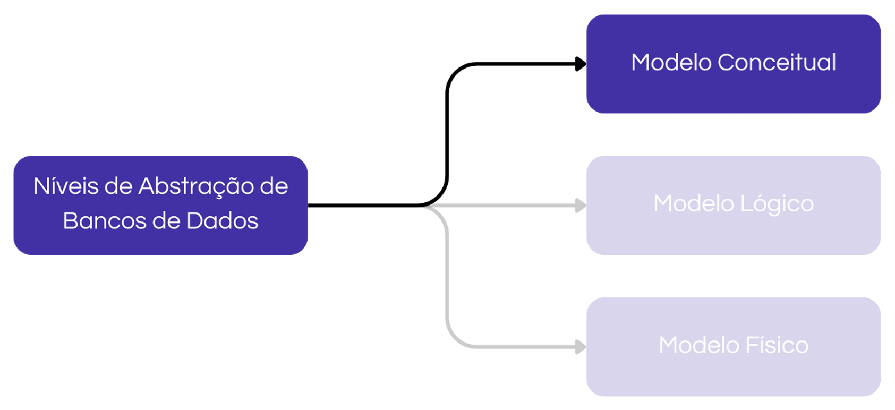

O foco do modelo conceitual é criar uma representação de alto nível da informação, que seja clara para todos os envolvidos no projeto (gestores, usuários finais e desenvolvedores). Por essa razão, a modelagem nesta fase é **completamente independente de qualquer tecnologia**. Não importa qual SGBD será usado ou se o paradigma será relacional ou NoSQL; o modelo conceitual se concentra apenas em identificar as principais "peças" de informação e como elas se conectam. A técnica mais comum e universalmente aceita para criar o modelo conceitual é o **Modelo Entidade-Relacionamento (MER)**.

### Modelo Entidade-Relacionamento (MER)

O **Modelo Entidade-Relacionamento (MER)** é uma técnica de modelagem de dados usada para produzir um esquema conceitual de um banco de dados. Proposto por Peter Chen em 1976, o MER oferece uma maneira estruturada de visualizar os dados em termos de **entidades**, os **atributos** que as descrevem, e os **relacionamentos** entre elas.

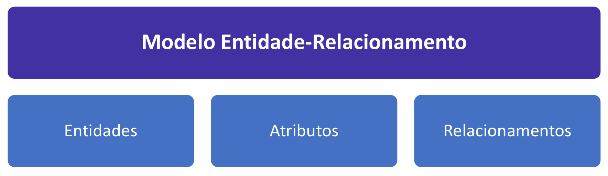

É importante fazer uma distinção entre o MER e o DER:

- O **Modelo Entidade-Relacionamento (MER)** é a teoria, o conjunto de conceitos e regras abstratas que definem como representar a estrutura dos dados. É a "gramática".
- O **Diagrama Entidade-Relacionamento (DER)** é a representação gráfica e visual do MER. É o "desenho" que utiliza os símbolos e as convenções do modelo para representar um minimundo específico.

Apesar de serem tecnicamente distintos, na prática, os termos MER e DER são frequentemente usados como sinônimos. O DER é a principal ferramenta de comunicação nesta fase do projeto, pois permite visualizar, discutir e validar os requisitos de dados de forma intuitiva.

O diagrama a seguir é um exemplo de um DER simples, que utilizaremos como base para explorar em detalhe cada um de seus componentes.

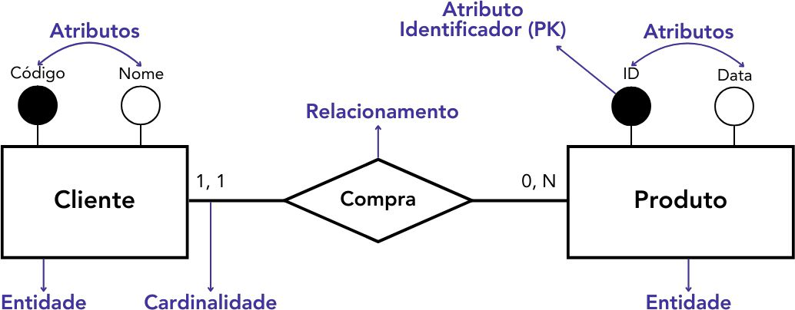

Como ilustrado, o diagrama é composto por vários elementos simbólicos. Nos próximos tópicos, vamos dissecar cada um desses conceitos — Entidades, Atributos e Relacionamentos — para compreender como eles se combinam para formar um modelo de dados coeso e completo.

### Entidades

Uma **entidade** é o bloco de construção central do MER. Ela representa um objeto, pessoa, lugar, evento ou conceito do mundo real (o _minimundo_) sobre o qual desejamos armazenar informações. É importante distinguir a **entidade** como um tipo ou classe de objeto (ex: o conceito de Aluno) de uma **ocorrência da entidade**, que é uma instância específica daquele tipo (ex: o aluno específico "José da Silva").

No nosso exemplo do diagrama anterior, `Cliente` e `Produto` são as entidades. Em um sistema acadêmico, as entidades poderiam ser `Alunos`, `Professores`, `Cursos` e `Disciplinas`. No DER, as entidades são representadas graficamente por retângulos.

Ao modelar um banco de dados, é crucial entender que nem todas as entidades são criadas da mesma forma. Elas são classificadas em três tipos principais, com base em sua independência e função no modelo: entidades fortes, fracas e associativas.

#### Entidades Fortes

Uma **entidade forte** representa um conceito que pode existir por si só, de forma independente de outras entidades. Ela é o pilar do modelo de dados. Tecnicamente, sua principal característica é possuir um ou mais atributos próprios que possam servir como **chave primária**, identificando cada ocorrência da entidade de forma única e inequívoca.

- **Exemplos:** `CLIENTE` (identificado pelo `CPF` ou `id_cliente`), `PRODUTO` (identificado pelo `código_de_barras` ou `id_produto`), `BANCO` (identificado pelo `código_bancario`). Cada um desses conceitos existe e pode ser identificado sem depender de nenhuma outra informação no modelo.
- **Representação no DER:** Um retângulo com linha simples.

#### Entidades Fracas

Uma **entidade fraca** é aquela cuja existência e identificação dependem de outra entidade, chamada de entidade proprietária (que é sempre uma entidade forte). Ela não possui atributos suficientes para formar uma chave primária por conta própria.

Para ser unicamente identificada, uma ocorrência de uma entidade fraca precisa da chave primária de sua entidade forte proprietária, combinada com um de seus próprios atributos, que chamamos de **atributo discriminante** (ou chave parcial).

- **Exemplo Clássico:** Considere a relação entre `FUNCIONARIO` (entidade forte) e `DEPENDENTE` (entidade fraca).
    - A entidade `DEPENDENTE` não faz sentido sozinha; um dependente sempre existe _em função de_ um funcionário.
    - O atributo `nome` de um dependente ("Maria") não é único no sistema, pois vários funcionários podem ter dependentes com o mesmo nome.
    - Para identificar uma "Maria" específica, precisamos saber de qual funcionário ela é dependente. Portanto, a chave primária da entidade `DEPENDENTE` seria a combinação da chave estrangeira (`id_funcionario`) com o atributo discriminante (`nome`).
- **Outro Exemplo:** A entidade `AGÊNCIA` é fraca em relação à entidade `BANCO`. O número de uma agência (ex: "0123") só é único dentro do contexto de um banco específico.
- **Representação no DER:** Um retângulo com linha dupla.

#### Entidades Associativas

Uma **entidade associativa** é um construto especial usado para modelar um **relacionamento de muitos-para-muitos (N:M)** entre duas ou mais entidades. Ela surge quando o próprio relacionamento possui atributos próprios. Em vez de ser apenas uma linha de conexão, o relacionamento é "promovido" ao status de entidade.

- **Exemplo:** A relação entre `MÉDICO` e `PACIENTE`. Um médico atende muitos pacientes, e um paciente pode ser atendido por muitos médicos. Onde armazenar a `data` e a `hora` de uma consulta específica? Essa informação não pertence nem ao médico, nem ao paciente, mas sim ao evento da **consulta** que os une.
- Nesse caso, criamos uma entidade associativa chamada `CONSULTA`. Sua chave primária será a combinação das chaves primárias de `MÉDICO` (`id_medico`) e `PACIENTE` (`id_paciente`), e ela poderá ter seus próprios atributos, como `data_hora` e `diagnostico`.
- Retomaremos este conceito com mais detalhes ao falarmos sobre relacionamentos.
- **Representação no DER:** Um retângulo com um losango inscrito.

A tabela a seguir resume os três tipos de entidades:

| Entidade        | Descrição                                                                                                           | Representação                                                                         |
| --------------- | ------------------------------------------------------------------------------------------------------------------- | ------------------------------------------------------------------------------------- |
| **Forte**       | Representa um objeto ou conceito que é independente no modelo, ou seja, não depende de outra entidade para existir. | 
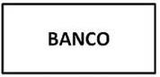
       |
| **Fraca**       | Representa um objeto ou conceito que é dependente de uma entidade forte para existir.                               | 

       |
| **Associativa** | Utilizada para representar relacionamentos complexos entre duas ou mais entidades fortes.                           | 
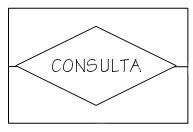
 |

É importante notar que a representação gráfica pode variar. Dependendo da notação adotada (como IDEF1X, por exemplo), uma entidade fraca pode ser representada por um retângulo com cantos arredondados. A notação que utilizamos aqui é a de Peter Chen, uma das mais comuns e didáticas.

### Atributos

Se as entidades são os "substantivos" do nosso modelo de dados, os **atributos** são os "adjetivos". Eles representam as características, propriedades ou fatos que queremos conhecer e armazenar sobre cada ocorrência de uma entidade. No Diagrama Entidade-Relacionamento (DER), os atributos são comumente representados por elipses (ou círculos) ligadas à sua respectiva entidade.

Por exemplo, para a entidade `Aluno`, podemos definir atributos como `Matrícula`, `Nome`, `Data_de_Nascimento` e `Email`. Cada um desses atributos descreve uma faceta específica do aluno.

Os atributos não são todos iguais; eles são classificados de acordo com sua função e estrutura, o que nos ajuda a modelar o minimundo com maior precisão.

#### Atributo Identificador (Chave)

O **atributo identificador**, também conhecido como **atributo chave**, é aquele cujo valor identifica unicamente cada ocorrência de uma entidade. Ele é a representação da **chave primária** no modelo conceitual.

- **Exemplo:** Na entidade `Aluno`, o atributo `Matrícula` é o identificador, pois não podem existir dois alunos com o mesmo número de matrícula. Na entidade `Produto`, poderia ser o `Código_de_Barras`.
- **Representação no DER:** Uma elipse com o nome sublinhado ou, em diagramas mais generalistas, uma elipse/círculo preenchido.

#### Atributo Simples (ou Atômico)

Um **atributo simples** é aquele que possui um valor indivisível, ou seja, que não pode ser subdividido em partes menores com significado próprio. A maioria dos atributos em um modelo de dados são simples.

- **Exemplos:** `Sexo` de uma pessoa, `Preço` de um produto, `Quantidade_em_Estoque`.

#### Atributo Composto

Um **atributo composto** é aquele que pode ser decomposto em um conjunto de atributos mais simples. Ele é usado para agrupar características que, juntas, formam uma informação completa.

- **Exemplo:** O atributo `Endereço` é um exemplo clássico. Ele pode ser composto pelos sub-atributos `Logradouro`, `Número`, `Bairro`, `Cidade`, `UF` e `CEP`. Para entender o endereço completo, precisamos do conjunto de suas partes.

#### Atributo Multivalorado

Um **atributo multivalorado** é aquele que pode conter múltiplos valores para uma única ocorrência da entidade.

- **Exemplo:** A entidade `Pessoa` pode ter um atributo `Telefone`. Como uma pessoa pode ter mais de um número de telefone (celular, residencial, comercial), `Telefone` é um atributo multivalorado. Outro exemplo seria `Habilidades` para um `Funcionário`.

É crucial não confundir atributos compostos e multivalorados:

- **Composto:** Refere-se à **estrutura** de um único valor complexo (um endereço é composto por várias partes diferentes).
- **Multivalorado:** Refere-se à **quantidade** de valores que o atributo pode ter (uma pessoa pode ter vários telefones, cada um sendo um valor completo e do mesmo tipo).

No momento de traduzir o modelo conceitual para o lógico (as tabelas), os atributos multivalorados exigem atenção especial, pois violam a propriedade de atomicidade do modelo relacional. A solução comum é criar uma nova tabela para representá-los.

#### Atributo Derivado

Um **atributo derivado** é aquele cujo valor pode ser calculado ou inferido a partir de outro(s) atributo(s) no banco de dados.

- **Exemplo:** A entidade `Pessoa` possui o atributo `Data_de_Nascimento`. A partir dele, podemos calcular o atributo `Idade`. Outro exemplo: a entidade `Item_Pedido` possui os atributos `Quantidade` e `Preço_Unitário`; a partir deles, podemos derivar o atributo `Preço_Total`.
- Por representarem uma informação redundante, os atributos derivados geralmente **não são armazenados** fisicamente no banco de dados (não se tornam colunas). Seus valores são calculados pela aplicação sempre que necessário para garantir que estejam sempre atualizados.

#### Cardinalidade de Atributos

A cardinalidade, quando aplicada a atributos, define quantos valores um atributo pode ter para cada ocorrência da entidade.

- **Cardinalidade (1,1):** O atributo é **monovalorado** e obrigatório. Cada ocorrência da entidade deve ter exatamente um valor para este atributo (ex: `CPF` de uma pessoa).
- **Cardinalidade (0,1):** O atributo é **monovalorado** e opcional. Cada ocorrência pode ter no máximo um valor, mas pode não ter nenhum (ex: `Email_Secundario`).
- **Cardinalidade (1,n):** O atributo é **multivalorado** e obrigatório. Cada ocorrência deve ter pelo menos um valor, e pode ter vários (ex: `Telefone`, se for obrigatório ter ao menos um).
- **Cardinalidade (0,n):** O atributo é **multivalorado** e opcional. Cada ocorrência pode ter de zero a muitos valores (ex: `Dependente`).

#### Representação Gráfica dos Atributos

A tabela a seguir resume as diferentes classificações de atributos e suas respectivas representações gráficas na notação de Peter Chen.

| Tipo de Atributo           | Representação Gráfica                                                                   |
| -------------------------- | --------------------------------------------------------------------------------------- |
| **Atributo Simples**       | 
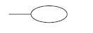
               |
| **Atributo Chave***        | 
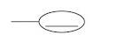
         |
| **Atributo Composto**      | 
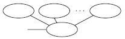
      |
| **Atributo Multivalorado** | 
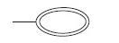
 |
| **Atributo Derivado**      | 
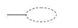
    |
_* É possível representar atributos chave, ou identificadores, através de circunferências preenchidas. A notação sublinhada é usada quando temos um nível de detalhe maior no modelo, enquanto a notação preenchida passa uma visão mais generalista._

### Relacionamentos

Se as entidades são os "substantivos" e os atributos são os "adjetivos" do nosso modelo, os **relacionamentos** são os "verbos". Eles representam as associações, interações ou vínculos que existem entre as ocorrências de uma ou mais entidades, descrevendo como elas estão conectadas. No DER, os relacionamentos são representados por losangos.

Por exemplo, em um sistema de uma instituição de ensino, temos a entidade `Aluno` e a entidade `Curso`. A ação que as conecta é o fato de que um aluno **se matricula em** um curso. "Matricula-se" é, portanto, o relacionamento entre elas. Da mesma forma, um `Professor` **ministra** um `Curso`, estabelecendo outro relacionamento.

É importante destacar que a existência de um relacionamento não significa que toda ocorrência de uma entidade precise, obrigatoriamente, participar dele. Um professor pode estar cadastrado no sistema, mas ainda não ministrar nenhum curso. Essa característica, chamada de **opcionalidade** ou **participação**, é definida através da cardinalidade, um conceito que veremos em detalhe a seguir.

Os relacionamentos são classificados de acordo com o número de entidades que participam dele, uma característica chamada de **grau do relacionamento**.

#### Grau do Relacionamento

- **Relacionamento Unário (ou Recursivo):** É um relacionamento de grau 1, no qual uma entidade se relaciona consigo mesma. Ou seja, ocorrências da mesma entidade se associam.
    - **Exemplo 1: Casamento.** Em um banco de dados de um cartório, a entidade `PESSOA` pode ter um relacionamento `Casa-se com` com a própria entidade `PESSOA`.
    - **Exemplo 2: Supervisão.** Em uma empresa, a entidade `FUNCIONARIO` pode ter um relacionamento `Supervisiona`, onde uma ocorrência (o gestor) se relaciona com outras ocorrências (os subordinados).

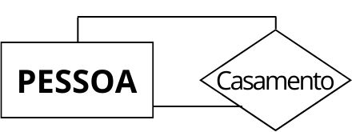

- **Relacionamento Binário:** É o tipo mais comum, de grau 2, que associa ocorrências de **duas** entidades distintas. A maioria dos exemplos, como `Aluno se matricula em Curso`, são relacionamentos binários.
- **Relacionamento Ternário:** É um relacionamento de grau 3, que associa ocorrências de **três** entidades simultaneamente. São menos comuns, mas necessários quando uma associação só faz sentido com a presença de três partes.
    - **Exemplo:** Em um sistema de logística, um `FORNECEDOR` fornece uma `PEÇA` para um `PROJETO`. O relacionamento `Fornece` é ternário, pois a informação completa exige saber quem forneceu, o que foi fornecido e para qual projeto.

#### Entidades Associativas: Quando o Relacionamento tem Atributos

Via de regra, relacionamentos apenas indicam a existência de um vínculo. No entanto, em alguns casos, especialmente em relacionamentos de muitos-para-muitos (N:M), o próprio relacionamento pode ter atributos que o descrevem.

Nestes casos, o relacionamento é "promovido" a uma **entidade associativa**, um construto híbrido que se comporta tanto como uma entidade (pois possui atributos) quanto como um relacionamento (pois conecta outras entidades).

- **Exemplo:** A relação entre `MÉDICO` e `PACIENTE` é de muitos-para-muitos. Um médico atende vários pacientes e um paciente pode ser atendido por vários médicos. O evento que os une é a `CONSULTA`. Onde armazenar a `Data`, a `Hora` e o `Diagnóstico` da consulta? Essa informação não pertence exclusivamente ao médico nem ao paciente, mas sim à interação entre eles. A solução é transformar `CONSULTA` em uma entidade associativa.
- **Representação no DER:** Um retângulo envolvendo o losango do relacionamento.

Como uma entidade associativa também é uma entidade, ela pode participar de outros relacionamentos.

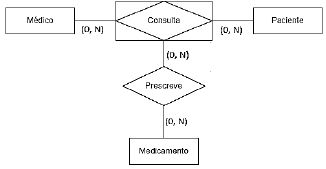

### Cardinalidade

Após definirmos as entidades e os relacionamentos, precisamos especificar as **regras de negócio** que governam como as ocorrências dessas entidades podem se associar. Essa especificação é feita através da **cardinalidade**.

A cardinalidade de um relacionamento define o **número mínimo e máximo** de ocorrências de uma entidade que podem estar associadas a **uma** ocorrência da outra entidade participante. Em termos simples, ela responde à pergunta "quantos?". Os valores possíveis são:

- **0 (zero):** indica que a participação no relacionamento é opcional.
- **1 (um):** indica uma participação específica e única.
- **N**: indica "muitos", sem um limite superior definido.

Esses valores são sempre representados em um par **(mínimo, máximo)**.

#### Lendo a Cardinalidade no Diagrama

A leitura da cardinalidade é um ponto que frequentemente causa confusão, mas segue uma regra simples: para entender a relação de uma entidade A com uma entidade B, deve-se ler o par de cardinalidade que está posicionado **ao lado da entidade B**.

Vamos analisar o exemplo clássico `Professor ministra Curso`:

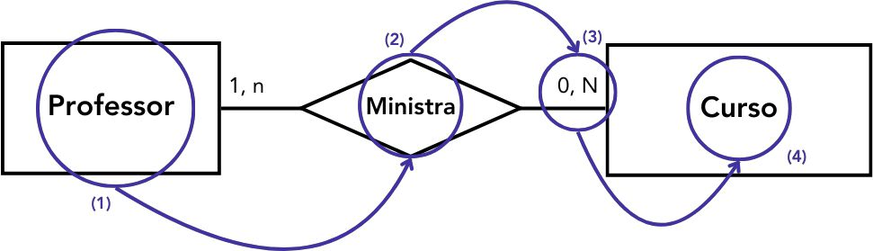

Para interpretar o diagrama, seguimos um método passo a passo:

1. **Leitura (Professor → Curso):**
    - Comece na entidade de origem: "UM `Professor`..."
    - Leia o nome do relacionamento: "...`ministra`..."
    - Leia o par de cardinalidade ao lado da entidade de destino: "...no mínimo `0` e no máximo `N`..."
    - Finalize com o nome da entidade de destino: "...`Cursos`."
    - **Frase completa:** "Um professor ministra no mínimo 0 e no máximo N cursos."

2. **Leitura (Curso → Professor):**
    - Comece na entidade de origem: "UM `Curso`..."
    - Leia o nome do relacionamento: "...é `ministrado por`..." (note que o verbo pode ser adaptado para fazer sentido)
    - Leia o par de cardinalidade ao lado da entidade de destino: "...no mínimo `1` e no máximo `n`..."
    - Finalize com o nome da entidade de destino: "...`Professores`."
    - **Frase completa:** "Um curso é ministrado por no mínimo 1 e no máximo n professores."

#### Os Componentes da Cardinalidade: Participação e Grau

O par (mínimo, máximo) nos revela duas informações cruciais sobre o relacionamento:

- **Cardinalidade Mínima (Restrição de Participação):** Define se a participação de uma entidade no relacionamento é obrigatória ou opcional.
    - **Participação Opcional (mínimo = 0):** Uma ocorrência da entidade **pode existir** sem estar associada a nenhuma ocorrência da outra entidade. No nosso exemplo, um `Professor` pode estar cadastrado no sistema sem ministrar nenhum `Curso`.
    - **Participação Obrigatória (mínimo = 1 ou mais):** Uma ocorrência da entidade **deve obrigatoriamente** estar associada a pelo menos uma ocorrência da outra entidade. No nosso exemplo, um `Curso` não pode existir se não tiver pelo menos um `Professor` associado a ele.

- **Cardinalidade Máxima (Razão de Cardinalidade ou Grau):** Define o número máximo de associações e classifica o tipo de relacionamento.
    - **Um-para-Um (1:1):** Cada ocorrência de A se relaciona com no máximo uma de B, e vice-versa. Exemplo: `DIRETOR` (1,1) — `dirige` — (1,1) `ESCOLA`.
    - **Um-para-Muitos (1:N):** Uma ocorrência de A se relaciona com muitas de B, mas uma de B se relaciona com apenas uma de A. Exemplo: `MÃE` (1,1) — `tem` — (1,N) `FILHO`.
    - **Muitos-para-Muitos (N:M ou N:N):** Uma ocorrência de A se relaciona com muitas de B, e vice-versa. Exemplo: `ALUNO` (0,N) — `cursa` — (0,N) `DISCIPLINA`.

É importante não confundir a cardinalidade de relacionamentos com a **cardinalidade de atributos**, que descreve o número de valores que um único atributo pode ter para uma instância de uma entidade (monovalorado vs. multivalorado).

#### Outras Notações de Cardinalidade

Além da notação numérica (mínimo, máximo), que é muito comum em modelos conceituais teóricos, existem outras duas formas de representação gráfica da cardinalidade que são amplamente utilizadas em ferramentas de modelagem e na documentação de sistemas. Cada uma possui suas próprias convenções e nível de detalhe.

##### Notação "Pé de Galinha" (Crow's Foot)

Esta é, possivelmente, a notação mais popular e intuitiva, utilizada em uma vasta gama de ferramentas de modelagem de dados. Seu nome deriva do símbolo usado para representar "muitos", que se assemelha a um pé de galinha. A grande vantagem desta notação é a sua clareza visual, decompondo a cardinalidade em dois símbolos distintos em cada extremidade do relacionamento.

A simbologia é lida da entidade para a linha de relacionamento, com o símbolo mais próximo da entidade representando a **cardinalidade mínima** (participação) e o símbolo na extremidade da linha representando a **cardinalidade máxima** (grau).

Os símbolos são:

- **Cardinalidade Mínima:**
    - **O (círculo):** Representa **zero (0)**, indicando uma participação **opcional**.
    - **| (traço vertical):** Representa **um (1)**, indicando uma participação **obrigatória**.

- **Cardinalidade Máxima:**
    - **| (traço vertical):** Representa **um (1)**.
    - **< (pé de galinha):** Representa **muitos (N)**.

Combinando esses símbolos, podemos representar todas as cardinalidades:

- **Zero ou Um (0,1):** Representado por `O|`.
    - _Exemplo:_ `FUNCIONÁRIO` e `VAGA_ESTACIONAMENTO`. Um funcionário pode ter zero ou no máximo uma vaga. A participação é opcional, e a cardinalidade máxima é um.

- **Exatamente Um (1,1):** Representado por `||`.
    - _Exemplo:_ `PEDIDO` e `CLIENTE`. Um pedido deve pertencer a exatamente um cliente. A participação é obrigatória, e a cardinalidade máxima é um.

- **Zero ou Muitos (0,N):** Representado por `O<`.
    - _Exemplo:_ `CLIENTE` e `PEDIDO`. Um cliente pode ter feito zero ou muitos pedidos. A participação é opcional, e a cardinalidade máxima é muitos.

- **Um ou Muitos (1,N):** Representado por `|<`.
    - _Exemplo:_ `DEPARTAMENTO` e `FUNCIONÁRIO`. Um departamento deve ter no mínimo um e pode ter muitos funcionários. A participação é obrigatória, e a cardinalidade máxima é muitos.

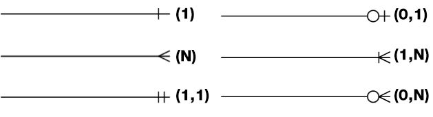

##### Notação IDEF1X

A notação IDEF1X (Integration DEFinition for Information Modeling) é um padrão mais formal e rico em informações, frequentemente utilizado em projetos de engenharia de software, data warehousing e por agências governamentais dos EUA. Sua simbologia consegue expressar não apenas a cardinalidade, mas também o tipo do relacionamento (se ele ajuda a identificar a entidade filha ou não).

Os principais componentes da notação são:

- **Tipo da Linha (Natureza do Relacionamento):**
    - **Linha Sólida:** Representa um **relacionamento identificador**. Isso significa que a chave primária da entidade "pai" migra para a entidade "filha" e se torna **parte** da chave primária da entidade filha. Isso é típico em relacionamentos com entidades fracas.
    - **Linha Tracejada:** Representa um **relacionamento não-identificador**. Este é o caso mais comum. A chave primária da entidade "pai" migra para a entidade "filha" como uma chave estrangeira, mas **não** faz parte da chave primária da filha.

- **Símbolo na Extremidade (Cardinalidade):**
    - Um círculo sem nenhuma marcação ao lado geralmente indica **zero, um ou muitos**.
    - Um círculo com a letra **Z** ao lado indica **zero ou um (0,1)**.
    - Um círculo com a letra **P** (de "Positive") ao lado indica **um ou mais (1,N)**.
    - Um círculo com um número (`n`) ao lado indica **exatamente `n`**.
    - A ausência de qualquer símbolo na extremidade geralmente implica uma cardinalidade máxima de **um (1)**.
    - Um **losango** na extremidade da linha indica que a participação é **opcional (0)**. A ausência do losango indica participação **obrigatória (1)**.

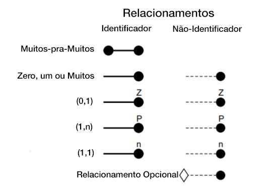

Embora mais complexa, a notação IDEF1X carrega mais informações semânticas sobre a estrutura do banco de dados, sendo muito precisa para detalhar as regras de dependência entre as entidades.

### Criando Hierarquias: Generalização e Especialização

A generalização e a especialização são conceitos de modelagem que nos permitem representar relacionamentos do tipo **"é um tipo de"**, criando hierarquias entre entidades. Essa abordagem, inspirada nos princípios da orientação a objetos, ajuda a organizar o modelo, reduzir a redundância e representar as regras de negócio de forma mais precisa.

- **Especialização (Processo Top-Down):** É o processo de partir de uma entidade genérica (a **superclasse**) e identificar subgrupos que possuem atributos ou relacionamentos específicos. Esses subgrupos se tornam **subclasses**. Por exemplo, partindo da entidade genérica `VEÍCULO`, podemos especializá-la nas subclasses `CARRO` (que tem o atributo específico `numero_de_portas`) e `MOTO` (que tem o atributo `cilindradas`).
- **Generalização (Processo Bottom-Up):** É o processo inverso. Começamos com um conjunto de entidades que compartilham atributos em comum e criamos uma superclasse genérica para conter esses atributos compartilhados. Por exemplo, se tivermos as entidades `SECRETÁRIO`, `TÉCNICO` e `ENGENHEIRO`, e todas elas possuem os atributos `CPF`, `Nome` e `Salário`, podemos generalizá-las em uma superclasse `EMPREGADO`.

Em ambos os casos, as subclasses **herdam** todos os atributos e relacionamentos da superclasse. No Diagrama Entidade-Relacionamento, essa hierarquia é comumente representada por um triângulo que conecta a superclasse às suas subclasses.

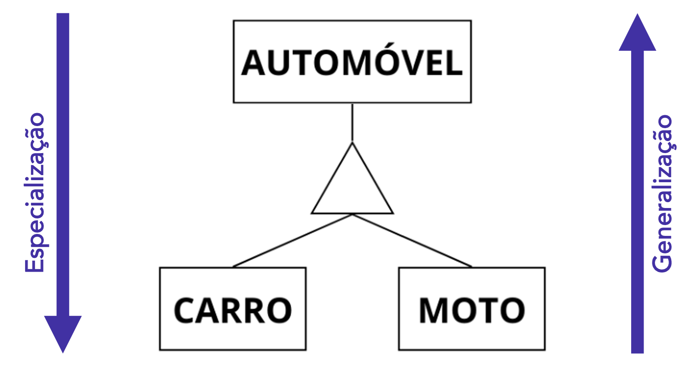

#### As Regras da Hierarquia: Restrições de Especialização

Para que a hierarquia represente corretamente as regras de negócio, precisamos definir duas restrições independentes: a de **disjunção** (ou exclusividade) e a de **completude** (ou totalidade).

##### Restrição de Disjunção (Disjointness)

Esta restrição responde à pergunta: "Uma ocorrência da superclasse pode ser membro de mais de uma subclasse ao mesmo tempo?".

- **Disjunta (Disjoint - 'd'):** As subclasses são mutuamente exclusivas. Uma ocorrência da superclasse pode pertencer a, no máximo, **uma** das subclasses.
    - **Exemplo:** Uma entidade `CONTA BANCÁRIA` pode ser especializada em `CONTA CORRENTE` ou `CONTA POUPANÇA`. Uma conta específica não pode ser dos dois tipos ao mesmo tempo.
    - **Notação:** Um `d` dentro de um círculo no diagrama.

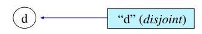

- **Sobreposta (Overlap - 'o'):** As subclasses não são mutuamente exclusivas. Uma ocorrência da superclasse pode pertencer a **várias** subclasses simultaneamente.
    - **Exemplo:** Em uma universidade, uma `PESSOA` pode ser `ALUNO` e `PROFESSOR` ao mesmo tempo.
    - **Notação:** Um `o` dentro de um círculo no diagrama.

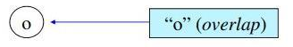

##### Restrição de Completude (Completeness)

Esta restrição responde à pergunta: "Toda ocorrência da superclasse deve, obrigatoriamente, pertencer a pelo menos uma das subclasses?".

- **Total (Total - 't'):** Sim. Toda ocorrência da superclasse **deve** pertencer a pelo menos uma subclasse. Não podem existir ocorrências que sejam apenas do tipo da superclasse.
    - **Exemplo:** Se a entidade `PACIENTE` é especializada em `PACIENTE INTERNADO` e `PACIENTE AMBULATORIAL`, e todo paciente deve se enquadrar em uma dessas duas categorias, a especialização é total.
    - **Notação:** Uma linha dupla conectando a superclasse ao símbolo da hierarquia (triângulo ou círculo).

- **Parcial (Partial - 'p'):** Não. Uma ocorrência da superclasse **pode existir** sem pertencer a nenhuma das subclasses definidas.
    - **Exemplo:** A entidade `EMPREGADO` pode ser especializada em `ENGENHEIRO` e `TÉCNICO`, mas podem existir empregados que não são nem engenheiros nem técnicos (como gerentes ou analistas). A especialização é parcial.
    - **Notação:** Uma linha simples conectando a superclasse ao símbolo da hierarquia.

##### Notações Combinadas

Em algumas notações, como a que usa o triângulo, as restrições são combinadas em um par de letras (exclusividade, completude):

||**Total (t)**|**Parcial (p)**|
|---|---|---|
|**Exclusiva (x)**|**xt**|**xp**|
|**Compartilhada (c)**|**ct**|**cp**|

Vamos analisar os exemplos completos de diagramas:

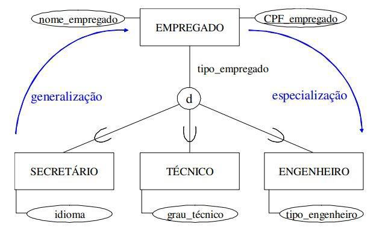

- **Análise do Diagrama `EMPREGADO`:** A letra `d` no círculo indica uma restrição **disjunta**, ou seja, um empregado pode ser `SECRETÁRIO` **ou** `TÉCNICO` **ou** `ENGENHEIRO`, mas nunca mais de um desses tipos ao mesmo tempo. A linha simples (implícita na notação de círculo) indica uma especialização **parcial**, significando que pode haver empregados que não se encaixam em nenhuma dessas três categorias.

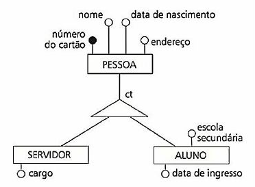

- **Análise do Diagrama `PESSOA`:** As letras `ct` junto ao triângulo indicam uma restrição **compartilhada (`c`)** e **total (`t`)**. Isso significa que uma `PESSOA` pode ser `SERVIDOR` **e** `ALUNO` ao mesmo tempo (compartilhada), e que toda `PESSOA` no sistema deve ser, obrigatoriamente, ou um servidor, ou um aluno, ou ambos (total).

### Estudo de Caso: Modelando o Banco de Dados de uma Biblioteca

A melhor forma de consolidar os conceitos de entidades, atributos e relacionamentos é aplicá-los a um problema do mundo real. Vamos, portanto, construir passo a passo o Modelo Conceitual para um sistema de gerenciamento de uma biblioteca.

**Cenário (Minimundo):** Precisamos projetar um banco de dados para uma biblioteca que precisa registrar os livros de seu acervo, os autores de cada livro, e os empréstimos desses livros para as pessoas cadastradas.

O processo de modelagem seguirá três etapas lógicas:

1. Identificar as entidades e seus atributos.
2. Definir os relacionamentos e suas cardinalidades.
3. Refinar o modelo, tratando relacionamentos complexos.

#### Etapa 1: Identificando as Entidades e seus Atributos

O primeiro passo é identificar os principais "substantivos" ou objetos do nosso minimundo. Neste caso, os objetos centrais são claramente `LIVRO`, `AUTOR` e `PESSOA` (a pessoa que pega o livro emprestado).

Uma vez identificadas as entidades, definimos os atributos que descrevem cada uma delas:

**1. Entidade LIVRO**

Para cada livro, precisamos saber seu identificador único, seu título e seu gênero.

- **ID:** Atributo identificador (chave primária) para garantir que cada livro seja único no sistema.
- **Título:** Atributo simples para armazenar o nome do livro.
- **Gênero:** Atributo simples para categorizar o livro (ex: Ficção, Biografia).

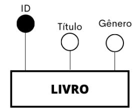

**2. Entidade AUTOR**

Para cada autor, precisamos de um identificador, seu nome e sua nacionalidade.

- **ID:** Atributo identificador (chave primária).
- **Nome:** Atributo simples.
- **Nacionalidade:** Atributo simples.

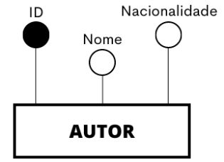

**3. Entidade PESSOA**

Para cada pessoa cadastrada na biblioteca, precisamos de um identificador, seu nome e seu endereço.

- **ID:** Atributo identificador (chave primária).
- **Nome:** Atributo simples.
- **Endereço:** Atributo composto, pois um endereço é formado por várias partes (logradouro, cidade, CEP, etc.).

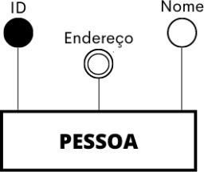

#### Etapa 2: Definindo os Relacionamentos e Cardinalidades

Agora que temos as entidades, precisamos conectá-las através dos "verbos" que descrevem suas interações, definindo as regras de negócio com a cardinalidade.

- **Relacionamento entre `LIVRO` e `AUTOR`:** Um livro é _escrito por_ um autor. Analisando as regras:
    - "Um `LIVRO` é escrito por no mínimo `1` e no máximo `N` `AUTORES`." (Cardinalidade do lado do AUTOR: **(1,n)**).
    - "Um `AUTOR` escreve no mínimo `1` e no máximo `N` `LIVROS`." (Cardinalidade do lado do LIVRO: **(1,n)**).
    - Temos, portanto, um relacionamento **muitos-para-muitos (N:M)**.

- **Relacionamento entre `LIVRO` e `PESSOA`:** Uma pessoa _empresta_ um livro. Analisando as regras:
    - "Uma `PESSOA` empresta no mínimo `0` e no máximo `N` `LIVROS`." (Cardinalidade do lado do LIVRO: **(0,n)**).
    - "Um `LIVRO` é emprestado por no mínimo `0` e no máximo `N` `PESSOAS`." (Cardinalidade do lado da PESSOA: **(0,n)**).
    - Este também é um relacionamento **muitos-para-muitos (N:M)**.

#### Etapa 3: Refinando o Modelo com Entidades Associativas

Identificamos um ponto que exige refinamento. O relacionamento `EMPRESTA` é do tipo muitos-para-muitos, e, mais importante, o ato de emprestar é um evento que possui suas próprias informações. Onde guardaríamos a `Data` do empréstimo ou o `Responsável` (o bibliotecário) pela transação? Esses atributos não pertencem nem a `LIVRO` nem a `PESSOA`, mas sim ao relacionamento entre eles.

A solução é promover o relacionamento `EMPRESTA` a uma **entidade associativa**. Ela resolverá a relação N:M e poderá conter seus próprios atributos, descrevendo o evento do empréstimo.

#### O Diagrama Completo

Juntando todas as peças — as três entidades originais, o relacionamento `ESCRITO` e a nova entidade associativa `EMPRESTA` —, chegamos ao nosso Modelo Entidade-Relacionamento completo:

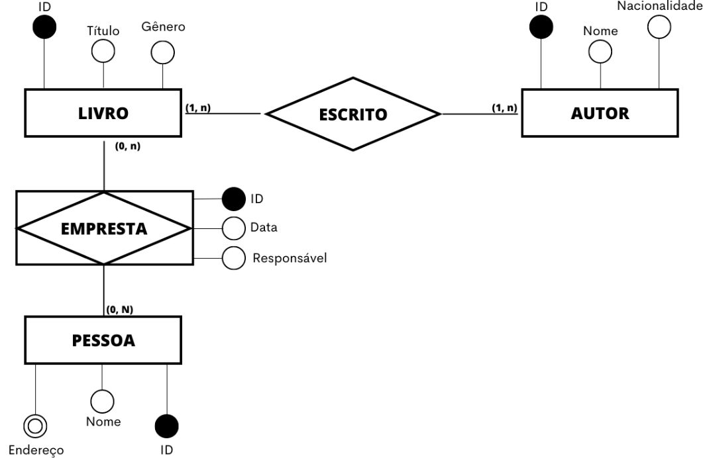

Analisando o diagrama final, podemos ler toda a história do nosso minimundo:

- A entidade `LIVRO` se relaciona com `AUTOR` através do relacionamento `ESCRITO`, que é do tipo muitos-para-muitos.
- A entidade `LIVRO` e a entidade `PESSOA` se conectam através da entidade associativa `EMPRESTA`.
- A entidade `EMPRESTA` resolve a relação muitos-para-muitos e possui seus próprios atributos para descrever cada transação de empréstimo: `ID`, `Data` e `Responsável`.

## Normalização

Após a criação do modelo conceitual, o próximo passo no design de um banco de dados é a transição para o modelo lógico, onde definimos as tabelas e colunas. A **normalização** é um processo formal e sistemático, composto por uma série de etapas, que aplicamos a esse modelo lógico para garantir que a estrutura das tabelas seja eficiente, consistente e livre de problemas.

O objetivo principal da normalização é **minimizar a redundância de dados** e, consequentemente, **evitar anomalias de atualização**. Em termos práticos, o processo consiste em decompor tabelas grandes e complexas em tabelas menores e mais bem estruturadas, onde cada tabela armazena informações sobre uma única entidade ou conceito.

### Redundância de Dados e Anomalias

A redundância, que é a repetição desnecessária da mesma informação em múltiplos locais, é a raiz de diversos problemas em um banco de dados. Ela não apenas desperdiça espaço de armazenamento, mas, muito mais grave, abre portas para inconsistências e para um trio de problemas conhecidos como **anomalias de atualização**:

- **Anomalia de Inserção:** Ocorre quando não conseguimos inserir um dado sobre uma entidade porque precisamos, obrigatoriamente, de um dado de outra entidade.
    - **Exemplo:** Imagine uma única tabela `ALUNO_CURSO` que armazena dados do aluno e do curso em que ele está matriculado. Se quisermos cadastrar um novo curso que ainda não tem nenhum aluno, não conseguiríamos, pois precisaríamos de dados de um aluno (que não existe) para preencher a linha.

- **Anomalia de Exclusão:** Ocorre quando a exclusão de um registro leva à perda de informações de outra entidade que não gostaríamos de perder.
    - **Exemplo:** Na mesma tabela `ALUNO_CURSO`, se o último aluno de um determinado curso for excluído, podemos acabar perdendo todas as informações sobre aquele curso (nome do curso, nome do professor, etc.), pois ele não existe em nenhum outro lugar.

- **Anomalia de Alteração:** Ocorre quando a alteração de um único dado exige a atualização de múltiplos registros.
    - **Exemplo:** Se um professor que leciona para 50 alunos mudar de número de telefone, e essa informação estiver repetida em cada uma das 50 linhas dos alunos, seria necessário atualizar todas as 50 linhas. Se uma delas for esquecida, o banco de dados se torna inconsistente.

### Decompondo as Tabelas

A normalização resolve esses problemas através da decomposição. Vamos usar o exemplo de um atributo "Localização" que armazena a cidade e o estado juntos (ex: "Santos - São Paulo", "Campinas - São Paulo").

**Antes da Normalização (com redundância):**

|ID_CLIENTE|NOME_CLIENTE|LOCALIZACAO|
|---|---|---|
|1|João Silva|Santos - São Paulo|
|2|Maria Lins|Campinas - São Paulo|
|3|Pedro Alves|Niterói - Rio de Janeiro|

O nome do estado "São Paulo" se repete. Para alterar o nome do estado, teríamos que modificar múltiplas linhas.

**Depois da Normalização (sem redundância):**

Criamos uma tabela separada para `ESTADOS` e referenciamos seu ID na tabela de `CLIENTES`, que agora também separa `CIDADE`.

Tabela ESTADOS:

| ID_ESTADO (PK) | NOME_ESTADO |
| --- | --- |
| 1 | São Paulo |
| 2 | Rio de Janeiro |

Tabela CLIENTES:

| ID_CLIENTE (PK) | NOME_CLIENTE | CIDADE | ID_ESTADO (FK) |
|:--- | --- | --- | --- |
| 1 | João Silva | Santos | 1 |
| 2 | Maria Lins | Campinas | 1 |
| 3 | Pedro Alves | Niterói | 2 |

Agora, a informação "São Paulo" está armazenada em um único local. Se o nome do estado precisasse ser alterado, a modificação seria feita em apenas uma linha na tabela `ESTADOS`, e a mudança seria refletida automaticamente para todos os clientes associados.

### As Formas Normais (FN)

A normalização não é um processo aleatório; ela segue um conjunto de regras bem definidas chamadas **Formas Normais (FN)**. Existem diversas formas normais (1FN, 2FN, 3FN, BCNF, 4FN, 5FN), cada uma abordando um tipo específico de redundância.

O processo é cumulativo: para que uma tabela esteja na Segunda Forma Normal (2FN), ela precisa primeiro atender a todos os critérios da Primeira Forma Normal (1FN), e assim por diante. Na prática, para a maioria dos sistemas transacionais, alcançar a **Terceira Forma Normal (3FN)** é suficiente para garantir um design de banco de dados robusto e livre das anomalias mais comuns.

Nos próximos tópicos, vamos explorar em detalhe cada uma dessas formas normais.

#### Primeira Forma Normal (1FN)

A Primeira Forma Normal (1FN) é o ponto de partida para a normalização de um banco de dados. Sua regra central é direta e fundamental, ligada a uma das propriedades essenciais do modelo relacional que já discutimos: a **atomicidade**.

Para que uma tabela esteja na 1FN, ela deve satisfazer uma única condição: **todos os valores de seus atributos devem ser atômicos**. Um valor é considerado atômico se ele for indivisível do ponto de vista do modelo de dados. Em outras palavras, cada célula (a intersecção de uma linha e uma coluna) na tabela deve conter um, e apenas um, valor.

A violação da 1FN geralmente ocorre de duas maneiras: através de **atributos compostos** e **atributos multivalorados**.

- **Atributos Compostos:** São colunas que armazenam múltiplos valores de _diferentes significados_ em uma única string. Por exemplo, uma coluna `Endereço` que contém "Rua das Flores, 123, São Paulo".
- **Atributos Multivalorados:** São colunas que armazenam múltiplos valores do _mesmo significado_ em uma única célula. Por exemplo, uma coluna `Telefone` que contém "999-444, 999-000".

Vamos aplicar o processo de normalização para a 1FN em um exemplo prático.

##### Estudo de Caso: Normalizando uma Tabela de Pessoas

Imagine que temos a seguinte tabela, que ainda não está normalizada:

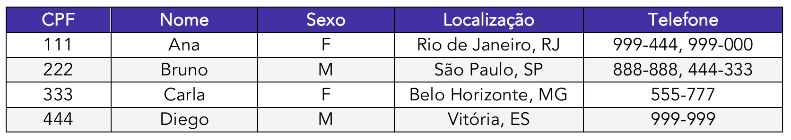

**1. Identificação dos Atributos Problemáticos**

O primeiro passo é analisar a tabela em busca de colunas que violem a regra da atomicidade.

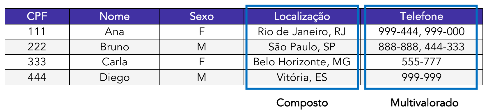

Identificamos dois problemas:

- A coluna **`Localização`** é um **atributo composto**, pois armazena duas informações distintas (cidade e estado) em um único campo. Isso dificulta a realização de buscas ou agrupamentos por estado ou cidade.
- A coluna **`Telefone`** é um **atributo multivalorado**, pois armazena uma lista de números de telefone em uma única célula para as pessoas Ana e Bruno. Isso torna impossível tratar cada telefone como uma informação individual.

**2. Aplicando as Regras da 1FN**

Agora, vamos corrigir esses problemas.

- **Para o atributo composto (`Localização`):** A solução é simples. Decompomos o atributo em suas partes atômicas, criando novas colunas para cada parte. A coluna `Localização` é eliminada e substituída pelas colunas `Cidade` e `Estado`.

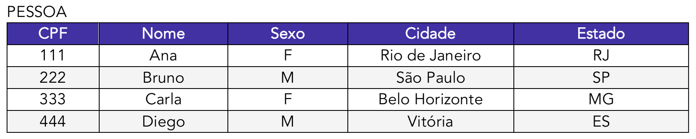

- **Para o atributo multivalorado (`Telefone`):** A solução é mais elaborada. Não podemos simplesmente adicionar mais colunas de telefone na tabela `PESSOA` (Telefone1, Telefone2, etc.), pois isso cria um limite fixo e desperdiça espaço. A abordagem correta é:
    1. Remover a coluna multivalorada (`Telefone`) da tabela original.
    2. Criar uma **nova tabela** dedicada a armazenar os telefones.
    3. Essa nova tabela conterá uma coluna para o telefone e uma coluna que funcione como **chave estrangeira (FK)**, referenciando a chave primária da tabela original (`CPF`) para manter o vínculo.

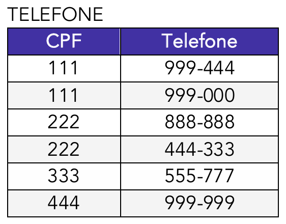

Após o processo, nossa base de dados está na **Primeira Forma Normal**. Agora temos duas tabelas, `PESSOA` e `TELEFONE`, e em ambas, cada célula contém um e apenas um valor. A estrutura está mais organizada, flexível e pronta para ser analisada pelas regras da Segunda Forma Normal.

#### Segunda Forma Normal (2FN)

Uma vez que a tabela esteja na Primeira Forma Normal (1FN), com todos os seus atributos atômicos, o próximo passo é garantir que ela atenda aos critérios da Segunda Forma Normal (2FN).

O objetivo da 2FN é **eliminar as dependências parciais**. Para que uma tabela seja classificada nesta forma, ela deve atender a duas condições:

1. A tabela já deve estar na 1FN.
2. Todos os seus atributos não-chave devem ser **funcionalmente dependentes da chave primária em sua totalidade**, e não apenas de uma parte dela.

Este conceito de "dependência parcial" só se aplica a tabelas que possuem uma **chave primária composta** (ou seja, uma chave formada por duas ou mais colunas). Se uma tabela está na 1FN e sua chave primária é simples (formada por uma única coluna), ela automaticamente já satisfaz os critérios da 2FN.

##### Estudo de Caso: Removendo Dependências Parciais

Vamos analisar uma tabela que registra as horas que cada funcionário trabalhou em cada projeto. Esta tabela já está na 1FN.

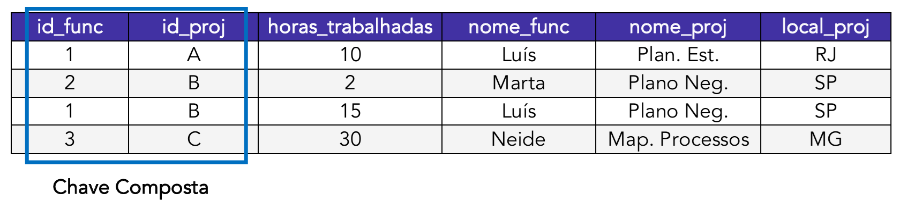

**1. Análise da Tabela e suas Dependências**

A chave primária desta tabela é a combinação de (`id_func`, `id_proj`), pois é a única forma de identificar unicamente cada linha (as horas que um funcionário específico trabalhou em um projeto específico).

Agora, vamos analisar como os atributos não-chave se relacionam com esta chave primária composta:

- **`horas_trabalhadas`:** Para saber as horas, precisamos saber **qual funcionário** (`id_func`) e **qual projeto** (`id_proj`). Portanto, `horas_trabalhadas` depende da **chave primária inteira**. Esta é uma dependência funcional total, o que é correto.
- **`nome_func`:** Para saber o nome do funcionário, precisamos apenas do `id_func`. O `id_proj` é irrelevante. Portanto, `nome_func` depende de **apenas uma parte** da chave primária. Esta é uma **dependência parcial**.
- **`nome_proj` e `local_proj`:** Para saber o nome e o local do projeto, precisamos apenas do `id_proj`. O `id_func` é irrelevante. Portanto, `nome_proj` e `local_proj` também dependem de **apenas uma parte** da chave primária. Esta é outra **dependência parcial**.

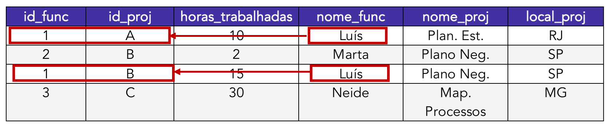

Essas dependências parciais criam redundância e anomalias. Note que o nome "Luís" está repetido. Se o nome de Luís precisasse ser corrigido, teríamos que alterá-lo em todas as linhas em que ele aparece, correndo o risco de inconsistência.

**2. Aplicando as Regras da 2FN (Decomposição)**

Para resolver as dependências parciais, decompomos a tabela original em tabelas menores, onde cada tabela agrupa os atributos que dependem da mesma chave (ou parte da chave).

- **Criamos a tabela `FUNCIONARIO`:** Retiramos os atributos que dependem apenas de `id_func` (`nome_func`) e os colocamos em uma nova tabela, onde `id_func` é a chave primária.

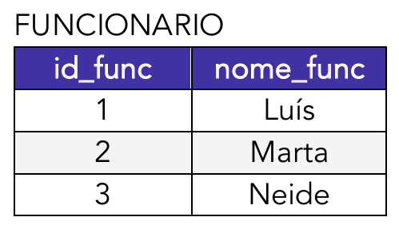

- **Criamos a tabela `PROJETO`:** Retiramos os atributos que dependem apenas de `id_proj` (`nome_proj`, `local_proj`) e os colocamos em uma nova tabela, onde `id_proj` é a chave primária.

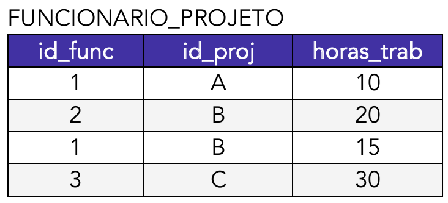

- **Ajustamos a tabela original:** O que sobra na tabela original são a chave primária composta (`id_func`, `id_proj`) e o atributo que depende totalmente dela (`horas_trab`). Esta tabela se torna uma tabela associativa que liga funcionários e projetos.

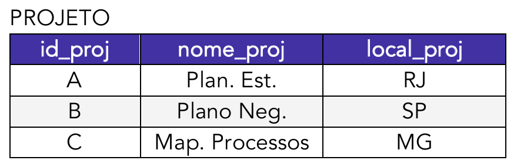

Ao final do processo, decompusemos a tabela original em três novas tabelas. A redundância foi eliminada (o nome de cada funcionário e de cada projeto agora está armazenado em um único lugar) e todas as tabelas resultantes estão na **Segunda Forma Normal**. Com a base de dados mais organizada, podemos avançar para a próxima etapa.

#### Terceira Forma Normal (3FN)

Após garantir que a tabela esteja na 1FN (valores atômicos) e na 2FN (sem dependências parciais), o próximo passo é alcançar a Terceira Forma Normal (3FN).

O objetivo da 3FN é **eliminar as dependências funcionais transitivas**. Para ser classificada nesta forma, a tabela deve atender a duas condições:

1. A tabela já deve estar na 2FN.
2. Nenhum atributo não-chave pode ser funcionalmente dependente de outro atributo não-chave.

Uma **dependência transitiva** ocorre quando temos a seguinte situação: a Chave Primária determina um Atributo A (que não é chave), e esse Atributo A determina um Atributo B (que também não é chave). Em outras palavras, `PK → Atributo_A → Atributo_B`. O Atributo B depende indiretamente da chave primária, através de outro atributo. A regra da 3FN diz que todos os atributos não-chave devem depender **diretamente e exclusivamente** da chave primária.

##### Estudo de Caso: Removendo Dependências Transitivas

Vamos analisar a seguinte tabela de funcionários, que já se encontra na 2FN (pois possui uma chave primária simples, `id_func`, e, portanto, não pode ter dependências parciais).

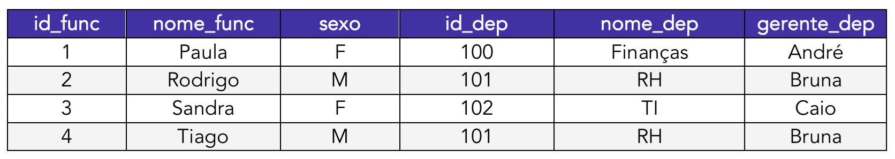

**1. Análise da Tabela e suas Dependências**

Apesar de estar na 2FN, esta tabela ainda apresenta redundância. Note que as informações do departamento de RH (nome "RH" e gerente "Bruna") se repetem para os funcionários Rodrigo e Tiago. Essa redundância é um sintoma de uma dependência transitiva e pode causar anomalias de atualização: se o gerente do RH mudar, seria preciso atualizar a linha de todos os funcionários daquele departamento.

Vamos analisar as dependências funcionais:

- A chave primária é `id_func`.
- Os atributos `nome_func`, `sexo` e `id_dep` dependem diretamente da chave primária `id_func` (para cada `id_func`, temos um único nome, sexo e ID de departamento).
- No entanto, os atributos `nome_dep` e `gerente_dep` **não dependem** da chave primária `id_func`. Eles dependem do `id_dep`.

Temos aqui uma clara dependência transitiva: `id_func` → `id_dep` → (`nome_dep`, `gerente_dep`).

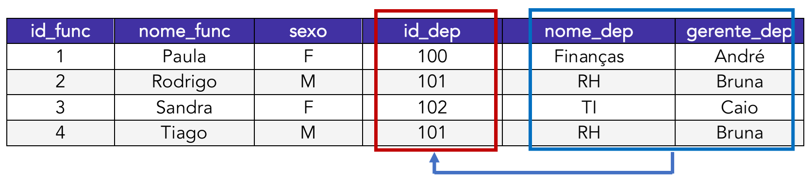

**2. Aplicando as Regras da 3FN (Decomposição)**

Para resolver a dependência transitiva, devemos mover os atributos transitivamente dependentes e o atributo do qual eles dependem para uma nova tabela.

- **Criamos a tabela `DEPARTAMENTOS`:** Criamos uma nova tabela para armazenar exclusivamente as informações sobre os departamentos. Ela conterá o `id_dep` como sua chave primária, e os atributos que dependem dele (`nome_dep`, `gerente_dep`).

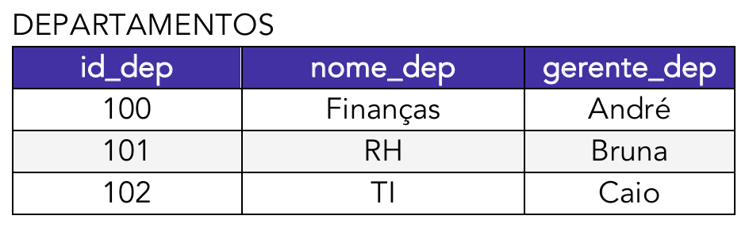

- **Ajustamos a tabela `FUNCIONÁRIOS`:** Na tabela original, removemos as colunas `nome_dep` e `gerente_dep`. A coluna `id_dep` é mantida, mas agora ela serve como uma **chave estrangeira (FK)** que aponta para a chave primária da nova tabela `DEPARTAMENTOS`, estabelecendo a relação entre um funcionário e seu departamento.

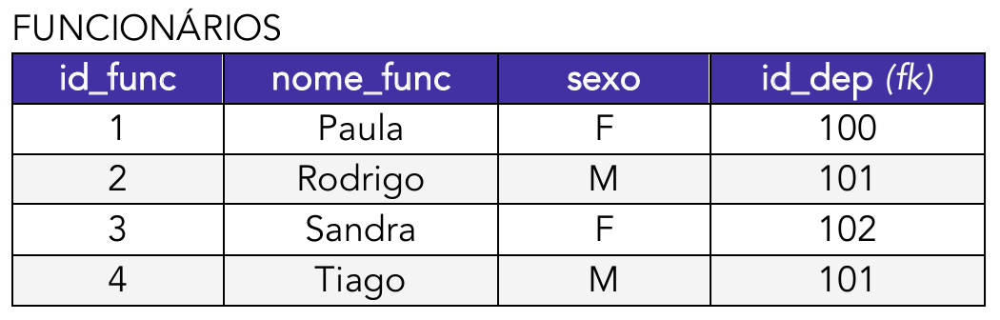

Com essa decomposição, eliminamos a dependência transitiva e a redundância. As informações de cada departamento agora estão armazenadas em um único local. Se o gerente de um departamento mudar, a alteração precisa ser feita em apenas um registro na tabela `DEPARTAMENTOS`.

Ambas as tabelas resultantes, `FUNCIONÁRIOS` e `DEPARTAMENTOS`, estão agora na **Terceira Forma Normal**. Para a grande maioria das aplicações de banco de dados, alcançar a 3FN é o objetivo principal da normalização, pois ela resolve as anomalias de atualização mais comuns, resultando em um design limpo, eficiente e consistente. Embora existam formas normais mais avançadas (BCNF, 4FN, 5FN) que lidam com casos de dependência mais complexos e raros, a 3FN é considerada o padrão para um bom projeto de banco de dados relacional.

#### Forma Normal de Boyce-Codd (FNBC)

A **Forma Normal de Boyce-Codd (FNBC ou BCNF, em inglês)** é uma versão mais estrita da Terceira Forma Normal. Por ser um refinamento da 3FN, ela é informalmente conhecida como **3.5FN**.

Para que uma tabela esteja na FNBC, ela deve atender a duas condições:

1. A tabela já deve estar na 3FN.
2. Para toda dependência funcional não-trivial `A → B`, o determinante `A` deve ser uma **superchave**.

Vamos detalhar esses conceitos:

- **Dependência Funcional:** Como vimos, é uma relação entre atributos. `A → B` ("A determina B") significa que para cada valor de A, existe apenas um valor correspondente de B. Por exemplo, `CPF → Nome`.
- **Superchave:** É qualquer conjunto de um ou mais atributos que, juntos, identificam unicamente uma linha na tabela. Uma chave primária é, por definição, uma superchave.

A regra da FNBC, em termos simples, diz que o único tipo de dependência permitida é aquela em que a chave "determina" o resto dos atributos. Nenhum atributo não-chave pode determinar outro atributo.

A maioria das tabelas que estão na 3FN também já se encontram na FNBC. As violações são raras e ocorrem em cenários específicos, geralmente quando há múltiplas chaves candidatas compostas e sobrepostas.

##### Estudo de Caso: Identificando uma Violação da FNBC

Para ilustrar um caso que viola a FNBC (mas não a 3FN), vamos imaginar um cenário de uma universidade onde:

- Cada aluno pode cursar várias disciplinas.
- Para cada disciplina que um aluno cursa, ele é auxiliado por um único professor (tutor).
- Cada professor (tutor) leciona apenas **uma** disciplina.

Poderíamos modelar isso em uma única tabela `ALUNO_TUTOR_DISCIPLINA`:

| id_aluno | disciplina | nome_professor |
| -------- | ---------- | -------------- |
| 10       | Matemática | Prof. Carlos   |
| 10       | Física     | Prof. Bia      |
| 20       | Matemática | Prof. Carlos   |
| 30       | Química    | Prof. Ana      |

Nesta tabela, a chave primária é a combinação de (`id_aluno`, `disciplina`), pois um aluno tem um único tutor por disciplina.

Vamos analisar as dependências funcionais:

1. `{id_aluno, disciplina} → nome_professor`: A chave primária inteira determina o professor. Isto está correto.
2. `nome_professor → disciplina`: Como cada professor leciona apenas uma disciplina, o nome do professor determina a disciplina.

**Esta tabela está na 3FN?** Sim. Não há dependências parciais. E `disciplina` não tem uma dependência transitiva da chave primária, pois o determinante (`nome_professor`) não é determinado pela chave.

**Mas ela viola a FNBC.** A dependência `nome_professor → disciplina` é o problema. O determinante `nome_professor` **não é uma superchave**. Ele não identifica unicamente uma linha (o Prof. Carlos aparece em duas linhas).

Essa violação causa anomalias. Se o Prof. Carlos decidir mudar sua disciplina de Matemática para Lógica, teríamos que atualizar todas as linhas de todos os alunos que ele tutela.

##### Aplicando as Regras da FNBC (Decomposição)

Para corrigir a violação, decompomos a tabela, isolando a dependência problemática:

**1. Criamos a tabela PROFESSOR_DISCIPLINA: Esta tabela armazena a informação de qual professor leciona qual disciplina:**

| nome_professor (PK) | disciplina |
| --- | --- |
| Prof. Carlos | Matemática |
| Prof. Bia | Física |
| Prof. Ana | Química |

**2. Ajustamos a tabela original, que agora é ALUNO_PROFESSOR:**

| id_aluno (FK) | nome_professor (FK) |
| --- | --- |
| 10 | Prof. Carlos |
| 10 | Prof. Bia |
| 20 | Prof. Carlos |
| 30 | Prof. Ana |

Agora, ambas as tabelas estão na FNBC. A redundância foi eliminada e, para alterar a disciplina de um professor, basta modificar um único registro na tabela `PROFESSOR_DISCIPLINA`.

Vamos analisar um segundo exemplo:

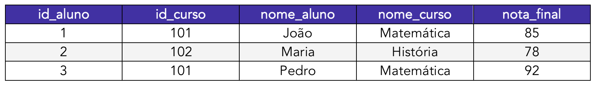

**1. Análise para a 1FN:** A tabela está na Primeira Forma Normal. Todos os atributos são atômicos; cada célula contém um único valor.
**2. Análise para a 2FN:** A chave primária que identifica unicamente a nota de um aluno em um curso é a chave composta (`id_aluno`, `id_curso`).

Agora, identificamos as dependências funcionais:

- `{id_aluno, id_curso} → nota_final`: A nota final depende da chave inteira. (Dependência total - OK).
- `id_aluno → nome_aluno`: O nome do aluno depende apenas de parte da chave (`id_aluno`). (**Dependência Parcial** - Violação da 2FN).
- `id_curso → nome_curso`: O nome do curso depende apenas de parte da chave (`id_curso`). (**Dependência Parcial** - Violação da 2FN).

Para resolver isso, decompomos a tabela:

- **Tabela `ALUNOS`:** `{id_aluno (PK), nome_aluno}`
- **Tabela `CURSOS`:** `{id_curso (PK), nome_curso}`
- **Tabela `MATRICULAS`:** `{id_aluno (FK), id_curso (FK), nota_final}`. A chave primária desta tabela é a combinação `{id_aluno, id_curso}`.

**3. Análise para a 3FN e FNBC:** Agora, analisamos as três tabelas resultantes:

- **Tabelas `ALUNOS` e `CURSOS`:** Ambas possuem chaves primárias simples. Como já estão na 1FN, elas automaticamente cumprem a 2FN e a 3FN (pois não há como ter dependências parciais ou transitivas). Elas também cumprem a FNBC, pois a única dependência funcional em cada uma (`id_aluno → nome_aluno` e `id_curso → nome_curso`) tem como determinante uma superchave (a própria chave primária).
- **Tabela `MATRICULAS`:** Esta é a tabela mais interessante. Sua chave primária é `{id_aluno, id_curso}`. O único atributo não-chave é `nota_final`. A única dependência funcional não-trivial é `{id_aluno, id_curso} → nota_final`.
    - Esta tabela está na 3FN? Sim. Não há dependências transitivas.
    - **Esta tabela está na FNBC?** Sim. Para a única dependência funcional que ela possui, o determinante `{id_aluno, id_curso}` é uma superchave (é a chave primária da tabela).

Portanto, o exemplo das imagens, após ser corretamente normalizado até a 3FN, resulta em um conjunto de tabelas que também satisfazem as regras da Forma Normal de Boyce-Codd.

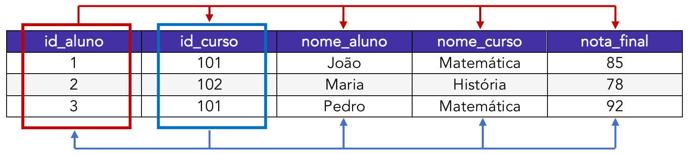

O diagrama acima ilustra as dependências na tabela original não normalizada. As setas vermelhas indicam as dependências da chave primária para os atributos, enquanto as setas azuis indicam as dependências parciais de partes da chave para outros atributos. A normalização correta separa essas dependências em tabelas distintas e bem estruturadas.

##### As Regras de Inferência para Dependências Funcionais

As regras de inferência, mais conhecidas como **Axiomas de Armstrong**, são um conjunto de regras formais que formam a base teórica para a análise de dependências funcionais. Elas nos permitem, a partir de um conjunto conhecido de dependências, descobrir (ou "inferir") todas as outras dependências que são logicamente implicadas por elas.

Embora seja um tópico de teoria de bancos de dados mais aprofundado, compreender os três axiomas principais ajuda a solidificar o porquê das regras de normalização, especialmente a 3FN.

|Regra|Descrição|
|---|---|
|**Reflexividade**|Se B é um subconjunto de A, então A → B.|
|**Aumentatividade**|Se A → B, então AC → BC.|
|**Transitividade**|Se A → B e B → C, então A → C.|
|**Autodeterminação**|A → A.|
|**Decomposição**|Se A → BC, então A → B e A → C.|
|**União**|Se A → B e A → C, então A → BC.|
|**Composição**|Se A → B e C → D, então AC → BD.|
|**Unificação**|Se A → B e C → D, então A ∪ ( C – B ) → BD.|

**Explicando os Axiomas Principais:**

- **Axioma da Reflexividade:** Esta é uma regra trivial que afirma que qualquer conjunto de atributos determina a si mesmo ou a qualquer um de seus subconjuntos.
    - **Exemplo:** O conjunto de atributos `{CPF, Nome}` obviamente determina o atributo `{Nome}`.

- **Axioma da Aumentatividade:** Afirma que, se temos uma dependência funcional, podemos adicionar o mesmo atributo a ambos os lados e a dependência ainda será válida.
    - **Exemplo:** Se sabemos que `CPF → Nome`, então também é verdade que `{CPF, Endereço} → {Nome, Endereço}`.

- **Axioma da Transitividade:** Este é o mais importante para a normalização. Ele afirma que as dependências funcionais são transitivas.
    - **Exemplo:** Se `id_func → id_dep` (o ID do funcionário determina seu departamento) e `id_dep → nome_dep` (o ID do departamento determina o nome do departamento), então, por transitividade, `id_func → nome_dep`. É exatamente esta dependência transitiva que a Terceira Forma Normal (3FN) visa eliminar.

As outras regras, como a **União** e a **Decomposição**, são derivadas desses três axiomas principais e são extremamente úteis na prática para simplificar e analisar conjuntos de dependências.

#### Quarta Forma Normal (4FN)

Após atingir a 3FN e a FNBC, que lidam com dependências funcionais, o processo de normalização pode avançar para tratar de um tipo diferente de dependência: a **dependência multivalorada**. A Quarta Forma Normal (4FN) tem como objetivo eliminar esse tipo de dependência.

Para que uma tabela esteja na 4FN, ela deve atender a duas condições:

1. A tabela já deve estar na Forma Normal de Boyce-Codd (FNBC).
2. A tabela não deve conter dependências multivaloradas não-triviais.

É importante não confundir os conceitos:

| FORMA NORMAL | OBJETIVO PRINCIPAL                                 |
| ------------ | -------------------------------------------------- |
| **1FN**      | Eliminar atributos **multivalorados** e compostos. |
| **3FN**      | Eliminar dependências **transitivas**.             |
| **4FN**      | Eliminar dependências **multivaloradas**.          |

##### O Que é uma Dependência Multivalorada?

Uma **dependência multivalorada (DMV)** ocorre em uma tabela com pelo menos três atributos (digamos A, B e C), quando um único valor do atributo A está associado a um conjunto de valores do atributo B e a um conjunto de valores do atributo C, e, crucialmente, os valores de B e C são **independentes entre si**.

A notação para uma DMV é `A →→ B` ("A multidetermina B").

O problema surge quando tentamos armazenar dois ou mais fatos independentes e multivalorados sobre a mesma entidade (A) em uma única tabela. Para manter os dados consistentes, somos forçados a criar linhas para todas as combinações possíveis, gerando uma grande redundância e anomalias de atualização.

##### Estudo de Caso: Removendo Dependências Multivaloradas

Imagine uma tabela que armazena os cursos que um aluno faz e os hobbies que ele pratica. Um aluno pode fazer vários cursos e ter vários hobbies, e seus cursos não têm nenhuma relação com seus hobbies.

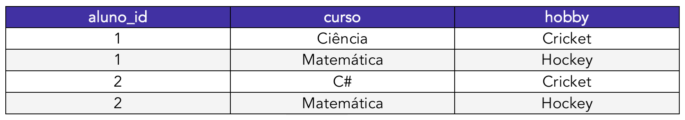

**1. Análise da Tabela**

Esta tabela está na FNBC. Sua única chave candidata é a combinação dos três atributos (`aluno_id`, `curso`, `hobby`), e não há outras dependências funcionais. No entanto, ela possui um problema de design evidente.

Para registrar que o aluno 1, que faz "Ciência" e "Matemática", também pratica "Cricket" e "Hockey", precisamos de quatro linhas para representar todas as combinações. Se quisermos adicionar um novo hobby, "Natação", para o aluno 1, precisaríamos adicionar duas novas linhas: `(1, Ciência, Natação)` e `(1, Matemática, Natação)`. Esta é uma clara anomalia de inserção e atualização.

O problema fundamental é que estamos misturando dois fatos independentes em uma única tabela:

- Fato 1: Um aluno faz um conjunto de cursos.
- Fato 2: Um aluno tem um conjunto de hobbies.

Isso nos leva a identificar duas dependências multivaloradas:

- `aluno_id →→ curso`
- `aluno_id →→ hobby`

**2. Aplicando as Regras da 4FN (Decomposição)**

A solução para eliminar dependências multivaloradas é sempre a mesma: **separar os fatos independentes em suas próprias tabelas**.

- **Criamos a tabela `ALUNO_CURSO`:** Esta tabela armazena apenas a relação entre alunos e cursos.

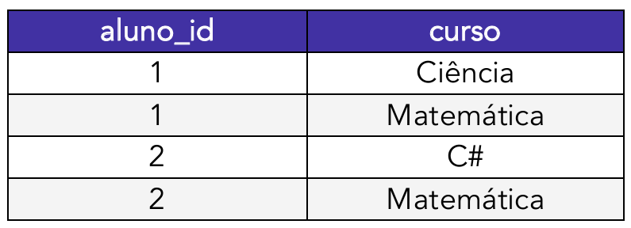

- **Criamos a tabela `ALUNO_HOBBY`:** Esta tabela armazena apenas a relação entre alunos e seus hobbies.

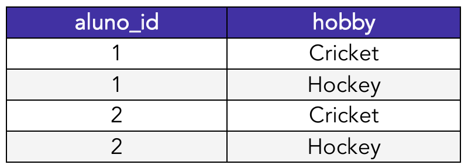

Com essa decomposição, a redundância é eliminada. Para adicionar o hobby "Natação" ao aluno 1, agora só precisamos inserir uma única linha na tabela `ALUNO_HOBBY`: `(1, Natação)`. As duas tabelas resultantes estão agora na **Quarta Forma Normal**.

Embora os cenários que violam a 4FN sejam menos comuns que os das formas normais anteriores, identificá-los e corrigi-los é essencial para criar um modelo de dados verdadeiramente robusto e livre de redundâncias.

#### Quinta Forma Normal (5FN): Eliminando Dependências de Junção

Chegamos à etapa final da normalização clássica: a **Quinta Forma Normal (5FN)**, também conhecida como **Project-Join Normal Form (PJ/NF)**. Esta é a forma normal mais avançada e teórica, projetada para lidar com um tipo raro e sutil de redundância que as formas anteriores não conseguem resolver.

Para que uma tabela esteja na 5FN, ela deve atender a duas condições:

1. A tabela já deve estar na 4FN.
2. A tabela não deve conter **dependências de junção** (_join dependencies_) que permitam uma decomposição sem perdas.

##### O Que é uma Dependência de Junção?

Uma dependência de junção é uma restrição mais generalizada do que as dependências que vimos até agora. Uma tabela possui uma dependência de junção se ela puder ser decomposta em múltiplas tabelas menores e, posteriormente, ser perfeitamente reconstruída através da junção (_join_) dessas tabelas menores, sem gerar nenhuma linha a mais ou a menos.

A 5FN afirma que, se essa "decomposição sem perdas" é possível, ela **deve** ser feita para eliminar a redundância de dados.

##### Estudo de Caso: O Cenário Fornecedor-Projeto-Peça

As violações da 5FN são raras na prática e geralmente ocorrem em tabelas que representam relacionamentos complexos entre três ou mais entidades. O exemplo clássico envolve Fornecedores, Projetos e Peças.

Imagine uma tabela única `Fornecimentos` que registra qual fornecedor fornece qual peça para qual projeto.

Tabela `Fornecimentos` (Não está na 5FN):

| FORNECEDOR | PROJETO | PEÇA |
| --- | --- | --- |
| Fornecedor A | Projeto Alfa | Parafuso |
| Fornecedor A | Projeto Alfa | Porca |
| Fornecedor B | Projeto Beta | Parafuso |
| Fornecedor A | Projeto Beta | Parafuso |

Agora, vamos adicionar uma regra de negócio complexa: "Se um fornecedor está habilitado a fornecer uma certa peça, e um projeto requer essa mesma peça, e esse fornecedor está alocado para esse projeto, então o fornecedor deve, obrigatoriamente, fornecer essa peça para esse projeto".

Nesta tabela única, estamos armazenando três fatos diferentes de forma interligada, o que gera redundância:

1. Quais fornecedores fornecem quais peças.
2. Quais projetos usam quais peças.
3. Quais fornecedores trabalham em quais projetos.

A informação de que o `Fornecedor A` fornece `Parafuso` está implicitamente repetida em duas linhas.

##### Aplicando as Regras da 5FN (Decomposição)

A dependência de junção nesta tabela nos permite decompô-la em três tabelas menores, cada uma representando um dos fatos independentes, sem perda de informação.

- Tabela 1: `FORNECEDOR_PECA`

| FORNECEDOR | PEÇA |
| --- | --- |
| Fornecedor A | Parafuso |
| Fornecedor A | Porca |
| Fornecedor B | Parafuso |

- Tabela 2: `PROJETO_PECA`

| PROJETO | PEÇA |
| --- | --- |
| Projeto Alfa | Parafuso |
| Projeto Alfa | Porca |
| Projeto Beta | Parafuso |

- Tabela 3: `FORNECEDOR_PROJETO`

| FORNECEDOR | PROJETO |
| --- | --- |
| Fornecedor A | Projeto Alfa |
| Fornecedor B | Projeto Beta |
| Fornecedor A | Projeto Beta |

Se realizarmos uma junção natural (_natural join_) entre essas três tabelas, reconstruiremos a tabela `Fornecimentos` original perfeitamente. Com a decomposição, eliminamos a redundância. A informação de que "Fornecedor A fornece Parafuso" agora existe em um único lugar.

As novas tabelas estão agora na **Quinta Forma Normal**.

É importante reforçar, como mencionado nas anotações, que a 4FN e a 5FN lidam com cenários de modelagem muito específicos. Na grande maioria dos projetos de banco de dados do mundo real, um design que atinge a Terceira Forma Normal (3FN) ou a FNBC já é considerado totalmente normalizado, robusto e livre das anomalias de dados mais prejudiciais.

