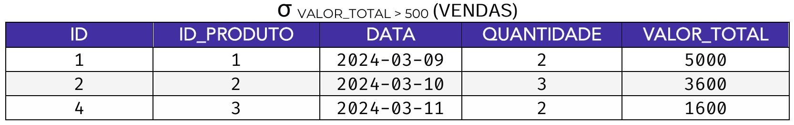
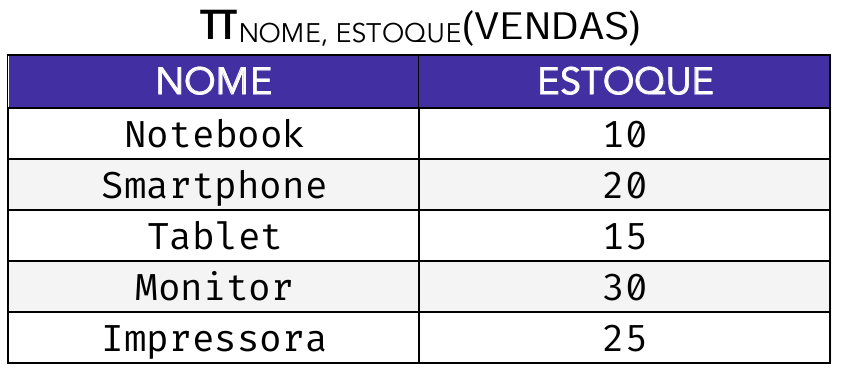

# Capítulo 3 – Álgebra Relacional

Nos capítulos anteriores, exploramos os "o quês" e os "porquês" do design de bancos de dados. Agora, antes de mergulharmos na linguagem SQL para aprender "como" interagir com os dados, é fundamental compreendermos a sua base teórica. A **Álgebra Relacional** é uma linguagem de consulta formal, baseada em fundamentos matemáticos, que nos permite descrever operações sobre relações (tabelas).

Pense na álgebra relacional como a "gramática" por trás do SQL. Ela nos fornece um conjunto de operadores (seleção, projeção, junção, etc.) que atuam sobre uma ou mais tabelas para produzir uma nova tabela como resultado, sem nunca alterar as tabelas originais. Dominar seus conceitos não só é essencial para resolver questões teóricas, mas também para desenvolver uma compreensão mais profunda de como os SGBDs processam e otimizam as consultas que escrevemos em SQL.

Para tornar nosso estudo mais prático, utilizaremos ao longo deste capítulo duas tabelas de exemplo que representam um cenário simples de vendas em uma loja.

**Tabela `PRODUTOS`**

<div align="center">

</div>

**Tabela `VENDAS`**

<div align="center">

</div>

## Seleção (σ): Filtrando as Linhas

A **seleção** é uma das operações fundamentais e mais intuitivas da álgebra relacional. Sua função é filtrar as tuplas (linhas) de uma relação, retornando um subconjunto de linhas que satisfazem uma determinada condição lógica (predicado). Ela funciona como um "fatiador" horizontal, que seleciona apenas as linhas de interesse, mas mantém todas as suas colunas originais.

A notação formal para a operação de seleção é:

σ<sub>[predicado]</sub>(R)

Onde:

- **σ** (a letra grega sigma) é o símbolo que representa a operação de seleção.
- **`[predicado]`** é a condição de seleção, a regra que será aplicada a cada linha da tabela.
- **(R)** é a relação (a tabela) sobre a qual a operação será executada.

O predicado pode ser composto por comparações (`=`, `≠`, `>`, `<`, `>=`, `<=`) e pode combinar múltiplas condições usando os operadores lógicos `∧` (E), `∨` (OU) e `¬` (NÃO).

#### Exemplos de Seleção

Vamos aplicar a operação de seleção em nossa tabela `VENDAS`.

**Exemplo 1: Selecionar vendas com valor total maior que 500.**

A expressão em álgebra relacional para esta consulta seria:

σ<sub>VALOR_TOTAL>500</sub>(VENDAS)

O SGBD aplicaria a condição `VALOR_TOTAL > 500` a cada uma das linhas da tabela `VENDAS`. O resultado seria uma nova tabela contendo apenas as linhas que satisfazem essa condição, com todas as suas colunas originais.

<div align="center">

</div>

**Exemplo 2: Selecionar vendas do produto de ID 4 que ocorreram na data '2024-03-10'.**

Aqui, precisamos combinar duas condições com o operador E (`∧`).

σ<sub>(ID_PRODUTO=4)∧(DATA=′2024−03−10′)</sub>​(VENDAS)

O resultado desta operação seria a seguinte tabela:

|ID|ID_PRODUTO|DATA|QUANTIDADE|VALOR_TOTAL|
|---|---|---|---|---|
|3|4|2024-03-10|1|500|

#### Relação com o SQL

A operação de seleção da álgebra relacional tem uma correspondência direta e fundamental com a cláusula **`WHERE`** da linguagem SQL. A expressão σ<sub>[predicado]</sub>(R) é a base teórica para o comando `SELECT * FROM R WHERE <predicado>;`.

A expressão σ<sub>VALOR_TOTAL>500</sub>(VENDAS) é equivalente a:

```sql
SELECT * FROM VENDAS WHERE VALOR_TOTAL > 500;
```

## Projeção (π): Selecionando as Colunas

Enquanto a operação de seleção atua como um "fatiador horizontal" que filtra as linhas de uma tabela, a **projeção** funciona como um "fatiador vertical". Sua finalidade é selecionar um subconjunto de atributos (colunas) de uma relação, descartando as colunas desnecessárias e gerando uma nova tabela com uma estrutura mais enxuta.

A projeção é extremamente útil para criar visões simplificadas dos dados, mostrando apenas a informação relevante para uma determinada tarefa ou relatório.

A notação formal para a operação de projeção é:

π<sub>[lista_de_atributos]​</sub>(R)

Onde:

- **π** (a letra grega pi) é o símbolo que representa a operação de projeção.
- **`[lista_de_atributos]`** é a lista de colunas, separadas por vírgula, que desejamos manter no resultado.
- **(R)** é a relação (a tabela) sobre a qual a operação será executada.

Um conceito fundamental da álgebra relacional é que o resultado de qualquer operação é sempre uma **relação** válida. E, como vimos no início do capítulo, uma relação é um _conjunto_ de tuplas, o que, por definição, significa que **não pode conter linhas duplicadas**.

Portanto, se a operação de projeção resultar em linhas idênticas, as duplicatas são automaticamente eliminadas, restando apenas uma ocorrência de cada linha.

### Exemplos de Projeção

Vamos aplicar a operação de projeção em nossas tabelas de exemplo.

**Exemplo 1: Listar o nome e o estoque de todos os produtos.**

Queremos selecionar apenas as colunas `NOME` e `ESTOQUE` da tabela `PRODUTOS`.

A expressão em álgebra relacional seria:

π<sub>NOME,ESTOQUE​</sub>(PRODUTOS)

O resultado é uma nova tabela contendo apenas as duas colunas especificadas, com todas as linhas da tabela original.

<div align="center">

</div>

**Exemplo 2: Listar os IDs de todos os produtos que foram vendidos (demonstrando a eliminação de duplicatas).**

Queremos saber quais produtos únicos foram vendidos, então vamos projetar apenas a coluna `ID_PRODUTO` da tabela `VENDAS`.

A expressão seria:

π<sub>ID_PRODUTO</sub>​(VENDAS)

Analisando a coluna `ID_PRODUTO` na tabela `VENDAS`, os valores são `(1, 2, 4, 3, 2)`. Como o resultado deve ser uma relação (um conjunto), o valor duplicado `2` é eliminado. O resultado final será:

|ID_PRODUTO|
|---|
|1|
|2|
|4|
|3|

### Combinando Seleção e Projeção

O verdadeiro poder da álgebra relacional surge ao combinar operadores. Podemos, por exemplo, primeiro filtrar as linhas com uma seleção e, em seguida, extrair as colunas de interesse do resultado com uma projeção.

**Exemplo 3: Listar o nome e o preço dos produtos que custam mais de R$ 1000.**

**Passo 1 (Seleção):** Primeiro, filtramos a tabela `PRODUTOS` para encontrar apenas as linhas desejadas.

TEMP ← σ<sub>PRECO>1000</sub>(PRODUTOS)

**Passo 2 (Projeção):** Em seguida, projetamos as colunas `NOME` e `PREÇO` da tabela temporária resultante.

RESULTADO ← π<sub>NOME,PRECO</sub>(TEMP)

A expressão completa, aninhando as operações, seria:

π<sub>NOME,PRECO</sub>(σ<sub>PRECO>1000</sub>(PRODUTOS))

O resultado seria a seguinte tabela:

|NOME|PREÇO|
|---|---|
|Notebook|2500|
|Smartphone|1200|

### Relação com o SQL

A operação de projeção da álgebra relacional corresponde diretamente à lista de colunas na cláusula **`SELECT`** do SQL.

A expressão π<sub>NOME,ESTOQUE​</sub>(PRODUTOS) é equivalente a:

```sql
SELECT NOME, ESTOQUE FROM PRODUTOS;
```

Contudo, há uma diferença importante: por padrão, o `SELECT` do SQL **não elimina linhas duplicadas**. Para simular o comportamento exato da projeção e garantir um resultado sem duplicatas, é necessário usar a palavra-chave **`DISTINCT`**.

A expressão π<sub>ID_PRODUTO​</sub>(PRODUTOS) é equivalente a:

```sql
SELECT DISTINCT ID_PRODUTO FROM VENDAS;
```

## Operações de Conjunto: Combinando Tabelas

Até agora, nossas operações de seleção e projeção foram **unárias**, ou seja, atuaram sobre uma única relação de cada vez. No entanto, o verdadeiro poder da álgebra relacional, e a razão pela qual a normalização é viável, reside em sua capacidade de combinar informações que foram distribuídas em várias tabelas.

As operações que atuam sobre duas relações são chamadas de **operações binárias**. Elas sempre seguem uma lógica "dois a dois": mesmo que uma consulta complexa envolva dezenas de tabelas, o SGBD a decompõe em uma sequência de operações binárias.

As operações binárias mais fundamentais são baseadas na teoria de conjuntos da matemática, que pode ser visualizada através dos Diagramas de Venn.

<div align="center">

</div>

### Compatibilidade de União

Para que as operações de conjunto (União, Interseção e Diferença) possam ser aplicadas, as duas relações envolvidas devem ser **compatíveis em união** (_union-compatible_). Isso significa que duas condições rigorosas devem ser atendidas:

1. **Mesmo Grau:** As duas tabelas devem ter o **mesmo número de atributos** (colunas).
2. **Domínios Compatíveis:** O domínio (tipo de dado) de cada coluna correspondente deve ser o mesmo ou compatível. A primeira coluna da Tabela A deve ser do mesmo tipo da primeira coluna da Tabela B, a segunda com a segunda, e assim por diante.

## União (∪)

A **união** é uma operação binária que combina todas as tuplas (linhas) de duas relações compatíveis em união em uma única tabela resultante. Se uma tupla existir em ambas as tabelas originais, ela aparecerá **apenas uma vez** no resultado, pois, como vimos, uma relação é um conjunto e não permite duplicatas.

<div align="center">

</div>

A notação formal para a operação de união é:

R ∪ S

Onde:

- **R** e **S** são as duas relações (tabelas) compatíveis em união.
- **∪** é o símbolo que representa a operação de união.

### Exemplo de União

As tabelas `PRODUTOS` e `VENDAS` do nosso exemplo **não são** compatíveis em união (elas têm número e tipos de colunas diferentes). Portanto, vamos imaginar um novo cenário: uma empresa possui duas filiais e armazena os dados de seus clientes em tabelas separadas, mas com a mesma estrutura.

**Tabela CLIENTES_SP**

| ID | NOME |
| --- | --- |
| 1 | Ana |
| 2 | Bruno |

**Tabela CLIENTES_RJ**

| ID | NOME |
| --- | --- |
| 2 | Bruno |
| 3 | Carla |

Para obter uma lista única de todos os clientes da empresa, aplicamos a operação de união:

CLIENTES_SP ∪ CLIENTES_RJ

O resultado seria uma nova tabela contendo todos os clientes, com a linha duplicada de "Bruno" aparecendo apenas uma vez:

|ID|NOME|
|---|---|
|1|Ana|
|2|Bruno|
|3|Carla|

### Relação com o SQL

A operação de união da álgebra relacional corresponde diretamente ao operador **`UNION`** em SQL.

A expressão CLIENTES_SP ∪ CLIENTES_RJ é equivalente a:

```sql
SELECT ID, NOME FROM CLIENTES_SP
UNION
SELECT ID, NOME FROM CLIENTES_RJ;
```

O SQL também oferece o operador **`UNION ALL`**, que funciona de forma semelhante, mas **não elimina as linhas duplicadas**. Ele é mais rápido, pois não precisa verificar a existência de duplicatas, e é útil quando se deseja a junção literal de todos os registros.

### União vs. Junção (Join)

É muito importante não confundir a operação de **União** com a operação de **Junção (Join)**, que veremos mais adiante.

- A **União** "empilha" os dados de duas tabelas que possuem a **mesma estrutura de colunas**, criando um resultado com mais linhas.
- A **Junção** "combina" os dados de duas tabelas lado a lado com base em uma condição de correspondência, criando um resultado com mais colunas.

## Interseção (∩)

A **interseção** é uma operação binária que, assim como a união, opera sobre duas relações (tabelas) que sejam **compatíveis em união** (mesmo número de colunas e tipos de dados compatíveis).

O resultado da interseção é uma nova relação contendo apenas as tuplas (linhas) que existem **em ambas** as tabelas originais. É a representação do que os dois conjuntos de dados têm em comum.

<div align="center">

</div>

A notação formal para a operação de interseção é:

R ∩ S

Onde:

- **R** e **S** são as duas relações (tabelas) compatíveis em união.
- **∩** é o símbolo que representa a operação de interseção.

### Exemplo de Interseção

Como nossas tabelas `PRODUTOS` e `VENDAS` não são compatíveis em união, vamos a um novo cenário. Imagine que uma empresa mantém duas listas de funcionários: uma de `FUNCIONARIOS_PROMOVIDOS` no último semestre e outra de `FUNCIONARIOS_TREINAMENTO_LIDERANCA` que participaram de um curso específico. Ambas as tabelas têm a mesma estrutura.

**Tabela FUNCIONARIOS_PROMOVIDOS**

| ID | NOME |
| --- | --- |
| 10 | Beatriz |
| 20 | Carlos |
| 30 | Diana |

**Tabela FUNCIONARIOS_TREINAMENTO_LIDERANCA**

| ID | NOME |
| --- | --- |
| 20 | Carlos |
| 40 | Eduardo |
| 50 | Fernanda |

Para descobrir quais funcionários foram promovidos **E** também participaram do treinamento de liderança, aplicamos a operação de interseção:

FUNCIONARIOS_PROMOVIDOS ∩ FUNCIONARIOS_TREINAMENTO_LIDERANCA

O resultado será uma nova tabela contendo apenas os funcionários que aparecem em ambas as listas:

|ID|NOME|
|---|---|
|20|Carlos|

### Relação com o SQL

A operação de interseção da álgebra relacional corresponde diretamente ao operador **`INTERSECT`** em SQL.

A expressão FUNCIONARIOS_PROMOVIDOS ∩ FUNCIONARIOS_TREINAMENTO_LIDERANCA é equivalente a:

```sql
SELECT ID, NOME FROM FUNCIONARIOS_PROMOVIDOS
INTERSECT
SELECT ID, NOME FROM FUNCIONARIOS_TREINAMENTO_LIDERANCA;
```

### Interseção vs. Junção Interna (Inner Join)

É muito comum confundir a operação de **Interseção** de conjuntos com a operação de **Junção Interna (Inner Join)**.

- A **Interseção** compara **linhas inteiras** de duas tabelas com a **mesma estrutura** e retorna as linhas que são idênticas em ambas.
- A **Junção Interna** combina **colunas** de duas tabelas (geralmente com estruturas diferentes) com base em uma **condição de correspondência** em uma ou mais colunas, retornando um novo conjunto de linhas "mais largas".

## Diferença (-)

A **diferença** é a terceira operação de conjunto da álgebra relacional. Assim como a união e a interseção, ela exige que as duas relações sejam **compatíveis em união**.

O resultado da operação de diferença `R - S` é uma nova relação contendo todas as tuplas (linhas) que estão presentes na **primeira relação (R)**, mas que **não estão** presentes na **segunda relação (S)**.

É crucial entender que, ao contrário da união e da interseção, a operação de diferença **não é comutativa**, ou seja, a ordem das tabelas importa. O resultado de `R - S` é completamente diferente do resultado de `S - R`.

<div align="center">

</div>

A notação formal para a operação de diferença é:

R − S

Onde:

- **R** e **S** são as duas relações (tabelas) compatíveis em união.
- **−** é o símbolo que representa a operação de diferença.

### Exemplo de Diferença

Vamos continuar com o cenário da empresa. Temos a lista de todos os `FUNCIONARIOS` e a lista dos `FUNCIONARIOS_PROMOVIDOS`. Queremos descobrir quais funcionários **não foram** promovidos.

**Tabela FUNCIONARIOS**

| ID | NOME |
| --- | --- |
| 10 | Beatriz |
| 20 | Carlos |
| 30 | Diana |
| 40 | Eduardo |

Tabela FUNCIONARIOS_PROMOVIDOS

| ID | NOME |
| --- | --- |
| 10 | Beatriz |
| 30 | Diana |

Para obter a lista dos não promovidos, aplicamos a operação de diferença:

FUNCIONARIOS − FUNCIONARIOS_PROMOVIDOS

O resultado será uma nova tabela contendo apenas os funcionários que estão na primeira tabela, mas não na segunda:

|ID|NOME|
|---|---|
|20|Carlos|
|40|Eduardo|

### Relação com o SQL

A operação de diferença da álgebra relacional corresponde ao operador **`EXCEPT`** no padrão SQL (ou **`MINUS`** no SGBD Oracle).

A expressão FUNCIONARIOS - FUNCIONARIOS_PROMOVIDOS é equivalente a:

```sql
SELECT ID, NOME FROM FUNCIONARIOS
EXCEPT
SELECT ID, NOME FROM FUNCIONARIOS_PROMOVIDOS;
```

### Resolvendo o Problema de "Produtos Não Vendidos"

Considerando as tabelas de exemplo iniciais, podemos nos questionar: "como encontrar os produtos que não foram vendidos?". Como as tabelas `PRODUTOS` e `VENDAS` não são compatíveis em união, não podemos usar o operador de diferença diretamente.

No entanto, podemos resolver este problema combinando os operadores da álgebra relacional que já aprendemos:

**Primeiro, projetamos os IDs de todos os produtos existentes:**

TODOS_PRODUTOS ← π<sub>ID</sub>(PRODUTOS)

O resultado é a relação com os IDs: `{1, 2, 3, 4, 5}`.

**Segundo, projetamos os IDs de todos os produtos que foram vendidos:**

PRODUTOS_VENDIDOS ← π<sub>ID_PRODUTO</sub>(VENDAS)

O resultado é a relação com os IDs: `{1, 2, 4, 3}`.

**Agora, as duas relações resultantes são compatíveis em união!** Podemos aplicar a operação de diferença sobre elas:

IDS_NAO_VENDIDOS ← TODOS_PRODUTOS − PRODUTOS_VENDIDOS

O resultado seria a relação com o ID `{5}`.

Para obter a linha completa do produto "Impressora", como mostrado na imagem abaixo, seria necessário um passo final de junção, que veremos posteriormente.

<div align="center">

</div>

Em SQL, este problema é geralmente resolvido de forma mais direta com subconsultas (`NOT IN`) ou junções externas (`LEFT JOIN`), que são, na prática, implementações otimizadas dessa lógica fundamental da álgebra relacional.

## Produto Cartesiano (×)

O **produto cartesiano** é uma operação binária da álgebra relacional que combina **cada tupla** de uma primeira relação com **cada tupla** de uma segunda relação. O resultado é uma nova tabela que contém todas as combinações possíveis de linhas entre as duas tabelas originais.

Esta operação pode ser vista como uma "multiplicação" de tabelas:

- O número de **colunas** da tabela resultante é a **soma** do número de colunas das tabelas originais.
- O número de **linhas** da tabela resultante é o **produto** do número de linhas das tabelas originais.

A notação formal para a operação de produto cartesiano é:

R × S

Onde:

- **R** e **S** são as duas relações (tabelas).
- **×** é o símbolo que representa a operação de produto cartesiano.

### Exemplo de Produto Cartesiano

Para ilustrar de forma clara, vamos utilizar duas novas tabelas simples: uma que lista modelos de camisetas e outra que lista as cores disponíveis.

**Tabela `CAMISETAS` (3 linhas)**

<div align="center">

</div>

**Tabela `CORES` (2 linhas)**

<div align="center">

</div>

Se aplicarmos a operação `CAMISETAS × CORES`, o resultado será uma nova tabela com 3 × 2 = 6 linhas e 2 + 1 = 3 colunas. A operação funciona da seguinte forma:

1. Pega a primeira linha de `CAMISETAS` ("Ardidas", "Regata") e combina com cada linha de `CORES`.
2. Pega a segunda linha de `CAMISETAS` ("Ardidas", "Manga longa") e combina com cada linha de `CORES`.
3. Pega a terceira linha de `CAMISETAS` ("Naique", "Social") e combina com cada linha de `CORES`.

O resultado final é a tabela com todas as combinações possíveis:

<div align="center">

</div>

### O Produto Cartesiano como Base para a Junção

É fundamental entender que o produto cartesiano, por si só, raramente gera um resultado útil, pois ele combina linhas que não têm nenhuma relação lógica entre si. Sua verdadeira importância é teórica: ele é o **bloco de construção fundamental para a operação de Junção (Join)**, que veremos a seguir.

Conceitualmente, uma Junção nada mais é do que um **Produto Cartesiano seguido por uma operação de Seleção**. Primeiro, o sistema gera todas as combinações possíveis de linhas (produto cartesiano) e, em seguida, ele filtra apenas as linhas em que a condição de junção é verdadeira (seleção).

### Relação com o SQL

Em SQL, o produto cartesiano é representado pela cláusula **`CROSS JOIN`**.

A expressão `CAMISETAS × CORES` é equivalente a:

```sql
SELECT * FROM CAMISETAS CROSS JOIN CORES;
```

Um erro muito comum entre iniciantes em SQL é esquecer a condição de junção na cláusula `WHERE` ao listar múltiplas tabelas no `FROM` (ex: `SELECT * FROM PRODUTOS, VENDAS;`). Quando isso ocorre, o SGBD executa um produto cartesiano completo. Em tabelas grandes, isso pode gerar bilhões ou trilhões de linhas, consumindo todos os recursos do servidor e travando o sistema. Portanto, embora seja um conceito fundamental, sua aplicação direta deve ser feita com muito cuidado.

## Junção (⋈)

A **junção (_join_)** é a operação que nos permite combinar informações de duas ou mais tabelas com base em uma condição de relacionamento entre elas. É a operação fundamental que utilizamos para reconstruir as informações que foram logicamente separadas durante o processo de normalização.

Enquanto o produto cartesiano combina todas as linhas de forma indiscriminada, a junção é uma **combinação inteligente**. Conceitualmente, uma operação de junção é equivalente a realizar um **produto cartesiano completo e, em seguida, aplicar uma operação de seleção** para filtrar apenas as linhas que fazem sentido, ou seja, aquelas em que os valores das colunas relacionadas coincidem.

É crucial não confundir a Junção com as operações de conjunto:

- A **União** empilha linhas de tabelas com a mesma estrutura.
- A **Junção** combina colunas de tabelas com estruturas diferentes, criando linhas "mais largas" com base em uma condição de correspondência.

A notação geral para a junção é:

R ⋈ <sub>[condição]</sub> S

Onde:

- **R** e **S** são as duas relações (tabelas).
- **⋈** é o símbolo que representa a operação de junção.
- **`[condição]`** é o predicado que define como as linhas das duas tabelas devem ser combinadas.

### Tipos de Junção

Existem diferentes tipos de junção, dependendo da condição utilizada.

- **Equijunção (Equi-Join):** É o tipo mais comum de junção, onde a condição de relacionamento utiliza apenas o operador de igualdade (`=`). Geralmente, a condição compara uma chave primária de uma tabela com a chave estrangeira correspondente em outra.
- **Junção Natural (Natural Join):** É um tipo especial de equijunção onde a condição de igualdade é **implícita**. A junção ocorre automaticamente em todas as colunas que possuem o **mesmo nome** em ambas as tabelas. As colunas de junção aparecem apenas uma vez no resultado. Embora seja conveniente, seu uso na prática pode ser arriscado, pois uma coincidência de nomes de colunas não intencional pode levar a resultados incorretos.

#### Exemplo de Junção

Vamos aplicar a operação de junção em nossas tabelas `PRODUTOS` e `VENDAS` para responder à seguinte pergunta de negócio: "Quais são os detalhes de cada produto vendido, para cada venda realizada?".

Para isso, precisamos combinar cada linha da tabela `VENDAS` com a linha correspondente na tabela `PRODUTOS`. A condição que conecta as duas tabelas é a igualdade entre a chave primária de `PRODUTOS` (`ID`) e a chave estrangeira em `VENDAS` (`ID_PRODUTO`).

A expressão em álgebra relacional para esta equijunção seria:

PRODUTOS ⋈ <sub>PRODUTOS.ID = VENDAS.ID_PRODUTO</sub> ​VENDAS

O resultado seria uma nova tabela que combina as colunas de ambas, mas apenas para as linhas em que o `ID` do produto corresponde ao `ID_PRODUTO` da venda. Como todos os produtos vendidos existem na tabela de produtos, teremos 5 linhas no resultado.

**Resultado da Junção:**

|ID (PRODUTOS)|NOME|PREÇO|ESTOQUE|ID (VENDAS)|ID_PRODUTO|DATA|QUANTIDADE|VALOR_TOTAL|
|---|---|---|---|---|---|---|---|---|
|1|Notebook|2500|10|1|1|2024-03-09|2|5000|
|2|Smartphone|1200|20|2|2|2024-03-10|3|3600|
|4|Monitor|500|30|3|4|2024-03-10|1|500|
|3|Tablet|800|15|4|3|2024-03-11|2|1600|
|2|Smartphone|1200|20|4|2|2024-03-11|1|300|

Note que o produto "Impressora" (ID 5), que não foi vendido, não aparece no resultado. Este tipo de junção que retorna apenas as correspondências exatas é chamado de **Junção Interna (`INNER JOIN`)**. Veremos mais sobre os diferentes tipos de junção (interna, externa) quando estudarmos SQL.

#### Relação com o SQL

A operação de junção da álgebra relacional é a base teórica para a cláusula **`JOIN`** em SQL.

A expressão `PRODUTOS ⋈ PRODUTOS.ID = VENDAS.ID_PRODUTO VENDAS` é equivalente a:

```sql
SELECT *
FROM PRODUTOS
JOIN VENDAS ON PRODUTOS.ID = VENDAS.ID_PRODUTO;
```

