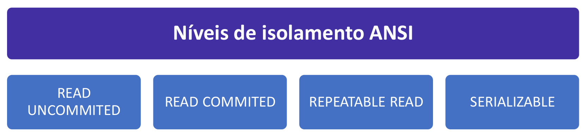

# Capítulo 4 – Linguagem SQL: Fundamentos

Nos capítulos anteriores, construímos uma base teórica sólida, explorando desde a modelagem conceitual até a lógica matemática da Álgebra Relacional. Agora, é hora de traduzir essa teoria em prática. A **SQL (Structured Query Language)**, ou Linguagem de Consulta Estruturada, é a ponte que conecta nossas intenções com os dados armazenados no banco.

Desenvolvida na década de 1970 pela IBM com base no modelo relacional de Edgar F. Codd, a SQL se tornou o padrão de fato e de direito (padronizada pela ANSI e ISO) para a grande maioria dos Sistemas de Gerenciamento de Bancos de Dados (SGBDs) relacionais. Embora cada SGBD possua suas próprias variações e extensões (dialetos), o núcleo da linguagem é universal, permitindo que o conhecimento adquirido seja aplicado em diversas plataformas.

É fundamental entender uma característica que define a SQL: ela é uma linguagem **declarativa**. Diferente da Álgebra Relacional, que é procedural (onde especificamos a sequência de passos para obter um resultado), na SQL nós simplesmente **declaramos o que queremos**. Escrevemos uma consulta que descreve o resultado desejado e o SGBD, através de seu otimizador de consultas, se encarrega de descobrir a melhor sequência de operações (o melhor "plano de execução") para nos entregar esses dados de forma eficiente.

### Os Subconjuntos da Linguagem SQL

A SQL é uma linguagem extremamente rica e completa. Para facilitar seu estudo e organização, seus comandos são tradicionalmente agrupados em subconjuntos ou "sublinguagens", de acordo com a função que desempenham.

<div align="center">

</div>

É importante notar que, embora a divisão em cinco categorias (DQL, DML, DDL, DCL, TCL) seja didaticamente muito útil, algumas convenções consideram a DQL (linguagem de consulta) como parte da DML (linguagem de manipulação), resultando em uma divisão de apenas quatro categorias. Na prática, essa diferença é puramente conceitual, pois o SGBD interpreta todos os comandos como parte de uma única linguagem coesa.

Nos próximos tópicos, vamos explorar em detalhe cada um desses subconjuntos e seus principais comandos, começando pela linguagem utilizada para consultar e recuperar os dados do banco de dados.

## DCL (Data Control Language)

A **DCL (Data Control Language)**, ou Linguagem de Controle de Dados, é o subconjunto da SQL dedicado à **segurança** do banco de dados. Sua finalidade é gerenciar as permissões e os privilégios de acesso dos usuários aos diversos objetos do banco, como tabelas, visões e procedimentos. Através dos comandos DCL, o Administrador do Banco de Dados (DBA) pode definir com precisão quem pode fazer o quê no sistema.

<div align="center">

</div>

Pense na DCL como o sistema de crachás e chaves de um prédio. Ela não lida com o conteúdo dos escritórios (os dados, que são gerenciados pela DML) nem com a construção das salas (a estrutura, gerenciada pela DDL), mas sim com a definição de quais funcionários (usuários) têm a chave para entrar em quais salas (tabelas) e o que eles podem fazer lá dentro (consultar, inserir, apagar). É uma camada essencial para garantir que informações sensíveis sejam acessadas apenas por pessoal autorizado.

Antes de explorarmos os comandos específicos de cada sublinguagem, é importante estabelecer duas convenções de sintaxe fundamentais que se aplicam a toda a linguagem SQL.

1. **Sensibilidade a Maiúsculas e Minúsculas (Case-Sensitivity):** Uma linguagem é dita _case-sensitive_ quando ela diferencia letras maiúsculas de minúsculas (ou seja, `Joao` é diferente de `joao`). Quando a linguagem não faz essa distinção, ela é _case-insensitive_. No universo SQL, o comportamento pode variar de um SGBD para outro. Para fins didáticos e para manter a consistência, adotaremos a convenção do Microsoft SQL Server, que, de forma geral, trata os comandos e nomes de objetos como **case-insensitive**. Assim, `SELECT`, `select` e `SeLeCt` serão interpretados da mesma forma.
2. **O Delimitador de Comandos (;):** O SGBD não interpreta quebras de linha ou parágrafos. Um comando SQL, ou uma "instrução", pode se estender por várias linhas para facilitar a leitura. O que sinaliza para o SGBD que uma instrução terminou e a próxima pode começar é o símbolo de ponto e vírgula (**;**). Ele atua como o ponto final de uma frase, delimitando o fim de um comando.

Com essas convenções em mente, vamos agora analisar os comandos que compõem a DCL.

### GRANT: Concedendo Permissões

O comando **`GRANT`** é utilizado para **conceder** permissões a um usuário ou a um papel (_role_). Através dele, o DBA pode autorizar o acesso e a execução de operações específicas sobre os objetos do banco de dados.

A sintaxe básica para conceder permissões sobre uma tabela é:

```sql
GRANT <privilegio(s)> ON <nome_do_objeto> TO <usuario_ou_papel>;
```

- **`<privilegio(s)>`:** A permissão a ser concedida (ex: `SELECT`, `INSERT`, `UPDATE`, `DELETE`, ou `ALL` para todas as permissões).
- **`<nome_do_objeto>`:** O objeto do banco de dados ao qual a permissão se aplica (ex: a tabela `CLIENTES`).
- **`<usuario_ou_papel>`:** O usuário ou o papel que receberá a permissão.

**Exemplo Prático:** Imagine que temos um usuário chamado joao, que é um analista de dados. Ele precisa apenas consultar as informações da tabela CLIENTES, sem poder alterá-las. O comando para conceder essa permissão seria:

```sql
GRANT SELECT ON CLIENTES TO joao;
```

A partir de agora, o usuário `joao` pode executar consultas `SELECT` na tabela `CLIENTES`, mas qualquer tentativa de usar `INSERT`, `UPDATE` ou `DELETE` resultará em um erro de permissão negada.

### REVOKE: Revogando Permissões

O comando **`REVOKE`** é a operação inversa do `GRANT`. Ele é utilizado para **revogar** (remover) permissões que foram previamente concedidas a um usuário ou papel.

A sintaxe básica é:

```sql
REVOKE <privilegio(s)> ON <nome_do_objeto> FROM <usuario_ou_papel>;
```

**Exemplo Prático:** Após um tempo, o analista joao muda de função e não precisa mais do acesso à tabela CLIENTES. Para remover a permissão que concedemos anteriormente, utilizamos o REVOKE:

```sql
REVOKE SELECT ON CLIENTES FROM joao;
```

É interessante notar a natureza declarativa da linguagem SQL e sua proximidade com o inglês. Quando concedemos algo, concedemos algo **PARA** alguém (`TO joao`). Quando retiramos algo, retiramos algo **DE** alguém (`FROM joao`). Essa lógica torna os comandos mais intuitivos.

### DENY: Negando Permissões Explicitamente

O comando **`DENY`** é uma forma mais forte e explícita de restrição. Enquanto o `REVOKE` apenas remove uma permissão concedida, o `DENY` cria uma **negação explícita**, que se sobrepõe a qualquer outra permissão que o usuário possa ter, inclusive permissões herdadas de um papel.

Em outras palavras, o `DENY` funciona como um "veto". Se um usuário pertence a um papel "Analistas" que tem permissão de `SELECT` na tabela `CLIENTES`, mas o usuário `joao` recebe um `DENY` específico para essa mesma permissão, ele **não poderá** acessar a tabela, pois a negação explícita tem precedência.

A sintaxe básica é:

```sql
DENY <privilegio(s)> ON <nome_do_objeto> TO <usuario_ou_papel>;
```

**Exemplo Prático:** Para garantir que o usuário joao nunca possa consultar a tabela CLIENTES, independentemente de quaisquer outras permissões que ele possa receber no futuro, o DBA executaria:

```sql
DENY SELECT ON CLIENTES TO joao;
```

Para remover essa negação explícita, o DBA precisaria usar o comando `REVOKE` para revogar o `DENY`, e só então poderia conceder a permissão novamente com o `GRANT`.

### A Cláusula `WITH GRANT OPTION`

A cláusula `WITH GRANT OPTION` não é um comando DCL em si, mas um modificador poderoso que pode ser adicionado ao comando `GRANT`. Ela permite que o usuário que está recebendo uma permissão também receba a capacidade de **delegar essa mesma permissão** a outros usuários.

**Exemplo Prático:** Imagine que maria é a gerente do departamento de vendas. O DBA concede a ela a permissão para consultar a tabela VENDAS e também a capacidade de delegar essa permissão para sua equipe:

```sql
GRANT SELECT ON VENDAS TO maria WITH GRANT OPTION;
```

Agora, a própria `maria` pode executar o seguinte comando para dar a mesma permissão ao seu subordinado, `joao`:

```sql
GRANT SELECT ON VENDAS TO joao;
```

Essa cláusula cria uma cadeia de delegação de permissões, o que pode ser útil em grandes organizações, mas exige um controle cuidadoso para evitar a disseminação descontrolada de privilégios. É importante notar que a cláusula `WITH GRANT OPTION` não pode ser utilizada com o comando `DENY`.

## TCL (Transaction Control Language)

A **TCL (Transaction Control Language)**, ou Linguagem de Controle de Transações, é o subconjunto da SQL que nos permite gerenciar explicitamente as transações dentro do banco de dados. Como vimos nos capítulos anteriores, uma transação é um conjunto de operações que devem ser executadas como uma única unidade lógica e atômica. A TCL é a ferramenta que nos permite definir onde uma transação começa, onde ela termina e qual deve ser o seu desfecho: sucesso permanente ou falha total.

<div align="center">

</div>

É através dos comandos TCL que garantimos na prática os princípios de **Atomicidade** e **Durabilidade** do ACID. Eles nos dão o poder de agrupar uma série de comandos DML (`INSERT`, `UPDATE`, `DELETE`) e decidir, ao final, se o conjunto inteiro de alterações deve ser permanentemente salvo no banco de dados ou se deve ser completamente desfeito, como se nunca tivesse acontecido.

A estrutura dos comandos TCL é notavelmente simples. Diferente de um `SELECT` ou `GRANT`, eles geralmente não possuem cláusulas ou parâmetros complexos. São comandos diretos que instruem o SGBD a tomar uma ação definitiva sobre a transação atual. Nos tópicos seguintes, exploraremos cada um desses comandos.

### COMMIT: Tornando as Alterações Permanentes

O comando **`COMMIT`** é o comando de confirmação da TCL. Sua função é **finalizar uma transação com sucesso**, tornando todas as modificações de dados realizadas dentro dela (sejam `INSERT`, `UPDATE` ou `DELETE`) **permanentes** no banco de dados.

Pense em uma transação como um "rascunho" de alterações. Enquanto se está trabalhando, as modificações são visíveis apenas para a sua sessão e ainda podem ser desfeitas. O `COMMIT` é o ato de "salvar o documento final": a partir do momento em que é executado, as alterações se tornam duráveis (garantindo a **Durabilidade** do ACID), visíveis para todos os outros usuários e não podem mais ser desfeitas com um simples comando de reversão. Ele marca a conclusão bem-sucedida da unidade de trabalho atômica, cumprindo o princípio da **Atomicidade**.

Antes de uma transação ser "commitada", suas alterações existem em um estado transitório. Essa invisibilidade temporária para outros usuários é a base do **Isolamento**, um dos pilares do ACID. No entanto, o quão "invisível" essa transação é pode ser configurado. O padrão ANSI SQL define quatro níveis de isolamento, que representam um equilíbrio entre consistência e performance.

#### Níveis de Isolamento

Os níveis de isolamento determinam o grau em que uma transação deve ser isolada das modificações de dados feitas por outras transações concorrentes. Um nível mais alto garante mais consistência, mas pode reduzir a capacidade de múltiplos usuários operarem simultaneamente (concorrência).

<div align="center">

</div>

- **READ UNCOMMITTED (Leitura Não Confirmada):** Este é o nível de isolamento mais baixo. Uma transação operando neste nível pode ler dados que foram modificados por outras transações, mas que **ainda não foram confirmados** com `COMMIT`. Isso pode levar a **leituras sujas (_dirty reads_)**, onde se age com base em dados que podem ser desfeitos a qualquer momento. Oferece a maior concorrência, mas a menor garantia de consistência.
- **READ COMMITTED (Leitura Confirmada):** Neste nível, uma transação só pode ler dados que já foram permanentemente salvos por um `COMMIT`. Isso **evita as leituras sujas**. No entanto, ainda pode ocorrer a **leitura não repetível (_non-repeatable read_)**: se uma transação lê o mesmo dado duas vezes, ela pode obter resultados diferentes caso outra transação tenha alterado e "commitado" esse dado no intervalo entre as duas leituras. Este é o nível de isolamento padrão em muitos SGBDs, como Oracle e SQL Server, por oferecer um bom equilíbrio entre consistência e performance.
- **REPEATABLE READ (Leitura Repetível):** Este nível garante que, se uma transação reler a mesma linha múltiplas vezes, ela sempre obterá os mesmos valores. O SGBD cria um "snapshot" dos dados no início da transação, e a transação continua a ler essa versão consistente, ignorando alterações "commitadas" por outras transações. Isso **evita leituras não repetíveis**. Contudo, ainda pode ocorrer a **leitura fantasma (_phantom read_)**: se a transação repetir uma consulta que retorna um _conjunto_ de linhas (ex: `SELECT COUNT(*)`), ela pode obter um número diferente de linhas caso outra transação tenha inserido (e "commitado") novos registros que satisfaçam a condição da consulta. Este é o nível padrão do MySQL (com o motor InnoDB).
- **SERIALIZABLE (Serializável):** O nível de isolamento mais alto e restritivo. Ele garante que o resultado da execução de transações concorrentes seja idêntico ao resultado de executá-las em alguma ordem sequencial (uma após a outra). **Evita todos os tipos de anomalias**, incluindo leituras sujas, não repetíveis e fantasmas. Garante a consistência máxima, mas ao custo da menor concorrência, pois o SGBD utiliza mecanismos de bloqueio mais agressivos para serializar as operações.

#### Sintaxe e Uso do `COMMIT`

Como mencionado, a sintaxe do `COMMIT` é extremamente simples. Ele é um comando autocontido. Geralmente, ele é usado ao final de um bloco de operações DML que formam uma unidade lógica de trabalho.

**Exemplo de Transação:**

```sql
-- Inicia uma transação (em alguns SGBDs, isso é implícito)
START TRANSACTION;

-- Operação 1: Insere um novo pedido
INSERT INTO Pedidos (cliente_id, data_pedido) VALUES (101, '2025-09-15');

-- Operação 2: Atualiza o estoque do produto vendido
UPDATE Produtos SET estoque = estoque - 1 WHERE id_produto = 50;

-- Se ambas as operações foram bem-sucedidas, confirma a transação
COMMIT;
```

Até o comando `COMMIT` ser executado, as alterações na tabela `Pedidos` e `Produtos` existem em um estado transitório, invisível para outros usuários. Após o `COMMIT`, elas se tornam permanentes e visíveis para todo o sistema.

### ROLLBACK: Desfazendo Alterações

O comando **`ROLLBACK`** é a contraparte do `COMMIT`. Sua função é **desfazer** todas as alterações de dados (`INSERT`, `UPDATE`, `DELETE`) realizadas dentro de uma transação que ainda não foi confirmada. Ele reverte o banco de dados para o estado em que se encontrava no momento do último `COMMIT` (ou do início da transação), garantindo a **Atomicidade** ao assegurar que uma transação incompleta ou mal-sucedida não deixe "rastros" de alterações parciais.

É fundamental entender que o `ROLLBACK` só pode ser aplicado a uma transação em andamento. Uma vez que o comando `COMMIT` é executado, as alterações se tornam permanentes e o `COMMIT` funciona como um ponto de salvamento definitivo; as alterações "commitadas" não podem mais ser desfeitas com um `ROLLBACK`. Pense nos "saves" de um videogame: o `COMMIT` é como salvar o jogo, e o `ROLLBACK` é como carregar o último save, descartando todo o progresso feito desde então.

A sintaxe do `ROLLBACK` é tão simples quanto a do `COMMIT`:

```sql
ROLLBACK;
```

**Exemplo de Transação com `ROLLBACK`:** Imagine um cenário de transferência bancária onde ocorre um erro no meio do processo.

```sql
START TRANSACTION;

-- Operação 1: Debita R$ 500 da conta de origem (ID 123)
UPDATE Contas SET saldo = saldo - 500 WHERE id_conta = 123;

-- Operação 2: Tenta creditar na conta de destino (ID 456), mas o ID não existe
UPDATE Contas SET saldo = saldo + 500 WHERE id_conta = 999; -- Erro, conta inexistente

-- Como a operação 2 falhou, a transação está inconsistente. Desfazemos tudo.
ROLLBACK;
```

Ao executar o `ROLLBACK`, a atualização na conta `123` é completamente desfeita. Para o banco de dados, é como se a transação nunca tivesse ocorrido, garantindo que o saldo da conta de origem permaneça intacto e a consistência seja mantida.

### SAVEPOINT: Criando Pontos de Restauração Intermediários

Em transações longas e complexas, desfazer todo o trabalho com um `ROLLBACK` completo pode não ser o ideal. Para um controle mais granular, a TCL oferece o comando **`SAVEPOINT`**.

Um `SAVEPOINT` é um **ponto de salvamento nomeado dentro de uma transação**. Ele permite que se reverta a transação não para o seu início, mas para um ponto intermediário específico, preservando o trabalho realizado antes daquele ponto.

A sintaxe para criar um savepoint é:

```sql
SAVEPOINT <nome_do_savepoint>;
```

Para retornar a um savepoint específico, utiliza-se uma variação do `ROLLBACK`:

```sql
ROLLBACK TO <nome_do_savepoint>;
```

E para remover um savepoint que não é mais necessário (liberando recursos do sistema):

```sql
RELEASE SAVEPOINT <nome_do_savepoint>;
```

**Exemplo Prático:** Considere um processo de matrícula de um aluno em múltiplos cursos.

```sql
START TRANSACTION;

-- Matrícula no Curso A
INSERT INTO Matriculas (aluno_id, curso_id) VALUES (101, 'CURSO-A');

-- Cria um ponto de salvamento após a primeira matrícula bem-sucedida
SAVEPOINT matricula_curso_a;

-- Tenta matricular no Curso B, mas descobre que não há vagas
-- A operação falha ou a lógica da aplicação decide não prosseguir
-- INSERT INTO Matriculas (aluno_id, curso_id) VALUES (101, 'CURSO-B'); -- Falha

-- Em vez de desfazer tudo, voltamos apenas ao ponto antes da tentativa no Curso B
ROLLBACK TO matricula_curso_a;

-- Agora, a matrícula no Curso A ainda está no "rascunho" da transação,
-- mas a tentativa de matrícula no Curso B foi desfeita.
-- Podemos tentar matricular em outro curso (Curso C) ou finalizar a transação.

INSERT INTO Matriculas (aluno_id, curso_id) VALUES (101, 'CURSO-C');

-- Se tudo deu certo, confirma todas as matrículas válidas (A e C)
COMMIT;
```

Os `SAVEPOINT`s oferecem uma flexibilidade imensa para o tratamento de erros em transações complexas, permitindo a implementação de lógicas de "tentativa e erro" sem a necessidade de abortar todo o processo.

## DDL (Data Definition Language)

A **DDL (Data Definition Language)**, ou Linguagem de Definição de Dados, é o subconjunto da SQL que funciona como o "conjunto de ferramentas de engenharia" do nosso banco de dados. Seus comandos não manipulam os dados em si, mas sim os **objetos** que os contêm e organizam. É com a DDL que criamos, modificamos e excluímos a arquitetura do banco de dados, definindo o _schema_.

<div align="center">

</div>

Os objetos de banco de dados são todas as estruturas armazenadas no SGBD que são usadas para guardar ou gerenciar os dados. Os principais são as tabelas, os índices (que otimizam as buscas), as visões (_views_, que são consultas salvas), os gatilhos (_triggers_) e os procedimentos armazenados (_stored procedures_).

### CREATE: Construindo os Objetos do Banco de Dados

O comando **`CREATE`** é o ponto de partida da DDL. É utilizado para criar qualquer novo objeto dentro do banco de dados. A sintaxe geral é bastante intuitiva, mas os parâmetros e propriedades específicas variam drasticamente dependendo do tipo de objeto que estamos criando.

A sintaxe básica é:

```sql
CREATE <TIPO_DO_OBJETO> <nome_do_objeto> (definições);
```

Vamos explorar a criação dos objetos mais fundamentais.

#### Criando Bancos de Dados (`CREATE DATABASE`)

A criação de um banco de dados (o contêiner para todas as nossas tabelas e outros objetos) é a operação mais simples. Geralmente, precisamos apenas especificar o nome do novo banco de dados.

**Sintaxe:**

```sql
CREATE DATABASE <nome_do_banco_de_dados>;
```

**Exemplo Prático:** Para criar um novo banco de dados para um sistema acadêmico, o comando seria:

```sql
CREATE DATABASE Sistema_Academico;
```

Este comando instrui o SGBD a alocar os arquivos e as estruturas necessárias no servidor para abrigar um novo banco de dados isolado.

#### Criando Tabelas (`CREATE TABLE`)

A criação de tabelas é, de longe, o comando DDL mais comum e detalhado, e o mais cobrado em avaliações. É aqui que traduzimos nosso modelo lógico para uma estrutura física. Ao criar uma tabela, definimos suas colunas (atributos), o tipo de dado de cada coluna e as restrições (_constraints_) que garantirão a integridade dos dados.

**Sintaxe Genérica:**

```sql
CREATE TABLE <nome_da_tabela> (
    <nome_coluna1> <tipo_de_dado> [restrições_da_coluna],
    <nome_coluna2> <tipo_de_dado> [restrições_da_coluna],
    ...,
    [restrições_da_tabela]
);
```

Vamos dissecar um exemplo prático para entender cada componente:

**Exemplo Prático:**

```sql
CREATE TABLE Pedido (
    IDPedido INT PRIMARY KEY,
    IDCliente INT,
    DataPedido DATE,
    ValorTotal DECIMAL(10, 2),
    CONSTRAINT FK_Pedido_Cliente FOREIGN KEY (IDCliente) 
        REFERENCES Cliente(IDCliente)
);
```

**Análise do Comando:**

- `CREATE TABLE Pedido`: Inicia a criação de uma tabela chamada `Pedido`.
- `IDPedido INT PRIMARY KEY`: Cria uma coluna chamada `IDPedido`, do tipo `INT` (inteiro), e a define como a **chave primária** (`PRIMARY KEY`) da tabela. Isso impõe as restrições de unicidade (`UNIQUE`) e não nulidade (`NOT NULL`) a esta coluna.
- `IDCliente INT`: Cria uma coluna para armazenar o ID do cliente associado ao pedido.
- `DataPedido DATE`: Cria uma coluna para armazenar a data do pedido.
- `ValorTotal DECIMAL(10, 2)`: Cria uma coluna para o valor total, usando o tipo `DECIMAL` que é ideal para valores monetários. `(10, 2)` significa que o número pode ter até 10 dígitos no total, com 2 deles reservados para as casas decimais.
- `CONSTRAINT FK_Pedido_Cliente...`: Esta é uma **restrição de tabela**. `CONSTRAINT` permite nomear uma restrição. `FK_Pedido_Cliente` é o nome que demos. `FOREIGN KEY (IDCliente)` define a coluna `IDCliente` desta tabela como uma **chave estrangeira**. `REFERENCES Cliente(IDCliente)` especifica que esta chave estrangeira se refere à coluna `IDCliente` na tabela `Cliente`, criando o vínculo entre os pedidos e os clientes e garantindo a integridade referencial.

O resultado deste comando é a criação de uma nova tabela vazia no banco de dados, com a seguinte estrutura pronta para receber os dados:

| IDPedido (PK)                      | IDCliente (FK) | DataPedido | ValorTotal |
| ---------------------------------- | -------------- | ---------- | ---------- |
| _...dados serão inseridos aqui..._ |                |            |            |

#### Criando Visões (`CREATE VIEW`)

Uma **visão (_view_)** é, essencialmente, uma consulta `SELECT` que é armazenada no banco de dados como um objeto permanente. Ela funciona como uma **tabela virtual**, cujo conteúdo é gerado dinamicamente no momento em que é acessada. As visões são uma ferramenta poderosa para simplificar a complexidade, reutilizar consultas e reforçar a segurança.

**Sintaxe Genérica:**

```sql
CREATE VIEW <nome_da_view> AS
<comando_SELECT>;
```

O corpo de uma visão (`<comando_SELECT>`) pode ser uma consulta de qualquer complexidade, envolvendo múltiplas tabelas, junções, agregações e filtros.

**Exemplo Prático:** Imagine que, em nosso sistema de vendas, os analistas frequentemente precisam ver uma lista de produtos que estão com estoque baixo (menos de 15 unidades). Em vez de escreverem a mesma consulta repetidamente, podemos criar uma visão.

```sql
CREATE VIEW vw_Produtos_Estoque_Baixo AS
SELECT
    ID,
    NOME,
    ESTOQUE
FROM
    PRODUTOS
WHERE
    ESTOQUE < 15;
```

Uma vez criada, os analistas podem simplesmente executar `SELECT * FROM vw_Produtos_Estoque_Baixo;` como se fosse uma tabela normal, obtendo sempre a lista atualizada de produtos com pouco estoque, sem precisarem conhecer a lógica de filtragem por trás dela.

#### Criando Índices (`CREATE INDEX`)

Um **índice (_index_)** é uma estrutura de dados especial, associada a uma tabela, que tem como único propósito **acelerar a velocidade das operações de recuperação de dados**. Pense em um índice de um livro: em vez de folhear o livro página por página para encontrar um tópico (uma varredura completa da tabela, ou _full table scan_), você vai diretamente ao índice, encontra o tópico e a página correspondente (o endereço do dado no disco) e vai direto para lá.

Quando uma coluna é definida como chave primária, a maioria dos SGBDs cria automaticamente um índice para ela. No entanto, podemos criar índices adicionais em outras colunas que são frequentemente usadas em cláusulas `WHERE` ou `JOIN` para otimizar o desempenho.

**Sintaxe Genérica:**

```sql
CREATE INDEX <nome_do_indice>
ON <nome_da_tabela> (<coluna1>, <coluna2>, ...);
```

**Exemplo Prático:** Em uma tabela `CLIENTES` muito grande, as buscas pelo nome do cliente estão lentas. Para acelerar essas buscas, podemos criar um índice na coluna `NOME`.

```sql
CREATE INDEX idx_clientes_nome
ON CLIENTES (NOME);
```

Agora, quando uma consulta como `SELECT * FROM CLIENTES WHERE NOME = 'José da Silva';` for executada, o SGBD poderá usar o índice para localizar rapidamente os registros, em vez de ler a tabela inteira. A sintaxe pode incluir cláusulas mais avançadas como `INCLUDE` (para adicionar colunas não-chave ao índice, evitando acessos extras à tabela) e `WHERE` (para criar um índice filtrado, que indexa apenas um subconjunto de linhas).

#### Criando Gatilhos (`CREATE TRIGGER`)

Um **gatilho (_trigger_)** é um bloco de código que é executado automaticamente pelo SGBD em resposta a um evento de modificação de dados (`INSERT`, `UPDATE`, `DELETE`) em uma tabela específica.

**Sintaxe Genérica:**

```sql
CREATE TRIGGER <nome_do_gatilho>
{BEFORE | AFTER} {INSERT | UPDATE | DELETE}
ON <nome_da_tabela>
FOR EACH ROW -- (Cláusula comum que especifica que o gatilho roda para cada linha afetada)
BEGIN
    -- Corpo do gatilho (ações a serem executadas)
END;
```

A definição do gatilho exige a especificação do **momento** em que ele dispara (`BEFORE` ou `AFTER` do evento) e qual é o **evento** gatilho.

**Exemplo Prático:** Para criar uma trilha de auditoria simples, podemos criar um gatilho que, antes de qualquer exclusão na tabela `PRODUTOS`, salve uma cópia do registro que será apagado em uma tabela `PRODUTOS_ARQUIVADOS`.

```sql
CREATE TRIGGER trg_Arquiva_Produto_Antes_Delete
BEFORE DELETE
ON PRODUTOS
FOR EACH ROW
BEGIN
    INSERT INTO PRODUTOS_ARQUIVADOS (ID, NOME, PRECO, ESTOQUE, DATA_EXCLUSAO)
    VALUES (OLD.ID, OLD.NOME, OLD.PRECO, OLD.ESTOQUE, NOW());
END;
```

Neste exemplo, `OLD` é uma palavra-chave especial dentro de um gatilho que se refere aos valores da linha antes da alteração (neste caso, antes de ser deletada).

#### Criando Procedimentos Armazenados (`CREATE PROCEDURE`)

Um **procedimento armazenado (_stored procedure_)** é um conjunto de comandos SQL e lógica de controle que é compilado e armazenado no banco de dados. Ele pode receber parâmetros de entrada e retornar valores, encapsulando lógicas de negócio complexas para serem reutilizadas.

**Sintaxe Genérica:**

```sql
CREATE PROCEDURE <nome_do_procedimento> (
    <parametro1> <tipo_de_dado>,
    <parametro2> <tipo_de_dado>,
    ...
)
AS
BEGIN
    -- Corpo do procedimento (comandos SQL e lógica)
END;
```

**Exemplo Prático:** Vamos criar um procedimento para aplicar um reajuste de preço percentual a todos os produtos de uma determinada categoria.

```sql
CREATE PROCEDURE sp_Reajustar_Preco_Categoria (
    p_id_categoria INT,
    p_percentual_reajuste DECIMAL(5, 2)
)
AS
BEGIN
    UPDATE PRODUTOS
    SET PRECO = PRECO * (1 + p_percentual_reajuste / 100)
    WHERE ID_CATEGORIA = p_id_categoria;
END;
```

Uma vez criado, a aplicação pode simplesmente executar `EXEC sp_Reajustar_Preco_Categoria 10, 5.0;` para dar um aumento de 5% em todos os produtos da categoria `10`, sem precisar enviar o código `UPDATE` completo.

### ALTER: Modificando Objetos Existentes

Uma vez que um objeto de banco de dados é criado, raramente ele permanece inalterado para sempre. As necessidades de um negócio evoluem, novos requisitos surgem, e a estrutura do banco de dados precisa se adaptar a essas mudanças. O comando **`ALTER`** é a ferramenta da DDL que nos permite **modificar a estrutura de um objeto existente** sem a necessidade de excluí-lo e recriá-lo do zero.

O `ALTER` é um comando versátil, e sua sintaxe e as ações disponíveis dependem do tipo de objeto que está sendo modificado (tabela, visão, índice, etc.). A sintaxe genérica é:

```sql
ALTER <TIPO_DO_OBJETO> <nome_do_objeto> <AÇÃO>;
```

O poder do comando reside na `<AÇÃO>` especificada, que instrui o SGBD sobre qual tipo de modificação deve ser realizada. As alterações em tabelas são as mais comuns e abrangem uma vasta gama de operações. Vamos analisar um exemplo prático para ilustrar as diversas capacidades do `ALTER TABLE`.

**Exemplo Prático:** Imagine que, após algum tempo de uso, a tabela `Funcionarios` precisa passar por uma série de ajustes estruturais.

```sql
-- Adicionar a nova coluna Departamento
ALTER TABLE Funcionarios
ADD Departamento VARCHAR(100);

-- Modificar a estrutura da coluna Salario para torná-la não nula
ALTER TABLE Funcionarios
ALTER COLUMN Salario DECIMAL(10, 2) NOT NULL;

-- Renomear a coluna Cargo para Posicao
ALTER TABLE Funcionarios
RENAME COLUMN Cargo TO Posicao;

-- Remover a restrição de chave primária da coluna IDFuncionario
ALTER TABLE Funcionarios
DROP CONSTRAINT PK_Funcionarios_IDFuncionario;
```

**Análise dos Comandos:**

1. **`ADD Departamento VARCHAR(100);`**: Esta ação adiciona uma nova coluna chamada `Departamento` à tabela `Funcionarios`, com o tipo de dado `VARCHAR(100)`.
2. **`ALTER COLUMN Salario DECIMAL(10, 2) NOT NULL;`**: Esta ação modifica uma coluna existente. Neste caso, estamos alterando a coluna `Salario`, talvez para ajustar seu tipo de dado e, mais importante, para adicionar uma restrição `NOT NULL`, garantindo que todo funcionário deva ter um salário registrado.
3. **`RENAME COLUMN Cargo TO Posicao;`**: Esta ação renomeia a coluna `Cargo` para `Posicao`, talvez para se adequar a uma nova terminologia da empresa.
4. **`DROP CONSTRAINT PK_Funcionarios_IDFuncionario;`**: Esta ação remove uma restrição existente da tabela. Neste exemplo, estamos removendo a restrição de chave primária, algo que seria feito com muito cuidado e, geralmente, antes de definir uma nova chave primária.

A tabela a seguir resume algumas das principais ações que podem ser realizadas com o comando `ALTER`, aplicáveis a diferentes tipos de objetos.

| Ação (Sintaxe)        | Descrição                                                                              |
| --------------------- | -------------------------------------------------------------------------------------- |
| **`ADD COLUMN`**      | Adiciona uma nova coluna a uma tabela existente.                                       |
| **`DROP COLUMN`**     | Remove uma coluna de uma tabela existente.                                             |
| **`ALTER COLUMN`**    | Modifica a estrutura de uma coluna, como seu tipo de dados ou restrições.              |
| **`ADD CONSTRAINT`**  | Adiciona uma nova restrição a uma tabela (ex: `PRIMARY KEY`, `FOREIGN KEY`, `UNIQUE`). |
| **`DROP CONSTRAINT`** | Remove uma restrição de uma tabela.                                                    |
| **`RENAME TO`**       | Renomeia um objeto, como uma tabela.                                                   |
| **`ADD INDEX`**       | Adiciona um novo índice a uma tabela (sintaxe pode ser `CREATE INDEX`).                |
| **`DROP INDEX`**      | Remove um índice de uma tabela.                                                        |
| **`ENABLE TRIGGER`**  | Ativa um gatilho que estava desativado.                                                |
| **`DISABLE TRIGGER`** | Desativa um gatilho temporariamente sem excluí-lo.                                     |

### DROP: Excluindo Objetos Permanentemente

O comando **`DROP`** é a operação mais destrutiva da DDL. Sua função é **excluir permanentemente um objeto do banco de dados**. Ao contrário de outros comandos de remoção que veremos, o `DROP` não apaga apenas o conteúdo, mas remove toda a estrutura do objeto, incluindo suas definições, índices, restrições e gatilhos associados.

Uma vez que um objeto é "dropado", ele deixa de existir no banco de dados, e a operação, em geral, não pode ser desfeita com um simples `ROLLBACK`. Por isso, deve ser utilizado com extremo cuidado.

A sintaxe base é:

```sql
DROP <TIPO_DO_OBJETO> <nome_do_objeto>;
```

**Exemplo Prático:** Após uma migração de sistema, a antiga tabela `clientes_devedores` não é mais necessária. Para removê-la completamente do banco de dados, o comando seria:

```sql
DROP TABLE clientes_devedores;
```

Após a execução deste comando, a tabela `clientes_devedores` e todos os dados que ela continha são irrecuperavelmente eliminados.

### TRUNCATE: Removendo Todos os Dados de uma Tabela

O comando **`TRUNCATE`** é uma operação específica para tabelas. Sua função é **remover todas as linhas de uma tabela de forma rápida e eficiente, mas mantendo sua estrutura intacta**.

Depois de executar um `TRUNCATE`, a tabela continuará a existir no banco de dados com todas as suas colunas, índices e restrições, mas estará completamente vazia. É como esvaziar um arquivo, mas manter as gavetas e as pastas no lugar.

A sintaxe do comando é:

```sql
TRUNCATE TABLE <nome_da_tabela>;
```

#### Comparando `DROP`, `TRUNCATE` e `DELETE`

É muito comum, especialmente em avaliações, a comparação entre os comandos `DROP`, `TRUNCATE` (ambos DDL) e `DELETE` (que é um comando DML). Embora todos possam resultar na remoção de dados, eles operam de maneiras fundamentalmente diferentes.

|Característica|`DELETE` (DML)|`TRUNCATE` (DDL)|`DROP` (DDL)|
|---|---|---|---|
|**O que remove?**|Remove linhas específicas ou todas as linhas, uma por uma.|Remove **todas** as linhas de uma vez.|Remove a tabela inteira (dados **e** estrutura).|
|**Cláusula `WHERE`**|**Pode** ter uma cláusula `WHERE` para filtrar quais linhas apagar.|**Não pode** ter uma cláusula `WHERE`. Apaga tudo.|Não se aplica.|
|**Triggers**|Dispara gatilhos `DELETE` para cada linha removida.|**Não** dispara gatilhos `DELETE` (na maioria dos SGBDs).|Não se aplica.|
|**Performance**|Mais lento para grandes volumes, pois registra cada remoção.|Muito mais rápido, pois desaloca os dados em bloco.|Rápido, remove a definição do objeto.|
|**`ROLLBACK`**|Pode ser desfeito com `ROLLBACK`, pois é uma operação DML.|Geralmente **não pode** ser desfeito com `ROLLBACK` (é uma operação DDL).|**Não pode** ser desfeito com `ROLLBACK`.|

Resumindo a principal diferença para tabelas:

- **`DROP`**: Apaga a tabela (estrutura e dados). A tabela some.
- **`TRUNCATE`**: Apaga os dados da tabela. A estrutura fica.
- **`DELETE`**: Apaga os dados da tabela (todos ou um subconjunto). A estrutura fica.

### RENAME: Renomeando Objetos

O comando **`RENAME`** é uma operação DDL simples cujo objetivo é alterar o nome de um objeto do banco de dados, como uma tabela.

A sintaxe pode variar entre os SGBDs. A forma mais genérica é:

```sql
RENAME <TIPO_DO_OBJETO> <nome_atual> TO <nome_novo>;
```

**Exemplo:**

```sql
RENAME TABLE Clientes TO Consumidores;
```

É importante notar que, em muitos SGBDs populares como SQL Server e PostgreSQL, a renomeação é realizada como uma ação do comando `ALTER`. Por exemplo:

```sql
ALTER TABLE Clientes RENAME TO Consumidores;
```

Independentemente da sintaxe, a função é a mesma: modificar o nome de um objeto existente no _schema_ do banco de dados.

## DML (Data Manipulation Language)

A **DML (Data Manipulation Language)**, ou Linguagem de Manipulação de Dados, é o subconjunto da SQL que utilizamos para interagir diretamente com os dados armazenados nas tabelas. Enquanto a DDL constrói a "casa" (a estrutura do banco de dados), a DML é responsável por "mobiliar", "reformar" e "remover os móveis" (os registros).

<div align="center">

</div>

Com a DML, realizamos as operações essenciais do CRUD: criar novos registros (`Insert`), atualizar registros existentes (`Update`) e excluir registros (`Delete`). Operamos em um nível de abstração mais baixo que a DDL, focando no conteúdo, e não no contêiner.

Embora muitas classificações incluam o comando `SELECT` dentro da DML, para fins didáticos, manteremos a abordagem em cinco sublinguagens, tratando o `SELECT` em sua própria categoria, a DQL, que veremos mais adiante.

Para os exemplos práticos desta seção, utilizaremos uma tabela simples chamada `Exemplo`, criada com o seguinte comando DDL:

```sql
CREATE TABLE Exemplo (
    ID INT PRIMARY KEY,
    nome VARCHAR(100),
    sobrenome VARCHAR(100),
    idade INT,
    email VARCHAR(255)
);
```

Inicialmente, nossa tabela está criada, mas vazia, com a seguinte estrutura:

| ID  | nome | sobrenome | idade | email |
| --- | ---- | --------- | ----- | ----- |
|     |      |           |       |       |

Vamos agora populá-la e manipulá-la com os comandos DML.

### INSERT INTO: Adicionando Novos Registros

O comando **`INSERT INTO`** é utilizado para adicionar uma или mais linhas (registros) novas a uma tabela. A operação consiste em especificar a tabela de destino, as colunas que receberão os dados e os valores correspondentes a serem inseridos.

A sintaxe genérica do comando é:

```sql
INSERT INTO nome_tabela (coluna1, coluna2, ..., colunaN)
VALUES (valor1, valor2, ..., valorN);
```

- **`INSERT INTO nome_tabela (...)`**: Especifica a tabela e a lista de colunas que serão preenchidas.
- **`VALUES (...)`**: Fornece a lista de valores. É crucial que a ordem e o tipo de dado dos valores correspondam exatamente à ordem das colunas listadas.

**Exemplo Prático:** Vamos inserir cinco registros em nossa tabela Exemplo. Note que os valores de texto (strings, como VARCHAR) devem sempre ser colocados entre aspas simples (') ou duplas (").

```sql
INSERT INTO Exemplo (ID, Nome, Sobrenome, Idade, Email)
VALUES
    (1, 'João', 'Silva', 30, 'joao.silva@example.com'),
    (2, 'Maria', 'Santos', 25, 'maria.santos@example.com'),
    (3, 'Pedro', 'Almeida', 35, 'pedro.almeida@example.com'),
    (4, 'Ana', 'Oliveira', 28, 'ana.oliveira@example.com'),
    (5, 'Carlos', 'Ferreira', 40, 'carlos.ferreira@example.com');
```

Após a execução bem-sucedida deste comando, a tabela `Exemplo` conterá os seguintes dados:

|ID|nome|sobrenome|idade|email|
|---|---|---|---|---|
|1|João|Silva|30|joao.silva@example.com|
|2|Maria|Santos|25|maria.santos@example.com|
|3|Pedro|Almeida|35|pedro.almeida@example.com|
|4|Ana|Oliveira|28|ana.oliveira@example.com|
|5|Carlos|Ferreira|40|carlos.ferreira@example.com|

#### Variações e Boas Práticas

**Omitindo a Lista de Colunas:** É possível omitir a lista de colunas na instrução `INSERT`, mas **apenas** se você fornecer um valor para **todas as colunas** da tabela, na **exata ordem** em que foram definidas no `CREATE TABLE`.

```sql
-- Funciona, mas não é recomendado
INSERT INTO Exemplo VALUES (6, 'Laura', 'Mendes', 32, 'laura.mendes@example.com');
```

Esta prática **não é recomendada** em código de produção, pois é "quebradiça". Se, no futuro, um DBA alterar a ordem das colunas ou adicionar uma nova coluna à tabela, esta instrução `INSERT` falhará ou, pior, inserirá os dados nos lugares errados.

**Inserindo Valores Nulos ou Padrão:** Se uma coluna permite valores nulos (`NULL`) ou possui um valor padrão (`DEFAULT`) definido, podemos omiti-la da lista de colunas no comando `INSERT`. O SGBD se encarregará de preenchê-la com `NULL` ou com seu valor padrão.

### UPDATE: Modificando Registros Existentes

Uma vez que os dados estão no banco, é natural que eles precisem ser alterados ao longo do tempo. Clientes mudam de endereço, preços de produtos são reajustados, status de pedidos são atualizados. O comando **`UPDATE`** é a ferramenta da DML responsável por **modificar os dados em registros que já existem** em uma tabela.

Imagine o cenário: um produto, como o tênis "NIKE AIR JORDAN 1 LOW TRAVIS SCOTT OLIVE GREEN", foi cadastrado com o preço de R$ 249,00, quando o valor correto seria R$ 2.490,00. O comando `UPDATE` é a forma precisa de corrigir esse deslize sem a necessidade de apagar e reinserir o registro.

A sintaxe base para o comando é:

```sql
UPDATE nome_tabela
SET coluna1 = valor1, coluna2 = valor2, ...
WHERE condicao;
```

- **`UPDATE nome_tabela`**: Identifica a tabela que sofrerá a alteração.
- **`SET coluna1 = valor1, ...`**: Especifica qual(is) coluna(s) deve(m) ser modificada(s) e os novos valores que elas devem receber.
- **`WHERE condicao`**: Cláusula essencial que filtra e especifica **quais linhas** devem ser atualizadas.

#### A Importância da Cláusula `WHERE`

A cláusula `WHERE` em um comando `UPDATE` funciona como um filtro de segurança. É ela que garante que a alteração será aplicada apenas aos registros corretos. A condição geralmente utiliza a chave primária da tabela para mirar em uma linha específica, mas pode ser qualquer condição que identifique um ou mais registros.

**Atenção:** A omissão da cláusula `WHERE` em um comando `UPDATE` é um dos erros mais perigosos que um iniciante pode cometer. Se a cláusula `WHERE` for omitida, o `UPDATE` será aplicado a **TODAS AS LINHAS DA TABELA**. Um comando como `UPDATE Exemplo SET idade = 40;` (sem `WHERE`) faria com que **todos** os registros da tabela passassem a ter a idade 40, uma alteração que pode ser desastrosa e de difícil reversão.

#### Exemplo Prático

Vamos utilizar nossa tabela `Exemplo`. Suponha que identificamos um erro no cadastro de Carlos: seu sobrenome correto é "Fernandes", e não "Ferreira". Para corrigir apenas este registro, usamos a chave primária (`ID = 5`) na cláusula `WHERE`.

**Tabela `Exemplo` ANTES da alteração:**

|ID|nome|sobrenome|idade|email|
|---|---|---|---|---|
|1|João|Silva|30|joao.silva@example.com|
|2|Maria|Santos|25|maria.santos@example.com|
|3|Pedro|Almeida|35|pedro.almeida@example.com|
|4|Ana|Oliveira|28|ana.oliveira@example.com|
|5|Carlos|Ferreira|40|carlos.ferreira@example.com|

**Comando `UPDATE`:**

```sql
UPDATE Exemplo
SET sobrenome = 'Fernandes'
WHERE ID = 5;
```

Note que o valor de texto `'Fernandes'` deve estar entre aspas.

**Tabela `Exemplo` DEPOIS da alteração:**

|ID|nome|sobrenome|idade|email|
|---|---|---|---|---|
|1|João|Silva|30|joao.silva@example.com|
|2|Maria|Santos|25|maria.santos@example.com|
|3|Pedro|Almeida|35|pedro.almeida@example.com|
|4|Ana|Oliveira|28|ana.oliveira@example.com|
|5|Carlos|**Fernandes**|40|carlos.ferreira@example.com|

O comando `UPDATE` também pode modificar múltiplas colunas de uma vez e até mesmo usar o valor antigo da coluna para calcular o novo. Por exemplo, para dar um aumento de 10% para um funcionário e atualizar seu email, o comando poderia ser:

```sql
UPDATE Funcionarios
SET 
    salario = salario * 1.10,
    email = 'novo.email@empresa.com'
WHERE 
    IDFuncionario = 123;
```

### DELETE: Removendo Registros

O comando **`DELETE`** é a operação da DML utilizada para **remover uma ou mais linhas (registros)** de uma tabela. Assim como o `UPDATE`, ele é uma operação precisa que, quando combinada com a cláusula `WHERE`, permite direcionar a remoção para dados específicos que atendam a uma condição predeterminada.

A sintaxe base para a deleção é:

```sql
DELETE FROM nome_tabela
WHERE condicao;
```

- **`DELETE FROM nome_tabela`**: Identifica a tabela da qual as linhas serão removidas.
- **`WHERE condicao`**: Cláusula essencial que filtra e especifica **quais linhas** devem ser excluídas.

#### A Relação com `TRUNCATE` e a Importância do `WHERE`

À primeira vista, o `DELETE` pode parecer similar ao comando DDL `TRUNCATE`, especialmente se a intenção for apagar todos os dados. Um comando `DELETE FROM nome_tabela;` **sem a cláusula `WHERE`** irá, de fato, remover todos os registros da tabela.

No entanto, a diferença interna é crucial:

- **`DELETE`** é uma operação DML que remove as linhas **uma a uma**, registrando cada remoção individualmente no log de transações. Isso a torna mais lenta para grandes volumes de dados, mas permite que a operação seja desfeita com um `ROLLBACK`. Além disso, se a tabela tiver gatilhos de exclusão (_delete triggers_), eles serão disparados para cada linha removida.
- **`TRUNCATE`** é uma operação DDL que remove os dados de forma massiva, geralmente desalocando as páginas de dados da tabela. É uma operação muito mais rápida, minimamente registrada no log, que não dispara gatilhos e, na maioria dos casos, não pode ser desfeita com `ROLLBACK`.

**Em resumo:** use `DELETE` quando precisar remover um subconjunto de linhas ou quando a lógica de gatilhos for necessária. Use `TRUNCATE` quando precisar esvaziar uma tabela inteira de forma rápida e definitiva.

**Atenção:** Assim como no `UPDATE`, a omissão acidental da cláusula `WHERE` em um comando `DELETE` é um erro grave que resultará na exclusão de **todos os dados** da tabela.

#### Exemplo Prático

Vamos continuar com nossa tabela `Exemplo`, que, após a última alteração, se encontra no seguinte estado:

**Tabela `Exemplo` ANTES da exclusão:**

|ID|nome|sobrenome|idade|email|
|---|---|---|---|---|
|1|João|Silva|30|joao.silva@example.com|
|2|Maria|Santos|25|maria.santos@example.com|
|3|Pedro|Almeida|35|pedro.almeida@example.com|
|4|Ana|Oliveira|28|ana.oliveira@example.com|
|5|Carlos|Fernandes|40|carlos.ferreira@example.com|

Suponha que, por uma nova política da empresa, precisamos remover do cadastro todas as pessoas com menos de 30 anos. A condição na cláusula `WHERE` será `idade < 30`.

**Comando `DELETE`:**

```sql
DELETE FROM Exemplo
WHERE idade < 30;
```

Este comando instrui o SGBD a percorrer a tabela `Exemplo` e apagar todas as linhas em que o valor da coluna `idade` for menor que 30. Neste caso, os registros de Maria (25 anos) e Ana (28 anos) serão removidos.

**Tabela `Exemplo` DEPOIS da exclusão:**

|ID|nome|sobrenome|idade|email|
|---|---|---|---|---|
|1|João|Silva|30|joao.silva@example.com|
|3|Pedro|Almeida|35|pedro.almeida@example.com|
|5|Carlos|Fernandes|40|carlos.ferreira@example.com|

Se, em outro cenário, quiséssemos apagar todos os registros da tabela usando este comando, a sintaxe seria simplesmente:

```sql
DELETE FROM Exemplo;
```

## DQL (Data Query Language)

A **DQL (Data Query Language)**, ou Linguagem de Consulta de Dados, é a sublinguagem da SQL dedicada exclusivamente a uma tarefa: **recuperar dados** de um banco de dados. Enquanto as outras sublinguagens se preocupam em definir, controlar e modificar, a DQL se concentra em fazer perguntas e obter respostas.

<div align="center">

</div>

Este subconjunto é composto por um único, mas imensamente poderoso e versátil, comando: o **`SELECT`**. É através do `SELECT` que realizamos as famosas "consultas SQL", que são a principal forma de extrair informações valiosas e insights a partir dos dados brutos armazenados nas tabelas.

### SELECT: O Coração da Consulta SQL

O comando **`SELECT`** é utilizado para recuperar dados de uma ou mais tabelas. Ele permite especificar quais colunas queremos ver e quais linhas queremos incluir, com base em um conjunto de critérios e condições. O resultado de um comando `SELECT` é sempre uma nova tabela temporária, chamada de **conjunto de resultados** (_result set_), que é uma espécie de visão momentânea dos dados que atendem à nossa solicitação.

É fundamental fazer a conexão correta com a Álgebra Relacional que estudamos no capítulo anterior, pois esta é uma fonte recorrente de confusão e de questões em provas:

- O comando `SELECT` em si, ao especificar as colunas, corresponde à operação de **projeção (π)**.
- A cláusula `WHERE`, que filtra as linhas, corresponde à operação de **seleção (σ)**.

#### A Sintaxe Fundamental do `SELECT`

A estrutura básica de uma consulta `SELECT` é composta por três cláusulas principais. Para facilitar o entendimento, vamos apresentá-las na ordem em que o SGBD logicamente as processa, que é um pouco diferente da ordem em que as escrevemos.

```sql
SELECT <lista_de_colunas>
FROM <nome_da_tabela>
WHERE <condicao_de_filtragem>;
```

1. **Cláusula `FROM`:** Esta é a primeira parte que o SGBD "lê". A cláusula FROM especifica de qual(is) tabela(s) os dados serão recuperados. É o ponto de partida da consulta.
	- **Exemplo:** `FROM Exemplo;` indica que nossa fonte de dados é a tabela `Exemplo`.

2. **Cláusula `WHERE`:** Depois de saber de onde vêm os dados, o SGBD aplica a cláusula WHERE para filtrar as linhas. Apenas as linhas que satisfazem a <condicao_de_filtragem> passarão para a próxima etapa. Esta cláusula é a implementação da seleção (σ) da Álgebra Relacional.
	- **Exemplo:** `WHERE idade > 30;` selecionaria apenas as linhas dos registros cuja idade é maior que 30.

3. **Cláusula `SELECT`:** Por fim, a cláusula SELECT é aplicada ao conjunto de linhas que foi filtrado pela cláusula WHERE. É aqui que especificamos quais colunas (atributos) queremos que apareçam no nosso resultado final. Esta cláusula é a implementação da projeção (π) da Álgebra Relacional.

Existem diferentes formas de especificar as colunas:

- **Todos os atributos (`*`)**: O asterisco (`*`) é um coringa que significa "todas as colunas".
    - **Exemplo:** `SELECT * FROM Exemplo;` retornaria todas as colunas da tabela `Exemplo`.

- **Atributos específicos**: Podemos listar uma ou mais colunas, separando-as por vírgula.
    - **Exemplo 1 (uma coluna):** `SELECT nome FROM Exemplo;` retornaria apenas a coluna `nome`.
    - **Exemplo 2 (múltiplas colunas):** `SELECT nome, idade FROM Exemplo;` retornaria as colunas `nome` e `idade`.

**Cuidado com a Nomenclatura:** Apesar de o comando se chamar `SELECT` (selecionar), sua função principal de escolher colunas corresponde à **projeção** da Álgebra Relacional. A **seleção** da Álgebra Relacional é realizada pela cláusula `WHERE`. Dominar essa distinção é crucial.

A sintaxe do `SELECT` pode se tornar muito mais complexa, incluindo diversas outras cláusulas como `JOIN`, `GROUP BY`, `HAVING` e `ORDER BY`, que exploraremos em detalhe nos próximos capítulos, onde construiremos consultas do básico ao avançado.

#### Exemplo Prático

Vamos retornar à nossa tabela `Exemplo`, que, após as operações de DML, se encontra no seguinte estado:

|ID|nome|sobrenome|idade|email|
|---|---|---|---|---|
|1|João|Silva|30|joao.silva@example.com|
|3|Pedro|Almeida|35|pedro.almeida@example.com|
|5|Carlos|Fernandes|40|carlos.ferreira@example.com|

**Objetivo da Consulta:** Queremos obter o `ID`, `nome` e `idade` de todas as pessoas cuja idade seja maior ou igual a 35 anos.

Para alcançar este objetivo, a consulta SQL completa seria:

```sql
SELECT ID, nome, idade
FROM Exemplo
WHERE idade >= 35;
```

Como resultado, teremos a seguinte tabela:

|ID|nome|idade|
|---|---|---|
|3|Pedro|35|
|5|Carlos|40|

Vamos analisar passo a passo como chegamos a este resultado.

Apesar de escrevermos `SELECT` primeiro, o SGBD executa a consulta seguindo uma ordem lógica específica para chegar ao resultado. Vamos seguir esses passos:

**1. `FROM Exemplo`**: A primeira coisa que o SGBD faz é identificar a fonte dos dados. Ele "olha" para a tabela `Exemplo` em sua totalidade:

| ID | nome | sobrenome | idade | email |
| --- | --- | --- | --- | --- |
| 1 | João | Silva | 30 | joao.silva@example.com |
| 3 | Pedro | Almeida | 35 | pedro.almeida@example.com |
| 5 | Carlos | Fernandes | 40 | carlos.ferreira@example.com |

**2. `WHERE idade >= 35`**: Em seguida, o SGBD aplica o filtro da cláusula `WHERE`. Ele varre cada linha da tabela fonte e mantém apenas aquelas que satisfazem a condição `idade >= 35`. Esta é a operação de **Seleção (σ)**. Como resultado intermediário (linhas filtradas), temos:

| ID | nome | sobrenome | idade | email |
| --- | --- | --- | --- | --- |
| 3 | Pedro | Almeida | 35 | pedro.almeida@example.com |
| 5 | Carlos | Fernandes | 40 | carlos.ferreira@example.com |

**3. `SELECT ID, nome, idade`**: Por último, sobre o conjunto de linhas que passaram pelo filtro, o SGBD aplica a lista de colunas da cláusula `SELECT`. Ele descarta as colunas que não foram solicitadas (`sobrenome` e `email`) e exibe apenas as que foram especificadas. Esta é a operação de **Projeção (π)**.

O resultado final entregue ao usuário é a tabela a seguir:

|ID|nome|idade|
|---|---|---|
|3|Pedro|35|
|5|Carlos|40|

Compreender esta ordem de execução lógica (`FROM` → `WHERE` → `SELECT`) é crucial para a construção de consultas mais complexas, pois ajuda a visualizar como o conjunto de dados é gradualmente refinado até se tornar o resultado final desejado.

## Considerações Finais

Neste capítulo, fizemos a transição fundamental da teoria da Álgebra Relacional para a sua aplicação prática através da **SQL (Structured Query Language)**. Exploramos a SQL não como um comando único, mas como uma linguagem abrangente, composta por subconjuntos especializados que, juntos, nos dão controle total sobre todos os aspectos de um banco de dados relacional.

Iniciamos nossa jornada pela **DDL**, a Linguagem de Definição de Dados, aprendendo a atuar como "arquitetos" do banco de dados. Com os comandos `CREATE`, `ALTER`, `DROP` e `TRUNCATE`, vimos como construir, modificar e remover a própria estrutura que armazena a informação, desde o banco de dados em si até suas tabelas, índices e visões.

Em seguida, passamos a interagir com o conteúdo, utilizando a **DML**, a Linguagem de Manipulação de Dados. Dominamos os comandos essenciais do CRUD — `INSERT`, `UPDATE` e `DELETE` —, aprendendo a popular, corrigir e remover os registros que dão vida às tabelas, sempre atentos à importância crucial da cláusula `WHERE` para garantir a precisão de nossas ações.

O coração de nossa interação com os dados foi revelado com a **DQL**, a Linguagem de Consulta de Dados. Desvendamos a sintaxe fundamental do comando `SELECT`, compreendendo a sua ordem de execução lógica (`FROM` → `WHERE` → `SELECT`) e sua relação direta com as operações de seleção e projeção da Álgebra Relacional.

Por fim, exploramos as linguagens que garantem a segurança e a integridade do nosso ambiente. Com a **DCL**, a Linguagem de Controle de Dados, vimos como `GRANT`, `REVOKE` e `DENY` nos permitem gerenciar as permissões de acesso, funcionando como os "guardiões" da segurança da informação. E com a **TCL**, a Linguagem de Controle de Transações, entendemos como os comandos `COMMIT`, `ROLLBACK` e `SAVEPOINT`, aliados aos níveis de isolamento, nos dão o poder de garantir a atomicidade e a durabilidade das nossas operações, protegendo a integridade dos dados.

Ao concluir este capítulo, temos um panorama completo da linguagem SQL. Compreendemos que ela é uma ferramenta multifacetada, com comandos específicos para cada necessidade, desde a criação da mais simples tabela até o controle da mais complexa transação. Com esta base sólida, estamos agora preparados para, nos próximos capítulos, aprofundar nosso conhecimento, explorando cláusulas avançadas para construir consultas cada vez mais poderosas e sofisticadas.