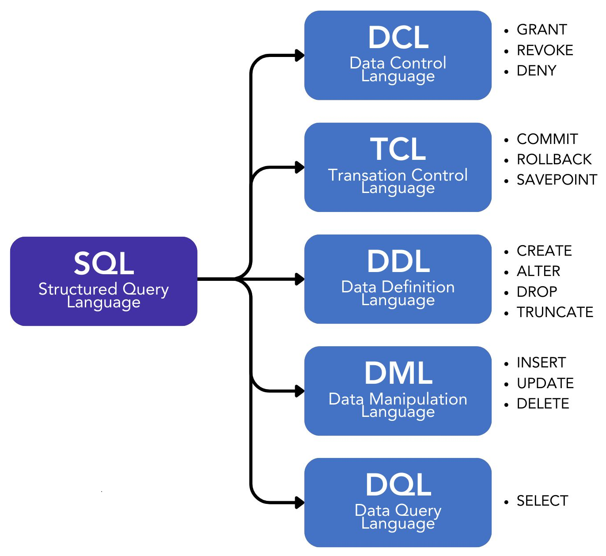

# Capítulo 4 – Linguagem SQL

Nos capítulos anteriores, construímos uma base teórica sólida, explorando desde a modelagem conceitual até a lógica matemática da Álgebra Relacional. Agora, é hora de traduzir essa teoria em prática. A **SQL (Structured Query Language)**, ou Linguagem de Consulta Estruturada, é a ponte que conecta nossas intenções com os dados armazenados no banco.

Desenvolvida na década de 1970 pela IBM com base no modelo relacional de Edgar F. Codd, a SQL se tornou o padrão de fato e de direito (padronizada pela ANSI e ISO) para a grande maioria dos Sistemas de Gerenciamento de Bancos de Dados (SGBDs) relacionais. Embora cada SGBD possua suas próprias variações e extensões (dialetos), o núcleo da linguagem é universal, permitindo que o conhecimento adquirido seja aplicado em diversas plataformas.

É fundamental entender uma característica que define a SQL: ela é uma linguagem **declarativa**. Diferente da Álgebra Relacional, que é procedural (onde especificamos a sequência de passos para obter um resultado), na SQL nós simplesmente **declaramos o que queremos**. Escrevemos uma consulta que descreve o resultado desejado e o SGBD, através de seu otimizador de consultas, se encarrega de descobrir a melhor sequência de operações (o melhor "plano de execução") para nos entregar esses dados de forma eficiente.

### Os Subconjuntos da Linguagem SQL

A SQL é uma linguagem extremamente rica e completa. Para facilitar seu estudo e organização, seus comandos são tradicionalmente agrupados em subconjuntos ou "sublinguagens", de acordo com a função que desempenham.

<div align="center">

</div>

É importante notar que, embora a divisão em cinco categorias (DQL, DML, DDL, DCL, TCL) seja didaticamente muito útil, algumas convenções consideram a DQL (linguagem de consulta) como parte da DML (linguagem de manipulação), resultando em uma divisão de apenas quatro categorias. Na prática, essa diferença é puramente conceitual, pois o SGBD interpreta todos os comandos como parte de uma única linguagem coesa.

Nos próximos tópicos, vamos explorar em detalhe cada um desses subconjuntos e seus principais comandos, começando pela linguagem utilizada para consultar e recuperar os dados do banco de dados.

## DCL (Data Control Language)

A **DCL (Data Control Language)**, ou Linguagem de Controle de Dados, é o subconjunto da SQL dedicado à **segurança** do banco de dados. Sua finalidade é gerenciar as permissões e os privilégios de acesso dos usuários aos diversos objetos do banco, como tabelas, visões e procedimentos. Através dos comandos DCL, o Administrador do Banco de Dados (DBA) pode definir com precisão quem pode fazer o quê no sistema.

<div align="center">

</div>

Pense na DCL como o sistema de crachás e chaves de um prédio. Ela não lida com o conteúdo dos escritórios (os dados, que são gerenciados pela DML) nem com a construção das salas (a estrutura, gerenciada pela DDL), mas sim com a definição de quais funcionários (usuários) têm a chave para entrar em quais salas (tabelas) e o que eles podem fazer lá dentro (consultar, inserir, apagar). É uma camada essencial para garantir que informações sensíveis sejam acessadas apenas por pessoal autorizado.

Antes de explorarmos os comandos específicos de cada sublinguagem, é importante estabelecer duas convenções de sintaxe fundamentais que se aplicam a toda a linguagem SQL.

1. **Sensibilidade a Maiúsculas e Minúsculas (Case-Sensitivity):** Uma linguagem é dita _case-sensitive_ quando ela diferencia letras maiúsculas de minúsculas (ou seja, `Joao` é diferente de `joao`). Quando a linguagem não faz essa distinção, ela é _case-insensitive_. No universo SQL, o comportamento pode variar de um SGBD para outro. Para fins didáticos e para manter a consistência, adotaremos a convenção do Microsoft SQL Server, que, de forma geral, trata os comandos e nomes de objetos como **case-insensitive**. Assim, `SELECT`, `select` e `SeLeCt` serão interpretados da mesma forma.
2. **O Delimitador de Comandos (;):** O SGBD não interpreta quebras de linha ou parágrafos. Um comando SQL, ou uma "instrução", pode se estender por várias linhas para facilitar a leitura. O que sinaliza para o SGBD que uma instrução terminou e a próxima pode começar é o símbolo de ponto e vírgula (**;**). Ele atua como o ponto final de uma frase, delimitando o fim de um comando.

Com essas convenções em mente, vamos agora analisar os comandos que compõem a DCL.

### GRANT: Concedendo Permissões

O comando **`GRANT`** é utilizado para **conceder** permissões a um usuário ou a um papel (_role_). Através dele, o DBA pode autorizar o acesso e a execução de operações específicas sobre os objetos do banco de dados.

A sintaxe básica para conceder permissões sobre uma tabela é:

```sql
GRANT <privilegio(s)> ON <nome_do_objeto> TO <usuario_ou_papel>;
```

- **`<privilegio(s)>`:** A permissão a ser concedida (ex: `SELECT`, `INSERT`, `UPDATE`, `DELETE`, ou `ALL` para todas as permissões).
- **`<nome_do_objeto>`:** O objeto do banco de dados ao qual a permissão se aplica (ex: a tabela `CLIENTES`).
- **`<usuario_ou_papel>`:** O usuário ou o papel que receberá a permissão.

**Exemplo Prático:** Imagine que temos um usuário chamado joao, que é um analista de dados. Ele precisa apenas consultar as informações da tabela CLIENTES, sem poder alterá-las. O comando para conceder essa permissão seria:

```sql
GRANT SELECT ON CLIENTES TO joao;
```

A partir de agora, o usuário `joao` pode executar consultas `SELECT` na tabela `CLIENTES`, mas qualquer tentativa de usar `INSERT`, `UPDATE` ou `DELETE` resultará em um erro de permissão negada.

### REVOKE: Revogando Permissões

O comando **`REVOKE`** é a operação inversa do `GRANT`. Ele é utilizado para **revogar** (remover) permissões que foram previamente concedidas a um usuário ou papel.

A sintaxe básica é:

```sql
REVOKE <privilegio(s)> ON <nome_do_objeto> FROM <usuario_ou_papel>;
```

**Exemplo Prático:** Após um tempo, o analista joao muda de função e não precisa mais do acesso à tabela CLIENTES. Para remover a permissão que concedemos anteriormente, utilizamos o REVOKE:

```sql
REVOKE SELECT ON CLIENTES FROM joao;
```

É interessante notar a natureza declarativa da linguagem SQL e sua proximidade com o inglês. Quando concedemos algo, concedemos algo **PARA** alguém (`TO joao`). Quando retiramos algo, retiramos algo **DE** alguém (`FROM joao`). Essa lógica torna os comandos mais intuitivos.

### DENY: Negando Permissões Explicitamente

O comando **`DENY`** é uma forma mais forte e explícita de restrição. Enquanto o `REVOKE` apenas remove uma permissão concedida, o `DENY` cria uma **negação explícita**, que se sobrepõe a qualquer outra permissão que o usuário possa ter, inclusive permissões herdadas de um papel.

Em outras palavras, o `DENY` funciona como um "veto". Se um usuário pertence a um papel "Analistas" que tem permissão de `SELECT` na tabela `CLIENTES`, mas o usuário `joao` recebe um `DENY` específico para essa mesma permissão, ele **não poderá** acessar a tabela, pois a negação explícita tem precedência.

A sintaxe básica é:

```sql
DENY <privilegio(s)> ON <nome_do_objeto> TO <usuario_ou_papel>;
```

**Exemplo Prático:** Para garantir que o usuário joao nunca possa consultar a tabela CLIENTES, independentemente de quaisquer outras permissões que ele possa receber no futuro, o DBA executaria:

```sql
DENY SELECT ON CLIENTES TO joao;
```

Para remover essa negação explícita, o DBA precisaria usar o comando `REVOKE` para revogar o `DENY`, e só então poderia conceder a permissão novamente com o `GRANT`.

### A Cláusula `WITH GRANT OPTION`

A cláusula `WITH GRANT OPTION` não é um comando DCL em si, mas um modificador poderoso que pode ser adicionado ao comando `GRANT`. Ela permite que o usuário que está recebendo uma permissão também receba a capacidade de **delegar essa mesma permissão** a outros usuários.

**Exemplo Prático:** Imagine que maria é a gerente do departamento de vendas. O DBA concede a ela a permissão para consultar a tabela VENDAS e também a capacidade de delegar essa permissão para sua equipe:

```sql
GRANT SELECT ON VENDAS TO maria WITH GRANT OPTION;
```

Agora, a própria `maria` pode executar o seguinte comando para dar a mesma permissão ao seu subordinado, `joao`:

```sql
GRANT SELECT ON VENDAS TO joao;
```

Essa cláusula cria uma cadeia de delegação de permissões, o que pode ser útil em grandes organizações, mas exige um controle cuidadoso para evitar a disseminação descontrolada de privilégios. É importante notar que a cláusula `WITH GRANT OPTION` não pode ser utilizada com o comando `DENY`.

