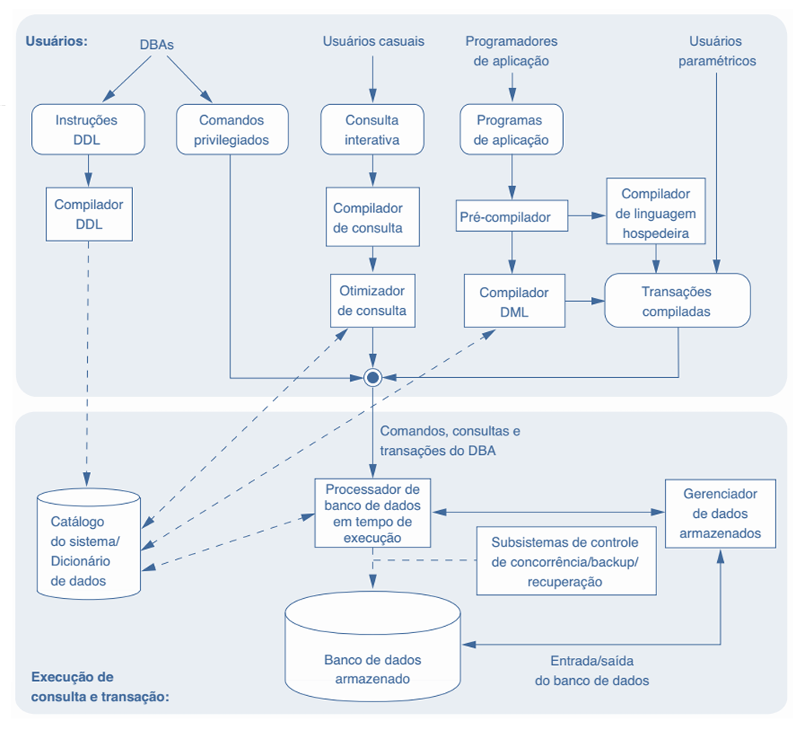

# Capítulo 5 – Estrutura Interna e Ambiente do Sistema de Banco de Dados

Ao estudarmos o funcionamento de um Sistema de Gerenciamento de Banco de Dados (SGBD), é comum imaginarmos que se trata de uma “caixa preta”: inserimos comandos de um lado, e resultados saem do outro. No entanto, por trás dessa aparente simplicidade, existe uma complexa estrutura de componentes, processos e interações. Este capítulo tem como objetivo “abrir essa caixa” e revelar a organização interna e o ambiente que compõem um SGBD moderno. Para isso, faremos uso de uma figura explicativa que divide o sistema em duas grandes partes: a parte superior, voltada aos usuários, e a parte inferior, que representa o núcleo interno do SGBD.

## Visão Geral do Ambiente

A figura a seguir apresenta, de forma simplificada, os componentes típicos de um ambiente de sistema de banco de dados:

<div align="center">
  
</div>

Na parte superior da figura, observamos os diferentes tipos de usuários que interagem com o SGBD e as interfaces disponíveis para essa interação. Já na parte inferior, temos os componentes internos do sistema, que são responsáveis pela manipulação física e lógica dos dados, bem como pelo gerenciamento das transações e da integridade do sistema.

## Armazenamento Físico e Gerenciamento de Memória

No núcleo do SGBD, os dados e os metadados são armazenados em meios de armazenamento não voláteis, como discos rígidos. Essa escolha se deve à necessidade de persistência das informações, ou seja, sua manutenção mesmo após desligamentos ou falhas do sistema. A representação gráfica dos dados como cilindros simboliza justamente essa característica de armazenamento permanente.

O acesso aos discos é mediado pelo sistema operacional ou pelo próprio SGBD. Esse controle é fundamental para escalonar corretamente as operações de leitura e escrita, garantindo a eficiência no acesso aos dados. No entanto, é importante destacar que o acesso ao disco é uma das operações mais custosas em termos de tempo. Por isso, muitos SGBDs incorporam um **gerenciador de buffer**, que otimiza o desempenho ao planejar a troca de dados entre a memória principal (RAM) e o armazenamento secundário (disco). Com isso, é possível manter em memória os dados mais frequentemente utilizados, reduzindo a latência das transações.

## Gerenciamento de Dados Armazenados

Outro componente crucial é o **gerenciador de dados armazenados**, que controla o acesso às informações do banco de dados e do catálogo (onde são mantidos os metadados). Esse módulo utiliza os serviços de entrada e saída fornecidos pelo sistema operacional para realizar a leitura e gravação de dados entre o disco e a memória principal.

Dessa forma, ele serve como intermediário entre o nível mais físico da arquitetura e os componentes lógicos do sistema, sendo essencial para a execução de comandos que envolvem leitura ou modificação de dados persistentes.

## Interfaces de Usuário

Na camada superior do ambiente do SGBD, encontramos os diferentes perfis de usuários, cada um interagindo por meio de interfaces apropriadas:

- **Usuários Casuais**: utilizam interfaces interativas, geralmente gráficas ou baseadas em comandos SQL, para realizar consultas pontuais. São comuns em ambientes corporativos onde funcionários precisam consultar informações específicas.
- **Programadores de Aplicação**: desenvolvem sistemas que acessam o banco de dados por meio de linguagens de programação como Java ou C#. Eles utilizam APIs ou bibliotecas que integram comandos SQL ao código da linguagem hospedeira.
- **Usuários Paramétricos**: interagem com o sistema por meio de interfaces pré-programadas, como os caixas eletrônicos (ATMs). Eles apenas fornecem valores para parâmetros já definidos, como número da conta e valor a ser sacado.

## Linguagens e Compiladores: DDL e DML

Antes de qualquer manipulação de dados ser possível, o banco de dados precisa ser estruturado. Essa estruturação é realizada por meio da **Linguagem de Definição de Dados (DDL)**, que permite a criação de objetos como tabelas, índices e visões. Por exemplo, ao criarmos uma tabela com `CREATE TABLE`, estamos utilizando um comando DDL.

Esses comandos são processados por um **compilador DDL**, que transforma as definições do esquema em metadados e os armazena no **catálogo do SGBD**. O catálogo é essencial para a operação do sistema, pois contém todas as informações sobre a estrutura do banco, como nomes de tabelas, colunas, tipos de dados, restrições e índices.

Além da DDL, temos a **Linguagem de Manipulação de Dados (DML)**, que permite a inserção, exclusão, atualização e consulta de dados. Esses comandos, quando digitados por usuários casuais ou programadores, são enviados ao **compilador DML**, que os converte em código executável.

### Exemplo Prático de Integração: SQL com Java

Considere o seguinte trecho de código escrito em Java, que ilustra a integração entre SQL (DML) e uma linguagem de programação hospedeira:

```java
public boolean verificarUsuario (String login, String senha) {
	String sql = "";
	Connection conn = conectarBD ();
	//INSTRUÇÃO SQL
	sql += "select nome from usuarios ";
	sql += "where login = '" + login + "'"; 
	sql += " and senha = '" + senha + "';";
	try{
		Statement st = conn.createStatement ();
		ResultSet rs = st.executeQuery(sql);
		if (rs.next()) {
			result = true;
			nome = rs.getString("nome"); }
	} catch (Exception e) { }
	return result;
}
```

Neste exemplo, o comando `SELECT` representa uma instrução DML. O **pré-compilador** do SGBD extrai essa instrução do código Java e a encaminha ao compilador DML. O restante do código é tratado pelo compilador Java. No final, ambos os trechos são **ligados** (linkados) e formam uma transação programada.

## Transações Programadas e Usuários Paramétricos

As **transações programadas** são especialmente úteis em sistemas onde o mesmo conjunto de instruções é executado repetidamente, com diferentes parâmetros. Por exemplo, no código anterior, os parâmetros são `login` e `senha`. Cada vez que o sistema é utilizado para verificar um usuário, uma nova transação é executada com esses valores.

Outro exemplo comum é o saque em um caixa eletrônico, no qual os parâmetros são o número da conta e o valor a ser retirado. A lógica do saque é programada previamente, e o usuário apenas insere os dados necessários.

## Processador de Banco de Dados em Tempo de Execução

Na base da arquitetura do SGBD, encontramos o **Processador de Banco de Dados em Tempo de Execução (PBDTE)**. Este módulo é responsável por:

- Executar planos de consulta otimizados;
- Realizar chamadas para os gerenciadores de dados;
- Executar comandos privilegiados e transações programadas.

O PBDTE utiliza as informações do **catálogo do sistema**, especialmente os dados estatísticos (como número de registros, tamanho médio das linhas, presença de índices), para realizar as tarefas de forma eficiente.

## Otimizador de Consultas

As consultas submetidas ao SGBD passam por um processo de análise sintática e semântica, feito pelo **compilador de consultas**. Em seguida, são entregues ao **otimizador de consultas**, cuja função é reordenar operações, eliminar redundâncias e escolher os melhores algoritmos e estruturas (como índices) para execução.

O objetivo do otimizador é **minimizar o custo de execução da consulta**, geralmente medido em termos de número de acessos ao disco e uso de memória.

## Controle de Concorrência, Backup e Recuperação

Um SGBD robusto precisa lidar com múltiplas transações ocorrendo simultaneamente. Para isso, existem os **sistemas de controle de concorrência**, que garantem que as transações não interfiram negativamente umas nas outras, preservando a consistência do banco.

Além disso, temos os módulos de **backup** e **recuperação**, que trabalham juntos para manter a integridade dos dados em caso de falhas. O backup permite restaurar o banco a um estado anterior, e a recuperação aplica os logs de transações para devolver o banco ao seu último estado consistente.

Esses componentes são integrados ao processador em tempo de execução e fazem parte da base que sustenta a confiabilidade de um SGBD.

## Considerações Finais

A figura apresentada neste capítulo é apenas uma representação abstrata dos módulos que compõem um SGBD. Seu objetivo é estruturar o raciocínio e apresentar de forma clara como o sistema funciona internamente. Cada módulo tem um papel fundamental para garantir a integridade, desempenho e confiabilidade do sistema.

É importante lembrar que um SGBD é, em sua essência, um sistema computacional complexo, com diversas camadas de abstração. Compreender essa estrutura é essencial para que você possa utilizar, configurar, otimizar e até desenvolver sistemas que dependam de bancos de dados de forma consciente e eficiente.
