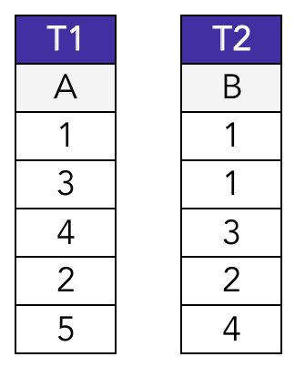
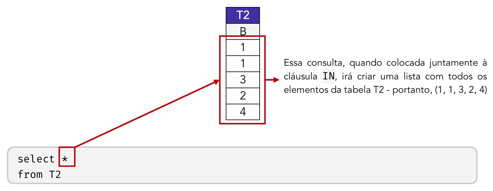
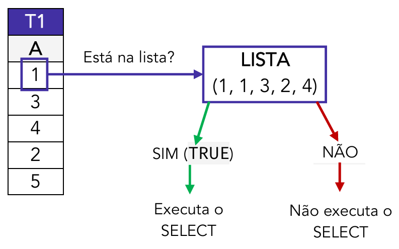
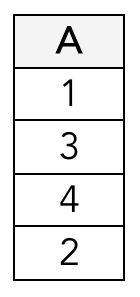

# Capítulo 6 – Linguagem SQL: Cláusulas

Nos capítulos anteriores, estabelecemos um alicerce sólido sobre os fundamentos dos bancos de dados e aprendemos a estrutura básica dos comandos SQL, divididos em suas sublinguagens (DDL, DML, DQL, DCL e TCL). Agora, vamos avançar do "o que" cada comando faz para "como" podemos refinar e controlar seu comportamento. É aqui que entram as **cláusulas**.

As cláusulas são componentes essenciais das instruções SQL que atuam como modificadores, permitindo-nos filtrar, ordenar, agrupar e juntar dados com grande precisão. Se os comandos `SELECT`, `UPDATE` ou `DELETE` são o motor de uma consulta, as cláusulas são o volante, o acelerador e os freios — as ferramentas que nos dão controle total sobre o resultado.

Embora sejam mais proeminentes e utilizadas com maior frequência nas sublinguagens DML e DQL, as cláusulas são elementos da linguagem SQL como um todo e podem ser aplicadas em diferentes contextos. A divisão das sublinguagens, como já mencionado, é uma ferramenta didática; na prática, o SGBD interpreta tudo como uma única e coesa linguagem SQL.

Neste capítulo, exploraremos as principais cláusulas, agrupando-as por seu objetivo na construção de uma instrução para facilitar o entendimento.

## A Base das Condições: Operadores

Antes de mergulharmos nas cláusulas propriamente ditas, precisamos entender seus componentes mais atômicos e fundamentais: os **operadores**. Os operadores são símbolos ou palavras-chave que realizam operações específicas sobre os dados, sejam elas matemáticas, de comparação ou lógicas. São eles que formam as expressões e condições que utilizamos dentro de cláusulas como a `WHERE`, constituindo a base para a aplicação de lógica, estatísticas e cálculos em nossas consultas.

Para fins de estudo, podemos classificar os principais operadores em três grandes grupos:

- **Operadores Matemáticos**
- **Operadores Lógicos**
- **Funções de Agregação**

Vamos explorar cada um desses grupos em detalhe.

### Operadores Matemáticos

Os operadores matemáticos são símbolos e funções que permitem a execução de operações aritméticas sobre valores numéricos dentro de uma instrução SQL. Eles são a base para a criação de colunas calculadas, para a aplicação de lógicas de negócio em filtros e para a realização de análises quantitativas diretamente no banco de dados.

Sua utilização é bastante intuitiva, pois segue a mesma lógica da matemática básica que já conhecemos. A tabela a seguir resume os principais operadores.

| Símbolo                | Operador      | Exemplo                                    |
| ---------------------- | ------------- | ------------------------------------------ |
| **+**                  | Soma          | `Preco + Frete`                            |
| **-**                  | Subtração     | `Preco - Custo`                            |
| *****                  | Multiplicação | `Quantidade * Valor_Unitario`              |
| **/**                  | Divisão       | `Total_Vendas / Numero_Vendedores`         |
| **%**                  | Módulo        | `ID_Produto % 2`                           |
| **`POW()`** ou **`^`** | Potenciação   | `POW(Base, Expoente)` ou `Base ^ Expoente` |
| **`SQRT()`**           | Raiz Quadrada | `SQRT(Area)`                               |

#### Operadores Aritméticos

Os quatro operadores básicos (`+`, `-`, `*`, `/`) são frequentemente usados na cláusula `SELECT` para criar novas colunas virtuais no resultado da consulta.

**Exemplo Prático:** Em uma tabela `PRODUTOS` com as colunas `NOME`, `PRECO` e `CUSTO`, podemos calcular o lucro de cada produto em tempo real.

```sql
SELECT 
	NOME, 
	PRECO, 
	CUSTO, 
	(PRECO - CUSTO) AS LUCRO
FROM PRODUTOS;
```

#### Operadores e Funções Especiais

Alguns operadores e funções merecem uma atenção especial.

- **Módulo (`%`):** Esta operação não retorna o resultado da divisão, mas sim o **resto** da divisão inteira entre dois números.
    - `10 % 3` resultaria em `1`, pois 10 dividido por 3 é 3, com resto 1.
    - `10 % 2` resultaria em `0`, pois 10 dividido por 2 é 5, com resto 0.
    - **Uso Prático:** O operador de módulo é extremamente útil para verificar se um número é par ou ímpar. Um número é par se o resto de sua divisão por 2 for 0. A consulta `SELECT * FROM Alunos WHERE ID_Aluno % 2 = 0;` retornaria todos os alunos com ID par.

- **Potenciação (`POW()` ou `^`):** Utilizada para elevar um número a uma potência. A sintaxe pode variar entre os SGBDs. A notação `A ^ B` (A elevado a B) é comum, mas a forma mais padronizada e segura é usar a função `POW(base, expoente)`. Os valores dentro dos parênteses são chamados de **parâmetros** da função.
    - **Exemplo:** Para calcular 4³, a expressão seria `POW(4, 3)`.

- **Raiz Quadrada (`SQRT()`):** É uma função que recebe um único parâmetro e retorna sua raiz quadrada.
    - **Exemplo:** Para encontrar a raiz quadrada de 16, a expressão seria `SQRT(16)`, que resultaria em 4.

#### Um Caso Especial: O Operador de Soma com Textos (Concatenação)

Alguns SGBDs, como o Microsoft SQL Server, sobrecarregam o operador de soma (`+`) para que ele também possa operar com textos (_strings_). Nesse contexto, ele não realiza uma soma matemática, mas sim uma **concatenação**, que é a junção de duas ou mais strings em uma única string resultante.

- **Exemplo:** Se tivermos as colunas `Nome` com o valor "João" e `Sobrenome` сom o valor "Silva", a expressão `Nome + ' ' + Sobrenome` resultaria na string "João Silva".

É crucial saber que este comportamento **não é universal**. Muitos outros SGBDs, como Oracle e PostgreSQL, utilizam o operador de barra dupla (`||`) para a concatenação. A forma mais padronizada e portável entre diferentes bancos de dados é utilizar a função `CONCAT()`.

- **Sintaxe SQL Server:** `SELECT Nome + ' ' + Sobrenome FROM Clientes;`
- **Sintaxe Oracle/PostgreSQL:** `SELECT Nome || ' ' || Sobrenome FROM Clientes;`
- **Sintaxe com Função Padrão:** `SELECT CONCAT(Nome, ' ', Sobrenome) FROM Clientes;`

### Operadores Lógicos

Os operadores lógicos são as ferramentas que utilizamos para combinar ou modificar condições, principalmente dentro da cláusula `WHERE`, permitindo a criação de filtros complexos e precisos. Eles operam com base na lógica booleana, que lida com valores de **Verdadeiro** e **Falso**. Internamente, os computadores frequentemente representam esses valores de forma binária, onde `1` pode representar Verdadeiro e `0`, Falso.

Para o nosso estudo, não é necessário um aprofundamento em lógica matemática, mas é essencial revisar os três conceitos fundamentais que possuem operadores correspondentes diretos na linguagem SQL.

- **Conjunção (E):** Uma expressão de conjunção, como `A E B`, só é considerada verdadeira se **todas** as suas condições (`A` e `B`) forem, individualmente, verdadeiras. Se qualquer uma delas for falsa, a expressão inteira se torna falsa.
- **Disjunção (OU):** Uma expressão de disjunção, como `A OU B`, é considerada verdadeira se **pelo menos uma** de suas condições (`A` ou `B`) for verdadeira. Ela só será falsa se todas as condições forem falsas.
- **Negação (NÃO):** A negação, representada por `NÃO A`, simplesmente inverte o valor lógico de uma condição. O que era verdadeiro se torna falso, e o que era falso se torna verdadeiro.

A linguagem SQL implementa esses conceitos através dos seguintes operadores:

|Operador|Operação Lógica|Exemplo de Uso|
|---|---|---|
|**`AND`**|Conjunção (E)|`Preco > 100 AND Estoque > 0`|
|**`OR`**|Disjunção (OU)|`Cidade = 'São Paulo' OR Cidade = 'Recife'`|
|**`NOT`**|Negação (NÃO)|`NOT Pais = 'Brasil'`|

#### Uso Prático

O operador `AND` é utilizado para criar filtros que exigem que múltiplas condições sejam satisfeitas simultaneamente.

**Exemplo Prático:** Selecionar os produtos que são da categoria 'Notebook' **E** que custam menos de R$ 3.000.

```sql
SELECT Nome, Preco
FROM Produtos
WHERE Categoria = 'Notebook' AND Preco < 3000;
```

Apenas os registros que atenderem a **ambas as condições** serão retornados. Um notebook de R$ 3.500 não apareceria, nem um smartphone de R$ 2.000.

O operador `OR` é utilizado para criar filtros mais abrangentes, onde basta que uma das várias condições seja satisfeita.

**Exemplo Prático:** Selecionar os clientes que moram na cidade de 'Recife' **OU** que possuem um limite de crédito superior a R$ 5.000.

```sql
SELECT Nome, Cidade, LimiteCredito
FROM Clientes
WHERE Cidade = 'Recife' OR LimiteCredito > 5000;
```

O resultado incluirá todos os clientes de Recife (independentemente do limite de crédito) e também todos os clientes de qualquer outra cidade que tenham um limite de crédito alto.

O operador `NOT` é usado para inverter uma condição, selecionando todos os registros que **não** atendem ao critério especificado.

**Exemplo Prático:** Selecionar todos os funcionários que **NÃO** são do departamento de 'Vendas'.

```sql
SELECT Nome, Departamento
FROM Funcionarios
WHERE NOT Departamento = 'Vendas';
```

Este comando é funcionalmente equivalente a `WHERE Departamento <> 'Vendas'`, mas o `NOT` se torna mais poderoso ao negar expressões complexas.

#### Ordem de Precedência

Quando uma expressão na cláusula `WHERE` contém múltiplos operadores lógicos, o SGBD não os avalia simplesmente da esquerda para a direita. Existe uma ordem de precedência fixa para garantir que as expressões sejam resolvidas de forma consistente. A ordem é:

**1º `NOT` >> 2º `AND` >> 3º `OR`**

Essa ordem é extremamente importante. Considere a seguinte consulta:

```sql
SELECT * FROM Produtos WHERE Categoria = 'Notebook' OR Categoria = 'Tablet' AND Preco > 1000;
```

Devido à precedência, o `AND` será avaliado primeiro. O SGBD interpretará a consulta como: "retorne todos os produtos que são `'Notebooks'` OU (são `'Tablets'` E custam mais de `1000`)". O resultado seria **todos os notebooks**, independentemente do preço, mais os tablets caros.

Para garantir que a lógica seja aplicada na ordem que desejamos, devemos usar **parênteses `()`**, assim como na matemática. Os parênteses forçam a avaliação da expressão interna primeiro.

**Consulta Corrigida:** Para encontrar "notebooks ou tablets que custam mais de 1000", a sintaxe correta é:

```sql
SELECT * FROM Produtos 
WHERE (Categoria = 'Notebook' OR Categoria = 'Tablet') AND Preco > 1000;
```

Agora, o SGBD primeiro encontra todos os produtos que são `'Notebook'` ou `'Tablet'` e, somente sobre esse resultado, aplica o filtro de preço, garantindo o resultado correto.

### Operadores de Comparação

Os operadores de comparação são os elementos centrais de qualquer condição de filtragem, sendo utilizados primariamente na cláusula `WHERE`. A função deles é comparar dois valores — que podem ser o valor de uma coluna e um valor literal, ou os valores de duas colunas — e retornar um resultado booleano (Verdadeiro ou Falso) para cada linha. Apenas as linhas para as quais a expressão resulta em Verdadeiro são incluídas no resultado da consulta.

Os principais operadores de comparação, que seguem a lógica matemática padrão, são:

|Símbolo|Comparação|Exemplo de Uso|
|---|---|---|
|**=**|Igual a|`WHERE Cidade = 'São Paulo'`|
|**`<>`** ou **`!=`**|Diferente de|`WHERE Status <> 'Finalizado'`|
|**>**|Maior que|`WHERE Preco > 100.00`|
|**>=**|Maior ou igual a|`WHERE Estoque >= 10`|
|**<**|Menor que|`WHERE Idade < 18`|
|**<=**|Menor ou igual a|`WHERE Desconto <= 0.15`|

Outros operadores de comparação importantes, como `LIKE`, `IN` e `BETWEEN`, possuem um funcionamento mais específico e serão abordados em seções dedicadas a eles.

#### Tratamento de Valores Nulos

Um ponto de atenção fundamental, e que é uma fonte comum de erros, é a comparação de valores com `NULL`. Como já vimos, `NULL` representa a ausência de valor, o "desconhecido". Por essa razão, ele não se comporta como os outros valores.

Uma comparação de igualdade como `= NULL` **nunca** resultará em Verdadeiro. A lógica é que não se pode afirmar que um valor desconhecido é "igual" a outro valor desconhecido. A expressão `NULL = NULL` resulta em `UNKNOWN` (Desconhecido), e a cláusula `WHERE` descarta linhas que resultam em `UNKNOWN`.

Para lidar corretamente com valores nulos, o SQL fornece operadores específicos:

- **`IS NULL`**: Retorna verdadeiro se o valor da coluna for nulo.
- **`IS NOT NULL`**: Retorna verdadeiro se o valor da coluna não for nulo.

**Exemplo Prático:** Para encontrar todos os clientes que ainda não cadastraram um email:

```sql
-- Forma CORRETA
SELECT Nome FROM Clientes WHERE Email IS NULL;

-- Forma INCORRETA (não retornará nenhuma linha)
-- SELECT Nome FROM Clientes WHERE Email = NULL;
```

### Funções de Agregação

As **funções de agregação** são um tipo especial de função que opera sobre um conjunto de linhas e retorna um **único valor de resumo** para aquele conjunto. Elas são a base para a criação de relatórios, painéis de controle (_dashboards_) e qualquer tipo de análise estatística sobre os dados.

Estas funções são quase sempre utilizadas em conjunto com a cláusula `GROUP BY`, que veremos mais adiante, para calcular resumos para diferentes categorias de dados.

|Função|Descrição|Sintaxe de Exemplo|
|---|---|---|
|**`SUM()`**|Soma todos os valores de uma coluna numérica.|`SUM(ValorTotal)`|
|**`AVG()`**|Calcula a média aritmética dos valores de uma coluna numérica.|`AVG(Preco)`|
|**`MAX()`**|Retorna o maior valor encontrado em uma coluna.|`MAX(Salario)`|
|**`MIN()`**|Retorna o menor valor encontrado em uma coluna.|`MIN(DataPedido)`|
|**`COUNT()`**|Conta o número de linhas em um conjunto.|`COUNT(*)`|
|**`VAR()`**|Calcula a variância estatística de um conjunto de valores.|`VAR(Nota)`|

**Exemplos Práticos:**

Utilizando uma tabela hipotética de Vendas:

- Para calcular o faturamento total: `SELECT SUM(Valor) FROM Vendas;`
- Para encontrar a venda mais cara: `SELECT MAX(Valor) FROM Vendas;`

#### As Variações do `COUNT()`

A função `COUNT()` é particularmente versátil e possui três formas principais de uso:

- **`COUNT(*)`**: Conta o **número total de linhas** no conjunto de resultados, sem exceção.
- **`COUNT(nome_da_coluna)`**: Conta o número de linhas onde a coluna especificada (`nome_da_coluna`) **não possui um valor nulo (`NULL`)**.
- **`COUNT(DISTINCT nome_da_coluna)`**: Conta o número de **valores distintos (únicos)** e não nulos na coluna especificada.

#### A Diretiva `DISTINCT`

A palavra-chave **`DISTINCT`** pode ser usada dentro de funções de agregação (e também diretamente na cláusula `SELECT`) para instruir o SGBD a **eliminar valores duplicados antes** de realizar a operação.

**Exemplo Prático:**

Imagine que queremos saber quantos clientes únicos realizaram compras em determinado período, e não o número total de vendas (pois um mesmo cliente pode ter comprado várias vezes).

```sql
SELECT COUNT(DISTINCT ID_Cliente) AS TotalClientesUnicos
FROM Vendas
WHERE DataVenda >= '2025-01-01';
```

Neste caso, o `DISTINCT` garante que cada ID de cliente seja contado apenas uma vez, fornecendo o resultado correto.

## Cláusulas de Filtragem

As **cláusulas de filtragem** são os componentes estruturais de uma instrução SQL que nos permitem especificar a origem dos nossos dados e aplicar critérios para refinar o resultado. Elas são a base sobre a qual construímos nossas consultas, definindo o universo de dados com o qual vamos trabalhar e, em seguida, aplicando "peneiras" para extrair apenas a informação relevante.

Nesta seção, vamos explorar as três cláusulas mais fundamentais e onipresentes: `FROM`, que estabelece a fonte dos dados; `WHERE`, que filtra as linhas; e `LIMIT`, que restringe a quantidade de resultados. Para ilustrar os exemplos, utilizaremos as mesmas tabelas de `PRODUTOS` e `VENDAS` que já conhecemos.

**Tabela `PRODUTOS`**

|ID|NOME|PRECO|ESTOQUE|
|---|---|---|---|
|1|Notebook|2500|15|
|2|Smartphone|1200|20|
|3|Tablet|800|15|
|4|Monitor|500|30|
|5|Impressora|300|25|

**Tabela `VENDAS`**

|ID|ID_PRODUTO (FK)|DATA|QUANTIDADE|VALOR_TOTAL|
|---|---|---|---|---|
|1|1|2024-03-09|2|5000|
|2|2|2024-03-10|3|3600|
|3|4|2024-03-10|1|500|
|4|3|2024-03-11|2|1600|
|5|2|2024-03-11|1|300|

### FROM: Especificando a Origem dos Dados

A cláusula **`FROM`** é o ponto de partida de quase toda consulta de recuperação de dados. Sua função é especificar de qual(is) tabela(s) a consulta deve extrair as informações. Ela, basicamente, define o "universo" de dados com o qual estamos trabalhando.

#### `FROM` com uma Única Tabela

O uso mais simples e direto da cláusula `FROM` é para especificar uma única tabela como fonte.

```sql
SELECT *
FROM PRODUTOS;
```

Neste caso, o universo da nossa consulta é, exclusivamente, o conteúdo da tabela `PRODUTOS`.

#### `FROM` com Múltiplas Tabelas e o Produto Cartesiano

A cláusula `FROM` também pode listar múltiplas tabelas, separadas por vírgula. Quando fazemos isso, o SGBD realiza um **Produto Cartesiano** entre elas, como vimos na Álgebra Relacional. O resultado é uma tabela intermediária que contém todas as combinações possíveis de linhas entre as tabelas listadas.

**Sempre que listamos duas ou mais tabelas no `FROM` separadas por vírgula (`FROM A, B`), o resultado inicial será um Produto Cartesiano entre elas.**

Essa sintaxe, embora válida, é considerada uma prática antiga e perigosa, pois é muito fácil esquecer de aplicar os filtros necessários (na cláusula `WHERE`) para transformar o produto cartesiano em uma junção útil. A abordagem moderna e recomendada é usar a cláusula `JOIN` explícita, que veremos mais adiante. No entanto, é fundamental entender este comportamento.

#### Simplificando com Apelidos (`ALIAS`)

Ao trabalhar com múltiplas tabelas, ou com tabelas de nomes longos, a sintaxe pode se tornar verbosa e repetitiva. Para simplificar, podemos atribuir um **apelido** (ou **`ALIAS`**) a cada tabela diretamente na cláusula `FROM`. Um alias é um nome temporário que existe apenas no escopo daquela consulta.

A sintaxe para criar um alias é simplesmente colocar o nome do apelido após o nome da tabela (a palavra-chave `AS` é opcional e frequentemente omitida para tabelas).

**Exemplo Prático (Produto Cartesiano):** Vamos selecionar o nome e o preço dos produtos e a quantidade de cada venda, listando as duas tabelas no FROM e usando aliases para simplificar.

```sql
SELECT P.NOME, P.PRECO, V.QUANTIDADE
FROM PRODUTOS P, VENDAS V;
```

- `PRODUTOS P`: Atribui o alias `P` à tabela `PRODUTOS`.
- `VENDAS V`: Atribui o alias `V` à tabela `VENDAS`.
- `P.NOME`: Refere-se à coluna `NOME` da tabela `PRODUTOS` (identificada pelo alias `P`).

Como não especificamos nenhuma condição de junção, o SGBD realiza um produto cartesiano. A tabela `PRODUTOS` tem 5 linhas e a tabela `VENDAS` tem 5 linhas. O resultado será uma tabela com 5 x 5 = 25 linhas, combinando cada produto com cada venda, o que não tem um significado prático útil neste caso.

**Resultado Parcial (Produto Cartesiano):**

| NOME | PRECO | QUANTIDADE |
| --- | --- | --- |
| Notebook | 2500 | 2 |
| Notebook | 2500 | 3 |
| Notebook | 2500 | 1 |
| Notebook | 2500 | 2 |
| Notebook | 2500 | 1 |
| Smartphone | 1200 | 2 |
| Smartphone | 1200 | 3 |
| ... | ... | ... |
| Impressora | 300 | 1 |

Este exemplo ilustra o resultado bruto gerado pela cláusula `FROM` ao lidar com múltiplas tabelas desta forma. A "mágica" de transformar este resultado bruto em uma informação útil acontece na próxima etapa, com a aplicação das cláusulas de junção (que veremos em breve) ou de filtragem, com a cláusula `WHERE`.

### WHERE: Filtrando as Linhas com Precisão

A cláusula **`WHERE`** é, possivelmente, a cláusula mais fundamental e utilizada na linguagem SQL. Sua função é filtrar as **linhas** de uma tabela, permitindo que a consulta ou operação atue apenas sobre um subconjunto de dados que atenda a uma condição específica. Ela é a implementação direta da operação de **seleção (σ)** da Álgebra Relacional.

Pense na cláusula `WHERE` como a tradução da palavra "onde" ou "cujo" em uma frase. Uma solicitação como "Mostre-me os produtos **onde** o estoque é menor que 20" ou "Apague os pedidos **cujo** status é 'Cancelado'" é implementada diretamente com a cláusula `WHERE`.

**Exemplo de Tradução (Linguagem Natural para SQL):**

- **Solicitação:** "Selecione o nome e o preço, da tabela `PRODUTOS`, onde o preço é superior a R$ 1.000."
- **Tradução SQL:**

```sql
SELECT NOME, PRECO      -- Selecione o nome e o preço
FROM PRODUTOS         -- da tabela Produtos
WHERE PRECO > 1000;     -- onde o preço é superior a 1000.
```

#### Como Funciona a Cláusula `WHERE`

Quando uma instrução SQL com uma cláusula `WHERE` é executada, o SGBD percorre a(s) tabela(s) especificadas na cláusula `FROM` e avalia a condição do `WHERE` para **cada linha individualmente**.

- Se a condição for avaliada como **VERDADEIRA** para uma determinada linha, essa linha é incluída no conjunto de resultados (para um `SELECT`) ou é marcada para a operação (para um `UPDATE` ou `DELETE`).
- Se a condição for avaliada como **FALSA** ou **DESCONHECIDA (UNKNOWN)** (no caso de comparações com `NULL`), a linha é descartada e ignorada pela instrução.

A força da cláusula `WHERE` reside em sua capacidade de construir condições complexas utilizando os operadores de comparação e lógicos que estudamos anteriormente.

#### Exemplos Práticos com `WHERE`

Vamos utilizar nossa tabela `PRODUTOS` para ilustrar.

**1. Usando Operadores de Comparação:**

- **Objetivo:** Encontrar todos os produtos com estoque igual ou superior a 20 unidades.
- **Consulta:**

```sql
SELECT NOME, ESTOQUE
FROM PRODUTOS
WHERE ESTOQUE >= 20;
```

- **Resultado:**

| NOME | ESTOQUE |
| --- | --- |
| Smartphone | 20 |
| Monitor | 30 |
| Impressora | 25 |


**2. Usando Operadores Lógicos (`AND`, `OR`, `NOT`):**

- **Objetivo:** Encontrar os produtos que custam menos de R$ 1.000 **E** que têm 15 unidades em estoque.
- **Consulta:**

```sql
SELECT NOME, PRECO, ESTOQUE
FROM PRODUTOS
WHERE PRECO < 1000 AND ESTOQUE = 15;
```

- Resultado:

| NOME | PRECO | ESTOQUE |
| --- | --- | --- |
| Tablet | 800 | 15 |

#### `WHERE` em Comandos DML

É crucial reforçar que a cláusula `WHERE` não é exclusiva do `SELECT`. Sua utilização é igualmente vital nos comandos `UPDATE` e `DELETE` para garantir que as modificações e exclusões afetem apenas os registros desejados, evitando a perda acidental de dados.

- **Exemplo com `UPDATE`:** Aumentar em 10% o preço de todos os produtos com estoque baixo (menor que 20).

```sql
UPDATE PRODUTOS
SET PRECO = PRECO * 1.10
WHERE ESTOQUE < 20;
```

- **Exemplo com `DELETE`:** Remover todas as vendas que ocorreram antes de '2024-03-10'.

```sql
DELETE FROM VENDAS
WHERE DATA < '2024-03-10';
```

Em todos esses casos, a cláusula `WHERE` atua como o filtro preciso que direciona a ação do comando SQL para o conjunto correto de dados.

### LIMIT e OFFSET: Controlando a Quantidade e a Paginação dos Resultados

No universo dos bancos de dados, onde as tabelas podem conter dezenas, milhares ou até milhões de registros, raramente é prático ou performático recuperar todos os dados de uma só vez. Para lidar com essa realidade, a linguagem SQL nos oferece um par de cláusulas poderosas para controlar exatamente qual "fatia" de um conjunto de resultados desejamos obter: **`LIMIT`** e **`OFFSET`**.

#### `LIMIT`: Restringindo a Quantidade de Linhas

A cláusula **`LIMIT`** tem uma função direta e indispensável: restringir o **número máximo de linhas** que uma consulta irá retornar. Ela atua como um portão de controle no final do processo de consulta, permitindo que apenas um número especificado de registros passe para o resultado final.

Um dos pontos mais críticos para o uso correto do `LIMIT` é compreender que o modelo relacional não garante, por padrão, nenhuma ordem específica para as linhas de uma tabela. Se executarmos uma consulta sem uma cláusula de ordenação, o SGBD é livre para retornar as linhas na ordem que julgar mais eficiente, e essa ordem pode mudar a cada execução.

Por essa razão, utilizar `LIMIT` de forma isolada pode levar a resultados **não determinísticos**. Uma consulta como `SELECT * FROM Produtos LIMIT 5;` pode retornar os cinco primeiros produtos cadastrados hoje, e cinco produtos completamente diferentes amanhã.

Para que o `LIMIT` tenha um resultado consistente e significativo, ele deve ser quase sempre utilizado em conjunto com a cláusula **`ORDER BY`**, que veremos em detalhe mais adiante. A cláusula `ORDER BY` primeiro estabelece uma ordem previsível para todo o conjunto de resultados e, só então, o `LIMIT` seleciona o número de linhas desejado a partir do topo dessa lista ordenada.

**Exemplo Prático (Consulta "Top-N"):**

- **Objetivo:** Encontrar os 3 produtos mais caros em nosso catálogo.
- **Consulta:**

```SQL
SELECT NOME, PRECO
FROM PRODUTOS
ORDER BY PRECO DESC -- 1º Passo: Ordenar
LIMIT 3;            -- 2º Passo: Limitar
```

- **Análise do Processo:**
    1. **Ordenação:** O SGBD primeiro executa o `FROM PRODUTOS ORDER BY PRECO DESC`. Ele cria uma lista interna de todos os produtos, ordenada do preço mais alto para o mais baixo:
        - Notebook (2500)
        - Smartphone (1200)
        - Tablet (800)
        - Monitor (500)
        - Impressora (300)

    2. **Limitação:** Em seguida, a cláusula `LIMIT 3` é aplicada sobre essa lista já ordenada. Ela simplesmente "corta" a lista após o terceiro item, retornando apenas os três primeiros, que são garantidamente os mais caros.

#### `OFFSET`: Pulando Linhas para Paginação

Enquanto o `LIMIT` define "quantos pegar", a cláusula **`OFFSET`** define "a partir de onde pegar". Sua função é instruir o SGBD a **pular um determinado número de linhas** do conjunto de resultados (já ordenado) antes de começar a aplicar o `LIMIT`. É a combinação das duas que torna a implementação de sistemas de **paginação** em aplicações uma tarefa simples e eficiente.

A sintaxe combinada é:

```sql
... ORDER BY <coluna> LIMIT <tamanho_da_pagina> OFFSET <linhas_a_pular>;
```

O valor do `OFFSET` para uma determinada página é geralmente calculado pela fórmula: `(numero_da_pagina_desejada - 1) * tamanho_da_pagina`.

**Exemplo Prático (Implementando Paginação):**

- **Objetivo:** Paginar nossa tabela `PRODUTOS`, exibindo 2 produtos por página, ordenados por nome.
- **Conjunto de Dados Ordenado (`ORDER BY NOME ASC`):**
    1. Impressora
    2. Monitor
    3. Notebook
    4. Smartphone
    5. Tablet
- **Para obter a Página 1 (Pular 0, pegar 2):**
    - `OFFSET` = (1 - 1) * 2 = 0
    - `SELECT ID, NOME FROM PRODUTOS ORDER BY NOME LIMIT 2 OFFSET 0;`
    - O SGBD pula 0 linhas e retorna as 2 seguintes: (Impressora, Monitor).

- **Para obter a Página 2 (Pular 2, pegar 2):**
    - `OFFSET` = (2 - 1) * 2 = 2
    - `SELECT ID, NOME FROM PRODUTOS ORDER BY NOME LIMIT 2 OFFSET 2;`
    - O SGBD pula as 2 primeiras linhas (Impressora, Monitor) e retorna as 2 seguintes: (Notebook, Smartphone).

- **Para obter a Página 3 (Pular 4, pegar 2):**
    - `OFFSET` = (3 - 1) * 2 = 4
    - `SELECT ID, NOME FROM PRODUTOS ORDER BY NOME LIMIT 2 OFFSET 4;`
    - O SGBD pula as 4 primeiras linhas e retorna as 2 seguintes (neste caso, resta apenas 1): (Tablet).

#### Variações de Sintaxe e Uso em DML

É importante notar que, embora o conceito seja universal, a sintaxe exata pode variar entre os SGBDs:

- **MySQL/PostgreSQL:** Usam a sintaxe `LIMIT ... OFFSET ...`.
- **SQL Server:** Utiliza a sintaxe mais verbosa `OFFSET ... ROWS FETCH NEXT ... ROWS ONLY`.
- **Oracle:** Utiliza a sintaxe `OFFSET ... ROWS FETCH FIRST ... ROWS ONLY`.

Além do uso em `SELECT`, alguns SGBDs (como o MySQL) permitem o uso de `LIMIT` e `OFFSET` com comandos DML. Essa funcionalidade é frequentemente utilizada como uma medida de segurança e controle para executar alterações ou exclusões em lotes ("batches"), evitando sobrecarregar o banco de dados.

- **Exemplo:** Remover 10 usuários, mas pulando os 4 primeiros (removendo do 5º ao 14º).

```sql
DELETE FROM usuarios
ORDER BY data_cadastro ASC
LIMIT 10 OFFSET 4;
```

### LIKE: Encontrando Padrões em Textos

Frequentemente, em nossas consultas, não sabemos o valor exato que estamos procurando, mas conhecemos um padrão ou parte dele. Para essas situações, o operador `=` é ineficaz. A linguagem SQL nos fornece o operador **`LIKE`**, projetado especificamente para realizar a **correspondência de padrões (_pattern matching_)** em dados de texto (_strings_).

O `LIKE` é utilizado na cláusula `WHERE` para comparar o valor de uma coluna com um padrão que definimos. A força deste operador vem do uso de **caracteres coringa (_wildcards_)**, que são símbolos especiais que podem substituir um ou mais caracteres em uma busca.

#### Os Caracteres Coringa (Wildcards)

Os dois caracteres coringa padrão do SQL, suportados por praticamente todos os SGBDs, são o percentual (`%`) e o sublinhado (`_`).

#### Percentual (%): Substituindo Múltiplos Caracteres 

O símbolo % representa zero, um ou múltiplos caracteres de qualquer tipo. É o coringa mais flexível e comum.

**Exemplo 1: Começa com...**

Para encontrar todos os nomes que começam com "Juli" (como "Julio", "Juliana" ou "Juliano"):

```sql
SELECT Nome FROM Clientes WHERE Nome LIKE 'Juli%';
```

A expressão `'Juli%'` corresponde a qualquer string que comece com "Juli", seguida por qualquer sequência de zero ou mais caracteres.

**Exemplo 2: Termina com...**

Para encontrar todos os emails que terminam com "@gmail.com":

```sql
SELECT Email FROM Usuarios WHERE Email LIKE '%@gmail.com';
```

O `%` no início permite que qualquer sequência de caracteres preceda "@gmail.com".

**Exemplo 3: Contém...**

Para encontrar todos os produtos cujo nome contenha a palavra "Digital":

```sql
SELECT Nome FROM Produtos WHERE Nome LIKE '%Digital%';
```

Com `%` antes e depois, buscamos a palavra "Digital" em qualquer posição dentro do nome do produto.

#### Sublinhado (\_): Substituindo um Único Caractere

O símbolo _ representa exatamente um único caractere qualquer. Ele é útil para buscas onde sabemos o comprimento da palavra ou queremos ignorar um caractere específico em uma posição conhecida.

**Exemplo 1: Posição específica**

Para encontrar nomes de 4 letras que começam com "An" e terminam com "a" (como "Ana " ou "Anna"):

```sql
SELECT Nome FROM Clientes WHERE Nome LIKE 'An_a';
```

O `_` ocupa o lugar do terceiro caractere, que pode ser qualquer um.

**Exemplo 2: Comprimento fixo**

Para encontrar todos os códigos de aeroportos de 3 letras que começam com "S" e terminam com "D":

```sql
SELECT Codigo FROM Aeroportos WHERE Codigo LIKE 'S_D';
```

O resultado poderia incluir "SAD", "SBD", "SCD", etc.

#### Colchetes ([]): Especificando um Conjunto (SGBD-Específico)

Alguns SGBDs, notavelmente o Microsoft SQL Server, estendem a funcionalidade do LIKE com o uso de colchetes `[]` para especificar um conjunto ou um intervalo de caracteres válidos para uma única posição. **Atenção:** esta sintaxe não faz parte do padrão ANSI SQL e não funcionará em SGBDs como Oracle ou PostgreSQL, que utilizam expressões regulares para este tipo de busca.

**Exemplo 1: Conjunto de caracteres**

Para encontrar nomes que comecem com "A", "B" ou "C":

```sql
-- Sintaxe para SQL Server
SELECT Nome FROM Clientes WHERE Nome LIKE '[ABC]%';
```

`[ABC]` corresponde a um único caractere que pode ser A, B ou C.

**Exemplo 2: Intervalo de caracteres**

Para encontrar produtos cujo código comece com uma letra de 'A' até 'D':

```sql
-- Sintaxe para SQL Server
SELECT Codigo FROM Produtos WHERE Codigo LIKE '[A-D]%';
```

**Exemplo 3: Negação de conjunto**

Para encontrar nomes que não comecem com uma vogal:

```sql
-- Sintaxe para SQL Server
SELECT Nome FROM Clientes WHERE Nome LIKE '[^AEIOU]%';
```

O `^` dentro dos colchetes nega o conjunto.

## Cláusulas de Agrupamento e Ordenação

Após filtrarmos os dados com a cláusula `WHERE`, muitas vezes precisamos realizar um passo adicional de organização sobre o conjunto de resultados. As **cláusulas de agrupamento e ordenação** nos permitem, respectivamente, agrupar linhas semelhantes para realizar cálculos de resumo e ordenar as linhas do resultado final de acordo com um critério específico. Nesta seção, exploraremos as três cláusulas centrais para essas tarefas: `GROUP BY`, `HAVING` e `ORDER BY`.

### GROUP BY: Agrupando Dados para Análise

A cláusula **`GROUP BY`** é uma das ferramentas mais poderosas para a análise de dados em SQL. Sua função é agrupar linhas que têm o mesmo valor em uma ou mais colunas, formando "pacotes" ou "baldes" de dados. Após a criação desses grupos, podemos aplicar **funções de agregação** (`COUNT`, `SUM`, `AVG`, `MAX`, `MIN`) a cada um deles para calcular um valor de resumo.

O `GROUP BY` transforma uma lista de registros detalhados em uma tabela de sumários, permitindo responder a perguntas como "Qual o faturamento total por dia?" ou "Quantos clientes temos em cada cidade?".

#### O Verdadeiro Propósito do `GROUP BY`

É fundamental entender o propósito correto do `GROUP BY`. Seu objetivo **não é** simplesmente remover duplicatas ou selecionar uma linha aleatória de um grupo. Seu propósito é **sempre** atuar em conjunto com funções de agregação para calcular um resultado de resumo para o grupo inteiro.

Uma regra de ouro da sintaxe do `GROUP BY` é: qualquer coluna que apareça na cláusula `SELECT` deve, obrigatoriamente, ser ou (1) uma das colunas listadas na cláusula `GROUP BY` ou (2) estar dentro de uma função de agregação. Utilizar `SELECT *` com `GROUP BY` é uma sintaxe inválida no padrão SQL e, nos SGBDs que a permitem por razões históricas, produz resultados inconsistentes e imprevisíveis.

#### Como o `GROUP BY` Funciona

O processo lógico é o seguinte:

1. O SGBD seleciona as linhas com base nas cláusulas `FROM` e `WHERE`.
2. Ele organiza essas linhas em grupos, onde cada grupo contém as linhas que compartilham o mesmo valor na(s) coluna(s) especificadas no `GROUP BY`.
3. Ele aplica as funções de agregação da cláusula `SELECT` a cada grupo, calculando um valor único para cada um.
4. O resultado final é uma única linha para cada grupo.

**Exemplo Prático:** Vamos usar nossa tabela `PRODUTOS` para responder à pergunta: "Quantos produtos diferentes temos para cada nível de estoque?".

**Tabela `PRODUTOS` Original:**

|ID|NOME|PRECO|ESTOQUE|
|---|---|---|---|
|1|Notebook|2500|15|
|2|Smartphone|1200|20|
|3|Tablet|800|15|
|4|Monitor|500|30|
|5|Impressora|300|25|

**Consulta com `GROUP BY`:**

```sql
SELECT
    ESTOQUE,
    COUNT(ID) AS Quantidade_de_Produtos
FROM PRODUTOS
GROUP BY ESTOQUE;
```

**Análise do Processo:**

1. O SGBD "olha" para a coluna `ESTOQUE` e cria grupos para cada valor único que encontra: um grupo para o valor `15`, um para `20`, um para `30` e um para `25`.
2. O grupo `15` contém as linhas do "Notebook" e do "Tablet".
3. Os outros grupos (`20`, `30`, `25`) contêm apenas uma linha cada.
4. A função de agregação `COUNT(ID)` é aplicada a cada grupo, contando quantas linhas (ou IDs de produto) existem em cada um.
5. O resultado final é uma tabela de resumo com uma linha por grupo:

**Resultado:**

|ESTOQUE|Quantidade_de_Produtos|
|---|---|
|15|2|
|20|1|
|25|1|
|30|1|

Este resultado nos mostra claramente que temos 2 produtos com 15 unidades em estoque, e 1 produto para cada um dos outros níveis de estoque, uma análise que seria impossível sem o `GROUP BY`.

### ORDER BY: Ordenando o Resultado Final

Até agora, nossas consultas retornaram os dados em uma ordem que, como já estabelecemos, não é garantida pelo SGBD. Para apresentar os resultados de uma forma significativa e legível — seja em ordem alfabética, do mais recente para o mais antigo, ou do mais barato para o mais caro — utilizamos a cláusula **`ORDER BY`**.

A função da cláusula `ORDER BY` é **ordenar as linhas do conjunto de resultados final** com base nos valores de uma ou mais colunas. Ela é, na ordem de execução lógica de uma consulta `SELECT`, uma das últimas cláusulas a serem aplicadas, atuando sobre o conjunto de dados já filtrado e agrupado.

A sintaxe padrão da cláusula é:

```sql
SELECT <colunas>
FROM <tabela>
[WHERE ...]
ORDER BY <coluna_ou_expressao> [ASC | DESC];
```

#### Modos de Ordenação: `ASC` e `DESC`

Podemos especificar a direção da ordenação usando duas palavras-chave:

- **`ASC` (Ascending):** Ordena os resultados em **modo crescente**. Para números, isso significa do menor para o maior (0-9). Para textos, em ordem alfabética (A-Z). Para datas, da mais antiga para a mais recente. **Este é o modo padrão**. Se nenhuma direção for especificada, o SGBD aplicará a ordenação `ASC`.
- **`DESC` (Descending):** Ordena os resultados em **modo decrescente**, o inverso do `ASC` (9-0, Z-A, do mais recente para o mais antigo).

#### Referenciando a Coluna de Ordenação

Existem duas maneiras de especificar por qual coluna a ordenação deve ser feita:

1. **Pelo Nome da Coluna:** A forma mais clara e recomendada. Ex: `ORDER BY PRECO`.
2. **Pela Posição da Coluna:** Podemos usar um número que corresponda à posição da coluna na lista do `SELECT`. `ORDER BY 1` ordena pela primeira coluna selecionada, `ORDER BY 2` pela segunda, e assim por diante. Embora seja uma sintaxe válida, ela é menos legível e mais propensa a erros, pois se a ordem das colunas no `SELECT` for alterada, a ordenação também mudará de forma inesperada.

#### Exemplo Prático

Vamos ordenar nossa tabela `PRODUTOS` pela coluna `PRECO`, do valor mais baixo para o mais alto.

**Consulta:**

```sql
SELECT ID, NOME, PRECO, ESTOQUE 
FROM PRODUTOS
ORDER BY PRECO ASC; 
-- A escrita poderia ser também "ORDER BY 3", pois PRECO é a 3ª coluna no SELECT.
-- O "ASC" é opcional, pois é o padrão.
```

**Análise do Processo:**

1. O SGBD primeiro monta o conjunto de resultados completo definido pelo `SELECT * FROM PRODUTOS`.
2. Em seguida, ele "olha" para a coluna especificada no `ORDER BY`, que é a `PRECO`.
3. Ele então reorganiza todas as linhas do conjunto de resultados com base nos valores da coluna `PRECO`, em ordem crescente.

**Resultado:**

|ID|NOME|PRECO|ESTOQUE|
|---|---|---|---|
|5|Impressora|300|25|
|4|Monitor|500|30|
|3|Tablet|800|15|
|2|Smartphone|1200|20|
|1|Notebook|2500|15|

Perceba que toda a tabela foi reordenada para que os valores na coluna `PRECO` sigam uma sequência crescente.

#### Ordenação por Múltiplas Colunas

A cláusula `ORDER BY` também permite a ordenação por múltiplas colunas, estabelecendo critérios de desempate. As colunas são listadas separadamente por vírgulas, e a ordenação é aplicada na ordem em que aparecem.

**Exemplo:** Ordenar os produtos por `ESTOQUE` em ordem decrescente. Em caso de empate no estoque, ordenar pelo `NOME` em ordem alfabética.

```sql
SELECT NOME, PRECO, ESTOQUE
FROM PRODUTOS
ORDER BY ESTOQUE DESC, NOME ASC;
```

Neste caso, "Notebook" e "Tablet", que têm o mesmo estoque (15), seriam desempatados e ordenados alfabeticamente entre si.

### HAVING: Filtrando Grupos

A cláusula **`HAVING`** é uma ferramenta de filtragem que está intrinsecamente ligada à cláusula `GROUP BY`. Enquanto o `WHERE` filtra linhas individuais _antes_ do agrupamento, o `HAVING` é utilizado para filtrar **grupos inteiros** _depois_ que eles já foram formados pelo `GROUP BY` e as funções de agregação já foram calculadas.

Sua sintaxe geral é sempre posterior à cláusula `GROUP BY`:

```sql
SELECT <coluna(s)>, <funcao_agregacao>
FROM <tabela>
[WHERE <condicao_de_linha>]
GROUP BY <coluna(s)>
HAVING <condicao_de_grupo>;
```

#### `WHERE` vs. `HAVING`

A distinção entre `WHERE` e `HAVING` é um conceito fundamental em SQL e uma fonte comum de confusão. A regra é simples e baseada na ordem lógica de execução de uma consulta:

1. **`WHERE` atua primeiro:** Ele filtra as **linhas individuais** da tabela original. A condição no `WHERE` é aplicada a cada registro antes que qualquer agrupamento ocorra. Por essa razão, **não se pode usar funções de agregação (`SUM`, `COUNT`, etc.) na cláusula `WHERE`**.
2. **`GROUP BY` atua em seguida:** Ele agrupa as linhas que passaram pelo filtro do `WHERE`.
3. **`HAVING` atua por último:** Ele filtra os **grupos** já formados pelo `GROUP BY`. Como ele opera sobre os grupos já sumarizados, **pode-se (e geralmente se deve) usar funções de agregação na cláusula `HAVING`**.

**Analogia:** Imagine um processo de seleção de candidatos para vagas de emprego.

- **`WHERE`**: É a triagem inicial. "Descartar todos os candidatos que não têm diploma universitário" (filtra indivíduos).
- **`GROUP BY`**: É a organização dos currículos restantes. "Agrupar os candidatos restantes por área de formação (ex: Engenharia, Direito, etc.)".
- **`HAVING`**: É a seleção final dos grupos. "Selecionar apenas os grupos (as áreas de formação) que têm mais de 5 candidatos" (filtra grupos).

#### Exemplo Prático

Vamos aplicar este conceito à nossa tabela `VENDAS`.

- **Objetivo:** Identificar os dias em que o faturamento total foi superior a R$ 3.000.

Não podemos usar `WHERE VALOR_TOTAL > 3000` porque isso filtraria as vendas individuais, não a soma do dia. Precisamos primeiro agrupar as vendas por data, somar o valor total de cada dia e, em seguida, filtrar esses totais.

**Consulta:**

```sql
SELECT
    DATA,
    SUM(VALOR_TOTAL) AS Faturamento_Total
FROM VENDAS
GROUP BY DATA
HAVING SUM(VALOR_TOTAL) > 3000;
```

**Análise do Processo:**

1. **`FROM VENDAS`**: A consulta começa considerando todas as 5 linhas da tabela `VENDAS`.
2. **`GROUP BY DATA`**: As linhas são agrupadas por data:
    - Grupo '2024-03-09': (1 linha)
    - Grupo '2024-03-10': (2 linhas)
    - Grupo '2024-03-11': (2 linhas)
3. **Cálculo da Agregação:** A função `SUM(VALOR_TOTAL)` é calculada para cada grupo:
    - Grupo '2024-03-09': `SUM` = 5000
    - Grupo '2024-03-10': `SUM` = 3600 + 500 = 4100
    - Grupo '2024-03-11': `SUM` = 1600 + 300 = 1900
4. **`HAVING SUM(VALOR_TOTAL) > 3000`**: A condição do `HAVING` é aplicada a esses resultados agregados. Apenas os grupos cujo `SUM` é maior que 3000 são mantidos. O grupo de '2024-03-11' é descartado.
5. **`SELECT`**: As colunas `DATA` e o resultado da soma são finalmente exibidos.

**Resultado:**

| DATA | Faturamento_Total |
| --- | --- |
| 2024-03-09 | 5000 |
| 2024-03-10 | 4100 |

## Cláusulas de Subconsultas (Subqueries)

Até agora, nossas consultas operaram sobre tabelas físicas existentes no banco de dados. No entanto, muitas vezes, a condição de que precisamos para filtrar ou comparar dados não é um valor fixo, mas sim o **resultado de outra consulta**. É para resolver essa necessidade que utilizamos as **subconsultas** (ou _subqueries_).

Uma subconsulta é, literalmente, um comando `SELECT` aninhado dentro de outro comando SQL principal (que pode ser `SELECT`, `INSERT`, `UPDATE` ou `DELETE`). O SGBD sempre executa a subconsulta (a consulta interna) primeiro, e o resultado dela é então utilizado pela consulta externa para completar sua operação. Elas nos permitem construir lógicas de consulta complexas e em múltiplos passos, de forma elegante e contida em uma única instrução.

Vamos explorar as cláusulas que fazem uso extensivo de subconsultas.

### IN e NOT IN: Verificando a Pertença a um Conjunto

O operador **`IN`** é utilizado na cláusula `WHERE` para verificar se o valor de uma coluna pertence a um **conjunto de valores** especificado. Ele funciona como um `OR` lógico otimizado e mais legível.

A sua força máxima é revelada quando o conjunto de valores é gerado dinamicamente por uma subconsulta.

**Sintaxe Genérica:**

```sql
SELECT <colunas>
FROM <Tabela1>
WHERE <coluna_a_verificar> IN (SELECT <coluna_da_lista> FROM <Tabela2>);
```

#### Exemplo Prático com Subconsulta

Vamos a um exemplo para tornar o conceito mais claro. Imagine que temos duas tabelas, `T1` e `T2`, e queremos selecionar todos os registros de `T1` cujo valor na coluna `A` também exista na coluna `B` da tabela `T2`.

**Tabelas de Exemplo:**

<div align="center">

</div>

**Análise do Processo:**

**1. A Subconsulta é Executada Primeiro:**

O SGBD primeiro executa a consulta interna para gerar a lista de valores que será usada na comparação.

```sql
SELECT B FROM T2;
```

<div align="center">

</div>

Esta subconsulta retorna um conjunto de resultados: a lista de todos os valores presentes na coluna B da tabela T2, que é (1, 1, 3, 2, 4).

**2. A Consulta Externa é Executada:** Agora, a consulta externa pode ser executada, usando a lista gerada como seu critério de filtro.

```sql
SELECT A FROM T1
WHERE A IN (1, 1, 3, 2, 4); -- A lista foi gerada pela subconsulta
```

**3. A Condição IN é Avaliada para Cada Linha de T1:** O SGBD percorre cada linha da tabela T1 e verifica se o valor da coluna A está na lista.

<div align="center">

</div>

O processo lógico para cada linha é:

- **Linha 1 (A=1):** O valor `1` está na lista `(1, 1, 3, 2, 4)`? **Sim**. A linha é selecionada.
- **Linha 2 (A=3):** O valor `3` está na lista? **Sim**. A linha é selecionada.
- **Linha 3 (A=4):** O valor `4` está na lista? **Sim**. A linha é selecionada.
- **Linha 4 (A=2):** O valor `2` está na lista? **Sim**. A linha é selecionada.
- **Linha 5 (A=5):** O valor `5` está na lista? **Não**. A linha é descartada.

**Resultado Final:**

O resultado da consulta completa será a lista de valores da coluna A que passaram no teste.

<div align="center">

</div>

#### A Negação com `NOT IN`

O operador **`NOT IN`** funciona de forma idêntica, mas com a lógica invertida. Ele retorna `TRUE` se o valor que está sendo verificado **não** estiver presente na lista.

**Exemplo Prático:** Usando nossas tabelas `PRODUTOS` e `VENDAS`, vamos encontrar todos os produtos que **nunca foram vendidos**.

```sql
SELECT ID, NOME
FROM PRODUTOS
WHERE ID NOT IN (SELECT DISTINCT ID_PRODUTO FROM VENDAS);
```

**Análise:** A subconsulta `SELECT DISTINCT ID_PRODUTO FROM VENDAS` primeiro cria uma lista de todos os IDs de produtos que _foram_ vendidos. A consulta externa então seleciona da tabela `PRODUTOS` apenas aqueles cujo `ID` **não está** nessa lista. O resultado seria o produto "Impressora".

### BETWEEN: Verificando Faixas de Valores

O operador **`BETWEEN`** é utilizado na cláusula `WHERE` para verificar se o valor de uma coluna está dentro de uma faixa de valores especificada. Ele funciona como um atalho conveniente e legível para uma condição de "maior ou igual a" (`>=`) combinada com uma de "menor ou igual a" (`<=`).

A principal característica do `BETWEEN` é que o intervalo que ele define é **inclusivo**, ou seja, os valores do limite inferior e do limite superior **estão incluídos** na verificação.

A expressão:

```sql
WHERE coluna BETWEEN valor1 AND valor2;
```

É funcionalmente idêntica a:

```sql
WHERE coluna >= valor1 AND coluna <= valor2;
```

O `BETWEEN` não se limita a números. Ele pode ser utilizado com qualquer tipo de dado que possua uma ordem lógica, como datas e textos (seguindo a ordem alfabética).

#### Exemplo Prático

Vamos utilizar nossa tabela `VENDAS` para ilustrar o funcionamento do operador.

**Tabela `VENDAS` de Exemplo:**

|ID|ID_PRODUTO (FK)|DATA|QUANTIDADE|VALOR_TOTAL|
|---|---|---|---|---|
|1|1|2024-03-09|2|5000|
|2|2|2024-03-10|3|3600|
|3|4|2024-03-10|1|500|
|4|3|2024-03-11|2|1600|
|5|2|2024-03-11|1|300|

**Objetivo:** Selecionar todas as vendas cujo `VALOR_TOTAL` esteja entre R$ 500 e R$ 4.000 (inclusive).

**Consulta:**

```sql
SELECT *
FROM VENDAS
WHERE VALOR_TOTAL BETWEEN 500 AND 4000;
```

Análise do Processo:

O SGBD avaliará a condição BETWEEN 500 AND 4000 para cada linha da tabela:

- **Linha 1 (VALOR_TOTAL = 5000):** 5000 não está no intervalo. **Descartada**.
- **Linha 2 (VALOR_TOTAL = 3600):** 3600 está no intervalo. **Incluída**.
- **Linha 3 (VALOR_TOTAL = 500):** 500 está no intervalo (pois o limite inferior é inclusivo). **Incluída**.
- **Linha 4 (VALOR_TOTAL = 1600):** 1600 está no intervalo. **Incluída**.
- **Linha 5 (VALOR_TOTAL = 300):** 300 não está no intervalo. **Descartada**.

**Resultado Final:**

|ID|ID_PRODUTO (FK)|DATA|QUANTIDADE|VALOR_TOTAL|
|---|---|---|---|---|
|2|2|2024-03-10|3|3600|
|3|4|2024-03-10|1|500|
|4|3|2024-03-11|2|1600|

#### A Negação com `NOT BETWEEN`

Assim como outros operadores, o `BETWEEN` possui sua forma de negação: **`NOT BETWEEN`**. Ele é utilizado para selecionar linhas cujos valores estão **fora** do intervalo especificado.

A expressão:

```sql
WHERE coluna NOT BETWEEN valor1 AND valor2;
```

É funcionalmente idêntica a:

```sql
WHERE coluna < valor1 OR coluna > valor2;
```

**Exemplo Prático:** Selecionar as vendas cujo `VALOR_TOTAL` está **fora** da faixa de R$ 500 a R$ 4.000.

```sql
SELECT *
FROM VENDAS
WHERE VALOR_TOTAL NOT BETWEEN 500 AND 4000;
```

Esta consulta retornaria as vendas com `VALOR_TOTAL` de 5000 e 300.

