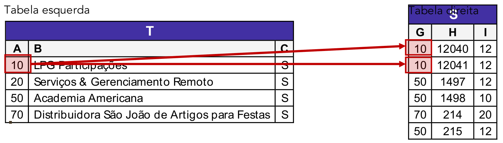

# Capítulo 7 – Linguagem SQL: Junções

Nos capítulos anteriores, dedicamos um tempo considerável ao processo de **normalização**, aprendendo a decompor grandes conjuntos de informações em tabelas menores, mais enxutas e consistentes. O resultado desse processo é um banco de dados organizado e livre de redundâncias, onde cada tabela armazena dados sobre uma única entidade. No entanto, essa organização nos deixa com um novo desafio: as informações que precisamos para gerar um relatório ou uma visualização útil raramente se encontram em uma única tabela. Para responder a perguntas de negócio como "Qual o nome do cliente que comprou o produto X?", precisamos de uma forma de conectar e combinar os dados que foram logicamente separados. É aqui que entram as **junções**.

## Conceitos Gerais

A cláusula **`JOIN`** é a ferramenta da linguagem SQL que nos permite implementar as operações de junção da Álgebra Relacional. Sua finalidade é combinar linhas de duas ou mais tabelas com base em uma coluna relacionada entre elas, geralmente a chave primária de uma tabela e a chave estrangeira correspondente em outra.

É através das junções que reconstruímos uma visão completa dos dados, unindo as informações que a normalização distribuiu. Existem quatro tipos principais de junções que são essenciais para o nosso estudo:

- **INNER JOIN (Junção Interna)**
- **LEFT JOIN (Junção Externa à Esquerda)**
- **RIGHT JOIN (Junção Externa à Direita)**
- **FULL OUTER JOIN (Junção Externa Completa)**

<div align="center">

</div>

Utilizando a teoria dos conjuntos como analogia, podemos visualizar o comportamento de cada junção:

- O **`INNER JOIN`** funciona como uma **interseção**, retornando apenas as linhas que possuem uma correspondência em **ambas** as tabelas.
- O **`LEFT JOIN`** retorna **todas** as linhas da tabela à esquerda da cláusula `JOIN` e apenas as linhas correspondentes da tabela à direita. Se não houver correspondência, as colunas da tabela da direita serão preenchidas com `NULL`.
- O **`RIGHT JOIN`** é o inverso do `LEFT JOIN`: retorna **todas** as linhas da tabela à direita e apenas as correspondentes da tabela à esquerda.
- O **`FULL OUTER JOIN`** funciona como uma **união completa**, retornando **todas** as linhas de **ambas** as tabelas. Se houver uma correspondência, as linhas são combinadas. Se não houver, as colunas da tabela sem correspondência são preenchidas com `NULL`.

Para desbravar cada um desses tipos de junção, utilizaremos duas tabelas de exemplo ao longo deste capítulo.

**Tabela `PRODUTO`**

|ID (PK)|NOME|PRECO|
|---|---|---|
|1|Camiseta|25|
|2|Calça Jeans|50|
|3|Tênis|80|
|4|Meia|5|

**Tabela `VENDAS`**

|ID (PK)|ID_PRODUTO (FK)|QUANTIDADE|
|---|---|---|
|1|1|10|
|2|2|5|
|3|1|3|
|4|3|5|

Neste cenário, a tabela `VENDAS` se relaciona com a tabela `PRODUTO` através da coluna `ID_PRODUTO`, que é uma chave estrangeira referenciando o `ID` da tabela `PRODUTO`. Note que o produto "Meia" (ID 4) existe, mas nunca foi vendido. Essa ausência de correspondência será fundamental para entendermos as diferenças entre os tipos de `JOIN`.

## FULL OUTER JOIN: A União Completa

O **`FULL JOIN`**, ou mais formalmente **`FULL OUTER JOIN`**, é o tipo de junção mais completo. Sua finalidade é combinar e retornar **todas as linhas** de **ambas as tabelas** participantes da junção.

<div align="center">

</div>

Ele funciona da seguinte maneira:

- Se houver uma correspondência entre as linhas das duas tabelas (com base na condição de junção), ele combina as colunas de ambas em uma única linha no resultado.
- Se uma linha da tabela da esquerda não encontrar uma correspondência na tabela da direita, ela ainda assim será incluída no resultado, e as colunas que viriam da tabela da direita serão preenchidas com valores `NULL`.
- Da mesma forma, se uma linha da tabela da direita não encontrar uma correspondência na tabela da esquerda, ela também será incluída no resultado, e as colunas da tabela da esquerda serão preenchidas com `NULL`.

### Sintaxe da Junção

A estrutura de uma consulta com `JOIN` é uma das mais importantes da linguagem SQL. É crucial entender cada um de seus componentes.

```SQL
SELECT <colunas>
FROM <tabela_esquerda>
FULL OUTER JOIN <tabela_direita>
ON <condicao_de_juncao>;
```

- **`FROM <tabela_esquerda>`**: A primeira tabela mencionada na consulta, que serve como base para a junção.
- **`FULL OUTER JOIN <tabela_direita>`**: O tipo de junção e a segunda tabela que será combinada.
- **`ON <condicao_de_juncao>`**: Esta é a cláusula mais importante. É aqui que especificamos a regra de correspondência, ou seja, as **colunas de equivalência**. A junção ocorrerá apenas para as linhas onde a condição `ON` for verdadeira. Geralmente, esta condição compara a chave primária de uma tabela com a chave estrangeira da outra.

Vamos analisar visualmente a sintaxe aplicada ao nosso exemplo, onde a coluna de correspondência é `PRODUTO.ID` e `VENDAS.ID_PRODUTO`.

<div align="center">

</div>

### Comportamento da Junção Completa

Ao executar um `FULL OUTER JOIN`, o SGBD analisa as linhas de ambas as tabelas e pode se deparar com três cenários distintos para formar o resultado final.

- **Cenário 1: Presença em Ambas as Tabelas (Correspondência Encontrada)**
	Quando um valor na coluna de equivalência da tabela da esquerda corresponde a um valor na coluna da direita, as linhas são combinadas. Se uma chave na tabela da esquerda corresponde a múltiplas chaves na direita (como no caso do `PRODUTO.ID = 1`, que tem duas vendas), a linha da tabela da esquerda será duplicada no resultado para formar um par com cada correspondência.

- **Cenário 2: Presença Somente na Tabela da Esquerda (Sem Correspondência)**
	Quando uma linha da tabela da esquerda não encontra nenhuma correspondência na tabela da direita, ela é mantida no resultado. Suas colunas são preenchidas com seus próprios dados, e todas as colunas que deveriam vir da tabela da direita são preenchidas com `NULL`. Em nosso exemplo, o produto "Meia" (`ID = 4`) se encaixa neste cenário.

- **Cenário 3: Presença Somente na Tabela da Direita (Sem Correspondência)**
	Inversamente, quando uma linha da tabela da direita não encontra nenhuma correspondência na esquerda, ela também é mantida, e as colunas da tabela da esquerda são preenchidas com `NULL`. Embora não tenhamos um exemplo direto em nossos dados, imagine que houvesse uma venda registrada com `ID_PRODUTO = 99`, para um produto que já foi excluído da tabela `PRODUTO`. Essa linha de venda apareceria no resultado do FULL JOIN, com as colunas `ID`, `NOME` e `PRECO` preenchidas com `NULL`.

Vamos analisar como cada linha da tabela se encaixa nas situações acima, graficamente.

### Exemplo Prático

Para entender como a tabela final de um `FULL OUTER JOIN` é montada, vamos simular o processo que o SGBD realiza, analisando cada linha da tabela da esquerda (`PRODUTO`) e buscando suas correspondências na tabela da direita (`VENDAS`).

**Análise para `PRODUTO.ID = 1` (Camiseta)**

O SGBD pega a primeira linha da tabela `PRODUTO` e procura por todas as linhas na tabela `VENDAS` onde `VENDAS.ID_PRODUTO` seja igual a 1.

<div align="center">

</div>

Neste caso, ele encontra duas correspondências: a venda com `ID = 1` e a venda com `ID = 3`. Como resultado, a linha do produto "Camiseta" será duplicada na tabela final para se combinar com cada uma das vendas encontradas.

**Linhas Resultantes para `PRODUTO.ID = 1`:**

<div align="center">

</div>

**Análise para `PRODUTO.ID = 2` (Calça Jeans)**

O processo se repete para o segundo produto. O SGBD busca por vendas onde `ID_PRODUTO = 2`.

<div align="center">

</div>

Ele encontra apenas uma correspondência, a venda com `ID = 2`. Portanto, apenas uma linha será gerada no resultado para este produto.

**Linha Resultante para `PRODUTO.ID = 2`:**

<div align="center">

</div>

**Análise para `PRODUTO.ID = 3` (Tênis)**

Novamente, o SGBD busca por vendas onde `ID_PRODUTO = 3`.

<div align="center">

</div>

Ele encontra uma única correspondência, a venda com `ID = 4`.

**Linha Resultante para `PRODUTO.ID = 3`:**

<div align="center">

</div>

**Análise para `PRODUTO.ID = 4` (Meia)**

Agora chegamos ao caso especial que define a natureza de um `OUTER JOIN`. O SGBD busca por vendas onde `ID_PRODUTO = 4`.

<div align="center">

</div>

Ele não encontra nenhuma correspondência. Em um `INNER JOIN`, esta linha seria simplesmente descartada. No entanto, como estamos em um **`FULL OUTER JOIN`**, a regra é preservar todas as linhas de ambas as tabelas. Portanto, a linha do produto "Meia" é mantida, e todas as colunas que deveriam vir da tabela `VENDAS` são preenchidas com o valor **`NULL`**, indicando a ausência de uma correspondência.

**Linha Resultante para `PRODUTO.ID = 4`:**

<div align="center">

</div>

**Resultado Final:**

Ao juntar todas as linhas que geramos em nossa análise passo a passo, obtemos a tabela de resultado final e completa da operação `FULL OUTER JOIN`.

<div align="center">

</div>

Esta tabela final nos dá uma visão completa do universo de dados: os produtos que foram vendidos (e os detalhes de suas vendas) e também os produtos que não tiveram nenhuma venda registrada, tudo em um único conjunto de resultados.

## INNER JOIN: A Interseção de Dados

O **`INNER JOIN`** (ou simplesmente `JOIN`, na maioria dos SGBDs) é o tipo de junção padrão e mais utilizado. Sua função é retornar apenas as linhas que possuem uma correspondência em **ambas** as tabelas, com base na condição de junção especificada na cláusula `ON`.

Utilizando a teoria dos conjuntos, o `INNER JOIN` funciona como uma **interseção**, selecionando apenas o universo de dados que é comum às duas tabelas.

<div align="center">

</div>

A principal característica que o distingue do `FULL OUTER JOIN` é que o `INNER JOIN` **descarta** qualquer linha de ambas as tabelas que não encontre um par correspondente. Como consequência direta, uma consulta com `INNER JOIN` nunca gerará linhas com valores `NULL` para as colunas das tabelas juntadas, pois apenas as combinações completas são mantidas.

### Exemplo Prático com `INNER JOIN`

Vamos aplicar o `INNER JOIN` às nossas tabelas `PRODUTO` e `VENDAS` para obter uma lista de todos os produtos que foram efetivamente vendidos, juntamente com os detalhes de suas vendas.

**Consulta:**

```sql
SELECT * FROM PRODUTO P
INNER JOIN VENDAS V ON P.ID = V.ID_PRODUTO;
```

**Análise do Processo:**

O SGBD irá percorrer as tabelas e construir um resultado apenas para as linhas onde a condição P.ID = V.ID_PRODUTO for verdadeira.

1. **Produtos com Vendas (IDs 1, 2 e 3):** Os produtos "Camiseta" (ID 1), "Calça Jeans" (ID 2) e "Tênis" (ID 3) possuem correspondências na tabela `VENDAS`. Suas linhas serão combinadas com as respectivas linhas de vendas. Note que "Camiseta" (ID 1), por ter duas vendas, aparecerá duas vezes no resultado final, uma vez para cada correspondência.
2. **Produto sem Venda (ID 4):** O produto "Meia" (ID 4) existe na tabela `PRODUTO`, mas não há nenhuma linha na tabela `VENDAS` com `ID_PRODUTO = 4`. Como não há correspondência, esta linha da tabela `PRODUTO` é **descartada** e não aparece no resultado.

**Resultado Final:**

A tabela resultante conterá apenas os produtos que foram vendidos, eliminando o produto "Meia" que não tinha correspondência na tabela de vendas.

<div align="center">

</div>

Como podemos observar, o resultado é um conjunto de dados "limpo" que mostra apenas as relações existentes entre as duas tabelas, tornando o `INNER JOIN` a ferramenta ideal para a maioria das consultas que buscam combinar informações relacionadas.

## LEFT JOIN: Priorizando a Tabela da Esquerda

O **`LEFT JOIN`** (ou, mais formalmente, **`LEFT OUTER JOIN`**) é um tipo de junção externa que combina tabelas priorizando a da esquerda. Seu comportamento é o seguinte: a consulta retorna **todas as linhas da tabela da esquerda** (a primeira tabela, declarada na cláusula `FROM`), independentemente de encontrarem ou não uma correspondência na tabela da direita.

<div align="center">

</div>

Quando uma correspondência é encontrada com base na condição da cláusula `ON`, as colunas de ambas as tabelas são combinadas. Quando uma linha da tabela da esquerda **não encontra** uma correspondência na tabela da direita, ela ainda assim é incluída no resultado, e as colunas que viriam da tabela da direita são preenchidas com valores `NULL`.

Este tipo de junção é extremamente útil para consultas que precisam listar todos os itens de um conjunto principal e, opcionalmente, mostrar informações relacionadas de outro conjunto. Por exemplo: "Listar **todos** os clientes e, para aqueles que fizeram pedidos, mostrar os detalhes desses pedidos".

### Exemplo Prático com `LEFT JOIN`

Para focar puramente na mecânica da junção, vamos utilizar um exemplo com duas tabelas genéricas, `T` e `S`.

<div align="center">

</div>

Vamos executar a seguinte consulta para juntar `T` e `S`:

```sql
SELECT *
FROM T
LEFT JOIN S ON T.A = S.G;
```

- **Tabela da esquerda:** `T`
- **Tabela da direita:** `S`
- **Colunas de equivalência:** `T.A` e `S.G`

O SGBD processará cada linha da tabela da esquerda (`T`) para construir o resultado.

**Análise para `T.A = 10`:**

O SGBD busca na tabela S por todas as linhas onde S.G = 10.

<div align="center">

</div>

Ele encontra duas correspondências. Portanto, a linha de T com A=10 será duplicada para se combinar com cada uma das correspondências encontradas.

<div align="center">

</div>

**Análise para `T.A = 20`:**

O SGBD busca na tabela S por linhas onde `S.G = 20`.

<div align="center">

</div>

Nenhuma correspondência é encontrada. Como estamos em um LEFT JOIN, a regra é preservar a linha da tabela da esquerda. A linha de T com A=20 é incluída no resultado, e as colunas de S (G, H, I) são preenchidas com NULL.

<div align="center">

</div>

**Análise para `T.A = 50`:**

O SGBD busca na tabela S por linhas onde S.G = 50.

<div align="center">

</div>

Ele encontra três correspondências. A linha de T com A=50 será triplicada para se combinar com cada uma delas.

<div align="center">

</div>

**Análise para `T.A = 70`:**

Por fim, o SGBD busca em S por linhas onde S.G = 70.

<div align="center">

</div>

Ele encontra uma única correspondência.

**Resultado Final:**

Juntando todos os resultados parciais, a tabela final da nossa operação `LEFT JOIN` é a seguinte, contendo uma representação para cada uma das quatro linhas originais da tabela `T`.

<div align="center">

</div>

Uma das aplicações analíticas mais poderosas do `LEFT JOIN` é encontrar registros que não têm correspondência. Ao executar um `LEFT JOIN` e depois filtrar por `WHERE S.G IS NULL`, isolaríamos a linha de `T.A = 20`, respondendo à pergunta "Quais registros em T não têm par em S?".

## RIGHT JOIN: Priorizando a Tabela da Direita

O **`RIGHT JOIN`** (ou, mais formalmente, **`RIGHT OUTER JOIN`**) é o oposto direto do `LEFT JOIN`. Esta junção retorna **todas as linhas da tabela da direita** (a segunda tabela, declarada após a cláusula `JOIN`), independentemente de encontrarem ou não uma correspondência na tabela da esquerda.

<div align="center">

</div>

Seu comportamento é o espelho do `LEFT JOIN`:

- Quando uma correspondência é encontrada com base na condição `ON`, as colunas de ambas as tabelas são combinadas.
- Quando uma linha da tabela da direita **não encontra** uma correspondência na tabela da esquerda, ela ainda assim é incluída no resultado, e as colunas que viriam da tabela da esquerda são preenchidas com valores `NULL`.
- Linhas da tabela da esquerda que não têm correspondência na tabela da direita são **descartadas**.

É importante notar que qualquer `RIGHT JOIN` pode ser reescrito como um `LEFT JOIN` simplesmente invertendo a ordem das tabelas na consulta. A consulta `FROM T RIGHT JOIN S` é logicamente idêntica a `FROM S LEFT JOIN T`. Por essa razão, muitos desenvolvedores preferem padronizar o uso do `LEFT JOIN` para manter a consistência do código.

### Exemplo Prático com `RIGHT JOIN`

Vamos utilizar as mesmas tabelas `T` e `S` para observar o comportamento inverso.

<div align="center">

</div>

Executaremos a seguinte consulta:

```sql
SELECT *
FROM T
RIGHT JOIN S ON T.A = S.G;
```

- **Tabela da esquerda:** `T`
- **Tabela da direita:** `S`
- **Coluna de equivalência:** `T.A` e `S.G`

Desta vez, a lógica da junção se concentra em garantir que cada linha da tabela da direita (`S`) esteja presente no resultado.

<div align="center">

</div>

**Análise do Processo:**

O SGBD agora percorre cada linha da tabela S e busca sua correspondência em T.

1. **Linhas de `S` com `G=10`:** As duas primeiras linhas de `S` possuem `G=10`. Ambas encontram uma correspondência na linha de `T` onde `A=10`. O resultado conterá duas linhas combinadas.
2. **Linhas de `S` com `G=50`:** As três linhas de `S` com `G=50` encontram, cada uma, uma correspondência na linha de `T` onde `A=50`. O resultado conterá três linhas combinadas para este caso.
3. **Linha de `S` com `G=70`:** A linha de `S` com `G=70` encontra uma correspondência na linha de `T` onde `A=70`, gerando uma linha no resultado.

**O que acontece com a linha T.A = 20?**

Como a análise parte da tabela da direita (S), e nenhuma linha em S possui o valor G=20, a linha da tabela T com A=20 ("Serviços & Gerenciamento Remoto") nunca é correspondida. Como o RIGHT JOIN não tem a obrigação de preservar as linhas sem correspondência da tabela da esquerda, esta linha é simplesmente descartada do resultado final.

**Resultado Final:**

Ao final do processo, a tabela resultante contém uma representação para cada uma das seis linhas originais da tabela `S`, que era a tabela principal nesta junção.

<div align="center">

</div>

Assim como o `LEFT JOIN` é útil para encontrar registros na tabela da esquerda que não têm par, o `RIGHT JOIN` é a ferramenta perfeita para a pergunta inversa: "Quais registros na tabela S não têm correspondência em T?", que seria respondida adicionando a condição `WHERE T.A IS NULL`.

## Operações de Conjunto: Combinando Resultados de Consultas

Além das junções (`JOIN`), que combinam **colunas** de diferentes tabelas para criar linhas mais "largas", a linguagem SQL oferece as **operações de conjunto**. Estes operadores trabalham de uma forma fundamentalmente diferente: eles combinam as **linhas** de dois ou mais resultados de consultas `SELECT`, criando um único conjunto de resultados mais "alto".

Enquanto as junções conectam dados horizontalmente com base em uma condição de correspondência, as operações de conjunto empilham dados verticalmente. Existem três operações principais, todas baseadas na teoria de conjuntos da matemática:

- **`UNION`**: Une os dois conjuntos.
- **`INTERSECT`**: Encontra a interseção entre os dois conjuntos.
- **`EXCEPT`**: Encontra a diferença entre os dois conjuntos.

<div align="center">

</div>

Para que estas operações funcionem, existem duas regras de ouro que devem ser seguidas:

1. As consultas `SELECT` que estão sendo combinadas devem ter o **mesmo número de colunas**.
2. Os tipos de dados das colunas correspondentes devem ser **compatíveis** (por exemplo, uma coluna de texto pode ser combinada com outra de texto, uma de número com outra de número, etc.).

### UNION

<div align="center">

</div>

O operador **`UNION`** é utilizado para combinar os conjuntos de resultados de duas ou mais consultas `SELECT` em um único resultado.

**Sintaxe Base:**

```sql
SELECT <colunas> FROM <tabela1>
UNION
SELECT <colunas> FROM <tabela2>;
```

Por padrão, o `UNION` **elimina automaticamente as linhas duplicadas** do resultado final. Se uma linha idêntica for retornada por ambas as consultas, ela aparecerá apenas uma vez.

Se a intenção for manter todas as linhas, incluindo as duplicatas, deve-se utilizar o operador **`UNION ALL`**. Por não precisar realizar a verificação de duplicatas, o `UNION ALL` é geralmente mais performático e é a escolha preferida quando se sabe que não haverá duplicatas ou quando elas são desejadas no resultado.

**Exemplo Prático:** Obter uma lista de todos os IDs de produtos, tanto os que existem no catálogo (`PRODUTO`) quanto os que foram vendidos (`VENDAS`), sem repetições.

```sql
SELECT ID FROM PRODUTO
UNION
SELECT ID_PRODUTO FROM VENDAS;
```

### INTERSECT

<div align="center">

</div>

O operador **`INTERSECT`** retorna apenas as linhas que estão presentes **em ambos** os conjuntos de resultados das consultas `SELECT`. É a verdadeira interseção de conjuntos.

**Sintaxe Base:**

```sql
SELECT <colunas> FROM <tabela1>
INTERSECT
SELECT <colunas> FROM <tabela2>;
```

Assim como o `UNION`, o `INTERSECT` também elimina duplicatas por padrão. A variação `INTERSECT ALL` pode ser usada em alguns SGBDs para manter as duplicatas.

**Exemplo Prático:** Em um cenário com uma tabela `Clientes_2024` e `Clientes_2025`, encontrar os clientes que foram ativos em **ambos os anos**.

```sql
SELECT ID_Cliente, Nome FROM Clientes_2024
INTERSECT
SELECT ID_Cliente, Nome FROM Clientes_2025;
```

### EXCEPT (ou MINUS)

<div align="center">

</div>

O operador **`EXCEPT`** retorna as linhas que estão presentes no resultado da **primeira consulta**, mas **não** no da segunda. Ele realiza uma operação de **diferença de conjuntos**. A ordem das consultas é crucial, pois `A EXCEPT B` é diferente de `B EXCEPT A`.

**Sintaxe Base:**

```sql
SELECT <colunas> FROM <tabela1>
EXCEPT
SELECT <colunas> FROM <tabela2>;
```

É importante notar que alguns SGBDs, como o Oracle, utilizam a palavra-chave **`MINUS`** em vez de `EXCEPT` para realizar a mesma operação.

**Exemplo Prático:** Utilizando o mesmo cenário anterior, encontrar os clientes que eram ativos em 2024, mas que **deixaram de ser** em 2025.

```sql
SELECT ID_Cliente, Nome FROM Clientes_2024
EXCEPT
SELECT ID_Cliente, Nome FROM Clientes_2025;
```

