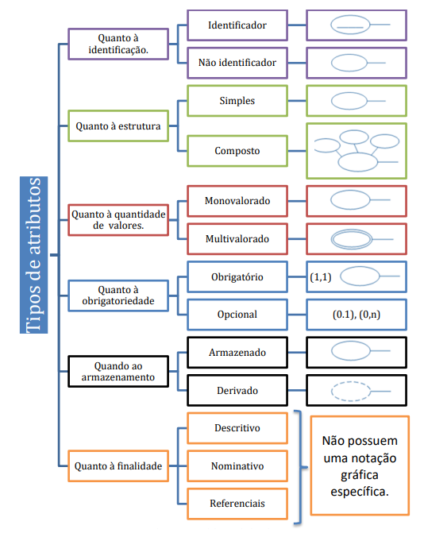
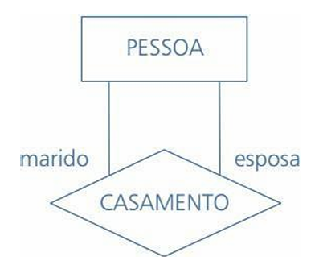
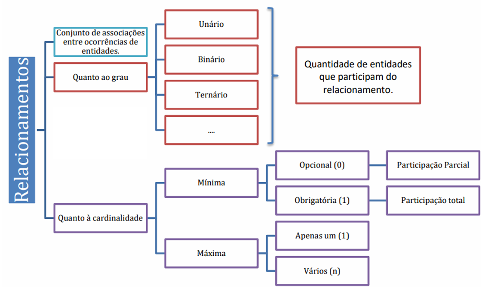

# Capítulo 7 – Modelo Entidade-Relacionamento (ER)

Durante o processo de projeto de um banco de dados, é essencial adotar uma abordagem conceitual que permita representar a estrutura da informação de maneira clara, precisa e independente de tecnologias específicas. Nesse contexto, o **Modelo Entidade-Relacionamento (ER)** se apresenta como uma ferramenta poderosa e amplamente utilizada. Desenvolvido por **Peter Chen** em 1976, esse modelo oferece um meio de representar os dados relevantes de um domínio de aplicação por meio de conceitos intuitivos, formas gráficas simples e uma notação formal que evita ambiguidades.

A modelagem conceitual, da qual o modelo ER faz parte, tem como objetivo capturar os aspectos fundamentais dos dados e de suas inter-relações, sem se preocupar com questões técnicas de implementação. Essa fase é crucial, pois serve como ponte entre os usuários do sistema e os projetistas do banco de dados. A clareza e a precisão obtidas por meio da modelagem conceitual garantem que a estrutura da base de dados refletirá fielmente os requisitos e as regras de negócio da organização.

## Características Desejáveis em um Modelo Conceitual

Para ser eficaz, um modelo conceitual de dados deve possuir algumas características fundamentais:

- **Expressividade**: o modelo precisa representar diferentes tipos de entidades, relacionamentos e restrições com precisão, permitindo capturar a complexidade do mundo real.
- **Simplicidade e compreensão**: deve ser simples o suficiente para ser entendido por usuários não técnicos, favorecendo a comunicação entre projetistas e stakeholders.
- **Minimalismo conceitual**: deve conter um número pequeno de conceitos fundamentais, bem definidos e não redundantes.
- **Representação diagramática**: deve permitir uma visualização gráfica clara, utilizando formas geométricas e conexões visuais para facilitar o entendimento.
- **Formalidade**: o modelo deve ser formal, ou seja, fornecer uma especificação precisa e não ambígua da estrutura dos dados.

O modelo ER atende a todas essas características de forma notável. Ele utiliza apenas três elementos básicos — entidades, relacionamentos e atributos — e os representa com figuras geométricas distintas: retângulos, losangos e elipses, respectivamente.

<div align="center">
  
</div>

Essa simplicidade, combinada com a capacidade de expressar estruturas complexas, faz do modelo ER uma ferramenta indispensável no planejamento de sistemas de informação.

## Entidades: Representando os Objetos do Mundo Real

Entidades são representações abstratas de objetos do mundo real sobre os quais desejamos manter informações. Uma entidade pode ser concreta, como um funcionário, um carro ou um livro, ou abstrata, como um feriado ou um conceito acadêmico.

<div align="center">
  
</div>

Ao modelar uma entidade, estamos tratando de um **tipo de entidade** — uma descrição genérica e padronizada de um conjunto de instâncias semelhantes. Por exemplo, a entidade FUNCIONÁRIO representa o conjunto de todos os funcionários de uma organização em determinado momento.

A figura a seguir foi retirada do artigo original de Peter Chen e exemplifica essa representação:

<div align="center">
  
</div>

Note que há dois retângulos representando as entidades **EMPREGADO** e **PROJETO**, ligadas pelo relacionamento **trabalha-no-projeto**. Essas entidades formam **conjuntos de entidades**, ou **entity sets**, isto é, coleções de objetos similares. Quando representamos uma instância, como o funcionário "Thiago Cavalcanti" com CPF "045034045-12", estamos lidando com um elemento do conjunto FUNCIONÁRIO.

A distinção entre tipo, conjunto e instância é útil para compreender a hierarquia de abstração envolvida na modelagem, embora, para fins didáticos, adotemos o uso simplificado do termo "entidade" para referir-nos ao tipo que representa um objeto real com seus atributos.

As entidades individuais que fazem parte de um conjunto são denominadas **extensão** de um conjunto de entidades. Assim, todos os funcionários de uma empresa são uma extensão do conjunto de entidades funcionários. Uma entidade pode ser concreta, como uma pessoa ou um livro, ou pode ser abstrata, como um feriado ou um conceito.

A seguir, temos um exemplo de diagrama ER com duas entidades — **Cliente** e **Empréstimo** — acompanhadas de seus atributos:

<div align="center">
  
</div>

## Atributos: Características das Entidades e Telacionamentos

Os **atributos** desempenham um papel fundamental na modelagem conceitual de dados. São eles os responsáveis por detalhar e caracterizar as **entidades** e os **relacionamentos**, fornecendo informações descritivas que permitem distinguir e entender os elementos representados no modelo. Em um diagrama ER, os atributos são ilustrados por **elipses**, conectadas por linhas às entidades ou relacionamentos aos quais pertencem. É importante saber que os atributos também podem ser representados por **círculos**, ou ainda não serem representados para não sobrecarregar o diagrama.

Embora sua representação gráfica seja simples, os atributos podem assumir diferentes **formas, estruturas e propósitos** dentro de um modelo. Compreender suas classificações e implicações é essencial para a construção de um modelo conceitual consistente e expressivo.

### Classificações dos atributos

#### Identificadores (ou Atributos-chave)

Todo tipo de entidade, via de regra, deve possuir um atributo — ou um conjunto de atributos — capaz de identificar univocamente cada uma de suas instâncias. Esses atributos são chamados de **atributos identificadores** ou **atributos-chave**. No diagrama ER, convencionou-se sublinhar o nome desses atributos dentro da elipse para indicar seu papel especial. Por exemplo, na entidade FUNCIONÁRIO, o atributo CPF pode ser um identificador único e, por isso, deve aparecer sublinhado.

Se apenas um atributo for suficiente para a identificação, temos um **identificador simples**. Se for necessário mais de um atributo, temos um **identificador composto**. A figura abaixo ilustra essas duas situações:

<div align="center">
  
</div>

Note que, em uma estante de livros, por exemplo, a identificação da prateleira pode depender do **posição da prateleira (número do corredor)** e da **identificação da prateleira**. Nesse caso, ambos os atributos formam juntos o identificador composto da entidade PRATELEIRA.

É importante mencionar que nem todas as entidades possuem atributos suficientes para formar um identificador completo. Quando isso ocorre, estamos diante de uma **entidade fraca**, que trataremos mais à frente. Nessas situações, o atributo existente na entidade é chamado de **chave parcial**, e sua notação gráfica é feita com uma **linha pontilhada sublinhando o atributo**.

<div align="center">
  
</div>


#### Atributos Simples e Compostos

Os atributos podem ainda ser classificados com base em sua **estrutura interna**:

- **Atributos simples**, também chamados de atômicos, são aqueles que não podem ser decompostos em subpartes. Um exemplo é o CPF de uma pessoa: ele é considerado um dado único e indivisível no contexto do banco de dados.
- **Atributos compostos** são aqueles que podem ser decompostos em atributos mais básicos, com significados próprios. Por exemplo, um endereço pode ser dividido em rua, número, complemento, bairro, cidade, CEP e estado. Cada uma dessas subpartes pode ser tratada como um atributo individual.

Embora atributos compostos forneçam uma descrição mais rica do dado, é importante que o projetista avalie o nível de detalhamento necessário. Em muitos casos, optar por um atributo simples pode ser suficiente e até desejável para evitar a complexidade desnecessária no modelo.

#### Atributos Monovalorados e Multivalorados

Outro critério de classificação dos atributos está relacionado ao número de valores que podem ser associados a uma instância da entidade:

- **Atributos monovalorados** são aqueles que possuem apenas um valor por instância. Por exemplo, a data de nascimento de uma pessoa ou o código de um produto.
- **Atributos multivalorados**, por sua vez, permitem múltiplos valores. Um exemplo clássico é o telefone de um cliente: uma pessoa pode ter vários números de telefone, como residencial, celular, profissional, etc.

No diagrama ER, atributos multivalorados são representados com **elipses duplas**. É possível ainda definir **limites mínimo e máximo** para a quantidade de valores permitidos, embora essas restrições não sejam explicitamente representadas no modelo conceitual. Em contextos específicos, no entanto, um projetista pode documentar essas regras como **regras de negócio** auxiliares.

#### Atributos Armazenados e Derivados

- **Atributos armazenados** são aqueles que efetivamente possuem seu valor gravado no banco de dados. São valores explícitos, fornecidos pelos usuários ou pelos sistemas.
- **Atributos derivados** são obtidos a partir de cálculos ou inferências baseados em outros atributos. Um exemplo comum é o atributo idade, que pode ser derivado a partir da data de nascimento e da data atual. Como os dados que permitem o cálculo já estão disponíveis, não há necessidade de armazenar a idade diretamente, evitando inconsistências.

Em diagramas ER, atributos derivados podem ser indicados com **elipses tracejadas**, embora isso seja opcional e dependa da notação utilizada.

#### Atributos Obrigatórios e Opcionais

Em certos casos, o valor de um atributo é **obrigatório** para todas as instâncias da entidade; em outros, ele pode ser **opcional**. Essa característica está relacionada à **cardinalidade mínima** do atributo:

- Um atributo com cardinalidade mínima igual a 1 é considerado **obrigatório**.
- Um atributo com cardinalidade mínima igual a 0 é considerado **opcional**.

Além disso, atributos podem também ser **multivalorados**, como discutido anteriormente. Veja o exemplo a seguir:

<div align="center">
  
</div>

A notação `(min, max)` ao lado do atributo expressa essas propriedades. No caso de Telefone(0, n) temos um atributo opcional e multivalorado, já Código(1, 1) é obrigatório e monovalorado. Note que a notação (1, 1) geralmente é omitida nas representações.

#### Atributos Descritivos, Nominativos e Referenciais

Outra forma de classificar atributos é de acordo com a **função que desempenham no modelo**:

- **Atributos descritivos**: representam características comuns do objeto, como data de nascimento, sexo, cor, etc.
- **Atributos nominativos**: além de serem descritivos, também funcionam como rótulos de identificação (como matrícula, código, número de série).
- **Atributos referenciais**: fazem referência a uma entidade externa, embora estejam presentes na entidade atual. Por exemplo, o atributo `id_fabricante` presente na entidade PRODUTO referencia a entidade FABRICANTE.

#### Atributos Nulos

Em determinadas situações, uma instância da entidade pode não possuir valor para um atributo, seja porque o valor não se aplica, seja porque ele é desconhecido. Nestes casos, utiliza-se o valor **nulo (NULL)**. Exemplos:

- Número do apartamento em uma casa: como casas não têm apartamentos, o valor seria nulo.
- Formação acadêmica de uma pessoa sem escolaridade: o valor também seria nulo.

É importante ressaltar que o valor nulo **não é zero nem uma string vazia**. Trata-se de um valor especial, que representa **ausência de informação ou não aplicabilidade**.

#### Atributos Complexos

Atributos compostos e multivalorados podem ser **aninhados** em estruturas mais sofisticadas, chamadas de **atributos complexos**. Nestes casos, utiliza-se a notação com **parênteses** para agrupamento e **chaves** para valores múltiplos. Veja um exemplo de atributo complexo:

```plaintext
{Endereço_telefone({Telefone(Codigo_area,Numero)},Endereco(Rua, Número, Bairro, Cidade))}
```

Essa estrutura indica que uma entidade pode ter múltiplos telefones e um endereço composto por várias partes.

#### Resumo

Um resumo de todos os atributos possíveis pode ser observado a seguir:

<div align="center">
  
</div>

## Relacionamentos: Associações entre Entidades

Os **relacionamentos** são elementos fundamentais do modelo ER. Eles representam as **associações lógicas** entre duas ou mais entidades. Por exemplo, o fato de um funcionário **trabalhar** em um departamento, ou de um cliente **realizar** um empréstimo, é representado por um relacionamento.

Graficamente, os relacionamentos são representados por **losangos**, conectados às entidades participantes por **linhas**. Veja um exemplo:

<div align="center">
  
</div>

Cada par (ou tupla) que liga uma instância de uma entidade a outra por meio do relacionamento é chamado de **ocorrência do relacionamento**.

### Grau do Relacionamento

O **grau** indica o número de entidades que participam do relacionamento:

- **Unário**: a entidade se relaciona consigo mesma (auto-relacionamento).
- **Binário**: envolve duas entidades (caso mais comum).
- **Ternário (ou maior)**: envolve três ou mais entidades.

Quanto maior o grau, maior a complexidade de interpretação e implementação do modelo.

### Razão de Cardinalidade

A **cardinalidade** determina quantas ocorrências de uma entidade estão associadas a quantas ocorrências da outra no relacionamento. Em relacionamentos binários, as razões mais comuns são:

- **1:1 (um para um)** – uma instância da entidade A se relaciona com uma única instância da entidade B, e vice-versa.
- **1:N (um para muitos)** – uma instância da entidade A pode se relacionar com muitas da entidade B, mas cada B se relaciona com no máximo uma A.
- **N:M (muitos para muitos)**: várias instâncias de A se relacionam com várias instâncias de B (muitos para muitos).

A figura a seguir ilustra a cardinalidade com notações do tipo (mínimo, máximo):

<div align="center">
  
</div>

Essa notação também permite identificar se o relacionamento é **obrigatório** (cardinalidade ≥1) ou **opcional** (cardinalidade mínima for 0).

### Auto-relacionamento e Papéis

O **auto-relacionamento**, também chamado de **relacionamento recursivo**, ocorre quando uma entidade se relaciona consigo mesma. Um exemplo clássico é o relacionamento **CASAMENTO** entre pessoas. Veja a seguir um exemplo com a entidade PESSOA e o relacionamento CASAMENTO:

<div align="center">
  
</div>

Os papéis "marido" e "esposa" ajudam a entender a multiplicidade da associação. A distinção dos papéis que uma instância pode assumir é essencial para o entendimento.

### Resumo

A seguir, uma síntese visual dos tipos de relacionamentos:

<div align="center">
  
</div>

## Entidades Fortes e Fracas

No modelo ER, uma **entidade forte** é aquela que possui **atributos suficientes para formar sua própria chave primária**. Já a **entidade fraca** depende de outra entidade (a chamada **entidade forte**) para ser identificada unicamente.

Entidades fracas surgem quando os atributos disponíveis não são suficientes para diferenciar uma instância de outra. Nesses casos, é necessário recorrer a um **relacionamento identificador** com uma entidade forte, combinando atributos das duas entidades para formar a chave.

A figura a seguir ilustra esse conceito:

<div align="center">  </div>

No exemplo, a entidade **EMENTA** depende da existência de uma **DISCIPLINA**. Ou seja, a ementa só existe se estiver associada a uma disciplina específica. Esse relacionamento (POSSUI) é **obrigatório**, e a entidade fraca herda parte da chave primária da entidade forte para formar a sua própria.

Observe que, embora a entidade fraca possa possuir um atributo próprio, como `id_ementa`, ele **sozinho não é suficiente** para garantir unicidade. Por isso, será necessário combiná-lo com, por exemplo, `id_disciplina` para formar uma chave composta.

Esse tipo de estrutura é comum em situações como:

- Dependentes de um funcionário
- Parcelas de uma fatura
- Itens de uma nota fiscal

## Considerações Finais

Neste capítulo, nos aprofundamos no **Modelo Entidade-Relacionamento (ER)**, a principal ferramenta para modelagem conceitual de dados. Vimos como representar, de maneira abstrata e intuitiva, os objetos do mundo real, suas características e inter-relações por meio de entidades, atributos e relacionamentos.

Compreender esse modelo é essencial para qualquer projeto de banco de dados, pois ele estabelece as bases sobre as quais será construída toda a estrutura lógica e física da base de dados. Um modelo bem elaborado garante não apenas fidelidade aos requisitos do negócio, mas também facilita a manutenção, expansão e eficiência do sistema como um todo.
