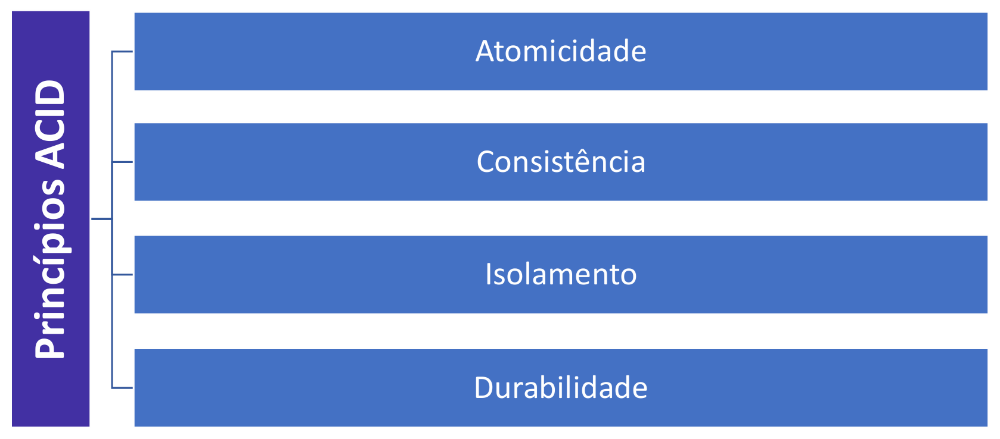
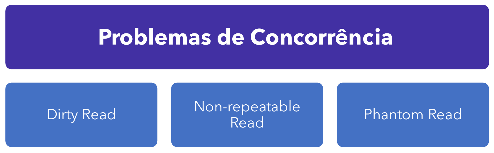
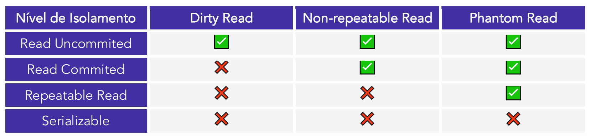
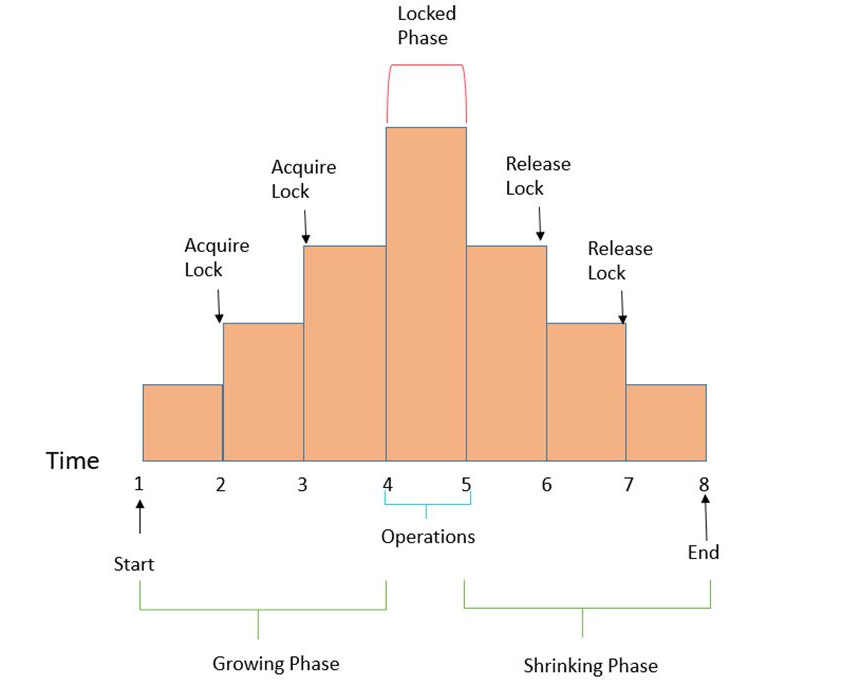
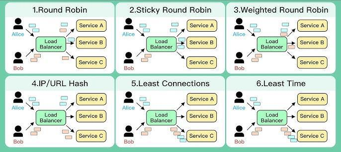
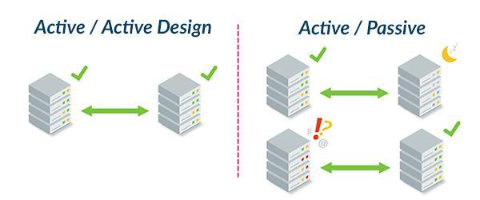
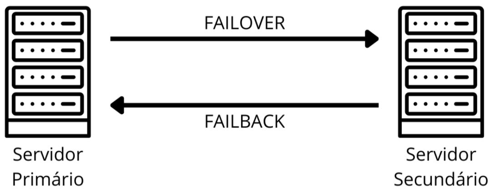

# Capítulo 8 – Transações em Bancos de Dados

Nos capítulos anteriores, focamos em como definir, manipular e consultar dados. Agora, vamos explorar o mecanismo que garante que todas essas operações ocorram de forma segura, consistente e confiável, especialmente em ambientes complexos com múltiplos usuários e a possibilidade de falhas: a **transação**. As transações são o coração pulsante de um banco de dados relacional, o processo que garante que os dados passem de um estado válido para outro sem erros, corrupção ou perda de informação.

## Conceitos Gerais

Uma **transação**, no contexto de bancos de dados, é uma sequência de uma ou mais operações que é executada como uma **única unidade lógica e indivisível de trabalho**. O princípio fundamental de uma transação é o "tudo ou nada": ou todas as operações dentro dela são concluídas com sucesso, ou nenhuma delas é efetivada, e o banco de dados retorna ao estado em que se encontrava antes de a transação começar.

O objetivo principal das transações é garantir a consistência e a integridade dos dados, mesmo em cenários de acesso concorrente (múltiplos usuários operando ao mesmo tempo) ou em caso de falhas de sistema, software ou hardware.

As operações contidas em uma transação são, tipicamente, os comandos DML que formam o acrônimo **CRUD** — Create (Criar), Read (Ler), Update (Atualizar) e Delete (Remover). Uma transação pode ser tão simples quanto um único `UPDATE` ou tão complexa quanto uma série de `INSERT`s, `UPDATE`s e `DELETE`s que representam uma completa operação de negócio.

<div align="center">

</div>

### Exemplo de uma Transação de Negócio

Vamos analisar um exemplo prático de uma transação em SQL que registra uma nova venda em um sistema de e-commerce. Esta única operação de negócio requer três passos no banco de dados:

```sql
BEGIN TRANSACTION;

-- Passo 1: Inserir o cabeçalho do pedido na tabela de Pedidos
INSERT INTO Pedidos (id_pedido, id_cliente, data_pedido, valor_total)
VALUES (1001, 200, '2025-04-07', 350.00);

-- Passo 2: Inserir os itens comprados na tabela Itens_Pedido
INSERT INTO Itens_Pedido (id_pedido, id_produto, quantidade, preco_unitario)
VALUES (1001, 501, 2, 175.00); -- O usuário comprou 2 unidades de R$175.00 e não R$100.00 como antes.

-- Passo 3: Atualizar o estoque do produto vendido na tabela Produtos
UPDATE Produtos
SET quantidade_estoque = quantidade_estoque - 2
WHERE id_produto = 501;

COMMIT;
```

Neste exemplo, as palavras-chave `BEGIN TRANSACTION` e `COMMIT` delimitam a unidade de trabalho. Se qualquer um dos três passos falhar (por exemplo, se o `UPDATE` no estoque não for possível por falta de produto), toda a transação seria desfeita, e o `INSERT` em `Pedidos` e `Itens_Pedido` seria revertido. Para entender por que e como isso funciona, precisamos primeiro explorar os princípios que governam todas as transações.

## Princípios ACID

**ACID** é um acrônimo que representa quatro propriedades fundamentais que garantem a confiabilidade das transações em um SGBD: **A**tomicidade, **C**onsistência, **I**solamento e **D**urabilidade.

<div align="center">

</div>

Esses princípios formam um "contrato" entre o SGBD e a aplicação, uma promessa de que os dados serão mantidos de forma íntegra e previsível, mesmo diante de erros ou acessos simultâneos. A aderência a estas propriedades é o que distingue um SGBD transacional robusto.

O uso dos princípios ACID é indispensável para manter a integridade dos dados em qualquer sistema onde a precisão e a confiabilidade são críticas, como em sistemas financeiros (transferências bancárias), comerciais (controle de estoque), de saúde (prontuários de pacientes) ou governamentais. A ausência dessas garantias poderia levar à corrupção de dados, inconsistências, perda de informações e falhas severas na operação das aplicações. Portanto, os princípios ACID são a base sobre a qual a confiança nos sistemas de banco de dados é construída.

Vamos agora explorar mais profundamente o significado de cada um desses quatro princípios.

### Atomicidade

A **atomicidade** refere-se ao princípio de que uma transação deve ser tratada como uma operação única e indivisível, do início ao fim. O nome deriva do conceito de "átomo" como uma unidade fundamental que não pode ser quebrada. Aplicado a bancos de dados, isso significa que ou **todas** as operações que compõem a transação são executadas com sucesso, ou **nenhuma** delas é efetivamente aplicada ao banco de dados. Não é permitido que o banco de dados termine em um estado intermediário ou parcial.

**ATOMICIDADE → TODAS AS OPERAÇÕES REALIZADAS COM SUCESSO, OU NÃO HÁ TRANSAÇÃO**

O exemplo clássico para ilustrar a atomicidade é a transferência bancária. Imagine uma transação que consiste em transferir R$ 100 da conta corrente para a conta poupança de uma mesma pessoa. Esta operação de negócio envolve dois passos no banco de dados:

1. **Débito:** Subtrair R$ 100 do saldo da conta corrente.
2. **Crédito:** Adicionar R$ 100 ao saldo da conta poupança.

A atomicidade garante que esses dois passos sejam tratados como um bloco único. Se ocorrer uma falha (uma queda de energia, um erro de sistema) após o primeiro passo, mas antes do segundo, o princípio da atomicidade entra em ação. O SGBD detecta que a transação não foi concluída com sucesso e executa um **`ROLLBACK`** (reversão) automático, desfazendo a operação de débito. Isso garante que o dinheiro não seja "perdido" no sistema.

Na prática, é o SGBD que gerencia este processo. Quando uma transação começa, todas as suas alterações são mantidas em um estado temporário. Se qualquer erro ocorrer, todas essas alterações temporárias são descartadas. Somente se todas as operações forem executadas com sucesso e um comando **`COMMIT`** for emitido, é que as alterações são permanentemente gravadas no banco de dados. O comando `COMMIT`, portanto, é a instrução que confirma a conclusão bem-sucedida da unidade atômica, garantindo que o conjunto de operações seja aplicado de forma indivisível.

### Consistência

O princípio da **consistência** garante que qualquer transação levará o banco de dados de um **estado válido para outro estado válido**. Em outras palavras, a transação deve preservar a integridade e a coerência dos dados, assegurando que todas as regras, restrições e relacionamentos definidos no _schema_ do banco de dados sejam respeitados ao final da operação.

Se a atomicidade garante que a transação aconteça por inteiro ou não aconteça, a consistência garante que o resultado final dessa transação seja "correto" de acordo com as regras de negócio e de dados predefinidas.

**CONSISTÊNCIA → MANTER AS REGRAS E A INTEGRIDADE DOS DADOS APÓS UMA TRANSAÇÃO**

No contexto de sistemas modernos, especialmente com bancos de dados distribuídos, o conceito de consistência também se estende à **consistência de leitura**. Isso significa garantir que, após uma escrita ser concluída, todos os diferentes nós ou réplicas do banco de dados eventualmente leiam a mesma informação atualizada, evitando que diferentes usuários vejam dados conflitantes.

#### As Ferramentas da Consistência: Restrições (Constraints)

A consistência não é uma propriedade mágica; ela é ativamente imposta pelo SGBD através de um conjunto de regras chamadas **restrições (_constraints_)**. As restrições são definidas durante a criação das tabelas (com o comando `CREATE TABLE`) e garantem que qualquer tentativa de inserir, atualizar ou excluir dados que viole essas regras seja rejeitada pelo banco de dados.

As principais restrições que garantem a consistência são:

- **Restrição de Integridade de Domínio:** Esta é a restrição mais básica. Ela garante que os valores inseridos em uma coluna pertençam ao seu domínio definido. Isso inclui:
    - **Tipo de Dado:** Um campo definido como `INT` não pode aceitar o texto "abc". Um campo `DATE` não pode aceitar um valor inválido como '2025-02-30'.
    - **Intervalos ou Formatos:** Podemos definir regras mais específicas, como garantir que uma coluna `Nota` só aceite valores entre 0 e 10.
- **Restrição de Integridade de Entidade:** Esta restrição assegura que cada linha (entidade) em uma tabela seja única e identificável. Ela é imposta pela **chave primária (`PRIMARY KEY`)**. Ao definir uma coluna como chave primária, o SGBD garante automaticamente que nenhum valor nela seja `NULL` ou duplicado.
- **Restrição de Integridade Referencial:** Garante que os relacionamentos entre tabelas sejam sempre válidos e consistentes. É imposta pela **chave estrangeira (`FOREIGN KEY`)**.
    - **Exemplo:** Se a tabela `Pedidos` tem uma chave estrangeira `ID_Cliente` que referencia a tabela `Clientes`, esta restrição impede a inserção de um pedido com um `ID_Cliente` que não exista na tabela `Clientes`. Da mesma forma, impede a exclusão de um cliente se ele ainda tiver pedidos associados.
- **Restrição de Integridade de Vazio (`NOT NULL`):** Uma das restrições mais simples e importantes. Ela define que uma determinada coluna é de preenchimento obrigatório, não permitindo a inserção ou atualização de um registro com um valor nulo (`NULL`) naquele campo.
- **Restrição de Integridade de Unicidade (`UNIQUE`):** Garante que todos os valores em uma coluna (ou conjunto de colunas) sejam únicos, evitando duplicatas. É similar à chave primária, mas com uma diferença crucial: uma restrição `UNIQUE` **permite** a inserção de múltiplos valores nulos (pois `NULL` não é considerado igual a `NULL`), enquanto a chave primária não permite nulos.
    - **Exemplo:** Em uma tabela de `Usuarios`, a coluna `Email` deve ser única, mas podemos não saber o email de todos os usuários no momento do cadastro.
- **Restrição de Integridade de Checagem (`CHECK`):** Esta é uma restrição flexível que permite definir uma regra de negócio (uma condição lógica) que os valores de uma coluna devem satisfazer.
    - **Exemplo:** Em uma tabela `Produtos`, podemos criar uma restrição para garantir que o `Preco` seja sempre maior que zero (`CHECK (Preco > 0)`). Em uma tabela `Funcionarios`, podemos garantir que a `Data_Contratacao` não seja uma data no futuro.

### Isolamento

O princípio do **isolamento** é a propriedade que garante que múltiplas transações, executadas de forma concorrente (ao mesmo tempo), não interfiram umas nas outras. Do ponto de vista de uma transação individual, o isolamento cria a ilusão de que ela está sendo executada sozinha no sistema, em uma "bolha" protegida das atividades das demais.

Uma transação em andamento não pode ver os estados intermediários e ainda não confirmados (não "commitados") de outra transação. O objetivo do isolamento é proteger a integridade do banco de dados contra as inconsistências temporárias que podem surgir do acesso simultâneo aos mesmos dados.

**Analogia:** Imagine duas pessoas editando o mesmo parágrafo em um documento compartilhado. Sem isolamento, uma pessoa veria as frases incompletas e os erros de digitação da outra em tempo real. Com isolamento, uma pessoa só veria as alterações da outra depois que ela terminasse o parágrafo e o salvasse (fizesse o `COMMIT`).

A violação do isolamento pode levar a uma série de problemas de concorrência, como:

- **Leituras Sujas (_Dirty Reads_):** Ler dados de uma transação que ainda não foi confirmada.
- **Leituras Não Repetíveis (_Non-Repeatable Reads_):** Reler o mesmo dado e obter um valor diferente.
- **Leituras Fantasmas (_Phantom Reads_):** Reler um conjunto de dados e encontrar novas linhas que não existiam antes.

Como já vimos, os SGBDs controlam o rigor do isolamento através dos **Níveis de Isolamento** (`READ COMMITTED`, `SERIALIZABLE`, etc.), permitindo um equilíbrio entre a consistência dos dados e a performance do sistema.

### Durabilidade

O princípio da **durabilidade** é a garantia final do SGBD. Ele assegura que, uma vez que uma transação tenha sido confirmada com sucesso (`COMMIT`), suas alterações são **permanentes e persistentes** no banco de dados. Essas alterações sobreviverão a qualquer falha subsequente do sistema, como quedas de energia, erros no sistema operacional ou problemas de hardware.

**Analogia:** Pense na durabilidade como a tinta indelével. Uma vez que a informação é escrita e o `COMMIT` é dado, a alteração não pode ser apagada por uma falha de sistema.

**Exemplo prático:** Se um cliente realiza uma compra em um site de e-commerce e recebe a tela de "Pedido Confirmado", essa confirmação implica que um `COMMIT` foi executado no banco de dados. A durabilidade garante que, mesmo que o servidor do site sofra uma queda de energia um segundo após a confirmação, o registro daquele pedido não será perdido. Ao reiniciar, o banco de dados estará em um estado consistente que reflete a conclusão daquela compra.

#### Como a Durabilidade é Alcançada?

A durabilidade é geralmente implementada pelos SGBDs através de um mecanismo chamado **log de transações** (_transaction log_ ou _write-ahead log - WAL_). O processo funciona da seguinte forma:

1. Quando uma transação realiza uma alteração, essa alteração é primeiro escrita em um arquivo de log sequencial no disco.
2. Quando o comando `COMMIT` é emitido, o SGBD garante que os registros correspondentes no log de transações sejam gravados de forma permanente em um armazenamento não volátil (como um SSD ou HD).
3. Somente **após** a gravação no log ser confirmada é que o SGBD reporta à aplicação que a transação foi bem-sucedida.
4. As alterações nos arquivos de dados principais do banco podem ser feitas posteriormente, de forma otimizada.

Em caso de uma falha, ao reiniciar, o SGBD lê o log de transações e pode "refazer" (_redo_) qualquer transação que foi confirmada mas cujas alterações ainda não haviam sido aplicadas aos arquivos de dados principais, garantindo assim a permanência de todas as operações concluídas.

## Controle de Concorrência e Isolamento

Como vimos no princípio de Isolamento do ACID, um SGBD deve garantir que transações executadas simultaneamente não interfiram umas nas outras. O **controle de concorrência** é o conjunto de mecanismos e técnicas que o SGBD utiliza para implementar este isolamento na prática.

Em qualquer sistema do mundo real, é inevitável que múltiplos usuários e aplicações tentem ler e escrever nos mesmos dados ao mesmo tempo. Sem um controle de concorrência robusto, essas operações paralelas poderiam levar ao caos, resultando em dados inconsistentes, relatórios incorretos e corrupção da integridade do banco de dados.

### Anomalias de Concorrência: Os Efeitos da Falta de Isolamento

Um isolamento inadequado entre as transações pode dar origem a uma série de problemas conhecidos como anomalias de concorrência. É crucial entender essas anomalias para apreciar a importância dos mecanismos de controle.

<div align="center">

</div>

- **Leitura Suja (Dirty Read):** Esta anomalia ocorre quando uma Transação A lê dados que foram modificados por uma Transação B que **ainda não foi confirmada (commitada)**.
    - **Exemplo:** A Transação B atualiza o preço de um produto para R$ 50,00. Antes do `COMMIT`, a Transação A lê este novo preço "sujo" de R$ 50,00 para gerar um relatório de vendas. Em seguida, a Transação B falha e executa um `ROLLBACK`, revertendo o preço para seu valor original. Agora, o relatório da Transação A está incorreto, pois foi baseado em um dado que, na prática, nunca existiu de forma permanente.
- **Leitura Não-Repetível (Non-repeatable Read):** Ocorre quando uma transação lê a **mesma linha** duas vezes, mas obtém valores diferentes porque uma outra transação alterou e confirmou essa linha no intervalo entre as duas leituras.
    - **Exemplo:** A Transação A lê o estoque de um produto e encontra 10 unidades. Enquanto a Transação A continua seu processamento, a Transação B vende 2 unidades daquele produto e confirma a alteração (`COMMIT`), atualizando o estoque para 8. Se a Transação A, dentro da mesma operação, reler o estoque daquele produto, ela agora encontrará 8 unidades. O mesmo dado lido duas vezes retornou valores diferentes, o que pode quebrar cálculos complexos.
- **Leitura Fantasma (Phantom Read):** Esta anomalia ocorre quando uma transação executa a mesma consulta com uma cláusula `WHERE` duas vezes, e o **conjunto de linhas** retornado é diferente. Isso acontece porque outra transação inseriu ou excluiu linhas que satisfazem a condição `WHERE` no intervalo entre as duas execuções.
    - **Exemplo:** A Transação A executa uma consulta para contar quantos funcionários existem no departamento de 'Vendas' e obtém o resultado `20`. Enquanto isso, a Transação B contrata um novo vendedor e confirma a inserção no banco. Se a Transação A repetir a mesma contagem, ela agora encontrará o resultado `21`. Uma nova linha "fantasma" apareceu no seu conjunto de resultados.

### Níveis de Isolamento do Padrão ANSI SQL

Para combater essas anomalias, os SGBDs implementam diferentes **níveis de isolamento**, conforme padronizado pela ANSI SQL. Cada nível oferece um grau diferente de proteção, representando um equilíbrio entre consistência e performance. Um nível mais alto de isolamento previne mais anomalias, mas pode reduzir a capacidade do sistema de lidar com muitas transações simultâneas (concorrência) e aumentar a chance de _deadlocks_.

> **Deadlock** (ou impasse) em bancos de dados é uma situação de bloqueio mútuo em que duas ou mais transações ficam permanentemente esperando por recursos que estão sendo mantidos umas pelas outras, impedindo que qualquer uma delas prossiga.

A tabela a seguir resume quais anomalias cada nível de isolamento previne. Um `X` vermelho indica que a anomalia é prevenida, enquanto um `V` verde indica que ela pode ocorrer.

<div align="center">

</div>

- **Read Uncommitted:** O nível mais baixo de isolamento. Permite a máxima concorrência, mas é vulnerável a todas as anomalias, incluindo leituras sujas. É raramente utilizado em sistemas transacionais.
- **Read Committed:** Garante que uma transação leia apenas dados que já foram confirmados por outras transações, **prevenindo as Leituras Sujas**. No entanto, as leituras não-repetíveis e fantasmas ainda podem ocorrer. É o nível de isolamento padrão na maioria dos SGBDs, como PostgreSQL, Oracle e SQL Server, por oferecer um bom equilíbrio.
- **Repeatable Read:** Um nível mais restritivo que garante que, se uma linha for lida múltiplas vezes dentro da mesma transação, ela sempre retornará os mesmos valores. **Previne Leituras Sujas e Não-Repetíveis**. As leituras fantasmas, no entanto, ainda são possíveis. É o nível padrão no MySQL (com o motor InnoDB).
- **Serializable:** O nível de isolamento mais alto e seguro. Ele garante que o resultado de transações concorrentes seja idêntico a alguma execução sequencial (em série) dessas mesmas transações. **Previne todas as anomalias**. Oferece a máxima consistência, mas ao custo de uma menor concorrência e, potencialmente, um desempenho mais lento.

## Bloqueios (Locks): Gerenciando o Acesso Concorrente

Os **bloqueios (_locks_)** são os mecanismos fundamentais que um SGBD utiliza para gerenciar o acesso concorrente aos dados e implementar os níveis de isolamento. Eles funcionam como "semáforos" que regulam o acesso a recursos compartilhados (como uma linha, uma página de dados ou uma tabela inteira), garantindo que duas ou mais transações não interfiram negativamente umas nas outras.

Quando uma transação precisa acessar um dado, ela solicita um bloqueio sobre aquele recurso ao SGBD. Se nenhuma outra transação possuir um bloqueio conflitante, o SGBD concede o bloqueio, e a transação pode prosseguir. Se houver um conflito, a transação solicitante é colocada em uma fila de espera até que o bloqueio seja liberado. O controle por bloqueios é a forma mais tradicional e amplamente adotada para garantir as propriedades ACID em ambientes multiusuário.

Existem diferentes tipos e granularidades de bloqueios, mas para nosso estudo, vamos nos concentrar nos três modos de bloqueio mais básicos e essenciais.

### Bloqueios Compartilhados (Shared Locks - S)

Um **bloqueio compartilhado**, também conhecido como **Shared Lock (S)** ou _Read Lock_, é o tipo de bloqueio mais permissivo. Como o nome sugere, ele é utilizado principalmente para operações de **leitura** (`SELECT`).

Sua característica fundamental é a **compatibilidade**: múltiplas transações podem obter e manter um bloqueio compartilhado sobre o mesmo recurso **simultaneamente**. A função primordial deste bloqueio é garantir que, enquanto uma ou mais transações estão lendo um dado, nenhuma outra transação possa modificá-lo, evitando assim as leituras sujas (_dirty reads_) e garantindo uma leitura consistente.

De forma geral, um bloqueio compartilhado (S) tem as seguintes propriedades:

- Permite que múltiplas transações leiam o mesmo dado ao mesmo tempo.
- **Impede** que qualquer outra transação adquira um bloqueio de escrita (Exclusivo) sobre o dado enquanto ele estiver ativo.
- **Não impede** que outras transações adquiram novos bloqueios compartilhados (S) sobre o mesmo dado.

**Exemplo Prático Detalhado:**

Imagine um cenário em um site de e-commerce. Temos uma tabela `PRODUTOS` com o seguinte registro:

|ID_PRODUTO|NOME|ESTOQUE|
|---|---|---|
|101|Tênis de Corrida|20|

Agora, duas transações concorrentes são iniciadas:

- **Transação T1 (Cliente A):** Inicia uma operação para visualizar a página do "Tênis de Corrida". Para ler o estoque de forma consistente, o SGBD adquire um **Bloqueio Compartilhado (S)** sobre a linha do produto 101.
- **Transação T2 (Cliente B):** Simultaneamente, o Cliente B também acessa a página do mesmo produto. Para ler o estoque, o SGBD solicita um **Bloqueio Compartilhado (S)** sobre a mesma linha.

**Resultado:** Como os bloqueios compartilhados são compatíveis entre si, o SGBD concede o bloqueio para a Transação T2 sem problemas. Ambas as transações (T1 e T2) podem ler o estoque de `20` ao mesmo tempo, pois nenhuma delas está tentando modificar o dado.

Agora, imagine uma terceira transação:

- **Transação T3 (Estoquista):** O estoquista tenta dar entrada em 5 novas unidades do mesmo tênis, executando um `UPDATE` na linha 101. Para isso, a Transação T3 solicita um **Bloqueio Exclusivo (X)**.

**Resultado:** Como o recurso já possui bloqueios compartilhados (de T1 e T2), e um bloqueio exclusivo não é compatível com eles, a Transação T3 **será colocada em espera**. Ela só poderá prosseguir e atualizar o estoque depois que tanto T1 quanto T2 terminarem suas leituras e liberarem seus respectivos bloqueios compartilhados.

### Bloqueios de Atualização (Update Locks - U)

O **bloqueio de atualização**, ou **Update Lock (U)**, é um tipo de bloqueio mais sofisticado, utilizado por alguns SGBDs (notavelmente o Microsoft SQL Server) como uma medida preventiva contra um problema de concorrência comum e perigoso conhecido como **deadlock de conversão**.

Ele atua como um "marcador de intenção". Uma transação adquire um bloqueio de atualização quando pretende **ler** um recurso com a **possível intenção de modificá-lo futuramente**.

#### Deadlock de Conversão

Para entender a necessidade do Update Lock, precisamos primeiro entender o problema que ele resolve. Um _deadlock_ de conversão pode ocorrer no seguinte cenário:

1. A **Transação T1** precisa ler a Linha A. Ela adquire um **Bloqueio Compartilhado (S)** sobre a Linha A.
2. Simultaneamente, a **Transação T2** também precisa ler a mesma Linha A. Como bloqueios compartilhados são compatíveis, T2 também adquire um **Bloqueio Compartilhado (S)** sobre a Linha A.
3. Agora, a **Transação T1** decide que precisa **atualizar** a Linha A. Para fazer isso, ela precisa "promover" seu bloqueio de Compartilhado (S) para **Exclusivo (X)**. No entanto, ela não pode, pois a Transação T2 ainda mantém um bloqueio Compartilhado (S) no recurso, e bloqueios S e X são incompatíveis. A Transação T1 entra em estado de espera.
4. Em seguida, a **Transação T2** também decide que precisa **atualizar** a Linha A. Ela também tenta promover seu bloqueio S para um bloqueio X. No entanto, ela também não pode, pois a Transação T1 já tem um bloqueio S. A Transação T2 também entra em estado de espera.

Neste ponto, temos um impasse clássico (_deadlock_): T1 está esperando T2 liberar seu bloqueio para poder prosseguir, e T2 está esperando T1 liberar o seu. Nenhuma das duas pode avançar, e elas ficariam presas para sempre se o SGBD não interviesse para abortar uma delas.

#### A Solução: com Update Lock (U)

O bloqueio de atualização (U) foi criado para prevenir exatamente este cenário. Ele introduz uma nova regra de compatibilidade:

- Apenas **uma** transação pode manter um bloqueio de atualização (U) sobre um recurso em um determinado momento.
- Um bloqueio de atualização (U) **é compatível** com bloqueios compartilhados (S). Isso significa que, enquanto uma transação tem um bloqueio U (indicando sua intenção de atualizar), outras transações ainda podem ler o dado (adquirindo bloqueios S).
- Quando a transação com o bloqueio U decide efetivamente escrever no dado, seu bloqueio é promovido para Exclusivo (X). Como ela era a única com a "intenção" de atualizar, não haverá conflito de conversão.

**Exemplo Prático Detalhado:**

Vamos revisitar o cenário anterior, agora com o Update Lock.

1. A **Transação T1** precisa ler a Linha A com a intenção de, talvez, atualizá-la. Em vez de um bloqueio S, ela solicita e obtém um **Bloqueio de Atualização (U)**.
2. A **Transação T2** também precisa ler a Linha A com a intenção de atualizá-la. Ela tenta obter um **Bloqueio de Atualização (U)**.
3. **Conflito!** Como apenas uma transação pode ter um bloqueio U por vez, a solicitação da Transação T2 é **negada**, e ela é colocada em espera.
4. A **Transação T1** decide agora atualizar a Linha A. O SGBD promove seu bloqueio U para um **Bloqueio Exclusivo (X)**. Como não há outros bloqueios conflitantes (outras transações podem estar lendo com S, mas não tentando atualizar), a promoção é instantânea.
5. A Transação T1 realiza a escrita e, ao terminar, libera seu bloqueio X.
6. Agora, a Transação T2, que estava esperando, pode finalmente adquirir seu bloqueio U e prosseguir.

Ao serializar a "intenção de atualizar", o Update Lock impede que o impasse de conversão ocorra, garantindo um fluxo de transações mais ordenado e previsível em cenários de leitura-seguida-de-escrita.

### Bloqueios Exclusivos (Exclusive Locks - X)

O **bloqueio exclusivo**, ou **Exclusive Lock (X)**, é o tipo de bloqueio mais restritivo e poderoso em um SGBD. Ele é adquirido por uma transação que pretende realizar uma operação de **escrita**, como `UPDATE`, `DELETE` ou `INSERT`.

Sua principal característica é garantir o **acesso único e total** ao recurso para a transação que o detém. Quando uma transação obtém um bloqueio exclusivo sobre uma linha, nenhuma outra transação concorrente pode obter _qualquer_ tipo de bloqueio (seja ele compartilhado, de atualização ou outro exclusivo) sobre o mesmo recurso.

As propriedades de um bloqueio exclusivo (X) são:

- **Exclusividade Total:** A transação que o detém tem controle total sobre o dado.
- **Incompatibilidade:** Um bloqueio X é incompatível com todos os outros tipos de bloqueio. Se uma transação solicitar um bloqueio X sobre um dado que já tenha qualquer outro bloqueio, ou vice-versa, a transação solicitante será forçada a esperar.
- **Máxima Proteção:** Ao impedir qualquer outro acesso simultâneo, o bloqueio exclusivo previne todas as anomalias de concorrência relacionadas àquele dado específico, como leituras sujas e atualizações perdidas.
- **Potencial de Contenção:** Por ser tão restritivo, ele pode se tornar um gargalo de desempenho em ambientes de alta concorrência. Uma transação longa que mantém um bloqueio exclusivo sobre um registro muito acessado pode criar uma "fila" de outras transações esperando, um fenômeno conhecido como contenção de bloqueio (_lock contention_).

**Exemplo Prático Detalhado:**

Vamos revisitar o exemplo da atualização de um saldo bancário para ver o bloqueio exclusivo em ação. Considere uma conta com saldo de R$ 1.000,00.

1. **Início da Transação T1 (Saque):** Uma transação `T1` é iniciada para realizar um saque de R$ 200,00. Para executar o comando `UPDATE Contas SET saldo = 800 WHERE id_conta = 123;`, `T1` solicita e obtém um **Bloqueio Exclusivo (X)** sobre a linha da conta 123.
2. **Início da Transação T2 (Consulta):** Simultaneamente, uma transação `T2` é iniciada por outro sistema para gerar um extrato, tentando ler o saldo da mesma conta 123. Para isso, `T2` solicita um **Bloqueio Compartilhado (S)**.
3. **Ocorrência do Conflito:** O SGBD verifica a compatibilidade. O bloqueio `S` solicitado por `T2` é **incompatível** com o bloqueio `X` já mantido por `T1`.
4. **Estado de Espera:** A Transação `T2` é colocada em uma fila de espera. Ela fica "congelada", aguardando a liberação do recurso.
5. **Finalização da Transação T1:** A Transação `T1` completa sua operação com sucesso e executa um `COMMIT`. Este comando torna a alteração do saldo para R$ 800,00 permanente e, crucialmente, **libera o Bloqueio Exclusivo (X)**.
6. **Continuação da Transação T2:** Com o recurso agora livre, o SGBD concede o bloqueio `S` pendente para a Transação `T2`. Ela pode, então, prosseguir com sua leitura e obterá o valor consistente e já atualizado de R$ 800,00.

Este processo garante que a `T2` nunca leia um estado intermediário ou inconsistente dos dados, ilustrando o papel vital do bloqueio exclusivo na manutenção da integridade transacional.

### Matriz de Compatibilidade de Bloqueios

Para resumir a interação entre os três tipos de bloqueios que vimos, podemos usar uma matriz de compatibilidade. Ela mostra se um bloqueio pode ser concedido a uma transação (requisitante) quando outra transação já detém um bloqueio (mantido) sobre o mesmo recurso.

|Lock Mantido|Lock Requisitado: S (Leitura)|Lock Requisitado: U (Atualização)|Lock Requisitado: X (Escrita)|
|---|---|---|---|
|**S (Leitura)**|Compatível|Compatível|Incompatível|
|**U (Atualização)**|Compatível|Incompatível|Incompatível|
|**X (Escrita)**|Incompatível|Incompatível|Incompatível|

### Protocolo de Bloqueio de Duas Fases (Two-Phase Locking - 2PL)

Os tipos de bloqueios que vimos (Compartilhado, de Atualização e Exclusivo) são as ferramentas. O **Protocolo de Bloqueio de Duas Fases (2PL)** é o conjunto de regras, ou a estratégia, que governa como essas ferramentas devem ser utilizadas para garantir a **serializabilidade** das transações.

O objetivo do 2PL é assegurar que o resultado de transações concorrentes seja o mesmo que se elas tivessem sido executadas em alguma ordem sequencial, uma após a outra. É o principal protocolo utilizado pelos SGBDs para implementar o nível de isolamento `SERIALIZABLE`.

Como o nome sugere, o protocolo divide a vida de uma transação em duas fases distintas e irreversíveis:

#### Fase 1: Crescimento (Growing Phase)

Nesta primeira fase, a transação está livre para **adquirir** todos os bloqueios de que necessita para realizar seu trabalho (sejam eles compartilhados, de atualização ou exclusivos). Durante a fase de crescimento, a regra é clara: a transação pode solicitar novos bloqueios, mas **não pode liberar nenhum bloqueio** que já possua. É uma fase de "acumulação" de permissões.

#### Fase 2: Encolhimento (Shrinking Phase)

A fase de encolhimento começa no exato momento em que a transação libera seu **primeiro bloqueio**. A partir deste ponto, a regra se inverte: a transação pode continuar a **liberar** os bloqueios que detém, mas está estritamente **proibida de adquirir qualquer novo bloqueio**.

Se uma transação, já na fase de encolhimento, descobrir que precisa de um novo bloqueio para completar seu trabalho, o protocolo 2PL é violado. Nesse caso, o SGBD é forçado a abortar (`ROLLBACK`) a transação para preservar a integridade do sistema.

O diagrama a seguir ilustra visualmente a linha do tempo de uma transação sob o protocolo 2PL.

<div align="center">

</div>

Ao impor essa disciplina de adquirir todos os bloqueios necessários antes de começar a liberá-los, o 2PL garante a serializabilidade e previne todas as anomalias de concorrência que estudamos (_dirty read_, _non-repeatable read_ e _phantom read_).

#### Variações do Protocolo 2PL

Existem variações do protocolo 2PL que impõem regras ainda mais estritas para oferecer garantias adicionais.

- **2PL Estrito (Strict 2PL):** Nesta variação, uma transação mantém todos os seus **bloqueios exclusivos (X)** até o seu término (seja por `COMMIT` ou `ROLLBACK`). Ela pode liberar bloqueios compartilhados (S) durante a fase de encolhimento, mas os bloqueios de escrita são retidos até o final. A grande vantagem é que isso evita um problema chamado "rollbacks em cascata", garantindo que nenhuma transação leia um dado modificado por outra que ainda não foi concluída.
- **2PL Rigoroso (Rigorous 2PL):** É a variação mais restritiva e a mais comum na prática. No 2PL Rigoroso, uma transação mantém **todos os seus bloqueios**, tanto compartilhados (S) quanto exclusivos (X), até o seu término (`COMMIT` ou `ROLLBACK`). Não há uma fase de encolhimento gradual; todos os bloqueios são liberados de uma só vez no final. A maioria dos SGBDs comerciais implementa o 2PL Rigoroso para o nível de isolamento `SERIALIZABLE`.
- **2PL Conservador (Conservative 2PL):** Uma variação mais teórica e menos comum, onde a transação deve declarar e **adquirir todos os bloqueios de que precisará antes mesmo de iniciar sua execução**. A principal vantagem é que ela é inerentemente livre de _deadlocks_. A desvantagem é sua impraticabilidade, pois é difícil prever todos os recursos necessários com antecedência, e isso reduz drasticamente a concorrência, pois os recursos ficam bloqueados por muito mais tempo do que o necessário.

## Segurança e Acesso: Gerenciamento de Usuários

O **Gerenciamento de Usuários** em bancos de dados é o conjunto de processos, políticas e mecanismos que controlam quem pode acessar o SGBD e o que cada pessoa pode fazer após o acesso. Em um mundo onde os dados são um dos ativos mais valiosos de uma organização, um gerenciamento de acesso robusto é a primeira e mais importante linha de defesa para assegurar a segurança, a integridade e a privacidade das informações armazenadas.

Os principais objetivos de um bom sistema de gerenciamento de usuários são garantir a segurança dos dados ao impedir acessos não autorizados, facilitar a auditoria e o monitoramento das atividades, permitir a aplicação do **princípio do menor privilégio** (garantindo que os usuários tenham apenas os acessos estritamente necessários para executar suas funções) e assegurar a conformidade com normas regulatórias de proteção de dados, como a LGPD no Brasil.

#### Os Dois Pilares da Segurança: Autenticação e Autorização

Para entender o gerenciamento de usuários, é crucial diferenciar dois conceitos fundamentais:

- **Autenticação ("Quem é você?"):** Este é o processo de **verificar a identidade** de um usuário. É o "portão de entrada" do sistema. Antes que qualquer acesso seja permitido, o usuário deve provar que é quem diz ser. Os métodos de autenticação incluem:
    - **Credenciais Tradicionais:** O método mais comum de login e senha.
    - **Autenticação Multifator (MFA/2FA):** Uma camada adicional de segurança que exige uma segunda forma de verificação, como um código gerado por um aplicativo no celular.
    - **Integração com Diretórios Externos:** Em ambientes corporativos, o SGBD pode ser integrado a sistemas de diretório centralizados como **Active Directory** (Microsoft) ou **LDAP**. Isso permite que os usuários se autentiquem com as mesmas credenciais que já usam na rede da empresa, facilitando o gerenciamento e a implementação de políticas de senha centralizadas.
- **Autorização ("O que você pode fazer?"):** Este é o processo que ocorre **após** uma autenticação bem-sucedida. A autorização define as **permissões** do usuário, especificando a quais objetos do banco de dados (tabelas, visões, etc.) ele pode acessar e quais operações (`SELECT`, `INSERT`, `UPDATE`, `DELETE`) ele pode executar sobre eles.

#### A Evolução do Controle: Do Usuário ao Papel (RBAC)

Nos primórdios dos bancos de dados, as permissões eram frequentemente gerenciadas "por usuário". Cada indivíduo recebia um conjunto customizado de permissões, o que, em grandes organizações, criava um emaranhado complexo e de difícil manutenção.

Atualmente, o modelo mais adotado e eficiente é o **RBAC (Role-Based Access Control)**, ou Controle de Acesso Baseado em Papéis. A lógica do RBAC é simples e elegante:

1. As permissões não são atribuídas diretamente aos usuários.
2. Em vez disso, são criados **papéis (_roles_)**, que representam funções de negócio ou grupos de usuários (ex: "Analista_Financeiro", "Vendedor", "Gerente_RH").
3. As permissões necessárias para cada função são concedidas diretamente ao **papel**.
4. Por fim, os usuários são atribuídos aos papéis apropriados e **herdam** automaticamente todas as permissões daquele papel.

**Analogia:** O método "por usuário" é como dar a cada funcionário um molho de chaves individuais e customizadas. O RBAC é como criar conjuntos de chaves mestras para cada departamento ("Chaves do Financeiro", "Chaves do Marketing"). Quando um novo funcionário entra para o time de finanças, basta entregar a ele o conjunto de chaves do departamento. Isso simplifica drasticamente a administração, melhora a segurança e facilita a auditoria de acessos.

#### Implementando o Controle de Acesso com SQL

A implementação do gerenciamento de usuários e papéis é realizada através dos comandos da **DCL (Data Control Language)**, que já exploramos.

**Exemplo Prático de RBAC:**

1. **Criar um Papel:** O DBA primeiro cria um papel para uma função de negócio.

```sql
CREATE ROLE Analista_de_Vendas;
```

2. **Conceder Permissões ao Papel (`GRANT`):** O DBA concede as permissões necessárias para que um analista de vendas faça seu trabalho.

```sql
GRANT SELECT ON Clientes TO Analista_de_Vendas;
GRANT SELECT, INSERT ON Pedidos TO Analista_de_Vendas;
```

3. **Atribuir Usuários ao Papel:** Quando um novo funcionário, "carlos", entra para a equipe, o DBA simplesmente o atribui ao papel.

```sql
-- (Supondo que o usuário 'carlos' já foi criado com CREATE USER)
GRANT Analista_de_Vendas TO carlos;
```

Agora, o usuário "carlos" herda automaticamente todas as permissões do papel `Analista_de_Vendas`. Se, no futuro, a função de analista precisar de acesso a uma nova tabela, o DBA só precisa conceder a permissão ao papel, e todos os usuários atribuídos a ele receberão o novo acesso instantaneamente.

## Escalabilidade e Performance: Balanceamento de Carga

Em um sistema de banco de dados, o **balanceamento de carga (_load balancing_)** é o processo de distribuir eficientemente as solicitações de acesso e as operações de dados entre múltiplos servidores ou nós. À medida que uma aplicação cresce, um único servidor de banco de dados inevitavelmente atinge seus limites de capacidade (CPU, memória, I/O), tornando-se um gargalo que causa lentidão e pode levar à indisponibilidade.

O balanceamento de carga é a principal ferramenta para implementar a **escalabilidade horizontal**, que consiste em adicionar mais servidores ao sistema para lidar com o aumento da demanda, em vez de apenas tornar um único servidor mais potente (escalabilidade vertical). Essa distribuição de trabalho visa otimizar o uso dos recursos, melhorar o tempo de resposta das consultas, aumentar a resiliência do sistema e garantir uma alta disponibilidade.

### Estratégias Arquiteturais de Balanceamento

Existem diferentes estratégias arquiteturais para distribuir a carga em um sistema de banco de dados, cada uma adequada a um tipo diferente de problema.

- **Balanceamento via Replicação (Read/Write Split):** Esta é a abordagem mais comum. A arquitetura é composta por um nó **primário (master)**, que lida com todas as operações de escrita (`INSERT`, `UPDATE`, `DELETE`), e um ou mais nós **secundários (réplicas)**, que são cópias do nó primário e lidam com as operações de leitura (`SELECT`). Um balanceador de carga direciona as leituras para as diversas réplicas, distribuindo o esforço. Esta estratégia é ideal para aplicações com um volume muito maior de leituras do que de escritas, como portais de notícias, blogs e catálogos de e-commerce.
- **Balanceamento via Particionamento (Sharding):** Utilizado para lidar com volumes de dados massivos, o particionamento, ou _sharding_, envolve dividir horizontalmente os dados de uma tabela entre diversos nós independentes. Cada nó (ou _shard_) armazena um subconjunto específico dos dados. Por exemplo, em uma base de clientes global, os clientes da América do Sul poderiam estar em um _shard_, os da Europa em outro, e os da Ásia em um terceiro. As requisições são então roteadas diretamente ao nó que contém os dados necessários, distribuindo tanto a carga de armazenamento quanto a de processamento.
- **Balanceamento de Alta Disponibilidade (Active-Active / Multi-Master):** Nesta arquitetura avançada, múltiplos servidores estão ativos simultaneamente (_multi-master_), e todos são capazes de atender tanto a operações de leitura quanto de escrita. A sincronização dos dados ocorre entre todos os nós. Esta abordagem oferece altíssima disponibilidade para escritas e pode reduzir a latência para usuários geograficamente distribuídos, mas introduz uma grande complexidade no que diz respeito à resolução de conflitos (o que fazer se o mesmo dado for alterado em dois mestres diferentes ao mesmo tempo).

### Algoritmos de Distribuição de Carga

Depois de definir a estratégia arquitetural de um banco de dados distribuído (replicação, particionamento, etc.), o passo seguinte é escolher o **algoritmo** que o balanceador de carga usará para tomar a decisão de roteamento para cada requisição individual. A escolha do algoritmo correto é crucial e depende da natureza da aplicação, da homogeneidade dos servidores e dos objetivos de performance.

O diagrama a seguir ilustra vários dos algoritmas mais comuns utilizados em sistemas de balanceamento de carga.

<div align="center">

</div>

Vamos agora explorar em detalhe cada uma dessas abordagens.

#### 1. Round Robin (Distribuição Cíclica)

Esta é a forma mais simples e direta de balanceamento de carga. As requisições são distribuídas entre os servidores em uma sequência circular e contínua. Se houver três servidores (A, B, C), a primeira requisição vai para A, a segunda para B, a terceira para C, a quarta de volta para A, e assim por diante.

- **Como Funciona:** O balanceador mantém uma lista de servidores e simplesmente passa para o próximo da lista a cada nova requisição.
- **Analogia:** Um carteiro distribuindo uma carta para cada casa em uma rua, uma após a outra, e recomeçando do início da rua quando termina.
- **Vantagens:** Extremamente simples de implementar e muito rápido, pois não exige nenhum cálculo ou monitoramento do estado dos servidores.
- **Desvantagens:** Não leva em conta a capacidade de cada servidor nem sua carga de trabalho atual. Uma requisição pesada pode ser enviada para um servidor que já está sobrecarregado, enquanto outros estão ociosos.
- **Uso Ideal:** Em ambientes onde os servidores são homogêneos (têm a mesma capacidade) e as requisições têm um custo computacional similar.

#### 2. Sticky Round Robin (Round Robin com Persistência)

Esta é uma variação do Round Robin que tenta resolver o problema de aplicações que precisam de **persistência de sessão** (_session persistence_ ou _stickiness_). A primeira requisição de um usuário é atribuída via Round Robin, mas as requisições subsequentes do **mesmo usuário** são direcionadas para o **mesmo servidor** que o atendeu inicialmente.

- **Como Funciona:** O balanceador de carga rastreia a sessão do usuário (geralmente através de um cookie) e a mapeia para um servidor específico.
- **Analogia:** Ser atendido sempre pelo mesmo garçom em um restaurante durante sua visita, mesmo que outros garçons estejam livres.
- **Vantagens:** Essencial para aplicações que armazenam informações da sessão localmente no servidor (como um carrinho de compras).
- **Desvantagens:** Pode criar um desbalanceamento de carga se alguns usuários gerarem muito mais tráfego que outros.
- **Uso Ideal:** Aplicações web e sistemas que dependem de estado de sessão (_stateful_).

#### 3. Weighted Round Robin (Round Robin Ponderado)

Esta variação aprimora o Round Robin para ambientes com servidores de capacidades diferentes (heterogêneos). Cada servidor recebe um "peso" (um valor numérico) que reflete sua capacidade de processamento. O balanceador de carga distribui as requisições na mesma sequência circular, mas envia um número de requisições a cada servidor que é proporcional ao seu peso.

- **Como Funciona:** Se o Servidor A tem peso 3 e o Servidor B tem peso 1, a cada ciclo, o Servidor A receberá 3 requisições para cada 1 que o Servidor B receber.
- **Analogia:** Um gerente de projetos que delega três tarefas para um funcionário sênior para cada uma que delega para um funcionário júnior.
- **Vantagens:** Permite o uso eficiente de hardware com diferentes capacidades.
- **Desvantagens:** Assim como o Round Robin simples, é um método estático que não considera a carga em tempo real.
- **Uso Ideal:** Clusters de servidores com capacidades de hardware variadas.

#### 4. IP Hash

Neste método, o balanceador de carga utiliza o endereço IP de origem do cliente para tomar a decisão de roteamento. Ele aplica um cálculo de _hash_ ao endereço IP, e o resultado desse cálculo determina para qual servidor a requisição será enviada.

- **Como Funciona:** Como o _hash_ de um mesmo IP sempre produz o mesmo resultado, todas as requisições vindas do mesmo cliente serão direcionadas para o mesmo servidor.
- **Analogia:** Usar o último dígito do seu RG para determinar em qual fila de atendimento você deve ir. Todas as pessoas com o mesmo final de RG irão para a mesma fila.
- **Vantagens:** É uma forma simples e eficaz de garantir a persistência da sessão sem a necessidade de cookies.
- **Desvantagens:** Pode causar desbalanceamento se um grande número de clientes estiver vindo do mesmo endereço IP (por exemplo, usuários de uma mesma grande empresa que saem para a internet através de um único endereço).
- **Uso Ideal:** Ambientes que precisam de persistência de sessão e não podem ou não querem depender de cookies.

#### 5. Least Connections (Menos Conexões)

Este é um dos algoritmos dinâmicos mais populares. Em vez de seguir uma ordem predefinida, o balanceador de carga monitora em tempo real o número de conexões ativas em cada servidor. A nova requisição é sempre enviada para o servidor com o menor número de conexões ativas no momento.

- **Como Funciona:** O balanceador mantém um contador de conexões para cada servidor e escolhe aquele com o menor valor.
- **Analogia:** Escolher a fila do caixa em um supermercado que tem o menor número de pessoas.
- **Vantagens:** Adapta-se dinamicamente à carga de trabalho, distribuindo o tráfego de forma muito mais uniforme e eficiente que os métodos estáticos.
- **Desvantagens:** Assume que todas as conexões têm o mesmo peso, o que pode não ser verdade (uma conexão pode estar executando uma consulta muito mais pesada que outra).
- **Uso Ideal:** Ambientes onde o volume de conexões é o principal gargalo e a duração das tarefas é relativamente homogênea.

#### 6. Least Time (Menor Tempo de Resposta)

Este é um algoritmo dinâmico ainda mais sofisticado. Ele considera não apenas o número de conexões ativas (como o Least Connections), mas também o tempo médio de resposta de cada servidor. A requisição é enviada para o servidor que está apresentando a melhor performance (menor latência) no momento.

- **Como Funciona:** O balanceador de carga envia "sondagens" de saúde (_health checks_) para os servidores e mede o tempo que levam para responder, combinando essa informação com o número de conexões ativas para tomar a decisão mais inteligente.
- **Analogia:** Escolher a fila do caixa no supermercado que não só tem menos pessoas, mas também cujo operador de caixa é visivelmente o mais rápido.
- **Vantagens:** É altamente adaptativo e eficaz em direcionar o tráfego para os servidores mais saudáveis e performáticos, otimizando a experiência do usuário.
- **Desvantagens:** Requer mais recursos do próprio balanceador de carga para realizar o monitoramento constante da performance.
- **Uso Ideal:** Ambientes de alta performance onde a latência da resposta é o fator mais crítico.

## Ambientes de Alta Disponibilidade

Em muitas aplicações modernas, a inatividade do banco de dados não é uma opção. Em sistemas financeiros, de e-commerce, de saúde ou de logística, cada minuto offline pode resultar em perdas financeiras, danos à reputação e interrupção de operações críticas. Para atender a essa exigência, são projetados **Ambientes de Alta Disponibilidade (HA – _High Availability_)**.

O objetivo primordial de uma arquitetura de alta disponibilidade é assegurar que o banco de dados esteja continuamente operacional e acessível, minimizando ao máximo os períodos de inatividade, sejam eles planejados ou não. Isso é alcançado através de um conjunto de estratégias e tecnologias que visam:

- **Minimizar o tempo de indisponibilidade:** Garantir que o banco de dados esteja acessível o mais próximo possível de 100% do tempo.
- **Aumentar a resiliência:** Desenvolver a capacidade de se recuperar rapidamente de falhas.
- **Criar redundância:** Eliminar pontos únicos de falha (SPOF – _Single Point of Failure_), garantindo que existam componentes de backup para assumir em caso de problemas.
- **Garantir a continuidade operacional:** Manter o banco de dados em funcionamento mesmo sob condições adversas.

Para atingir esses objetivos, duas técnicas principais são empregadas em conjunto: o uso de _clusters_ de banco de dados e a replicação de dados.

### Clusters de Banco de Dados

Um _cluster_ de banco de dados é um grupo de dois ou mais servidores que trabalham em conjunto, sendo percebidos externamente como um único sistema. Essa colaboração permite proporcionar continuidade operacional e, em alguns casos, balanceamento de carga. Os _clusters_ geralmente operam em duas configurações principais:

- **Ativo-Passivo (_Active-Passive_):** Nesta configuração, há um servidor primário **ativo** que lida com todas as requisições de leitura e escrita. Em paralelo, um ou mais servidores secundários **passivos** permanecem em estado de espera (_standby_), sendo constantemente sincronizados com o servidor primário. Se o servidor ativo falhar, um mecanismo automático de **failover** promove um dos servidores passivos a novo servidor ativo, assumindo as operações.
- **Ativo-Ativo (_Active-Active_):** Nesta configuração, múltiplos servidores operam **simultaneamente**, todos capazes de atender a requisições. Um balanceador de carga distribui o tráfego entre eles. Se um dos servidores ativos falhar, ele é simplesmente removido do _cluster_, e o tráfego é redistribuído entre os servidores restantes de forma transparente para o usuário. Esta abordagem oferece tanto alta disponibilidade quanto escalabilidade.

<div align="center">

</div>

### Replicação de Dados

A **replicação** é o processo de manter cópias sincronizadas dos dados em diferentes servidores (ou nós). É o mecanismo que garante que o servidor passivo em um _cluster_ ativo-passivo esteja pronto para assumir, ou que todos os nós em um _cluster_ ativo-ativo possuam dados consistentes. A replicação pode ocorrer de diferentes formas:

- **Síncrona:** Uma transação no servidor primário só é confirmada (`COMMIT`) após o SGBD receber a confirmação de que o dado foi replicado com sucesso em todos os nós secundários. Oferece a máxima consistência e garante zero perda de dados em caso de falha, mas ao custo de uma maior latência nas operações de escrita.
- **Assíncrona:** A transação é confirmada no servidor primário imediatamente, e a replicação para os nós secundários ocorre em segundo plano, com um pequeno atraso (_lag_). Oferece altíssima performance de escrita, mas há um risco de perda de dados se o servidor primário falhar antes de a replicação ser concluída.
- **Semi-síncrona:** Um meio-termo que oferece um equilíbrio entre consistência e performance. A transação no primário aguarda a confirmação de que o dado foi replicado em pelo menos um dos nós secundários antes de ser finalizada.

### Processo de Failover e Failback

Esses dois processos são o coração da funcionalidade de um _cluster_ ativo-passivo:

- **Failover:** É o processo, geralmente automatizado, de **migração** das operações do servidor primário para um servidor secundário quando uma falha é detectada no primário. O servidor secundário, que é uma réplica, é promovido e assume o papel de servidor ativo, garantindo a continuidade do serviço.
- **Failback:** É o processo, geralmente planejado e manual, de **retornar** as operações ao servidor primário original, depois que ele foi reparado e estabilizado. Durante o _failback_, todas as transações que ocorreram no servidor secundário enquanto ele estava ativo são sincronizadas de volta para o primário antes de ele reassumir suas funções.

<div align="center">

</div>

