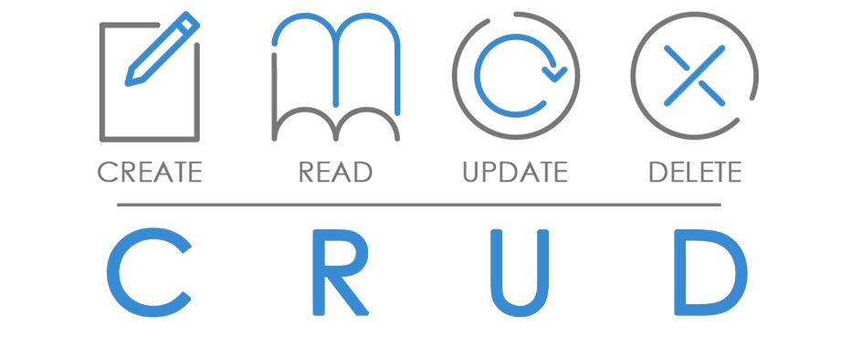

# Capítulo 8 – Transações em Bancos de Dados

Nos capítulos anteriores, focamos em como definir, manipular e consultar dados. Agora, vamos explorar o mecanismo que garante que todas essas operações ocorram de forma segura, consistente e confiável, especialmente em ambientes complexos com múltiplos usuários e a possibilidade de falhas: a **transação**. As transações são o coração pulsante de um banco de dados relacional, o processo que garante que os dados passem de um estado válido para outro sem erros, corrupção ou perda de informação.

## Conceitos Gerais

Uma **transação**, no contexto de bancos de dados, é uma sequência de uma ou mais operações que é executada como uma **única unidade lógica e indivisível de trabalho**. O princípio fundamental de uma transação é o "tudo ou nada": ou todas as operações dentro dela são concluídas com sucesso, ou nenhuma delas é efetivada, e o banco de dados retorna ao estado em que se encontrava antes de a transação começar.

O objetivo principal das transações é garantir a consistência e a integridade dos dados, mesmo em cenários de acesso concorrente (múltiplos usuários operando ao mesmo tempo) ou em caso de falhas de sistema, software ou hardware.

As operações contidas em uma transação são, tipicamente, os comandos DML que formam o acrônimo **CRUD** — Create (Criar), Read (Ler), Update (Atualizar) e Delete (Remover). Uma transação pode ser tão simples quanto um único `UPDATE` ou tão complexa quanto uma série de `INSERT`s, `UPDATE`s e `DELETE`s que representam uma completa operação de negócio.

<div align="center">

</div>

### Exemplo de uma Transação de Negócio

Vamos analisar um exemplo prático de uma transação em SQL que registra uma nova venda em um sistema de e-commerce. Esta única operação de negócio requer três passos no banco de dados:

```sql
BEGIN TRANSACTION;

-- Passo 1: Inserir o cabeçalho do pedido na tabela de Pedidos
INSERT INTO Pedidos (id_pedido, id_cliente, data_pedido, valor_total)
VALUES (1001, 200, '2025-04-07', 350.00);

-- Passo 2: Inserir os itens comprados na tabela Itens_Pedido
INSERT INTO Itens_Pedido (id_pedido, id_produto, quantidade, preco_unitario)
VALUES (1001, 501, 2, 175.00); -- O usuário comprou 2 unidades de R$175.00 e não R$100.00 como antes.

-- Passo 3: Atualizar o estoque do produto vendido na tabela Produtos
UPDATE Produtos
SET quantidade_estoque = quantidade_estoque - 2
WHERE id_produto = 501;

COMMIT;
```

Neste exemplo, as palavras-chave `BEGIN TRANSACTION` e `COMMIT` delimitam a unidade de trabalho. Se qualquer um dos três passos falhar (por exemplo, se o `UPDATE` no estoque não for possível por falta de produto), toda a transação seria desfeita, e o `INSERT` em `Pedidos` e `Itens_Pedido` seria revertido. Para entender por que e como isso funciona, precisamos primeiro explorar os princípios que governam todas as transações.

## Princípios ACID

**ACID** é um acrônimo que representa quatro propriedades fundamentais que garantem a confiabilidade das transações em um SGBD: **A**tomicidade, **C**onsistência, **I**solamento e **D**urabilidade.

<div align="center">

</div>

Esses princípios formam um "contrato" entre o SGBD e a aplicação, uma promessa de que os dados serão mantidos de forma íntegra e previsível, mesmo diante de erros ou acessos simultâneos. A aderência a estas propriedades é o que distingue um SGBD transacional robusto.

O uso dos princípios ACID é indispensável para manter a integridade dos dados em qualquer sistema onde a precisão e a confiabilidade são críticas, como em sistemas financeiros (transferências bancárias), comerciais (controle de estoque), de saúde (prontuários de pacientes) ou governamentais. A ausência dessas garantias poderia levar à corrupção de dados, inconsistências, perda de informações e falhas severas na operação das aplicações. Portanto, os princípios ACID são a base sobre a qual a confiança nos sistemas de banco de dados é construída.

Vamos agora explorar mais profundamente o significado de cada um desses quatro princípios.

### Atomicidade

A **atomicidade** refere-se ao princípio de que uma transação deve ser tratada como uma operação única e indivisível, do início ao fim. O nome deriva do conceito de "átomo" como uma unidade fundamental que não pode ser quebrada. Aplicado a bancos de dados, isso significa que ou **todas** as operações que compõem a transação são executadas com sucesso, ou **nenhuma** delas é efetivamente aplicada ao banco de dados. Não é permitido que o banco de dados termine em um estado intermediário ou parcial.

**ATOMICIDADE → TODAS AS OPERAÇÕES REALIZADAS COM SUCESSO, OU NÃO HÁ TRANSAÇÃO**

O exemplo clássico para ilustrar a atomicidade é a transferência bancária. Imagine uma transação que consiste em transferir R$ 100 da conta corrente para a conta poupança de uma mesma pessoa. Esta operação de negócio envolve dois passos no banco de dados:

1. **Débito:** Subtrair R$ 100 do saldo da conta corrente.
2. **Crédito:** Adicionar R$ 100 ao saldo da conta poupança.

A atomicidade garante que esses dois passos sejam tratados como um bloco único. Se ocorrer uma falha (uma queda de energia, um erro de sistema) após o primeiro passo, mas antes do segundo, o princípio da atomicidade entra em ação. O SGBD detecta que a transação não foi concluída com sucesso e executa um **`ROLLBACK`** (reversão) automático, desfazendo a operação de débito. Isso garante que o dinheiro não seja "perdido" no sistema.

Na prática, é o SGBD que gerencia este processo. Quando uma transação começa, todas as suas alterações são mantidas em um estado temporário. Se qualquer erro ocorrer, todas essas alterações temporárias são descartadas. Somente se todas as operações forem executadas com sucesso e um comando **`COMMIT`** for emitido, é que as alterações são permanentemente gravadas no banco de dados. O comando `COMMIT`, portanto, é a instrução que confirma a conclusão bem-sucedida da unidade atômica, garantindo que o conjunto de operações seja aplicado de forma indivisível.

### Consistência

O princípio da **consistência** garante que qualquer transação levará o banco de dados de um **estado válido para outro estado válido**. Em outras palavras, a transação deve preservar a integridade e a coerência dos dados, assegurando que todas as regras, restrições e relacionamentos definidos no _schema_ do banco de dados sejam respeitados ao final da operação.

Se a atomicidade garante que a transação aconteça por inteiro ou não aconteça, a consistência garante que o resultado final dessa transação seja "correto" de acordo com as regras de negócio e de dados predefinidas.

**CONSISTÊNCIA → MANTER AS REGRAS E A INTEGRIDADE DOS DADOS APÓS UMA TRANSAÇÃO**

No contexto de sistemas modernos, especialmente com bancos de dados distribuídos, o conceito de consistência também se estende à **consistência de leitura**. Isso significa garantir que, após uma escrita ser concluída, todos os diferentes nós ou réplicas do banco de dados eventualmente leiam a mesma informação atualizada, evitando que diferentes usuários vejam dados conflitantes.

#### As Ferramentas da Consistência: Restrições (Constraints)

A consistência não é uma propriedade mágica; ela é ativamente imposta pelo SGBD através de um conjunto de regras chamadas **restrições (_constraints_)**. As restrições são definidas durante a criação das tabelas (com o comando `CREATE TABLE`) e garantem que qualquer tentativa de inserir, atualizar ou excluir dados que viole essas regras seja rejeitada pelo banco de dados.

As principais restrições que garantem a consistência são:

- **Restrição de Integridade de Domínio:** Esta é a restrição mais básica. Ela garante que os valores inseridos em uma coluna pertençam ao seu domínio definido. Isso inclui:
    - **Tipo de Dado:** Um campo definido como `INT` não pode aceitar o texto "abc". Um campo `DATE` não pode aceitar um valor inválido como '2025-02-30'.
    - **Intervalos ou Formatos:** Podemos definir regras mais específicas, como garantir que uma coluna `Nota` só aceite valores entre 0 e 10.
- **Restrição de Integridade de Entidade:** Esta restrição assegura que cada linha (entidade) em uma tabela seja única e identificável. Ela é imposta pela **chave primária (`PRIMARY KEY`)**. Ao definir uma coluna como chave primária, o SGBD garante automaticamente que nenhum valor nela seja `NULL` ou duplicado.
- **Restrição de Integridade Referencial:** Garante que os relacionamentos entre tabelas sejam sempre válidos e consistentes. É imposta pela **chave estrangeira (`FOREIGN KEY`)**.
    - **Exemplo:** Se a tabela `Pedidos` tem uma chave estrangeira `ID_Cliente` que referencia a tabela `Clientes`, esta restrição impede a inserção de um pedido com um `ID_Cliente` que não exista na tabela `Clientes`. Da mesma forma, impede a exclusão de um cliente se ele ainda tiver pedidos associados.
- **Restrição de Integridade de Vazio (`NOT NULL`):** Uma das restrições mais simples e importantes. Ela define que uma determinada coluna é de preenchimento obrigatório, não permitindo a inserção ou atualização de um registro com um valor nulo (`NULL`) naquele campo.
- **Restrição de Integridade de Unicidade (`UNIQUE`):** Garante que todos os valores em uma coluna (ou conjunto de colunas) sejam únicos, evitando duplicatas. É similar à chave primária, mas com uma diferença crucial: uma restrição `UNIQUE` **permite** a inserção de múltiplos valores nulos (pois `NULL` não é considerado igual a `NULL`), enquanto a chave primária não permite nulos.
    - **Exemplo:** Em uma tabela de `Usuarios`, a coluna `Email` deve ser única, mas podemos não saber o email de todos os usuários no momento do cadastro.
- **Restrição de Integridade de Checagem (`CHECK`):** Esta é uma restrição flexível que permite definir uma regra de negócio (uma condição lógica) que os valores de uma coluna devem satisfazer.
    - **Exemplo:** Em uma tabela `Produtos`, podemos criar uma restrição para garantir que o `Preco` seja sempre maior que zero (`CHECK (Preco > 0)`). Em uma tabela `Funcionarios`, podemos garantir que a `Data_Contratacao` não seja uma data no futuro.

### Isolamento

O princípio do **isolamento** é a propriedade que garante que múltiplas transações, executadas de forma concorrente (ao mesmo tempo), não interfiram umas nas outras. Do ponto de vista de uma transação individual, o isolamento cria a ilusão de que ela está sendo executada sozinha no sistema, em uma "bolha" protegida das atividades das demais.

Uma transação em andamento não pode ver os estados intermediários e ainda não confirmados (não "commitados") de outra transação. O objetivo do isolamento é proteger a integridade do banco de dados contra as inconsistências temporárias que podem surgir do acesso simultâneo aos mesmos dados.

**Analogia:** Imagine duas pessoas editando o mesmo parágrafo em um documento compartilhado. Sem isolamento, uma pessoa veria as frases incompletas e os erros de digitação da outra em tempo real. Com isolamento, uma pessoa só veria as alterações da outra depois que ela terminasse o parágrafo e o salvasse (fizesse o `COMMIT`).

A violação do isolamento pode levar a uma série de problemas de concorrência, como:

- **Leituras Sujas (_Dirty Reads_):** Ler dados de uma transação que ainda não foi confirmada.
- **Leituras Não Repetíveis (_Non-Repeatable Reads_):** Reler o mesmo dado e obter um valor diferente.
- **Leituras Fantasmas (_Phantom Reads_):** Reler um conjunto de dados e encontrar novas linhas que não existiam antes.

Como já vimos, os SGBDs controlam o rigor do isolamento através dos **Níveis de Isolamento** (`READ COMMITTED`, `SERIALIZABLE`, etc.), permitindo um equilíbrio entre a consistência dos dados e a performance do sistema.

### Durabilidade

O princípio da **durabilidade** é a garantia final do SGBD. Ele assegura que, uma vez que uma transação tenha sido confirmada com sucesso (`COMMIT`), suas alterações são **permanentes e persistentes** no banco de dados. Essas alterações sobreviverão a qualquer falha subsequente do sistema, como quedas de energia, erros no sistema operacional ou problemas de hardware.

**Analogia:** Pense na durabilidade como a tinta indelével. Uma vez que a informação é escrita e o `COMMIT` é dado, a alteração não pode ser apagada por uma falha de sistema.

**Exemplo prático:** Se um cliente realiza uma compra em um site de e-commerce e recebe a tela de "Pedido Confirmado", essa confirmação implica que um `COMMIT` foi executado no banco de dados. A durabilidade garante que, mesmo que o servidor do site sofra uma queda de energia um segundo após a confirmação, o registro daquele pedido não será perdido. Ao reiniciar, o banco de dados estará em um estado consistente que reflete a conclusão daquela compra.

#### Como a Durabilidade é Alcançada?

A durabilidade é geralmente implementada pelos SGBDs através de um mecanismo chamado **log de transações** (_transaction log_ ou _write-ahead log - WAL_). O processo funciona da seguinte forma:

1. Quando uma transação realiza uma alteração, essa alteração é primeiro escrita em um arquivo de log sequencial no disco.
2. Quando o comando `COMMIT` é emitido, o SGBD garante que os registros correspondentes no log de transações sejam gravados de forma permanente em um armazenamento não volátil (como um SSD ou HD).
3. Somente **após** a gravação no log ser confirmada é que o SGBD reporta à aplicação que a transação foi bem-sucedida.
4. As alterações nos arquivos de dados principais do banco podem ser feitas posteriormente, de forma otimizada.

Em caso de uma falha, ao reiniciar, o SGBD lê o log de transações e pode "refazer" (_redo_) qualquer transação que foi confirmada mas cujas alterações ainda não haviam sido aplicadas aos arquivos de dados principais, garantindo assim a permanência de todas as operações concluídas.

## Controle de Concorrência e Isolamento

Como vimos no princípio de Isolamento do ACID, um SGBD deve garantir que transações executadas simultaneamente não interfiram umas nas outras. O **controle de concorrência** é o conjunto de mecanismos e técnicas que o SGBD utiliza para implementar este isolamento na prática.

Em qualquer sistema do mundo real, é inevitável que múltiplos usuários e aplicações tentem ler e escrever nos mesmos dados ao mesmo tempo. Sem um controle de concorrência robusto, essas operações paralelas poderiam levar ao caos, resultando em dados inconsistentes, relatórios incorretos e corrupção da integridade do banco de dados.

### Anomalias de Concorrência: Os Efeitos da Falta de Isolamento

Um isolamento inadequado entre as transações pode dar origem a uma série de problemas conhecidos como anomalias de concorrência. É crucial entender essas anomalias para apreciar a importância dos mecanismos de controle.

<div align="center">

</div>

- **Leitura Suja (Dirty Read):** Esta anomalia ocorre quando uma Transação A lê dados que foram modificados por uma Transação B que **ainda não foi confirmada (commitada)**.
    - **Exemplo:** A Transação B atualiza o preço de um produto para R$ 50,00. Antes do `COMMIT`, a Transação A lê este novo preço "sujo" de R$ 50,00 para gerar um relatório de vendas. Em seguida, a Transação B falha e executa um `ROLLBACK`, revertendo o preço para seu valor original. Agora, o relatório da Transação A está incorreto, pois foi baseado em um dado que, na prática, nunca existiu de forma permanente.
- **Leitura Não-Repetível (Non-repeatable Read):** Ocorre quando uma transação lê a **mesma linha** duas vezes, mas obtém valores diferentes porque uma outra transação alterou e confirmou essa linha no intervalo entre as duas leituras.
    - **Exemplo:** A Transação A lê o estoque de um produto e encontra 10 unidades. Enquanto a Transação A continua seu processamento, a Transação B vende 2 unidades daquele produto e confirma a alteração (`COMMIT`), atualizando o estoque para 8. Se a Transação A, dentro da mesma operação, reler o estoque daquele produto, ela agora encontrará 8 unidades. O mesmo dado lido duas vezes retornou valores diferentes, o que pode quebrar cálculos complexos.
- **Leitura Fantasma (Phantom Read):** Esta anomalia ocorre quando uma transação executa a mesma consulta com uma cláusula `WHERE` duas vezes, e o **conjunto de linhas** retornado é diferente. Isso acontece porque outra transação inseriu ou excluiu linhas que satisfazem a condição `WHERE` no intervalo entre as duas execuções.
    - **Exemplo:** A Transação A executa uma consulta para contar quantos funcionários existem no departamento de 'Vendas' e obtém o resultado `20`. Enquanto isso, a Transação B contrata um novo vendedor e confirma a inserção no banco. Se a Transação A repetir a mesma contagem, ela agora encontrará o resultado `21`. Uma nova linha "fantasma" apareceu no seu conjunto de resultados.

### Níveis de Isolamento do Padrão ANSI SQL

Para combater essas anomalias, os SGBDs implementam diferentes **níveis de isolamento**, conforme padronizado pela ANSI SQL. Cada nível oferece um grau diferente de proteção, representando um equilíbrio entre consistência e performance. Um nível mais alto de isolamento previne mais anomalias, mas pode reduzir a capacidade do sistema de lidar com muitas transações simultâneas (concorrência) e aumentar a chance de _deadlocks_.

> **Deadlock** (ou impasse) em bancos de dados é uma situação de bloqueio mútuo em que duas ou mais transações ficam permanentemente esperando por recursos que estão sendo mantidos umas pelas outras, impedindo que qualquer uma delas prossiga.

A tabela a seguir resume quais anomalias cada nível de isolamento previne. Um `X` vermelho indica que a anomalia é prevenida, enquanto um `V` verde indica que ela pode ocorrer.

<div align="center">

</div>

- **Read Uncommitted:** O nível mais baixo de isolamento. Permite a máxima concorrência, mas é vulnerável a todas as anomalias, incluindo leituras sujas. É raramente utilizado em sistemas transacionais.
- **Read Committed:** Garante que uma transação leia apenas dados que já foram confirmados por outras transações, **prevenindo as Leituras Sujas**. No entanto, as leituras não-repetíveis e fantasmas ainda podem ocorrer. É o nível de isolamento padrão na maioria dos SGBDs, como PostgreSQL, Oracle e SQL Server, por oferecer um bom equilíbrio.
- **Repeatable Read:** Um nível mais restritivo que garante que, se uma linha for lida múltiplas vezes dentro da mesma transação, ela sempre retornará os mesmos valores. **Previne Leituras Sujas e Não-Repetíveis**. As leituras fantasmas, no entanto, ainda são possíveis. É o nível padrão no MySQL (com o motor InnoDB).
- **Serializable:** O nível de isolamento mais alto e seguro. Ele garante que o resultado de transações concorrentes seja idêntico a alguma execução sequencial (em série) dessas mesmas transações. **Previne todas as anomalias**. Oferece a máxima consistência, mas ao custo de uma menor concorrência e, potencialmente, um desempenho mais lento.

## Bloqueios (Locks): Gerenciando o Acesso Concorrente

Os **bloqueios (_locks_)** são os mecanismos fundamentais que um SGBD utiliza para gerenciar o acesso concorrente aos dados e implementar os níveis de isolamento. Eles funcionam como "semáforos" que regulam o acesso a recursos compartilhados (como uma linha, uma página de dados ou uma tabela inteira), garantindo que duas ou mais transações não interfiram negativamente umas nas outras.

Quando uma transação precisa acessar um dado, ela solicita um bloqueio sobre aquele recurso ao SGBD. Se nenhuma outra transação possuir um bloqueio conflitante, o SGBD concede o bloqueio, e a transação pode prosseguir. Se houver um conflito, a transação solicitante é colocada em uma fila de espera até que o bloqueio seja liberado. O controle por bloqueios é a forma mais tradicional e amplamente adotada para garantir as propriedades ACID em ambientes multiusuário.

Existem diferentes tipos e granularidades de bloqueios, mas para nosso estudo, vamos nos concentrar nos três modos de bloqueio mais básicos e essenciais.

### Bloqueios Compartilhados (Shared Locks - S)

Um **bloqueio compartilhado**, também conhecido como **Shared Lock (S)** ou _Read Lock_, é o tipo de bloqueio mais permissivo. Como o nome sugere, ele é utilizado principalmente para operações de **leitura** (`SELECT`).

Sua característica fundamental é a **compatibilidade**: múltiplas transações podem obter e manter um bloqueio compartilhado sobre o mesmo recurso **simultaneamente**. A função primordial deste bloqueio é garantir que, enquanto uma ou mais transações estão lendo um dado, nenhuma outra transação possa modificá-lo, evitando assim as leituras sujas (_dirty reads_) e garantindo uma leitura consistente.

De forma geral, um bloqueio compartilhado (S) tem as seguintes propriedades:

- Permite que múltiplas transações leiam o mesmo dado ao mesmo tempo.
- **Impede** que qualquer outra transação adquira um bloqueio de escrita (Exclusivo) sobre o dado enquanto ele estiver ativo.
- **Não impede** que outras transações adquiram novos bloqueios compartilhados (S) sobre o mesmo dado.

**Exemplo Prático Detalhado:**

Imagine um cenário em um site de e-commerce. Temos uma tabela `PRODUTOS` com o seguinte registro:

|ID_PRODUTO|NOME|ESTOQUE|
|---|---|---|
|101|Tênis de Corrida|20|

Agora, duas transações concorrentes são iniciadas:

- **Transação T1 (Cliente A):** Inicia uma operação para visualizar a página do "Tênis de Corrida". Para ler o estoque de forma consistente, o SGBD adquire um **Bloqueio Compartilhado (S)** sobre a linha do produto 101.
- **Transação T2 (Cliente B):** Simultaneamente, o Cliente B também acessa a página do mesmo produto. Para ler o estoque, o SGBD solicita um **Bloqueio Compartilhado (S)** sobre a mesma linha.

**Resultado:** Como os bloqueios compartilhados são compatíveis entre si, o SGBD concede o bloqueio para a Transação T2 sem problemas. Ambas as transações (T1 e T2) podem ler o estoque de `20` ao mesmo tempo, pois nenhuma delas está tentando modificar o dado.

Agora, imagine uma terceira transação:

- **Transação T3 (Estoquista):** O estoquista tenta dar entrada em 5 novas unidades do mesmo tênis, executando um `UPDATE` na linha 101. Para isso, a Transação T3 solicita um **Bloqueio Exclusivo (X)**.

**Resultado:** Como o recurso já possui bloqueios compartilhados (de T1 e T2), e um bloqueio exclusivo não é compatível com eles, a Transação T3 **será colocada em espera**. Ela só poderá prosseguir e atualizar o estoque depois que tanto T1 quanto T2 terminarem suas leituras e liberarem seus respectivos bloqueios compartilhados.

### Bloqueios de Atualização (Update Locks - U)

O **bloqueio de atualização**, ou **Update Lock (U)**, é um tipo de bloqueio mais sofisticado, utilizado por alguns SGBDs (notavelmente o Microsoft SQL Server) como uma medida preventiva contra um problema de concorrência comum e perigoso conhecido como **deadlock de conversão**.

Ele atua como um "marcador de intenção". Uma transação adquire um bloqueio de atualização quando pretende **ler** um recurso com a **possível intenção de modificá-lo futuramente**.

#### Deadlock de Conversão

Para entender a necessidade do Update Lock, precisamos primeiro entender o problema que ele resolve. Um _deadlock_ de conversão pode ocorrer no seguinte cenário:

1. A **Transação T1** precisa ler a Linha A. Ela adquire um **Bloqueio Compartilhado (S)** sobre a Linha A.
2. Simultaneamente, a **Transação T2** também precisa ler a mesma Linha A. Como bloqueios compartilhados são compatíveis, T2 também adquire um **Bloqueio Compartilhado (S)** sobre a Linha A.
3. Agora, a **Transação T1** decide que precisa **atualizar** a Linha A. Para fazer isso, ela precisa "promover" seu bloqueio de Compartilhado (S) para **Exclusivo (X)**. No entanto, ela não pode, pois a Transação T2 ainda mantém um bloqueio Compartilhado (S) no recurso, e bloqueios S e X são incompatíveis. A Transação T1 entra em estado de espera.
4. Em seguida, a **Transação T2** também decide que precisa **atualizar** a Linha A. Ela também tenta promover seu bloqueio S para um bloqueio X. No entanto, ela também não pode, pois a Transação T1 já tem um bloqueio S. A Transação T2 também entra em estado de espera.

Neste ponto, temos um impasse clássico (_deadlock_): T1 está esperando T2 liberar seu bloqueio para poder prosseguir, e T2 está esperando T1 liberar o seu. Nenhuma das duas pode avançar, e elas ficariam presas para sempre se o SGBD não interviesse para abortar uma delas.

#### A Solução: com Update Lock (U)

O bloqueio de atualização (U) foi criado para prevenir exatamente este cenário. Ele introduz uma nova regra de compatibilidade:

- Apenas **uma** transação pode manter um bloqueio de atualização (U) sobre um recurso em um determinado momento.
- Um bloqueio de atualização (U) **é compatível** com bloqueios compartilhados (S). Isso significa que, enquanto uma transação tem um bloqueio U (indicando sua intenção de atualizar), outras transações ainda podem ler o dado (adquirindo bloqueios S).
- Quando a transação com o bloqueio U decide efetivamente escrever no dado, seu bloqueio é promovido para Exclusivo (X). Como ela era a única com a "intenção" de atualizar, não haverá conflito de conversão.

**Exemplo Prático Detalhado:**

Vamos revisitar o cenário anterior, agora com o Update Lock.

1. A **Transação T1** precisa ler a Linha A com a intenção de, talvez, atualizá-la. Em vez de um bloqueio S, ela solicita e obtém um **Bloqueio de Atualização (U)**.
2. A **Transação T2** também precisa ler a Linha A com a intenção de atualizá-la. Ela tenta obter um **Bloqueio de Atualização (U)**.
3. **Conflito!** Como apenas uma transação pode ter um bloqueio U por vez, a solicitação da Transação T2 é **negada**, e ela é colocada em espera.
4. A **Transação T1** decide agora atualizar a Linha A. O SGBD promove seu bloqueio U para um **Bloqueio Exclusivo (X)**. Como não há outros bloqueios conflitantes (outras transações podem estar lendo com S, mas não tentando atualizar), a promoção é instantânea.
5. A Transação T1 realiza a escrita e, ao terminar, libera seu bloqueio X.
6. Agora, a Transação T2, que estava esperando, pode finalmente adquirir seu bloqueio U e prosseguir.

Ao serializar a "intenção de atualizar", o Update Lock impede que o impasse de conversão ocorra, garantindo um fluxo de transações mais ordenado e previsível em cenários de leitura-seguida-de-escrita.

