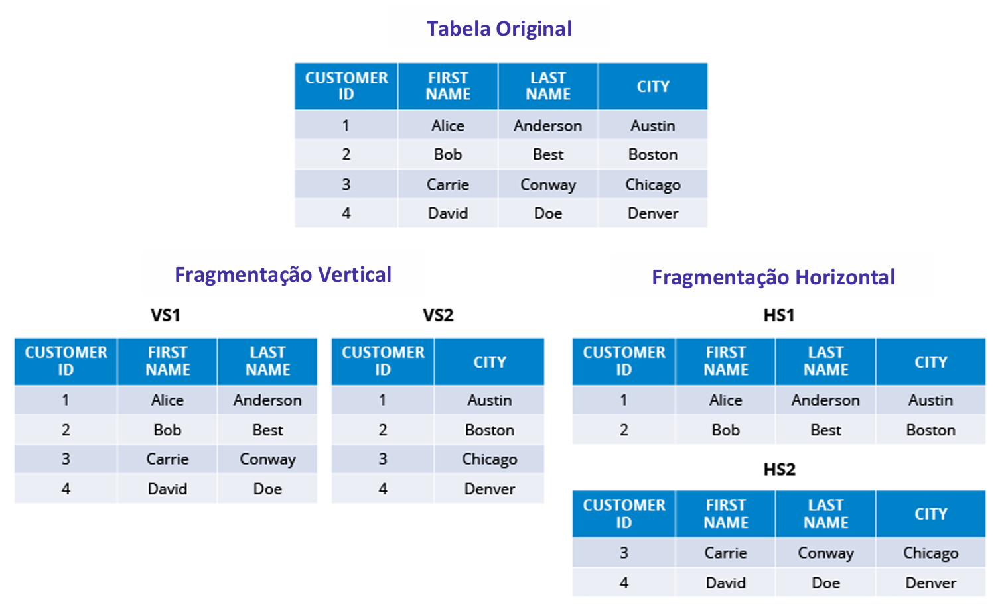
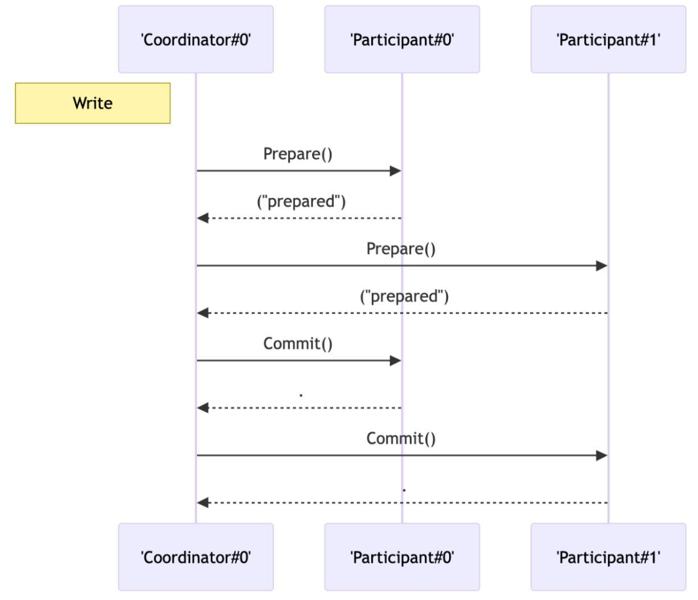
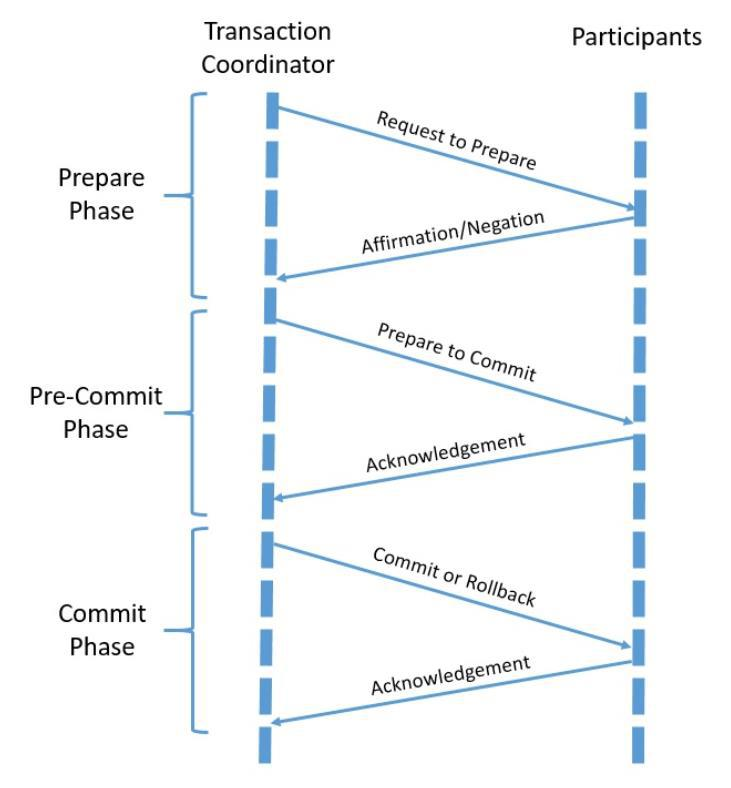

# Capítulo 9 – Bancos de Dados Distribuídos

Até agora, nossa jornada se concentrou em sistemas de banco de dados centralizados, onde os dados residem em um único local. No entanto, as demandas da era digital — com volumes massivos de dados, usuários espalhados pelo globo e uma exigência de disponibilidade 24/7 — tornaram a arquitetura centralizada insuficiente para muitas aplicações. Em resposta a esses desafios, surgiu o paradigma dos **Bancos de Dados Distribuídos (BDDs)**.

## Conceitos Gerais

Um **Banco de Dados Distribuído (BDD)** é uma coleção de múltiplos bancos de dados que são logicamente relacionados, mas que estão fisicamente espalhados por diferentes computadores (chamados de **nós**), em locais distintos, conectados por uma rede de comunicação.

A característica mais importante e definidora de um BDD é a **transparência**. Para o usuário ou para a aplicação, o sistema deve se comportar como um único banco de dados centralizado. Toda a complexidade da distribuição física dos dados é abstraída e gerenciada pelo Sistema de Gerenciamento de Banco de Dados Distribuído (SGBDD). O usuário não precisa saber em qual nó um dado específico está armazenado para poder acessá-lo.

Como o diagrama ilustra, os usuários interagem com o sistema de forma unificada, enquanto internamente o SGBDD roteia as requisições para as diferentes partições físicas onde os dados de fato residem.

## Teorema de Brewer (Teorema CAP)

Projetar um sistema distribuído introduz desafios que não existem em um sistema centralizado, especialmente no que diz respeito a como lidar com falhas de rede. O **Teorema de Brewer**, mais conhecido como **Teorema CAP**, formaliza o dilema fundamental enfrentado por esses sistemas.

O teorema afirma que, de três garantias desejáveis, um sistema de armazenamento de dados distribuído só pode fornecer, no máximo, **duas** ao mesmo tempo. As três garantias são:

- **Consistência (C - _Consistency_):** Garante que toda operação de leitura receba a versão mais recente e confirmada do dado. Todos os nós no sistema retornam o mesmo dado, no mesmo momento.
- **Disponibilidade (A - _Availability_):** Garante que toda requisição receba uma resposta (que não seja um erro), sem garantia de que a resposta contenha a versão mais recente da informação. O sistema está sempre operacional.
- **Tolerância a Partições (P - _Partition Tolerance_):** Garante que o sistema continue a operar mesmo que ocorra uma "partição" na rede (uma quebra de comunicação entre os nós).

Em um sistema distribuído, a ocorrência de partições de rede é uma realidade inevitável. Portanto, a **Tolerância a Partições (P)** não é uma opção, mas uma necessidade. Isso força os arquitetos de sistemas a fazerem uma escolha difícil entre as outras duas garantias: consistência ou disponibilidade.

- **Sistemas CP (Consistência e Tolerância a Partições):** Quando ocorre uma partição de rede, o sistema escolhe preservar a consistência. Para isso, ele pode se tornar **indisponível** para algumas requisições, recusando-se a responder para evitar o risco de retornar um dado desatualizado. Sistemas de bancos de dados relacionais distribuídos, como o Google Spanner, geralmente se enquadram nesta categoria.
- **Sistemas AP (Disponibilidade e Tolerância a Partições):** Quando ocorre uma partição de rede, o sistema escolhe permanecer **disponível**. Ele continuará a responder a requisições, mesmo que isso signifique retornar uma versão do dado que pode estar desatualizada. A consistência é sacrificada em prol da disponibilidade, adotando um modelo de **consistência eventual**. A maioria dos bancos de dados NoSQL, como o Apache Cassandra e o MongoDB, se enquadra nesta categoria.

## ACID vs. BASE: Duas Filosofias de Consistência

O Teorema CAP evidencia que garantir as propriedades ACID, especialmente a consistência estrita, em um sistema distribuído de larga escala é uma tarefa custosa, que pode impactar a latência e a disponibilidade (exigindo protocolos como 2PC e 3PC).

Em resposta a essa dificuldade, surgiu uma filosofia de design alternativa, mais flexível e escalável, especialmente popular em sistemas NoSQL: o modelo **BASE**.

O acrônimo BASE significa:

- **Basically Available (Disponibilidade Básica):** O sistema garante a disponibilidade, conforme o Teorema CAP. Ele prioriza manter o sistema em funcionamento, mesmo que isso signifique que algumas respostas possam estar baseadas em dados não totalmente atualizados.
- **Soft State (Estado Flexível):** O estado do sistema pode mudar ao longo do tempo, mesmo sem uma nova entrada, à medida que os dados se propagam entre os nós e a consistência é alcançada.
- **Eventual Consistency (Consistência Eventual):** Esta é a propriedade central. O sistema garante que, se nenhuma nova atualização for feita a um determinado dado, **eventualmente** todas as réplicas desse dado irão convergir para o mesmo valor. É uma promessa de consistência futura, não imediata.

Enquanto o ACID é pessimista e foca em garantir a consistência a todo custo, o BASE é otimista, priorizando a disponibilidade e a escalabilidade e aceitando que a consistência será alcançada em um momento posterior.

## Transparência em Bancos de Dados Distribuídos

Como ressaltado, o objetivo mais importante ao projetar um BDD é proporcionar uma experiência **transparente** para os usuários e aplicações. Em um contexto técnico, transparência significa que a complexidade inerente à distribuição dos dados (sua localização física, sua fragmentação ou replicação) permanece completamente oculta.

A aplicação interage com o banco de dados como se ele fosse uma entidade única e centralizada. A "mágica" de encontrar os dados, otimizar a consulta através da rede, lidar com falhas e combinar os resultados é de responsabilidade do Sistema de Gerenciamento de Banco de Dados Distribuído (SGBDD). Pense na transparência como uma tomada elétrica: você simplesmente conecta seu aparelho e recebe energia, sem precisar conhecer a usina, os transformadores ou a fiação que tornam isso possível.

Existem diferentes tipos de transparência que um SGBDD idealmente deve fornecer.

|Tipo de Transparência|Definição|
|---|---|
|**Transparência de Localização**|Refere-se ao fato de os usuários poderem acessar dados sem precisar conhecer sua localização física real na rede. O sistema localiza e recupera os dados automaticamente, independentemente do nó onde estejam armazenados.|
|**Transparência de Fragmentação**|A fragmentação é a divisão de uma tabela em pedaços menores. A transparência garante que os usuários possam realizar consultas como se a tabela estivesse inteira, sem precisar saber como ela foi dividida ou onde cada fragmento está.|
|**Transparência de Replicação**|Os dados podem ser replicados (copiados) em múltiplos nós para melhorar a disponibilidade e o desempenho. A transparência de replicação oculta a existência dessas cópias. O usuário realiza uma operação, e o sistema gerencia a atualização de todas as réplicas.|
|**Transparência de Falhas**|Garante que o sistema continue a operar ou se recupere rapidamente de falhas de rede ou de nós, idealmente sem que o usuário perceba a interrupção. O sistema deve ser capaz de redirecionar as operações para nós saudáveis.|
|**Transparência de Concorrência**|Garante que múltiplos usuários possam realizar transações simultaneamente sem interferir uns nos outros, mesmo que suas operações afetem nós diferentes. O SGBDD gerencia os bloqueios e a sincronização de forma transparente.|
|**Transparência de Desempenho**|Significa que o desempenho da consulta deve ser mantido em um nível aceitável, independentemente de onde os dados estão fisicamente localizados. O otimizador de consultas distribuído deve ser inteligente o suficiente para minimizar a transferência de dados pela rede.|

## Bancos Homogêneos vs. Heterogêneos

Os Bancos de Dados Distribuídos podem ser classificados em duas categorias principais, com base na uniformidade dos softwares e estruturas utilizados em seus nós.

- **Sistemas Distribuídos Homogêneos:** Nesta arquitetura, todos os nós do sistema utilizam o mesmo SGBD (ex: todos os nós rodam a mesma versão do Oracle ou do PostgreSQL) e operam com esquemas de dados idênticos ou compatíveis. Essa uniformidade simplifica enormemente a administração, o gerenciamento de consultas e a implementação das transparências, pois todos os nós "falam a mesma língua". Esta é a abordagem mais comum quando um sistema é projetado do zero para ser distribuído.
- **Sistemas Distribuídos Heterogêneos (Bancos de Dados Federados):** Esta arquitetura surge da necessidade de integrar sistemas de banco de dados diferentes. Em um ambiente heterogêneo, os nós podem utilizar SGBDs de fornecedores distintos (ex: um nó Oracle, outro SQL Server, outro MongoDB), com modelos de dados e esquemas diferentes. Um sistema que integra esses ambientes distintos é chamado de Sistema de Banco de Dados Federado ou Multibanco. A integração é realizada por uma camada de software intermediária, um _middleware_, conhecido como **Sistema de Gerenciamento de Banco de Dados Federado (SGBDF)**. Este sistema funciona como um "tradutor universal": ele recebe uma consulta global da aplicação, a decompõe em subconsultas apropriadas para cada SGBD subjacente, envia essas subconsultas, coleta os resultados individuais e os integra em uma única resposta coesa para o usuário.

Como o diagrama ilustra, a arquitetura federada é uma solução poderosa para integrar sistemas legados ou para unir informações de diferentes departamentos ou empresas (após uma fusão, por exemplo) que utilizam tecnologias de banco de dados distintas, proporcionando uma visão unificada sobre um ambiente tecnologicamente diverso.

## Arquitetura de Bancos de Dados Distribuídos (BDDs)

A arquitetura de um banco de dados distribuído define como seus componentes físicos e lógicos são organizados para armazenar, gerenciar e recuperar dados que estão espalhados por diferentes locais. Uma arquitetura eficiente é a espinha dorsal de um BDD, garantindo não apenas a integridade e a consistência dos dados, mas também o desempenho, a disponibilidade e a escalabilidade horizontal que são a razão de ser deste paradigma.

### Os Elementos da Arquitetura Distribuída

Para que a "mágica" da transparência funcione, um SGBD Distribuído (SGBDD) é composto por vários elementos especializados que trabalham em conjunto.

|Elemento|Definição e Detalhes|
|---|---|
|**Nó (_Node_)**|Cada nó é um servidor individual, fisicamente separado, que atua como um participante no sistema distribuído. Um nó é responsável por armazenar uma parte dos dados (um fragmento ou uma réplica) e por processar as consultas que lhe são direcionadas. A coleção de todos os nós forma o banco de dados distribuído.|
|**Rede de Comunicação**|É a infraestrutura que interliga todos os nós, permitindo que eles troquem dados e mensagens de coordenação. A qualidade, a latência e a confiabilidade da rede são fatores críticos que impactam diretamente o desempenho e a resiliência de todo o sistema.|
|**Middleware Distribuído**|Esta é a camada de software que funciona como o "cérebro" do sistema. Sua função é ocultar a complexidade da distribuição, fornecendo uma interface única para as aplicações. O middleware é responsável pelo roteamento de consultas, pela tradução de comandos (em sistemas heterogêneos) e pela integração dos resultados parciais.|
|**Gerenciador de Transações (DTM)**|O _Distributed Transaction Manager_ é o componente responsável por coordenar a execução de transações que afetam múltiplos nós. Ele garante as propriedades ACID em nível global, orquestrando protocolos como o Two-Phase Commit (2PC) para assegurar que a transação seja confirmada ou abortada em todos os nós de forma atômica.|
|**Gerenciador de Consultas (DQM)**|O _Distributed Query Manager_ é o otimizador de consultas do sistema. Ele recebe uma consulta global da aplicação, a decompõe em subconsultas otimizadas para cada nó, coordena a execução distribuída, recupera os resultados parciais e os consolida em uma única resposta para o usuário, buscando sempre minimizar o tráfego de dados na rede.|
|**Catálogo Distribuído**|Assim como o dicionário de dados em um sistema centralizado, o catálogo distribuído armazena os metadados do sistema. Ele contém informações cruciais sobre a localização de cada fragmento de dado, os detalhes da replicação, os esquemas locais e globais e as permissões de acesso, permitindo que o sistema saiba como localizar e recuperar qualquer dado solicitado.|

### Modelos de Arquitetura

A forma como esses elementos interagem pode seguir diferentes modelos arquiteturais, sendo os mais comuns o cliente-servidor e o peer-to-peer.

#### Arquitetura Cliente-Servidor

Esta arquitetura é uma extensão do modelo tradicional para um ambiente distribuído. A lógica de interação permanece a mesma, mas o lado do "servidor" agora é composto por múltiplos nós distribuídos.

- **Clientes:** São as aplicações ou os usuários que iniciam as requisições, enviando consultas e transações para o sistema.
- **Servidores:** São os nós responsáveis pelo armazenamento e processamento dos dados.

Existem variações importantes nesta arquitetura, principalmente na forma como o catálogo é gerenciado:

- **Cliente-servidor com catálogo centralizado:** Um único nó especializado atua como o servidor de catálogo, centralizando todos os metadados. Esta abordagem simplifica o gerenciamento, mas pode se tornar um gargalo de desempenho e um ponto único de falha.
- **Cliente-servidor com catálogo distribuído:** Cada nó mantém uma cópia do catálogo ou uma parte dele. Esta abordagem é mais resiliente e escalável, mas aumenta significativamente a complexidade da sincronização para garantir que todos os nós tenham uma visão consistente dos metadados.

#### Arquitetura Peer-to-Peer (P2P)

Na arquitetura peer-to-peer, a distinção entre cliente e servidor é eliminada. **Todos os nós são iguais** (são "pares") e podem atuar simultaneamente como clientes (solicitando dados de outros nós) e como servidores (fornecendo dados a outros nós).

O controle neste modelo é altamente descentralizado, sem um nó central de coordenação. Os catálogos são, por natureza, distribuídos, e os nós colaboram para rotear consultas e manter a consistência dos dados. Arquiteturas P2P são conhecidas por sua alta resiliência e escalabilidade, sendo a base para muitos sistemas NoSQL modernos, como o Apache Cassandra.

## Estratégias de Distribuição de Dados

Para que um Banco de Dados Distribuído (BDD) seja eficiente, não basta apenas espalhar os servidores pela rede. É preciso ter estratégias claras sobre **como** os dados serão divididos e distribuídos entre esses nós. Os dois mecanismos fundamentais para alcançar a otimização de desempenho, aumentar a disponibilidade e diminuir o impacto de falhas são a **fragmentação** e a **replicação**.

### Fragmentação: Dividindo os Dados

A **fragmentação** é o processo de dividir logicamente as tabelas de um banco de dados em partes menores, chamadas de **fragmentos**, e distribuir esses fragmentos entre os diferentes nós da rede. O SGBD Distribuído mantém o controle de onde cada fragmento está localizado, garantindo a transparência para o usuário, que continua a ver a tabela como uma unidade coesa.

A principal vantagem da fragmentação é o aumento de desempenho e a **localidade dos dados**. Ao dividir os dados, as consultas podem ser executadas em paralelo nos diferentes nós, e os dados podem ser armazenados mais perto dos usuários que mais os acessam, reduzindo a latência da rede.

Existem dois tipos principais de fragmentação:

#### Fragmentação Horizontal (Sharding)

A fragmentação horizontal divide uma tabela "fatiando-a" em conjuntos de **linhas**. Cada fragmento contém um subconjunto das tuplas da tabela original, mas mantém exatamente o mesmo esquema de colunas. Esta abordagem é também amplamente conhecida como _sharding_.

- **Analogia:** Pense em um catálogo telefônico nacional. A fragmentação horizontal seria como dividi-lo em catálogos menores, um para cada estado. A estrutura de informações (nome, telefone, endereço) é a mesma em todos, mas cada um contém um conjunto diferente de pessoas.

A divisão das linhas é feita com base em um critério aplicado aos valores de um atributo. Existem dois tipos:

- **Horizontal Primária:** A fragmentação é baseada em um atributo da própria tabela. Por exemplo, uma tabela global de `CLIENTES` pode ser fragmentada pela coluna `PAIS`, com os dados dos clientes brasileiros em um nó em São Paulo e os dados dos clientes alemães em um nó em Frankfurt.
- **Horizontal Derivada:** A fragmentação de uma tabela é baseada na fragmentação de outra tabela com a qual ela se relaciona. Por exemplo, uma tabela `PEDIDOS` pode ser fragmentada de forma derivada da tabela `CLIENTES`. Todos os pedidos feitos por clientes brasileiros ficariam no mesmo nó de São Paulo, mantendo os dados relacionados fisicamente próximos.

#### Fragmentação Vertical

A fragmentação vertical divide uma tabela "fatiando-a" em conjuntos de **colunas**. Cada fragmento contém todas as linhas da tabela original, mas apenas um subconjunto de seus atributos. A **chave primária deve ser incluída em todos os fragmentos** para permitir a reconstrução da tupla original quando necessário.

- **Analogia:** Seria como dividir o catálogo telefônico em dois volumes. O primeiro volume contém o nome e o telefone de todos, e o segundo volume contém o nome e o endereço de todos. Para obter a informação completa de uma pessoa, seria preciso consultar os dois volumes.

A fragmentação vertical é útil por razões de desempenho e segurança.

- **Desempenho:** Separam-se as colunas mais frequentemente acessadas das menos acessadas, para que as consultas mais comuns leiam menos dados do disco.
- **Segurança:** Dados sensíveis (como `Salario`, `CPF`) podem ser armazenados em um fragmento em um nó mais seguro, enquanto dados públicos (como `Nome`, `Cargo`) podem ficar em um nó de acesso mais geral.

A imagem a seguir ilustra a diferença entre as duas abordagens.

É possível, ainda, aplicar uma **fragmentação mista (ou híbrida)**, onde uma tabela é primeiro fragmentada verticalmente e, em seguida, um ou mais de seus fragmentos verticais são fragmentados horizontalmente.

A escolha da estratégia de fragmentação correta é uma decisão de design crucial, que depende diretamente dos **padrões de consulta** da aplicação. Analisar quais dados são acessados com mais frequência e por quais usuários é fundamental para definir um esquema de fragmentação que otimize o desempenho e atenda às políticas de segurança da organização.

### Replicação: Garantindo a Disponibilidade e a Resiliência

Enquanto a fragmentação é uma estratégia para **dividir** os dados e melhorar o desempenho através do paralelismo, a **replicação** é uma estratégia para **duplicar** os dados, com o objetivo principal de garantir a **alta disponibilidade** e a **tolerância a falhas**.

A replicação consiste em manter múltiplas cópias (ou **réplicas**) dos mesmos dados em nós fisicamente diferentes. Essas duas estratégias, fragmentação e replicação, não são mutuamente exclusivas e, em sistemas complexos, são frequentemente utilizadas em conjunto: um banco de dados pode ser primeiro fragmentado em partes menores, e então cada um desses fragmentos é replicado em múltiplos servidores.

#### As Vantagens da Replicação

Manter cópias dos dados em diferentes locais oferece benefícios cruciais para um sistema distribuído:

- **Aumento da Disponibilidade e Tolerância a Falhas:** Esta é a principal vantagem. Se um nó que contém uma cópia dos dados falhar (por problemas de hardware, rede, etc.), o sistema pode redirecionar as requisições para outra réplica que esteja operacional. Isso evita que uma falha em um único servidor torne os dados indisponíveis, eliminando os pontos únicos de falha. Um sistema como o Apache Cassandra, por exemplo, replica os dados em múltiplos nós para garantir que não haja um ponto único de falha, tornando o sistema altamente resiliente.
- **Melhora no Desempenho de Leitura (Escalabilidade de Leitura):** A replicação permite que as consultas de leitura sejam distribuídas entre múltiplas réplicas. Um balanceador de carga pode direcionar os usuários para diferentes nós, evitando que um único servidor seja sobrecarregado com requisições de leitura. Além disso, em sistemas geograficamente distribuídos, os dados podem ser replicados para nós mais próximos dos usuários, reduzindo a latência da rede e proporcionando um acesso mais rápido à informação.

#### Arquiteturas e Modos de Replicação

A forma como os dados são copiados e sincronizados pode seguir diferentes arquiteturas e modos.

- **Arquitetura Mestre-Escravo (_Master-Slave_ ou _Primary-Replica_):** A arquitetura de replicação mais comum. Nela, um nó é designado como o **mestre** (primário), e é o único que pode aceitar operações de escrita (`INSERT`, `UPDATE`, `DELETE`). Todas as alterações feitas no mestre são então propagadas para um ou mais nós **escravos** (réplicas). Esta topologia é a base para a estratégia de balanceamento de carga _Read/Write Split_, onde as leituras são direcionadas para as réplicas, e as escritas para o mestre.
- **Arquitetura Multi-Mestre (_Multi-Master_):** Em uma arquitetura mais complexa, múltiplos nós podem atuar como mestres, aceitando operações de escrita. As alterações feitas em qualquer mestre são replicadas para todos os outros nós do _cluster_. Esta abordagem oferece altíssima disponibilidade para operações de escrita, mas introduz o desafio da **resolução de conflitos** (o que fazer se o mesmo dado for alterado de formas diferentes em dois mestres ao mesmo tempo).

A replicação também pode ser total, onde todos os dados do banco são copiados para outros nós, ou parcial, onde apenas os dados mais críticos ou frequentemente acessados são replicados. A escolha depende dos requisitos de disponibilidade e dos custos de armazenamento e sincronização.

## Execução de Consultas Distribuídas

Em um sistema centralizado, a otimização de consultas foca em encontrar o plano de execução que minimize os acessos a disco (I/O) e o uso de CPU. Em um sistema distribuído, esses fatores continuam importantes, mas são ofuscados por um desafio muito maior: **minimizar a transferência de dados pela rede**. A comunicação entre nós é, de longe, a operação mais lenta e custosa em um BDD.

Portanto, a execução e a otimização de consultas distribuídas requerem estratégias específicas para garantir um desempenho aceitável, mesmo com a dispersão física e lógica dos dados.

### Otimização e Execução de Consultas

O componente responsável por essa tarefa é o **Otimizador de Consultas Distribuído**. Quando ele recebe uma consulta global de um usuário, ele executa um processo sofisticado para encontrar o plano de execução mais eficiente. Esse processo geralmente envolve os seguintes passos:

1. **Transformação da Consulta:** O otimizador pode reescrever a consulta SQL original em uma forma algebricamente equivalente, mas que seja mais adequada para a execução distribuída.
2. **Localização dos Dados:** O otimizador consulta o **Catálogo Distribuído** para identificar em quais nós os fragmentos e réplicas dos dados necessários estão localizados.
3. **Geração de Planos de Execução:** O otimizador gera múltiplas estratégias possíveis para executar a consulta. Para uma junção entre uma tabela de `CLIENTES` no Brasil e uma de `PEDIDOS` na Europa, ele pode considerar:
    - Mover todos os clientes para a Europa e realizar a junção lá.
    - Mover todos os pedidos para o Brasil e realizar a junção aqui.
    - Mover ambos para um terceiro nó e processar a junção.
4. **Estimativa de Custo:** Para cada plano possível, o otimizador estima um custo total, que leva em conta não apenas o processamento local (CPU e I/O), mas, principalmente, o **custo de comunicação** (volume de dados a ser transferido versus a latência da rede).
5. **Seleção do Plano Final:** O otimizador escolhe o plano de execução com o menor custo estimado, que define explicitamente quais operações devem ser executadas em quais nós e como os dados devem ser movidos entre eles.

### Estratégias de Transferência de Dados: Push vs. Pull

A movimentação de dados entre os nós, um passo crucial em qualquer consulta distribuída, geralmente segue duas estratégias principais:

- **Estratégia Push (Envio de Dados):** Nesta abordagem, o nó que contém os dados toma a iniciativa de **enviá-los** para o nó que irá realizar a operação (como uma junção). A estratégia _push_ é mais eficiente quando o volume de dados a ser enviado é relativamente pequeno em comparação com a tabela de destino.
    - **Exemplo:** Para juntar uma tabela pequena de `CATEGORIAS` (50 linhas, no Nó A) com uma tabela massiva de `PRODUTOS` (100 milhões de linhas, no Nó B), a estratégia mais eficiente é "empurrar" as 50 linhas de `CATEGORIAS` pela rede até o Nó B e realizar a junção lá.
- **Estratégia Pull (Requisição de Dados):** Nesta abordagem, o nó que está coordenando a operação **solicita** ou "puxa" os dados de que precisa dos nós remotos, geralmente sob demanda. A estratégia _pull_ é mais eficiente quando a consulta é altamente seletiva e apenas um pequeno subconjunto dos dados remotos é necessário.
    - **Exemplo:** Uma consulta busca os pedidos de um cliente específico: `SELECT * FROM PEDIDOS WHERE ID_CLIENTE = 123`. Se os pedidos estão em um nó remoto, o nó local não precisa de toda a tabela `PEDIDOS`. Ele pode "puxar" apenas as linhas específicas que correspondem àquele `ID_CLIENTE`.

Uma técnica de otimização avançada chamada **semi-junção (_semi-join_)** combina essas ideias de forma inteligente para minimizar o tráfego de rede, trocando apenas as chaves necessárias entre os nós antes de transferir os dados completos.

### Algoritmos de Junção Distribuída

Quando os dados são fragmentados, especialmente de forma vertical, a necessidade de juntar os fragmentos para reconstruir a informação original é constante. Realizar uma operação de `JOIN` em um ambiente distribuído, no entanto, é uma tarefa desafiadora. O objetivo principal dos algoritmos de junção distribuída é executar essa combinação de forma eficiente, minimizando o principal gargalo de desempenho: a quantidade de dados transferidos pela rede.

É justamente a complexidade e o custo computacional das junções em ambientes distribuídos que levam muitos sistemas NoSQL a favorecerem o _sharding_ (fragmentação horizontal) e a desnormalização, arquiteturas que evitam a necessidade de junções complexas. Contudo, para os sistemas que as suportam, são empregadas técnicas inteligentes para otimizar o processo.

A seguir, vamos explorar algumas das principais técnicas de junção distribuída.

#### Semi-Junção (Semi-Join)

A **semi-junção** é uma das técnicas mais eficazes para reduzir o tráfego de rede. Em vez de mover uma tabela inteira para outro nó, a operação é realizada em fases, transferindo apenas a informação estritamente necessária para a filtragem.

O processo de semi-junção para juntar uma Tabela A (no Nó 1) com uma Tabela B (no Nó 2) ocorre da seguinte forma:

1. **Fase 1 (Projeção e Envio):** O Nó 1 primeiro projeta **apenas** a coluna de junção da Tabela A e envia essa lista de valores, que é relativamente pequena, para o Nó 2.
2. **Fase 2 (Filtragem Remota):** O Nó 2 recebe a lista de valores da Tabela A e a utiliza para filtrar a sua própria Tabela B, selecionando apenas as linhas que possuem uma correspondência na lista recebida.
3. **Fase 3 (Envio do Resultado Reduzido):** O Nó 2 envia de volta para o Nó 1 apenas o subconjunto de linhas da Tabela B que passaram no filtro. Este volume de dados é muito menor do que a tabela B inteira.
4. **Fase 4 (Junção Final Local):** O Nó 1 realiza a junção final entre a sua Tabela A completa e o conjunto reduzido de linhas que recebeu da Tabela B.

**Exemplo:** Para juntar `CLIENTES` (1 milhão de linhas, no Brasil) com `PEDIDOS` (50 milhões de linhas, nos EUA) para encontrar os pedidos dos clientes do estado de 'SP' (100 mil clientes). Em vez de enviar 50 milhões de registros de pedidos para o Brasil, o nó do Brasil envia os 100 mil IDs de clientes de SP para os EUA. O nó dos EUA filtra os pedidos correspondentes e envia de volta apenas os registros relevantes, reduzindo drasticamente o tráfego de rede.

#### Bloom Join

O **Bloom Join** é uma variação otimizada da semi-junção que utiliza uma estrutura de dados probabilística e extremamente compacta chamada **Filtro de Bloom (_Bloom Filter_)**. Um Filtro de Bloom pode testar rapidamente se um elemento _pode pertencer_ a um conjunto ou se ele _definitivamente não pertence_, usando muito pouco espaço.

O processo é semelhante ao da semi-junção, mas ainda mais eficiente em termos de transferência de dados:

1. O Nó 1 cria um Filtro de Bloom a partir dos valores de sua coluna de junção. Este filtro é muito menor do que a lista de valores em si.
2. O Nó 1 envia este pequeno Filtro de Bloom para o Nó 2.
3. O Nó 2 utiliza o filtro para pré-selecionar as linhas da Tabela B. Se o filtro indicar que um valor "definitivamente não pertence" ao conjunto do Nó 1, a linha é descartada. Se indicar que "pode pertencer", a linha é mantida.
4. O Nó 2 envia este conjunto pré-filtrado (que pode conter alguns falsos positivos, mas nunca perderá uma correspondência verdadeira) de volta ao Nó 1 para a junção final.

O Bloom Join é especialmente eficaz quando a taxa de correspondência entre as tabelas é baixa, pois o volume de dados transferido na fase inicial (o filtro) é mínimo.

#### Busca Sob Demanda (Fetch-as-Needed)

Nesta estratégia, mais simples, o nó que está coordenando a junção percorre sua tabela local linha por linha. Para cada linha, ele envia uma requisição individual ao nó remoto para "buscar" a linha correspondente necessária para completar a junção.

Embora seja conceitualmente simples, esta abordagem é geralmente **ineficiente**, pois gera um grande número de pequenas requisições de rede. Em redes com alta latência, onde o custo de iniciar cada comunicação é alto, o desempenho pode ser severamente degradado.

#### Fatores de Escolha

A decisão sobre qual algoritmo de junção utilizar é feita pelo otimizador de consultas distribuído, que considera diversos fatores para escolher a estratégia mais eficiente:

- **Volume de dados:** Para grandes volumes, Semi-Join e Bloom Join são preferíveis ao envio de tabelas completas.
- **Taxa de correspondência:** Se poucas linhas de uma tabela correspondem à outra, o Bloom Join pode ser particularmente eficaz.
- **Latência e largura de banda da rede:** Em redes lentas ou com alta latência, estratégias que minimizam o número de "idas e vindas", como o Semi-Join, são superiores ao Fetch-as-Needed.
- **Recursos computacionais:** Algoritmos mais complexos, como a criação de Filtros de Bloom, exigem mais poder de processamento nos nós locais.

## Transações Distribuídas

Uma **transação distribuída** é uma transação que envolve operações em dois ou mais nós distintos de um banco de dados distribuído. Embora suas operações estejam fisicamente separadas, ela deve ser tratada como uma única unidade de execução lógica e atômica, obedecendo às propriedades ACID de forma global.

O desafio fundamental de uma transação distribuída é garantir a **atomicidade**. Como podemos assegurar que a operação seja "tudo ou nada" quando o "tudo" está espalhado por múltiplos servidores que podem falhar de forma independente? Para resolver este problema, foram criados protocolos de confirmação atômica, que coordenam todos os nós para que cheguem a uma decisão unânime: confirmar (`COMMIT`) ou abortar (`ROLLBACK`).

### Protocolo de Confirmação em Duas Fases (2PC)

O **2PC (_Two-Phase Commit_)** é o protocolo clássico para garantir a atomicidade em transações distribuídas. Ele envolve um nó **Coordenador**, que gerencia a transação, e múltiplos nós **Participantes**, que executam partes dela. O processo é dividido em duas fases.

**Fase 1 – Preparação (Fase de Votação)**

Nesta fase, o Coordenador verifica se todos os participantes estão aptos a confirmar a transação.

1. O **Coordenador** envia uma mensagem de `PREPARE` para todos os Participantes.
2. Cada **Participante** executa as operações necessárias, bloqueia os recursos, salva o estado em um armazenamento estável e responde ao Coordenador com seu "voto":
    - **`PREPARED`**: Se a operação foi bem-sucedida e ele garante que pode confirmar a transação.
    - **`ABORT`**: Se ocorreu algum erro que o impede de confirmar.

**Fase 2 – Confirmação (Fase de Decisão)**

O Coordenador toma a decisão final com base nos votos.

1. **Se todos os Participantes votaram `PREPARED`**: O Coordenador envia uma mensagem de `COMMIT` para todos. Os participantes, então, tornam as alterações permanentes e liberam os bloqueios.
2. **Se pelo menos um Participante votou `ABORT`**: O Coordenador envia uma mensagem de `ROLLBACK` para todos. Os participantes desfazem as alterações que haviam preparado e liberam os bloqueios.

O 2PC garante a atomicidade, mas tem um ponto fraco: é um **protocolo bloqueante**. Se o Coordenador falhar entre a primeira e a segunda fase, os Participantes ficam "presos" aguardando a decisão final, com recursos bloqueados.

### Protocolo de Confirmação em Três Fases (3PC)

O **3PC (_Three-Phase Commit_)** surge como uma melhoria ao 2PC, projetado para ser um protocolo **não-bloqueante** e mais resiliente a falhas. Ele adiciona uma fase intermediária para eliminar o estado de incerteza.

**Fase 1 – Preparação (Can Commit)**

Similar à do 2PC, o Coordenador envia uma requisição de preparo e os Participantes respondem se podem ou não realizar a transação.

**Fase 2 – Pré-confirmação (Pre-Commit)**

Esta é a fase crucial.

1. Se todos os participantes responderam afirmativamente, o Coordenador envia um comando de `PRE-COMMIT`.
2. Esta mensagem serve como um "ponto sem retorno", informando a todos que a decisão de confirmar foi tomada. Os Participantes se preparam definitivamente para o commit (bloqueando recursos) e confirmam ao Coordenador que estão prontos.

**Fase 3 – Confirmação (Do Commit)**

Após receber a confirmação da fase anterior de todos os participantes, o Coordenador envia o comando final de COMMIT. Caso ocorra uma falha e o Coordenador não envie o comando final, os Participantes podem usar um timeout. Como eles já sabem, a partir da fase de pré-confirmação, qual seria a decisão, eles podem se comunicar entre si e finalizar a transação (com COMMIT ou ROLLBACK) sem ficarem bloqueados indefinidamente.

