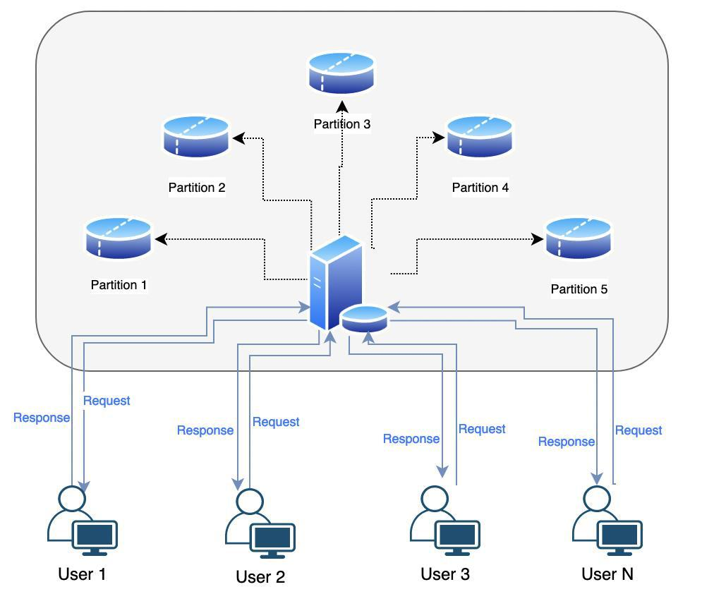
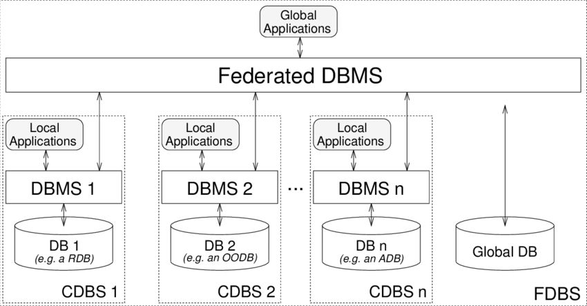

# Capítulo 9 – Bancos de Dados Distribuídos

Até agora, nossa jornada se concentrou em sistemas de banco de dados centralizados, onde os dados residem em um único local. No entanto, as demandas da era digital — com volumes massivos de dados, usuários espalhados pelo globo e uma exigência de disponibilidade 24/7 — tornaram a arquitetura centralizada insuficiente para muitas aplicações. Em resposta a esses desafios, surgiu o paradigma dos **Bancos de Dados Distribuídos (BDDs)**.

## Conceitos Gerais

Um **Banco de Dados Distribuído (BDD)** é uma coleção de múltiplos bancos de dados que são logicamente relacionados, mas que estão fisicamente espalhados por diferentes computadores (chamados de **nós**), em locais distintos, conectados por uma rede de comunicação.

A característica mais importante e definidora de um BDD é a **transparência**. Para o usuário ou para a aplicação, o sistema deve se comportar como um único banco de dados centralizado. Toda a complexidade da distribuição física dos dados é abstraída e gerenciada pelo Sistema de Gerenciamento de Banco de Dados Distribuído (SGBDD). O usuário não precisa saber em qual nó um dado específico está armazenado para poder acessá-lo.

Como o diagrama ilustra, os usuários interagem com o sistema de forma unificada, enquanto internamente o SGBDD roteia as requisições para as diferentes partições físicas onde os dados de fato residem.

## Teorema de Brewer (Teorema CAP)

Projetar um sistema distribuído introduz desafios que não existem em um sistema centralizado, especialmente no que diz respeito a como lidar com falhas de rede. O **Teorema de Brewer**, mais conhecido como **Teorema CAP**, formaliza o dilema fundamental enfrentado por esses sistemas.

O teorema afirma que, de três garantias desejáveis, um sistema de armazenamento de dados distribuído só pode fornecer, no máximo, **duas** ao mesmo tempo. As três garantias são:

- **Consistência (C - _Consistency_):** Garante que toda operação de leitura receba a versão mais recente e confirmada do dado. Todos os nós no sistema retornam o mesmo dado, no mesmo momento.
- **Disponibilidade (A - _Availability_):** Garante que toda requisição receba uma resposta (que não seja um erro), sem garantia de que a resposta contenha a versão mais recente da informação. O sistema está sempre operacional.
- **Tolerância a Partições (P - _Partition Tolerance_):** Garante que o sistema continue a operar mesmo que ocorra uma "partição" na rede (uma quebra de comunicação entre os nós).

Em um sistema distribuído, a ocorrência de partições de rede é uma realidade inevitável. Portanto, a **Tolerância a Partições (P)** não é uma opção, mas uma necessidade. Isso força os arquitetos de sistemas a fazerem uma escolha difícil entre as outras duas garantias: consistência ou disponibilidade.

- **Sistemas CP (Consistência e Tolerância a Partições):** Quando ocorre uma partição de rede, o sistema escolhe preservar a consistência. Para isso, ele pode se tornar **indisponível** para algumas requisições, recusando-se a responder para evitar o risco de retornar um dado desatualizado. Sistemas de bancos de dados relacionais distribuídos, como o Google Spanner, geralmente se enquadram nesta categoria.
- **Sistemas AP (Disponibilidade e Tolerância a Partições):** Quando ocorre uma partição de rede, o sistema escolhe permanecer **disponível**. Ele continuará a responder a requisições, mesmo que isso signifique retornar uma versão do dado que pode estar desatualizada. A consistência é sacrificada em prol da disponibilidade, adotando um modelo de **consistência eventual**. A maioria dos bancos de dados NoSQL, como o Apache Cassandra e o MongoDB, se enquadra nesta categoria.

## ACID vs. BASE: Duas Filosofias de Consistência

O Teorema CAP evidencia que garantir as propriedades ACID, especialmente a consistência estrita, em um sistema distribuído de larga escala é uma tarefa custosa, que pode impactar a latência e a disponibilidade (exigindo protocolos como 2PC e 3PC).

Em resposta a essa dificuldade, surgiu uma filosofia de design alternativa, mais flexível e escalável, especialmente popular em sistemas NoSQL: o modelo **BASE**.

O acrônimo BASE significa:

- **Basically Available (Disponibilidade Básica):** O sistema garante a disponibilidade, conforme o Teorema CAP. Ele prioriza manter o sistema em funcionamento, mesmo que isso signifique que algumas respostas possam estar baseadas em dados não totalmente atualizados.
- **Soft State (Estado Flexível):** O estado do sistema pode mudar ao longo do tempo, mesmo sem uma nova entrada, à medida que os dados se propagam entre os nós e a consistência é alcançada.
- **Eventual Consistency (Consistência Eventual):** Esta é a propriedade central. O sistema garante que, se nenhuma nova atualização for feita a um determinado dado, **eventualmente** todas as réplicas desse dado irão convergir para o mesmo valor. É uma promessa de consistência futura, não imediata.

Enquanto o ACID é pessimista e foca em garantir a consistência a todo custo, o BASE é otimista, priorizando a disponibilidade e a escalabilidade e aceitando que a consistência será alcançada em um momento posterior.

## Transparência em Bancos de Dados Distribuídos

Como ressaltado, o objetivo mais importante ao projetar um BDD é proporcionar uma experiência **transparente** para os usuários e aplicações. Em um contexto técnico, transparência significa que a complexidade inerente à distribuição dos dados (sua localização física, sua fragmentação ou replicação) permanece completamente oculta.

A aplicação interage com o banco de dados como se ele fosse uma entidade única e centralizada. A "mágica" de encontrar os dados, otimizar a consulta através da rede, lidar com falhas e combinar os resultados é de responsabilidade do Sistema de Gerenciamento de Banco de Dados Distribuído (SGBDD). Pense na transparência como uma tomada elétrica: você simplesmente conecta seu aparelho e recebe energia, sem precisar conhecer a usina, os transformadores ou a fiação que tornam isso possível.

Existem diferentes tipos de transparência que um SGBDD idealmente deve fornecer.

|Tipo de Transparência|Definição|
|---|---|
|**Transparência de Localização**|Refere-se ao fato de os usuários poderem acessar dados sem precisar conhecer sua localização física real na rede. O sistema localiza e recupera os dados automaticamente, independentemente do nó onde estejam armazenados.|
|**Transparência de Fragmentação**|A fragmentação é a divisão de uma tabela em pedaços menores. A transparência garante que os usuários possam realizar consultas como se a tabela estivesse inteira, sem precisar saber como ela foi dividida ou onde cada fragmento está.|
|**Transparência de Replicação**|Os dados podem ser replicados (copiados) em múltiplos nós para melhorar a disponibilidade e o desempenho. A transparência de replicação oculta a existência dessas cópias. O usuário realiza uma operação, e o sistema gerencia a atualização de todas as réplicas.|
|**Transparência de Falhas**|Garante que o sistema continue a operar ou se recupere rapidamente de falhas de rede ou de nós, idealmente sem que o usuário perceba a interrupção. O sistema deve ser capaz de redirecionar as operações para nós saudáveis.|
|**Transparência de Concorrência**|Garante que múltiplos usuários possam realizar transações simultaneamente sem interferir uns nos outros, mesmo que suas operações afetem nós diferentes. O SGBDD gerencia os bloqueios e a sincronização de forma transparente.|
|**Transparência de Desempenho**|Significa que o desempenho da consulta deve ser mantido em um nível aceitável, independentemente de onde os dados estão fisicamente localizados. O otimizador de consultas distribuído deve ser inteligente o suficiente para minimizar a transferência de dados pela rede.|

## Bancos Homogêneos vs. Heterogêneos

Os Bancos de Dados Distribuídos podem ser classificados em duas categorias principais, com base na uniformidade dos softwares e estruturas utilizados em seus nós.

- **Sistemas Distribuídos Homogêneos:** Nesta arquitetura, todos os nós do sistema utilizam o mesmo SGBD (ex: todos os nós rodam a mesma versão do Oracle ou do PostgreSQL) e operam com esquemas de dados idênticos ou compatíveis. Essa uniformidade simplifica enormemente a administração, o gerenciamento de consultas e a implementação das transparências, pois todos os nós "falam a mesma língua". Esta é a abordagem mais comum quando um sistema é projetado do zero para ser distribuído.
- **Sistemas Distribuídos Heterogêneos (Bancos de Dados Federados):** Esta arquitetura surge da necessidade de integrar sistemas de banco de dados diferentes. Em um ambiente heterogêneo, os nós podem utilizar SGBDs de fornecedores distintos (ex: um nó Oracle, outro SQL Server, outro MongoDB), com modelos de dados e esquemas diferentes. Um sistema que integra esses ambientes distintos é chamado de Sistema de Banco de Dados Federado ou Multibanco. A integração é realizada por uma camada de software intermediária, um _middleware_, conhecido como **Sistema de Gerenciamento de Banco de Dados Federado (SGBDF)**. Este sistema funciona como um "tradutor universal": ele recebe uma consulta global da aplicação, a decompõe em subconsultas apropriadas para cada SGBD subjacente, envia essas subconsultas, coleta os resultados individuais e os integra em uma única resposta coesa para o usuário.

Como o diagrama ilustra, a arquitetura federada é uma solução poderosa para integrar sistemas legados ou para unir informações de diferentes departamentos ou empresas (após uma fusão, por exemplo) que utilizam tecnologias de banco de dados distintas, proporcionando uma visão unificada sobre um ambiente tecnologicamente diverso.

## Arquitetura de Bancos de Dados Distribuídos (BDDs)

A arquitetura de um banco de dados distribuído define como seus componentes físicos e lógicos são organizados para armazenar, gerenciar e recuperar dados que estão espalhados por diferentes locais. Uma arquitetura eficiente é a espinha dorsal de um BDD, garantindo não apenas a integridade e a consistência dos dados, mas também o desempenho, a disponibilidade e a escalabilidade horizontal que são a razão de ser deste paradigma.

### Os Elementos da Arquitetura Distribuída

Para que a "mágica" da transparência funcione, um SGBD Distribuído (SGBDD) é composto por vários elementos especializados que trabalham em conjunto.

|Elemento|Definição e Detalhes|
|---|---|
|**Nó (_Node_)**|Cada nó é um servidor individual, fisicamente separado, que atua como um participante no sistema distribuído. Um nó é responsável por armazenar uma parte dos dados (um fragmento ou uma réplica) e por processar as consultas que lhe são direcionadas. A coleção de todos os nós forma o banco de dados distribuído.|
|**Rede de Comunicação**|É a infraestrutura que interliga todos os nós, permitindo que eles troquem dados e mensagens de coordenação. A qualidade, a latência e a confiabilidade da rede são fatores críticos que impactam diretamente o desempenho e a resiliência de todo o sistema.|
|**Middleware Distribuído**|Esta é a camada de software que funciona como o "cérebro" do sistema. Sua função é ocultar a complexidade da distribuição, fornecendo uma interface única para as aplicações. O middleware é responsável pelo roteamento de consultas, pela tradução de comandos (em sistemas heterogêneos) e pela integração dos resultados parciais.|
|**Gerenciador de Transações (DTM)**|O _Distributed Transaction Manager_ é o componente responsável por coordenar a execução de transações que afetam múltiplos nós. Ele garante as propriedades ACID em nível global, orquestrando protocolos como o Two-Phase Commit (2PC) para assegurar que a transação seja confirmada ou abortada em todos os nós de forma atômica.|
|**Gerenciador de Consultas (DQM)**|O _Distributed Query Manager_ é o otimizador de consultas do sistema. Ele recebe uma consulta global da aplicação, a decompõe em subconsultas otimizadas para cada nó, coordena a execução distribuída, recupera os resultados parciais e os consolida em uma única resposta para o usuário, buscando sempre minimizar o tráfego de dados na rede.|
|**Catálogo Distribuído**|Assim como o dicionário de dados em um sistema centralizado, o catálogo distribuído armazena os metadados do sistema. Ele contém informações cruciais sobre a localização de cada fragmento de dado, os detalhes da replicação, os esquemas locais e globais e as permissões de acesso, permitindo que o sistema saiba como localizar e recuperar qualquer dado solicitado.|

### Modelos de Arquitetura

A forma como esses elementos interagem pode seguir diferentes modelos arquiteturais, sendo os mais comuns o cliente-servidor e o peer-to-peer.

#### Arquitetura Cliente-Servidor

Esta arquitetura é uma extensão do modelo tradicional para um ambiente distribuído. A lógica de interação permanece a mesma, mas o lado do "servidor" agora é composto por múltiplos nós distribuídos.

- **Clientes:** São as aplicações ou os usuários que iniciam as requisições, enviando consultas e transações para o sistema.
- **Servidores:** São os nós responsáveis pelo armazenamento e processamento dos dados.

Existem variações importantes nesta arquitetura, principalmente na forma como o catálogo é gerenciado:

- **Cliente-servidor com catálogo centralizado:** Um único nó especializado atua como o servidor de catálogo, centralizando todos os metadados. Esta abordagem simplifica o gerenciamento, mas pode se tornar um gargalo de desempenho e um ponto único de falha.
- **Cliente-servidor com catálogo distribuído:** Cada nó mantém uma cópia do catálogo ou uma parte dele. Esta abordagem é mais resiliente e escalável, mas aumenta significativamente a complexidade da sincronização para garantir que todos os nós tenham uma visão consistente dos metadados.

#### Arquitetura Peer-to-Peer (P2P)

Na arquitetura peer-to-peer, a distinção entre cliente e servidor é eliminada. **Todos os nós são iguais** (são "pares") e podem atuar simultaneamente como clientes (solicitando dados de outros nós) e como servidores (fornecendo dados a outros nós).

O controle neste modelo é altamente descentralizado, sem um nó central de coordenação. Os catálogos são, por natureza, distribuídos, e os nós colaboram para rotear consultas e manter a consistência dos dados. Arquiteturas P2P são conhecidas por sua alta resiliência e escalabilidade, sendo a base para muitos sistemas NoSQL modernos, como o Apache Cassandra.

