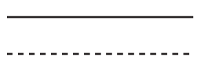
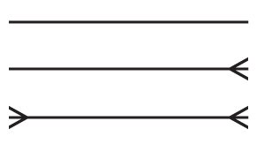
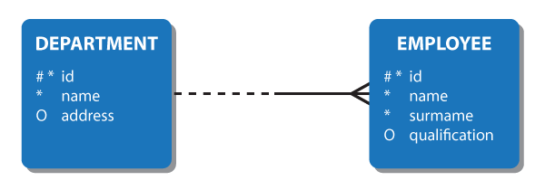
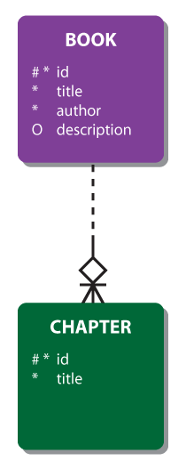
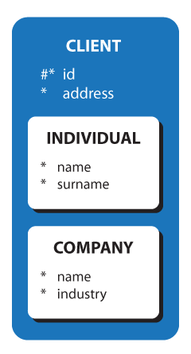
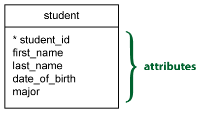
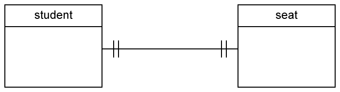

# Capítulo 9 – Outras Notações Conceituais

Ao longo dos capítulos anteriores, estudamos em profundidade o Modelo Entidade-Relacionamento (ER) e sua extensão (EER), que são amplamente utilizados na modelagem conceitual de dados. No entanto, o mundo do projeto de banco de dados é rico em variações e notações alternativas, muitas delas impulsionadas por ferramentas CASE (Computer-Aided Software Engineering), por iniciativas industriais ou mesmo por necessidades específicas de clareza e padronização em ambientes corporativos.

Este capítulo tem como objetivo apresentar de forma descritiva e comparativa algumas das notações conceituais mais relevantes além do modelo ER tradicional, com foco especial nas notações **Chen**, **Barker**, **Pé-de-Galinha (Crow’s Foot)** e **IDEF1X**. Todas são utilizadas por ferramentas populares de modelagem e podem aparecer em contextos profissionais e, inclusive, em provas e concursos.

## Notação de Chen: a Origem da Modelagem Entidade-Relacionamento

Dando continuidade à nossa jornada pelas diferentes notações utilizadas em diagramas entidade-relacionamento, é fundamental revisitarmos aquela que deu origem a todo esse campo de estudo: a **Notação de Chen**. Desenvolvida por **Peter Chen** e publicada em 1976, essa notação representa a base teórica e prática de toda a modelagem conceitual utilizada em projetos de banco de dados até os dias atuais.

Apesar de muitas ferramentas modernas adotarem outras notações mais simplificadas — como a pé-de-galinha ou Barker — a notação de Chen ainda é considerada uma das mais **completas e formais**, sendo ideal para representar, com riqueza de detalhes, os conceitos de entidades, atributos, relacionamentos e restrições.

A notação de Chen, embora não seja a mais comum nas ferramentas modernas de modelagem, continua sendo **altamente relevante do ponto de vista acadêmico e didático**. Sua estrutura detalhada permite representar com precisão conceitos essenciais da modelagem conceitual e oferece uma base sólida para compreender outras notações derivadas.

Para estudantes, professores e projetistas que desejam entender profundamente as **raízes da modelagem ER**, estudar a notação de Chen é um exercício indispensável. Ela nos lembra que, por trás de cada ferramenta visual, existe uma **teoria bem fundamentada**, construída com rigor e com foco na representação precisa da realidade do domínio de aplicação.

### Entidades

Na notação de Chen, as **entidades** são representadas por **retângulos**, que contêm o nome da entidade em destaque. A notação distingue diferentes tipos de entidades, com símbolos específicos para representar nuances importantes da modelagem.

Uma entidade comum, ou **entidade forte**, é representada por um retângulo simples. Ela é identificada de forma única por seus próprios atributos.

<div align="center">
  
</div>

Uma **entidade fraca** é aquela que **não possui um identificador próprio** e depende de uma entidade forte para sua existência. Seu retângulo é representado com **linhas duplas**, e sua chave é composta por um **atributo parcial** (ou discriminador) e o identificador da entidade associada. Essa representação formaliza a **dependência de existência**.

<div align="center">
  
</div>

Quando temos um relacionamento muitos-para-muitos entre duas entidades, pode ser necessário representar esse relacionamento como uma **entidade própria** — a chamada **entidade associativa**. Ela é usada principalmente para permitir o armazenamento de **atributos adicionais** que pertencem ao relacionamento em si. Essa entidade se relaciona com as demais utilizando apenas **relacionamentos do tipo muitos (N ou M)**.

<div align="center">
  
</div>

### Atributos

Os **atributos** na notação de Chen são representados por **elipses** ligadas por linhas retas às suas entidades ou relacionamentos correspondentes.
A notação fornece ainda símbolos distintos para diferentes tipos de atributos:

**Atributo comum** é representado por uma elipse simples.

<div align="center">
  
  <br/>
  
</div>

**Atributo-chave** é sublinhado dentro da elipse, indicando que identifica unicamente uma instância da entidade. Exemplo: o atributo `VIN` (Vehicle Identification Number) na entidade `CAR`.

<div align="center">
  
  <br/>
  
</div>

**Atributo parcial** é utilizado em entidades fracas. É sublinhado com **linha tracejada**, indicando que precisa ser combinado com a chave da entidade forte.

<div align="center">
  
</div>

**Atributo multivalorado** pode conter **vários valores diferentes** para uma mesma instância. É representado por uma **elipse dupla**. Exemplo: o atributo “hobby” da entidade “user”.

<div align="center">
  
  <br/>
  
</div>

**Atributo derivado** é aquele obtido a partir de outros atributos, como a idade a partir da data de nascimento. Representado por uma **elipse com linha tracejada**.

<div align="center">
  
  <br/>
  
</div>

**Atributo composto** é o que pode ser subdividido em partes menores. Um exemplo clássico é o atributo “endereço”, que pode conter rua, número, cidade, CEP, etc.

<div align="center">
  
</div>

### Relacionamentos

Na notação de Chen, os **relacionamentos** são representados por **losangos** contendo o nome do relacionamento. Esse elemento gráfico conecta as entidades participantes por meio de **linhas**.

Um **relacionamento forte** ocorre entre entidades que são independentes. O losango é desenhado com **linha simples**.

<div align="center">
  
</div>

Um relacionamento fraco indica que uma **entidade fraca depende da entidade forte para existir**. Nessa situação, o relacionamento é representado por um **losango com linhas duplas**, e participa diretamente da composição da chave primária da entidade fraca.

<div align="center">
  
</div>

A notação de Chen também diferencia **relacionamentos obrigatórios e opcionais**, com base nas linhas que conectam as entidades ao relacionamento:

- **Linha contínua**: indica **relacionamento obrigatório** (total participation).
- **Linha tracejada**: indica **relacionamento opcional** (partial participation).

<div align="center">
  
</div>

### Cardinalidade

A **cardinalidade** de um relacionamento, ou seu grau, é expressa por meio de **números ou letras** junto às extremidades das linhas que ligam entidades aos losangos:

**1:1 (um para um)**: um funcionário gerencia apenas um departamento, e um departamento só pode ser gerenciado por um funcionário.

<div align="center">
  
</div>

**1:N (um para muitos)**: um cliente pode fazer muitos pedidos, mas cada pedido está vinculado a um único cliente.

<div align="center">
  
</div>

**N:1 (muitos para um)**: muitos empregados pertencem a um único departamento.

<div align="center">
  
</div>

 **M:N (muitos para muitos)**: vários estudantes podem participar de várias organizações estudantis, e vice-versa.

<div align="center">
  
</div>

Essas expressões são anotadas junto às linhas e facilitam a identificação da multiplicidade do relacionamento.

### Participação Total e Parcial

Um conjunto de entidades pode participar de uma relação **total ou parcialmente**.

**Participação total** significa que todas as entidades do conjunto estão envolvidas na relação, por exemplo, cada aluno deve ser orientado por um professor (não há alunos que não sejam orientados por nenhum professor). Na notação de Chen, esse tipo de relação é representado por uma linha dupla.

**Participação parcial** significa que nem todas as entidades do conjunto estão envolvidas na relação, por exemplo, nem todos os professores orientam um aluno (há professores que não o fazem). Na notação de Chen, uma participação parcial é representada por uma única linha.

<div align="center">
  
</div>

A relação mostrada acima significa que cada aluno, sem exceção, deve ser orientado por um professor escolhido, e um professor – mas não todos – pode orientar muitos alunos. Portanto, não há aluno que não seja orientado por um professor e, por outro lado, pode haver professores que não orientam nenhum aluno.

### Exemplo completo: Livro e Capítulo

Vamos retomar um exemplo clássico utilizado anteriormente: a relação entre **livros e capítulos**. Na notação de Chen, esse relacionamento pode ser representado com os elementos discutidos acima. O livro é a entidade principal, e o capítulo é uma entidade fraca, pois depende do livro para existir. A figura representaria a composição do relacionamento com participação total de capítulo e cardinalidade adequada para ambos os lados.

<div align="center">
  
</div>

## Notação de Barker: Simplicidade com Expressividade

A **notação de Barker** surgiu no final da década de 1980 no Reino Unido, fruto do trabalho de Richard Barker em parceria com o CACI. Posteriormente, essa notação foi incorporada em ferramentas da Oracle Corporation, tornando-se bastante difundida no meio corporativo. Até hoje, muitos projetistas a preferem em detrimento de alternativas como a UML, especialmente quando se trata de modelagem voltada a bancos de dados relacionais.

Uma das características marcantes da notação Barker é sua clareza visual e textual, o que facilita não apenas o entendimento, mas também a **leitura verbal de relacionamentos**, algo que a torna bastante didática em ambientes corporativos.

### Representação de Entidades e Atributos

Na notação de Barker, os **tipos de entidade** são representados por **retângulos de cantos arredondados**. Os **nomes das entidades aparecem em letras maiúsculas**, e os **atributos** são listados logo abaixo do nome da entidade.

A figura a seguir apresenta a forma básica de uma entidade nessa notação:

<div align="center">
  
</div>

Nesta representação:

- O símbolo `#` antes do nome de um atributo indica que ele é **chave primária** (ou faz parte de uma chave composta).
- Um asterisco `*` ou ponto escuro `•` indica que o atributo é **obrigatório** — ou seja, não pode ter valor nulo.
- Um `o` indica que o atributo é **opcional**, podendo, portanto, assumir o valor nulo.
- Alguns modeladores usam um ponto simples `.` para indicar que o atributo **não faz parte da chave primária**.

Essa convenção torna o diagrama informativo e preciso, sem perder a legibilidade.

### Representação de Relacionamentos

Os relacionamentos, na notação de Barker, são sempre **binários**, ou seja, entre duas entidades. Eles são representados por **linhas que ligam as entidades**, podendo ser contínuas ou tracejadas:

<div align="center">
  
</div>

- **Linha contínua**: indica um relacionamento **obrigatório**.
- **Linha tracejada**: indica um relacionamento **opcional**.

Os **papéis** desempenhados por cada entidade no relacionamento são indicados por **nomes nas extremidades da linha**, permitindo que a leitura possa ser feita de forma natural, da esquerda para a direita ou vice-versa.

Veja a figura a seguir como exemplo:

<div align="center">
  
</div>

Observe que o relacionamento entre TIME e JOGADOR é obrigatório para ambos os lados — cada jogador pertence a um time, e cada time deve ter ao menos um jogador. Já a ligação entre CONFEDERAÇÃO e LIGA é opcional para a confederação e obrigatória para a liga.

### Leitura de Cardinalidade

Uma peculiaridade interessante da notação Barker é a forma como as **cardinalidades** são posicionadas graficamente. Diferentemente do modelo ER tradicional, a **obrigatoriedade** e a **multiplicidade** são colocadas em lados opostos da linha que representa o relacionamento. As simbologias da imagem a seguir significam, respectivamente;

<div align="center">
  
</div>

- **1 para 1**: cada instância de entidade está relacionada a apenas uma instância de entidade.
- **1 para muitos**: cada instância de entidade está relacionada a múltiplas instâncias de entidade.
- **Muitos para muitos**:  múltiplas instâncias de entidade estão relacionadas a múltiplas instâncias de entidade.

Um relacionamento é sempre composto por duas perspectivas, usando a seguinte notação:

<div align="center">
  
</div>

Na figura acima, temos uma situação onde um ou mais funcionários podem trabalhar em cada departamento; cada funcionário deve trabalhar em um departamento.

### Identificadores

Uma barra `|` em uma extremidade de uma linha de relacionamento indica que o relacionamento é um componente do **identificador primário** para o tipo de entidade naquela extremidade.

<div align="center">
  
</div>

Cada barra individual no `ORDER ITEM` do exemplo a seguir representa o fato de que a chave estrangeira representada pelo relacionamento também é uma chave primária da entidade DO PEDIDO.

<div align="center">
  
</div>

### Relacionamentos Intransferíveis

Em certas situações, uma vez estabelecido um relacionamento, ele nunca pode ser alterado. Por exemplo, BOOK e CHAPTER no exemplo abaixo. O capítulo não pode ser movido para um livro diferente. Chamamos isso de de um relacionamento intransferível e é representado por um losango.

<div align="center">
  
</div>

### Superclasses e Subclasses

Na notação de Barker, as subclasses em relações de herança são representadas aninhadas dentro da superclasses da qual derivam:

<div align="center">
  
</div>

## Notação Pé-de-Galinha (Crow’s Foot Notation): clareza gráfica e popularidade prática

A **notação pé-de-galinha**, também conhecida como **IE Notation (Information Engineering Notation)**, é atualmente uma das mais populares no campo da modelagem conceitual de dados. Seu nome peculiar deriva do símbolo gráfico que representa o lado "muitos" de um relacionamento: um **tridente** com três pontas, visualmente semelhante ao pé de uma galinha. Essa característica gráfica não é apenas estética; ela cumpre um papel essencial na **comunicação visual da multiplicidade** dos relacionamentos.

A origem da notação pé-de-galinha remonta a um artigo publicado por **Gordon Everest** em 1976, durante a **Fifth Computing Conference** do IEEE. Inicialmente, Everest referia-se à notação como “**inverted arrow**” (seta invertida), diferenciando-a da notação de Bachman, que utilizava setas direcionais. A escolha pela "seta invertida" refletia o desejo de evitar a ideia de direção de acesso físico e, ao mesmo tempo, tornar a multiplicidade do relacionamento mais intuitiva.

Posteriormente, a notação passou a ser chamada de **“chicken foot”** (pé de galinha), popularizada por autores como **Carlis**. Com o tempo, consolidou-se como **“crow’s foot notation”** (pé de corvo), embora o próprio Everest tenha afirmado preferir o termo **“fork”** (garfo), por ser direto e mais fácil de representar textualmente, como em:

```
[ X ]------<[ Y ]
```

Essa representação expressa que **um único X pode estar relacionado a vários Ys**, enquanto **cada Y está associado a, no máximo, um X** — uma leitura clara e direta do clássico relacionamento "um-para-muitos".

Essa notação, além de clara, é bastante **intuitiva e compatível com ferramentas CASE modernas**, sendo utilizada em sistemas como Microsoft Visio, Lucidchart, ER/Studio e MySQL Workbench, o que explica sua ampla adoção em ambientes de engenharia de software, análise de sistemas e modelagem de banco de dados.

### Entidades

Na notação pé-de-galinha, as **entidades** são representadas por **retângulos**, com o nome da entidade escrito na parte superior. Como em outras notações modernas, o nome da entidade deve ser **singular**, representando uma instância da classe de objetos descrita.

<div align="center">
  
</div>

Uma entidade pode representar qualquer objeto de interesse no domínio de aplicação: uma pessoa, produto, local, evento, etc. Suas características são descritas por **atributos**.

### Atributos

Os **atributos** descrevem propriedades de uma entidade. Embora a notação pé-de-galinha não represente atributos como elipses (como na notação de Chen), eles são indicados dentro da própria entidade ou em anotações associadas. Um atributo que serve como **identificador único** de uma entidade — a chave primária — costuma ser **marcado com um asterisco**, conforme exemplo:

<div align="center">
  
</div>

Essa simplicidade visual torna a notação prática e compatível com diagramas de projeto lógico e físico.

### Relacionamentos

Os **relacionamentos** entre entidades são representados por **linhas retas** conectando os retângulos das entidades. O nome do relacionamento, que geralmente é um **verbo**, pode ser colocado sobre a linha para descrever a natureza da associação.

Um aspecto importante da notação pé-de-galinha é que os relacionamentos são, por padrão, **binários**, ou seja, envolvem **duas entidades**. A representação de relacionamentos ternários ou de grau superior é rara e pouco prática nesta notação, o que reforça a necessidade de uma modelagem bem estruturada.

### Cardinalidade e Participação

A principal característica visual da notação pé-de-galinha está na forma como ela representa **a cardinalidade** e a **participação** (obrigatória ou opcional) de uma entidade em um relacionamento. Cada extremidade da linha de relacionamento contém **duas marcas** gráficas:

**A multiplicidade máxima** (um ou muitos):

<div align="center">
  
</div>

**A participação mínima** (obrigatória ou opcional):

<div align="center">
  
</div>

Essas marcações são colocadas sempre na **extremidade externa** da linha, obedecendo a uma ordem específica: **primeiro a multiplicidade, depois a obrigatoriedade**.

As combinações possíveis são:

**Um e apenas um** (`||`): indica que a entidade se relaciona com **uma e somente uma** instância da outra.

<div align="center">
  
</div>

 **Zero ou um** (`|○`): significa que a entidade pode ou não se relacionar com uma única instância (relacionamento opcional).

<div align="center">
  
</div>

**Um ou mais** (`⪫|`): a entidade deve obrigatoriamente se relacionar com **uma ou mais** instâncias da outra.

<div align="center">
  
</div>

**Zero ou mais** (`⪫○`): a entidade **pode se relacionar com nenhuma, uma ou várias** instâncias da outra.

<div align="center">
  
</div>

### Interpretação dos relacionamentos

Com base nessas marcações, podemos interpretar os graus de relacionamento da seguinte forma:

**Relacionamento um para um**:

- Cada **estudante** deve estar obrigatoriamente associado a **um único assento**.
- Cada **assento** deve obrigatoriamente estar associado a **um único estudante**.

<div align="center">
  
</div>

Este é um relacionamento **Um-para-um obrigatório (1:1)**. Por exemplo, imagine uma sala de provas em que cada estudante é alocado a um assento específico, e cada assento só pode ser ocupado por um estudante. Nenhum estudante fica sem assento, e nenhum assento fica vazio.

**Relacionamento um para muitos**:

- Um **curso** pode estar associado a **nenhuma, uma ou várias** palestras (lectures).
- Cada **palestra** deve obrigatoriamente estar associada a **um único curso**.

<div align="center">
  
</div>

Este é um relacionamento **Um-para-muitos com participação obrigatória em “lecture” e opcional em “course”**. Por exemplo, nem todo curso precisa, inicialmente, ter palestras agendadas (opcional). Mas cada palestra só faz sentido se estiver vinculada a um curso (obrigatório).

**Relacionamento muitos para muitos**:

- Um **estudante** pode estar matriculado em **nenhum, um ou vários** cursos.
- Um **curso** pode ter **nenhum, um ou vários** estudantes matriculados.

<div align="center">
  
</div>

Este é um relacionamento **Muitos-para-muitos opcional (M:N)**. Por exemplo, no início do semestre, um aluno pode ainda não estar matriculado em nenhuma disciplina (participação opcional), e um curso novo pode ainda não ter estudantes inscritos. Mas ambos podem se relacionar com muitos elementos do outro lado posteriormente.

## Notação IDEF1X: precisão e foco lógico

A notação **IDEF1X** (Integration Definition for Information Modeling) é uma das mais rigorosas e completas entre as notações conceituais. Desenvolvida para padronizar a modelagem de dados no Departamento de Defesa dos Estados Unidos, ela combina características de modelagem conceitual com elementos estruturais típicos da modelagem lógica, como **chaves primárias**, **chaves estrangeiras**, **dependência de existência** e **herança**.

Essa notação é especialmente valorizada por sua **disciplina formal**, tornando-se comum em concursos públicos e projetos de grande porte, onde a clareza de dependências entre entidades é essencial.

### Entidades, Atributos e Relacionamento

A figura a seguir apresenta duas entidades independentes e suas áreas de atributos:

<div align="center">
  
</div>

As **entidades independentes** são representadas por **retângulos com cantos retos**, enquanto **entidades dependentes** possuem **cantos arredondados**.

Os atributos se dividem em:

- **Atributos-chave**: aparecem **acima da linha horizontal** dentro do retângulo.
- **Demais atributos**: aparecem **abaixo da linha horizontal**.

As designações `(PK)`, `(FK)`, `(AK)` e `(O)` podem ser colocadas a frente dos atributos para indicar, respectivamente, **chave primária**, **chave estrangeira**, **chave alternativa** e **atributo opcional**.

### Relacionamentos identificadores e não identificadores

Uma das grandes contribuições da notação IDEF1X é a distinção entre **relacionamentos identificadores** e **não identificadores**:

- Em um **relacionamento identificador**, a chave primária da entidade-pai participa da chave primária da entidade-filha. Isso indica uma **dependência de identificação**.
- Em um **relacionamento não identificador obrigatório**, a chave da entidade-pai não participa da chave primária da entidade-filha, mas o vínculo é **obrigatório** (a linha é contínua).
- Em um **relacionamento não identificador opcional**, o vínculo é **opcional** e a chave da entidade-pai aparece como **atributo opcional** na entidade-filha (a linha é tracejada).

Veja alguns exemplos para esclarecer essa representação. Abaixo temos um **relacionamento identificador**:

<div align="center">
  
</div>

Na figura, a entidade A “empresta” sua chave primária para a entidade B. Logo, temos um **relacionamento identificador**, e, logicamente uma dependência de identificador. Observe que nessa situação a linha que liga as duas entidades é contínua. Isso demonstra a obrigatoriedade do relacionamento. Assim, neste exemplo, a chave primária da entidade pai participa da chave primária da entidade filha.

E aqui, um **relacionamento não identificador obrigatório**:

<div align="center">
  
</div>

Uma entidade pai em um **relacionamento não identificado obrigatório** pode ser uma entidade independente de identificador (como mostrado na entidade A da figura) ou uma entidade dependente de identificador dependendo dos outros relacionamentos (que não aparece na figura). A entidade filha em um relacionamento não identificado mandatório será sempre uma entidade independente de identificador ao menos que a entidade seja também uma entidade filha em algum outro relacionamento identificador. Neste caso, a chave primária da entidade pai não participa da chave primária da entidade filha, mas é um atributo obrigatório.

Já um **relacionamento não identificador opcional**:

<div align="center">
  
</div>

No caso do **relacionamento não identificado opcional**, a chave primária da entidade pai não participa da chave primária da entidade filha e é um atributo opcional.

### Cardinalidade

A Notação IDEF1X permite representar precisamente a cardinalidade dos relacionamentos, que diz respeito a quantas ocorrências podem estar associadas a uma ocorrência de entidade envolvida em determinado relacionamento.

Todo relacionamento deve ser considerado nos dois sentidos possíveis: da entidade pai (ou genérica) para a filha (ou categoria), e vice-versa. No sentido da entidade filha para a entidade pai, a cardinalidade é “exatamente uma”, com a exceção dos relacionamentos não-identificadores opcionais, onde a cardinalidade é “zero ou uma”. 

No sentido inverso, a variedade é maior. A figura acima apresenta a representação gráfica das várias cardinalidades possíveis para relacionamentos de conexão e seus significados. Em relacionamentos de categorização, a cardinalidade no sentido da entidade genérica para a categoria é sempre “zero ou uma”.

<div align="center">
  
</div>

Restrições sobre a estrutura da informação que não são representáveis através dos elementos da notação são representados através de notas. Um exemplo é ilustrado na figura, onde um índice `(n)` junto à entidade filha referencia uma nota (que deve ser apresentada indexada, em outro lugar no diagrama) que descreve uma cardinalidade não convencional.

### Herança, Exclusividade e Completude

Por fim, a notação IDEF1X também suporta a modelagem de **subtipos e supertipos** com base em critérios como:

- **Herança completa**: todas as instâncias da superclasse estão em alguma subclasse.
- **Herança incompleta**: nem todas as instâncias da superclasse pertencem a uma subclasse.
- **Exclusiva**: uma instância da superclasse pode pertencer a **apenas uma subclasse**.
- **Inclusiva**: uma instância da superclasse pode pertencer a **várias subclasses** simultaneamente.

A representação de todas essas possibilidade é representada a seguir:

<div align="center">
  
</div>

## Considerações Finais

Neste capítulo, exploramos outras notações conceituais que complementam o modelo ER tradicional, cada uma com suas vantagens, limitações e contextos de aplicação. A **notação de Chen**, embora não seja a mais comum nas ferramentas modernas de modelagem, continua sendo altamente relevante do ponto de vista didático, pois permite representar com precisão conceitos essenciais da modelagem conceitual e oferece uma base sólida para compreender outras notações derivadas. A **notação de Barker** é amplamente usada por seu equilíbrio entre simplicidade e expressividade. A **notação pé-de-galinha** se destaca por sua clareza visual e é suportada por diversas ferramentas modernas. Já a **notação IDEF1X** é mais formal e adequada para contextos que exigem maior rigor na definição de relacionamentos e dependências.

Conhecer essas alternativas permite que o projetista selecione a notação mais adequada ao contexto do projeto, compreenda diagramas de diferentes fontes e ferramentas, e esteja preparado para lidar com modelagens diversas, tanto na vida acadêmica quanto na prática profissional.
