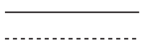
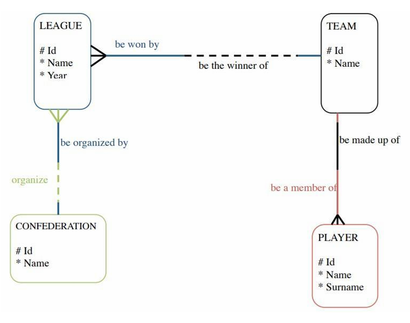
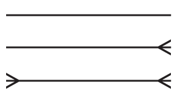
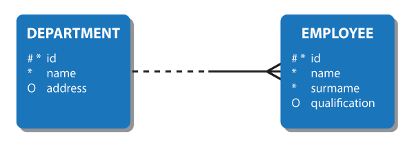
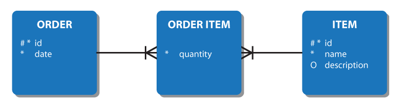
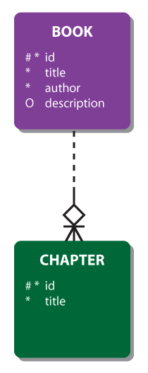
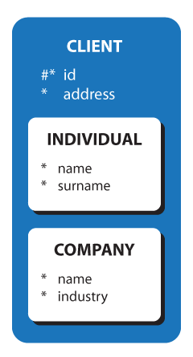

# Capítulo 9 – Outras Representações Conceituais

Ao longo dos capítulos anteriores, estudamos em profundidade o Modelo Entidade-Relacionamento (ER) e sua extensão (EER), que são amplamente utilizados na modelagem conceitual de dados. No entanto, o mundo do projeto de banco de dados é rico em variações e notações alternativas, muitas delas impulsionadas por ferramentas CASE (Computer-Aided Software Engineering), por iniciativas industriais ou mesmo por necessidades específicas de clareza e padronização em ambientes corporativos.

Este capítulo tem como objetivo apresentar de forma descritiva e comparativa algumas das notações conceituais mais relevantes além do modelo ER tradicional, com foco especial nas notações **Barker**, **Pé-de-Galinha (Crow’s Foot)** e **IDEF1X**. Todas são utilizadas por ferramentas populares de modelagem e podem aparecer em contextos profissionais e, inclusive, em provas e concursos.

## Notação de Barker: Simplicidade com Expressividade

A **notação de Barker** surgiu no final da década de 1980 no Reino Unido, fruto do trabalho de Richard Barker em parceria com o CACI. Posteriormente, essa notação foi incorporada em ferramentas da Oracle Corporation, tornando-se bastante difundida no meio corporativo. Até hoje, muitos projetistas a preferem em detrimento de alternativas como a UML, especialmente quando se trata de modelagem voltada a bancos de dados relacionais.

Uma das características marcantes da notação Barker é sua clareza visual e textual, o que facilita não apenas o entendimento, mas também a **leitura verbal de relacionamentos**, algo que a torna bastante didática em ambientes corporativos.

### Representação de Entidades e Atributos

Na notação de Barker, os **tipos de entidade** são representados por **retângulos de cantos arredondados**. Os **nomes das entidades aparecem em letras maiúsculas**, e os **atributos** são listados logo abaixo do nome da entidade.

A figura a seguir apresenta a forma básica de uma entidade nessa notação:

  

Nesta representação:

- O símbolo `#` antes do nome de um atributo indica que ele é **chave primária** (ou faz parte de uma chave composta).
- Um asterisco `*` ou ponto escuro `•` indica que o atributo é **obrigatório** — ou seja, não pode ter valor nulo.
- Um `o` indica que o atributo é **opcional**, podendo, portanto, assumir o valor nulo.
- Alguns modeladores usam um ponto simples `.` para indicar que o atributo **não faz parte da chave primária**.

Essa convenção torna o diagrama informativo e preciso, sem perder a legibilidade.

### Representação de Relacionamentos

Os relacionamentos, na notação de Barker, são sempre **binários**, ou seja, entre duas entidades. Eles são representados por **linhas que ligam as entidades**, podendo ser contínuas ou tracejadas:

  

- **Linha contínua**: indica um relacionamento **obrigatório**.
- **Linha tracejada**: indica um relacionamento **opcional**.

Os **papéis** desempenhados por cada entidade no relacionamento são indicados por **nomes nas extremidades da linha**, permitindo que a leitura possa ser feita de forma natural, da esquerda para a direita ou vice-versa.

Veja a figura a seguir como exemplo:

  

Observe que o relacionamento entre TIME e JOGADOR é obrigatório para ambos os lados — cada jogador pertence a um time, e cada time deve ter ao menos um jogador. Já a ligação entre CONFEDERAÇÃO e LIGA é opcional para a confederação e obrigatória para a liga.

### Leitura de Cardinalidade

Uma peculiaridade interessante da notação Barker é a forma como as **cardinalidades** são posicionadas graficamente. Diferentemente do modelo ER tradicional, a **obrigatoriedade** e a **multiplicidade** são colocadas em lados opostos da linha que representa o relacionamento. As simbologias da imagem a seguir significam, respectivamente;

  

- **1 para 1**: cada instância de entidade está relacionada a apenas uma instância de entidade.
- **1 para muitos**: cada instância de entidade está relacionada a múltiplas instâncias de entidade.
- **Muitos para muitos**:  múltiplas instâncias de entidade estão relacionadas a múltiplas instâncias de entidade.

Um relacionamento é sempre composto por duas perspectivas, usando a seguinte notação:

  

Na figura acima, temos uma situação onde um ou mais funcionários podem trabalhar em cada departamento; cada funcionário deve trabalhar em um departamento.

### Identificadores

Uma barra `|` em uma extremidade de uma linha de relacionamento indica que o relacionamento é um componente do **identificador primário** para o tipo de entidade naquela extremidade.

  

Cada barra individual no `ORDER ITEM` do exemplo a seguir representa o fato de que a chave estrangeira representada pelo relacionamento também é uma chave primária da entidade DO PEDIDO.

  

### Relacionamentos Intransferíveis

Em certas situações, uma vez estabelecido um relacionamento, ele nunca pode ser alterado. Por exemplo, BOOK e CHAPTER no exemplo abaixo. O capítulo não pode ser movido para um livro diferente. Chamamos isso de de um relacionamento intransferível e é representado por um losango.

  

### Superclasses e Subclasses

Na notação de Barker, as subclasses em relações de herança são representadas aninhadas dentro da superclasses da qual derivam:

  

## Notação Pé-de-Galinha (Crow’s Foot Notation)

A notação conhecida como **pé-de-galinha** é uma das mais utilizadas no mundo da modelagem de dados. Seu nome deriva do símbolo gráfico característico que se parece com os dedos de um pé de galinha, representando multiplicidade nos relacionamentos.

Historicamente, essa notação tem suas raízes na abordagem de **Engenharia da Informação (EI)**, desenvolvida por Clive Finkelstein e posteriormente adaptada por James Martin, um dos maiores responsáveis pela sua popularização.

### Elementos gráficos e significados

Na notação pé-de-galinha, o lado do relacionamento mais próximo da entidade traz informações sobre **cardinalidade máxima**, enquanto a presença de **círculo ou barra vertical** representa a **opcionalidade** ou **obrigatoriedade**, respectivamente.

Veja a figura a seguir com os principais símbolos:

Nessa notação:

- Uma **barra vertical (|)** junto à entidade indica que o relacionamento é **obrigatório**.
- Um **círculo (○)** indica que a participação é **opcional**.
- Um **pé-de-galinha (⪫)** representa **muitos**.
- A combinação dos dois símbolos representa tanto a obrigatoriedade quanto a multiplicidade. Por exemplo, `|⪫` significa “um ou mais obrigatórios”.

Essa notação é especialmente útil para representar de forma **clara e visual** as restrições de participação e as regras de negócio, sendo por isso adotada em diversas ferramentas como Microsoft Visio, ER/Studio e MySQL Workbench.

## 9.3 – Notação IDEF1X: precisão e foco lógico

A notação **IDEF1X** (Integration Definition for Information Modeling) é uma das mais rigorosas e completas entre as notações conceituais. Desenvolvida para padronizar a modelagem de dados no Departamento de Defesa dos Estados Unidos, ela combina características de modelagem conceitual com elementos estruturais típicos da modelagem lógica, como **chaves primárias**, **chaves estrangeiras**, **dependência de existência** e **herança**.

Essa notação é especialmente valorizada por sua **disciplina formal**, tornando-se comum em concursos públicos e projetos de grande porte, onde a clareza de dependências entre entidades é essencial.

### Entidades, atributos e relacionamento

A figura a seguir apresenta duas entidades independentes e suas áreas de atributos:

As **entidades independentes** são representadas por **retângulos com cantos retos**, enquanto **entidades dependentes** possuem **cantos arredondados**.

Os atributos se dividem em:

- **Atributos-chave**: aparecem **acima da linha horizontal** dentro do retângulo.
    
- **Demais atributos**: aparecem **abaixo da linha horizontal**.
    

As designações `(PK)`, `(FK)`, `(AKn)` e `(O)` indicam, respectivamente, **chave primária**, **chave estrangeira**, **chave alternativa** e **atributo opcional**.

### Relacionamentos identificadores e não identificadores

Uma das grandes contribuições da notação IDEF1X é a distinção entre **relacionamentos identificadores** e **não identificadores**:

- Em um **relacionamento identificador**, a chave primária da entidade-pai participa da chave primária da entidade-filha. Isso indica uma **dependência de identificação**.
    
- Em um **relacionamento não identificador obrigatório**, a chave da entidade-pai não participa da chave primária da entidade-filha, mas o vínculo é **obrigatório** (a linha é contínua).
    
- Em um **relacionamento não identificador opcional**, o vínculo é **opcional** e a chave da entidade-pai aparece como **atributo opcional** na entidade-filha (a linha é tracejada).
    

Veja a representação abaixo de um relacionamento identificador:

E aqui, um relacionamento não identificador mandatório:

### Herança, exclusividade e completude

Por fim, a notação IDEF1X também suporta a modelagem de **subtipos e supertipos** com base em critérios como:

- **Herança completa**: todas as instâncias da superclasse estão em alguma subclasse.
    
- **Herança incompleta**: nem todas as instâncias da superclasse pertencem a uma subclasse.
    
- **Exclusiva**: uma instância da superclasse pode pertencer a **apenas uma subclasse**.
    
- **Inclusiva**: uma instância da superclasse pode pertencer a **várias subclasses** simultaneamente.
    

Essas informações são cruciais para decisões de projeto lógico e implementação.

---

## Considerações Finais

Neste capítulo, exploramos outras notações conceituais que complementam o modelo ER tradicional, cada uma com suas vantagens, limitações e contextos de aplicação. A **notação de Barker** é amplamente usada por seu equilíbrio entre simplicidade e expressividade. A **notação pé-de-galinha** se destaca por sua clareza visual e é suportada por diversas ferramentas modernas. Já a **notação IDEF1X** é mais formal e adequada para contextos que exigem maior rigor na definição de relacionamentos e dependências.

Conhecer essas alternativas permite que o projetista selecione a notação mais adequada ao contexto do projeto, compreenda diagramas de diferentes fontes e ferramentas, e esteja preparado para lidar com modelagens diversas, tanto na vida acadêmica quanto na prática profissional.

Nos próximos capítulos, partiremos da modelagem conceitual e avançaremos para o **projeto lógico**, estudando o **modelo relacional**, suas propriedades e técnicas de mapeamento.

---

Se desejar, posso gerar esse conteúdo em formato `.md`, `.docx` ou `.pdf` para que você incorpore à apostila. Deseja que eu gere esse arquivo agora?