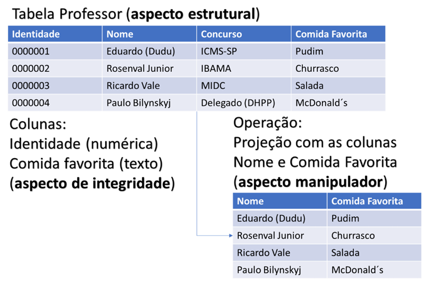
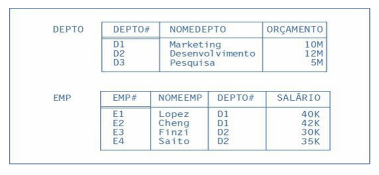
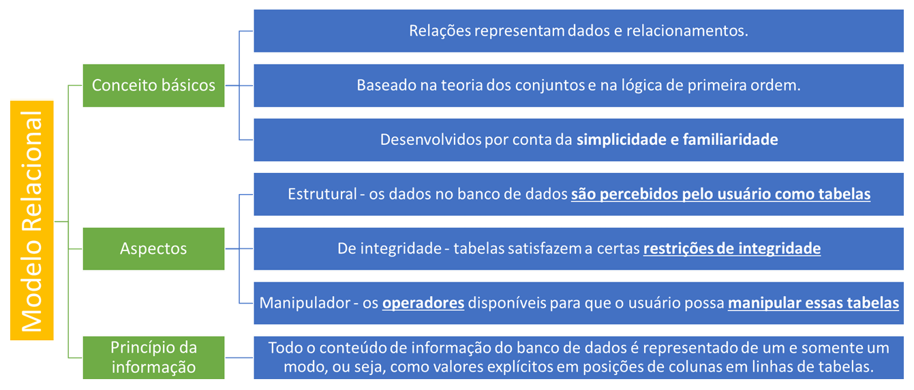
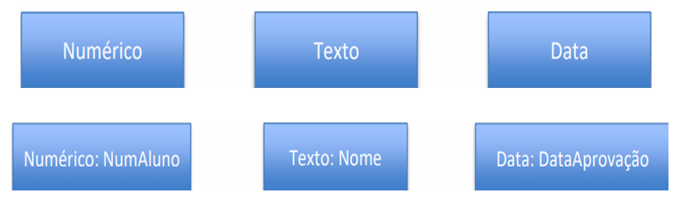
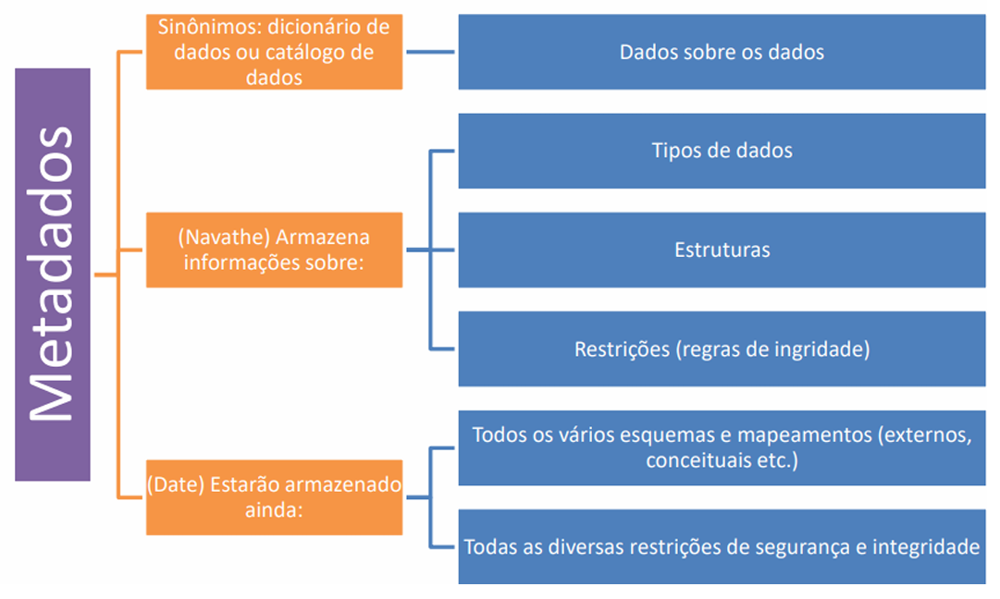
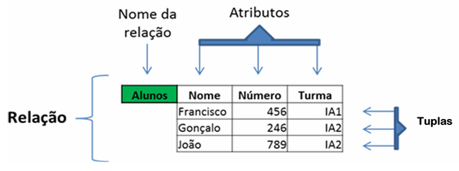
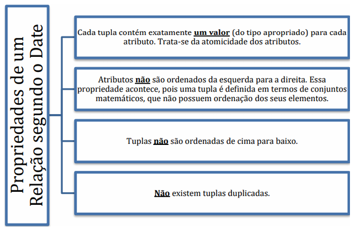
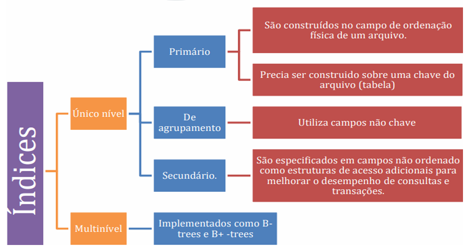
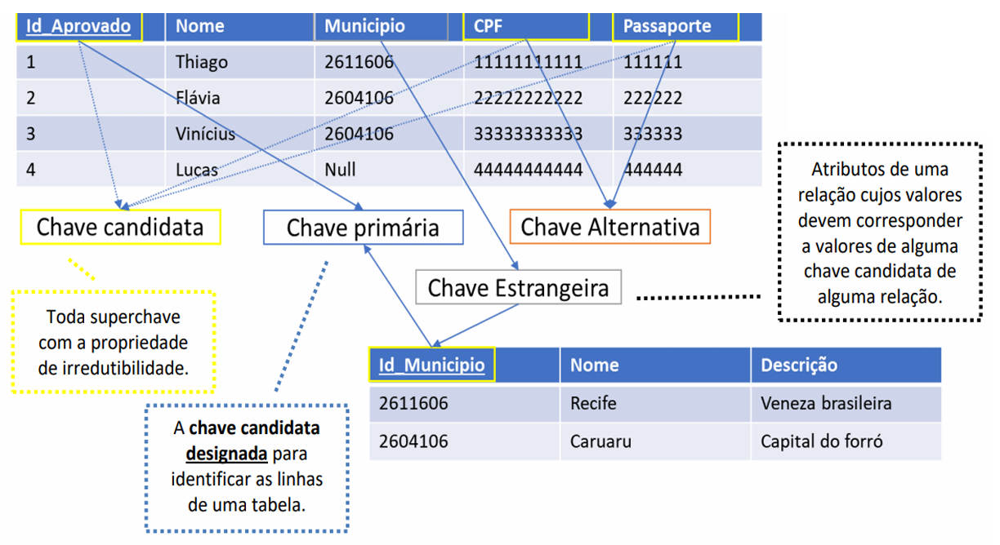
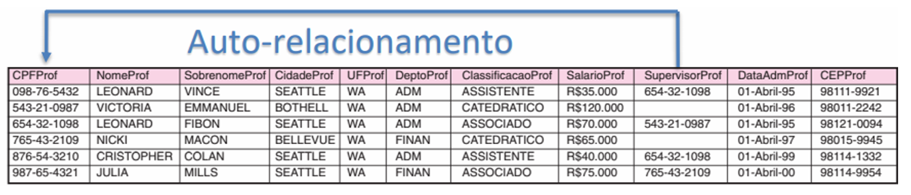

# Capítulo 10 – Modelo Relacional: Conceitos Básicos

O modelo relacional, como conhecemos hoje, surgiu a partir de uma proposta revolucionária do matemático britânico **Edgar Frank Codd**, em 1970. Trabalhando como pesquisador na IBM, Codd publicou um artigo seminal intitulado **"A Relational Model of Data for Large Shared Data Banks"**, no qual propôs uma forma completamente nova de representar e manipular dados em bancos de dados.

Até então, os principais modelos existentes — como o **modelo hierárquico** e o **modelo em rede** — estruturavam os dados de forma mais próxima da realidade física, baseando-se em caminhos fixos, relações pai-filho e ponteiros explícitos. Esses modelos, apesar de funcionais, apresentavam limitações em termos de flexibilidade, abstração e independência de dados. Foi nesse contexto que a proposta de Codd se destacou: sua ideia era organizar os dados de forma **estritamente lógica**, fundamentada na **teoria dos conjuntos** e na **lógica de predicados de primeira ordem**.

Na prática, Codd sugeriu que todas as informações de um banco de dados pudessem ser organizadas em **relações**, ou seja, **tabelas**. Esse formato tabular é extremamente intuitivo e, por isso, ganhou rápida aceitação. Afinal, tabelas são estruturas familiares a praticamente qualquer pessoa que tenha lidado com planilhas, formulários ou relatórios. Assim, o modelo relacional aliou **simplicidade e acessibilidade** à **precisão formal**, uma combinação poderosa que o tornou o padrão dominante nos SGBDs (Sistemas de Gerenciamento de Banco de Dados) até os dias atuais.

É interessante observar que, inicialmente, a própria IBM foi resistente à ideia de Codd. Na época, a empresa obtinha grandes lucros com o IMS/DB, um sistema hierárquico, e não via com bons olhos a substituição de seu produto por uma tecnologia ainda experimental. No entanto, a proposta de Codd se mostrou tão sólida e promissora que outras iniciativas — como os projetos **Ingres** e **Oracle** — abraçaram o modelo relacional e o transformaram em realidade comercial.

## Características Estruturais do Modelo Relacional

O modelo relacional é baseado em três pilares fundamentais: a **estrutura lógica dos dados**, as **regras de integridade** e os **métodos formais de manipulação**. Esses três aspectos definem o comportamento e a organização de qualquer banco de dados relacional.

<div align="center">
  
</div>

O aspecto da **estrutura** dos dados é composto por **relações**, que nada mais são do que **tabelas** com colunas e linhas. Cada **coluna** representa um **atributo** (ou campo), enquanto cada **linha** representa uma **tupla** (ou registro). Em termos formais, cada tabela representa um conjunto de tuplas do mesmo tipo, e cada atributo é associado a um **domínio de valores permitidos**.

O aspecto **de integridade** refere-se às **restrições** que garantem que os dados armazenados sejam consistentes, válidos e coerentes com as regras do negócio. Essas restrições podem ser de domínio (valores válidos para uma coluna), de unicidade (como chaves primárias), de referência (como chaves estrangeiras) e de veracidade lógica.

O aspecto **manipulador** é representado pela **álgebra relacional**, um conjunto de operadores formais que permitem derivar novas tabelas a partir de tabelas existentes. Os operadores mais conhecidos incluem **seleção**, **projeção**, **junção**, **união** e **diferença**. Todos esses operadores seguem a lógica da teoria dos conjuntos, garantindo uma base matemática consistente.

Um ponto importante do modelo relacional é que ele opera com **estruturas lógicas**, e não físicas. Isso significa que, para o usuário, os dados são sempre apresentados na forma de tabelas, mesmo que, no nível físico, eles estejam armazenados com o uso de arquivos indexados, blocos encadeados, hashing ou outras estruturas complexas. Essa separação entre o **nível lógico** e o **nível físico** oferece uma poderosa **abstração de dados**, permitindo que o sistema otimize o desempenho internamente, sem comprometer a visão do usuário.

Outro conceito essencial é o **Princípio da Informação**, definido por Codd:

> “Todo o conteúdo informacional de um banco de dados deve ser representado de um e somente um modo: como valores explícitos em colunas de linhas de tabelas.”

Esse princípio elimina o uso de ponteiros ou links físicos entre registros. Em vez disso, as conexões entre diferentes tabelas são feitas por **valores comuns**, como chaves primárias e estrangeiras. Por exemplo, em um banco de dados com uma tabela EMPREGADO (`EMP`) e outra DEPARTAMENTO (`DEPTO`), a relação entre um empregado e seu departamento é estabelecida pela presença de um código de departamento (`DEPTO#`) na tabela EMPREGADO que corresponde a um registro na tabela DEPARTAMENTO.

<div align="center">
  
</div>

Essa abordagem garante que todas as associações entre os dados sejam **explicitamente representadas** e facilmente compreensíveis, o que torna o modelo relacional altamente transparente e confiável.

<div align="center">
  
</div>

## Formalização Teórica: Tipos, Relações, RelVars e Operadores

Embora o modelo relacional tenha uma aparência simples — tabelas com linhas e colunas — ele é sustentado por uma estrutura conceitual formal bastante rigorosa. Segundo **C.J. Date**, essa estrutura pode ser dividida em cinco componentes principais:

- Uma coleção ilimitada de **tipos escalares**, que definem os domínios de valores possíveis para os atributos.
- Um **gerador de tipos de relação**, que especifica os atributos e seus tipos para cada tabela.
- A definição de **RelVars** (variáveis de relação), que armazenam os estados das tabelas.
- Um **operador de atribuição relacional**, que modifica os conteúdos das RelVars.
- Um conjunto de **operadores relacionais**, que compõem a álgebra relacional.

Vamos analisar cada um desses pontos com mais detalhes.

Os **tipos escalares** representam os domínios possíveis de valores. Os tipos mais comuns são os numéricos (inteiro, real), caracteres (texto), datas, booleanos e, em muitos casos, o valor especial **NULL**, usado para indicar ausência ou desconhecimento. Contudo, o modelo permite também a criação de **tipos definidos pelo usuário**, com restrições específicas, que é o motivo do porque existe uma coleção "ilimitada" de tipos. Por exemplo, é possível definir um tipo `Nota` com valores inteiros de 0 a 10, garantindo que nenhuma nota fora desse intervalo seja aceita.

<div align="center">
  
</div>

Com os tipos definidos, podemos construir **tipos de relação**, ou seja, os esquemas das tabelas. Um tipo de relação é um conjunto de pares nome-tipo, como no exemplo abaixo. A partir desse tipo, definimos uma **RelVar** (variável de relação), que armazena os dados reais da tabela. Essa RelVar pode mudar ao longo do tempo conforme inserimos, alteramos ou removemos registros.

<div align="center">
  
</div>

A **atribuição relacional** é o mecanismo que permite atualizar o conteúdo das RelVars. Por exemplo:

```
ALUNO := ALUNO + (003, 'Joana', 2024)
```

Essa operação indica que estamos adicionando uma nova linha à RelVar `ALUNO`. Assim como nas linguagens de programação, o operador `:=` simboliza uma atribuição de valor à variável.

Por fim, temos os **operadores relacionais**, que formam a **álgebra relacional**. Essa álgebra fornece as ferramentas para consultar e transformar dados. Cada operador toma uma ou mais relações como entrada e devolve uma nova relação como resultado. Os operadores fundamentais incluem:

- **Seleção (σ)**: filtra as linhas de uma relação com base em uma condição;
- **Projeção (π)**: seleciona colunas específicas;
- **Junção (⋈)**: combina duas relações com base em atributos comuns;
- **União (∪)**, **interseção (∩)** e **diferença (-)**: operações de conjuntos aplicadas a relações compatíveis;
- **Renomeação (ρ)**: permite alterar nomes de atributos ou relações.

Esses operadores serão aprofundados nos próximos capítulos, quando estudarmos a álgebra relacional e a linguagem SQL. Por enquanto, o importante é compreender que eles oferecem uma forma **formal, consistente e poderosa** de manipular os dados.

## Catálogo de Dados e Metadados

Para que um SGBD funcione adequadamente, ele precisa conhecer a estrutura do banco de dados que está gerenciando. Essa estrutura é mantida no **catálogo de dados**, também conhecido como **dicionário de dados** ou **metadados**.

<div align="center">
  
</div>

O catálogo é um banco de dados interno que armazena informações sobre:

- As tabelas existentes (RelVars);
- Os atributos e seus tipos;
- As chaves primárias e estrangeiras;
- As restrições de integridade;
- Os índices e estruturas de acesso;
- Os usuários e permissões de acesso;
- Os esquemas lógicos e físicos;
- Os mapeamentos entre os níveis conceitual, externo e interno.

Essas informações são usadas por vários componentes do sistema. Por exemplo, o **otimizador de consultas** usa dados do catálogo para decidir qual é o melhor plano de execução para uma determinada consulta. O **subsistema de segurança** utiliza as informações do catálogo para autorizar (ou não) os comandos dos usuários. O **gerenciador de armazenamento** recorre ao catálogo para localizar os blocos físicos onde os dados estão guardados.

Em resumo, o catálogo é **a memória organizacional do SGBD**. Sem ele, o sistema seria incapaz de interpretar os comandos SQL, validar os dados ou garantir a integridade do banco. Embora o catálogo seja invisível para o usuário comum, ele é tão essencial quanto os próprios dados — e pode, inclusive, ser consultado diretamente por meio de comandos SQL em sistemas compatíveis com o padrão `INFORMATION_SCHEMA`.

## Tabelas

Dentro do modelo relacional, o elemento central para a representação e organização dos dados é a **tabela**. É por meio dela que as informações são armazenadas, manipuladas e acessadas. Cada tabela representa uma **relação**, no sentido matemático do termo, e contém dois componentes básicos: **colunas**, também chamadas de **atributos**, e **linhas**, conhecidas como **tuplas**. Vamos entender em profundidade o papel de cada um desses elementos.

Cada **coluna** representa um **atributo**, ou seja, uma propriedade que caracteriza os elementos descritos na tabela. Já cada **linha** descreve uma **tupla**, isto é, um conjunto de valores relacionados que juntos formam uma instância da entidade representada. No contexto de um banco de dados de alunos, por exemplo, poderíamos ter atributos como `Nome`, `Número` e `Turma`, e cada tupla seria responsável por registrar os dados de um aluno específico.

<div align="center">
  
</div>

Note que a tabela exibe, de forma tabular, um conjunto de linhas e colunas. Cada linha representa um aluno — como Francisco, na primeira linha — enquanto cada coluna corresponde a um atributo associado a esses alunos. Mesmo sem termos acesso à definição formal da tabela, já é possível inferir que a coluna `Número` contém valores numéricos, enquanto `Nome` armazena sequências de caracteres. Isso nos remete a um aspecto fundamental das tabelas relacionais: **cada atributo está associado a um domínio**.

Um **domínio** é um **conjunto de valores atômicos válidos** para um determinado atributo. Os valores atômicos são indivisíveis do ponto de vista da modelagem relacional. Assim, um atributo `Salário`, por exemplo, pode ser definido como pertencente ao domínio dos números decimais positivos, com um formato específico (por exemplo, até 10 dígitos, com duas casas decimais), e ainda indicar que os valores estão expressos em reais (R$). O domínio define tanto o **tipo de dado** quanto as **características semânticas** e **restrições adicionais**.

É importante destacar que a atomicidade dos domínios é uma **exigência fundamental do modelo relacional**. Isso significa que não se deve, por exemplo, armazenar múltiplos telefones em uma mesma célula ou registrar um endereço inteiro (rua, número, cidade, estado) em uma única coluna sem decomposição adequada.

Além disso, o modelo relacional pressupõe que cada tabela seja definida a partir de um **esquema relacional** — ou seja, uma estrutura que especifica os nomes e os tipos dos atributos. Quando uma tabela é preenchida com dados, cada linha (ou tupla) é considerada uma **instância** dessa relação. O conjunto de instâncias possíveis está vinculado à definição do esquema, que atua como um molde, ou “forma de bolo”, determinando quais informações devem ser fornecidas para cada tupla.

Uma **tupla**, portanto, é um conjunto de pares `{atributo: valor}`, onde cada valor pertence ao domínio do respectivo atributo. Mais formalmente, podemos representá-la como um conjunto de **triplas ordenadas**, como no exemplo a seguir:

```
TUPLA {NOME:CARACTER:THIAGO, CARGO:CARACTER:PROFESSOR}
```

Aqui, o componente `NOME:CARACTER:THIAGO` é uma **tripla**, formada pelo nome do atributo, o tipo de dado e o valor específico. A quantidade de atributos de uma tupla é chamada de **grau** ou **aridade**. No exemplo acima, o grau da tupla é 2, pois temos dois atributos.

O conjunto de nomes e tipos de todos os atributos forma o que chamamos de **cabeçalho** da tabela. Ele determina a estrutura que todas as tuplas devem obedecer. É interessante observar que, segundo **C.J. Date**, cada tupla deve obedecer a certas **propriedades matemáticas**, derivadas diretamente das definições formais do modelo relacional:

- **(a)** Cada tupla deve conter exatamente **um valor** para cada atributo definido no cabeçalho.
- **(b)** As tuplas são **conjuntos** de pares atributo-valor, e, como tal, **não possuem ordenação interna** entre seus componentes. Isso significa que, conceitualmente, a ordem dos atributos em uma tupla não importa.
- **(c)** Cada **subconjunto de uma tupla** também pode ser considerado uma tupla. Isso inclui, inclusive, o **subconjunto vazio**, conhecido como **tupla vazia** ou **0-tupla**, que representa uma instância sem nenhum dado.

Contudo, vale um alerta importante: **há divergência na literatura** sobre a questão da ordenação dos atributos em uma tupla. Codd, em sua proposta original, sustentava que a ordem dos atributos era **significativa**, o que implica que a posição da coluna teria impacto semântico. Elmasri e Navathe, por sua vez, também admitem essa ideia, afirmando que uma tupla é uma **lista ordenada** de valores. No entanto, os próprios autores reconhecem que, em um nível mais abstrato, essa ordenação pode ser desconsiderada, desde que a correspondência entre atributos e valores seja mantida.

Essas diferenças teóricas refletem as variações entre o modelo **relacional teórico** e as **implementações práticas** nos SGBDs comerciais. Nas ferramentas atuais, por exemplo, a ordenação das colunas e linhas é visível e muitas vezes manipulável pelo usuário — mas essa ordenação é **apenas de apresentação**, e não de conteúdo.

Esse contraste nos leva a outra distinção relevante: a diferença entre o **conceito de relação** e o de **tabela**, como ilustrado no quadro a seguir:

|Característica|Relação (modelo teórico)|Tabela (implementação prática)|
|---|---|---|
|Nomes de tipo aparecem no cabeçalho|Sim|Não (normalmente)|
|Tipos e nomes aparecem no corpo|Sim|Não|
|Ordem de colunas importa|Não|Sim|
|Ordem de linhas importa|Não|Sim|
|Permite duplicação de tuplas|Não|Sim|

Em resumo, enquanto as **relações** são entidades matemáticas puras, baseadas em conjuntos e com regras formais rigorosas, as **tabelas** são estruturas concretas que os SGBDs exibem aos usuários. Essa distinção é essencial para compreender o modelo relacional de forma completa. 

Vale a pena reforçar as propriedades de uma relação:

<div align="center">
  
</div>

## Visões: Tabelas Virtuais e Suas Aplicações

As **visões**, também chamadas de **views**, são um recurso fundamental no contexto de bancos de dados relacionais. Elas funcionam como **consultas nomeadas** que podem ser reutilizadas como se fossem tabelas. No entanto, ao contrário das tabelas físicas, **não armazenam dados diretamente** – por isso são frequentemente chamadas de **tabelas virtuais**.

Uma visão é criada por meio do comando SQL `CREATE VIEW`, seguido de uma consulta `SELECT`. O resultado dessa consulta é “empacotado” com um nome e pode ser acessado como se fosse uma tabela comum. Isso traz inúmeras vantagens.

A primeira delas é a **facilitação da visualização de dados**. Muitas vezes, os dados necessários para determinada aplicação ou relatório estão dispersos entre diversas tabelas. Ao criar uma visão, podemos unir essas informações de forma clara, lógica e coesa, oferecendo ao usuário uma estrutura mais intuitiva para consulta.

Outra função crucial das visões é o **controle de acesso e segurança**. Através de views, é possível **restringir a exposição dos dados**, permitindo que determinados usuários visualizem apenas colunas ou registros específicos, conforme sua função ou nível de permissão. Assim, evita-se o acesso direto às tabelas completas, protegendo informações sensíveis.

Além disso, as visões podem ser usadas para **sumarizar informações** e **criar relatórios**, aplicando agrupamentos e funções agregadas. Abaixo, temos um exemplo de criação de uma visão que exibe apenas os professores da disciplina de Informática:

```sql
CREATE VIEW profs_ti AS
SELECT pf.primeironome, pf.ultimonome, pf.telefone, pf.email
FROM professores pf
NATURAL JOIN disciplina d
WHERE d.nome = 'Informática';
```

Uma vez criada, essa visão pode ser consultada normalmente, como em:

```sql
SELECT * FROM profs_ti;
```

Como mencionamos, as visões **não existem fisicamente no disco**, exceto durante sua execução. Porém, alguns SGBDs suportam o conceito de **visões materializadas** (**materialized views**), que armazenam os resultados da consulta em disco com o objetivo de otimizar o desempenho. Essas visões são especialmente úteis quando as consultas são muito complexas ou os dados são acessados com frequência.

Um aspecto importante é a **possibilidade de manipulação de dados** a partir das visões. Se uma visão for criada a partir de uma única tabela, sem funções agregadas, agrupamentos ou junções complexas, ela é chamada de **visão simples** e, em muitos SGBDs, permite inserções, atualizações e deleções. Já as **visões complexas**, criadas a partir de múltiplas tabelas, com subconsultas, `GROUP BY` ou `HAVING`, não permitem esse tipo de manipulação direta, pois seria impossível refletir essas operações com segurança nas tabelas subjacentes.

Portanto, as visões representam uma ferramenta poderosa para **abstração de dados**, **segurança**, **customização da apresentação** e, em certos casos, **otimização de desempenho**. Entender suas limitações e potencialidades é essencial para um projeto de banco de dados bem-sucedido. Em resumo:

<div align="center">
  
</div>

## Índices: Agilidade no Acesso aos Dados

Em sistemas de banco de dados, **índices** são estruturas auxiliares criadas para **melhorar a velocidade de acesso** aos dados. Assim como os índices de um livro ajudam a localizar rapidamente uma informação, os índices em um SGBD reduzem drasticamente o tempo necessário para encontrar registros com base em valores específicos.

Um **índice** é construído sobre um ou mais atributos de uma tabela e associa os **valores desses atributos a posições físicas** no arquivo de dados — normalmente, apontando para blocos de disco. Cada entrada de índice contém um **valor de chave** e um **ponteiro** para o local correspondente no arquivo de dados. Esse par valor/ponteiro é conhecido como **registro de índice** ou **entrada de índice**.

Veja abaixo uma ilustração conceitual do funcionamento de um índice:

<div align="center">
  
</div>

Existem dois tipos principais de índices:

- **Índices densos**: possuem uma entrada para **cada registro** da tabela. Como consequência, proporcionam acesso mais rápido, porém requerem mais espaço de armazenamento e atualizações constantes.
- **Índices esparsos**: possuem entradas apenas para **alguns registros**, geralmente um por bloco de dados. São mais leves, mas exigem leitura adicional para localizar registros específicos.

Além disso, os índices podem ser classificados de acordo com sua função:

- **Primários**: definidos sobre a **chave primária** da tabela. Em geral, são implementados automaticamente pelo SGBD.
- **Secundários**: criados sobre outros atributos não únicos.
- **Clusterizados** (**clustering indexes**): organizam os registros da tabela fisicamente com base no valor do índice.
- **Não clusterizados**: mantêm os dados em ordem independente.

Os índices ainda podem ser classificados como:

<div align="center">
  
</div>

A criação de um índice pode beneficiar significativamente as operações de **busca, ordenação e junção**. No entanto, é preciso avaliar seus efeitos sobre a **inserção, remoção e atualização** de dados, pois toda alteração na tabela exige atualização do índice, o que pode gerar **sobrecarga de desempenho**.

Diversos SGBDs oferecem ferramentas para **análise de desempenho dos índices**, recomendando quando devem ser criados ou removidos. Em geral, os índices devem ser utilizados com critério, focando nas colunas mais consultadas e em tabelas com grande volume de dados.

## Chaves e Relacionamentos: Garantindo a Integridade

No modelo relacional, os conceitos de **chaves** e **relacionamentos** são fundamentais para garantir a **unicidade, integridade e consistência dos dados**. Vamos entender as principais definições envolvidas.

### Superchave, Chave Candidata e Chave Primária

Uma **superchave** é qualquer conjunto de atributos que permite identificar **unicamente** cada tupla de uma tabela. Em outras palavras, não podem existir duas linhas com os mesmos valores para todos os atributos da superchave. Como exemplo, considere que o conjunto completo de colunas de uma tabela é sempre uma superchave, já que nenhuma linha pode ser repetida.

Entre todas as superchaves possíveis, destacamos aquelas que são **mínimas**, ou seja, que não podem ter nenhum atributo removido sem perder a propriedade de unicidade. Essas são chamadas de **chaves candidatas**. Em uma tabela, pode haver várias chaves candidatas.

Dentre as chaves candidatas, escolhemos **uma** para ser a **chave primária** (ou primary key) da tabela. Essa chave será utilizada pelo SGBD para organizar os registros e garantir o acesso eficiente. As demais chaves candidatas que não forem escolhidas são chamadas de **chaves alternativas**.

Considere a tabela `APROVADOS` da figura a seguir. Podemos identificar como possíveis chaves candidatas os atributos `Id_Aprovado`, `CPF` e `Passaporte`. Escolhendo `Id_Aprovado` como chave primária, os demais se tornam chaves alternativas.

<div align="center">
  
</div>

Uma **chave primária** deve satisfazer as propriedades de:

- **Unicidade**: cada valor deve ser exclusivo.
- **Não nulidade**: os valores da chave primária **nunca podem ser nulos**.

Um **atributo primário** é qualquer atributo que pertence a uma chave candidata. Já um **atributo não primário** é aquele que **não participa** de nenhuma chave candidata da tabela.

### Chave Estrangeira e Integridade Referencial

A **chave estrangeira** (ou foreign key) é o mecanismo utilizado para **representar relacionamentos entre tabelas**. Ela consiste em um ou mais atributos de uma tabela que fazem referência à **chave primária** de outra tabela — ou da mesma, no caso de autorrelacionamento.

Por exemplo, na tabela `APROVADOS`, o atributo `Municipio` é uma chave estrangeira que se refere à chave primária `Id_Municipio` da tabela `MUNICIPIO`. Assim, espera-se que todo valor presente na coluna `Municipio` exista previamente como chave na tabela de destino. Caso contrário, ocorrerá **violação da integridade referencial**.

Chaves estrangeiras devem sempre obedecer ao seguinte:

- Ter o **mesmo tipo de dado** da chave a que se referem.
- Garantir que seus valores estejam entre os valores válidos da tabela referenciada ou sejam **nulos** (caso o relacionamento seja opcional).

A integridade referencial assegura que os **dados relacionados entre tabelas permaneçam consistentes**. Se você tentar inserir um valor inexistente em uma chave estrangeira, o SGBD rejeitará a operação — a menos que o campo aceite nulos.

### Autorrelacionamentos

Em alguns casos, uma tabela pode manter um relacionamento **consigo mesma**. Esses são os chamados **autorrelacionamentos** ou **relacionamentos recursivos**. Eles são menos comuns, mas extremamente úteis em certas modelagens.

Um exemplo clássico é o de uma tabela `PROFESSOR` em que um professor pode **supervisionar outros professores**. O campo `Supervisor` seria uma chave estrangeira que aponta para o atributo `Id_Professor` da **mesma tabela**. Essa estrutura permite modelar hierarquias e relações internas com elegância e sem redundância. Veja um exemplo:

<div align="center">
  
</div>

A representação recursiva permite, portanto, que as entidades **desempenhem múltiplos papéis** dentro da mesma relação — como chefe e subordinado, professor e orientando, cliente e fiador, entre outros.

## Considerações Finais

Neste capítulo, exploramos os principais fundamentos do **modelo relacional**, um dos pilares da moderna tecnologia de bancos de dados. Apresentamos sua origem, estrutura conceitual e formal, os componentes essenciais como **tabelas, atributos, tuplas e domínios**, além de discutirmos os conceitos de **visões, índices e chaves**.

Compreender esses elementos é essencial para projetar e manipular bancos de dados de forma eficiente, garantindo integridade, desempenho e clareza nos relacionamentos entre os dados. O modelo relacional não apenas se destaca por sua simplicidade e robustez, mas também por oferecer uma base matemática sólida, sustentada pela teoria dos conjuntos e pela lógica de predicados.
