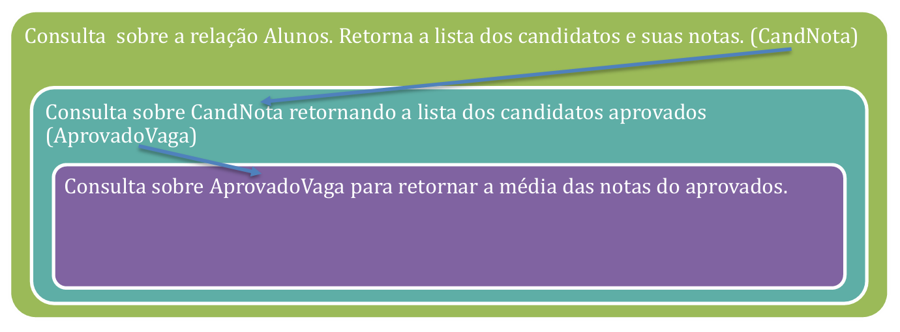
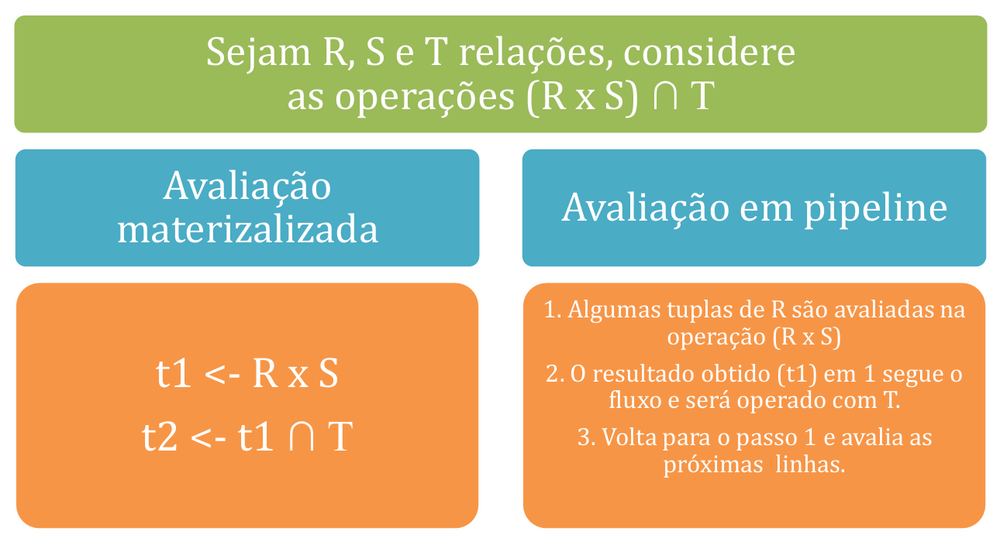
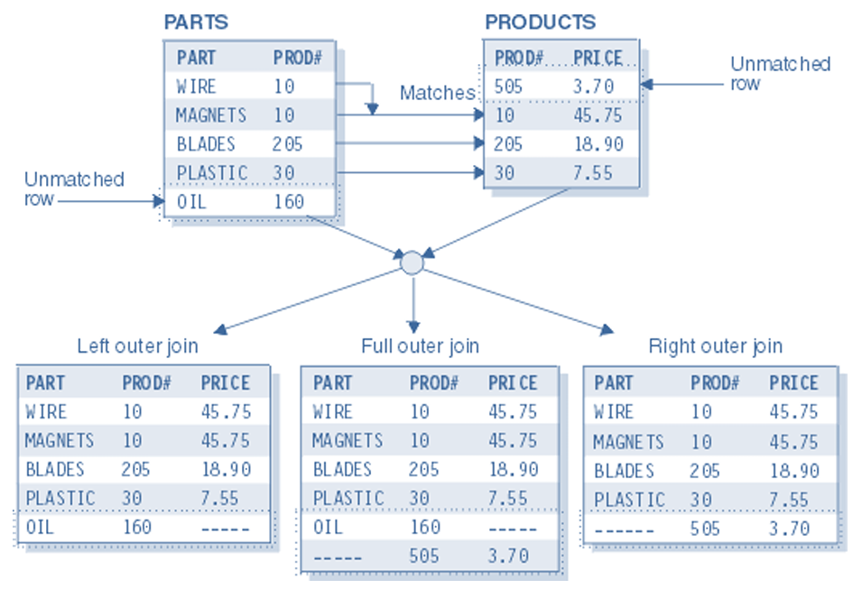
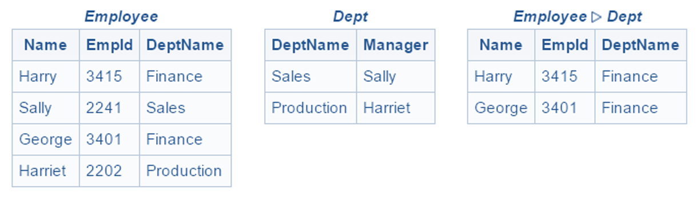
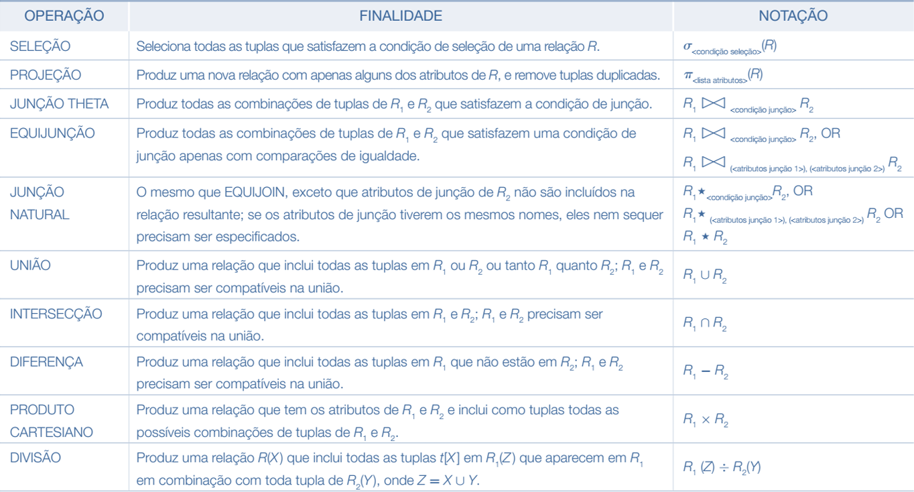

# Capítulo 12 – Modelo Relacional: Álgebra Relacional

## Fundamentos e Propósito da Álgebra Relacional

A álgebra relacional constitui o **conjunto de operações fundamentais** do modelo relacional. Sua função principal é permitir que usuários especifiquem consultas ou transformações sobre dados por meio de **expressões bem definidas e formalmente fundamentadas**. Tais expressões operam sobre relações (isto é, tabelas), e sempre produzem **novas relações como resultado**, respeitando a estrutura tabular do modelo relacional.

Embora muitos usuários finais interajam com os bancos de dados usando linguagens de alto nível como o SQL, os **conceitos fundamentais da álgebra relacional permanecem presentes e ativos**. Internamente, os sistemas de gerenciamento de banco de dados (SGBDs) utilizam esses operadores como base para **implementação e otimização de consultas**, gerando planos de execução eficientes a partir das expressões formuladas pelo usuário.

Segundo Ramez Elmasri e Shamkant Navathe, a álgebra relacional cumpre três papéis principais:

- **Proporciona a base formal** do modelo relacional, oferecendo um conjunto de operadores matemáticos bem definidos.
- Serve como **referência teórica para otimização e transformação de consultas** nos SGBDs.
- Inspira **recursos incorporados na linguagem SQL padrão**, como `SELECT`, `JOIN`, `WHERE` e `GROUP BY`.

Além disso, vale destacar que a álgebra relacional é acompanhada por outra linguagem formal, o **cálculo relacional**, que adota uma abordagem declarativa. A álgebra, por sua vez, é **procedural**, pois especifica como o resultado deve ser construído por meio de uma sequência de operações.

## Estrutura e Classificação das Operações

As operações da álgebra relacional podem ser divididas em dois grandes grupos:

- **Operações herdadas da teoria de conjuntos**, como união, interseção, diferença e produto cartesiano.
- **Operações próprias do modelo relacional**, como seleção, projeção, junção e renomeação.

Cada operação recebe como entrada uma ou duas relações e retorna **sempre outra relação**. Esse comportamento, chamado de **propriedade de fechamento**, é uma das características mais importantes da álgebra relacional. Ele permite que os resultados intermediários de uma operação possam ser imediatamente utilizados como entrada de outra, formando **encadeamentos de operações**.

A figura abaixo ilustra essa propriedade:

  

Note que, no exemplo da figura, a consulta inicial gera uma nova relação chamada `CandNota`, a qual pode ser imediatamente utilizada em uma segunda operação para extrair apenas os candidatos aprovados. Isso demonstra como a álgebra relacional favorece **operações compostas**, em que o resultado de uma operação serve como entrada para outra.

## Estratégias de Avaliação de Operações

Dado que a álgebra relacional permite a construção de **expressões complexas compostas por múltiplas operações**, é necessário considerar **como essas expressões são avaliadas**. Há duas estratégias principais de avaliação, cada uma com vantagens específicas:

### Avaliação Materializada

Na avaliação materializada, cada operação da expressão algébrica é executada separadamente, e o resultado é **armazenado temporariamente** para servir de entrada à próxima operação. Esse método, embora simples e padronizado, pode implicar em **uso excessivo de memória e disco**, especialmente quando as relações intermediárias são grandes.

Por exemplo, suponha que uma projeção extraia 10.000 linhas de uma tabela original. Essa relação intermediária é armazenada e, posteriormente, filtrada por uma seleção. Mesmo que o resultado final contenha apenas 100 linhas, a relação com 10.000 registros terá sido mantida em memória temporária.

### Avaliação em Pipeline

A avaliação em pipeline, por outro lado, evita a materialização de resultados intermediários. Cada tupla gerada por uma operação é **imediatamente repassada** para a próxima operação na sequência. Essa abordagem é mais eficiente em termos de **uso de recursos e tempo de resposta**, especialmente quando o número de registros envolvidos é alto.

A figura a seguir compara graficamente essas duas estratégias:

  

É importante ressaltar que a escolha entre avaliação materializada ou em pipeline **não é feita pelo usuário final**, mas sim pelo otimizador do SGBD. O sistema avalia o melhor plano de execução com base no volume de dados, índices disponíveis, recursos de hardware, estatísticas de cardinalidade e outras heurísticas.

## Tipos de Operações: Unárias e Binárias

Outra forma de classificar as operações da álgebra relacional é conforme o **número de relações** sobre as quais operam. Assim, temos:

- **Operações unárias**: operam sobre uma única relação.
    - Seleção (σ)
    - Projeção (π)
    - Renomeação (ρ)
- **Operações binárias**: exigem duas relações como entrada.
    - União (∪)
    - Interseção (∩)
    - Diferença (−)
    - Produto cartesiano (×)
    - Junção (⨝)
    - Divisão (÷)

Além dessa classificação, algumas operações são consideradas **fundamentais**, pois podem ser combinadas para formar todas as demais. As operações fundamentais da álgebra relacional são:

- Seleção
- Projeção
- União
- Diferença
- Produto Cartesiano
- Renomeação

Com essas operações fundamentais, é possível simular o comportamento de junções, interseções e até da divisão relacional.

## Observações Iniciais Importantes

Antes de explorarmos cada operação individualmente, é essencial lembrar de alguns **conceitos estruturais fundamentais**:

- **As relações de entrada e saída sempre respeitam o modelo relacional**: não há duplicatas, os dados são atômicos, não há ordenação entre as tuplas e os atributos possuem nomes únicos.
- **O domínio de cada atributo deve estar bem definido**: ou seja, cada coluna da tabela aceita apenas valores válidos de um tipo específico.
- **A propriedade de fechamento é mantida em todas as operações**: isso garante que qualquer resultado intermediário pode ser tratado como uma nova relação.
- **A álgebra relacional é puramente teórica, mas serve de base para a linguagem SQL**: embora SQL seja uma linguagem declarativa e prática, suas operações são, conceitualmente, inspiradas na álgebra.

## A Operação de Seleção (σ)

A primeira das operações unárias da álgebra relacional que vamos explorar é a **seleção**, representada pela letra grega sigma (σ). Trata-se de uma das operações mais simples e intuitivas do modelo relacional, cujo objetivo é **filtrar tuplas** (ou linhas) de uma relação, com base em um **predicado lógico** aplicado aos atributos da tabela. Em outras palavras, a seleção permite **recuperar somente os registros que satisfazem determinadas condições**.

Imagine que você possua uma tabela com centenas ou milhares de registros de clientes, funcionários ou produtos. Naturalmente, nem sempre será necessário acessar todos os dados. Muitas vezes, deseja-se recuperar apenas aqueles que atendem a critérios específicos, como clientes com idade acima de 60 anos, funcionários lotados em determinada filial ou produtos cujo estoque está abaixo do limite mínimo. É exatamente esse o propósito da operação de seleção.

### Notação Formal

A sintaxe geral da operação de seleção é a seguinte:

σcondição(R)

Onde:

- **σ** é o símbolo que representa a operação de seleção;
- **condição** é o predicado lógico que define os critérios para seleção das tuplas;
- **R** é o nome da tabela sobre a qual a operação será executada.

O resultado da seleção é **uma nova relação**, composta apenas pelas tuplas que **atendem à condição** especificada. Importante: todas as colunas da relação original são mantidas, mas apenas algumas linhas são selecionadas.

### Exemplo 1 – Selecionando com base em uma condição simples

Vamos considerar a seguinte tabela com dados sobre a distribuição de petróleo e gás natural no mundo, por regiões:

|REGIAO|DISTRIBUICAODEPETROLEO (%)|DISTRIBUICAODEGAS (%)|
|---|---|---|
|América do Norte|3,5|5,0|
|América Latina|13,0|6,0|
|Europa|2,0|3,6|
|Ex-União Soviética|6,3|38,7|
|Oriente Médio|64,0|33,0|
|África|7,2|7,7|
|Ásia/Oceania|4,0|6,0|

Suponha que queiramos identificar **quais regiões concentram mais de 10% da distribuição mundial de petróleo**. A condição a ser aplicada é que o valor da coluna `DISTRIBUICAODEPETROLEO` seja maior ou igual a 10.

A consulta na álgebra relacional será expressa da seguinte forma:

σDISTRIBUICAODEPETROLEO ≥ 10(PETROLEOREGIAO)

O resultado desta operação será:

|REGIAO|DISTRIBUICAODEPETROLEO (%)|DISTRIBUICAODEGAS (%)|
|---|---|---|
|América Latina|13,0|6,0|
|Oriente Médio|64,0|33,0|

Observe que, embora a relação de entrada possua sete tuplas, apenas duas atendem ao critério especificado. Todas as colunas foram mantidas.

### Composição de Condições

Uma das grandes vantagens da seleção é a possibilidade de **compor predicados mais complexos** por meio de **conectivos lógicos**:

- ∧ (conjunção, "e")
- ∨ (disjunção, "ou")
- ¬ (negação, "não")

Os termos que compõem o predicado seguem a forma:

- \<atributo> operador \<constante>
- \<atributo> operador \<atributo>

Os **operadores relacionais** aceitos são: =, ≠, >, ≥, < e ≤.

### Exemplo 2 – Selecionando com base em valores numéricos

A seguir, temos a tabela `PROFESSOR`, que representa docentes de um curso preparatório:

|NOMEPROFESSOR|CPF|IDADE|DISCIPLINA|NATURALIDADE|
|---|---|---|---|---|
|DIEGO CARVALHO|111.111.111-11|21|INFORMÁTICA|DISTRITO FEDERAL|
|RENATO DA COSTA|222.222.222-22|54|INFORMÁTICA|RIO DE JANEIRO|
|RICARDO VALE|333.333.333-33|40|DIREITO CONSTITUCIONAL|MINAS GERAIS|
|ROSENVAL JÚNIOR|444.444.444-44|32|DIREITO AMBIENTAL|MINAS GERAIS|
|HERBERT ALMEIDA|555.555.555-55|19|DIREITO ADMINISTRATIVO|ESPÍRITO SANTO|

Suponha que desejamos consultar **apenas os professores com idade igual ou superior a 35 anos**. O predicado da consulta será IDADE ≥ 35, e a operação será:

σIDADE ≥ 35(PROFESSOR)

A nova relação retornada será:

|NOMEPROFESSOR|CPF|IDADE|DISCIPLINA|NATURALIDADE|
|---|---|---|---|---|
|RENATO DA COSTA|222.222.222-22|54|INFORMÁTICA|RIO DE JANEIRO|
|RICARDO VALE|333.333.333-33|40|DIREITO CONSTITUCIONAL|MINAS GERAIS|

### Exemplo 3 – Composição de predicados

Vamos agora compor um predicado mais complexo: professores com idade igual ou inferior a 45 **e** naturais de Minas Gerais.

A operação seria:

σIDADE ≤ 45 ∧ NATURALIDADE = "MINAS GERAIS"(PROFESSOR)

Resultado:

|NOMEPROFESSOR|CPF|IDADE|DISCIPLINA|NATURALIDADE|
|---|---|---|---|---|
|ROSENVAL JÚNIOR|444.444.444-44|32|DIREITO AMBIENTAL|MINAS GERAIS|

A operação de seleção, apesar de simples, é **uma das mais poderosas ferramentas** na construção de consultas relacionais. Ela permite **filtrar dados com precisão**, operando sempre sobre uma única tabela, sem alterar sua estrutura (as colunas permanecem as mesmas), mas reduzindo o número de tuplas de acordo com o critério definido.

Além disso, por estar **fechada no modelo relacional**, seu resultado pode ser reutilizado como entrada para qualquer outra operação da álgebra relacional, facilitando a **composição de expressões mais complexas**. Por isso, é comum vermos a seleção combinada com projeção, junção, renomeação ou outras operações nos planos de execução das consultas reais em SGBDs.

## A Operação de Projeção (π)

Dando continuidade ao estudo da álgebra relacional, vamos agora explorar a operação de **projeção**, representada pela letra grega **π (pi)**. Esta operação também recebe como entrada uma única relação (ou tabela), assim como a seleção, mas sua função é **focar nas colunas, e não nas linhas**.

A projeção permite **extrair apenas alguns atributos (colunas)** de uma relação, formando uma nova tabela que contém apenas os dados desejados. Essa operação é especialmente útil quando estamos interessados apenas em certos aspectos de uma entidade ou quando queremos evitar o processamento de atributos irrelevantes para uma consulta específica.

### Notação Formal

A notação da projeção é dada por:

πA1, A2, ..., Ak(R)

Onde:

- **π** representa a operação de projeção;
- **A1, A2, ..., Ak** são os atributos (colunas) que se deseja projetar;
- **R** é a relação (tabela) sobre a qual a operação será aplicada.

O resultado é uma nova relação contendo **apenas as colunas especificadas** e **sem duplicação de tuplas**. A álgebra relacional considera que o resultado da projeção deve ser um conjunto de tuplas, portanto, **não são permitidas repetições** — característica importante dessa operação.

### Exemplo 1 – Entendendo o conceito

Vamos usar novamente a tabela `PETROLEOREGIAO`, que relaciona regiões do mundo com a distribuição de petróleo e gás natural:

|REGIAO|DISTRIBUICAODEPETROLEO (%)|DISTRIBUICAODEGAS (%)|
|---|---|---|
|América do Norte|3,5|5,0|
|América Latina|13,0|6,0|
|Europa|2,0|3,6|
|Ex-União Soviética|6,3|38,7|
|Oriente Médio|64,0|33,0|
|África|7,2|7,7|
|Ásia/Oceania|4,0|6,0|

Suponha que queiramos **consultar apenas a região e o percentual de distribuição de petróleo**, ignorando a distribuição de gás natural. A operação de projeção seria expressa da seguinte forma:

πREGIAO, DISTRIBUICAODEPETROLEO(PETROLEOREGIAO)

O resultado será:

|REGIAO|DISTRIBUICAODEPETROLEO (%)|
|---|---|
|América do Norte|3,5|
|América Latina|13,0|
|Europa|2,0|
|Ex-União Soviética|6,3|
|Oriente Médio|64,0|
|África|7,2|
|Ásia/Oceania|4,0|

Observe que todas as linhas foram mantidas (nenhuma tupla foi descartada), mas a coluna `DISTRIBUICAODEGAS` foi suprimida da nova relação. Esse é exatamente o papel da projeção: **reduzir o número de atributos** para facilitar a análise ou preparar os dados para operações subsequentes.

### Exemplo 2 – Dados de professores

Tomemos agora como base a tabela `PROFESSOR`, que contém informações dos docentes de um curso preparatório:

|NOMEPROFESSOR|CPF|IDADE|DISCIPLINA|NATURALIDADE|
|---|---|---|---|---|
|DIEGO CARVALHO|111.111.111-11|21|INFORMÁTICA|DISTRITO FEDERAL|
|RENATO DA COSTA|222.222.222-22|54|INFORMÁTICA|RIO DE JANEIRO|
|RICARDO VALE|333.333.333-33|40|DIREITO CONSTITUCIONAL|MINAS GERAIS|
|ROSENVAL JÚNIOR|444.444.444-44|32|DIREITO AMBIENTAL|MINAS GERAIS|
|HERBERT ALMEIDA|555.555.555-55|19|DIREITO ADMINISTRATIVO|ESPÍRITO SANTO|

Vamos imaginar que o interesse seja apenas em **consultar os nomes e CPFs** dos professores. Nesse caso, a projeção será expressa por:

πNOMEPROFESSOR, CPF(PROFESSOR)

O resultado será:

|NOMEPROFESSOR|CPF|
|---|---|
|DIEGO CARVALHO|111.111.111-11|
|RENATO DA COSTA|222.222.222-22|
|RICARDO VALE|333.333.333-33|
|ROSENVAL JÚNIOR|444.444.444-44|
|HERBERT ALMEIDA|555.555.555-55|

A tabela acima representa uma **nova relação com menos atributos**, exatamente como esperado. Vale lembrar que, **se houver duplicação de tuplas** no resultado, a álgebra relacional elimina automaticamente essas duplicatas. Portanto, o conjunto de dados obtido por meio da projeção é sempre um **conjunto matematicamente válido**, sem repetições.

A operação de projeção é **fundamental na extração de atributos específicos** em uma consulta. Ela é muito usada em combinação com outras operações da álgebra relacional — como seleção, junção ou união — para construir **consultas mais robustas**.

Sua principal contribuição é a **redução da complexidade** da relação, eliminando colunas desnecessárias e garantindo que os dados retornados estejam concentrados apenas nos elementos de interesse para o analista ou aplicação.

## A Operação de Rename (Renomeação)

Dentre as operações fundamentais da álgebra relacional, a operação de **renomeação**, representada pela letra grega **ρ (rho)**, possui uma função bastante específica, mas extremamente útil em diversas situações práticas. Seu papel é **atribuir novos nomes tanto às relações quanto aos seus atributos**, possibilitando a reutilização de resultados intermediários, a construção de operações mais complexas e a resolução de ambiguidades.

### Para que serve a renomeação?

A necessidade de renomear relações e atributos pode surgir em pelo menos dois contextos importantes. O primeiro deles aparece quando se deseja **utilizar os resultados de uma operação em etapas subsequentes**, especialmente em operações compostas como **junções, uniões ou seleções encadeadas**. Ao renomear uma relação, podemos referenciar seu resultado como uma nova entidade, facilitando o encadeamento lógico das operações.

A segunda situação em que a renomeação é essencial está relacionada a operações de **autojunção (self-join)**, ou seja, quando comparamos uma tabela consigo mesma. Nesses casos, é preciso atribuir **nomes distintos para cada instância da relação**, a fim de evitar conflitos e ambiguidade na identificação dos atributos.

Se você já utilizou a linguagem SQL, provavelmente está familiarizado com o conceito de **alias**, que é justamente uma implementação do conceito de renomeação. Em SQL, usamos `AS` para renomear tabelas ou colunas temporariamente durante uma consulta. Na álgebra relacional, o operador ρ desempenha exatamente essa função.

### Notação Formal

A sintaxe geral da operação é expressa como:

ρx(A1, A2, ..., An)(E)

Onde:

- **ρ (rho)** indica a operação de renomeação;
- **x** é o novo nome atribuído à relação **E**;
- **A1, A2, ..., An** são os novos nomes atribuídos aos atributos da relação, na ordem correspondente aos atributos originais.

Caso se deseje renomear apenas a relação, sem alterar os nomes dos atributos, pode-se omitir a lista de atributos:

ρx(E)

### Exemplo 1 – renomeando relação e atributos

Vamos supor que temos a seguinte relação original:

STUDENT(NAME, PHONE)

Aplicando a operação de renomeação, poderíamos escrever:

ρestudante(nome, telefone)(STUDENT)

O resultado é uma nova relação chamada **estudante**, com os atributos **nome** e **telefone**, respectivamente. Essa nova forma pode ser útil, por exemplo, se quisermos deixar os nomes mais intuitivos ou adaptá-los a um idioma específico em um projeto.

### Exemplo 2 – atribuindo o resultado da renomeação

Suponha que você queira salvar essa nova relação para uso posterior. Neste caso, podemos usar o operador de atribuição (←), e o comando ficaria assim:

temp ← ρestudante(nome, telefone)(STUDENT)

Agora, a variável `temp` representa o resultado da renomeação e pode ser usada em outras operações como, por exemplo, uma seleção, projeção ou junção.

### Exemplo 3 – resolvendo ambiguidade em autojunções

Considere a seguinte relação PROFESSOR, já utilizada anteriormente:

|NOMEPROFESSOR|CPF|IDADE|DISCIPLINA|NATURALIDADE|
|---|---|---|---|---|
|DIEGO CARVALHO|111.111.111-11|21|INFORMÁTICA|DISTRITO FEDERAL|
|RENATO DA COSTA|222.222.222-22|54|INFORMÁTICA|RIO DE JANEIRO|
|RICARDO VALE|333.333.333-33|40|DIREITO CONSTITUCIONAL|MINAS GERAIS|
|ROSENVAL JÚNIOR|444.444.444-44|32|DIREITO AMBIENTAL|MINAS GERAIS|
|HERBERT ALMEIDA|555.555.555-55|19|DIREITO ADMINISTRATIVO|ESPÍRITO SANTO|

Suponha que quiséssemos descobrir **pares de professores com a mesma naturalidade**. Teríamos que fazer uma junção da tabela `PROFESSOR` com ela mesma, comparando o atributo `NATURALIDADE` em ambas. Para isso, é necessário aplicar renomeação às duas cópias da relação, criando nomes distintos:

ρp1(PROFESSOR)  
ρp2(PROFESSOR)

Agora, é possível fazer a junção com clareza:

RESULTADO ← σp1.NATURALIDADE = p2.NATURALIDADE ∧ p1.CPF ≠ p2.CPF(p1 ⨝ p2)

Dessa forma, evitamos ambiguidades e podemos comparar atributos entre as duas instâncias distintas da mesma relação. Sem o uso de rename, a operação não poderia ser escrita corretamente.

Como vimos, a operação **ρ (rename)** desempenha um papel fundamental em operações complexas e consultas mais elaboradas. Ela garante **clareza semântica**, **evita ambiguidade** e permite **reutilização dos resultados** intermediários de maneira formal. Embora simples em sua essência, o rename é uma ferramenta poderosa e frequentemente utilizada tanto na álgebra relacional quanto nas implementações práticas em SQL.

Claro! Abaixo está o tópico sobre **União (∪)** elaborado com o estilo de escrita didático e aprofundado, mantendo a coerência com os capítulos anteriores da apostila.

## A Operação de União (∪)

Dentro da álgebra relacional, a **operação de união** é uma das operações binárias fundamentais. Sua função é **combinar as tuplas** (ou linhas) de duas relações distintas em um único conjunto resultante, **eliminando automaticamente os elementos duplicados**. Isso significa que, se uma mesma tupla estiver presente nas duas tabelas originais, ela aparecerá apenas uma vez no resultado da operação.

### Notação Formal

A operação de união é representada pela seguinte notação:

R ∪ S

Onde **R** e **S** são duas relações que devem obrigatoriamente ser **compatíveis para união**, ou seja, precisam satisfazer as seguintes condições:

- Devem possuir o **mesmo número de atributos**.
- Os **domínios dos atributos correspondentes** devem ser compatíveis entre si, ou seja, o primeiro atributo de R deve ser do mesmo tipo que o primeiro de S, o segundo com o segundo, e assim por diante.
- A **ordem dos atributos** também deve ser a mesma.

Caso essas condições não sejam atendidas, será necessário aplicar **rename** ou **projeções** adequadas antes de executar a operação de união.

### Exemplo 1 – União entre professores e alunos

Suponha que temos duas tabelas, uma chamada `PROFESSOR` e outra chamada `ALUNO`. Ambas compartilham a mesma estrutura de atributos: `NOME`, `CPF` e `CÓDIGO`. Veja a seguir as relações completas:

**Tabela PROFESSOR**:

|NOME|CPF|CÓDIGO|
|---|---|---|
|DIEGO CARVALHO|111.111.111-11|101|
|RENATO DA COSTA|222.222.222-22|102|
|RICARDO VALE|333.333.333-33|103|
|ROSENVAL JÚNIOR|444.444.444-44|104|
|HERBERT ALMEIDA|555.555.555-55|105|

**Tabela ALUNO**:

|NOME|CPF|CÓDIGO|
|---|---|---|
|ROMÁRIO|000.000.000-00|101|
|ROBERTO|666.666.666-66|102|
|RONALDO|777.777.777-77|103|
|RIVALDO|888.888.888-88|104|
|RENATO|999.999.999-99|105|

A operação de união entre as duas tabelas pode ser representada da seguinte forma:

PROFESSOR ∪ ALUNO

E o resultado da operação será:

|NOME|CPF|CÓDIGO|
|---|---|---|
|DIEGO CARVALHO|111.111.111-11|101|
|RENATO DA COSTA|222.222.222-22|102|
|RICARDO VALE|333.333.333-33|103|
|ROSENVAL JÚNIOR|444.444.444-44|104|
|HERBERT ALMEIDA|555.555.555-55|105|
|ROMÁRIO|000.000.000-00|101|
|ROBERTO|666.666.666-66|102|
|RONALDO|777.777.777-77|103|
|RIVALDO|888.888.888-88|104|
|RENATO|999.999.999-99|105|

Observe que a operação uniu as tuplas das duas tabelas **verticalmente**, formando uma única relação com todas as informações das duas tabelas. E, conforme especificado pela álgebra relacional, **não há duplicação de tuplas idênticas**, embora neste exemplo todas as tuplas sejam únicas entre si.

### Pontos Importantes

É importante não confundir **união** com **junção**. A união apenas **combina** os registros de duas tabelas com a **mesma estrutura**, sem realizar comparações entre os dados. Já a junção (que veremos mais adiante) serve para **relacionar registros de tabelas diferentes** com base em uma condição de igualdade ou associação entre atributos.

Além disso, deve-se ter atenção à compatibilidade, pois se por acaso as tabelas não forem união-compatíveis, como no caso de possuírem nomes de colunas ou tipos de dados distintos, será necessário realizar ajustes prévios. Isso pode incluir, por exemplo, o uso de **rename** para padronizar os nomes dos atributos ou de **projeções** para manter apenas as colunas desejadas.

Com isso, encerramos a explicação sobre a operação de **união**. Essa operação, apesar de simples, é extremamente útil em consultas que envolvem consolidação de dados oriundos de fontes distintas, desde que possuam estrutura compatível.

## A Operação de Intersecção (∩)

A operação de **intersecção** na álgebra relacional é uma operação binária fundamental que permite comparar duas relações e obter como resultado **apenas as tuplas que são comuns a ambas**. Assim como a união, a intersecção também exige que as duas relações envolvidas sejam **compatíveis para intersecção**, isto é, devem possuir:

- O mesmo número de atributos;
- A ordem dos atributos deve ser a mesma;
- Os domínios de cada atributo correspondente devem coincidir.

### Notação Formal

A intersecção é representada pela notação:

R ∩ S

Sendo **R** e **S** duas relações união-compatíveis, o resultado da operação é uma nova relação contendo **somente aquelas tuplas que aparecem simultaneamente em R e em S**. Tuplas exclusivas de uma das tabelas **não aparecem no resultado**.

Essa operação é útil quando se deseja identificar **valores coincidentes** entre conjuntos de dados distintos, ou seja, obter a **interseção lógica entre dois conjuntos de registros**.

### Exemplo 1 – Professores escolares e universitários

Para ilustrar o funcionamento da operação de intersecção, vejamos duas tabelas: uma com os dados de professores da educação básica (PROFESSOR_ESCOLAR) e outra com dados de professores universitários (PROFESSOR_UNIVERSITARIO). Ambas possuem a mesma estrutura, com os campos `NOME`, `CPF` e `DATA_NASCIMENTO`.

**Tabela PROFESSOR_ESCOLAR**:

|NOME|CPF|DATA_NASCIMENTO|
|---|---|---|
|DIEGO CARVALHO|111.111.111-11|12/10/1988|
|RENATO DA COSTA|222.222.222-22|11/04/1961|
|RICARDO VALE|333.333.333-33|17/07/1979|
|ROSENVAL JÚNIOR|444.444.444-44|01/12/1983|
|HERBERT ALMEIDA|555.555.555-55|28/02/1977|

**Tabela PROFESSOR_UNIVERSITARIO**:

|NOME|CPF|DATA_NASCIMENTO|
|---|---|---|
|DIEGO CARVALHO|111.111.111-11|12/10/1988|
|DÉCIO TERROR|666.666.666-66|27/06/1976|
|RENATO SILVA|777.777.777-77|11/04/1961|
|MARCOS GIRÃO|888.888.888-88|01/08/1968|
|GUILHERME NEVES|999.999.999-99|11/04/1971|

Ao aplicar a operação:

PROFESSOR_ESCOLAR ∩ PROFESSOR_UNIVERSITARIO

Obtemos o seguinte resultado:

|NOME|CPF|DATA_NASCIMENTO|
|---|---|---|
|DIEGO CARVALHO|111.111.111-11|12/10/1988|

Como podemos ver, **somente a tupla correspondente ao professor Diego Carvalho** aparece em ambas as tabelas. Portanto, ela é a única presente no resultado da intersecção.

### Algumas Observações Importantes

Enquanto a **união** reúne todos os registros distintos de duas relações, a **intersecção filtra apenas os registros que são simultaneamente encontrados em ambas**. Portanto, podemos considerá-la uma operação mais restritiva, usada quando se deseja verificar **sobreposição de dados entre duas fontes**.

Além disso:

- A operação de intersecção **elimina automaticamente duplicatas**, uma vez que o resultado é uma relação, e relações não admitem tuplas repetidas.
- Caso **nenhuma tupla seja comum** às duas tabelas, o resultado da operação será uma **relação vazia**.
- Assim como a operação de união, a intersecção só é válida se as relações forem **compatíveis**.

## A Operação de Diferença (−)

A **diferença**, também chamada de **subtração de relações**, é uma operação binária fundamental da álgebra relacional que permite **comparar duas relações e eliminar os elementos comuns**. O resultado da operação é uma nova relação que contém **somente as tuplas que estão presentes na primeira relação (R)**, mas que **não aparecem na segunda relação (S)**.

### Notação Formal

Formalmente, a operação é expressa da seguinte forma:

R − S

Sendo **R** e **S** duas relações união-compatíveis, o resultado da operação **R − S** consiste em uma relação contendo todas as tuplas que pertencem a **R**, mas que **não pertencem a S**.

Diferente da união e da intersecção, **a diferença não é comutativa**, ou seja:

R − S ≠ S − R

Essa assimetria é fundamental para o entendimento e aplicação correta da operação.

Assim como ocorre nas operações de união e intersecção, a operação de diferença exige que as relações envolvidas sejam **compatíveis**, ou seja:

- Devem ter o **mesmo número de atributos**;
- Os atributos devem aparecer na **mesma ordem**;
- Os **domínios dos atributos** correspondentes devem coincidir.

### Exemplo 1 – Professores escolares e universitários

Vamos considerar novamente as duas relações abaixo:

**Tabela PROFESSOR_ESCOLAR**:

|NOME|CPF|DATA_NASCIMENTO|
|---|---|---|
|DIEGO CARVALHO|111.111.111-11|12/10/1988|
|RENATO DA COSTA|222.222.222-22|11/04/1961|
|RICARDO VALE|333.333.333-33|17/07/1979|
|ROSENVAL JÚNIOR|444.444.444-44|01/12/1983|
|HERBERT ALMEIDA|555.555.555-55|28/02/1977|

**Tabela PROFESSOR_UNIVERSITARIO**:

|NOME|CPF|DATA_NASCIMENTO|
|---|---|---|
|DIEGO CARVALHO|111.111.111-11|12/10/1988|
|DÉCIO TERROR|666.666.666-66|27/06/1976|
|RENATO DA COSTA|222.222.222-22|11/04/1961|
|MARCOS GIRÃO|888.888.888-88|01/08/1968|
|GUILHERME NEVES|999.999.999-99|11/04/1971|

Suponha que desejamos descobrir quais professores estão **apenas na escola**, ou seja, que constam na tabela **PROFESSOR_ESCOLAR**, mas que **não constam como professores universitários**. Para isso, aplicamos a operação:

PROFESSOR_ESCOLAR − PROFESSOR_UNIVERSITARIO

O resultado seria:

|NOME|CPF|DATA_NASCIMENTO|
|---|---|---|
|RICARDO VALE|333.333.333-33|17/07/1979|
|ROSENVAL JÚNIOR|444.444.444-44|01/12/1983|
|HERBERT ALMEIDA|555.555.555-55|28/02/1977|

Essas três tuplas não aparecem na tabela de professores universitários, portanto, são preservadas no resultado da operação. As tuplas de **DIEGO CARVALHO** e **RENATO DA COSTA** são removidas, pois também aparecem na outra relação.

### Sobre o uso prático da diferença

A operação de diferença é útil em situações em que precisamos identificar:

- Registros **exclusivos** de uma base de dados;
- **Exclusões** entre conjuntos de dados;
- **Auditorias** de dados não sincronizados entre sistemas distintos.

Ainda, vale ressaltar que:

- Assim como outras operações da álgebra relacional, a **diferença elimina duplicatas automaticamente**, pois o resultado deve ser uma **relação**, e não uma simples tabela (em linguagem SQL, essa distinção às vezes não é tão clara).
- Caso não haja nenhuma tupla em comum entre R e S, o resultado da operação será **a própria relação R**.
- Se todas as tuplas de R estiverem presentes em S, o resultado será uma **relação vazia**.

## A Operação de Produto Cartesiano (×)

A operação de **produto cartesiano**, representada pelo símbolo **×**, é uma das operações binárias fundamentais da álgebra relacional. Ela tem um papel essencial na combinação de informações entre duas relações distintas, principalmente como base para outras operações mais complexas, como as diferentes formas de **junção** que estudaremos nos tópicos seguintes.

De forma conceitual, o produto cartesiano realiza uma junção **completa** entre duas tabelas, isto é, **cada tupla da primeira tabela é combinada com todas as tuplas da segunda tabela**. O resultado é uma nova tabela que contém todas essas combinações possíveis. Por isso, o número total de tuplas da nova relação será igual ao número de tuplas da primeira relação multiplicado pelo número de tuplas da segunda.

### Notação Formal

Sejam duas relações **R** e **S**:

- **R** possui **m** tuplas e atributos (A₁, A₂, ..., Aₙ);
- **S** possui **n** tuplas e atributos (B₁, B₂, ..., Bₚ);

O produto cartesiano **R × S** produzirá uma nova relação com **m × n** tuplas e atributos (A₁, ..., Aₙ, B₁, ..., Bₚ). Cada linha da nova relação será composta pela concatenação de uma tupla de R com uma tupla de S.

### Exemplo 1 –  Professores e Disciplinas

Considere duas tabelas: uma com informações de professores e outra com disciplinas ministradas.

**Tabela PROFESSOR**:

|NOME_PROFESSOR|CPF|
|---|---|
|DIEGO CARVALHO|111.111.111-11|
|RENATO DA COSTA|222.222.222-22|
|RICARDO VALE|333.333.333-33|

**Tabela DISCIPLINA**:

|NOME_DISCIPLINA|CÓDIGO|
|---|---|
|INFORMÁTICA|101|
|DIREITO CONSTITUCIONAL|102|
|DIREITO AMBIENTAL|103|

A operação de produto cartesiano entre essas duas relações, **PROFESSOR × DISCIPLINA**, resulta na seguinte nova tabela:

|NOME_PROFESSOR|CPF|NOME_DISCIPLINA|CÓDIGO|
|---|---|---|---|
|DIEGO CARVALHO|111.111.111-11|INFORMÁTICA|101|
|RENATO DA COSTA|222.222.222-22|INFORMÁTICA|101|
|RICARDO VALE|333.333.333-33|INFORMÁTICA|101|
|DIEGO CARVALHO|111.111.111-11|DIREITO CONSTITUCIONAL|102|
|RENATO DA COSTA|222.222.222-22|DIREITO CONSTITUCIONAL|102|
|RICARDO VALE|333.333.333-33|DIREITO CONSTITUCIONAL|102|
|DIEGO CARVALHO|111.111.111-11|DIREITO AMBIENTAL|103|
|RENATO DA COSTA|222.222.222-22|DIREITO AMBIENTAL|103|
|RICARDO VALE|333.333.333-33|DIREITO AMBIENTAL|103|

Perceba que a operação produziu uma tabela com **3 × 3 = 9** linhas. Cada professor foi combinado com cada uma das três disciplinas.

### Aplicação Prática e Observações

Imagine um cenário em que um professor pode ministrar qualquer disciplina listada, e você deseja gerar todas as **possibilidades de atribuição** entre professores e disciplinas para montar uma matriz de planejamento de aulas. O produto cartesiano é exatamente a ferramenta matemática ideal para esse tipo de simulação.

Embora o produto cartesiano em si raramente seja usado diretamente em consultas práticas — devido ao risco de gerar combinações indesejadas — ele é a **base teórica para a construção das junções**, que veremos em seguida. A partir dele, com a adição de condições de filtragem, conseguimos construir relações significativas para análise.

Importante notar que:

- A operação **não elimina tuplas duplicadas**;
- Os nomes dos atributos da relação resultante podem precisar de **renomeação** para evitar ambiguidade;
- A operação só deve ser utilizada quando **todas as combinações possíveis entre as tuplas forem necessárias** ou quando for o **passo intermediário para uma junção condicional**.

## Divisão (÷)

A operação de **divisão** da álgebra relacional é, talvez, uma das mais abstratas e menos intuitivas para estudantes iniciantes. No entanto, ela desempenha um papel fundamental em consultas que envolvem a ideia de **"todos os elementos de um conjunto"**, sendo essencial para situações onde se deseja filtrar tuplas que se relacionam com **todos** os elementos de outra relação.

De maneira geral, a divisão é utilizada quando a consulta envolve uma lógica do tipo:  
**"Quais entidades da tabela A estão relacionadas a _todos_ os elementos da tabela B?"**

### Notação Formal

Sejam duas relações **R** e **S**:

- **R(A, B)**: uma relação com dois conjuntos de atributos;
- **S(B)**: uma relação com os atributos de interesse (um subconjunto dos atributos de R);

A operação **R ÷ S** retorna uma nova relação **T(A)**, que contém todos os valores de **A** tais que, **para todo** valor de **B** presente em **S**, existe uma tupla **(A, B) em R**.

Assim, o resultado da divisão é o **conjunto de valores distintos de A** que, **combinados com todos os valores de B existentes em S**, aparecem em R.

### Exemplo 1 – Alunos que fizeram todas as disciplinas obrigatórias

Suponha duas relações:

**Tabela CURSOU**:

|ALUNO|DISCIPLINA|
|---|---|
|ANA|LÓGICA DE PROGRAMAÇÃO|
|ANA|BANCO DE DADOS|
|BIA|BANCO DE DADOS|
|BIA|LÓGICA DE PROGRAMAÇÃO|
|BIA|INTELIGÊNCIA ARTIFICIAL|
|CARLA|LÓGICA DE PROGRAMAÇÃO|
|CARLA|BANCO DE DADOS|
|CARLA|INTELIGÊNCIA ARTIFICIAL|
|DAVI|BANCO DE DADOS|

**Tabela OBRIGATORIA**:

|DISCIPLINA|
|---|
|LÓGICA DE PROGRAMAÇÃO|
|BANCO DE DADOS|

Agora queremos saber: **quais alunos cursaram todas as disciplinas obrigatórias?**

Ou seja, queremos os nomes dos alunos que estão relacionados a **todas** as disciplinas da tabela OBRIGATORIA. Aplicamos, então, a operação de divisão:

CURSOU ÷ OBRIGATORIA

O resultado seria:

|ALUNO|
|---|
|ANA|
|BIA|
|CARLA|

Note que DAVI não aparece no resultado porque ele cursou apenas **BANCO DE DADOS**, mas não cursou **LÓGICA DE PROGRAMAÇÃO**, portanto **não completou o conjunto de disciplinas obrigatórias**. Todos os alunos que aparecem no resultado são aqueles que possuem um par (ALUNO, DISCIPLINA) na tabela **CURSOU** para **cada uma das disciplinas da tabela OBRIGATORIA**.

### Aplicação Prática

A operação de divisão é usada em situações como:

- "Quais clientes compraram **todos** os produtos de uma categoria?"
- "Quais estudantes se matricularam em **todos** os módulos obrigatórios de um curso?"
- "Quais funcionários realizaram **todos** os treinamentos exigidos?"

Ela é particularmente útil quando precisamos verificar se uma entidade **completa um conjunto de condições**, e sua formulação não pode ser feita de forma simples com seleção ou junção.

## Junção (⋈)

A operação de **junção** é uma das mais poderosas e versáteis da álgebra relacional, pois permite integrar dados de diferentes relações a partir de valores comuns entre elas. Em termos conceituais, a junção representa uma **forma especializada de combinar tuplas** de duas tabelas que satisfaçam uma determinada **condição de junção**. Essa condição normalmente envolve um ou mais atributos compartilhados entre as duas relações envolvidas.

A operação é representada pelo símbolo **⋈** e pode ser entendida, de forma simplificada, como um **produto cartesiano seguido de uma seleção**. Ou seja, ela primeiro gera todas as combinações possíveis de tuplas entre as duas tabelas (como o produto cartesiano faz) e, em seguida, **filtra apenas aquelas que satisfazem uma condição predeterminada**.

#### Junção com Igualdade (Equijoin)

O caso mais comum de junção ocorre quando queremos combinar duas relações baseando-se na **igualdade entre os valores de certos atributos**. Por exemplo, suponha duas tabelas: uma contendo os professores e outra com as disciplinas associadas. Se quisermos unir essas informações com base no código da disciplina, teremos o seguinte:

**Tabela PROFESSOR**:

|NOME|CPF|CÓDIGO|
|---|---|---|
|DIEGO CARVALHO|111.111.111-11|101|
|RENATO DA COSTA|222.222.222-22|101|
|RICARDO VALE|333.333.333-33|102|
|ROSENVAL JÚNIOR|444.444.444-44|103|
|HERBERT ALMEIDA|555.555.555-55|104|

**Tabela DISCIPLINA**:

|NOME_DISCIPLINA|CÓDIGO|
|---|---|
|INFORMÁTICA|101|
|DIREITO CONSTITUCIONAL|102|
|DIREITO AMBIENTAL|103|
|DIREITO ADMINISTRATIVO|104|

Executando a operação de junção:

PROFESSOR ⋈ CÓDIGO = CÓDIGO DISCIPLINA

Obtemos o seguinte resultado:

|NOME|CPF|CÓDIGO|NOME_DISCIPLINA|
|---|---|---|---|
|DIEGO CARVALHO|111.111.111-11|101|INFORMÁTICA|
|RENATO DA COSTA|222.222.222-22|101|INFORMÁTICA|
|RICARDO VALE|333.333.333-33|102|DIREITO CONSTITUCIONAL|
|ROSENVAL JÚNIOR|444.444.444-44|103|DIREITO AMBIENTAL|
|HERBERT ALMEIDA|555.555.555-55|104|DIREITO ADMINISTRATIVO|

Perceba que os valores de CÓDIGO serviram como critério para combinar as tuplas. Essa é a essência da junção.

### Variações da Operação de Junção

#### Theta-Join (θ-join)

A **Theta-Join** permite o uso de qualquer condição de comparação entre os atributos das duas relações, e não apenas a igualdade. A comparação pode envolver os operadores: =, ≠, <, >, ≤, ≥. Quando a condição é uma igualdade simples, chamamos de **Equijoin** (junção por igualdade).

Por exemplo, imagine duas relações:

- CARROS(PREÇO, MODELO)
- OFERTAS(PREÇO, CONCESSIONÁRIA)

E queremos saber todos os pares (carro, oferta) em que o preço do carro seja menor ou igual ao preço ofertado. Teríamos:

CARROS ⋈ PREÇO ≤ PREÇO OFERTAS

Isso é um exemplo clássico de Theta-Join que **não é um Equijoin**, pois a junção é feita com base em uma desigualdade.

#### Natural Join (⋈)

A **junção natural** é uma forma simplificada de Equijoin em que o predicado de junção é **implicitamente a igualdade entre todos os atributos de mesmo nome** nas duas relações. Além disso, esses atributos **aparecem apenas uma vez no resultado**.

A sintaxe básica é:

R ⋈ S (sem especificação de condição, pois ela é implícita)

Essa operação é prática quando temos atributos homônimos e queremos realizar a junção de forma automática e sem repetições.

#### Junções externas (Outer Joins)

As **junções externas** diferem das junções tradicionais porque **preservam tuplas que não encontram correspondência** na outra tabela. Existem três tipos principais:

- **Left Outer Join** (⟕): preserva todas as tuplas da relação à esquerda;
- **Right Outer Join** (⟖): preserva todas as tuplas da relação à direita;
- **Full Outer Join** (⟗): preserva todas as tuplas de ambas as relações, preenchendo com valores nulos quando não houver correspondência.

  

Essas variações são úteis em situações onde se deseja manter todos os dados de uma ou de ambas as tabelas, mesmo quando não há correspondência direta.

#### Antijoin (⊳)

A operação de **Antijoin** é usada quando queremos **filtrar as tuplas de uma tabela que não têm correspondentes na outra tabela** com base em uma condição de junção. É como um “join negativo”.

Por exemplo:

FUNCIONÁRIO ⊳ DEPARTAMENTO

  

Neste caso, estaríamos interessados nos funcionários que **não estão associados a algum departamento** específico com base no campo DeptName. É uma maneira eficaz de detectar elementos "órfãos" em bases relacionais.

## Considerações Finais

A álgebra relacional fornece os fundamentos teóricos para a manipulação de dados em bancos de dados relacionais. Suas operações — inspiradas na teoria dos conjuntos e adaptadas às características das relações — permitem construir consultas complexas de maneira estruturada, lógica e previsível.

Compreender profundamente essas operações é essencial não apenas para dominar as linguagens de consulta, como o SQL, mas também para entender os princípios de otimização e execução de comandos dentro de um SGBD relacional.

A tabela a seguir é um resumo geral das operações da álgebra relacional:

  

