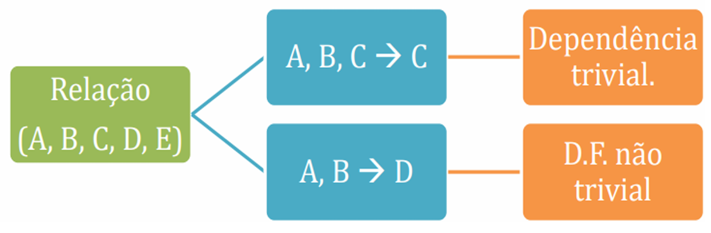

# Capítulo 13 – Modelo Relacional: Normalização

## Introdução à Normalização

No contexto de bancos de dados, o termo **normalização** refere-se a um processo sistemático cujo objetivo é organizar os dados de forma que se eliminem **redundâncias** e **anomalias de modificação**. Mas o que exatamente significa “organizar” os dados?

Imagine que um banco de dados represente informações sobre compras realizadas por clientes. Naturalmente, uma má organização desses dados pode fazer com que informações como nome, endereço ou CPF de um mesmo cliente sejam repetidas diversas vezes em diferentes registros. Essa repetição não apenas ocupa espaço, como também se torna um risco à integridade dos dados.

Tomemos como exemplo a seguinte **tabela VENDAS**, que representa compras feitas por um mesmo cliente:

|Cod_Compra|Nome|Endereço|CPF|Produto|
|---|---|---|---|---|
|1|Thiago|SQSW 302|99999999999|Caneta|
|2|Thiago|SQSW 302|99999999999|Livro|
|3|Thiago|SQSW 302|99999999999|Borracha|

Neste cenário, o cliente “Thiago” aparece diversas vezes, com as mesmas informações de endereço e CPF. Agora, suponha que esse cliente tenha mudado de endereço e essa atualização tenha sido feita **apenas na primeira linha** da tabela. Observe o que ocorre:

|Cod_Compra|Nome|Endereço|CPF|Produto|
|---|---|---|---|---|
|1|Thiago|SQSW 304|99999999999|Caneta|
|2|Thiago|SQSW 302|99999999999|Livro|
|3|Thiago|SQSW 302|99999999999|Borracha|

O resultado é uma **anomalia de atualização**: o mesmo cliente agora possui dois endereços diferentes registrados. Isso compromete a confiabilidade dos dados, gerando confusão e potencial inconsistência nas análises futuras.

A normalização atua diretamente sobre esse problema. Ao reorganizar os dados, podemos separar as informações do cliente em uma tabela própria, ficando a tabela de VENDAS apenas com os dados da compra:

**Tabela VENDAS:**

|Cod_Compra|CPF|Produto|
|---|---|---|
|1|99999999999|Caneta|
|2|99999999999|Livro|
|3|99999999999|Borracha|

**Tabela CLIENTE:**

|Nome|Endereço|CPF|
|---|---|---|
|Thiago|SQSW 304|99999999999|

Agora, qualquer alteração no endereço de Thiago será feita **em um único local**, evitando anomalias de atualização e diminuindo a redundância. Essa reorganização é o cerne do processo de normalização.

## Fundamentos e Objetivos da Normalização

O conceito de normalização foi formalmente proposto por **E. F. Codd**, o mesmo cientista que definiu o modelo relacional. Em 1972, Codd apresentou as **formas normais**, que são critérios progressivos de qualidade para a estrutura de uma tabela (ou relação). O processo de normalização submete os esquemas de relação a uma sequência de testes e transformações, assegurando que os dados estejam dispostos de forma **coerente, lógica e sem redundância indevida**.

A **finalidade da normalização** é garantir que os dados armazenados estejam livres de:

- **Redundância desnecessária**: a repetição de informações em várias partes do banco.
- **Anomalias de inserção**: dificuldade para adicionar um novo registro devido a dependências indesejadas.
- **Anomalias de atualização**: inconsistências causadas por modificações parciais em registros redundantes.
- **Anomalias de exclusão**: perda acidental de informações importantes ao se excluir um dado aparentemente irrelevante.

### Definição Formal de Normalização

Formalmente, a normalização pode ser definida da seguinte forma:

> A normalização é uma técnica de **decomposição de relações**, cujo objetivo é **organizar os dados** em estruturas **menores e mais consistentes**, minimizando a redundância e eliminando anomalias de modificação.

A decomposição ocorre quando uma tabela é dividida em duas ou mais tabelas menores, preservando a integridade dos dados e os relacionamentos lógicos entre as entidades representadas.

É importante observar que a normalização não é um fim em si mesma, mas um **meio para alcançar um modelo lógico limpo, coerente e de fácil manutenção**. Como consequência, ela também favorece a eficiência da consulta, a integridade referencial e a escalabilidade do banco de dados.

### Aplicação Incremental: as Formas Normais

As transformações que conduzem à normalização são baseadas em **formas normais**, que são como "níveis" de organização lógica dos dados. Quanto maior a forma normal atingida por uma tabela, mais refinada será sua estrutura.

Originalmente, Codd definiu as **três primeiras formas normais (1FN, 2FN e 3FN)**, todas baseadas na ideia de **dependência funcional** entre os atributos da relação. Posteriormente, foi introduzida a **Forma Normal de Boyce-Codd (FNBC)**, uma variação mais rigorosa da 3FN. Além dessas, outras formas normais mais avançadas também existem, como a 4FN e a 5FN, voltadas para cenários com dependências multivaloradas e junções complexas.

Antes de seguir para o estudo específico de cada forma normal, é essencial compreender alguns conceitos fundamentais, como:

- **Dependência funcional**
- **Chave primária, chave candidata e superchave**
- **Atributos primários e não primários**

Esses conceitos serão abordados nos próximos tópicos, pois são a base para o correto entendimento da teoria da normalização e sua aplicação prática no projeto lógico de bancos de dados.

## Dependência Funcional: Fundamento da Estrutura Lógica

No coração da teoria da normalização de dados está um conceito essencial: a **dependência funcional**. Essa ideia define, de forma precisa, como os atributos (ou colunas) de uma tabela se relacionam entre si. Para que possamos compreender as formas normais e aplicá-las corretamente em projetos de banco de dados, é imprescindível entender o que significa afirmar que um atributo “depende funcionalmente” de outro.

### O que é Dependência Funcional?

Dizemos que existe uma **dependência funcional** entre dois conjuntos de atributos X e Y de uma relação R, representada pela notação **X → Y**, quando, para **cada valor de X**, existe **no máximo um valor de Y**. Em outras palavras, se conhecemos o valor de X, podemos saber exatamente o valor correspondente de Y.

Essa definição parece teórica, mas é fácil visualizá-la com um exemplo. Considere a seguinte tabela de alunos de uma universidade:

|CPFAluno|CidadeAluno|Turma|
|---|---|---|
|00000000000|Recife|A|
|11111111111|Brasília|B|
|22222222222|Fortaleza|C|
|33333333333|Ceilândia|D|
|44444444444|João Pessoa|E|

Se observarmos com atenção, percebemos que **o mesmo CPF nunca aparece mais de uma vez**. Isso significa que o CPF identifica de forma única o aluno. Assim, podemos afirmar que:

**CPFAluno → CidadeAluno**  
**CPFAluno → Turma**

Essas expressões indicam que, para cada valor único de **CPFAluno**, existe um único valor correspondente para **CidadeAluno** e para **Turma**. O **atributo à esquerda da seta (→)** é chamado de **determinante**, pois determina o valor do atributo à direita, conhecido como **determinado**.

### Visualizando a Dependência na Prática

Retomando nosso exemplo, suponha agora que examinamos a seguinte tabela:

|Cod_Compra|Nome|Endereço|CPF|Produto|
|---|---|---|---|---|
|1|Thiago|SQSW 302|99999999999|Caneta|
|2|Thiago|SQSW 302|99999999999|Livro|
|3|Thiago|SQSW 302|99999999999|Borracha|

Perceba que o nome “Thiago” está associado a um único endereço. Isso sugere a dependência funcional:  
**Nome → Endereço**

Formalmente, a definição nos diz que **se duas tuplas têm o mesmo valor para o atributo Nome, então também terão o mesmo valor para o atributo Endereço**. Em termos matemáticos:

Se t₁[Nome] = t₂[Nome], então t₁[Endereço] = t₂[Endereço]

Esse tipo de análise é fundamental no projeto de esquemas, pois identifica quais atributos **dependem diretamente de outros** e, por consequência, orienta a decomposição correta de tabelas.

### Dependências Triviais e Não Triviais

Nem toda dependência funcional é útil para fins de normalização. Algumas são chamadas de **triviais**, e outras, **não triviais**.

- **Dependência funcional trivial** ocorre quando o atributo determinado já está contido no conjunto determinante.  
    Exemplo: A, B, C → C  
    Como C já está no lado esquerdo, a dependência é evidente e, por isso, trivial.
- **Dependência funcional não trivial** ocorre quando o atributo do lado direito **não** está presente no lado esquerdo.  
    Exemplo: A, B → D  
    Essa dependência é significativa e pode indicar a necessidade de reestruturação da relação.

A figura a seguir ilustra esses dois tipos:

  

### Axiomas de Armstrong

A análise e inferência de dependências funcionais em um conjunto de atributos são baseadas em um conjunto de regras chamadas **Axiomas de Armstrong**, que fornecem um sistema formal de dedução. Essas regras são fundamentais para identificar todas as dependências funcionais implicadas por um conjunto inicial conhecido.

As três **regras básicas** são:

1. **Reflexividade**  
    Se Y ⊆ X, então X → Y  
    Exemplo: Se temos o conjunto de atributos (A, B, C), então (A, B) → A é uma dependência válida.
2. **Aumentação (Augmentação)**  
    Se X → Y, então XZ → YZ  
    Isso significa que podemos adicionar atributos iguais aos dois lados da dependência sem invalidá-la.
3. **Transitividade**  
    Se X → Y e Y → Z, então X → Z  
    Um conceito semelhante ao encadeamento lógico: se A determina B e B determina C, então A determina C.

Além dos axiomas principais, há outras regras que podem ser derivadas deles. Estas são amplamente utilizadas no contexto prático de modelagem e normalização:

- **Decomposição** (Analysis):  
    Se X → YZ, então X → Y e X → Z  
    Se um conjunto de atributos determina um conjunto de outros atributos, então ele também determina cada um dos atributos individualmente.
- **União** (Synthesis):  
    Se X → Y e X → Z, então X → YZ  
    Se um conjunto de atributos determina dois outros conjuntos de atributos separadamente, então ele também determina a união desses conjuntos.
- **Pseudotransitividade**:  
    Se X → Y e YW → Z, então XW → Z  
    Permite a dedução de novas dependências funcionais quando há uma dependência em cadeia, mesmo que não seja uma relação direta entre os atributos em questão.
- **Reflexividade ou Autodeterminação** (forma trivial):  
    Se Y ⊆ X, então X → Y  
    Um conjunto de atributos determina subconjuntos de si mesmo.
- **Junção**:  
    Se X → Y e X → Z, então X → YZ  
    Similar à regra da União, mas é mais restritiva, pois requer que a dependência funcional seja a mesma em ambas as relações.
- **Acumulação**:  
    Se X → Y, então XZ → Y  
    Adiciona atributos ao lado esquerdo mantendo a DF válida.

A tabela a seguir resume essas regras e os próprios axiomas:

|Axiomas / Regras|Descrição|
|---|---|
|**Reflexividade**|X ⊆ Y ⇒ Y → X|
|**Augmentação/Aumentação**|X → Y ⇒ XZ → YZ|
|**Transitividade**|(X → Y) ∧ (Y → Z) ⇒ X → Z|
|**Decomposição (Analysis)**|Se X → YZ, então X → Y e X → Z|
|**União (Synthesis)**|Se X → Y e X → Z, então X → YZ|
|**Pseudotransitividade**|Se X → Y e YW → Z, então XW → Z|
|**Reflexividade/Autodeterminação (Trivial)**|Se Y ⊆ X, então X → Y|
|**Junção**|Se X → Y e X → Z, então X → YZ|
|**Acumulação**|Se X → Y, então XZ → Y|

Essas regras permitem deduzir, a partir de um conjunto inicial de dependências, todas as outras que devem ser verdadeiras para manter a **coerência lógica** do modelo relacional.

## Superchave, Chave Candidata e Chave Primária: A Base da Identificação Única

Em um banco de dados relacional, o conceito de **chave** é essencial. É a chave que garante a **unicidade de cada tupla** (linha) em uma relação, permitindo que cada registro seja individualmente identificado. Sem ela, perderíamos o controle sobre os dados e comprometeríamos a integridade da informação.

### Superchave: Um Conjunto Identificador

Vamos começar pelo conceito mais abrangente: a **superchave**. Uma **superchave** é **qualquer conjunto de atributos** de uma relação R = {A₁, A₂, ..., Aₙ} que consiga **identificar unicamente** cada tupla dentro daquela relação. Ou seja, em uma superchave S ⊆ R, **não podem existir duas tuplas t₁ e t₂ que possuam os mesmos valores para todos os atributos em S**.

Formalmente, dizemos que S é uma superchave de R se, para quaisquer tuplas t₁ e t₂ pertencentes ao conjunto de tuplas da relação, **t₁[S] ≠ t₂[S]**.

Pense em uma tabela de funcionários:

|CPF|Nome|Matrícula|Cargo|
|---|---|---|---|
|12345678900|Ana Beatriz|0001|Analista|
|98765432100|Paulo Souza|0002|Gerente|

Nesse exemplo, tanto o **CPF** quanto a **Matrícula** são únicos por funcionário. Portanto, os conjuntos {CPF}, {Matrícula}, e até mesmo {CPF, Nome}, {CPF, Matrícula, Cargo} são **superchaves**, pois todos identificam de forma única uma tupla. Repare, no entanto, que algumas dessas superchaves possuem **atributos redundantes**, o que nos leva ao próximo conceito.

### Chave Candidata: A Superchave Irredutível

Uma **chave candidata** é uma **superchave mínima**. Isso significa que **nenhum dos atributos da chave pode ser retirado sem que a unicidade seja perdida**. Em termos simples: é a superchave **sem sobras**.

No nosso exemplo anterior, tanto {CPF} quanto {Matrícula} são **chaves candidatas**, pois ambas identificam unicamente um funcionário e **não há atributo redundante**. Por outro lado, {CPF, Nome} não é uma chave candidata, pois o atributo Nome é redundante — ele pode ser retirado sem prejudicar a unicidade proporcionada por CPF.

Uma tabela pode ter **várias chaves candidatas**. E isso é bastante comum. Quando isso ocorre, uma dessas chaves candidatas deve ser **escolhida pelo projetista do banco de dados** para atuar como a **chave primária**. As demais chaves candidatas, embora não utilizadas como primária, continuam válidas e são chamadas de **chaves alternativas** ou **chaves secundárias**.

### Chave Primária: A Escolhida do Conjunto

A **chave primária** (ou **primary key**) é a **chave candidata escolhida** para **representar a identidade da tupla**. É com ela que o sistema de banco de dados irá estruturar internamente os dados, definir relacionamentos com outras tabelas (por meio das chamadas **chaves estrangeiras**) e aplicar restrições como a **proibição de valores nulos** e **duplicatas**.

No nosso exemplo dos funcionários, se o projetista optar por usar o CPF como chave primária, temos:

- **Chave Primária**: {CPF}  
- **Chave Alternativa**: {Matrícula}

Além disso, ao definir uma chave primária, todos os atributos que compõem essa chave são chamados de **atributos primários**. Por consequência, qualquer outro atributo da relação que **não participe de nenhuma chave candidata** é classificado como **atributo não primário**.

### A Importância das Chaves para a Normalização

Compreender a diferença entre **superchave**, **chave candidata**, **chave primária** e **atributo primário** é essencial, pois as formas normais — que veremos a seguir — se baseiam na identificação e no tratamento das **dependências funcionais** relacionadas às chaves.

Na **Primeira Forma Normal**, o foco está na atomicidade dos atributos e na ausência de repetições. Já a **Segunda** e a **Terceira Formas Normais**, assim como a **Forma Normal de Boyce-Codd**, são construídas com base em dependências funcionais **relacionadas a chaves**: a depender se um atributo está funcionalmente dependente de **toda** a chave primária ou apenas de **parte dela**; ou ainda, se está dependente de **outra chave candidata** que não a primária.

Portanto, saber identificar corretamente as chaves de uma relação não é apenas uma tarefa técnica: é a base teórica indispensável para garantir **modelos corretos, sem redundância e livres de anomalias de modificação**.

## Primeira Forma Normal (1FN): Atomicidade dos Dados como Fundamento do Modelo Relacional

A **Primeira Forma Normal (1FN)** representa o primeiro passo no processo de normalização de um banco de dados. Apesar de parecer simples à primeira vista, ela desempenha um papel essencial ao garantir que os dados estejam organizados de forma que possam ser tratados corretamente pelo modelo relacional.

Para compreendê-la com profundidade, é importante reconhecer que **a 1FN está intrinsecamente associada à própria definição de relação** no contexto do modelo relacional proposto por E. F. Codd. De fato, **nenhuma relação que viole a 1FN pode ser considerada válida dentro do modelo relacional puro**.

### A Definição Essencial da 1FN

A 1FN estabelece que, para que uma relação seja considerada válida, **todos os atributos devem possuir domínios atômicos**. Isso significa que os **valores armazenados em cada célula da tabela devem ser indivisíveis**: cada campo deve conter apenas um valor simples, e não múltiplos valores ou estruturas compostas.

Em outras palavras, uma tabela não deve conter:

- **Atributos compostos**, que agrupam informações de tipos distintos (como um campo "Endereço" contendo rua, número, bairro e CEP).
- **Atributos multivalorados**, que armazenam mais de um valor para um mesmo campo em uma única tupla (como uma coluna "Telefones" com dois ou mais números separados por vírgula).

Essas situações violam diretamente a 1FN, pois **quebram o princípio da atomicidade**, prejudicando a legibilidade, manutenção e integridade do banco de dados.

### Exemplo Prático

Vamos analisar um exemplo prático, em que temos uma relação `ALUNO` que armazena os dados de três estudantes. Note como a estrutura original da tabela possui problemas evidentes de atomicidade:

|Código_Aluno|Nome|Telefones|Endereço|
|---|---|---|---|
|A001|Fabrício Ribeiro|99564-9453, 98432-1234|Rua 17 de julho, 98, Morumbi, 12635-965|
|B001|Carlos Normando|–|Rua Águas de Março, 16, Rio de Janeiro, 54532-098|
|C001|Emerson Pimentel|92834-5697, 91283-4309|Praça Ramos 15, Liberdade, 66858-633|

Nesta tabela, a coluna **Telefones** armazena múltiplos valores, e a coluna **Endereço** agrupa diferentes informações (logradouro, número, bairro, CEP) em um único campo. Ambas as situações violam a 1FN.

Para corrigir essa violação, devemos tomar **duas atitudes distintas**:

1. **Separar os atributos compostos** em colunas distintas.
2. **Criar uma nova relação para os atributos multivalorados**, com base na repetição controlada por chaves.

Vamos começar com a decomposição da coluna multivalorada **Telefones**. Isso requer a criação de uma nova tabela que relaciona cada aluno a seus respectivos números de telefone:

**Relação TELEFONE_ALUNO:**

|Código_Aluno|Telefone|
|---|---|
|A001|99564-9453|
|A001|98432-1234|
|C001|92834-5697|
|C001|91283-4309|

A chave primária dessa nova relação é composta por **Código_Aluno** e **Telefone**, garantindo a unicidade dos registros e preservando a integridade dos dados.

Agora, voltemos à relação principal e tratemos a coluna **Endereço**, que deve ser desmembrada em múltiplas colunas, cada uma correspondendo a um componente atômico:

**Relação ALUNO (agora conforme a 1FN):**

|Código_Aluno|Nome|Logradouro|Número|Bairro|CEP|
|---|---|---|---|---|---|
|A001|Fabrício Ribeiro|Rua 17 de julho|98|Morumbi|12635-965|
|B001|Carlos Normando|Rua Águas de Março|16|Rio de Janeiro|54532-098|
|C001|Emerson Pimentel|Praça Ramos|15|Liberdade|66858-633|

Agora sim, todas as colunas possuem **valores simples e indivisíveis**, ou seja, **atômicos**, e a tabela satisfaz completamente os requisitos da Primeira Forma Normal.

### Definições Acadêmicas

Diversos autores apresentam definições equivalentes sobre a 1FN, cada uma reforçando um aspecto importante:

- "Uma relação R está na Primeira Forma Normal se, e somente se, todos os seus domínios subjacentes contiverem apenas valores atômicos."
- "No modelo relacional, um domínio é atômico se os elementos desse domínio forem considerados unidades indivisíveis."
- "Um esquema de relação R está em 1FN se todos os seus atributos forem atômicos."
- "A 1FN impede a presença de relações aninhadas ou atributos multivalorados, situações que não são aceitas no modelo relacional puro."

Essas definições reforçam o mesmo princípio: **garantir que cada célula da tabela contenha apenas um valor simples**, viabilizando o uso eficiente de operações relacionais, como projeção, seleção e junção, e evitando as anomalias de repetição e ambiguidade.

A **Primeira Forma Normal** é frequentemente ignorada por projetistas iniciantes, justamente por parecer “óbvia”. Porém, é comum encontrar bancos de dados que armazenam telefones, e-mails, endereços e até listas de códigos em um único campo de uma tabela. Isso não apenas compromete o funcionamento do banco, como impede a aplicação correta das formas normais seguintes.

A 1FN representa **a base de um projeto relacional bem estruturado**. Sem ela, não se pode falar em normalização nem em consistência lógica dos dados. A partir da 1FN, podemos avançar para identificar as dependências entre os atributos e, então, aplicar as demais formas normais que discutiremos a seguir.

## Segunda Forma Normal (2FN): Eliminando Dependências Parciais para Maior Coesão

A **Segunda Forma Normal (2FN)** é o passo seguinte ao atingimento da 1FN no processo de normalização de um esquema relacional. Enquanto a 1FN assegura a atomicidade dos dados, a 2FN foca na eliminação das chamadas **dependências funcionais parciais**, que afetam relações com **chaves compostas**. Esse tipo de anomalia, embora mais sutil do que atributos multivalorados ou compostos, pode comprometer significativamente a integridade lógica e a eficiência do banco de dados.

### Entendendo a Dependência Parcial

Chamamos de **dependência funcional parcial** a situação em que **um atributo não primário depende de apenas parte da chave primária composta**. Para que uma tabela esteja de fato em 2FN, é necessário que **todos os atributos não primários dependam funcionalmente da totalidade da chave primária** — e não apenas de uma parte dela.

Isso significa que, se uma relação possui uma chave composta (por exemplo, formada pelos atributos A e B), então **nenhum outro atributo pode depender apenas de A ou apenas de B**. Todos os atributos não pertencentes à chave devem depender **conjuntamente** de A e B.

Se essa regra não for obedecida, a tabela poderá conter **redundância desnecessária** e estará suscetível a anomalias de inserção, atualização e exclusão.

### Exemplo Prático

Considere a seguinte tabela:

|Cod_Compra|CPF|Nome|Endereço|Produto|
|---|---|---|---|---|
|1|99999999999|Thiago|SQSW 302|Caneta|
|2|99999999999|Thiago|SQSW 302|Livro|
|3|88888888888|Flávia|SQSW 304|Borracha|

A chave primária composta desta tabela é formada pelos atributos **Cod_Compra** e **CPF**, pois juntos eles identificam unicamente cada linha da relação. No entanto, podemos observar que o atributo **CPF**, sozinho, já determina os valores dos atributos **Nome** e **Endereço**.

Ou seja, temos aqui:

- **CPF → Nome**
- **CPF → Endereço**

Esse comportamento caracteriza uma **dependência parcial**, pois os atributos Nome e Endereço **dependem de apenas uma parte da chave primária composta**. Como consequência, há **redundância** e **risco de inconsistência**, já que uma alteração no nome ou endereço de um cliente exigiria que todas as linhas associadas ao seu CPF fossem atualizadas — o que nem sempre acontece, como vimos no exemplo da 1FN.

Para eliminar essa dependência parcial, devemos **separar os atributos que dependem apenas de parte da chave em uma nova relação**. Dessa forma, mantemos a integridade e eliminamos a repetição de dados.

**Relação VENDAS:**

|Cod_Compra|CPF|Produto|
|---|---|---|
|1|99999999999|Caneta|
|2|99999999999|Livro|
|3|88888888888|Borracha|

**Relação CLIENTE:**

|CPF|Nome|Endereço|
|---|---|---|
|99999999999|Thiago|SQSW 302|
|88888888888|Flávia|SQSW 304|

Após a decomposição, os atributos Nome e Endereço são movidos para uma nova relação onde são **totalmente dependentes da chave primária (CPF)**. Já na tabela original, todos os atributos não chave (neste caso, Produto) permanecem **totalmente dependentes da chave composta**, eliminando assim a dependência parcial.

### Definições Acadêmicas

Podemos encontrar na literatura diversas definições equivalentes da 2FN, todas voltadas para o mesmo princípio da eliminação das dependências parciais. Entre as principais:

- “Um esquema de relação R está na Segunda Forma Normal se cada atributo não primário A de R for totalmente funcionalmente dependente de toda a chave primária.”
- “Uma tabela está na 2FN se estiver na 1FN e não contiver nenhuma dependência funcional parcial entre os atributos não chave e a chave composta.”
- “A 2FN busca assegurar que cada coluna não chave dependa da totalidade da chave e não de parte dela.”

Um detalhe importante: **a Segunda Forma Normal é irrelevante para tabelas cuja chave primária seja simples (isto é, composta por apenas um atributo)**. Nesse caso, não há “parte da chave” para causar dependência parcial, então tais tabelas já satisfazem a 2FN se estiverem em 1FN.

O principal ganho ao atingir a Segunda Forma Normal é a **eliminação de redundância que não depende diretamente da estrutura das transações**. Isso ajuda a evitar atualizações incorretas e minimiza os efeitos colaterais quando um dado precisa ser alterado em múltiplas linhas da mesma tabela.

Dessa forma, a 2FN fortalece a **coesão semântica** entre os atributos de uma relação, estabelecendo a base necessária para o avanço à Terceira Forma Normal (3FN), que trata das **dependências transitivas**, tema do próximo tópico.

## Terceira Forma Normal (3FN): Evitando Dependências Transitivas

A **Terceira Forma Normal (3FN)** é uma das etapas mais importantes no processo de normalização. Ela complementa e fortalece os objetivos da 1FN e da 2FN ao **eliminar um tipo mais sutil de redundância**: a **dependência funcional transitiva** entre atributos.

Como já vimos, a **Primeira Forma Normal** assegura que todos os atributos sejam atômicos, e a **Segunda Forma Normal** remove dependências parciais de chaves compostas. A 3FN, por sua vez, exige que **os atributos não primários dependam diretamente das chaves** — e não de outros atributos que, por sua vez, dependem da chave.

### Definição Formal

Um esquema de relação R está na **Terceira Forma Normal (3FN)** se, e somente se:

- R está na Segunda Forma Normal (2FN); **e**
- Não existe nenhuma **dependência funcional transitiva** entre atributos não chave.

Mais precisamente, uma dependência funcional não trivial do tipo **X → A** é permitida apenas se:

- **X for uma superchave** da relação, **ou**
- **A for um atributo primário**, ou seja, faz parte de alguma chave candidata.

Essa definição foi formalizada e amplamente divulgada por autores como **Ramez Elmasri** e **Navathe**, e pode ser resumida da seguinte maneira:

> Em uma relação em 3FN, todo atributo não chave deve depender direta e exclusivamente de uma chave candidata, e não de outro atributo não chave.

### Entendendo a Dependência Transitiva

Antes de prosseguir com a aplicação da 3FN, é essencial compreender o que significa uma **dependência funcional transitiva**. Podemos dizer que uma dependência é transitiva quando:

- Existe um atributo **A** (chave primária ou candidata),
- Que determina um atributo **B** (não chave),
- E este atributo **B**, por sua vez, determina outro atributo **C** (também não chave).

Formalmente: Se **A → B** e **B → C**, então temos uma dependência transitiva **A → C**, e isso **viola a Terceira Forma Normal**.

### Exemplo Prático

Considere a seguinte tabela, que lista pessoas com seu CPF, nome, telefone residencial e endereço:

|CPF|Nome|telResidencial|Endereço|
|---|---|---|---|
|001|Thiago|61 555-1255|SQSW 302 BL G|
|002|Flávia|61 555-1255|SQSW 302 BL G|
|003|Lucas|61 555-1555|SQSW 302 BL G|
|004|Vinicius|61 555-1555|SQSW 302 BL G|
|005|Ladjane|81 555-9299|Av. Portugal|

Neste exemplo, temos:

- **CPF → telResidencial**
- **telResidencial → Endereço**

Logo, por transitividade, temos **CPF → Endereço**, uma dependência funcional que **passa por um atributo intermediário não chave**. Isso configura uma **violação da 3FN**, pois o atributo **Endereço** não depende diretamente da chave primária (**CPF**), mas sim de outro atributo não chave (**telResidencial**).

Além disso, essa estrutura resulta em **redundância de dados**: se precisarmos atualizar o endereço associado ao telefone 61 555-1255, teremos que modificar múltiplas linhas — o que pode causar **anomalias de atualização**.

Para eliminar a dependência transitiva, basta **separar os atributos que não dependem diretamente da chave em uma nova tabela**.

**Relação PESSOA:**

|CPF|Nome|telResidencial|
|---|---|---|
|001|Thiago|61 555-1255|
|002|Flávia|61 555-1255|
|003|Lucas|61 555-1555|
|004|Vinicius|61 555-1555|
|005|Ladjane|81 555-9299|

**Relação TELEFONE:**

|telResidencial|Endereço|
|---|---|
|61 555-1255|SQSW 302 BL G|
|61 555-1555|SQSW 302 BL G|
|81 555-9299|Av. Portugal|

Agora, a relação **PESSOA** não possui mais dependências transitivas: todos os atributos não chave (Nome e telResidencial) dependem diretamente de **CPF**, que é a chave primária. E na relação **TELEFONE**, o endereço depende diretamente do número de telefone — que é sua chave primária.

Esse modelo evita redundâncias, preserva a integridade e simplifica futuras atualizações.

### Resumo da 3FN com Exemplo Teórico

Considere os atributos A, B e C, onde:

- **A é chave primária**,
- **B e C são atributos não chave**,
- E existe uma dependência **A → B** e **B → C**.

A dependência **A → C** é transitiva, e para eliminar esse tipo de relação, deve-se decompor a tabela de forma que:

- B fique com A na tabela principal,
- E C seja movido para uma nova relação associada a B.

Este processo **quebra o encadeamento de dependência indireta**, satisfazendo os requisitos da 3FN.

### Definições Acadêmicas

Vamos fechar o estudo da 3FN com três definições tradicionais:

- Um esquema de relação R está na 3FN se, para cada dependência funcional não trivial X → A, pelo menos uma das seguintes condições for verdadeira: 
    (a) X é superchave;  
    (b) A é atributo primário;
- Uma relação está na Terceira Forma Normal se estiver na Segunda Forma Normal e não possuir dependências transitivas entre atributos não chave.
- A 3FN visa garantir que os atributos não chave estejam diretamente ligados às chaves candidatas e não indiretamente por meio de outros atributos não chave.
