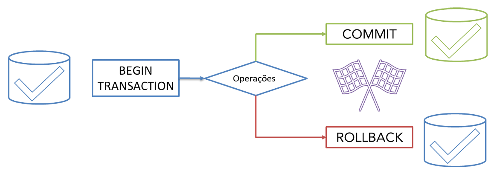
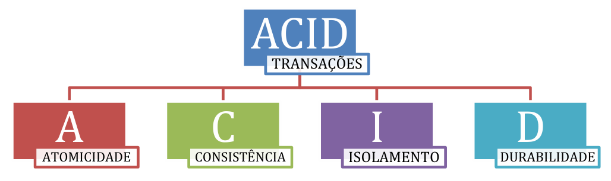
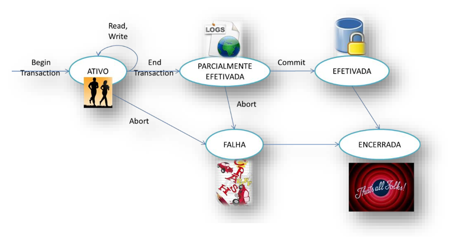
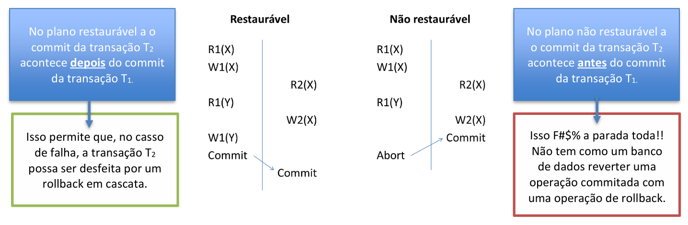

# Capítulo 15 – Processamento de Transações, Controle de Concorrência e Recuperação

## Processamento de Transações

O processamento de transações trata da capacidade que um banco de dados tem de lidar com **operações que representam unidades lógicas de trabalho**. Tais operações **devem ser executadas integralmente ou, em caso de falha, revertidas completamente**, de forma a manter o banco em um estado consistente.

Para entendermos melhor, imagine uma transação bancária. Suponha que um cliente transfira dinheiro de uma conta para outra. Este processo envolve, no mínimo, duas operações: subtrair um valor de uma conta e adicionar este valor à outra. Ambas as operações precisam ocorrer juntas para manter o sistema correto. Se apenas uma for concluída e a outra falhar, surgirá uma inconsistência grave no banco de dados.

A correta implementação de mecanismos de controle de transações protege o banco contra falhas, perdas de dados e inconsistências, garantindo que tudo ocorra da maneira esperada mesmo diante de problemas como quedas de energia, falhas de hardware ou erros de software.

Na figura a seguir, podemos visualizar de forma resumida os elementos básicos envolvidos no ciclo de uma transação:

  

### O Problema

O mundo real é movido por transações. No contexto empresarial ou pessoal, uma transação corresponde a qualquer evento no qual ocorre uma troca de valores, informações ou serviços. Isso inclui compras, vendas, transferências financeiras, atualizações cadastrais, reservas, entre outros.

Os sistemas de processamento de transações têm uma missão desafiadora. Eles devem garantir:

- Alta disponibilidade e confiabilidade.
- Processamento eficiente de grandes volumes de dados.
- Segurança contra erros causados por operações simultâneas.
- Prevenção contra registros inconsistentes ou parciais.
- Capacidade de recuperação após falhas, sem perda de dados.
- Crescimento escalável e distribuído.

Por trás de toda essa robustez estão tecnologias como **logs**, **bloqueios**, **controle de concorrência** e **mecanismos de recuperação**, que estudaremos com profundidade ao longo deste capítulo.

### O Que é uma Transação?

De forma conceitual, uma **transação** é uma **unidade lógica de trabalho**, composta por um ou mais comandos que realizam leitura e/ou modificação de dados no banco. Ela é executada de forma atômica, ou seja, ou todas as suas operações são completadas com sucesso, ou nenhuma delas é aplicada.

O sistema responsável por garantir a execução correta de uma transação dentro do SGBD é conhecido como **gerenciador de transações**, que faz parte do núcleo do banco de dados.

Cada transação passa por um ciclo bem definido, no qual é iniciada, executada e, dependendo do sucesso ou falha de suas operações, pode ser **confirmada** (commit) ou **desfeita** (rollback).

Para que um banco de dados seja confiável e robusto, suas transações devem obedecer a quatro propriedades fundamentais, conhecidas pela sigla **ACID**, formada pelas iniciais dos termos em inglês:

  

- **Atomicidade (A)** – A transação deve ser executada integralmente ou não ser executada. Se algum erro ocorrer no meio da execução, todas as operações já realizadas são desfeitas. O banco retorna ao estado anterior ao início da transação.
- **Consistência (C)** – O banco de dados deve passar de um estado consistente para outro estado igualmente consistente. As regras de integridade (chaves, restrições, relacionamentos) devem ser sempre preservadas.
- **Isolamento (I)** – As operações de uma transação não devem ser visíveis para outras transações até que sejam confirmadas. Isso garante que transações concorrentes não interfiram umas nas outras.
- **Durabilidade (D)** – Uma vez que uma transação é confirmada, suas alterações no banco de dados não podem ser perdidas, mesmo em caso de falhas no sistema.

Essas propriedades são essenciais para garantir que o banco de dados reflita a realidade do mundo de forma correta e consistente.

### O Fluxo de uma Transação

Para entender como uma transação se comporta internamente dentro do SGBD, é necessário compreender o seu fluxo, representado por uma **máquina de estados**, que mostra os possíveis estados de uma transação ao longo de sua execução.

  

Este ciclo pode ser descrito da seguinte maneira:

1. **Ativa (Active)** – A transação inicia sua execução após o comando `BEGIN TRANSACTION`. Neste estado, ela realiza operações de leitura (`read`) e escrita (`write`) nos dados.
2. **Parcialmente Efetivada (Partially Committed)** – Ao concluir suas operações, a transação passa para este estado quando executa o `END TRANSACTION`. Aqui, as operações estão registradas no log, mas ainda não foram efetivamente aplicadas ao banco de dados.
3. **Efetivada (Committed)** – Se tudo ocorrer bem, a transação executa um `COMMIT`, consolidando permanentemente todas as mudanças no banco. A partir daqui, as alterações são definitivas e não podem ser revertidas.
4. **Falha (Failed)** – Caso ocorra algum problema durante a execução (como queda de energia, erro de sistema ou falha de integridade), a transação entra no estado de falha. Suas operações são desfeitas por meio de um `ROLLBACK` automático ou manual.
5. **Encerrada (Terminated)** – A transação deixa o sistema, estando completamente finalizada, seja por sucesso (commit) ou por falha (rollback).

### O Log do Sistema

O **log de transações**, também chamado de **journal**, é um dos principais mecanismos utilizados pelos SGBDs para garantir a atomicidade e durabilidade das transações.

Este log é **um arquivo persistente que registra**, em ordem cronológica, **todos os eventos significativos realizados pelas transações**, incluindo operações de leitura, escrita, início, commit e rollback.

O log **deve ser armazenado em um meio não volátil**, que não seja afetado por falhas do sistema, garantindo que as informações nele contidas estejam sempre disponíveis para recuperação do banco de dados em caso de falhas.

Um ponto extremamente relevante sobre o log é que, além de permitir a recuperação das transações, **ele também é capaz de fornecer rastreabilidade e auditoria**, permitindo identificar quais usuários acessaram ou alteraram determinados dados.

As informações registradas no log geralmente seguem o seguinte padrão:

- `[start_transaction, T]` → Indica o início da transação T.
- `[write_item, T, X, old_value, new_value]` → Registra a alteração de um item X pela transação T, especificando o valor antigo e o novo valor.
- `[read_item, T, X]` → (Opcional) Indica que o item X foi lido pela transação T.
- `[commit, T]` → Marca que a transação T foi efetivada.
- `[abort, T]` → Indica que a transação T foi desfeita.

Dependendo do tipo de controle de transações utilizado, os registros de leitura (`read_item`) podem ou não ser obrigatórios. Eles são fundamentais, por exemplo, quando se deseja manter logs de auditoria.

O log também permite que sejam realizadas duas operações fundamentais para a recuperação de dados:

- **UNDO (Desfazer)** – Usado quando uma transação falha. Permite desfazer as alterações feitas por essa transação, retornando os dados aos valores anteriores.
- **REDO (Refazer)** – Usado quando uma transação foi confirmada (`commit`), mas as alterações ainda não haviam sido fisicamente aplicadas no banco no momento de uma falha. O REDO garante que estas alterações sejam reaplicadas corretamente.

Uma característica importante dessas operações é que ambas são consideradas **idempotentes**, ou seja, podem ser aplicadas várias vezes, e sempre produzirão o mesmo resultado, sem efeitos colaterais adicionais.

Imagine, por exemplo, uma alteração salarial onde o salário de um funcionário é atualizado de R$ 10.000 para R$ 20.000. Se uma falha acontecer após o commit, mas antes da escrita definitiva no banco, a operação de REDO garantirá que o salário seja efetivamente atualizado para R$ 20.000, mesmo que essa operação precise ser aplicada mais de uma vez durante o processo de recuperação.

### Ponto de Efetivação: Garantindo a Confiabilidade das Modificações

Em um ambiente de banco de dados robusto, é fundamental garantir que, ao término de uma transação, as alterações realizadas sobre os dados estejam verdadeiramente consolidadas. Essa consolidação ocorre no chamado **ponto de efetivação** (commit point), um marco lógico e técnico fundamental no ciclo de vida de uma transação.

Dizemos que uma transação T alcançou seu ponto de efetivação quando **todas as suas operações que acessam o banco de dados foram executadas com sucesso** e **os efeitos dessas operações estão completamente registrados no log do sistema**. A partir desse momento, a transação é considerada efetivada, e seu efeito torna-se permanente e irrevogável.

Considere o seguinte cenário: se ocorrer uma falha no sistema e uma transação tiver o registro `[start_transaction, T]` no log, mas não tiver o correspondente `[commit, T]`, essa transação **deve ser revertida** — ou seja, todas as alterações feitas por ela são desfeitas, garantindo a atomicidade. Por outro lado, se o log já contiver o registro de commit, então a transação **deve ser refeita**, se necessário, para garantir que suas modificações estejam refletidas no banco.

Esse controle depende de uma estrutura crítica chamada **checkpoint**.

### Checkpoints: Salvaguardando o Estado do Banco

A operação de checkpoint consiste em um **marco periódico de segurança** no log de transações. Ele representa o momento em que o sistema grava, de maneira forçada, todas as alterações pendentes no disco. Esse mecanismo visa garantir que, mesmo em caso de falhas, a recuperação do banco possa ser feita de maneira eficiente, sem precisar varrer um log interminável desde o seu início.

Durante o processo de checkpoint, o SGBD executa as seguintes ações:

1. **Suspende temporariamente a execução de transações**;
2. **Grava em disco todas as modificações realizadas por transações efetivadas** (esvaziando os buffers de memória);
3. **Insere no log um registro `[checkpoint]`**, que pode conter informações adicionais como:
    - Identificadores das transações ativas;
    - Endereços do primeiro e do último registro no log para cada transação;
4. **Força a escrita do log em disco**;
5. **Retoma a execução normal das transações**.

Esse procedimento assegura que o sistema tenha pontos de restauração consistentes, minimizando o tempo e os recursos exigidos em processos de recuperação.

### Planos de Execução: Definindo a Ordem das Operações

Em sistemas concorrentes, várias transações podem ser executadas simultaneamente. Esse paralelismo traz benefícios em desempenho, mas também desafios. A **ordem de execução** das operações dessas transações precisa ser gerenciada com precisão para garantir que o resultado final seja o mesmo de uma execução sequencial.

Essa ordenação das operações é denominada **plano de execução**, ou **escalonamento**. Um plano de execução S, formado por um conjunto de transações T₁, T₂, ..., Tₙ, deve preservar a **ordem interna** de cada transação, ou seja, a sequência de operações originalmente programadas dentro de cada Ti deve ser respeitada.

No entanto, operações de transações distintas podem ser **intercaladas**, desde que não haja conflito entre elas. Mas o que caracteriza um conflito?

Duas operações de transações diferentes entram em **conflito** quando:

1. Pertencem a transações distintas;
2. Acessam o mesmo item de dado X;
3. Pelo menos uma delas modifica o item (ou seja, é uma operação de escrita).

Por exemplo, se a transação T₁ lê o item X e T₂ deseja escrevê-lo, ou vice-versa, há conflito.

### Planos Completos e as Condições de Validade

Para que um plano de execução seja considerado **completo**, ele deve satisfazer três condições fundamentais:

1. **Encerramento** – Todas as transações no plano devem ser finalizadas com `commit` ou `abort`;
2. **Ordenação** – A ordem original das operações dentro de cada transação deve ser preservada no plano;
3. **Conflito** – Toda operação conflitante entre transações deve ter uma ordem de execução claramente definida.

Observe que, se **duas operações não forem conflitantes**, a ordem entre elas no plano pode ser flexível, caracterizando o que chamamos de **ordenação parcial**.

Esse modelo flexível permite que o sistema otimize a execução das transações, mantendo a consistência e respeitando a independência lógica entre elas.

### Planos Restauráveis: Evitando o Caos Pós-Falha

Imagine que duas transações estão sendo executadas em paralelo. A transação T₂ lê um valor escrito por T₁. T₂ realiza mais algumas operações e então confirma sua execução com um `commit`. Logo em seguida, T₁ sofre uma falha.

Nesse cenário, temos um problema: T₂ depende de um valor produzido por T₁, que não foi efetivado. T₂, então, **construiu seu raciocínio em cima de uma informação que será descartada**. Isso compromete a integridade dos dados.

É justamente para evitar esse tipo de erro que os **planos restauráveis** são importantes. Um plano é considerado restaurável se, **sempre que uma transação Tj depender de um valor escrito por Ti, o commit de Ti ocorre antes do commit de Tj**.

Em outras palavras, **nenhuma transação deve se comprometer (fazer commit) com base em dados não confirmados por outras transações**.

Se essa regra for desrespeitada, o sistema poderá sofrer uma **reversão em cascata**: uma falha em uma transação pode provocar a anulação de várias outras, formando um efeito dominó.

Para tornar um plano livre de reversão em cascata, uma regra simples pode ser aplicada: **uma transação só pode ler dados que já foram gravados por transações que executaram o commit**.

Essa ideia está relacionada ao **nível de isolamento “read committed”**, onde os dados lidos sempre vêm de transações confirmadas. Assim, mesmo que uma transação falhe, não haverá necessidade de desfazer outras transações que apenas consumiram dados já válidos.

A figura a seguir ilustra esse conceito, contrastando um plano restaurável com um não restaurável.

  

