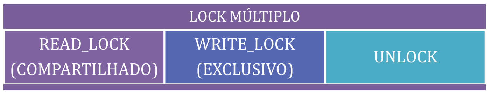
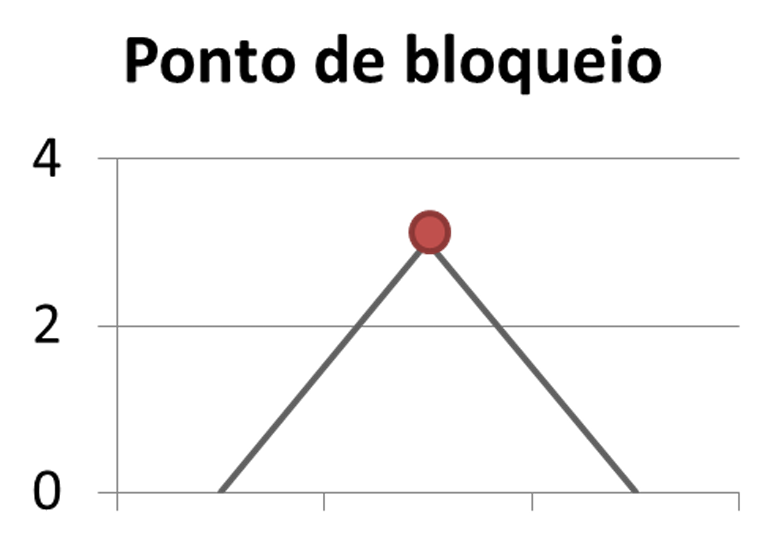
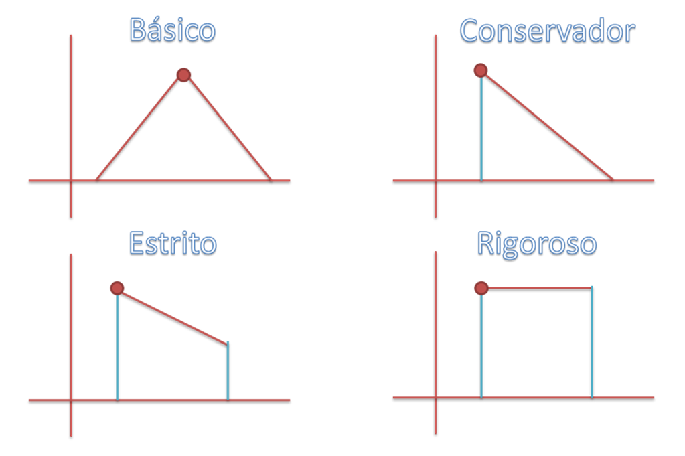
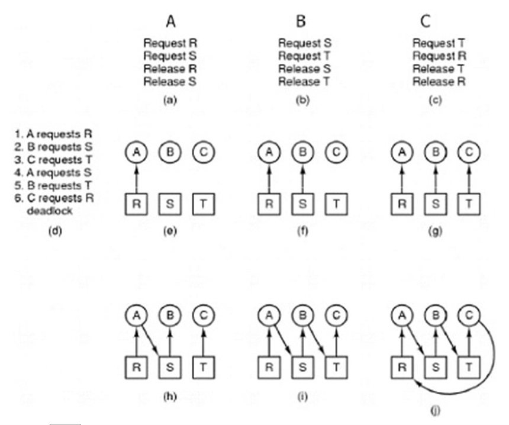
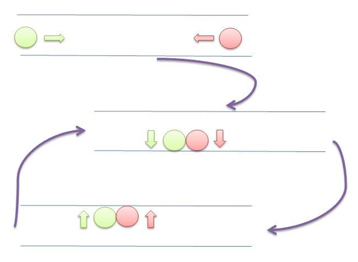
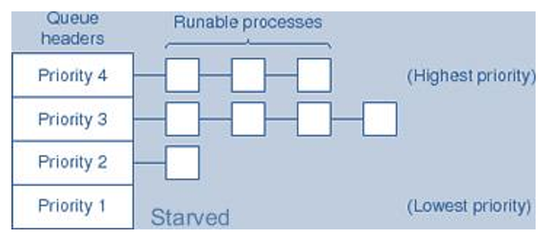
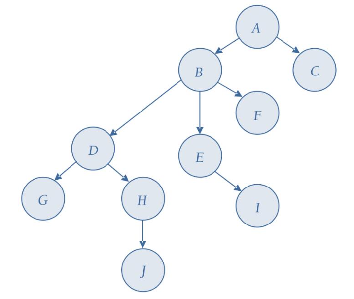
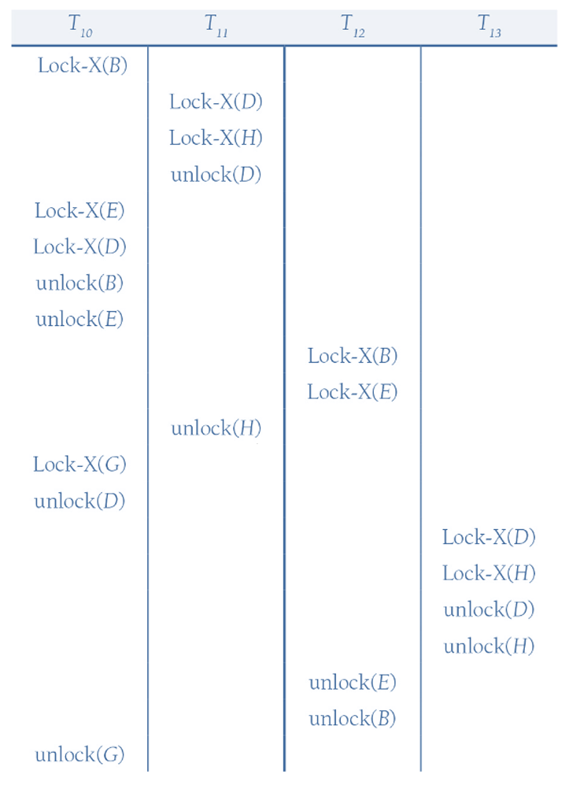

# Capítulo 15 – Processamento de Transações, Controle de Concorrência e Recuperação

## Processamento de Transações

O processamento de transações trata da capacidade que um banco de dados tem de lidar com **operações que representam unidades lógicas de trabalho**. Tais operações **devem ser executadas integralmente ou, em caso de falha, revertidas completamente**, de forma a manter o banco em um estado consistente.

Para entendermos melhor, imagine uma transação bancária. Suponha que um cliente transfira dinheiro de uma conta para outra. Este processo envolve, no mínimo, duas operações: subtrair um valor de uma conta e adicionar este valor à outra. Ambas as operações precisam ocorrer juntas para manter o sistema correto. Se apenas uma for concluída e a outra falhar, surgirá uma inconsistência grave no banco de dados.

A correta implementação de mecanismos de controle de transações protege o banco contra falhas, perdas de dados e inconsistências, garantindo que tudo ocorra da maneira esperada mesmo diante de problemas como quedas de energia, falhas de hardware ou erros de software.

Na figura a seguir, podemos visualizar de forma resumida os elementos básicos envolvidos no ciclo de uma transação:

<div align="center">
  
</div>

### O Problema

O mundo real é movido por transações. No contexto empresarial ou pessoal, uma transação corresponde a qualquer evento no qual ocorre uma troca de valores, informações ou serviços. Isso inclui compras, vendas, transferências financeiras, atualizações cadastrais, reservas, entre outros.

Os sistemas de processamento de transações têm uma missão desafiadora. Eles devem garantir:

- Alta disponibilidade e confiabilidade.
- Processamento eficiente de grandes volumes de dados.
- Segurança contra erros causados por operações simultâneas.
- Prevenção contra registros inconsistentes ou parciais.
- Capacidade de recuperação após falhas, sem perda de dados.
- Crescimento escalável e distribuído.

Por trás de toda essa robustez estão tecnologias como **logs**, **bloqueios**, **controle de concorrência** e **mecanismos de recuperação**, que estudaremos com profundidade ao longo deste capítulo.

### O Que é uma Transação?

De forma conceitual, uma **transação** é uma **unidade lógica de trabalho**, composta por um ou mais comandos que realizam leitura e/ou modificação de dados no banco. Ela é executada de forma atômica, ou seja, ou todas as suas operações são completadas com sucesso, ou nenhuma delas é aplicada.

O sistema responsável por garantir a execução correta de uma transação dentro do SGBD é conhecido como **gerenciador de transações**, que faz parte do núcleo do banco de dados.

Cada transação passa por um ciclo bem definido, no qual é iniciada, executada e, dependendo do sucesso ou falha de suas operações, pode ser **confirmada** (commit) ou **desfeita** (rollback).

Para que um banco de dados seja confiável e robusto, suas transações devem obedecer a quatro propriedades fundamentais, conhecidas pela sigla **ACID**, formada pelas iniciais dos termos em inglês:

<div align="center">
  
</div>

- **Atomicidade (A)** – A transação deve ser executada integralmente ou não ser executada. Se algum erro ocorrer no meio da execução, todas as operações já realizadas são desfeitas. O banco retorna ao estado anterior ao início da transação.
- **Consistência (C)** – O banco de dados deve passar de um estado consistente para outro estado igualmente consistente. As regras de integridade (chaves, restrições, relacionamentos) devem ser sempre preservadas.
- **Isolamento (I)** – As operações de uma transação não devem ser visíveis para outras transações até que sejam confirmadas. Isso garante que transações concorrentes não interfiram umas nas outras.
- **Durabilidade (D)** – Uma vez que uma transação é confirmada, suas alterações no banco de dados não podem ser perdidas, mesmo em caso de falhas no sistema.

Essas propriedades são essenciais para garantir que o banco de dados reflita a realidade do mundo de forma correta e consistente.

### O Fluxo de uma Transação

Para entender como uma transação se comporta internamente dentro do SGBD, é necessário compreender o seu fluxo, representado por uma **máquina de estados**, que mostra os possíveis estados de uma transação ao longo de sua execução.

<div align="center">
  
</div>

Este ciclo pode ser descrito da seguinte maneira:

1. **Ativa (Active)** – A transação inicia sua execução após o comando `BEGIN TRANSACTION`. Neste estado, ela realiza operações de leitura (`read`) e escrita (`write`) nos dados.
2. **Parcialmente Efetivada (Partially Committed)** – Ao concluir suas operações, a transação passa para este estado quando executa o `END TRANSACTION`. Aqui, as operações estão registradas no log, mas ainda não foram efetivamente aplicadas ao banco de dados.
3. **Efetivada (Committed)** – Se tudo ocorrer bem, a transação executa um `COMMIT`, consolidando permanentemente todas as mudanças no banco. A partir daqui, as alterações são definitivas e não podem ser revertidas.
4. **Falha (Failed)** – Caso ocorra algum problema durante a execução (como queda de energia, erro de sistema ou falha de integridade), a transação entra no estado de falha. Suas operações são desfeitas por meio de um `ROLLBACK` automático ou manual.
5. **Encerrada (Terminated)** – A transação deixa o sistema, estando completamente finalizada, seja por sucesso (commit) ou por falha (rollback).

### O Log do Sistema

O **log de transações**, também chamado de **journal**, é um dos principais mecanismos utilizados pelos SGBDs para garantir a atomicidade e durabilidade das transações.

Este log é **um arquivo persistente que registra**, em ordem cronológica, **todos os eventos significativos realizados pelas transações**, incluindo operações de leitura, escrita, início, commit e rollback.

O log **deve ser armazenado em um meio não volátil**, que não seja afetado por falhas do sistema, garantindo que as informações nele contidas estejam sempre disponíveis para recuperação do banco de dados em caso de falhas.

Um ponto extremamente relevante sobre o log é que, além de permitir a recuperação das transações, **ele também é capaz de fornecer rastreabilidade e auditoria**, permitindo identificar quais usuários acessaram ou alteraram determinados dados.

As informações registradas no log geralmente seguem o seguinte padrão:

- `[start_transaction, T]` → Indica o início da transação T.
- `[write_item, T, X, old_value, new_value]` → Registra a alteração de um item X pela transação T, especificando o valor antigo e o novo valor.
- `[read_item, T, X]` → (Opcional) Indica que o item X foi lido pela transação T.
- `[commit, T]` → Marca que a transação T foi efetivada.
- `[abort, T]` → Indica que a transação T foi desfeita.

Dependendo do tipo de controle de transações utilizado, os registros de leitura (`read_item`) podem ou não ser obrigatórios. Eles são fundamentais, por exemplo, quando se deseja manter logs de auditoria.

O log também permite que sejam realizadas duas operações fundamentais para a recuperação de dados:

- **UNDO (Desfazer)** – Usado quando uma transação falha. Permite desfazer as alterações feitas por essa transação, retornando os dados aos valores anteriores.
- **REDO (Refazer)** – Usado quando uma transação foi confirmada (`commit`), mas as alterações ainda não haviam sido fisicamente aplicadas no banco no momento de uma falha. O REDO garante que estas alterações sejam reaplicadas corretamente.

Uma característica importante dessas operações é que ambas são consideradas **idempotentes**, ou seja, podem ser aplicadas várias vezes, e sempre produzirão o mesmo resultado, sem efeitos colaterais adicionais.

Imagine, por exemplo, uma alteração salarial onde o salário de um funcionário é atualizado de R$ 10.000 para R$ 20.000. Se uma falha acontecer após o commit, mas antes da escrita definitiva no banco, a operação de REDO garantirá que o salário seja efetivamente atualizado para R$ 20.000, mesmo que essa operação precise ser aplicada mais de uma vez durante o processo de recuperação.

## Ponto de Efetivação: Garantindo a Confiabilidade das Modificações

Em um ambiente de banco de dados robusto, é fundamental garantir que, ao término de uma transação, as alterações realizadas sobre os dados estejam verdadeiramente consolidadas. Essa consolidação ocorre no chamado **ponto de efetivação** (commit point), um marco lógico e técnico fundamental no ciclo de vida de uma transação.

Dizemos que uma transação T alcançou seu ponto de efetivação quando **todas as suas operações que acessam o banco de dados foram executadas com sucesso** e **os efeitos dessas operações estão completamente registrados no log do sistema**. A partir desse momento, a transação é considerada efetivada, e seu efeito torna-se permanente e irrevogável.

Considere o seguinte cenário: se ocorrer uma falha no sistema e uma transação tiver o registro `[start_transaction, T]` no log, mas não tiver o correspondente `[commit, T]`, essa transação **deve ser revertida** — ou seja, todas as alterações feitas por ela são desfeitas, garantindo a atomicidade. Por outro lado, se o log já contiver o registro de commit, então a transação **deve ser refeita**, se necessário, para garantir que suas modificações estejam refletidas no banco.

Esse controle depende de uma estrutura crítica chamada **checkpoint**.

### Checkpoints: Salvaguardando o Estado do Banco

A operação de checkpoint consiste em um **marco periódico de segurança** no log de transações. Ele representa o momento em que o sistema grava, de maneira forçada, todas as alterações pendentes no disco. Esse mecanismo visa garantir que, mesmo em caso de falhas, a recuperação do banco possa ser feita de maneira eficiente, sem precisar varrer um log interminável desde o seu início.

Durante o processo de checkpoint, o SGBD executa as seguintes ações:

1. **Suspende temporariamente a execução de transações**;
2. **Grava em disco todas as modificações realizadas por transações efetivadas** (esvaziando os buffers de memória);
3. **Insere no log um registro `[checkpoint]`**, que pode conter informações adicionais como:
    - Identificadores das transações ativas;
    - Endereços do primeiro e do último registro no log para cada transação;
4. **Força a escrita do log em disco**;
5. **Retoma a execução normal das transações**.

Esse procedimento assegura que o sistema tenha pontos de restauração consistentes, minimizando o tempo e os recursos exigidos em processos de recuperação.

## Planos de Execução: Definindo a Ordem das Operações

Em sistemas concorrentes, várias transações podem ser executadas simultaneamente. Esse paralelismo traz benefícios em desempenho, mas também desafios. A **ordem de execução** das operações dessas transações precisa ser gerenciada com precisão para garantir que o resultado final seja o mesmo de uma execução sequencial.

Essa ordenação das operações é denominada **plano de execução**, ou **escalonamento**. Um plano de execução S, formado por um conjunto de transações T₁, T₂, ..., Tₙ, deve preservar a **ordem interna** de cada transação, ou seja, a sequência de operações originalmente programadas dentro de cada T<sub>i</sub> deve ser respeitada.

No entanto, operações de transações distintas podem ser **intercaladas**, desde que não haja conflito entre elas. Mas o que caracteriza um conflito?

Duas operações de transações diferentes entram em **conflito** quando:

1. Pertencem a transações distintas;
2. Acessam o mesmo item de dado X;
3. Pelo menos uma delas modifica o item (ou seja, é uma operação de escrita).

Por exemplo, se a transação T₁ lê o item X e T₂ deseja escrevê-lo, ou vice-versa, há conflito.

### Planos Completos e as Condições de Validade

Para que um plano de execução seja considerado **completo**, ele deve satisfazer três condições fundamentais:

1. **Encerramento** – Todas as transações no plano devem ser finalizadas com `commit` ou `abort`;
2. **Ordenação** – A ordem original das operações dentro de cada transação deve ser preservada no plano;
3. **Conflito** – Toda operação conflitante entre transações deve ter uma ordem de execução claramente definida.

Observe que, se **duas operações não forem conflitantes**, a ordem entre elas no plano pode ser flexível, caracterizando o que chamamos de **ordenação parcial**.

Esse modelo flexível permite que o sistema otimize a execução das transações, mantendo a consistência e respeitando a independência lógica entre elas.

### Planos Restauráveis: Evitando o Caos Pós-Falha

Imagine que duas transações estão sendo executadas em paralelo. A transação T₂ lê um valor escrito por T₁. T₂ realiza mais algumas operações e então confirma sua execução com um `commit`. Logo em seguida, T₁ sofre uma falha.

Nesse cenário, temos um problema: T₂ depende de um valor produzido por T₁, que não foi efetivado. T₂, então, **construiu seu raciocínio em cima de uma informação que será descartada**. Isso compromete a integridade dos dados.

É justamente para evitar esse tipo de erro que os **planos restauráveis** são importantes. Um plano é considerado restaurável se, **sempre que uma transação T<sub>j</sub> depender de um valor escrito por T<sub>i</sub>, o commit de T<sub>i</sub> ocorre antes do commit de T<sub>j</sub>**.

Em outras palavras, **nenhuma transação deve se comprometer (fazer commit) com base em dados não confirmados por outras transações**.

Se essa regra for desrespeitada, o sistema poderá sofrer uma **reversão em cascata**: uma falha em uma transação pode provocar a anulação de várias outras, formando um efeito dominó.

Para tornar um plano livre de reversão em cascata, uma regra simples pode ser aplicada: **uma transação só pode ler dados que já foram gravados por transações que executaram o commit**.

Essa ideia está relacionada ao **nível de isolamento “read committed”**, onde os dados lidos sempre vêm de transações confirmadas. Assim, mesmo que uma transação falhe, não haverá necessidade de desfazer outras transações que apenas consumiram dados já válidos.

A figura a seguir ilustra esse conceito, contrastando um plano restaurável com um não restaurável.

<div align="center">
  
</div>

## Serialidade (Serializability)

Ao longo deste capítulo, já compreendemos que o processamento de transações não é simplesmente uma questão de executar comandos de leitura e escrita sobre o banco de dados. Na prática, múltiplas transações podem ser executadas simultaneamente, compartilhando acesso aos mesmos dados. Essa concorrência, embora fundamental para o desempenho dos sistemas modernos, traz consigo riscos significativos para a integridade e a consistência dos dados, caso não seja adequadamente controlada.

Neste contexto, surge um conceito central na teoria dos bancos de dados: a **serialidade**, ou em inglês, **serializability**. A serialidade é uma propriedade teórica que permite garantir que, mesmo executando diversas transações concorrentemente, o resultado final no banco de dados seja equivalente ao resultado que obteríamos se essas mesmas transações fossem executadas sequencialmente, uma de cada vez, sem nenhuma sobreposição.

De maneira simples, podemos dizer que um **plano de execução é serial** quando todas as operações de uma transação são executadas completamente, do início ao fim, antes que qualquer operação de outra transação comece. Em outras palavras, apenas uma transação está ativa por vez, sem nenhuma intercalação de operações. Embora esse modelo seja o ideal do ponto de vista da integridade dos dados, ele se torna impraticável na maioria dos cenários do mundo real, já que elimina os benefícios da concorrência, prejudicando severamente o desempenho dos sistemas.

Por isso, na prática, permitimos que as operações das transações sejam intercaladas. No entanto, essa intercalação não pode ser feita de maneira arbitrária. Surge então a necessidade de estabelecer restrições que assegurem que esse plano intercalado seja **serializável**, isto é, que seu resultado final seja equivalente ao de algum plano serial possível.

### A Importância da Serialidade

Para ilustrar, imagine uma situação muito comum em um sistema bancário. Suponha que duas transações, T₁ e T₂, desejam, ao mesmo tempo, realizar saques de R$100,00 na mesma conta, que possui exatamente R$100,00 de saldo.

Se ambas as transações lerem o saldo da conta antes que qualquer uma delas atualize o valor, ambas concluirão que há saldo suficiente e prosseguirão com o saque. O resultado? A conta, que possuía apenas R$ 100,00, ficará com saldo negativo de R$ -100,00, uma violação grave das regras do negócio e da integridade dos dados.

Perceba que ambas as transações foram executadas até o fim. Portanto, do ponto de vista da atomicidade, elas estão corretas — ou seja, cada uma foi executada de forma completa ou não executada. No entanto, elas falharam em respeitar o **isolamento**, que é outra propriedade fundamental das transações. A execução simultânea dessas transações gerou um resultado que jamais ocorreria em uma execução serial, onde a primeira transação executada zeraria o saldo e impediria que a segunda transação prosseguisse.

A **serialidade**, portanto, não se confunde com atomicidade. Enquanto a atomicidade garante que cada transação seja concluída por inteiro ou desfeita por completo, a serialidade assegura que a execução conjunta de diversas transações, mesmo quando concorrente, preserve a consistência do banco de dados como se essas transações tivessem sido executadas sequencialmente.

### Serialidade e a Propriedade de Isolamento

Existe uma relação direta entre a propriedade de isolamento, uma das quatro propriedades ACID das transações, e a serialidade. Dizemos que um sistema oferece isolamento total se todo plano de execução concorrente for serializável. Isso significa que, do ponto de vista de qualquer transação, é como se ela estivesse sendo executada isoladamente, sem interferência das outras.

Portanto, garantir serialidade é uma forma de garantir isolamento, e, por consequência, de assegurar que o banco de dados permaneça sempre em estados consistentes, independentemente da ordem em que as transações sejam executadas.

### Equivalência de Planos: Como Avaliar a Serialidade

Para determinar se um plano de execução é serializável, é necessário definir critérios de equivalência entre planos.

#### Equivalência de Resultado

Dois planos são considerados equivalentes por resultado se, ao final da execução, o estado do banco de dados for idêntico nos dois casos. Esse critério é bastante intuitivo, mas, na prática, pode ser difícil de verificar, já que exige a execução completa dos planos para comparação.

#### Equivalência de Conflito

Na prática, utiliza-se mais frequentemente o conceito de **equivalência de conflito**, que foca na ordem das operações que podem gerar efeitos diferentes se forem executadas fora de ordem.

Duas operações estão em conflito se:

1. Pertencem a transações diferentes;
2. Acessam o mesmo item de dado;
3. Pelo menos uma dessas operações é uma escrita.

Se dois planos preservam a mesma ordem relativa para todas as operações em conflito, dizemos que eles são equivalentes por conflito.

Dessa forma, um plano é considerado **serializável** se ele é equivalente, por conflito, a algum plano serial possível.

#### Equivalência de Visão

Outro conceito importante é a **equivalência de visão**, que, embora menos restritivo que a equivalência de conflito, ainda assegura resultados consistentes.

Dois planos são equivalentes por visão se:

- As mesmas transações participam dos dois planos;
- Cada operação de leitura lê o mesmo valor em ambos os planos;
- As últimas operações de escrita em cada item de dado são as mesmas nos dois planos.

Em outras palavras, do ponto de vista dos dados que são lidos e dos valores finais armazenados, ambos os planos são indistinguíveis.

### O Grafo de Precedência: Ferramenta para Análise de Serialidade

Uma das ferramentas mais poderosas para verificar se um plano é serializável é o **grafo de precedência**.

<div align="center">
  
</div>

O grafo é construído da seguinte forma:

1. Para cada transação T<sub>i</sub> no plano, criamos um nó no grafo;
2. Sempre que uma operação de leitura de T<sub>j</sub> ocorre depois de uma operação de escrita de T<sub>i</sub> sobre o mesmo item, adicionamos uma aresta T<sub>i</sub> → T<sub>j</sub>;
3. O mesmo ocorre se uma escrita de T<sub>j</sub> ocorre após uma leitura ou escrita de T<sub>i</sub> sobre o mesmo item;
4. Se, após a construção do grafo, **não houver ciclos**, o plano é considerado serializável;
5. Se houver um ciclo, isso indica uma dependência circular que impede a equivalência com qualquer plano serial — logo, o plano não é serializável.

### Serialidade na Prática: Mecanismos de Controle

O que os bancos de dados fazem, então, para garantir a serialidade?

A resposta está nos **protocolos de controle de concorrência**, como:

- Protocolo de bloqueio em duas fases (2PL);
- Timestamp Ordering;
- Serialização baseada em vetores ou versões.

Esses mecanismos têm como objetivo garantir que, mesmo permitindo a execução concorrente, o sistema mantenha a ilusão de um processamento serial, protegendo os dados contra inconsistências e anomalias.

## Suporte a Transações em SQL

Ao longo dos tópicos anteriores, desenvolvemos uma sólida compreensão conceitual sobre o que são transações e como elas se comportam dentro do Sistema Gerenciador de Banco de Dados (SGBD). Agora é o momento de entender como o SQL, a principal linguagem de comunicação com os SGBDs relacionais, implementa o suporte prático às transações.

Desde as primeiras versões da norma SQL ANSI, o conceito de transação foi introduzido como uma estrutura fundamental para garantir a consistência e a integridade dos dados. E isso não mudou. Pelo contrário, ao longo dos anos, os mecanismos de transação foram aperfeiçoados e são hoje um dos pilares dos bancos de dados modernos.

### O Papel das Transações em SQL

Uma transação, dentro do contexto SQL, é definida como uma **unidade lógica de trabalho**, composta por um conjunto de operações que devem ser executadas de forma atômica. Isso significa que ou todas as operações dentro da transação são efetivadas no banco de dados, ou nenhuma delas será. É essa propriedade que protege o banco contra inconsistências, especialmente em ambientes onde múltiplos usuários ou processos atuam simultaneamente.

Sempre que um comando de modificação é emitido — como um `INSERT`, `UPDATE` ou `DELETE` — esse comando faz parte de uma transação. Por padrão, a maioria dos SGBDs adota uma política de **autocommit**, ou seja, cada comando individual é tratado como uma transação que é automaticamente confirmada após sua execução. No entanto, o controle explícito de transações é altamente recomendado sempre que há múltiplas operações interdependentes que precisam ser realizadas de forma conjunta e segura.

Os principais comandos de gerenciamento de transações do SQL padrão estão listados na tabela abaixo:

| Comando | Descrição |
|---|---|
| START (BEGIN) TRANSACTION | Inicializa uma transação SQL e seta as suas características. |
| SET TRANSACTION | Determina as propriedades da próxima transação SQL para o SQL Agent. São três os parâmetros: área de diagnóstico, nível de isolamento e modos de acesso (read/write). |
| SET CONSTRAINTS | Se a transação SQL estiver executando, estabelece o modo de restrições para a transação SQL na sessão corrente. Se não existe nenhuma transação em andamento na sessão, determina ao SQL Agent o modo de execução para a próxima transação. |
| SAVEPOINT | Estabelece um savepoint, ponto intermediário da transação para o qual o rollback deve retornar em caso de falha. |
| RELEASE SAVEPOINT | Destrói um savepoint |
| COMMIT | Termina a transação SQL corrente com um commit |
| ROLLBACK | Termina a transação corrente com um rollback, ou desfaz todas as modificações até o último savepoint. |

### Estrutura e Controle de Transações no SQL

O SQL oferece comandos específicos para que o desenvolvedor tenha controle total sobre o ciclo de vida de uma transação. Estes comandos estabelecem o ponto de início, permitem definir pontos intermediários, e controlam o commit ou rollback da transação.

Assim, uma transação normalmente é iniciada com um comando `BEGIN TRANSACTION` (ou `START TRANSACTION`, dependendo do SGBD) e segue seu fluxo até ser concluída com sucesso por meio de um `COMMIT`, ou, em caso de erro, ser revertida com um `ROLLBACK`.

Por exemplo, imagine um cenário em que uma empresa deseje inserir um novo funcionário no sistema e, simultaneamente, atualizar o salário de todos os empregados de um determinado departamento. Ambas as ações devem ocorrer juntas: se uma falhar, a outra não deve ser aplicada.

O controle dessa operação é feito da seguinte forma:

```sql
BEGIN TRANSACTION;

INSERT INTO EMPREGADO (PNOME, UNOME, SSN, DNO, SALARIO)
VALUES ('Thiago', 'Cavalcanti', 000457878, 2, 12000);

UPDATE EMPREGADO
SET SALARIO = SALARIO * 1.1
WHERE DNO = 2;

COMMIT;
```

Caso ocorra algum erro no meio da execução — por exemplo, uma violação de integridade ou uma falha no sistema — a transação poderia ser revertida com:

```sql
ROLLBACK;
```

### Savepoints: Controle Intermediário

Uma funcionalidade adicional oferecida pelo SQL é a criação de **savepoints**, ou pontos de salvamento dentro de uma transação. Eles permitem que o desenvolvedor defina marcos intermediários e, em caso de erro, execute um rollback apenas até o savepoint, e não necessariamente desfazendo toda a transação.

Imagine o seguinte cenário: dentro de uma transação, você realiza uma série de operações. Uma parte delas é sensível e pode apresentar risco de falha, enquanto outras partes estão corretas e você deseja preservá-las, mesmo se ocorrer um problema.

O uso do savepoint seria assim:

```sql
BEGIN TRANSACTION;

SAVEPOINT inicio;

INSERT INTO EMPREGADO (PNOME, UNOME, SSN, DNO, SALARIO)
VALUES ('Thiago', 'Cavalcanti', 000457878, 2, 12000);

SAVEPOINT depois_do_insert;

UPDATE EMPREGADO
SET SALARIO = SALARIO * 1.1
WHERE DNO = 2;

-- Suponha que esse update gere um erro, podemos fazer:
ROLLBACK TO depois_do_insert;

COMMIT;
```

Perceba que, com isso, preservamos a inserção do novo funcionário e apenas desfazemos as alterações nos salários.

### Níveis de Isolamento em SQL

Ao permitir que várias transações sejam executadas simultaneamente, surge um desafio: como garantir que uma transação não interfira nos dados de outra de maneira indevida? A resposta está nos **níveis de isolamento**, que definem até que ponto uma transação pode ser afetada pelas ações de outras transações em execução.

O SQL ANSI define quatro níveis de isolamento, cada um com diferentes garantias de integridade e diferentes impactos sobre o desempenho:

- **Read Uncommitted:** Este é o nível mais baixo de isolamento. Permite que uma transação leia dados que foram modificados por outra transação, mas que ainda não foram confirmados. Isso pode gerar o fenômeno chamado de **leitura suja (dirty read)**, onde dados temporários ou possivelmente inválidos são visualizados.
- **Read Committed:** Neste nível, uma transação só pode ler dados que já foram confirmados (**committed**) por outras transações. Elimina o problema da leitura suja, mas ainda permite outro tipo de problema chamado **leitura não repetível**, quando um mesmo dado retorna valores diferentes em leituras subsequentes dentro da mesma transação.
- **Repeatable Read:** Aqui, uma transação garante que, se ela leu um dado uma vez, qualquer leitura subsequente daquele dado retornará exatamente o mesmo valor. Elimina a leitura não repetível. Entretanto, ainda permite a ocorrência de **phantom reads**, ou **leituras fantasmas**, quando novos registros são inseridos por outras transações durante a execução.
- **Serializable:** Este é o nível mais alto de isolamento e garante uma execução completamente serializável. Ou seja, o efeito das transações será o mesmo que seria obtido se elas fossem executadas uma após a outra, sem nenhuma sobreposição. Esse nível elimina todos os tipos de anomalias, mas tem um custo de desempenho consideravelmente mais alto, pois impõe o máximo de restrições sobre o acesso concorrente.

Para deixar ainda mais claro, vejamos uma breve explicação dos problemas que os níveis de isolamento tentam resolver:

- **Leitura Suja (Dirty Read):** Ocorre quando uma transação lê dados que foram modificados por outra transação que ainda não foi confirmada. Se essa outra transação for revertida, a primeira terá lido um dado inválido.
- **Leitura Não Repetível (Non-Repeatable Read):** Acontece quando uma transação lê um dado, e antes que ela o leia novamente, outra transação modifica esse mesmo dado e confirma a alteração.
- **Leitura Fantasma (Phantom Read):** Surge quando, durante uma transação, são feitas duas consultas idênticas com condições de filtro, e entre essas duas consultas outra transação insere ou remove linhas que atendem aos mesmos critérios de seleção.

A seguir temos um quadro que resume quais problemas são evitados em cada nível de isolamento:

<div align="center">
  
</div>

### Modo de Acesso e Área de Diagnóstico

Além dos níveis de isolamento, o SQL permite configurar dois outros aspectos relevantes para o processamento das transações:

- **Modo de Acesso:** A transação pode ser declarada como **READ ONLY**, quando não fará modificações no banco, ou como **READ WRITE**, quando poderá tanto consultar quanto alterar os dados. Essa declaração pode ser usada para otimização, já que o SGBD pode aplicar algoritmos menos custosos para transações apenas de leitura.
- **Área de Diagnóstico:** Essa configuração define o tamanho da área de memória usada para armazenar informações sobre erros, exceções e avisos que ocorrem durante a execução das operações SQL dentro da transação. Permite, assim, que o programa que executa a transação possa tomar decisões mais inteligentes e robustas frente aos erros.

## Controle de Concorrência

### A Importância do Controle de Concorrência

Vivemos em um mundo no qual os sistemas são, em sua grande maioria, multiusuário. Desde o simples acesso simultâneo a uma plataforma de streaming até operações mais críticas, como reservas de passagens aéreas, sistemas de inventário, plataformas bancárias e redes sociais. Todos esses ambientes compartilham uma necessidade fundamental: permitir que várias operações sejam realizadas sobre os mesmos dados, de maneira simultânea, sem que haja perda de integridade ou inconsistências no banco de dados.

Imagine um sistema de reservas de passagens aéreas, no qual vários agentes, tanto nas agências físicas quanto nos sites, estão tentando reservar o mesmo assento em um voo. Ou pense em uma indústria onde vários funcionários, de diferentes setores, estão ao mesmo tempo atualizando os registros de estoque. Se cada operação não for cuidadosamente coordenada, o sistema pode acabar confirmando duas reservas para o mesmo assento, ou informando que há no estoque um item que já foi vendido minutos antes. Esse tipo de problema, se não controlado, pode ter consequências catastróficas tanto para a operação quanto para a credibilidade de uma organização.

<div align="center">
  
</div>

De fato, quando múltiplas transações acessam os mesmos dados, a situação é relativamente tranquila enquanto essas transações realizam apenas leituras. Afinal, ler não altera o estado dos dados. Porém, a situação muda radicalmente quando diferentes transações precisam atualizar os mesmos registros de maneira concorrente. É aqui que surgem os grandes desafios, que vão desde inconsistências no banco até a perda de atualizações importantes. E é exatamente para resolver esses desafios que entra em cena o **Controle de Concorrência**.

O controle de concorrência é o mecanismo utilizado pelo Sistema Gerenciador de Banco de Dados (SGBD) para garantir que, mesmo com diversas transações executando de forma concorrente, o resultado final seja consistente, como se essas transações tivessem sido executadas uma após a outra, de forma sequencial.

### Por Que Precisamos do Controle de Concorrência?

De maneira sistemática, os problemas que surgem da execução concorrente de transações podem ser classificados em algumas categorias bem definidas. O primeiro e talvez mais evidente deles é a **atualização perdida**, que ocorre quando duas transações leem o mesmo dado e, logo em seguida, ambas escrevem sobre ele, sem considerar a modificação feita pela outra. O resultado? A última gravação simplesmente sobrescreve a anterior, como se ela nunca tivesse existido.

Outro problema típico envolve leituras inconsistentes, nas quais uma transação lê um dado que está em processo de modificação por outra transação, obtendo assim uma informação temporária ou incorreta.

Diante desse cenário, a concorrência, apesar de ser uma propriedade desejável — afinal, melhora a performance geral do sistema, permite um melhor aproveitamento dos recursos computacionais e oferece uma experiência mais fluida aos usuários —, também traz riscos. E é responsabilidade do SGBD administrar esses riscos.

O grande desafio, portanto, está em permitir que múltiplas transações sejam executadas em paralelo, maximizando o desempenho e a escalabilidade, sem abrir mão da consistência e da integridade dos dados.

Para enfrentar esse desafio, o SGBD implementa um conjunto de técnicas, conhecidas como **protocolos de controle de concorrência**, entre as quais se destacam os protocolos de bloqueio (locks), controle por timestamp e técnicas baseadas em grafos. Nesta etapa, focaremos especialmente no mecanismo mais tradicional e amplamente utilizado: o controle por bloqueios.

### Técnicas de Bloqueio: Fundamentando o Controle de Concorrência

O conceito de bloqueio, ou **lock**, é essencial para qualquer discussão sobre controle de concorrência. De forma bastante simplificada, um lock é uma variável associada a um item de dado do banco, que indica se esse item está disponível ou não para determinadas operações — seja uma leitura, seja uma escrita.

Quando uma transação deseja acessar um item, ela precisa, primeiramente, obter um lock sobre esse item. Esse lock sinaliza ao SGBD que a transação está utilizando aquele dado e, portanto, outros acessos simultâneos devem ser controlados de acordo com as regras definidas pelo tipo de lock estabelecido.

#### Bloqueio Binário: O Modelo Mais Simples

No modelo mais simples de bloqueio, conhecido como **bloqueio binário**, cada item do banco de dados pode estar em um de dois estados: **locked** (bloqueado) ou **unlocked** (desbloqueado). Antes de realizar qualquer operação, uma transação precisa solicitar o bloqueio do item. Enquanto ela detiver esse bloqueio, nenhuma outra transação poderá acessar o item — nem para leitura, nem para escrita.

<div align="center">
  
</div>

Quando a transação conclui suas operações, libera o bloqueio, permitindo que outras transações acessem o dado.

Embora funcional, esse modelo possui uma grande limitação: ele impede até mesmo operações de leitura concorrente, o que, na prática, pode reduzir drasticamente o desempenho do sistema, já que leituras simultâneas não representam risco de inconsistência.

#### Bloqueio Múltiplo: A Evolução Natural

Para superar as limitações do bloqueio binário, surge o conceito de **bloqueio múltiplo**, também conhecido como bloqueio compartilhado/exclusivo.

Neste modelo, os locks podem assumir dois tipos:

- **Bloqueio de Leitura (Read Lock ou Shared Lock):** Permite que múltiplas transações leiam o mesmo dado simultaneamente, desde que nenhuma delas deseje escrever sobre ele.
- **Bloqueio de Escrita (Write Lock ou Exclusive Lock):** Garante acesso exclusivo ao dado. Enquanto uma transação possui um write lock sobre um item, nenhuma outra — seja para leitura, seja para escrita — pode acessá-lo.

<div align="center">
  
</div>

O funcionamento desse modelo é bem intuitivo. Se uma transação deseja apenas ler um dado, ela solicita um read lock. Outras transações podem fazer o mesmo, sem problema algum. Porém, se uma delas quiser modificar esse dado, precisará esperar até que todos os read locks sejam liberados e, então, obter um write lock exclusivo.

#### Incremento e Decremento de Locks

Uma característica interessante do modelo de bloqueio múltiplo é a possibilidade de **incrementar** ou **decrementar** o nível de lock. Imagine uma transação que inicialmente apenas lê um dado e, no decorrer de sua execução, percebe que precisará alterá-lo. Nesse caso, ela pode solicitar um upgrade do seu lock, passando de read lock para write lock — desde que nenhuma outra transação esteja atualmente lendo aquele dado. Este processo é chamado de **incremento de lock**.

O caminho inverso, embora menos comum, também pode ocorrer. Se uma transação detinha um write lock, mas concluiu suas operações de escrita e deseja continuar apenas lendo o dado, ela pode **decrementar o lock**, convertendo-o em um read lock. Isso libera espaço para que outras transações possam também fazer leituras simultâneas sobre aquele item.

### Regras de Funcionamento dos Locks

Para que o sistema de locks funcione de forma eficiente e segura, algumas regras precisam ser rigorosamente seguidas:

1. **Antes de ler, bloqueie para leitura.**  
    Qualquer transação que deseje ler um dado deve primeiro obter um read lock sobre ele.
2. **Antes de escrever, bloqueie para escrita.**  
    Para modificar um dado, é obrigatório que a transação possua um write lock, o que impede que qualquer outra transação acesse aquele item durante o processo.
3. **Ao finalizar, libere os bloqueios.**  
    Assim que uma transação conclui suas operações — seja porque finalizou corretamente, seja porque precisou ser revertida —, ela deve liberar todos os locks que mantém, permitindo que outros processos possam acessar os dados.
4. **Bloqueio exclusivo impede qualquer outro acesso.**  
    Se uma transação detém um write lock sobre um item, nenhuma outra, nem mesmo para leitura, pode acessá-lo até que o lock seja liberado.
5. **Vários bloqueios de leitura são permitidos.**  
    Desde que não haja um bloqueio de escrita ativo, múltiplas transações podem possuir read locks simultaneamente sobre o mesmo dado.

### Limitações dos Locks: Serialização Não Garantida

É importante compreender que, embora o sistema de bloqueios controle o acesso simultâneo aos dados, ele não é, por si só, suficiente para garantir que o plano de execução das transações seja sempre serializável. Isto é, ainda pode ocorrer que uma sequência específica de obtenção e liberação de locks leve a resultados não equivalentes a uma execução sequencial das transações.

Por essa razão, além dos locks, os SGBDs implementam protocolos adicionais, como o **Protocolo de Bloqueio em Duas Fases (2PL)**, que veremos a seguir, projetados especificamente para assegurar a serialização dos planos de execução.

### Protocolo de Bloqueio em Duas Fases (2PL)

Quando falamos sobre garantir a integridade e a consistência dos dados em ambientes de múltiplos usuários, especialmente quando há atualizações concorrentes, é impossível não destacar a importância dos protocolos de bloqueio. Dentre eles, o **Protocolo de Bloqueio em Duas Fases**, conhecido como **2PL (Two-Phase Locking)**, é um dos mais amplamente utilizados pelos Sistemas Gerenciadores de Banco de Dados (SGBDs) comerciais.

O funcionamento do protocolo 2PL é relativamente intuitivo, embora seu impacto seja profundo na preservação da consistência e da propriedade de isolamento das transações. Como o próprio nome sugere, este protocolo se baseia na divisão do ciclo de vida da transação em duas fases bem definidas:

- **Fase de Expansão (Growing Phase)**: nesta etapa, a transação pode solicitar e obter bloqueios conforme for necessário para realizar suas operações. No entanto, ela não pode liberar nenhum bloqueio. Ou seja, ela pode apenas “acumular” locks.
- **Fase de Encolhimento (Shrinking Phase)**: assim que a transação libera seu primeiro bloqueio, ela entra na fase de encolhimento. A partir deste ponto, não pode mais solicitar novos bloqueios; pode apenas liberá-los até concluir sua execução.

O instante exato em que a transação realiza sua primeira operação de liberação de lock define o chamado **ponto de bloqueio**, que marca a transição da fase de expansão para a fase de encolhimento. A figura abaixo ilustra esse conceito de maneira clara:

<div align="center">
  
</div>

Ao impor essa disciplina no uso dos bloqueios, o protocolo 2PL assegura que os planos de execução sejam **serializáveis**, ou seja, que o resultado da execução concorrente seja equivalente a alguma execução sequencial das transações.

### Variações do Protocolo 2PL

Com o passar dos anos, surgiram algumas variações do protocolo básico de duas fases, cada uma delas tentando resolver desafios específicos ou atender a requisitos operacionais diferentes.

- **2PL Conservador (ou Estático)**: nesta abordagem, a transação deve obter todos os bloqueios de que precisa logo no início de sua execução, antes de realizar qualquer operação sobre os dados. Se algum dos bloqueios não estiver disponível, a transação simplesmente não inicia. Essa estratégia elimina a possibilidade de deadlock, porém, compromete bastante o paralelismo, tornando a execução menos eficiente.
- **2PL Estrito (Strict 2PL)**: considerado o mais utilizado na prática, este protocolo exige que todos os bloqueios de escrita sejam mantidos até que a transação alcance o commit ou o abort. Isso simplifica bastante os mecanismos de recuperação, pois garante que os dados modificados por uma transação só serão visíveis para outras transações após sua efetivação.
- **2PL Rigoroso (Rigorous 2PL)**: é ainda mais restritivo que o estrito, pois impõe que **todos os bloqueios**, tanto de leitura quanto de escrita, sejam mantidos até que a transação finalize, seja com sucesso (commit) ou por falha (rollback). Embora adote uma estratégia extremamente segura, sua principal desvantagem é a redução significativa do grau de concorrência.

<div align="center">
  
</div>

A escolha entre essas variações deve levar em conta as características específicas do ambiente operacional, os requisitos de desempenho e os níveis de risco tolerados em relação a inconsistências e bloqueios.

### Problemas Clássicos no Controle de Concorrência: Deadlock, Livelock e Starvation

Embora os protocolos de bloqueio sejam eficazes para garantir a consistência e a serializabilidade, eles não estão isentos de desafios. O principal deles é o **deadlock**, que ocorre quando duas ou mais transações entram em um ciclo de espera mútua, onde cada uma aguarda que a outra libere um recurso para prosseguir. Nenhuma delas, no entanto, é capaz de avançar.

Imagine três transações A, B e C, e três recursos R, S e T. Se A bloqueia R e tenta obter S, que já está bloqueado por B, e B tenta obter T, que está com C, e C tenta obter R, que está com A, então temos um ciclo de dependência que caracteriza exatamente um deadlock. A figura a seguir ilustra esse cenário:

<div align="center">
  
</div>

#### Estratégias de Prevenção de Deadlock

Algumas técnicas foram desenvolvidas para tentar prevenir a ocorrência de deadlocks. Dentre elas, destacam-se:

- **Protocolo Conservador:** impede que uma transação inicie caso não consiga obter todos os bloqueios de que necessita. Embora eficaz na eliminação de deadlocks, essa abordagem penaliza o paralelismo.
- **Protocolo Ordenado:** impõe uma ordem global sobre todos os itens de dados. As transações devem solicitar os bloqueios seguindo estritamente essa ordem. Isso evita ciclos de espera e, consequentemente, deadlocks.

Outra abordagem envolve o uso de algoritmos específicos que gerenciam conflitos de bloqueios quando eles ocorrem:

- **Wait-Die:** se a transação que solicita o bloqueio é mais antiga que aquela que mantém o bloqueio, ela pode esperar. Caso contrário, ela é abortada (morre) e reiniciada mais tarde com o mesmo timestamp.
- **Wound-Wait:** inverte a lógica do wait-die. Se a transação que solicita o bloqueio é mais antiga, ela força a mais nova a ser abortada (ferida). Se for mais nova, ela simplesmente espera.

Um ponto importante nesses algoritmos é que as transações, quando reiniciadas, mantêm seus timestamps originais, garantindo que não ocorram ciclos infinitos de espera.

#### Detecção e Quebra de Deadlocks

Mesmo com protocolos de prevenção, deadlocks podem ocorrer. Por isso, muitos SGBDs adotam mecanismos de **detecção de deadlocks**, que monitoram o sistema periodicamente ou continuamente. Ao identificar um ciclo de espera no grafo de bloqueios, o sistema seleciona uma das transações envolvidas como vítima e força seu rollback para quebrar o ciclo.

A escolha da vítima pode se basear em critérios como:

- A transação mais recente.
- A transação que mantém o menor número de bloqueios.
- A transação que realizou o menor volume de atualizações até aquele ponto.

O objetivo é minimizar o impacto da resolução do deadlock sobre o restante do sistema.

### Livelock e Starvation: Desafios Adicionais

Se o deadlock é caracterizado por uma paralisação mútua, o **livelock** representa uma situação na qual as transações continuam ativas, mas não conseguem progredir, porque estão constantemente cedendo prioridade umas às outras. Imagine duas pessoas que tentam se desviar no corredor e, ao escolherem sempre o mesmo lado, ficam presas num ciclo infinito de movimentos sem avançar. A analogia é perfeita para ilustrar o livelock.

<div align="center">
  
</div>

A solução mais comum para esse problema é adotar políticas como **first-come-first-served** (ordem de chegada) ou aumentar progressivamente a prioridade das transações que estão esperando há mais tempo.

O **starvation**, por sua vez, é um problema relacionado, no qual uma transação é constantemente preterida em favor de outras, geralmente por ter uma prioridade mais baixa. Isso pode ocorrer quando os algoritmos de controle escolhem repetidamente a mesma transação como vítima de deadlocks, fazendo com que ela nunca consiga concluir sua execução.

<div align="center">
  
</div>

Técnicas como os próprios protocolos **wait-die** e **wound-wait** ajudam a mitigar o problema de starvation, pois garantem que, com o passar do tempo, as transações mais antigas acabam tendo prioridade para acessar os recursos.

### Protocolo Baseado em Grafos

Uma abordagem alternativa e eficiente para o controle de concorrência é o uso do **protocolo baseado em grafos**, também conhecido como **protocolo de árvore (tree protocol)**. Esse protocolo impõe uma estrutura hierárquica sobre os dados, na forma de um grafo acíclico (geralmente uma árvore), para ordenar e controlar o acesso concorrente.

A regra fundamental desse protocolo é que, depois de bloquear um item de dado, uma transação só pode bloquear outros itens se eles forem descendentes diretos ou indiretos do item previamente bloqueado no grafo. Isso impede que ciclos de espera ocorram, eliminando, portanto, a possibilidade de deadlocks.

O funcionamento do protocolo pode ser descrito da seguinte forma:

- O primeiro bloqueio realizado por uma transação pode ser feito sobre qualquer item de dado no grafo.
- Após o primeiro bloqueio, uma transação só pode solicitar o bloqueio de um item se já tiver bloqueado todos os seus **pais** no grafo.
- Um item de dado pode ser desbloqueado a qualquer momento, não precisando aguardar o término da transação.
- Uma vez que um item tenha sido desbloqueado, ele **não pode ser novamente bloqueado** pela mesma transação.

Esse modelo se adapta muito bem a aplicações onde existe uma hierarquia natural nos dados, como sistemas de arquivos, estruturas de diretórios, ou modelos de dados em árvore.

Na figura abaixo, observamos como um grafo de dados estruturado em árvore organiza os itens de dado. Em seguida, é apresentado um plano de execução (schedule) serializável, construído seguindo estritamente as regras deste protocolo.

<div align="center">
  
</div>

<div align="center">
  
</div>

O grande benefício deste protocolo é que ele garante a serializabilidade dos planos de execução, **sem a necessidade de uma fase de encolhimento**, como ocorre nos protocolos de bloqueio em duas fases (2PL). Além disso, elimina completamente o risco de deadlocks, ao custo de restringir a ordem na qual os dados podem ser acessados.

## Controle de Concorrência por Ordenação de Timestamp

Outra estratégia bastante poderosa e adotada por alguns sistemas é o controle de concorrência com base em **ordenação de timestamps**. Neste protocolo, cada transação recebe, no momento em que inicia, um **timestamp único e imutável**, que representa sua ordem temporal em relação às demais transações.

Esse timestamp pode ser gerado de duas maneiras principais:

1. **Relógio físico do sistema:** o timestamp corresponde à data e hora exata (em milissegundos, por exemplo) em que a transação foi iniciada.
2. **Contador lógico:** o sistema mantém um contador que é incrementado sempre que uma nova transação é criada. Assim, cada transação recebe um número sequencial crescente como timestamp.

A ideia fundamental desse protocolo é garantir que a execução das operações seja equivalente a uma execução serial ordenada pelos timestamps das transações. Em outras palavras, se uma transação T<sub>i</sub> recebeu um timestamp TS(T<sub>i</sub>) menor que o de T<sub>j</sub> (TS(T<sub>j</sub>)), então T<sub>i</sub> deve parecer ter sido executada antes de T<sub>j</sub> no ponto de vista do banco de dados.

Na prática, cada item de dado Q no banco de dados mantém dois metadados importantes:

- **W-timestamp(Q):** timestamp da última transação que realizou uma operação de escrita sobre Q.
- **R-timestamp(Q):** timestamp da última transação que realizou uma operação de leitura sobre Q.

O protocolo então se baseia em regras específicas para decidir se uma operação de leitura ou escrita pode ser executada, ou se a transação deve ser rejeitada e reiniciada.

**Cenário de Leitura (read(Q)):**

- Se **TS(T<sub>i</sub>) < W-timestamp(Q)**, significa que T<sub>i</sub> está tentando ler um valor que foi sobrescrito por uma transação mais recente. Como isso violaria a ordem de timestamps, a leitura é **rejeitada** e a transação T<sub>i</sub> é **abortada** e reiniciada com um novo timestamp.
- Se **TS(T<sub>i</sub>) ≥ W-timestamp(Q)**, então a leitura é **permitida**, e o sistema atualiza R-timestamp(Q) para o maior valor entre o próprio R-timestamp(Q) e TS(T<sub>i</sub>).

**Cenário de Escrita (write(Q)):**

- Se **TS(T<sub>i</sub>) < R-timestamp(Q)**, significa que algum dado foi lido por uma transação mais recente que deveria, segundo a ordem dos timestamps, ter ocorrido após T<sub>i</sub>. Isso invalida a escrita de T<sub>i</sub>, que então é **abortada**.
- Se **TS(T<sub>i</sub>) < W-timestamp(Q)**, significa que T<sub>i</sub> está tentando sobrescrever um valor que já foi escrito por uma transação mais recente. Isso também é inconsistente com a ordem de timestamps, então a operação é **rejeitada** e T<sub>i</sub> é **abortada**.
- Caso contrário, a operação de escrita é **permitida**, e o sistema atualiza W-timestamp(Q) para TS(T<sub>i</sub>).

Como exemplo, imagine dois caixas de um supermercado operando simultaneamente sobre o mesmo banco de dados. Uma transação T<sub>1</sub> inicia às 10h00 (TS=100) e deseja atualizar o estoque do produto "Leite". Logo após, às 10h01 (TS=101), inicia a transação T<sub>2</sub>, que também lê o estoque do mesmo produto.

Se T<sub>2</sub> faz a leitura antes que T<sub>1</sub> tenha gravado sua atualização, não há problema, pois os timestamps estão na ordem correta. Contudo, se T<sub>1</sub> tenta gravar um valor que T<sub>2</sub> já leu, então essa gravação viola a ordem temporal (T<sub>2</sub> parece estar “no futuro” em relação a T<sub>1</sub>). Nesse caso, T<sub>1</sub> deverá ser abortada e reiniciada, garantindo que a execução seja equivalente a uma serialização ordenada pelos timestamps.

O grande benefício desse protocolo é que ele **não exige bloqueios**, o que elimina qualquer risco de deadlocks. Contudo, ele pode levar a um número elevado de **abortos e reinícios de transações**, especialmente em sistemas altamente concorrentes. Assim, ele é mais eficiente em cenários com muitas operações de leitura e poucos conflitos de escrita.

