# Capítulo 16 – Alta Disponibilidade, Replicação e Balanceamento de Carga

Adentramos agora um domínio mais pragmático e estratégico da administração de bancos de dados. A busca pela **alta disponibilidade** (High Availability - HA), um sistema que opera continuamente sem interrupções, é uma preocupação constante para os profissionais de tecnologia da informação. Para os administradores de banco de dados (DBAs), essa busca se traduz em um desafio técnico: construir e gerenciar arquiteturas robustas que garantam a operacionalidade dos dados, atendendo aos rigorosos requisitos definidos nos contratos de nível de serviço (Service Level Agreements - SLAs).

Nosso objetivo neste capítulo é apresentar, de uma perspectiva conceitual, os pilares que sustentam sistemas de dados resilientes e escaláveis: a alta disponibilidade, a replicação e o balanceamento de carga. Para iniciar nossa discussão, as figuras a seguir apresentam um mapa com as principais soluções tecnológicas para alta disponibilidade e balanceamento de carga, agrupadas por camadas: armazenamento, serviços e redes.

  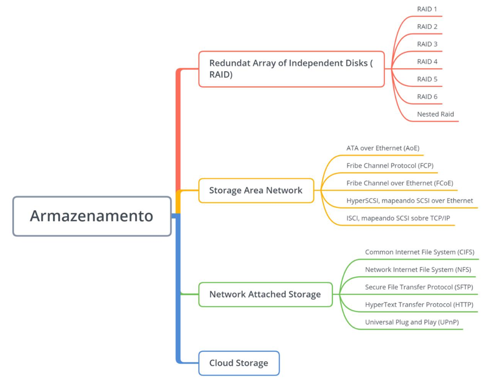

  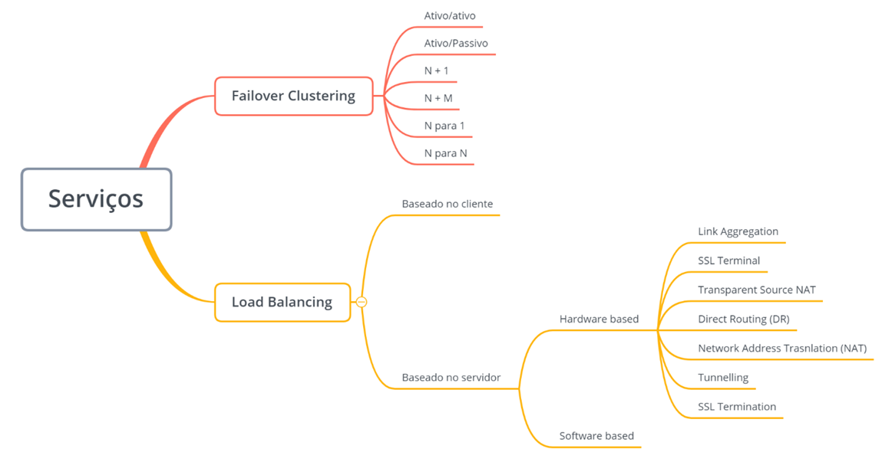

  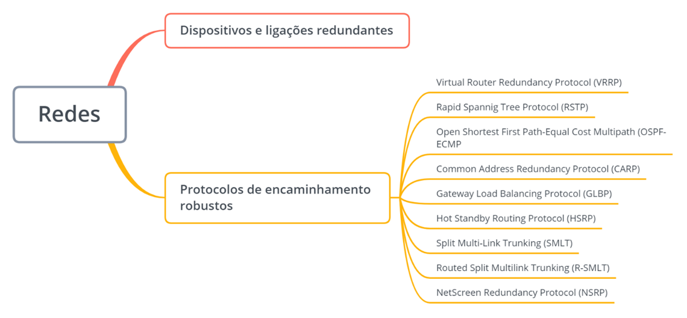

Caso não esteja familiarizado com os termos apresentados, não se preocupe. Abordaremos os mais relevantes ao longo de nossa explanação, construindo o conhecimento passo a passo.

## Fundamentos da Alta Disponibilidade (High Availability)

Em tecnologia da informação, a **alta disponibilidade** refere-se à capacidade de um sistema ou componente de se manter operacional, executando suas funções sem interrupções, por um período de tempo prolongado. Disponibilidade, no contexto de banco de dados, refere-se à capacidade de oferecer os serviços aos clientes do banco de dados. Servidores de banco de dados podem trabalhar em conjunto para permitir que um serviço seja rapidamente substituído quando um servidor primário falhar. Geralmente um servidor secundário pode assumir a responsabilidade de responder a consultas feitas sobre a base de dados. Essa arquitetura garante a redução do tempo em que o serviço fica fora do ar. O conceito que acabamos de descrever está associado à ideia de alta disponibilidade.

A figura abaixo ilustra essa dinâmica: uma aplicação se conecta a um banco de dados primário. Em caso de falha, a arquitetura de alta disponibilidade redireciona o acesso para a cópia secundária, que assume as operações.

  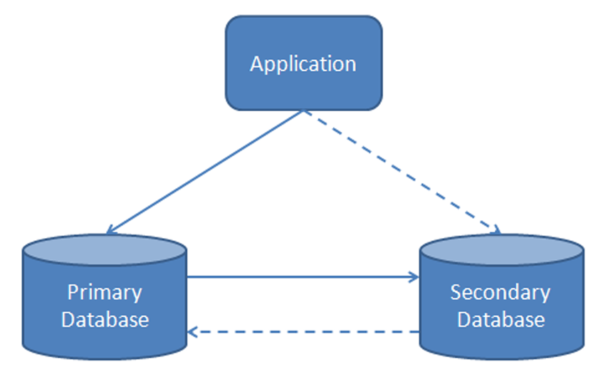

Existem várias soluções externas para prover alta disponibilidade que não necessitam de funcionalidades adicionais do servidor. Essas soluções ainda permitem um melhor desempenho e sistemas mais confiáveis, podendo ser implementadas por meio de hardware ou software. A utilização de **RAID (Redundant Array of Independent Disks)** é um exemplo clássico de solução externa que não depende, necessariamente, do SGBD. RAID é uma tecnologia de tolerância a falhas para discos rígidos, comumente implementada em servidores. Além de fornecer redundância, protegendo os dados contra a falha de um ou mais discos, o RAID também pode impactar positivamente o desempenho, dependendo do nível de RAID utilizado. Por exemplo, no RAID nível 5, os dados e as informações de paridade são distribuídos em três ou mais unidades. Se uma dessas unidades falhar, as demais utilizam as informações de paridade para reconstruir os dados da unidade defeituosa, garantindo a continuidade da operação. Em geral, contudo, soluções como o RAID resolvem apenas uma parte do problema da alta disponibilidade, especificamente a camada de armazenamento.

  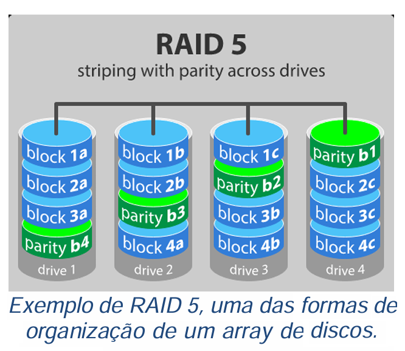

Soluções completas e robustas de alta disponibilidade frequentemente necessitam que funcionalidades adicionais sejam incorporadas ao próprio servidor de banco de dados. Um SGBD robusto é projetado para lidar com falhas comuns, como uma interrupção no fornecimento de energia, e preservar a integridade dos dados, mesmo que isso implique uma perda temporária de disponibilidade durante o processo de recuperação. No entanto, as crescentes demandas por alta disponibilidade podem exigir a recuperação de falhas mais graves, como falhas de mídia de armazenamento ou problemas na rede. Algumas situações críticas de negócio impõem a garantia de um tempo de inatividade (downtime) extremamente reduzido, muitas vezes tendendo a zero, para a recuperação após uma falha.

Os requisitos de alta disponibilidade, portanto, incluem a capacidade de recuperação robusta de falhas graves, a minimização ou eliminação do tempo de inatividade para recuperação e a manutenção de níveis de serviço elevados e obrigatórios. Para endereçar esses desafios de forma eficaz, é crucial compreender que diversos componentes de um sistema podem falhar independentemente uns dos outros.

### Identificando Pontos Críticos de Falha

Para construir uma estratégia de alta disponibilidade eficaz, o primeiro passo é identificar e monitorar os potenciais pontos de falha em um ambiente de servidor de banco de dados. Os principais componentes que podem comprometer a disponibilidade incluem:

- **Servidor de Banco de Dados:** Abrange o motor (engine) do SGBD, o sistema operacional sobre o qual ele roda e a plataforma de hardware subjacente (CPU, memória RAM, placas-mãe, fontes de alimentação). Uma falha em qualquer um desses elementos pode levar à indisponibilidade do serviço de banco de dados.
- **Banco de Dados Físico:** Refere-se às mídias de armazenamento onde os dados residem (discos rígidos, SSDs), bem como as interfaces de hardware (controladoras de disco) e software (drivers, sistemas de arquivos) que gerenciam o acesso a esses dados.
- **Links de Comunicação:** Envolve as conexões externas do servidor, incluindo a infraestrutura de rede física (cabos, switches, roteadores), as interfaces de rede do servidor e outros recursos de rede, como os **daemons** ou serviços responsáveis pela comunicação.

Esses pontos de falha podem deixar de operar por uma miríade de razões, que vão desde falhas intrínsecas ao sistema (bugs de software, defeitos de hardware), erros humanos (descuido na configuração, operações incorretas), ações maliciosas (sabotagem), falhas no software da aplicação que interage com o banco, interrupções na rede, falhas nas mídias de armazenamento (corrupção de dados, falha mecânica de discos) e até mesmo desastres naturais (incêndios, inundações, terremotos). Qualquer um desses eventos pode levar à inatividade do banco de dados e, consequentemente, dos sistemas e aplicações que dependem dele.

É fundamental ter em mente que o tempo de inatividade não é apenas uma inconveniência técnica; ele acarreta custos significativos para as organizações. Esses custos podem se manifestar como perda de produtividade dos funcionários, perda direta de receita (especialmente em negócios online), comprometimento do relacionamento com clientes e, em casos mais graves, até mesmo ações judiciais por quebra de contrato ou falha no cumprimento de SLAs. Nem sempre é fácil quantificar o custo direto do tempo de inatividade. Clientes irritados, funcionários ociosos e a publicidade negativa gerada por uma falha prolongada são dispendiosos, embora não sejam medidos diretamente em valores monetários. Por outro lado, a perda de receita e as penalidades legais incorridas devido ao não cumprimento dos objetivos de SLA podem ser facilmente calculadas e, frequentemente, justificam o investimento em soluções robustas de alta disponibilidade.

### Estratégias de Backup para Alta Disponibilidade: O Backup Online

Uma das primeiras linhas de defesa para garantir a disponibilidade e a recuperabilidade dos dados é a implementação de estratégias de backup eficazes. O **backup online (BO)**, também conhecido como backup a quente, é uma tecnologia implementada no servidor de banco de dados que protege contra falhas de mídia, mantendo um registro contínuo das alterações do banco de dados em um dispositivo de armazenamento separado. Ele oferece uma forma de backup que está sempre ativa, operando em paralelo com as atividades normais do banco. O objetivo primordial deste mecanismo é proteger o banco de dados físico contra a perda de informações devido a erros na mídia de armazenamento.

Isso inclui cenários como a quebra da cabeça de leitura/gravação de um disco, erros de escrita que corrompem dados, setores de mídia que se tornam ilegíveis ou não confiáveis, bem como eventos mais catastróficos, como um terremoto ou um bombardeio que destrua o data center primário. Um exemplo trágico e emblemático foi o atentado ao World Trade Center em Nova York em 2001; muitas empresas que possuíam seus backups online em servidores localizados no prédio vizinho perderam seus dados quando ambas as torres colapsaram. Este evento sublinhou a importância de backups geograficamente distribuídos.

Com a utilização do backup online, podemos mitigar o problema do ponto único de falha associado ao banco de dados físico. Uma série de eventos pode tornar o banco de dados inutilizável através da perda de disponibilidade, e o backup online fornece uma maneira de restaurar um banco de dados físico ao seu estado consistente mais atual.

Uma alternativa mais tradicional ao backup online é o **backup off-line** (ou backup a frio). Este processo geralmente envolve tirar o banco de dados do ar para executar um "instantâneo" (snapshot) ou uma "fotografia" do estado físico atual do banco de dados, copiando todos os arquivos de dados para um dispositivo de armazenamento independente. Se ocorrer uma falha grave na mídia de armazenamento do banco de dados físico, o backup off-line é usado para restaurar o banco de dados. Contudo, tal ação restaura o banco de dados ao seu estado no momento em que o instantâneo foi tirado, resultando na perda de todas as alterações realizadas desde a criação do backup até o momento da falha.

O backup online resolve o problema das alterações perdidas inerente aos backups off-line, proporcionando um mecanismo de backup contínuo que está sempre ativo. Assim como no backup off-line, o backup online geralmente começa com a criação de um backup completo (full backup) do banco de dados atual. Durante as execuções subsequentes e de forma contínua, o SGBD registra apenas as alterações efetivadas (transações que sofreram `COMMIT`) em um arquivo de log especial, frequentemente chamado de **roll forward journal** ou log de transações, que é mantido em um espaço de armazenamento independente e seguro. Cada nova transação efetivada acrescenta suas alterações a este journal.

Para garantir a sincronização completa entre o journal e o banco de dados, o SGBD assegura que todas as alterações sejam liberadas e registradas como parte do processo de submissão (commit) da transação. Os dados no backup online, portanto, refletem o estado atual e consistente do banco de dados. Um processo de recuperação pode então retornar o banco de dados ao seu estado mais atual, restaurando primeiramente o backup completo (o instantâneo inicial) e, em seguida, aplicando sequencialmente todas as alterações presentes no arquivo de journal.

Quando o banco de dados principal fica indisponível, as informações do backup online podem ser utilizadas para restaurar o banco de dados ao seu estado consistente mais recente. A restauração a partir de um backup online começa, tipicamente, restaurando o banco de dados a partir da cópia de segurança completa mais recente. Isso retorna o banco de dados ativo ao seu estado no momento daquele backup inicial. Em seguida, o sistema processa a análise dos dados presentes no journal e aplica todas as alterações consolidadas (committed) que foram feitas desde o backup inicial. Esta etapa retorna o banco de dados ativo para o estado consistente mais recente antes da falha.

É importante perceber que o backup online, embora garanta a recuperação para o último estado consistente, não possui, por si só, um processo de recuperação instantâneo após uma falha. Há a necessidade de restaurar o backup inicial e, subsequentemente, aplicar as informações presentes no journal para garantir a volta ao estado consistente anterior à indisponibilidade. Para garantir uma agilidade maior na recuperação e, consequentemente, uma melhor disponibilidade dos sistemas, é comum fazer uso de técnicas complementares, como a replicação de dados, que discutiremos em detalhes mais adiante.

### Clustering para Alta Disponibilidade e o Mecanismo de Failover

Os **clusters de alta disponibilidade** representam uma abordagem mais sofisticada e proativa para garantir a continuidade dos serviços. Um cluster é, essencialmente, um grupo de computadores (nós ou nodes) que trabalham em conjunto para suportar servidores de aplicações, incluindo bancos de dados, de forma que possam ser utilizados com segurança, apresentando um tempo mínimo de inatividade. Eles operam a partir do aproveitamento de computadores redundantes em grupos, que prestam um serviço contínuo, especialmente quando algum componente do sistema falha.

Sem a utilização de clustering, se um servidor que hospeda uma determinada aplicação ou banco de dados falha, o serviço associado permanecerá indisponível até que o servidor impactado seja recuperado. Um cluster de alta disponibilidade oferece uma solução robusta para esta situação através da detecção automática de falhas de hardware ou software e do imediato reinício da aplicação ou do serviço de banco de dados em outro sistema (nó) dentro do cluster, sem a necessidade de intervenção administrativa manual. Esse processo de transferência automática de responsabilidade é conhecido como **failover**.

O mecanismo de **failover** é acionado quando uma falha ocorre no servidor primário (ou nó ativo), fazendo com que o cluster deixe de operar no seu modo normal para operar em um modo de contingência ou desastre. Durante o modo de desastre, as requisições dos clientes são automaticamente redirecionadas para a estrutura de failover disponível, que assume as operações do servidor que falhou. Quando o datacenter primário ou o nó original volta ao estado normal e está operacional novamente, uma operação de **failback** pode ser executada para trazer o cluster de volta ao seu modo de operação normal, com o servidor original reassumindo suas funções primárias.

A figura a seguir ilustra as ações de um banco de dados em um ambiente de failover, contrastando o modo de operação normal com o modo de desastre.

  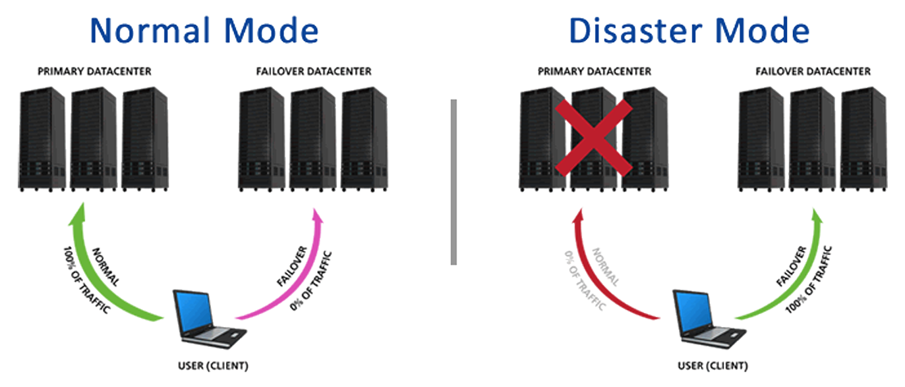

Como parte do processo de failover, o software de clustering pode precisar configurar o nó de destino antes de iniciar a aplicação ou o serviço de banco de dados. Por exemplo, sistemas de arquivos apropriados que contêm os dados do banco podem precisar ser "importados" e montados no novo nó ativo, o hardware de rede pode necessitar de uma reconfiguração para que o endereço IP do serviço passe a apontar para o novo servidor, ou pode ser necessário que alguns aplicativos de apoio ou serviços dependentes estejam em execução antes que o banco de dados possa operar plenamente.

A replicação de dados, que veremos em detalhe na próxima seção, frequentemente desempenha um papel crucial em arquiteturas de cluster de alta disponibilidade, garantindo que os dados estejam sincronizados entre os nós do cluster, permitindo um failover rápido e com mínima (ou nenhuma) perda de dados.

A figura a seguir exemplifica um cenário factível de eventos onde a alta disponibilidade é mantida por meio de uma solução que combina replicação e mecanismos de failover.

  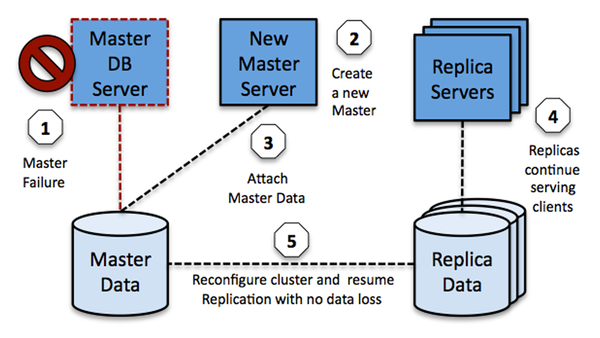

Observamos um servidor de banco de dados mestre (Master) que sofre uma falha (1). Neste momento, um processo de failover é iniciado, e um dos servidores réplica (ou um novo servidor) é promovido e reconfigurado para assumir o papel de mestre (2). Essa reconfiguração envolve associar a nova instância à base de dados propriamente dita, que pode estar em um armazenamento compartilhado ou ter sido replicada (3). É crucial notar que, durante todo o processo de restabelecimento do servidor mestre original, os servidores réplica (que não assumiram o papel de mestre) podem continuar servindo a requisições de leitura, ou o novo mestre já está atendendo a todas as requisições (4). Por fim, quando o servidor mestre original é recuperado, um processo de sincronização de dados (e possivelmente um failback) é executado para garantir que não ocorreram perdas de dados e que o sistema retorne à sua configuração ideal.

## Replicação de Dados para Disponibilidade e Escalabilidade

A **replicação** é uma tecnologia fundamental, implementada no nível do servidor de banco de dados, que protege contra falhas de banco de dados ao espelhar (copiar e manter sincronizadas) as alterações de dados de um servidor principal para um ou mais servidores secundários. Além de ser um pilar para a alta disponibilidade, a replicação também fornece pontos de acesso adicionais aos dados. Isso não apenas protege contra falhas de conexão com o servidor primário, mas também permite distribuir e paralelizar a carga de leitura em situações de tráfego intenso, contribuindo para a escalabilidade do sistema. Semelhante ao backup online, a replicação é um processo que, uma vez configurado, está sempre ativo durante a execução do servidor.

Uma arquitetura de replicação típica utiliza pelo menos dois servidores de banco de dados: um servidor **principal (master ou primário)**, que é a fonte autoritária dos dados e onde ocorrem as operações de escrita (inserções, atualizações, exclusões); e um ou mais servidores **secundários (slaves, réplicas ou espelhos)**, que recebem as alterações do primário e as aplicam em suas próprias cópias do banco de dados. Estes servidores normalmente executam em máquinas distintas, cada uma com seu próprio banco de dados físico. Antes de iniciar a operação de replicação, os bancos de dados nos servidores primário e secundário são sincronizados para que sejam cópias idênticas do estado atual dos dados. A figura abaixo oferece uma representação conceitual deste arranjo.

  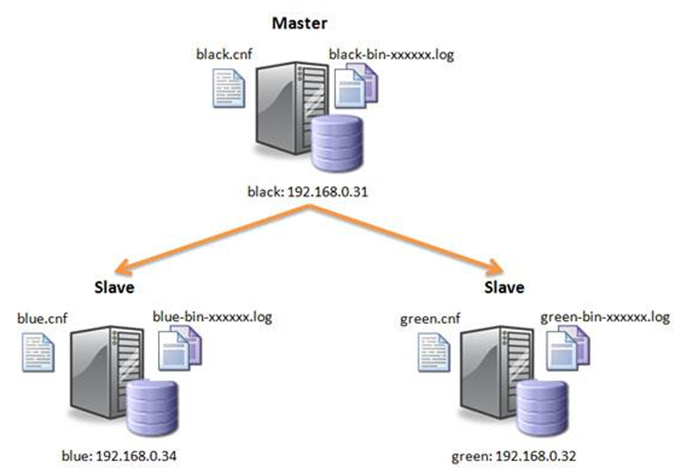

Ambos os servidores (primário e secundários) são inicializados e estabelecem um link de comunicação entre eles. Durante a execução normal, o servidor primário envia as alterações efetivadas (transações commitadas) para os servidores secundários, que, por sua vez, espelham essas mudanças em seus respectivos bancos de dados. Idealmente, em qualquer ponto no tempo, todos os servidores deveriam armazenar os mesmos dados, no mesmo estado (consistência). Além disso, os servidores secundários geralmente estão disponíveis para acesso dos clientes, mas tipicamente em modo de **somente leitura (read-only)**, para evitar conflitos de escrita e garantir a integridade da cópia replicada.

Os servidores de replicação fornecem uma solução robusta para o problema do **ponto único de falha (Single Point of Failure - SPOF)**, que é uma parte do sistema cuja falha implicaria na interrupção de todo o sistema. O banco de dados físico do servidor secundário funciona como uma cópia atualizada do banco de dados primário. Caso o banco de dados primário fique indisponível (devido a uma falha de hardware, software ou rede), a recuperação pode ser feita restaurando-o a partir de um dos bancos de dados secundários, ou, mais comumente em cenários de alta disponibilidade, o processamento pode ser simplesmente comutado (failover) para um dos servidores secundários, que é promovido a primário.

Servidores de replicação também oferecem um ponto de conexão alternativo para os clientes, especialmente para consultas que exigem apenas leitura. Isso é extremamente útil para aliviar a carga de tráfego no servidor primário, permitindo que ele se concentre nas operações de escrita, e também para assumir a execução de operações de leitura caso o banco de dados principal e/ou o link de comunicação com o servidor primário falhem.

Assim, a replicação serve como uma solução para o ponto único de falha tanto para o servidor primário quanto para seu link de comunicação. Utilizar mais de um servidor de replicação (múltiplas réplicas) pode melhorar ainda mais a disponibilidade e a capacidade de distribuição de carga. Eles oferecem múltiplos pontos de serviço e aumentam a resiliência do sistema, distribuindo a carga de leitura e as responsabilidades de recuperação.

Um sistema que executa replicação, portanto, envolve um servidor de banco de dados principal e um ou mais servidores secundários que espelham as alterações do primário. Os servidores secundários normalmente residem em máquinas separadas, com mídias de armazenamento (discos) independentes para seus bancos de dados físicos. Para aumentar ainda mais a resiliência, os servidores secundários podem utilizar sub-redes separadas, ou até mesmo estar localizados em data centers geograficamente distintos, melhorando a proteção contra falhas localizadas e desastres.

Se qualquer componente do servidor primário falhar (o próprio servidor, o banco de dados físico ou os links de comunicação), os servidores de replicação oferecem várias opções de recuperação. O sistema pode continuar a operar em um modo de **fallback**, alternando o acesso do cliente para os servidores secundários disponíveis. O fallback é um recurso que oferece uma proteção de dados aprimorada, que vai além daquela oferecida por componentes de hardware redundantes isoladamente, pois garante a disponibilidade dos dados em uma máquina completamente separada.

Vejamos um exemplo prático com os clusters de fallback utilizados nos servidores de banco de dados Teradata®. Na arquitetura Teradata, o trabalho de armazenamento e recuperação de linhas é realizado por componentes chamados **AMPs (Access Module Processors)**. Cada AMP armazena os dados no disco virtual associado a ele e é responsável pela gestão de bloqueios, espaço em disco, ordenação e agregação de dados. Quando a funcionalidade de fallback está ativada em um sistema Teradata, e ocorre uma falha em um AMP, o sistema pode continuar a executar as operações de inserção, atualização e exclusão porque existem cópias redundantes dos dados em um ou mais AMPs de reserva dentro de um **cluster de fallback**. Um pequeno número de AMPs é logicamente agrupado para formar um desses clusters, e um sistema com fallback habilitado conterá muitos desses clusters. A figura abaixo ilustra essa configuração.

  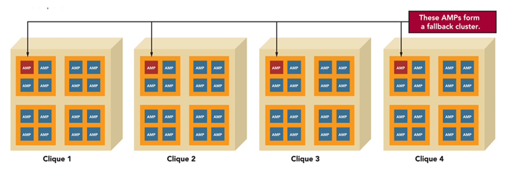

Normalmente, cada AMP em um cluster de reserva funciona em um **clique** (uma unidade de hardware independente, como um nó de servidor). Assim, a falha de um componente de hardware principal, como uma matriz de discos inteira que serve a um AMP, não desativará o banco de dados. Em vez disso, os dados estarão disponíveis através da cópia de reserva no AMP de fallback até que o componente com falha seja reparado.

Os servidores de replicação também fornecem a capacidade de restaurar o sistema de banco de dados primário. Após a resolução de eventuais falhas no sistema primário, a recuperação pode restaurar o banco de dados físico primário a partir de um dos bancos de dados secundários. Alternativamente, um servidor secundário pode ser permanentemente promovido a servidor primário, e, talvez, o antigo servidor primário, uma vez recuperado, pode assumir o papel de servidor secundário, invertendo as funções.

É crucial que as cópias dos dados (réplicas) sejam gerenciadas de forma a garantir níveis adequados de **consistência**, **disponibilidade** e **autonomia**. A replicação pode ser construída utilizando soluções de software (oferecidas pelo SGBD ou por terceiros) ou hardware (como storage area networks - SANs que realizam espelhamento de disco). A granularidade da replicação também pode variar, desde a replicação de bancos de dados inteiros, passando por tabelas específicas, até a replicação de linhas ou transações individuais. Essa tecnologia é amplamente empregada na construção de bancos de dados distribuídos, onde os dados precisam estar acessíveis em múltiplas localidades.

### Failover e Recuperação Aprimorada com Servidores Standby**

A **recuperação de falhas via failover** é uma tecnologia implementada no servidor que permite uma transição quase instantânea, ou "mudança a quente" (**hot switch**), das operações de um servidor principal para um servidor secundário em caso de falha. Ela representa um aperfeiçoamento significativo em relação a um sistema de replicação básico. Na replicação simples, a falha do sistema primário geralmente provoca alguma indisponibilidade no serviço, mesmo que breve.

Nessa situação de falha do primário em um sistema de replicação básico, algumas possibilidades podem ser consideradas: ou o sistema é manualmente (ou semi-automaticamente) comutado para o modo secundário, utilizando o servidor espelho para operações (geralmente de leitura, a menos que seja promovido), ou um processo de recuperação mais demorado é iniciado para trazer o sistema primário de volta ao pleno funcionamento. Ambas as opções podem resultar em um tempo de inatividade perceptível do serviço.

O modo de recuperação após falha, ou **failover automático**, visa evitar essa redução nos níveis de serviço, alternando o sistema ativo do servidor principal para um servidor de replicação especialmente designado, conhecido como **servidor de espera (standby server)**. Em caso de falha do sistema primário, o servidor de espera é automaticamente promovido e alterna para o modo ativo, permitindo operações de atualização e assumindo todas as responsabilidades do servidor primário. A figura abaixo ilustra um exemplo desse mecanismo no Oracle, conhecido como **fast-start failover,** onde um servidor standby assume rapidamente as operações.

  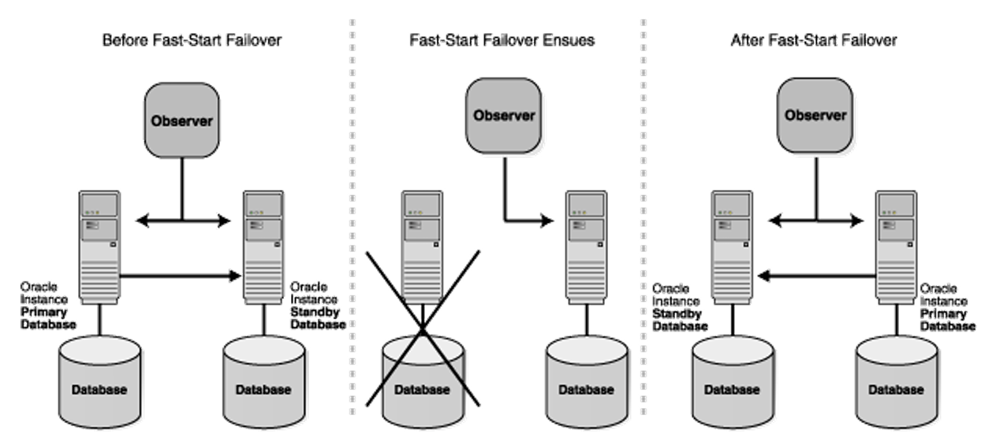

A recuperação de falhas via failover é uma tecnologia intrinsecamente ligada à alta disponibilidade. Ela fornece uma solução para os principais pontos de falha em um servidor de banco de dados: o próprio servidor, o banco de dados físico e o link de comunicação. Se qualquer um desses componentes falhar no servidor primário, o servidor em espera torna-se automaticamente o servidor ativo (primário), com pouco ou nenhum efeito sobre os níveis de serviço percebidos pelos usuários finais.

Enquanto o servidor principal ainda está no ar e funcionando (ativo), as funções do servidor de espera são as mesmas de um servidor de replicação convencional: ele recebe todas as atualizações de dados do primário e as aplica em sua cópia local. Durante este período, o servidor de espera geralmente suporta apenas operações de leitura dos clientes, para não interferir no processo de replicação e para manter a consistência com o primário.

Para maior confiabilidade e resiliência, vários servidores de espera podem ser configurados para assumirem o controle das operações em cascata ou em paralelo. Quando o primário falhar, um dos servidores em espera é eleito e torna-se o novo primário, e os demais servidores de espera (se existirem) passam a receber as suas atualizações a partir deste novo primário. Em um sistema de recuperação de falhas bem configurado, a falha no servidor primário provoca um **switch-over** para um servidor de espera.

Um **switch-over** é uma inversão de funções planejada ou automática entre o banco de dados primário e um de seus bancos de dados de reserva (standby). Um switch-over bem executado garante nenhuma perda de dados e é frequentemente utilizado para manutenção planejada do sistema primário. Durante o processo, o banco de dados primário original alterna para uma função de reserva, e o banco de dados de reserva (standby) alterna para a função principal. A alta disponibilidade é, assim, mantida com uma redução mínima ou inexistente do nível de serviço.

## Balanceamento de Carga (Load Balancing) para Escalabilidade e Desempenho

O **Balanceamento de Carga (Load Balancing)** é um mecanismo crucial utilizado para atingir escalabilidade e otimizar o desempenho em sistemas distribuídos, incluindo ambientes de banco de dados. Sua função primordial é dividir a carga de processamento (requisições de clientes, consultas, transações) entre um conjunto de duas ou mais máquinas (servidores). O objetivo específico de utilizar o balanceamento de carga para um sistema computacional é promover uma melhoria significativa de desempenho através da distribuição inteligente das tarefas.

O funcionamento básico do balanceamento de carga se resume em distribuir o tráfego das chamadas ao banco de dados ou aplicação, fazendo com que diferentes máquinas do conjunto (cluster de servidores) funcionem como se fossem uma única entidade lógica para o cliente. Neste cenário, um elemento central, o **balanceador de carga (load balancer)**, deve decidir para qual servidor específico do conjunto enviar uma determinada consulta ou requisição para execução. A figura abaixo demonstra com bom humor essa ideia de um "maestro" distribuindo as tarefas.

  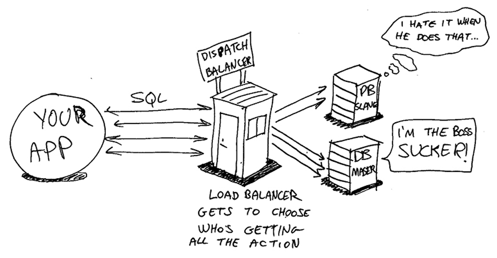

O balanceamento de carga pode também ser descrito como o processo de distribuição de solicitações de serviço por um grupo de servidores. Esta técnica resolve uma série de exigências que se têm tornado cada vez mais importantes em sistemas modernos, algumas das quais já comentamos anteriormente no contexto de alta disponibilidade e replicação:

- **Aumento da Escalabilidade:** Quando aplicações de conteúdo intensivo ou bancos de dados com alto volume de transações crescem de forma que um único servidor não possa mais fornecer um poder de processamento adequado, é fundamental ter a flexibilidade de adicionar mais servidores de forma rápida e transparente aos usuários finais. O balanceamento de carga permite que novos servidores sejam integrados ao pool, aumentando a capacidade total do sistema de forma linear ou quase linear.
- **Alto Desempenho:** O melhor desempenho é alcançado quando o poder de processamento dos servidores disponíveis é usado de forma inteligente. Uma infraestrutura avançada de balanceamento de carga pode direcionar as solicitações para os servidores que estão atualmente mais ociosos ou menos ocupados (com base em métricas como uso de CPU, memória, número de conexões ativas, etc.) e, portanto, são capazes de fornecer um menor tempo de resposta para aquela requisição específica.
- **Alta Disponibilidade e Recuperação de Desastres:** Outro benefício intrínseco do balanceamento de carga é a sua capacidade de melhorar a disponibilidade das aplicações e dos serviços de banco de dados. Se uma aplicação ou um servidor dentro do cluster falha, o balanceador de carga pode detectar essa falha (através de **health checks** periódicos) e automaticamente parar de enviar tráfego para o servidor defeituoso, redistribuindo as novas solicitações (e, em alguns casos, as sessões existentes) para os outros servidores saudáveis dentro do cluster. Em cenários de recuperação de desastres, o balanceamento de carga pode até mesmo redirecionar o tráfego para servidores em um data center secundário, geograficamente distinto.

Percebam na figura a seguir que o balanceamento de carga é uma técnica versátil que pode ser implementada tanto por meio de dispositivos de hardware dedicados (appliances) quanto por soluções de software. Além disso, ele pode operar em diferentes camadas do modelo OSI (Open Systems Interconnection), desde a camada de rede (camada 3, balanceando tráfego IP), passando pela camada de transporte (camada 4, balanceando conexões TCP/UDP), até a camada de aplicação (camada 7, inspecionando o conteúdo das requisições HTTP, SQL, etc., para tomar decisões de roteamento mais inteligentes).

  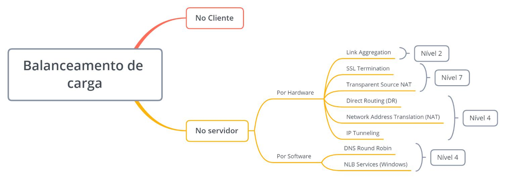

No contexto específico de bancos de dados, o balanceamento de carga é frequentemente utilizado em conjunto com a replicação. Servidores de banco de dados replicados (slaves ou réplicas) podem ser colocados atrás de um balanceador de carga para distribuir as consultas de leitura. Isso alivia a carga no servidor primário (master), que pode se dedicar às operações de escrita, e melhora significativamente o desempenho e a capacidade de resposta para aplicações com alto volume de leituras. Algoritmos comuns de balanceamento incluem **Round Robin** (distribuição sequencial e cíclica), **Least Connections** (envia para o servidor com menos conexões ativas), **Least Response Time** (envia para o servidor que está respondendo mais rapidamente) e **baseados em peso** (onde servidores mais potentes recebem uma proporção maior do tráfego).

## Considerações Finais

Neste capítulo, navegamos pelas estratégias e tecnologias essenciais que sustentam os sistemas de bancos de dados modernos, capacitando-os a enfrentar os desafios de um mundo digital que exige operação ininterrupta, resposta rápida e escalabilidade sob demanda. A **alta disponibilidade**, a **replicação de dados** e o **balanceamento de carga** não são meros conceitos técnicos, mas sim pilares fundamentais que garantem a resiliência, a confiabilidade e a performance das aplicações críticas que dependem de um acesso consistente e eficiente aos dados.

Exploramos como a alta disponibilidade transcende a simples redundância de hardware, envolvendo uma compreensão profunda dos pontos críticos de falha – desde o servidor e o armazenamento físico até os links de comunicação – e a implementação de estratégias proativas como backups online contínuos e arquiteturas de clustering com mecanismos de failover e failback. Vimos que a capacidade de um sistema se recuperar rapidamente de falhas, minimizando o tempo de inatividade, é crucial não apenas para a continuidade operacional, mas também para a manutenção da confiança dos usuários e o cumprimento de rigorosos acordos de nível de serviço.

A replicação de dados emergiu como uma técnica poderosa, não apenas para proteger contra a perda de dados e facilitar a recuperação, mas também como um facilitador da escalabilidade, permitindo a distribuição de cargas de leitura entre múltiplos servidores secundários. Discutimos como a replicação, seja em configurações master-slave ou em cenários mais complexos com servidores standby, forma a espinha dorsal de muitas soluções de alta disponibilidade, permitindo transições suaves em caso de falha do servidor primário.

Finalmente, abordamos o balanceamento de carga como o maestro que orquestra a distribuição de requisições entre múltiplos servidores, otimizando o uso de recursos, melhorando os tempos de resposta e garantindo que o sistema possa crescer de forma transparente para atender a demandas crescentes. Compreendemos que o balanceamento de carga, atuando em diversas camadas e utilizando diferentes algoritmos, é um componente vital para alcançar tanto a escalabilidade quanto a alta disponibilidade, assegurando que falhas em servidores individuais não comprometam a performance ou a acessibilidade do sistema como um todo.

É importante ressaltar que estas três áreas – alta disponibilidade, replicação e balanceamento de carga – estão intrinsecamente interligadas. Frequentemente, as soluções mais robustas e eficazes combinam elementos de todas elas, criando arquiteturas sinérgicas onde a replicação suporta o failover rápido em um cluster de alta disponibilidade, enquanto o balanceamento de carga distribui o tráfego entre os nós ativos desse cluster.

O conhecimento adquirido neste capítulo complementa as técnicas de otimização de desempenho em bancos de dados, fornecendo uma visão mais holística sobre como construir e manter sistemas de informação que não apenas sejam rápidos, mas também resilientes, confiáveis e capazes de evoluir com as necessidades do negócio. A jornada para alcançar a verdadeira robustez em sistemas de dados é contínua, exigindo planejamento cuidadoso, monitoramento constante e uma compreensão clara das tecnologias e princípios aqui discutidos.