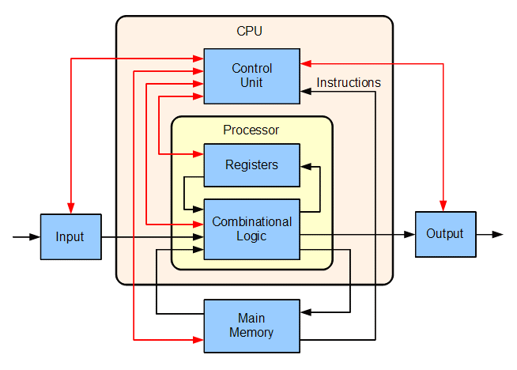
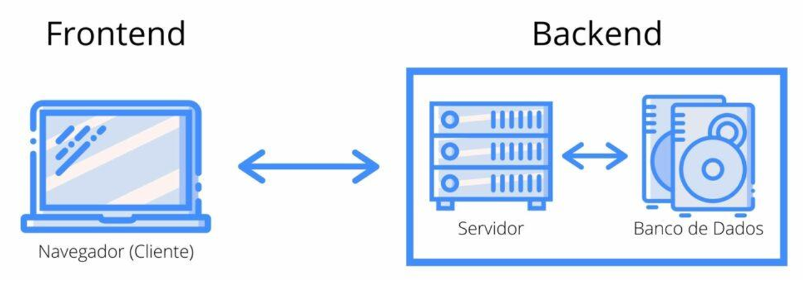
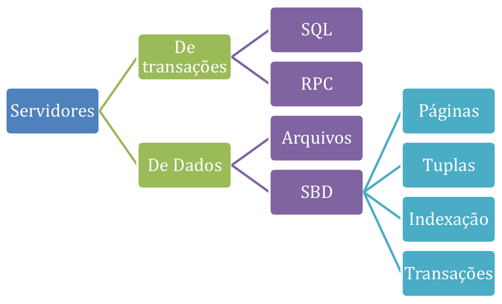
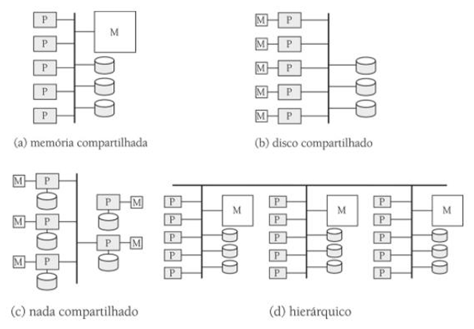
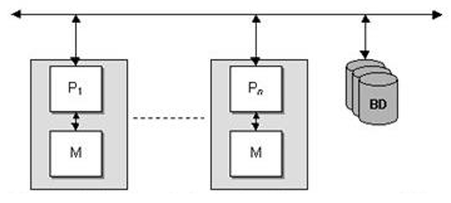
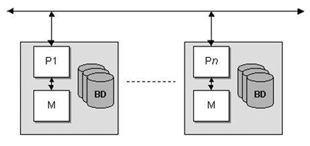

# Capítulo 18 – Bancos de Dados Paralelos e Distribuídos

## Introdução: Do Centralizado à Distribuição e ao Paralelismo

Um **sistema**, em sua essência, pode ser compreendido como um conjunto de partes interconectadas e coordenadas que cooperam para a realização de um ou mais objetivos comuns. No domínio da computação, um sistema de computação é classicamente constituído por componentes fundamentais como a unidade central de processamento (CPU), a memória principal (RAM) e os diversos dispositivos de entrada e saída (E/S), todos orquestrados para executar tarefas. A familiaridade com a arquitetura básica de um computador, conforme ilustrado esquematicamente na figura abaixo, é um pré-requisito para entendermos como os sistemas de banco de dados são projetados e operam.

A arquitetura de um sistema de gerenciamento de banco de dados (SGBD) é profundamente influenciada pela estrutura do sistema de computação no qual ele é executado. Historicamente, os sistemas de banco de dados evoluíram de arquiteturas **centralizadas**, onde todos os componentes do sistema (SGBD, dados, processamento) residem e rodam em uma única máquina, para arquiteturas mais complexas e flexíveis. Com o advento e a popularização das redes de computadores e a crescente demanda por desempenho e escalabilidade, surgiram e se consolidaram modelos como o **cliente-servidor**, onde uma máquina servidora robusta executa o trabalho principal do SGBD em favor de múltiplas máquinas clientes que consomem seus serviços.

Alguns critérios fundamentais da arquitetura de computadores, como a capacidade de **comunicação em rede**, o **processamento paralelo** e a **distribuição geográfica de dados e processamento**, exercem uma influência direta e determinante na concepção e na funcionalidade das arquiteturas de banco de dados contemporâneas.

As **redes de computadores**, por exemplo, foram o habilitador tecnológico que permitiu que algumas tarefas fossem executadas em um sistema servidor dedicado, enquanto outras, como a interface com o usuário e a lógica de apresentação, fossem executadas nos sistemas clientes. Essa divisão de trabalho funcional e físico culminou no padrão de arquitetura cliente-servidor, onipresente atualmente.

O **processamento paralelo** dentro de um sistema de computador, seja ele um único servidor com múltiplos processadores ou um cluster de máquinas interconectadas, permite que as operações executadas pelos sistemas de banco de dados sejam significativamente agilizadas. Isso se traduz em um melhor tempo de resposta para as transações individuais e em um maior **throughput** (vazão) geral do sistema, ou seja, uma melhor relação entre a quantidade de transações processadas por intervalo de tempo. Consultas complexas podem ser decompostas e processadas de forma a explorar o paralelismo intrínseco oferecido pela plataforma de hardware subjacente. A necessidade crescente de processar grandes volumes de dados e consultas analíticas em paralelo impulsionou o desenvolvimento dos chamados **bancos de dados paralelos**.

Por fim, os **sistemas de banco de dados distribuídos** foram concebidos para lidar com dados que estão natural ou estrategicamente dispersos, seja geográfica ou administrativamente, entre diversos sistemas de banco de dados interconectados. A distribuição dos dados entre os vários sites (localidades) de uma organização permite, por exemplo, que os dados sejam armazenados mais próximos dos locais onde são gerados ou mais frequentemente acessados, otimizando a latência e, potencialmente, melhorando a autonomia local.

Neste capítulo, iniciaremos tratando de forma mais concisa das características dos sistemas centralizados e cliente-servidor, bem como dos fundamentos dos sistemas de banco de dados paralelos. Em seguida, nosso foco principal se voltará para os sistemas de banco de dados distribuídos, onde exploraremos em detalhe a teoria, os desafios e as soluções relacionadas a este paradigma. Neste contexto, também abordaremos as diversas possibilidades e implicações da replicação de dados em ambientes distribuídos.

## Arquiteturas Fundamentais de Sistemas de Banco de Dados

Antes de nos aprofundarmos nas complexidades do paralelismo e da distribuição, é essencial compreendermos as arquiteturas mais basilares que formaram o alicerce para os sistemas atuais.

### Sistemas Centralizados: A Base Tradicional

Os **sistemas de banco de dados centralizados** são aqueles que executam inteiramente em um único sistema de computação. Durante as primeiras décadas da computação, praticamente todos os sistemas de banco de dados eram centralizados. Tais sistemas podem variar consideravelmente em escala, desde um sistema de banco de dados de um único usuário rodando em um computador pessoal (PC) até sistemas de altíssimo desempenho e capacidade operando em mainframes ou servidores de grande porte.

Um banco de dados centralizado é, por definição, um tipo de banco de dados que é armazenado, localizado logicamente e mantido em um único local físico ou em um único sistema computacional coeso. Como todos os dados e o SGBD residem em uma única máquina, a coordenação do acesso aos dados e a garantia da consistência podem ser, em teoria, mais simples de gerenciar. Contudo, a principal e mais crítica desvantagem desta arquitetura é a sua vulnerabilidade a falhas: se alguma falha de sistema ocorrer na máquina central (seja de hardware, software ou energia), todos os dados e o acesso a eles podem ser comprometidos, resultando na indisponibilidade total do sistema. Este é o clássico problema do **ponto único de falha (Single Point of Failure - SPOF)**.

### Sistemas Cliente-Servidor: Dividindo o Trabalho

Com o extraordinário desenvolvimento e a disseminação dos computadores pessoais (PCs) e das redes locais de computadores (Local Area Networks - LANs) a partir da década de 1980, houve uma transformação significativa na forma como os sistemas de informação, incluindo os bancos de dados, eram projetados e utilizados. Os recursos de **front-end** para interação com o banco de dados (como interfaces de usuário, ferramentas de consulta e geração de relatórios) foram se deslocando cada vez mais para as máquinas clientes (os PCs dos usuários), enquanto os recursos de **back-end** (o SGBD propriamente dito, o armazenamento dos dados, o processamento de transações e a lógica de negócios centralizada) continuaram sendo oferecidos por servidores de banco de dados dedicados e mais robustos. A padronização de protocolos para a interface cliente-servidor, como o SQLNet da Oracle ou o ODBC (Open Database Connectivity), foi fundamental para o desenvolvimento e a adoção em larga escala dos sistemas de banco de dados nesta categoria.

Assim, as funcionalidades dos sistemas de banco de dados podem ser logicamente divididas em:

- **Back-end (Servidor):** Responsável por gerenciar as estruturas de acesso aos dados (índices, tabelas), realizar a avaliação e otimização de consultas, controlar a concorrência entre múltiplas transações, garantir a recuperação após falhas e aplicar as regras de integridade e segurança.
- **Front-end (Cliente):** Consiste em ferramentas visuais e interfaces que permitem ao usuário interagir com o banco de dados. Exemplos incluem formulários para entrada e visualização de dados, geradores de relatórios, interfaces gráficas de administração e ferramentas de consulta ad hoc.

A figura abaixo ilustra um exemplo de configuração cliente-servidor, destacando os elementos de front-end no cliente e os de back-end no servidor.

  

Podemos listar algumas vantagens significativas da arquitetura cliente-servidor em relação aos sistemas de mainframe puramente centralizados, especialmente quando se utiliza uma rede de estações de trabalho ou PCs conectados a servidores de back-end:

- **Melhor Custo-Benefício:** Geralmente, o custo de aquisição e manutenção de múltiplos PCs e servidores departamentais é inferior ao de um único mainframe de grande porte com capacidade equivalente.
- **Flexibilidade na Alocação de Recursos e Expansão das Instalações:** É mais fácil e modular adicionar novos clientes ou escalar a capacidade dos servidores em uma arquitetura cliente-servidor do que em um ambiente de mainframe monolítico.
- **Melhores Interfaces de Usuário:** Os PCs oferecem interfaces gráficas mais ricas e intuitivas (GUIs) em comparação com os terminais de texto tradicionalmente associados aos mainframes.
- **Manutenção Mais Fácil:** A manutenção pode ser mais modular, e a falha de um cliente individual geralmente não afeta os demais usuários ou o servidor.

Os servidores em uma arquitetura cliente-servidor de banco de dados podem ser classificados, de acordo com a natureza da interação com os clientes, em **servidores de transações (ou servidores de consultas)** e **servidores de dados**.

Os **sistemas servidores de transações**, também conhecidos como **sistemas servidores de consultas (query server systems)**, proporcionam uma interface de alto nível por meio da qual os clientes podem enviar pedidos para a execução de uma determinada ação ou consulta. Em resposta, o servidor executa a ação solicitada (que pode envolver múltiplas operações no banco de dados) e envia de volta os resultados ao cliente. Os usuários ou aplicações clientes podem especificar esses pedidos utilizando a linguagem SQL padrão, ou por meio de um programa de aplicação que utiliza um mecanismo de chamada de procedimento remoto (Remote Procedure Call - RPC) para invocar funcionalidades no servidor. Perceba que a grande maioria dos sistemas de banco de dados relacionais que conhecemos hoje (Oracle, SQL Server, PostgreSQL, MySQL) opera primariamente sob este modelo quando interage com aplicações clientes.

Por outro lado, os **sistemas servidores de dados** permitem que os servidores interajam com os clientes em um nível mais baixo, onde os clientes fazem solicitações de leitura e atualização de unidades de dados como arquivos inteiros ou páginas de dados. Por exemplo, servidores de arquivos (file servers) tradicionais proporcionam uma interface de sistema de arquivos na qual os clientes podem criar, atualizar, ler e remover arquivos.

No contexto de bancos de dados, os servidores de dados oferecem funcionalidades muito mais ricas; eles dão suporte a unidades de dados menores e mais granulares que um arquivo – como páginas, tuplas (linhas) ou objetos. Crucialmente, eles proporcionam meios para a indexação eficiente dos dados e o gerenciamento de transações, de tal forma que os dados nunca se tornem inconsistentes, mesmo que um equipamento do cliente ou um processo cliente falhe durante uma operação. Esta arquitetura é menos comum para SGBDs relacionais de propósito geral, mas pode ser encontrada em alguns sistemas de banco de dados orientados a objetos ou em arquiteturas onde o cliente possui uma capacidade de processamento de dados mais significativa e o servidor atua mais como um repositório de páginas.

A figura a seguir esquematiza a diferença entre os sistemas servidores de transações e os servidores de dados.

  

## Arquiteturas Paralelas de Banco de Dados: Maximizando o Desempenho

A busca por maior desempenho e capacidade de processamento em sistemas de banco de dados levou ao desenvolvimento de **arquiteturas paralelas**. Estas arquiteturas focam em diferentes formas de organizar e utilizar o conjunto de componentes de um ou mais computadores – CPU, memória e discos – de maneira concorrente para executar operações de banco de dados. Veremos quais são as combinações arquitetônicas possíveis e quais os benefícios e desafios de cada uma delas.

Antes de explorarmos as combinações possíveis, é importante introduzir o conceito de **granularidade** do paralelismo em sistemas de banco de dados. A granularidade pode ser classificada como **fina** ou **grossa**. A **granularidade grossa** (coarse-grain) geralmente consiste em poucos, porém poderosos, processadores trabalhando em conjunto. Já a **granularidade fina** (fine-grain) envolve o uso de um grande número, por vezes milhares, de processadores menores ou mais simples.

Incrementar a quantidade de processadores em um sistema traz um ganho potencial óbvio: a possibilidade de uma tarefa complexa (como uma consulta SQL ou uma operação de carga de dados) ser dividida em várias subtarefas menores, que podem então ser executadas simultaneamente, ou seja, em paralelo, pelos diversos processadores. É fundamental perceber que, juntamente com o aumento da capacidade de processamento paralelo, é necessário implementar um **Sistema de Controle de Processamento** (ou um componente de gerenciamento de paralelismo dentro do SGBD) para orquestrar e distribuir eficientemente as tarefas entre os processadores, além de consolidar os resultados.

Existem vários modelos arquitetônicos para máquinas e sistemas de banco de dados paralelos. As abordagens mais importantes são apresentadas esquematicamente na figura abaixo. Nela, **M** denota uma unidade de memória, **P** representa um processador, e os discos são simbolizados por cilindros. Um aspecto comum a todas essas arquiteturas é a presença de múltiplos processadores.

  

### Arquitetura de Memória Compartilhada (Shared Memory)

Na arquitetura de **memória compartilhada (shared memory)**, todos os processadores do sistema compartilham uma única e mesma memória principal (RAM) globalmente acessível. A principal vantagem deste modelo é a extrema eficiência na comunicação entre os processadores, pois eles podem trocar dados e informações de controle diretamente através da memória compartilhada, sem a necessidade de passá-los por uma rede ou outro meio de interconexão mais lento. Isso facilita a sincronização e o balanceamento de carga entre as tarefas.

A desvantagem mais significativa da arquitetura de memória compartilhada é que ela não escala bem para um número muito grande de processadores. O barramento de memória (o caminho físico que conecta os processadores à memória) pode se tornar um gargalo à medida que mais processadores competem pelo acesso à memória compartilhada. Por essa razão, esta arquitetura geralmente não é considerada adequada para sistemas com mais de 32 ou 64 processadores, embora os limites exatos dependam da tecnologia específica do barramento e da memória.

### Arquitetura de Disco Compartilhado (Shared Disk)

Na arquitetura de **disco compartilhado (shared disk)**, todos os processadores têm acesso direto e compartilhado a todos os discos (ou ao sistema de armazenamento) do sistema, mas cada processador possui sua própria memória principal privada. Sistemas que utilizam esta arquitetura são frequentemente chamados de **clusters**. Este modelo é ilustrado na figura abaixo.

  

Observando a figura acima, perceba que cada processador (P) tem sua própria memória privada (M). Isso significa que o barramento de memória não é mais o principal gargalo de escalabilidade, como ocorre na arquitetura de memória compartilhada. Se um processador falhar, os outros processadores no cluster podem, teoricamente, assumir sua tarefa, pois o banco de dados reside nos discos que são acessíveis por todos os processadores.

São vantagens deste modelo: o acesso à memória não representar um gargalo de escalabilidade entre os nós (embora o acesso à memória local de cada nó seja rápido) e ser um modo relativamente barato de aumentar a tolerância a falhas (um nó pode falhar e os outros continuam operando). Como desvantagem, podemos observar novamente problemas com o grau de crescimento e escalabilidade. A interconexão que dá acesso aos discos compartilhados pode se tornar um gargalo, e a coordenação do acesso aos dados nos discos (para evitar conflitos e garantir a consistência) exige mecanismos de bloqueio e controle de concorrência distribuídos, que podem adicionar complexidade e overhead.

### Arquitetura Nada Compartilhado (Shared Nothing)

Quando temos a ausência completa de compartilhamento de recursos de hardware entre os processadores (ou nós), partimos para uma arquitetura conhecida como **nada compartilhado (shared nothing)**. Nesta arquitetura, cada processador (ou nó) possui sua própria memória principal privada e seus próprios discos privados. Os nós são interconectados por uma rede de alta velocidade, e a comunicação e a troca de dados entre eles ocorrem exclusivamente através dessa rede. Cada nó funciona como um servidor de banco de dados independente, gerenciando uma porção dos dados totais. Veja a figura abaixo para entender o modelo.

  

Como vantagem da arquitetura nada compartilhado, temos que toda requisição de E/S para dados locais não passa pela rede, o que pode ser muito eficiente se os dados forem bem particionados e a maioria das consultas puder ser satisfeita localmente. Além disso, esta arquitetura oferece um alto grau de escalabilidade, suportando um grande número de processadores (nós), pois a adição de novos nós aumenta proporcionalmente a capacidade de processamento, memória e armazenamento. Contudo, temos que avaliar o trade-off com as desvantagens: a comunicação entre processadores (nós) através da rede é um fator limitante para operações que exigem a combinação de dados de múltiplos nós (como grandes junções distribuídas), e o acesso a dados que não estão no disco local (ou seja, que residem em outro nó) é bastante custoso, pois envolve tráfego de rede. O particionamento adequado dos dados entre os nós é crucial para o desempenho nesta arquitetura.

### Arquitetura Hierárquica (Híbrida)

Por fim, temos o modelo de **arquitetura hierárquica (ou híbrida)**. Este modelo combina características das arquiteturas anteriores em uma estrutura de múltiplos níveis, buscando aproveitar as vantagens de cada uma e mitigar suas desvantagens. A ideia é reduzir a necessidade e a complexidade da comunicação entre um grande número de processadores. Assim, um sistema poderia ser montado como uma hierarquia: por exemplo, com nós de arquitetura de memória compartilhada (com alguns processadores cada) na base, e esses nós, por sua vez, interconectados em uma arquitetura do tipo nada compartilhado no topo. Possivelmente, poderia haver uma camada intermediária com uma arquitetura de disco compartilhado entre grupos de nós. Este tipo de abordagem permite construir sistemas massivamente paralelos e altamente escaláveis, como os utilizados em grandes data warehouses e plataformas de big data.

Aqui terminamos nossa introdução aos conceitos de bancos de dados paralelos. Perceba que, até este ponto, embora tenhamos falado de múltiplos processadores e, no caso da arquitetura nada compartilhado, de múltiplos nós com seus próprios discos, ainda não abordamos explicitamente a ideia de distribuir os dados de forma lógica e gerenciada em diferentes localidades geográficas ou administrativas de uma rede. É isso que faremos agora, ao apresentarmos os conceitos e desafios dos bancos de dados distribuídos.

## Bancos de Dados Distribuídos (BDD): Gerenciando Dados em Múltiplas Localidades

A necessidade de gerenciar informações de forma eficiente e acessível em organizações geograficamente dispersas ou com unidades de negócio autônomas impulsionou o desenvolvimento dos Sistemas de Gerenciamento de Banco de Dados Distribuídos (SGBDDs).

###  Introdução aos Sistemas de Banco de Dados Distribuídos (SGBDD)

Quando começamos a estudar o assunto de **distribuição** relacionado a sistemas de computação, percebemos que um dos objetivos primordiais é dividir um problema ou um sistema complexo em partes menores e mais gerenciáveis, permitindo que essas partes sejam processadas ou armazenadas em locais diferentes, e, idealmente, solucionando as partes de forma mais eficiente. Os principais motivos para tal separação em um contexto de dados envolvem o aproveitamento do poder computacional distribuído para executar tarefas complexas sobre grandes volumes de dados, a capacidade de processamento autônomo em cada localidade (permitindo que cada nó do sistema distribuído opere com um certo grau de independência), e a melhoria da disponibilidade e desempenho através da proximidade dos dados aos seus usuários. Perceba que cada nó em um sistema distribuído terá uma certa **independência** ou **autonomia local**.

Um **Sistema de Gerenciamento de Banco de Dados Distribuído (SGBDD)** é um sistema de software que gerencia um banco de dados que está fisicamente armazenado em vários sistemas de computação, localizados em múltiplos locais (sites), e que são interligados através de uma rede de comunicação. Crucialmente, o SGBDD apresenta esses dados distribuídos aos usuários e aplicações como se fossem um único banco de dados lógico e coeso.

Cada site local em um SGBDD é tipicamente administrado por um SGBD local (que pode ser o mesmo SGBD em todos os sites, em um sistema homogêneo, ou diferentes SGBDs, em um sistema heterogêneo) que é capaz de funcionar de forma independente dos outros sites para processar transações locais. Em outras palavras, cada site é, em si, um sistema de banco de dados e tem seus próprios usuários locais, seu próprio SGBD local e seu próprio gerente de comunicações de dados locais para interagir com os outros sites da rede.

Cada site local também possui seu próprio software de gerenciamento de transações, incluindo seus próprios mecanismos e protocolos para controle de concorrência local (como bloqueio), registro de transações (log) e software de recuperação de falhas local. Embora geograficamente dispersos e com autonomia local, um SGBDD administra e controla todo o banco de dados distribuído como um único conjunto lógico de dados. A localização física dos itens de dados e o grau de autonomia dos sites individuais têm um impacto significativo sobre todos os aspectos do sistema, incluindo a otimização e o processamento de consultas distribuídas, e o controle de concorrência e recuperação de transações que abrangem múltiplos sites.

Em um sistema de banco de dados distribuído (SBDD), os dados e, frequentemente, o processamento de transações são divididos entre um ou more computadores (nós ou sites) conectados por uma rede, com cada computador desempenhando um papel específico no sistema global. Os hosts (computadores) nos sistemas distribuídos se comunicam através de diversos meios de comunicação, como redes de computadores de alta velocidade (LANs, WANs, Internet). Uma característica fundamental é que eles, tipicamente, **não compartilham memória principal ou discos** diretamente (alinhando-se com a arquitetura "nada compartilhado" que vimos anteriormente, embora um site individual possa ser, ele próprio, um cluster de disco compartilhado ou uma máquina de memória compartilhada).

Um SBDD permite que aplicações acessem dados que podem estar armazenados em bancos de dados locais (no mesmo site da aplicação) ou remotos (em outros sites da rede). Eles geralmente utilizam uma arquitetura cliente/servidor para processar os pedidos de informação ou requisições de transação. Os computadores distribuídos no sistema podem variar em tamanho e função, desde estações de trabalho e servidores departamentais até sistemas de mainframe de grande porte. Os computadores em um SBDD são referidos por um número de nomes diferentes, tais como **sites** ou **nós**. A estrutura geral de um sistema de banco de dados distribuído é mostrada na figura abaixo, ilustrando múltiplos sites interconectados por uma rede de comunicação, cada um com seu SGBD e banco de dados local.

&lt;div align="center">

&lt;img src="https://placehold.co/700x450/EEE/31343C?text=Figura+18.7+-+Configuração+de+um+SBDD" alt="Figura 18.7 - Configuração de um sistema de banco de dados distribuído">

&lt;figcaption>Figura 18.7 - Configuração de um sistema de banco de dados distribuído&lt;/figcaption>

&lt;/div>

Lembrem-se, os SBDDs surgiram, em grande parte, da necessidade de oferecer autonomia operacional e de dados a unidades de uma organização localizadas em locais geograficamente distantes. Por exemplo, filiais de bancos multinacionais, redes de varejo com múltiplas lojas, ou grandes empresas com escritórios regionais podem ter suas bases de dados operacionais localizadas em diferentes cidades, estados ou países. O avanço nos sistemas de comunicação e de rede, tornando a interconexão mais rápida e confiável, foi o catalisador para o desenvolvimento e a viabilidade da abordagem de banco de dados distribuído. Tornou-se possível permitir que esses sistemas geograficamente dispersos se comuniquem de forma eficaz, de modo que os dados pudessem ser acessados e compartilhados de forma transparente entre as máquinas em diferentes localizações geográficas.

Os SBDDs frequentemente são utilizados para unir sistemas de informação pré-existentes que evoluíram de forma independente em diferentes localizações geográficas. Como resultado, as diferentes máquinas (e os SGBDs) dos diversos sites são, muito provavelmente, **heterogêneas**, com arquiteturas individuais (hardware, sistema operacional, SGBD) inteiramente diferentes. Por exemplo, o sistema de banco de dados Oracle rodando em um servidor Sun Solaris (UNIX) pode compor um site; um sistema de banco de dados DB2 rodando em uma máquina mainframe OS/390 pode ser outro site; e um Microsoft SQL Server rodando em uma máquina com Windows Server pode ser um terceiro site. MS SQL Server, IBM DB2 e Oracle Database são exemplos de sistemas de gerenciamento de banco de dados comerciais que oferecem funcionalidades para operar como SGBDDs.

De forma mais ampla, os **sistemas de computação distribuídos** podem ser definidos como uma coleção de elementos de processamento (computadores), não necessariamente homogêneos, que são interconectados por uma rede de computadores e que cooperam na realização de certas tarefas atribuídas, apresentando-se ao usuário como um único sistema coeso.

#### **18.3.2 Diferenças Cruciais entre Bancos de Dados Paralelos e Distribuídos**

Embora os bancos de dados distribuídos frequentemente utilizem uma arquitetura do tipo "nada compartilhado", que também é uma das possíveis classificações para sistemas de banco de dados paralelos, existem diferenças fundamentais no modo de operação e nos objetivos primários de cada um. As principais distinções entre bancos de dados paralelos e distribuídos são:

- **Localização Geográfica e Administração:** Bases de dados distribuídas são tipicamente separadas geograficamente (embora possam estar no mesmo data center, mas em redes distintas ou com administração separada), são administradas de forma mais autônoma em cada site, e a interligação entre os sites (a rede) é geralmente mais lenta e menos confiável do que a interconexão de alta velocidade encontrada dentro de uma única máquina paralela ou um cluster local.
- **Foco no Desempenho vs. Disponibilidade/Autonomia:** O principal objetivo dos bancos de dados paralelos é o ganho de desempenho e escalabilidade através da paralelização de consultas e transações dentro de um sistema mais coeso e geralmente localizado. Já os bancos de dados distribuídos, embora também possam buscar desempenho, têm um foco primordial na distribuição de dados para atender a requisitos de autonomia local, localidade de referência (dados próximos ao usuário), disponibilidade (um site pode falhar sem derrubar todo o sistema) e integração de sistemas heterogêneos.
- **Diferenciação de Operações Locais e Globais:** Em um sistema de banco de dados distribuído, há uma distinção clara e significativa entre operações que são puramente locais (executadas inteiramente dentro de um único site) e operações globais (que requerem acesso a dados ou coordenação entre múltiplos sites). O custo e a complexidade das operações globais são consideravelmente maiores. Em sistemas paralelos, essa distinção é menos pronunciada, pois todos os processadores e dados estão, geralmente, sob um mesmo domínio administrativo e interconectados por uma rede de altíssima velocidade.

#### **18.3.3 Propriedades Desejáveis de Bancos de Dados Distribuídos**

Para que os sistemas de banco de dados distribuídos sejam eficazes e utilizáveis, eles devem se esforçar para tornar o impacto da distribuição dos dados o mais transparente possível para os usuários e aplicações. Idealmente, eles devem possuir as seguintes propriedades fundamentais:

- **Independência de Dados Distribuídos (Transparência de Distribuição):** Esta propriedade, também conhecida como **transparência de localização**, **transparência de fragmentação** e **transparência de replicação** (que veremos em detalhe), permite aos usuários e aplicações solicitar consultas e executar transações sem a necessidade de especificar onde as relações de referência, ou cópias e fragmentos dessas relações, estão fisicamente localizadas. Este princípio é uma extensão natural dos conceitos de independência de dados física e lógica que já estudamos em SGBDs centralizados. Além disso, as consultas que abrangem múltiplos sites devem ser otimizadas de forma sistemática pelo SGBDD, utilizando critérios baseados em custos que levem em consideração não apenas os custos de processamento local em cada site, mas também, e crucialmente, os custos de comunicação para transferir dados entre os sites.
- **Transação Atômica Distribuída:** Esta propriedade garante que os usuários possam escrever transações que acessem e atualizem dados em múltiplos locais da mesma forma que fariam se todas as operações sobre os dados fossem puramente locais. Em particular, os efeitos de uma transação que abrange diversos sites deverão continuar a ser **atômicos**. Ou seja, ou todas as alterações realizadas pela transação em todos os sites participantes persistem se a transação é efetivada (`COMMIT`), ou nenhuma alteração deve persistir em nenhum dos sites se a transação é abortada (`ROLLBACK`). Isso requer protocolos de commit distribuído complexos, como o Two-Phase Commit (2PC).

Um princípio fundamental e norteador no projeto de sistemas distribuídos, incluindo SGBDDs, é que: **para o usuário, um sistema distribuído deve parecer exatamente como um sistema não distribuído**. Ou seja, a complexidade da distribuição deve ser abstraída e gerenciada internamente pelo sistema.

#### **18.3.4 As Doze Regras de Date para Bancos de Dados Distribuídos**

Em um texto clássico e influente, "An Introduction to Database Systems", Christopher J. Date, uma das maiores autoridades em bancos de dados relacionais, discute doze regras ou objetivos secundários que servem como um ideal a ser perseguido por sistemas de banco de dados distribuídos. Embora alcançar todas essas regras em sua plenitude seja um desafio considerável, elas fornecem um excelente referencial para entender as capacidades e complexidades de um SGBDD. Vamos dar uma breve olhada nessas regras:

1. **Autonomia Local:** Cada site em um sistema distribuído deve ser o mais autônomo possível. Todas as operações relativas aos dados de um site (segurança, integridade, recuperação) são regidas e controladas por esse próprio site. Embora a autonomia total possa ser difícil de alcançar em um sistema cooperativo, é um objetivo fundamental.
2. **Não Dependência de um Site Central:** Esta regra é uma consequência direta do objetivo de autonomia local. Os sites locais devem ser tratados como iguais, sem que haja uma dependência crítica de um "site mestre" ou central para o funcionamento do sistema como um todo. A dependência de um site central tornaria o sistema vulnerável a falhas nesse site (um ponto único de falha) e poderia criar gargalos de desempenho, o que é indesejável.
3. **Operação Contínua:** O sistema de banco de dados distribuído deve ser capaz de funcionar continuamente, sem a necessidade de paradas planejadas para realizar funções administrativas globais, como backups de todo o sistema ou grandes ajustes de configuração que afetem todos os sites simultaneamente.
4. **Independência de Localização (Transparência de Localização):** Os usuários e as aplicações não precisam saber onde os dados estão armazenados fisicamente para poderem acessá-los. O sistema deve funcionar como se todos os dados residissem no mesmo local lógico. A natureza distribuída do banco de dados deve ser transparente para os usuários finais.
5. **Independência de Fragmentação (Transparência de Fragmentação):** O sistema deve suportar a fragmentação de dados, ou seja, deve ser possível particionar uma determinada relação (tabela) em múltiplos fragmentos que são armazenados em diferentes locais da rede. Assim, os dados podem ser armazenados no local onde são utilizados com maior frequência, o que pode reduzir o tráfego de rede e melhorar o desempenho. A fragmentação, assim como a localização, deve ser transparente para os usuários finais. Por exemplo, suponha que uma grande organização tenha registros de empregados em uma relação `EMPREGADO`. Os diferentes departamentos da empresa estão em diferentes localidades. Os registros para os empregados de cada departamento poderiam ser armazenados em servidores locais nesses respectivos departamentos. Isso pode ser facilitado em SGBDs como Oracle ou DB2, dividindo a tabela de empregados por meio de uma fragmentação horizontal baseada na coluna `ID_DEPARTAMENTO`. Esta é uma técnica utilizada por vários SGBDs para facilitar a independência de fragmentação.
6. **Independência de Replicação (Transparência de Replicação):** Uma relação específica (ou um fragmento de uma relação) pode ser replicada (ou seja, ter cópias) em diferentes sites. A replicação pode melhorar o tempo de acesso (lendo da cópia local ou mais próxima) e aumentar a disponibilidade dos dados (se um site com uma cópia falhar, outras cópias ainda estão acessíveis). A desvantagem, no entanto, é a complexidade da atualização: todas as cópias da relação ou fragmento precisam ser mantidas consistentes quando ocorrem modificações. A existência de réplicas deve ser transparente para os usuários finais.
7. **Processamento de Consultas Distribuído:** O sistema deve ser capaz de processar consultas que envolvam dados de diferentes sites de forma eficiente. Isso inclui a capacidade de otimizar consultas distribuídas, minimizando a transferência de dados entre sites. Idealmente, os registros devem ser transmitidos em conjuntos (blocos) de uma só vez, em vez de um registro de cada vez, para reduzir a sobrecarga da rede. Exemplo: Suponha que temos uma empresa internacional, como a IBM, onde os dados dos empregados são armazenados na relação `EMPREGADO`, fragmentada por país onde existem escritórios da IBM. A IBM Canadá emite o pedido: "Encontrar todos os trabalhadores do sexo masculino de nacionalidade jamaicana". Então: a. Suponha que existam _n_ registros que satisfazem este pedido na Jamaica. Se o sistema é relacional e otimizado para distribuição, a consulta pode envolver poucas mensagens de coordenação e a transferência do conjunto de resultados. Se o sistema fosse um sistema distribuído ingênuo, operando registro-a-registro, a consulta poderia envolver 2_n_ mensagens (n requisições e n respostas individuais). b. A otimização da consulta distribuída deve ocorrer antes da execução, considerando os custos de comunicação e processamento local. Pedidos registro-a-registro dificilmente podem ser otimizados de forma global. Devido a estes dois pontos, os sistemas de banco de dados distribuídos são geralmente relacionais ou utilizam uma tecnologia que permita a transmissão de dados em conjuntos e a otimização global de consultas.
8. **Gerenciamento de Transações Distribuídas:** O sistema deve garantir as propriedades ACID para transações que podem abranger múltiplos sites. Cada operação dentro de uma transação distribuída deve ser atômica – ou seja, a transação é totalmente efetivada em todos os sites participantes, ou totalmente revertida em todos eles. O controle de concorrência distribuído (geralmente por meio de bloqueios distribuídos ou outros protocolos) deve ser assegurado para manter a consistência.
9. **Independência de Hardware:** Deve ser possível integrar o sistema em diferentes plataformas de hardware. Por conseguinte, deve ser possível executar as diferentes instâncias do SGBD (ou componentes do SGBDD) em diferentes tipos de máquinas e arquiteturas de hardware.
10. **Independência de Sistema Operacional:** Similarmente à independência de hardware, deve ser possível integrar o sistema em diferentes plataformas de sistema operacional. Por conseguinte, deve ser possível executar as instâncias do SGBD em diferentes sistemas operacionais (Windows, Linux, UNIX, etc.).
11. **Independência de Rede:** O sistema deve ser capaz de operar sobre diferentes tipos de redes e protocolos de comunicação, permitindo que sites diferentes, com diferentes infraestruturas de rede, possam participar do sistema distribuído.
12. **Independência de SGBD:** Em um cenário ideal (especialmente para SGBDDs heterogêneos), as plataformas de SGBD utilizadas nos diferentes sites poderiam ser de diferentes fornecedores. Por exemplo, DB2 e Oracle suportam tanto SQL quanto interfaces padrão como ODBC (Open Database Connectivity) ou JDBC (Java Database Connectivity). Deveria, portanto, ser possível vincular bancos de dados rodando em diferentes plataformas de SGBD. O mesmo argumento pode ser aplicado para outros conjuntos de SGBDs. Isso é, na prática, um dos objetivos mais difíceis de se alcançar plenamente.

A figura abaixo resume esquematicamente estas doze regras ou objetivos para sistemas de banco de dados distribuídos, conforme descritas por C.J. Date. Essas regras nos dão um norte para o estudo do assunto e servem de base para o nosso entendimento e para a avaliação da maturidade de um SGBDD.

&lt;div align="center">

&lt;img src="https://placehold.co/700x500/EEE/31343C?text=Figura+18.8+-+Doze+Regras+de+Date+para+SBDD" alt="Figura 18.8 - Esquema das regras de Date para SBDD">

&lt;figcaption>Figura 18.8 - Esquema das doze regras de Date para SBDD&lt;/figcaption>

&lt;/div>

#### **18.3.5 Tipos de Bancos de Dados Distribuídos**

Conforme discutido anteriormente, em um sistema de banco de dados distribuído (SBDD), os dados e o software de gerenciamento estão distribuídos por vários sites que se conectam através de uma rede de comunicação. No entanto, o termo "SBDD" pode descrever vários tipos de sistemas que diferem uns dos outros em muitos aspectos, dependendo de vários fatores, tais como o grau de homogeneidade do software e hardware, o grau de autonomia local de cada site, e assim por diante. Na sequência, falaremos de dois tipos principais de bancos de dados distribuídos que são mais comumente encontrados e discutidos na literatura: o homogêneo e o heterogêneo.

##### **BDD Homogêneo**

Um **banco de dados distribuído homogêneo** representa a forma conceitualmente mais simples de um sistema de banco de dados distribuído. Nesta arquitetura, existem vários sites, e cada um deles roda seus próprios aplicativos locais sobre instâncias do **mesmo software SGBD**. Todos os sites utilizam SGBDs idênticos (mesmo fornecedor, mesma versão ou versões compatíveis), e todos os usuários (ou clientes) interagem com o sistema utilizando softwares clientes idênticos ou compatíveis. Crucialmente, os sites em um SBDD homogêneo estão cientes uns dos outros e são projetados para cooperar de forma integrada no processamento de solicitações de dados e transações distribuídas. A aplicação cliente geralmente enxerga um esquema de dados global e unificado, e pode executar as mesmas operações como se estivesse acessando um banco de dados centralizado. Ou seja, há um alto grau de **transparência de localização** (e outras transparências, como de fragmentação e replicação) em um SGBD homogêneo. O fornecimento dessas transparências constitui o núcleo do desenvolvimento de sistemas de gerenciamento de banco de dados distribuídos homogêneos. A figura abaixo mostra um exemplo esquemático de um SGBD homogêneo, onde todos os sites utilizam o mesmo SGBD.

&lt;div align="center">

&lt;img src="https://placehold.co/600x350/EEE/31343C?text=Figura+18.9+-+BDD+Homogêneo" alt="Figura 18.9 - Banco de dados distribuído homogêneo">

&lt;figcaption>Figura 18.9 - Banco de dados distribuído homogêneo&lt;/figcaption>

&lt;/div>

Em SGBDs homogêneos, o uso de um único tipo de SGBD em todos os nós evita muitos dos problemas de incompatibilidade de recursos de banco de dados (como tipos de dados, dialetos SQL, protocolos de comunicação, mecanismos de controle de transação) que podem surgir entre nós heterogêneos. Os dados são todos gerenciados dentro de um mesmo _framework_ tecnológico. No entanto, para garantir essa homogeneidade e cooperação, os sites locais em um SGBD homogêneo geralmente precisam entregar uma parte de sua autonomia local, especialmente em termos de seus direitos para alterar o esquema global do banco de dados ou o software SGBD de forma unilateral. Isso é necessário para garantir a consistência e a homogeneidade de todos os nós do sistema distribuído.

##### **BDD Heterogêneo**

No **sistema de banco de dados distribuído heterogêneo**, diferentes sites (localidades) funcionam sob o controle de SGBDs diferentes e, essencialmente, operam de forma autônoma. Esses sistemas distintos são, então, interligados de alguma forma para permitir o acesso aos dados entre os vários sites. Diferentes sites podem usar diferentes esquemas lógicos e físicos, e, como mencionado, softwares SGBD de diferentes fornecedores ou tipos (relacional, NoSQL, etc.). Os sites podem não estar plenamente cientes da existência ou das capacidades uns dos outros e podem fornecer apenas recursos limitados para a cooperação no processamento de transações ou consultas distribuídas. Em outras palavras, em um SGBD heterogêneo, cada servidor (ou site local) é, em grande medida, um SGBD centralizado, independente e autônomo, que tem seus próprios usuários locais, transações locais, e seu próprio administrador de banco de dados (DBA) local.

O SBDD heterogêneo também é frequentemente referido como um **sistema de multi banco de dados (Multi-Database System - MDBS)** ou um **sistema de banco de dados federado (Federated Database System - FDBS)**. Sistemas de banco de dados heterogêneos geralmente dependem de padrões de protocolos ou de _middleware_ (como _gateways_) para expor a funcionalidade de cada SGBD local para aplicações externas ou para outros SGBDs na federação. Os protocolos de _gateway_ ajudam a mascarar as diferenças (tais como diferentes dialetos SQL, recursos de transação, formatos de dados, etc.) no acesso aos diversos servidores de banco de dados, e tentam ajustar ou traduzir essas diferenças para permitir uma interação minimamente coesa entre os diferentes servidores em um sistema distribuído. Em um SBDD heterogêneo, um servidor pode ser um SGBD relacional (como Oracle), outro um SGBD em rede (modelo mais antigo), e um terceiro um SGBD orientado a objetos (SGBDOO) ou até mesmo um SGBD NoSQL. Veja a figura abaixo que representa um esquema simplificado de um BDD heterogêneo, onde diferentes SGBDs coexistem e se comunicam através de uma camada de software que provê a interface de federação.

&lt;div align="center">

&lt;img src="https://placehold.co/700x400/EEE/31343C?text=Figura+18.10+-+BDD+Heterogêneo" alt="Figura 18.10 - Banco de dados distribuído heterogêneo">

&lt;figcaption>Figura 18.10 - Banco de dados distribuído heterogêneo&lt;/figcaption>

&lt;/div>

Construir e gerenciar SGBDDs heterogêneos é consideravelmente mais complexo do que SGBDDs homogêneos, devido aos desafios de integração, tradução de consultas e garantia de consistência transacional entre sistemas com semânticas e capacidades fundamentalmente diferentes.

#### **18.3.6 Projetando um Sistema de Banco de Dados Distribuído (SBDD)**

O projeto de um sistema de banco de dados distribuído é uma tarefa intrinsecamente complexa, que exige uma avaliação cuidadosa das estratégias a serem adotadas e dos objetivos de negócio e técnicos a serem alcançados. Algumas das estratégias e objetivos que são comuns ao design da maioria dos BDDs incluem:

- **Fragmentação de Dados:** Como veremos em detalhe, esta técnica é aplicada a sistemas de banco de dados relacionais (e, conceitualmente, a outros modelos) para particionar as relações (tabelas) em fragmentos menores, que podem então ser distribuídos entre os diversos sites da rede.
- **Atribuição (Alocação) de Dados:** Após a fragmentação, é necessário decidir onde cada fragmento será armazenado. O objetivo é uma distribuição ótima, que geralmente busca maximizar a localidade de referência (dados próximos de onde são mais usados) e minimizar os custos de comunicação.
- **Replicação de Dados:** Consiste em criar e manter múltiplas cópias de dados (sejam eles fragmentos ou relações inteiras) em diferentes sites. A replicação é fundamental para aumentar a disponibilidade dos dados e pode melhorar significativamente o desempenho de leitura do sistema.
- **Transparência de Localização:** Permite que um usuário ou aplicação acesse os dados sem precisar saber, ou se preocupar, com o local físico onde os dados (ou seus fragmentos e réplicas) estão armazenados. Para o usuário, a localização dos dados é "escondida" pelo SGBDD.
- **Transparência de Replicação:** Significa que, quando mais de uma cópia (réplica) dos dados existe, o sistema gerencia automaticamente qual cópia é acessada durante a recuperação de dados (leitura) e garante que todas as outras cópias sejam atualizadas de forma consistente quando modificações são feitas. A existência de múltiplas cópias deve ser invisível para a aplicação.
- **Independência de Configuração:** Permite que a organização adicione novos sites ou substitua hardware em sites existentes sem a necessidade de alterar os componentes de software existentes do SGBDD de forma disruptiva. Ela garante a capacidade de expansão (escalabilidade) do sistema distribuído existente quando o hardware atual em um ou mais sites fica saturado.
- **Suporte à Não Homogeneidade (Heterogeneidade):** Como explicado na seção anterior, refere-se à capacidade do SBDD de integrar bancos de dados mantidos por SGBDs diferentes, em locais diferentes, rodando em computadores com sistemas operacionais e hardware distintos.

A **Fragmentação de dados** e a **Replicação de dados** são as duas técnicas mais fundamentais e comumente usadas durante o processo de concepção de um SBDD para quebrar o banco de dados global em unidades lógicas menores e para armazenar certos dados em mais de um site. Estas duas técnicas serão discutidas em maior detalhe a seguir.

#### **18.3.7 Fragmentação de Dados em BDDs**

A técnica de dividir logicamente o banco de dados global em unidades menores, chamadas **fragmentos**, que podem então ser atribuídos para armazenamento físico em vários sites da rede, é conhecida como **fragmentação de dados**. Em um contexto relacional, uma relação (tabela) pode ser particionada (ou fragmentada) em vários fragmentos para fins de armazenamento e processamento distribuído. Podem existir várias réplicas (cópias) de cada fragmento, armazenadas em diferentes sites para aumentar a disponibilidade e o desempenho.

Estes fragmentos, sejam eles subconjuntos de linhas, subconjuntos de colunas, ou uma combinação de ambos, devem conter informações suficientes para permitir a reconstrução da relação original completa, se necessário. Idealmente, todos os fragmentos de uma dada relação devem ser disjuntos (no caso de fragmentação horizontal pura) ou devem poder ser recombinados sem perda de informação (no caso de fragmentação vertical, onde a chave primária é repetida). Nenhum dos fragmentos deve ser derivável a partir de outros, nem uma restrição ou projeção em um fragmento deve ser derivável de outros fragmentos de forma trivial.

Para nossos exemplos de fragmentação, vamos considerar a relação `EMPLOYEE` (Empregado) apresentada na figura a seguir:

**Relação: EMPLOYEE**

|   |   |   |   |
|---|---|---|---|
|**EMP-ID**|**EMP-NAME**|**DEPT-ID**|**EMP-SALARY**|
|E-106519|Kumar Abhishek|4|55000|
|E-112233|Thomas Mathew|5|45000|
|E-123456|Alka Parasar|2|60000|
|E-100600|Jose Martin|5|30000|
|E-198900|Meena Singh|4|80000|
|E-224569|Avinash Parasar|2|70000|

Agora, vamos supor que esta relação `EMPLOYEE` seja fragmentada horizontalmente com base no departamento (`DEPT-ID`) ao qual cada empregado pertence. Poderíamos ter três fragmentos, cada um alocado a um site diferente que corresponde à localização do departamento:

|   |   |   |
|---|---|---|
|**Fragmento**|**Empregados alocados em**|**Restrição (Condição)**|
|`MUMBAI_EMP`|Site "Mumbai"|`WHERE DEPT-ID=2`|
|`JAMSHEDPUR_EMP`|Site "Jamshedpur"|`WHERE DEPT-ID=4`|
|`LONDON_EMP`|Site "London"|`WHERE DEPT-ID=5`|

A relação fragmentada seria, então, armazenada em vários locais, conforme mostrado esquematicamente na figura a seguir. As tuplas (registros ou linhas) dos empregados do departamento de 'Mumbai' (`DEPT-ID = 2`) são armazenadas no site Mumbai; as tuplas para os funcionários de 'Jamshedpur' (`DEPT-ID = 4`) são armazenadas no site Jamshedpur; e as tuplas para os funcionários de 'London' (`DEPT-ID = 5`) são armazenadas no site London. Pode-se notar que, neste exemplo, os nomes dos fragmentos (que são, eles próprios, relações) dentro do sistema de banco de dados distribuído são `MUMBAI_EMP`, `JAMSHEDPUR_EMP` e `LONDON_EMP`. A reconstrução da relação `EMPLOYEE` original e completa pode ser feita através da utilização apropriada da operação `UNION` da álgebra relacional sobre esses fragmentos horizontais.

Um sistema que suporta a fragmentação de dados também deve, idealmente, suportar a **independência de fragmentação** (também chamada de **transparência de fragmentação**). Isso significa que os usuários e as aplicações não devem estar logicamente preocupados ou cientes da forma como os dados foram fragmentados e onde esses fragmentos estão armazenados. Os usuários devem ter a sensação de que estão interagindo com a relação global, como se os dados não tivessem sido fragmentados. O SBDD é responsável por isolar o usuário do conhecimento da fragmentação dos dados.

Em outras palavras, a independência de fragmentação implica que aos usuários será apresentada uma visão dos dados em que os fragmentos são logicamente recombinados (por exemplo, através de visões globais definidas sobre os fragmentos). É responsabilidade do otimizador de consultas do SBDD determinar quais fragmentos precisam ser fisicamente acessados (e possivelmente transferidos pela rede) a fim de satisfazer qualquer solicitação do usuário da forma mais eficiente possível.

Podemos fragmentar uma relação de diferentes formas, sendo as mais comuns: fragmentação horizontal, fragmentação vertical ou uma combinação de ambas, conhecida como fragmentação mista ou híbrida.

&lt;div align="center">

&lt;img src="https://placehold.co/800x500/EEE/31343C?text=Figura+18.11+-+Resultado+da+Fragmentação+Horizontal" alt="Figura 18.11 - Resultado da fragmentação horizontal da relação EMPLOYEE">

&lt;figcaption>Figura 18.11 - Resultado da fragmentação horizontal da relação EMPLOYEE&lt;/figcaption>

&lt;/div>

##### **Fragmentação Horizontal**

Um **fragmento horizontal** de uma relação R é um subconjunto das tuplas (linhas) de R, onde cada tupla no fragmento contém todos os atributos da relação R. A fragmentação horizontal, portanto, divide a relação "horizontalmente", atribuindo cada tupla individual ou um grupo de tuplas de uma relação a um ou mais fragmentos, geralmente com base em uma condição que tem um certo significado lógico para a aplicação. Estes fragmentos podem então ser atribuídos a diferentes sites no sistema distribuído.

A fragmentação horizontal é produzida pela especificação de um **predicado** (uma condição lógica) que executa uma restrição sobre as tuplas da relação. Ela é formalmente definida usando a operação **SELECT (σ)** da álgebra relacional. Uma fragmentação horizontal de uma relação R em um fragmento R&lt;sub>i&lt;/sub> pode ser definida como:

R&lt;sub>i&lt;/sub> = σ&lt;sub>P&lt;sub>i&lt;/sub>&lt;/sub>(R)

Onde:

- σ é o operador da álgebra relacional para a seleção.
- P&lt;sub>i&lt;/sub> é o predicado (condição) baseado em um ou mais atributos da relação R, que define quais tuplas pertencem ao fragmento R&lt;sub>i&lt;/sub>.
- R é a relação original (tabela global).

O exemplo da fragmentação da relação `EMPLOYEE` que apresentamos anteriormente é um caso de fragmentação horizontal. Em termos da álgebra relacional, os fragmentos podem ser definidos como:

- `MUMBAI_EMP` := σ&lt;sub>DEPT-ID=2&lt;/sub>(`EMPLOYEE`)
- `JAMSHEDPUR_EMP` := σ&lt;sub>DEPT-ID=4&lt;/sub>(`EMPLOYEE`)
- `LONDON_EMP` := σ&lt;sub>DEPT-ID=5&lt;/sub>(`EMPLOYEE`)

A fragmentação horizontal corresponde diretamente à operação relacional de **restrição (seleção)**. Quando temos uma fragmentação horizontal completa e disjunta (ou seja, cada tupla da relação original pertence a exatamente um fragmento), podemos usar a operação **UNION (∪)** da álgebra relacional para reconstruir a relação original R:

R = `MUMBAI_EMP` ∪ `JAMSHEDPUR_EMP` ∪ `LONDON_EMP`

##### **Fragmentação Vertical**

A **fragmentação vertical** divide uma relação "verticalmente", decompondo-a por colunas (atributos). Um fragmento vertical de uma relação R mantém apenas certos atributos de R, juntamente com a chave primária (ou outra chave candidata) para permitir a reconstrução. Esta abordagem parte do raciocínio de que cada site ou aplicação pode não precisar acessar todos os atributos de uma relação. Assim, a fragmentação vertical agrupa os atributos de uma relação que são frequentemente usados em conjunto pelas operações importantes em um determinado site ou conjunto de aplicações, enquanto outros atributos, menos relevantes para aquele contexto, podem ser armazenados em outro fragmento (possivelmente em outro site).

A fragmentação vertical simples (onde os fragmentos são disjuntos em termos de atributos não-chave) não é muito apropriada se não houver um atributo comum entre os fragmentos que permita a reconstrução das tuplas originais. Se não houver nenhum atributo comum (ou conjunto de atributos) entre dois fragmentos verticais, não podemos recriar as tuplas originais por meio de operações de junção. Portanto, é essencial incluir os atributos da **chave primária** (ou de alguma chave candidata) da relação original em **cada fragmento vertical**. Isso garante que a relação total possa ser reconstruída a partir dos fragmentos usando a operação de junção natural sobre essa chave comum.

Em algumas implementações de fragmentação vertical, o sistema pode fornecer um identificador de tupla único e invisível ao usuário ('tuple-ID' ou TID) para cada linha da relação original. Este TID é então incluído em todos os fragmentos verticais e usado como o atributo chave comum para a ligação (junção) entre as tuplas dos diferentes fragmentos.

A fragmentação vertical corresponde à operação relacional de **projeção (Π)** e é definida como:

R&lt;sub>i&lt;/sub> = Π&lt;sub>a&lt;sub>i1&lt;/sub>, a&lt;sub>i2&lt;/sub>, ..., a&lt;sub>ik&lt;/sub>, ChavePrimária&lt;/sub>(R)

Onde:

- Π é o operador da álgebra relacional para projeção.
- a&lt;sub>i1&lt;/sub>, a&lt;sub>i2&lt;/sub>, ..., a&lt;sub>ik&lt;/sub> são os atributos não-chave selecionados para o fragmento R&lt;sub>i&lt;/sub>.
- ChavePrimária representa o(s) atributo(s) da chave primária da relação R (que devem ser incluídos).
- R é a relação original (tabela global).

A reconstrução da relação original R a partir de seus fragmentos verticais R&lt;sub>1&lt;/sub>, R&lt;sub>2&lt;/sub>, ..., R&lt;sub>m&lt;/sub> é feita usando a operação de **JUNÇÃO NATURAL (⋈)** sobre a chave primária comum:

R = R&lt;sub>1&lt;/sub> ⋈ R&lt;sub>2&lt;/sub> ⋈ ... ⋈ R&lt;sub>m&lt;/sub>

##### **Fragmentação Mista (Híbrida)**

Por vezes, a fragmentação puramente horizontal ou puramente vertical de um esquema de banco de dados, por si só, pode ser insuficiente para distribuir adequadamente os dados e atender aos requisitos de desempenho e localidade de algumas aplicações complexas. Nesses casos, podemos utilizar a **fragmentação híbrida** ou **mista**. A fragmentação mista ocorre quando aplicamos sequencialmente os dois tipos de fragmentação. Assim, uma fragmentação horizontal de uma relação, seguida por uma posterior fragmentação vertical de alguns (ou todos) os fragmentos horizontais resultantes, é chamada de fragmentação mista. O inverso também é possível: uma fragmentação vertical seguida por uma fragmentação horizontal dos fragmentos verticais.

A fragmentação mista é definida, em termos da álgebra relacional, por uma combinação das operações de **seleção (σ)** e **projeção (Π)**. A relação original é, então, obtida por uma combinação correspondente das operações de **JUNÇÃO (⋈)** e **UNION (∪)**. Uma fragmentação mista poderia ser representada, por exemplo, como:

Fragmento&lt;sub>ij&lt;/sub> = Π&lt;sub>ListaDeAtributos&lt;sub>j&lt;/sub>&lt;/sub> ( σ&lt;sub>Predicado&lt;sub>i&lt;/sub>&lt;/sub> (R) ) _(Primeiro horizontal, depois vertical)_

Ou

Fragmento&lt;sub>ij&lt;/sub> = σ&lt;sub>Predicado&lt;sub>j&lt;/sub>&lt;/sub> ( Π&lt;sub>ListaDeAtributos&lt;sub>i&lt;/sub>&lt;/sub> (R) ) _(Primeiro vertical, depois horizontal)_

Com isso, terminamos nossa explanação sobre as principais técnicas de fragmentação de dados em bancos de dados distribuídos. Vamos agora tratar das estratégias de alocação desses fragmentos (e de dados não fragmentados) e da importante técnica de replicação de dados.

#### **18.3.8 Alocação e Replicação de Dados**

Após definir como os dados serão logicamente divididos (ou não) através da fragmentação, a próxima etapa crucial no projeto de um SBDD é decidir **onde** esses fragmentos (ou relações inteiras) serão fisicamente armazenados. Este processo é conhecido como **alocação de dados**.

##### **Estratégias de Alocação de Dados**

A alocação de dados descreve o processo de decisão sobre a localização ou distribuição dos fragmentos de dados (ou relações completas) entre os vários sites da rede do sistema distribuído. As seguintes são as principais estratégias de posicionamento (alocação) de dados que são comumente usadas ou consideradas em sistemas de banco de dados distribuídos:

- **Centralizada:** Nesta estratégia, todo o banco de dados único e o SGBD (ou a maior parte dele) são armazenados em um único site central. No entanto, os usuários e as aplicações podem estar geograficamente distribuídos e acessam o banco de dados central através da rede. A **localidade de referência** (a proporção de acessos aos dados que podem ser satisfeitos localmente) é, portanto, muito baixa em todos os sites, exceto no site central; todos os demais sites têm que usar a rede para todos os acessos aos dados. Consequentemente, os **custos de comunicação** tendem a ser elevados. Uma vez que todo o banco de dados reside no mesmo local, há um risco de **perda total do sistema de banco de dados** em caso de falha do site central (SPOF). Assim, a **confiabilidade e a disponibilidade** intrínsecas desta estratégia são geralmente baixas.
    
- **Particionada (ou Fragmentada):** Com esta estratégia, o banco de dados é dividido em várias partes disjuntas (os fragmentos, como discutido anteriormente) e cada fragmento é armazenado em um ou mais locais (sites) da rede. Se os itens de dados (fragmentos) são armazenados no local onde eles são utilizados com maior frequência, a **localidade de referência** pode ser alta, reduzindo a necessidade de acessos remotos. Como, em uma estratégia puramente particionada sem replicação, cada fragmento existe em apenas um local, os **custos de armazenamento** são relativamente baixos (sem redundância de dados). A falha do sistema em um site particular resultará na indisponibilidade dos dados (fragmentos) armazenados apenas naquele local; os dados em outros sites permanecem acessíveis. Assim, a **confiabilidade e a disponibilidade** são geralmente mais elevadas do que na estratégia centralizada (a falha de um site não derruba todo o sistema), mas a disponibilidade geral ainda pode ser considerada baixa se fragmentos críticos se tornarem inacessíveis. O **custo de comunicação** global pode ser pequeno (se a localidade de referência for alta) e o **desempenho geral** pode ser bom, em comparação com a estratégia puramente centralizada, especialmente se o processamento puder ser paralelizado entre os sites.
    
- **Replicada (Total ou Parcialmente):** Na estratégia de replicação, múltiplas cópias (réplicas) de um ou mais fragmentos do banco de dados (ou mesmo de relações inteiras) são armazenadas em vários sites. Com a replicação, a **localidade de referência** pode ser maximizada (pois os dados podem estar disponíveis localmente em muitos sites), e a **confiabilidade, a disponibilidade e o desempenho de leitura** também são geralmente maximizados (se uma cópia falhar, outras estão disponíveis; leituras podem ser direcionadas para a cópia mais próxima ou menos carregada). No entanto, os **custos de comunicação e armazenamento** são significativamente mais elevados devido à necessidade de armazenar múltiplas cópias e de propagar as atualizações para todas as réplicas.
    

##### **Replicação de Dados Detalhada**

A **replicação de dados** é uma técnica fundamental que permite o armazenamento de certos dados (relações, fragmentos) em mais de um local (site) na rede distribuída. O sistema mantém várias réplicas idênticas (cópias) da relação ou fragmento e armazena cada réplica em um local diferente. Tipicamente, a replicação de dados é introduzida em um SBDD com o objetivo principal de **aumentar a disponibilidade** do sistema: quando uma cópia dos dados não está disponível devido a uma falha no site local que a armazena (ou falha na rede para acessar esse site), deve ser possível para as aplicações acessarem outra cópia disponível em um site diferente. A figura abaixo ilustra um exemplo simples de replicação, onde uma relação R é replicada em três sites diferentes.

&lt;div align="center">

&lt;img src="https://placehold.co/600x300/EEE/31343C?text=Figura+18.12+-+Exemplo+de+Replicação+de+Dados" alt="Figura 18.12 - Exemplo de replicação da Relação R em 3 sites">

&lt;figcaption>Figura 18.12 - Exemplo de replicação da Relação R em 3 sites&lt;/figcaption>

&lt;/div>

Assim como na fragmentação, um sistema que suporta a replicação de dados também deve, idealmente, suportar a **independência de replicação** (também conhecida como **transparência de replicação**). Isso significa que os usuários e as aplicações devem ser capazes de interagir com os dados como se eles não fossem, de fato, replicados. A existência de múltiplas cópias e a escolha de qual cópia acessar para leitura, bem como o mecanismo de atualização de todas as cópias, devem ser gerenciados pelo SGBDD e serem transparentes para o usuário.

A independência de replicação simplifica consideravelmente os programas de aplicação do usuário e suas atividades interativas. Ela permite que réplicas sejam criadas e destruídas dinamicamente (por exemplo, para adicionar capacidade ou remover um site) em resposta a mudanças nos requisitos do sistema, sem invalidar nenhum desses programas ou atividades do usuário. É responsabilidade do otimizador de consultas do SGBDD determinar quais réplicas precisam ser fisicamente acessadas a fim de satisfazer uma solicitação do usuário da forma mais eficiente e consistente.

Vejamos agora as principais **vantagens** da replicação de dados:

- **Melhora o Desempenho de Operações de Leitura:** A replicação aumenta a velocidade de processamento de consultas de leitura no local (ou em sites próximos). Isso significa que, com a replicação de dados, as aplicações podem operar sobre cópias locais dos dados em vez de terem de se comunicar com sites remotos, reduzindo a latência da rede.
- **Aumenta a Disponibilidade de Dados (Especialmente para Transações Somente Leitura):** Um objeto de dado replicado permanece disponível para processamento (pelo menos para recuperação ou leitura), desde que pelo menos uma cópia (réplica) desse objeto permaneça acessível na rede.

Do lado negativo, a replicação de dados também apresenta algumas **desvantagens** importantes:

- **Aumento dos Custos Gerais (Overhead) para as Operações de Atualização:** Esta é a principal desvantagem. Quando um determinado objeto de dado replicado é atualizado (inserido, modificado ou excluído), todas as cópias (réplicas) desse objeto devem ser, eventualmente, atualizadas para manter a consistência entre elas. Isso introduz sobrecarga de processamento e comunicação.
- **Maior Complexidade no Controle de Atualizações Concorrentes:** Garantir a consistência entre múltiplas cópias de dados que podem ser atualizadas (ou lidas enquanto outra cópia está sendo atualizada) por várias transações concorrentes é um problema complexo, conhecido como controle de réplicas ou controle de concorrência para dados replicados.

##### **Controle das Réplicas**

Quando um item de dados que possui múltiplas réplicas sofre uma atualização, todas as suas cópias físicas precisam ser, eventualmente, atualizadas para refletir essa mudança. Por mais simples que isso possa parecer conceitualmente, essa tarefa, conhecida como **controle de réplicas (replica control)**, não é uma abordagem única ou simples. Existem muitas abordagens possíveis para gerenciar a propagação de atualizações e manter a consistência entre as réplicas, cada uma com suas próprias vantagens, desvantagens e _trade-offs_, dependendo da aplicação específica, dos requisitos de consistência e da configuração do sistema distribuído.

Vamos ilustrar um exemplo baseado na figura a seguir. A figura mostra um conjunto de réplicas (servidores de banco de dados) que mantêm cópias (parciais ou completas) de uma base de dados. Um cliente faz uma requisição, que é direcionada a uma das réplicas.

&lt;div align="center">

&lt;img src="https://placehold.co/700x400/EEE/31343C?text=Figura+18.13+-+Controle+de+Réplicas+com+Primária+e+Secundárias" alt="Figura 18.13 - Requisições de clientes e controle de réplicas secundárias">

&lt;figcaption>Figura 18.13 - Requisições de clientes e controle de réplicas secundárias&lt;/figcaption>

&lt;/div>

Quando um pedido de um cliente chega, ele é redirecionado (por um _dispatcher_ ou diretamente pela aplicação) para uma das réplicas, que então controla a sua execução. Dentro da maioria das aplicações, existem dois grandes tipos de solicitação que podem ser feitas às réplicas:

- **Pedidos de Atualização (Update Requests):** Como a operação `purchase()` (compra) na figura, que modifica o estado de pelo menos um item de dados (por exemplo, decrementa o estoque, registra uma venda).
- **Solicitações de Leitura (Read-Only Requests):** Como a operação `check-status()` (verificar status) na figura, que apenas lê itens de dados sem modificá-los.

O exemplo da figura acima pode empregar uma estratégia de replicação do tipo **Read-One-Write-All (ROWA)**. Nesta estratégia, uma operação de leitura pode ser satisfeita acessando qualquer uma das réplicas disponíveis (daí o "Read-One"). No entanto, uma operação de atualização deve ser aplicada a **todas** as réplicas para manter a consistência (daí o "Write-All"). Perceba que, no ROWA puro, qualquer uma das réplicas pode ser escolhida para uma operação de leitura. A estratégia ROWA pode ser implementada de várias maneiras. As diferenças fundamentais entre essas implementações residem em **quando** (imediatamente ou de forma assíncrona) e **onde** (se há uma cópia primária ou se todas as cópias são iguais) as atualizações nas diversas cópias são realizadas.

Quando tratamos da **lógica de atualização** (ou seja, qual réplica é a fonte da verdade para as escritas), podemos definir uma das réplicas como sendo a **primária (ou mestre)**. Neste modelo, conhecido como **replicação baseada em cópia primária (primary copy replication)**, todas as demais cópias são consideradas **secundárias (ou escravas)**. As operações de atualização são sempre direcionadas e aplicadas primeiramente na cópia primária. Somente após a atualização ser bem-sucedida na primária é que ela é propagada para as cópias secundárias. Desta forma, os pedidos de modificação de dados (escritas) são sempre feitos sobre a base primária, enquanto os pedidos de leitura podem, frequentemente, ser feitos sobre a réplica primária ou sobre qualquer uma das réplicas secundárias (o que ajuda a distribuir a carga de leitura).

Outra forma de definir o local sobre o qual as atualizações são feitas é a abordagem de **atualização em qualquer lugar (update anywhere)**. Neste caso, não temos o conceito estrito de réplicas primárias e secundárias para fins de escrita. Cada réplica é considerada "igual" e pode aceitar tanto operações de leitura quanto operações de escrita diretamente. Quando uma escrita ocorre em uma réplica, essa réplica é responsável por propagar a atualização para todas as outras. Esta abordagem oferece maior disponibilidade para escritas (uma escrita pode ocorrer mesmo que algumas réplicas estejam temporariamente inacessíveis), mas introduz uma complexidade significativamente maior na manutenção da consistência entre as réplicas, pois podem ocorrer atualizações conflitantes em diferentes réplicas ao mesmo tempo.

Quando falamos do **aspecto temporal** da atualização das réplicas, ou seja, _quando_ as atualizações são propagadas e aplicadas, podemos distinguir entre duas abordagens principais:

- Atualização Imediata (Eager Update) ou Replicação Síncrona: Neste modelo, quando uma atualização é feita na cópia primária (ou em uma réplica no modelo update anywhere), as réplicas secundárias (ou as demais réplicas) aplicam as mudanças em suas cópias dos dados imediatamente (ou o mais rápido possível), assim que recebem a notificação da atualização. Tipicamente, cada réplica secundária envia uma mensagem de confirmação (acknowledgement) de volta para o site primário (ou o site que originou a atualização) avisando que a atualização foi aplicada com sucesso. Apenas quando as mudanças foram efetivadas em todas (ou em um quórum predefinido de) as réplicas secundárias é que o banco primário (ou o SGBD que coordenou a escrita) avisa ao usuário ou aplicação que a alteração foi concluída (commit).
    
    A grande vantagem da replicação síncrona é que ela garante um alto grau de consistência entre as réplicas (todas estão sempre, ou quase sempre, idênticas). A desvantagem é que o cliente ou usuário pode ficar esperando a confirmação de uma atualização por um tempo consideravelmente grande, especialmente se a replicação for geograficamente dispersa e a rede tiver alta latência, pois a transação só é confirmada após todas as réplicas envolvidas confirmarem a aplicação da mudança.
    
- Replicação Preguiçosa (Lazy Replication) ou Replicação Assíncrona: Neste caso, quando uma atualização é aplicada na cópia primária (ou na réplica que recebeu a escrita), essa réplica pode confirmar a operação para o cliente (avisar que foi concluída) antes de propagar a modificação para as demais réplicas. A propagação para as outras réplicas ocorre "em segundo plano" ou com um certo atraso.
    
    A principal vantagem da replicação assíncrona é o melhor desempenho percebido pelo cliente para operações de escrita, pois não há espera pela confirmação de todas as réplicas. No entanto, a grande desvantagem é que existe uma janela de tempo durante a qual as réplicas podem estar inconsistentes entre si (a primária está atualizada, mas as secundárias ainda não). Isso pode levar a problemas se uma leitura for direcionada a uma réplica desatualizada, ou se a primária falhar antes de propagar todas as suas atualizações. Manter a consistência em um modelo assíncrono é, portanto, um pouco mais complicado e geralmente envolve mecanismos para detectar e resolver conflitos ou para garantir consistência eventual.
    

Resumindo, temos as seguintes combinações possíveis de estratégias de controle de réplicas, considerando a lógica de atualização (onde) e o aspecto temporal (quando):

- **Cópia Primária com Replicação Síncrona:** Todas as escritas vão para a primária. A transação só é confirmada após a primária e todas as secundárias aplicarem a mudança. Alta consistência, mas pode ser lento para escritas.
- **Cópia Primária com Replicação Assíncrona:** Todas as escritas vão para a primária. A transação é confirmada após a primária aplicar a mudança; a propagação para as secundárias ocorre depois. Bom desempenho para escritas, mas as secundárias podem ter dados desatualizados por um tempo.
- **Atualização em Qualquer Lugar com Replicação Síncrona:** Qualquer réplica pode aceitar escritas. A transação só é confirmada após a réplica que recebeu a escrita e todas as outras réplicas aplicarem a mudança (geralmente requer um protocolo de commit distribuído). Alta disponibilidade para escritas, mas muito complexo e potencialmente lento.
- **Atualização em Qualquer Lugar com Replicação Assíncrona:** Qualquer réplica pode aceitar escritas. A transação é confirmada após a réplica que recebeu a escrita aplicar a mudança; a propagação para as outras ocorre depois. Máximo desempenho e disponibilidade para escritas, mas maior risco de inconsistência e conflitos de atualização que precisam ser resolvidos.

A escolha da estratégia de controle de réplicas depende fortemente dos requisitos da aplicação, especialmente em termos de consistência (quão atualizados os dados precisam estar em todas as cópias) versus disponibilidade e desempenho de escrita.

#### **18.3.9 Processamento de Consultas Distribuído**

Em um SGBDD, uma consulta submetida por um usuário ou aplicação pode exigir o acesso a dados que estão distribuídos em mais de um site da rede. Alguns sistemas de banco de dados suportam relações cujas partes (fragmentos) estão fisicamente separadas e armazenadas em diferentes locais. Mesmo relações não fragmentadas podem residir em sites diferentes, ou múltiplas cópias (réplicas) de uma mesma relação podem estar distribuídas entre vários sites.

A fim de avaliar (executar) uma consulta que é emitida em um determinado site, mas que referencia dados em outros sites, pode ser necessário transferir grandes volumes de dados entre os vários sites através da rede de comunicação. Portanto, em ambientes distribuídos, o processo de **otimização de consultas** assume uma nova dimensão de complexidade: é crucial otimizar não apenas o acesso aos dados locais em cada site, mas também minimizar o tempo necessário para atender a uma consulta global, tempo este que será, em grande parte, composto pelo tempo gasto na transmissão de dados entre os sites, e não apenas do tempo gasto na recuperação dos dados a partir do disco de armazenamento local ou na computação da consulta em cada site.

A figura abaixo mostra um fluxo simplificado e padrão que é frequentemente executado durante o processamento de uma consulta em um ambiente distribuído. Os três primeiros estágios são, muitas vezes, executados em um **site de controle central** (que pode ser o site onde a consulta foi submetida, ou um site coordenador dedicado).

&lt;div align="center">

&lt;img src="https://placehold.co/800x400/EEE/31343C?text=Figura+18.14+-+Fluxo+de+Processamento+de+Consulta+Distribuída" alt="Figura 18.14 - Fluxo padrão do processamento de consulta distribuída">

&lt;figcaption>Figura 18.14 - Fluxo padrão do processamento de consulta distribuída&lt;/figcaption>

&lt;/div>

1. **Mapeamento da Consulta (Query Mapping):** Primeiramente, a consulta, que é geralmente expressa em termos do esquema conceitual global (a visão unificada do banco de dados distribuído), precisa ser traduzida. O sistema identifica quais relações globais são referenciadas e, com base no catálogo de dados distribuído (que contém informações sobre a localização, fragmentação e replicação dos dados), determina quais sites contêm os dados relevantes. Esta etapa é conceitualmente similar ao que acontece em bancos de dados centralizados que possuem um esquema conceitual e um esquema interno, mas aqui a descrição do esquema precisa incluir a distribuição dos dados.
    
2. **Mapeamento de Localização (Localization):** Nesta segunda etapa, a consulta global mapeada é decomposta em um conjunto de subconsultas separadas, cada uma operando sobre os fragmentos individuais de dados que residem nos sites locais. O objetivo é traduzir a consulta global em um plano que especifique quais operações precisam ser executadas em quais fragmentos, em quais sites.
    
3. **Otimização Global da Consulta (Global Query Optimization):** Esta é a etapa mais crítica e complexa no processamento de consultas distribuídas. O otimizador global considera diferentes estratégias para executar o conjunto de subconsultas e para combinar seus resultados parciais. Nesta etapa, os **custos de comunicação** para transferir dados entre os sites são um fator preponderante na avaliação do custo total de cada estratégia candidata, além dos custos de processamento local (CPU, I/O) em cada site. O objetivo é encontrar um plano de execução global que minimize o custo total.
    

A última etapa do processo, geralmente, envolve a **otimização local da consulta** em cada site participante. Neste momento, cada subconsulta que será executada em um site específico é otimizada pelo SGBD local daquele site, de forma semelhante ao que acontece com a otimização de consultas em um ambiente não distribuído (centralizado). Aplicam-se as técnicas de otimização centralizadas (escolha de índices, métodos de junção local, etc.) para cada subconsulta em cada um dos sites individuais. Veja, mais uma vez, que este estágio de otimização local é realizado de forma independente em cada site, após o plano global ter sido definido.

Um dos problemas clássicos e mais custosos que acontecem em bancos de dados distribuídos é quando temos que realizar a operação de **junção (JOIN)** entre duas ou mais tabelas (ou fragmentos) que estão presentes em sites separados. Nestes casos, uma abordagem ingênua poderia envolver a transferência de uma tabela inteira (ou de todos os fragmentos relevantes de uma tabela) de um site para outro, para que a junção pudesse ser realizada no site de destino. Veja que essa operação inclui não apenas o custo de transferência dos dados pela rede (que pode ser muito alto para tabelas grandes), mas também o custo de armazenamento de possíveis arquivos intermediários e, finalmente, o custo de entregar o resultado da junção para o site que originalmente solicitou a consulta.

Uma estratégia mais complexa, que às vezes funciona muito melhor do que essas abordagens mais simples de transferência total, utiliza uma operação especializada da álgebra relacional chamada **semi-junção (semi-join)**. É sobre ela que falaremos agora.

##### **A Operação de Semi-Junção (Semi-Join) para Otimização Distribuída**

Em um ambiente de processamento de consultas distribuído, o custo de transmissão de dados pela rede (custo de comunicação) é frequentemente o fator dominante no custo total de execução de uma consulta. Portanto, técnicas que visam reduzir a quantidade de dados que precisam ser transferidos entre os sites são de grande importância. A operação de **semi-junção (denotada por ⋉)** é uma dessas técnicas, usada especificamente para reduzir o tamanho de uma relação (ou fragmento) que necessita ser transmitida para outro site para participar de uma operação de junção, e, por conseguinte, reduzir os custos de comunicação.

Vamos supor que temos duas relações, R (`EMPLOYEE`) e S (`PROJECT`), e elas estão armazenadas em sites diferentes: R no site C (Mumbai) e S no site B (Londres). Um usuário no site C emite uma consulta que precisa preparar uma lista de alocação de empregados em projetos, o que requer o cálculo da junção das duas relações: `EMPLOYEE ⋈ PROJECT`.

Uma maneira de calcular a junção das relações acima seria transmitir todos os atributos e todas as tuplas da relação S (`PROJECT`) do site B (Londres) para o site C (Mumbai) e, então, calcular a junção `R ⋈ S` localmente no site C. Isso envolveria a transmissão de todos os valores da relação S e, se S for uma tabela grande, teria um elevado custo de comunicação.

Outra forma, que utiliza o conceito de semi-junção, seria proceder da seguinte maneira:

1. No site B (Londres), realizar uma projeção da relação S (PROJECT) sobre o(s) atributo(s) de junção (vamos supor que seja EMP-ID, a chave do empregado que também existe na tabela PROJECT para indicar qual empregado está alocado a qual projeto). O resultado desta projeção, que contém apenas os valores distintos de EMP-ID presentes em S, é transmitido para o site C (Mumbai). Vamos chamar este resultado de X:
    
    X = Π&lt;sub>EMP-ID&lt;/sub>(S) ou X = Π&lt;sub>EMP-ID&lt;/sub>(PROJECT)
    
    Nota: Apenas os atributos de junção são necessários, mais a chave da relação S se quisermos fazer a junção final em C.
    
2. No site C (Mumbai), as tuplas da relação R (EMPLOYEE) são então selecionadas apenas se elas tiverem um valor correspondente para o atributo EMP-ID em X (o conjunto de EMP-IDs de S). Isso é efetivamente uma operação de junção entre R e X. O resultado desta operação é a semi-junção de R por S, e pode ser calculado como:
    
    Y = R ⋈ X ou Y = EMPLOYEE ⋈ X
    
    Esta operação Y = R ⋉ S (lê-se: R semi-junção S) produz um subconjunto das tuplas de R – apenas aquelas tuplas de R que têm uma correspondência de EMP-ID em S.
    

Toda essa construção, desde a primeira projeção da relação S sobre os atributos de junção e, em seguida, a realização da junção entre R e esses atributos projetados de S, é o que define a operação de semi-junção de R por S (R ⋉ S).

O resultado da operação de semi-junção Y = R ⋉ S é mostrado esquematicamente na figura abaixo (parte intermediária). Mas, como pode ser visto, o resultado desejado (a junção completa R ⋈ S) ainda não foi obtido após apenas a operação de semi-junção. A operação de semi-junção Y = R ⋉ S apenas reduz o número de tuplas da relação R (EMPLOYEE) que realmente precisam participar da junção final. Apenas essas tuplas reduzidas de R (ou seja, Y) precisam ser transmitidas para o site B (Londres), se a junção final for ocorrer lá. O resultado final da junção completa (R ⋈ S) é então obtido juntando-se a relação R reduzida (Y) com a relação S original no site B:

Resultado Final = Y ⋈ S ou EMPLOYEE ⋈ PROJECT = Y ⋈ PROJECT

&lt;div align="center">

&lt;img src="https://placehold.co/800x450/EEE/31343C?text=Figura+18.15+-+Cálculo+da+Junção+usando+Semi-Junção" alt="Figura 18.15 - Calculando o resultado usando a operação de semi-junção">

&lt;figcaption>Figura 18.15 - Calculando o resultado da junção R ⋈ S usando a operação de semi-junção&lt;/figcaption>

&lt;/div>

O operador de semi-junção (⋉) é, portanto, usado como uma tática de otimização para reduzir o custo de comunicação em junções distribuídas. Se Z é o resultado da semi-junção da relação R pela relação S, então a semi-junção pode ser definida como:

Z = R ⋉ S = Π&lt;sub>AtributosDeR&lt;/sub> (R ⋈ S) (Projeção da junção completa sobre os atributos de R)

Ou, de forma equivalente e mais intuitiva para a otimização:

Z = R ⋈ (Π&lt;sub>AtributosDeJunção&lt;/sub>(S))

A relação Z representa o conjunto de tuplas da relação R que efetivamente se juntam com alguma(s) tupla(s) da relação S. Observe que Z não contém tuplas da relação R que não se relacionam com alguma tupla na relação S. Assim, Z representa o conjunto R "reduzido" que pode ser transmitido a um local de S para uma junção final com S. Se a junção de R e S é **altamente seletiva** (ou seja, apenas uma pequena fração das tuplas de R realmente encontra correspondência em S, ou vice-versa), o tamanho de Z (ou da projeção dos atributos de junção de S) será uma pequena proporção do tamanho de R (ou de S). Nestes casos, a estratégia de semi-junção pode ser extremamente útil para reduzir o tráfego de dados pela rede, mesmo que envolva uma etapa adicional de processamento e transmissão.

#### **18.3.10 Gerenciamento de Transações Distribuídas**

Em um SGBDD, o gerenciamento de transações assume uma complexidade adicional, pois uma única transação lógica do usuário pode envolver operações em múltiplos sites. Os módulos de software de gerenciamento de transações locais (em cada site) e globais (coordenando entre os sites), juntamente com os gerenciadores de controle de concorrência e de recuperação de cada site, devem trabalhar coletivamente para garantir as propriedades ACID (Atomicidade, Consistência, Isolamento e Durabilidade) das transações, mesmo quando elas são distribuídas.

Para coordenar a execução de uma transação que abrange múltiplos sites (uma transação distribuída), é necessário um componente especial, geralmente chamado de **gerenciador de transação global** ou **coordenador da transação**. Uma das principais responsabilidades do coordenador é garantir a atomicidade da transação distribuída, ou seja, assegurar que ela seja totalmente efetivada (`COMMIT`) em todos os sites participantes ou totalmente revertida (`ROLLBACK`) em todos eles. O protocolo mais comum utilizado para alcançar este objetivo é o **protocolo de commit em duas fases (Two-Phase Commit - 2PC)**. O SGBD Oracle, por exemplo, faz uso extensivo deste protocolo para transações distribuídas.

Se desejarmos garantir a atomicidade em um ambiente distribuído, todos os sites envolvidos na execução de uma transação T devem chegar a um acordo unânime sobre o seu término (COMMIT ou ABORT). Para isso, precisamos usar protocolos de comunicação e coordenação que permitam captar essa concordância entre todos os participantes. O protocolo de efetivação em duas fases (2PC) e o protocolo de efetivação em três fases (3PC) são exemplos efetivos desses mecanismos. Vamos falar sobre cada um deles a seguir. A partir de agora, quando mencionarmos S&lt;sub>i&lt;/sub>, estaremos nos referindo a um site participante da transação, e C&lt;sub>1&lt;/sub> (ou C) se referirá ao coordenador da transação.

##### **Protocolo de Commit em Duas Fases (2PC)**

O protocolo de commit em duas fases, ou _two-phase commit (2PC)_, é um algoritmo de consenso distribuído projetado para garantir que todas as partes de uma transação distribuída (os agentes da transação em cada site participante) concordem sobre se devem efetivar (commit) ou abortar (rollback) a transação. Como o próprio nome sugere, o protocolo é dividido em duas fases principais. Vejamos o que acontece em cada uma delas.

**Fase 1: Fase de Preparação (Voting Phase)**

1. **Coordenador (C&lt;sub>1&lt;/sub>):** O coordenador da transação (geralmente o site onde a transação foi originada ou um nó eleito) inicia o processo de commit. Ele primeiro acrescenta um registro `<prepare T>` (preparar transação T) em seu próprio log de transações e força a escrita deste log em memória estável (disco).
2. **Coordenador (C&lt;sub>1&lt;/sub>):** Em seguida, o coordenador envia uma mensagem `prepare T` para todos os sites (S&lt;sub>i&lt;/sub>) que participam da execução da transação T.
3. **Sites Participantes (S&lt;sub>i&lt;/sub>):** Ao receber a mensagem `prepare T` do coordenador, o gerenciador de transações de cada site participante determina se ele está apto a efetivar sua porção da transação T. Isso geralmente envolve verificar se todas as operações locais da transação foram concluídas com sucesso e se o site pode garantir que, se ele votar "sim" (pronto para commitar), ele será capaz de efetivar as mudanças mesmo que ocorram falhas subsequentes (ou seja, ele precisa tornar suas mudanças locais duráveis, geralmente escrevendo-as em seu próprio log local e forçando-o para disco). O que acontece em cada um dos sites participantes e a resposta enviada de volta para o coordenador é descrito abaixo:
    - **Se o Site Participante (S&lt;sub>i&lt;/sub>) decidir que NÃO PODE efetivar sua parte da transação T** (por exemplo, devido a uma falha local, violação de integridade, ou deadlock): ele adiciona um registro `<no T>` (ou `<abort T>`) em seu log local e envia uma mensagem de `abort T` (ou `vote-no`) de volta para o coordenador C&lt;sub>1&lt;/sub>.
    - **Se o Site Participante (S&lt;sub>i&lt;/sub>) decidir que PODE efetivar sua parte da transação T:** ele adiciona um registro `<ready T>` (pronto para T) em seu log local, força a escrita de seu log (incluindo todos os registros de T e o `<ready T>`) para memória estável (disco), e então envia uma mensagem de `ready T` (ou `vote-yes`) de volta para o coordenador C&lt;sub>1&lt;/sub>. Ao fazer isso, o site participante entra em um estado "preparado" e não pode mais abortar unilateralmente sua parte da transação; ele deve esperar a decisão final do coordenador.

A figura a seguir mostra esquematicamente a primeira fase do protocolo 2PC, considerando as duas opções de resposta (positiva ou negativa) dos sites participantes.

&lt;div align="center">

&lt;img src="https://placehold.co/700x400/EEE/31343C?text=Figura+18.16+-+Fase+1+do+Protocolo+2PC" alt="Figura 18.16 - Primeira Fase do Protocolo 2PC (Votação)">

&lt;figcaption>Figura 18.16 - Primeira Fase do Protocolo 2PC (Votação)&lt;/figcaption>

&lt;/div>

Vamos agora analisar a segunda fase do protocolo.

**Fase 2: Fase de Decisão (Completion Phase ou Commit/Abort Phase)**

1. **Coordenador (C&lt;sub>1&lt;/sub>):** O coordenador coleta as mensagens de resposta (`ready T` ou `abort T`) de todos os sites participantes. Ele aguarda até receber uma resposta de todos eles ou até que um intervalo de tempo pré-definido (_timeout_) seja completado. Baseado nas respostas recebidas, o coordenador toma a decisão global para a transação T:
    - **Decisão de Efetivar (COMMIT):** Se o coordenador C&lt;sub>1&lt;/sub> receber uma mensagem `ready T` de **todos** os sites participantes, ele decide efetivar a transação T. Ele então acrescenta um registro `<commit T>` em seu próprio log e força a escrita do log para memória estável.
    - **Decisão de Abortar (ABORT):** Se o coordenador C&lt;sub>1&lt;/sub> receber pelo menos uma mensagem de `abort T` de qualquer um dos sites participantes, ou se algum site não responder dentro do _timeout_ (o que é geralmente tratado como um voto de aborto), ele decide abortar a transação T. Ele então acrescenta um registro `<abort T>` em seu próprio log e força a escrita do log para memória estável.
2. **Coordenador (C&lt;sub>1&lt;/sub>):** O coordenador então envia uma mensagem com a decisão final (`commit T` ou `abort T`) para todos os sites participantes.
3. **Sites Participantes (S&lt;sub>i&lt;/sub>):** Ao receberem a mensagem de decisão do coordenador:
    - Se a mensagem for `commit T`: cada site participante registra `<commit T>` em seu log local, força o log para disco, e então aplica efetivamente as alterações da transação T em seu banco de dados local.
    - Se a mensagem for `abort T`: cada site participante registra `<abort T>` em seu log local, força o log para disco, e então desfaz (rollback) todas as alterações que a transação T possa ter feito em seu banco de dados local.

Vejam a figura abaixo com o detalhamento da segunda fase do protocolo 2PC.

&lt;div align="center">

&lt;img src="https://placehold.co/700x450/EEE/31343C?text=Figura+18.17+-+Fase+2+do+Protocolo+2PC" alt="Figura 18.17 - Segunda Fase do Protocolo 2PC (Decisão e Conclusão)">

&lt;figcaption>Figura 18.17 - Segunda Fase do Protocolo 2PC (Decisão e Conclusão)&lt;/figcaption>

&lt;/div>

Em algumas implementações do protocolo 2PC, cada site participante, após concluir a efetivação ou o aborto local conforme instruído pelo coordenador, manda uma mensagem de reconhecimento (por exemplo, `acknowledge T` ou `ack T`) de volta para o coordenador. Quando o coordenador recebe uma mensagem `acknowledge T` de todos os sites, ele pode então adicionar um registro `<complete T>` (ou `<end T>`) ao seu log, indicando que a transação distribuída foi totalmente finalizada em todos os locais.

A **maior desvantagem do protocolo 2PC** é que, se ocorrer uma falha do coordenador após ele ter enviado as mensagens `prepare T` e antes de ele ter enviado a decisão final (`commit T` ou `abort T`) para todos os participantes, os sites participantes que votaram `ready T` podem ficar em um estado de **obstrução (blocking)**. Eles não sabem se devem commitar ou abortar e não podem tomar essa decisão sozinhos, pois precisam esperar que o coordenador se recupere e envie a decisão global. Durante esse período de obstrução, os recursos bloqueados pela transação nesses sites participantes permanecem bloqueados, o que pode afetar outras transações e reduzir a disponibilidade do sistema.

A falha também pode acontecer em um dos **sites participantes**. Se o coordenador C detecta que um site participante falhou:

- Se um site falha **antes** de ter respondido `ready T` (ou se respondeu `abort T`), o coordenador considerará que a resposta desse site foi um `abort T` (ou tratará o timeout como um aborto) e procederá para abortar a transação globalmente.
- Se o site falhar **depois** de o coordenador ter recebido a resposta `ready T` daquele site, o resto do protocolo para a efetivação (ou aborto, dependendo dos outros votos) será executado normalmente, ignorando (temporariamente) a falha no site. O site falho, ao se recuperar, precisará consultar seu log para saber qual foi a decisão final da transação T e agir de acordo.

Quando um site participante se recupera de uma falha, é preciso que ele examine seu log local para determinar o estado de todas as transações que estavam em execução quando a falha ocorreu e tomar as ações apropriadas (por exemplo, se havia um `<ready T>` mas nenhum `<commit T>` ou `<abort T>`, ele precisará contatar o coordenador ou outros participantes para saber a decisão final).

Outra situação possível é a ocorrência de um **particionamento de rede**, onde a rede se divide em duas ou mais partes que não conseguem se comunicar entre si. Quando isso acontece, duas possibilidades principais podem ser verificadas em relação a uma transação T em andamento:

1. O coordenador e todos os participantes da transação T permanecem na mesma partição da rede. Nesse caso, a falha de comunicação com outros sites (que não participam de T) não afeta o protocolo de efetivação para T.
2. O coordenador e os participantes da transação T se separam entre diferentes partições da rede. Do ponto de vista dos sites em uma partição, parece que os sites que estão em outras partições estão fora do ar (falharam). Os sites participantes que não estão na mesma partição do coordenador simplesmente executarão o protocolo para o tratamento de falha no coordenador (ou seja, podem ficar bloqueados se já votaram `ready`). O coordenador e os sites que estão em uma mesma partição com ele seguirão o protocolo de efetivação normal, assumindo que os sites da outra partição estão fora do ar (o que geralmente levará a um aborto se respostas de `ready` não forem recebidas de todos).

Lembre-se que no protocolo de 2PC, para que uma transação seja efetivada, todos os sites participantes devem concordar com a execução da transação (votar `ready`) e devem finalizar a transação com sucesso conforme a decisão do coordenador. No entanto, como vimos, a possibilidade de bloqueio em caso de falha do coordenador é um problema significativo. Para tentar resolver esse problema, foi desenvolvido o protocolo 3PC (protocolo de commit em 3 fases), que veremos a seguir.

##### **Protocolo de Commit em Três Fases (3PC)**

A principal desvantagem do protocolo de commit em duas fases (2PC) é que ele é um protocolo que pode levar ao bloqueio (blocking) dos sites participantes se o coordenador falhar em um momento crítico. O **protocolo de commit em três fases (Three-Phase Commit - 3PC)** foi projetado para ser um protocolo de commit distribuído **não-bloqueante**, ou seja, ele permite que os sites participantes cheguem a uma decisão final (commit ou abort) mesmo que o coordenador ou alguns outros participantes falhem, sem ficarem indefinidamente esperando. Para alcançar isso, o 3PC divide a segunda fase do 2PC (a fase de decisão) em duas subfases: uma fase de "preparar para confirmar" (pre-commit) e a fase final de "confirmar" (commit).

Vejam a figura abaixo que ilustra a ideia geral do protocolo de três fases.

&lt;div align="center">

&lt;img src="https://placehold.co/700x450/EEE/31343C?text=Figura+18.18+-+Visão+Geral+do+Protocolo+3PC" alt="Figura 18.18 - Protocolo de Commit em Três Fases (3PC)">

&lt;figcaption>Figura 18.18 - Visão Geral do Protocolo de Commit em Três Fases (3PC)&lt;/figcaption>

&lt;/div>

Para a execução correta do protocolo 3PC e para que ele seja não-bloqueante, algumas premissas geralmente precisam ser respeitadas:

- Não deve ocorrer particionamento de rede que isole completamente grupos de nós de forma que eles não possam se comunicar com um número suficiente de outros nós para tomar uma decisão.
- Assume-se que no máximo K sites participantes (ou o coordenador) podem falhar durante a execução do protocolo (onde K é um parâmetro que indica a tolerância a falhas do protocolo nos sites).
- Assume-se que, em um tempo qualquer, pelo menos K + 1 sites (de um total de, digamos, N participantes) precisam estar ativos e capazes de se comunicar para que uma decisão possa ser tomada em caso de falha do coordenador. (Algumas variantes podem ter premissas ligeiramente diferentes sobre o número total de sites e o número de falhas toleradas).

A **primeira fase** do protocolo 3PC é idêntica à fase um do 2PC (Fase de Preparação/Votação): o coordenador envia `prepare T`, e os participantes respondem com `ready T` (se puderem commitar) ou `abort T` (se não puderem).

Vamos então analisar a **segunda fase** do protocolo 3PC, que é a fase de **Pre-Commit**:

**Fase 2: Fase de Pre-Commit**

1. **Coordenador (C&lt;sub>1&lt;/sub>):**
    - Se o coordenador C&lt;sub>1&lt;/sub> não receber respostas de um ou mais sites participantes dentro de um _timeout_, ou se receber pelo menos uma mensagem `abort T` de algum participante, então ele optará por **abortar** a transação T. Ele registrará `<abort T>` em seu log, forçará para disco, e enviará mensagens `abort T` para todos os participantes. (Neste caso, o protocolo termina de forma similar ao 2PC).
    - Se o coordenador C&lt;sub>1&lt;/sub> receber uma mensagem `ready T` de **todos** os sites participantes, ele toma a decisão de "preparar para commitar". Ele então escreverá em seu log um registro de `<precommit T>` (indicando que a decisão provisória é commitar, mas ainda pode ser revertida se necessário) e enviará uma mensagem `precommit T` para todos os nós participantes. Neste momento, a efetivação ainda pode, teoricamente, ser abortada se não houver confirmação suficiente dos participantes nesta fase.
2. **Sites Participantes (S&lt;sub>i&lt;/sub>):**
    - Ao receberem a mensagem `precommit T` do coordenador, cada site participante S&lt;sub>i&lt;/sub> registra `<precommit T>` em seu próprio log local e força a escrita do log para disco. Em seguida, eles devolvem uma mensagem de `acknowledge T` (ou `ack-precommit T`) para o coordenador. Essa mensagem informa ao coordenador que o site recebeu a instrução de pre-commit e está pronto para efetivar a transação na próxima fase.
    - Caso um site participante, por algum motivo excepcional, não possa prosseguir para o estado de pre-commit (embora isso seja raro se ele já votou `ready T` na fase 1), ele deveria, em teoria, tratar isso como uma falha e não enviar o `acknowledge T`, ou, em algumas variantes do protocolo, poderia ter a capacidade de indicar um problema. No entanto, o mais comum é que, se um site votou `ready`, ele também estará apto para o pre-commit.

O processo executado em S&lt;sub>i&lt;/sub> é feito para cada um dos sites participantes. Após o coordenador ter enviado as mensagens `precommit T` e (idealmente) recebido as mensagens `acknowledge T` de um número suficiente de participantes, ele pode partir para a terceira e última fase do protocolo.

**Fase 3: Fase de Commit (ou Aborto Final)**

Esta fase é executada para finalizar a transação. A decisão tomada aqui depende do que aconteceu na Fase 2.

1. **Coordenador (C&lt;sub>1&lt;/sub>):**
    - Se na Fase 2 o coordenador decidiu abortar (porque não recebeu todos os `ready T` na Fase 1, ou porque decidiu abortar por outro motivo antes de entrar no pre-commit), ele já terá enviado mensagens `abort T` para todos, e os participantes estarão abortando.
    - Se na Fase 2 o coordenador enviou mensagens `precommit T`, ele agora aguarda por pelo menos K mensagens `acknowledge T` (ou um quórum definido) dos participantes.
        - Caso receba o número suficiente de `acknowledge T`s (indicando que um número suficiente de sites está no estado de pre-commit), ele toma a decisão final em prol da **efetivação (COMMIT)**. Ele então coloca o registro `<commit T>` em seu log, força para disco, e envia a mensagem `commit T` final para todos os sites participantes.
        - Se o coordenador não receber `acknowledge T`s suficientes dentro de um _timeout_ (ou se algum participante indicar explicitamente que não pode pre-commitar, o que é menos comum aqui), ele pode ainda ter a opção de decidir por um **aborto** (embora o objetivo do 3PC seja evitar bloqueio e permitir que os participantes decidam se o coordenador falhar). Se ele decidir abortar nesta fase tardia, ele registraria `<abort T>` e enviaria `abort T` para todos.
2. **Sites Participantes (S&lt;sub>i&lt;/sub>):**
    - Ao receberem a mensagem final `commit T` do coordenador, cada site S&lt;sub>i&lt;/sub> insere o registro `<commit T>` em seu log local, força para disco, e efetivamente aplica as alterações da transação.
    - Se receberem uma mensagem `abort T` (vinda do coordenador que decidiu abortar na Fase 2 ou no início da Fase 3), eles registram `<abort T>` e desfazem suas operações.

Veja o fluxo completo do protocolo 3PC, incluindo a fase de pre-commit, na figura abaixo:

&lt;div align="center">

&lt;img src="https://placehold.co/800x550/EEE/31343C?text=Figura+18.19+-+Fluxo+Completo+do+Protocolo+3PC" alt="Figura 18.19 - Fluxo completo do protocolo 3PC">

&lt;figcaption>Figura 18.19 - Fluxo completo do protocolo 3PC&lt;/figcaption>

&lt;/div>

Em algumas implementações do protocolo 3PC, um site participante manda uma mensagem final de `ack T` (ou um nome diferente para diferenciar do `acknowledge T` da fase 2) para o coordenador após ter recebido e processado a mensagem final de `commit T`. Quando o coordenador recebe uma mensagem `ack T` (final) de todos os sites, ele pode adicionar o registro `<complete T>` em seu log, indicando o término completo da transação distribuída.

Outro ponto importante no 3PC é o tratamento de **timeouts** para evitar esperas intermináveis e permitir que o protocolo seja não-bloqueante. O comportamento em caso de timeout pode variar dependendo da fase e de quem (coordenador ou participante) detecta o timeout:

- **Fase 1 (Votação):**
    - **Site Participante:** Se um site S&lt;sub>i&lt;/sub> não recebe a mensagem `prepare T` do coordenador dentro de um timeout, ou se ele mesmo, após enviar seu voto, não recebe a próxima instrução (`precommit T` ou `abort T`) do coordenador dentro de um timeout, ele pode unilateralmente decidir **abortar** sua parte da transação T. (Ele sabe que o coordenador não pode ter decidido commitar sem o seu voto `ready`).
- **Fase 2 (Pre-Commit):**
    - **Coordenador:** Se o coordenador C&lt;sub>1&lt;/sub>, após enviar `prepare T`, não recebe todos os votos `ready T` dentro de um timeout (ou recebe um `abort T`), ele decide **abortar** a transação. Se ele enviou `precommit T` e não recebe `acknowledge T`s suficientes dos participantes dentro de um timeout, a situação é mais complexa. O objetivo do 3PC é permitir que os participantes cheguem a uma decisão se o coordenador falhar. Se o coordenador ainda está ativo e apenas alguns participantes não responderam ao pre-commit, ele pode ainda decidir abortar, mas isso precisa ser feito de forma a não violar a não-bloqueabilidade.
    - **Site Participante:** Se um site S&lt;sub>i&lt;/sub> está no estado "preparado para commitar" (ou seja, recebeu `precommit T` e enviou `acknowledge T`) e o coordenador falha ou há um timeout antes de receber a decisão final (`commit T` ou `abort T`), o site S&lt;sub>i&lt;/sub> pode contatar outros sites participantes. Se ele descobre que algum outro site já comitou T (o que só pode acontecer se o coordenador enviou `commit T` para aquele site), então S&lt;sub>i&lt;/sub> também pode commitar T. Se ele descobre que algum outro site abortou T (ou nunca recebeu `precommit T`), ele também pode abortar T. Se todos os outros sites contatados também estão no estado "preparado para commitar", eles podem coletivamente decidir commitar T (assumindo que o coordenador deve ter tentado commitar). Esta capacidade de os participantes decidirem entre si na ausência do coordenador é o que torna o 3PC não-bloqueante. O seu texto original menciona: "Fase 2: Site – Preparado para comitar e ao responder o precommit – timeout provoca commit". Isso reflete a ideia de que, se um site alcançou o estado de pre-commit, ele assume que a intenção global era commitar, a menos que descubra o contrário.
- **Fase 3 (Commit):**
    - **Coordenador:** Seu texto original diz: "Fase 3: Coordenador - Timeout provoca abort se não receber os acknowledge suficientes". Se o coordenador já decidiu commitar (baseado nos acks da fase de pre-commit) e enviou `commit T` para todos, o fato de não receber todos os acks finais (da fase de commit) não deveria levar a um aborto da transação em si (pois ela já foi commitada pelo coordenador e por alguns participantes). Ele pode registrar a falha de comunicação com os sites que não responderam ao ack final, mas a transação já está logicamente commitada. O objetivo aqui é mais para limpeza e para o coordenador saber que todos os sites processaram o commit. Se ele não recebeu acks suficientes na fase de _pre-commit_ para tomar a decisão de commitar, então sim, ele abortaria.

O protocolo 3PC, embora mais complexo que o 2PC em termos de número de mensagens e estados, oferece a vantagem crucial de ser não-bloqueante sob certas premissas de falha, o que é muito desejável para sistemas distribuídos que exigem alta disponibilidade.

---

#### **Considerações Finais**

Neste capítulo, embarcamos em uma jornada exploratória pelas arquiteturas de bancos de dados que transcendem o modelo centralizado tradicional, investigando os domínios do paralelismo e da distribuição. Iniciamos revisitando os sistemas centralizados e a arquitetura cliente-servidor, que pavimentaram o caminho para abordagens mais sofisticadas. Em seguida, detalhamos as arquiteturas de bancos de dados paralelos – memória compartilhada, disco compartilhado e nada compartilhado – destacando como cada uma busca otimizar o desempenho através da utilização concorrente de múltiplos processadores e recursos de armazenamento.

O cerne de nossa discussão, no entanto, concentrou-se nos **Sistemas de Gerenciamento de Banco de Dados Distribuídos (SGBDDs)**. Compreendemos que a distribuição de dados e processamento introduz um novo nível de complexidade, mas também oferece vantagens significativas em termos de autonomia local, disponibilidade, desempenho e capacidade de integrar sistemas heterogêneos. Analisamos as propriedades desejáveis de um SGBDD, com ênfase nas diversas formas de transparência (localização, fragmentação, replicação) que visam apresentar ao usuário uma visão unificada do banco, abstraindo as complexidades da distribuição. As doze regras de Date nos forneceram um referencial valioso para os objetivos ideais de tais sistemas.

Aprofundamo-nos nas técnicas cruciais para o projeto e operação de SGBDDs, como a **fragmentação de dados** (horizontal, vertical e mista), que permite particionar logicamente as relações para otimizar o armazenamento e o acesso; a **alocação de dados**, que decide onde esses fragmentos residirão; e a **replicação de dados**, fundamental para aumentar a disponibilidade e o desempenho de leitura, mas que traz consigo o desafio do controle de réplicas para manter a consistência. Discutimos as nuances entre replicação síncrona e assíncrona, e entre modelos de cópia primária e atualização em qualquer lugar.

O processamento de **consultas distribuídas** revelou a importância de otimizar não apenas o acesso local, mas também, e crucialmente, os custos de comunicação entre os sites. A operação de semi-junção foi apresentada como uma técnica poderosa para reduzir o volume de dados transmitidos pela rede. Finalmente, abordamos o desafio do **gerenciamento de transações distribuídas**, explorando os protocolos de commit em duas fases (2PC) e em três fases (3PC), que são essenciais para garantir a atomicidade das transações que abrangem múltiplos sites, mesmo diante de falhas.

Fica claro que a escolha entre uma arquitetura paralela, distribuída, ou uma combinação delas, depende intrinsecamente dos requisitos específicos da aplicação, do volume de dados, dos padrões de acesso, das necessidades de desempenho, disponibilidade e autonomia, e dos custos envolvidos. O estudo dos bancos de dados paralelos e distribuídos nos mostra que, à medida que os sistemas de informação se tornam mais complexos e globalizados, as soluções de gerenciamento de dados precisam evoluir para oferecer não apenas capacidade de armazenamento, mas também inteligência na distribuição, processamento e coordenação, garantindo que os dados certos estejam no lugar certo, no momento certo, de forma consistente e confiável.

&lt;/immersive>