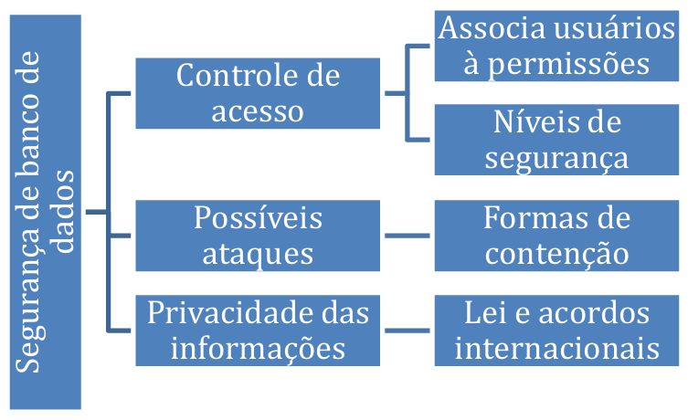
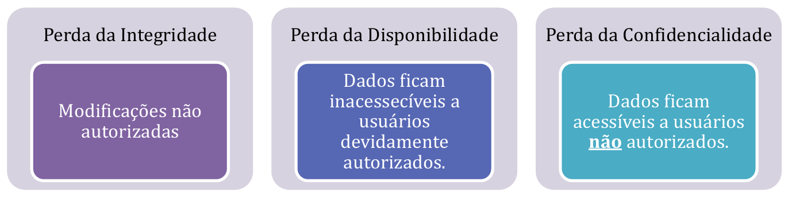
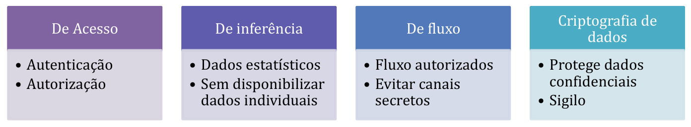
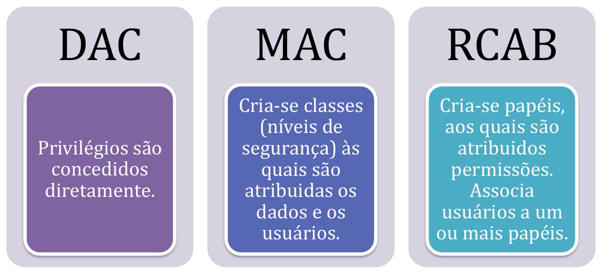

# Capítulo 20 – Segurança em Bancos de Dados

## Introdução à Segurança de Dados

Neste capítulo, nosso foco se volta para um dos aspectos mais críticos e desafiadores da administração de sistemas de informação: a **segurança de banco de dados**. Faremos uma análise aprofundada dos conceitos teóricos e dos mecanismos práticos que sustentam a proteção de dados, abordando desde o controle de acesso e os processos de autenticação e autorização, até os conceitos de auditoria e as considerações gerais sobre a segurança de sistemas.

O termo **segurança**, no contexto de bancos de dados, refere-se à proteção do banco de dados contra acessos não autorizados, sejam eles intencionais ou acidentais. A proteção é implementada através de um conjunto de controles, que podem ser computacionais ou procedimentais. Consideramos **acessos intencionais** aqueles realizados propositadamente com o objetivo de violar a segurança, como um usuário mal-intencionado que tenta obter acesso a dados confidenciais ou um funcionário que compartilha sua senha com pessoas não autorizadas. Por outro lado, **acessos não intencionais** são aqueles que, embora não maliciosos, podem causar algum tipo de perda, seja de consistência, integridade ou disponibilidade dos dados. Um exemplo clássico seria uma queda de energia que corrompe arquivos do banco de dados ou uma alteração indevida de dados feita por um usuário legítimo, porém por engano.

Ao tratarmos de segurança em Sistemas de Gerenciamento de Banco de Dados (SGBDs), podemos analisar o assunto sob diferentes perspectivas. Uma delas é o **controle de acesso**, que descreve como associamos usuários a permissões específicas sobre os objetos do banco de dados. Outra perspectiva envolve a classificação das próprias informações armazenadas, que podem ter restrições de acesso de acordo com o **nível de sigilo** atribuído. É preciso também avaliar os **possíveis vetores de ataque** aos SGBDs e as formas de contenção ou prevenção, que podem envolver desde a validação de entradas até o uso de criptografia e certificados digitais.

Um componente importante e intrinsecamente ligado à segurança é a **privacidade da informação**. Como podemos garantir a preservação da privacidade e o uso adequado dos dados pessoais? Esta é uma questão que transcende a tecnologia, envolvendo aspectos legais e éticos, fundamentais na era da informação digital.

Vamos começar analisando os aspectos ou questões mais importantes sobre segurança em bancos de dados.

<div align="center">
  
</div>

## Pilares e Desafios da Segurança de Dados

### Questões Legais, Éticas e Políticas

Uma condição fundamental da segurança de dados é garantir que o acesso à informação seja concedido apenas a pessoas devidamente autorizadas. Essa permissão não é apenas uma questão técnica, mas também envolve complexas questões legais e éticas relacionadas ao direito de acessar certas informações. No Brasil, por exemplo, a **Lei de Acesso à Informação (Lei nº 12.527/2011)** regulamenta o direito constitucional de acesso às informações públicas, criando mecanismos que possibilitam a qualquer pessoa, física ou jurídica, o recebimento de informações de órgãos e entidades públicas, sem a necessidade de apresentar um motivo.

Em contrapartida, leis como a **Lei Geral de Proteção de Dados (LGPD - Lei nº 13.709/2018)** estabelecem regras rigorosas sobre a coleta, o tratamento, o armazenamento e o compartilhamento de dados pessoais, protegendo os direitos fundamentais de liberdade e de privacidade dos indivíduos.

Questões políticas em nível governamental, bem como políticas institucionais ou corporativas, são responsáveis por definir os tipos de informações que podem (ou devem) se tornar públicas e aquelas que devem ser protegidas. Uma organização, seja ela pública ou privada, deve possuir uma política de segurança da informação clara e bem definida para controlar seus ativos informacionais. O conhecimento a respeito da fórmula de produtos, processos de fabricação, estratégias de mercado ou dados financeiros de certas empresas são segredos industriais guardados a sete chaves. Surge, então, a necessidade de se definir **níveis de segurança** para as informações. Uma classificação amplamente utilizada, especialmente em contextos governamentais e militares, é baseada nos seguintes níveis:

- **Top Secret (TS) - Ultrassecreto:** A divulgação não autorizada pode causar danos excepcionalmente graves à segurança nacional ou aos interesses da organização.
- **Secret (S) - Secreto:** A divulgação não autorizada pode causar danos sérios.
- **Confidential (C) - Confidencial:** A divulgação não autorizada pode causar danos.
- **Unclassified (U) - Não Classificado:** Informação que pode ser divulgada publicamente sem causar danos.

Existe outra questão, de natureza mais técnica, que considera em qual **nível do sistema** devemos tratar os problemas de segurança. Dentro de um arcabouço tecnológico completo de uma organização, precisamos (e podemos) inserir componentes de segurança em diversas camadas, como no nível de hardware, no sistema operacional, no SGBD, em firewalls de rede, em firewalls de aplicação, entre outros. Uma estratégia de segurança robusta, conhecida como **defesa em profundidade**, emprega múltiplos controles em diferentes camadas.

### Objetivos de Segurança da Informação

As ameaças aos bancos de dados, sejam elas intencionais ou acidentais, podem levar à perda total ou parcial de três dos pilares fundamentais da segurança da informação, conhecidos como a **Tríade CIA**: Confidencialidade, Integridade e Disponibilidade (Confidentiality, Integrity, Availability).

<div align="center">
  
</div>

- **Integridade:** No que diz respeito à integridade, é fundamental que o dado esteja protegido de modificação imprópria ou não autorizada. Um dado íntegro é um dado correto, consistente e confiável. Não deve ser possível, por exemplo, que um aluno acesse o banco de dados de uma escola e altere sua própria nota de matemática sem a devida autorização e processo.
- **Disponibilidade:** Devemos garantir que um objeto de dados ou o sistema de banco de dados como um todo esteja disponível para os usuários e programas com legítimo direito de acesso, sempre que eles desejarem ou necessitarem ter esse acesso. Ataques de negação de serviço (DoS) ou falhas de hardware e software que não são devidamente tratadas podem comprometer a disponibilidade.
- **Confidencialidade:** Este pilar trata da proteção dos dados contra a exposição ou divulgação não autorizada. As informações devem ser acessíveis apenas por aqueles que possuem permissão para tal. O impacto da violação da confidencialidade pode variar desde a violação de leis de privacidade de dados, como a LGPD, até o comprometimento da segurança nacional, no caso de dados governamentais sigilosos. A Lei de Proteção de Dados Pessoais (LGPD) tem o propósito de garantir que os dados pessoais não sejam processados, exceto quando estiverem reunidas certas condições legais, que se baseiam em princípios como transparência, finalidade legítima e proporcionalidade.

Além da tríade CIA, outros dois objetivos ou propriedades de segurança são frequentemente considerados, especialmente no contexto de comunicações e transações digitais:

- **Autenticidade:** Visa estabelecer a validade e a genuinidade da transmissão, da mensagem e, crucialmente, do remetente. O objetivo é que o destinatário de uma informação possa comprovar a origem e a autoria de um determinado documento ou transação, garantindo que ele veio de quem diz ter vindo.
- **Não Repúdio (Irretratabilidade):** Visa garantir que o autor ou o originador de uma ação ou documento não possa, posteriormente, negar ter criado, assinado ou enviado esse documento ou realizado essa ação. Mecanismos como assinaturas digitais são usados para prover o não repúdio.

Agora que conhecemos de forma abstrata quais são os objetivos de segurança da informação que podem ser ameaçados por ataques a bancos de dados, vamos conhecer as medidas de controle que podem ser utilizadas para protegê-los.

## Medidas e Mecanismos de Controle de Segurança

Os controles que podem ser implementados para proteger um banco de dados podem ser classificados de diversas formas. Uma delas é dividi-los em controles **baseados em computador** e **não baseados em computador**.

Os controles que não são baseados em computador, também chamados de controles administrativos ou procedimentais, geralmente estão associados a políticas, padrões e planos de segurança estabelecidos pela organização. Exemplos incluem:

- A definição de uma política clara para a criação e cessão de contas de usuários.
- A exigência de que os usuários troquem suas senhas periodicamente.
- A conscientização dos usuários para que não deixem suas senhas registradas em locais de fácil acesso (como em notas adesivas no monitor).
- A realização de verificações de antecedentes de funcionários que terão acesso a dados sensíveis.
- O controle de acesso físico aos data centers e salas de servidores.

Para proteger os dados e alcançar os objetivos de segurança dentro do ambiente computacional, podemos implementar quatro tipos principais de controle técnico: **controle de acesso**, **controle de inferência**, **controle de fluxo** e **criptografia de dados**.

<div align="center">
  
</div>

- **Controle de Acesso:** Um sistema de banco de dados (SBD) precisa incluir provisões robustas para restringir o acesso tanto ao SBD como um todo quanto aos objetos específicos dentro dele (tabelas, visões, procedimentos, etc.). Para isso, normalmente se cria **contas de usuários** e se exige o uso de **senhas** (ou outras formas de credenciais, como autenticação multifator) para controlar o processo de login e acesso ao SGBD. Geralmente, o acesso aos dados ocorre em duas etapas. Em um primeiro momento, é feita uma **autenticação**, para verificar se o usuário é quem ele diz ser. Após se autenticar com sucesso, o sistema de **autorização** entra em ação, verificando quais permissões (privilégios) esse usuário possui sobre os objetos e os dados do banco. Todos os SGBDs modernos implementam um subsistema de segurança e autorização que permite restringir o acesso apenas a usuários autorizados. Esse subsistema pode ser:
    - **Discricionário (Discretionary Access Control - DAC):** Onde os privilégios de acesso são concedidos diretamente a cada usuário (ou a papéis/grupos de usuários), geralmente pelo proprietário do objeto de dados.
    - **Obrigatório (Mandatory Access Control - MAC):** Onde o acesso é governado por regras centrais do sistema, que impõem uma segurança multinível através da classificação de dados e usuários em várias classes de segurança. Este modelo é geralmente parte de uma política de segurança mais ampla e menos flexível.
    - **Baseado em Papéis (Role-Based Access Control - RBAC):** Uma extensão e um refinamento dos mecanismos de controle de acesso, onde as permissões são associadas a papéis organizacionais, e os usuários recebem permissões ao serem atribuídos a esses papéis. Falaremos sobre cada um desses modelos de controle de acesso em detalhe mais adiante. Por enquanto, é importante que você se lembre dos diferentes tipos, conforme a figura abaixo.

<div align="center">
  
</div>

- **Controle de Inferência:** Vamos agora para o outro tipo de controle. Deixe-me contextualizar. É possível e comum o uso de **bancos de dados estatísticos**, cujo objetivo é fornecer dados agregados (somas, médias, contagens) ao público ou a analistas, sem disponibilizar os dados brutos individualmente, para proteger a privacidade. O problema é que, às vezes, é possível **inferir** dados sobre indivíduos específicos a partir de uma série de consultas agregadas habilmente formuladas. É necessário, portanto, controlar esse tipo de inferência sobre os dados. A área de segurança em bancos de dados estatísticos estuda e desenvolve técnicas para executar tal tarefa, e essas ações são chamadas de **controle de inferência**. Elas podem incluir técnicas como perturbação de dados (adicionar "ruído" aos resultados), recusa de consultas que abrangem um número muito pequeno de indivíduos, e generalização de dados.
- **Controle de Fluxo:** O controle de fluxo visa impedir que as informações "fluam" de uma forma que violem a política de segurança, alcançando usuários não autorizados. É necessário evitar os chamados **canais secretos (_covert channels_)**, que são percursos ou mecanismos não óbvios pelos quais a informação pode fluir implicitamente, contornando os controles de acesso explícitos. Por exemplo, um processo com alta permissão de segurança poderia tentar vazar informações para um processo de baixa permissão, modulando o uso da CPU ou o tempo de resposta do sistema de uma forma que o processo de baixa permissão pudesse decodificar. O controle de fluxo é um problema complexo, especialmente em ambientes onde o MAC é necessário.
- **Criptografia de Dados:** A criptografia é amplamente utilizada para proteger dados confidenciais que são transmitidos por um meio de comunicação inseguro (como a internet) e também como uma camada adicional de proteção para partes sensíveis do banco de dados quando estão armazenadas em disco (_data at rest_). Mesmo que um atacante consiga acesso físico aos arquivos do banco de dados, os dados criptografados estarão ilegíveis sem a chave de decriptação correta.

Existe outra forma de classificar as medidas de controle baseadas em computador, focando mais nas funcionalidades oferecidas pelos SGBDs. Elas podem ser agrupadas nas seguintes categorias:

- **Autorização:** Refere-se à concessão de um direito ou de um privilégio a um usuário (ou a um programa) para que ele possa acessar legitimamente o sistema ou um objeto do sistema. É o coração do controle de acesso.
- **Visões (_Views_):** Uma visão é uma tabela virtual cujo conteúdo é definido por uma consulta. É um mecanismo poderoso que permite estabelecer porções de dados que podem ser visualizadas por um determinado usuário (ou programa), escondendo colunas ou linhas sensíveis das tabelas subjacentes.
- **Backup e Recuperação de Falhas:** Refere-se aos mecanismos (discutidos em capítulos anteriores) necessários para garantir a **disponibilidade** do sistema em caso de falhas de hardware, software ou outras.
- **Integridade:** Refere-se aos controles que contribuem para manter a segurança do sistema, evitando que dados inválidos ou inconsistentes sejam registrados no banco. Isso inclui restrições de chave primária, chave estrangeira, unicidade, tipo de dado e outras regras de negócio.
- **Criptografia:** Refere-se à codificação dos dados a partir de um algoritmo especial que os torna ilegíveis sem que se tenha a chave correta para decifrá-los.
- **Auditoria:** Tem por objetivo registrar e permitir a verificação posterior das ações e acessos que são realizados sobre o sistema, observando se esses acessos seguem as políticas de segurança propostas e permitindo a investigação de atividades suspeitas.

Após analisar os controles que podem existir dentro dos sistemas de banco de dados, vamos tentar associar esses controles às funções exercidas pelo Administrador de Banco de Dados (DBA).

### **19.3 O Papel do Administrador de Banco de Dados (DBA) na Segurança**

O **Administrador de Banco de Dados (DBA)** é a autoridade central para o gerenciamento técnico e operacional de um SGBD. Entre suas múltiplas responsabilidades, o DBA desempenha um papel fundamental na implementação e manutenção da **segurança geral do banco de dados**. Para exercer essa função, o DBA geralmente possui uma conta de superusuário ou uma conta de sistema (como `SYS` no Oracle ou `sa` no SQL Server), que detém os mais altos privilégios sobre o SGBD.

Por meio desta conta privilegiada, o DBA pode definir e gerenciar toda a estrutura de acesso ao banco de dados, desde a criação de contas de usuário até a concessão e revogação de privilégios específicos. As atividades de segurança que estão, tipicamente, sob a responsabilidade do DBA incluem:

- **Criação e Gerenciamento de Contas de Usuário:** Definir novos usuários, atribuir senhas iniciais, gerenciar perfis e remover contas que não são mais necessárias.
- **Concessão de Privilégios (Autorização):** Conceder os privilégios necessários para que os usuários e aplicações possam realizar suas tarefas legítimas, seguindo o **princípio do menor privilégio** (conceder apenas as permissões estritamente necessárias, e nada mais).
- **Revogação de Privilégios:** Remover privilégios de usuários que mudam de função ou que não precisam mais de um determinado acesso, garantindo que as permissões estejam sempre alinhadas com as necessidades atuais.
- **Atribuição de Nível de Segurança (em ambientes com MAC):** Implementar as políticas de segurança da organização, classificando os usuários e os dados de acordo com os níveis de segurança definidos (Confidencial, Secreto, etc.).
- **Configuração e Monitoramento de Auditoria:** Habilitar a auditoria para atividades críticas ou sensíveis no banco de dados e analisar os registros da trilha de auditoria para detectar atividades suspeitas ou violações de política.

O DBA deve considerar, dentro de suas atribuições no contexto de segurança em bancos de dados, uma análise contínua de riscos, considerando as seguintes situações de ameaça:

- **Roubo e Fraude de Informação:** Apropriação indevida de dados sensíveis para ganho financeiro ou outros fins ilícitos.
- **Perda de Confiabilidade (ou Confidencialidade):** Vazamento de informações confidenciais para partes não autorizadas.
- **Perda de Privacidade:** Exposição ou uso indevido de dados pessoais de clientes, funcionários ou outros indivíduos.
- **Perda de Integridade:** Modificação não autorizada ou corrupção de dados, levando a informações incorretas e decisões erradas.
- **Perda de Disponibilidade:** Interrupção do acesso ao banco de dados, impedindo que as operações de negócio prossigam.

### **19.4 Classificação, Sensibilidade e Privacidade dos Dados**

#### **19.4.1 Dados Sensíveis e Níveis de Exposição**

A **sensibilidade dos dados** é uma medida da importância atribuída a um dado por seu proprietário ou pela legislação, com a finalidade de indicar o seu grau de necessidade de proteção. É preciso ter a consciência de que a implementação de níveis de segurança mais altos para proteger dados sensíveis geralmente envolve custos maiores de planejamento, tecnologia e operação. Saber responder se determinados dados são ou não sigilosos e qual o seu grau de sensibilidade é importante para aplicar os controles de segurança adequados e evitar o desperdício de recursos (proteger excessivamente dados não sensíveis) ou a exposição a riscos inaceitáveis (proteger insuficientemente dados sensíveis).

Um conjunto de fatores que devem ser considerados para classificar um dado como sensível inclui:

- **Ser Inerentemente Confidencial:** O valor do próprio dado pode ser tão revelador ou privado que ele se torna, por sua natureza, sensível. Exemplos clássicos incluem o salário de uma pessoa, o prontuário médico de um paciente (especialmente com diagnósticos como HIV/AIDS), ou informações biométricas.
- **Vir de uma Fonte Confidencial:** A fonte dos dados pode, por si só, indicar a necessidade de proteção. Por exemplo, informações fornecidas por um informante anônimo em uma investigação criminal precisam ter sua fonte mantida em segredo para proteger o informante.
- **Ser Declarado Confidencial:** O proprietário dos dados (seja uma pessoa, empresa ou órgão governamental) pode tê-los declarado explicitamente como confidenciais através de uma política de classificação da informação.
- **Ser um Atributo ou Registro Confidencial:** Um atributo específico em uma tabela pode ser declarado confidencial (por exemplo, o atributo `salario` em uma tabela de funcionários), ou um registro inteiro pode ser confidencial (por exemplo, o registro do histórico de salários de um alto executivo).
- **Tornar-se Confidencial em Relação a Dados Previamente Expostos (Inferência):** Alguns dados podem não ser confidenciais por si só, mas se tornam sensíveis quando combinados com outros dados que já estão publicamente disponíveis. Por exemplo, a localização exata (endereço) de onde ocorreu um determinado evento pode não ser sensível, mas se o evento, que foi previamente registrado, mais tarde se torna confidencial (por exemplo, o local de uma reunião secreta), a informação de localização também se torna sensível por associação.

A equação para balancear o custo-benefício de declarar um dado como confidencial e aplicar os controles necessários envolve os aspectos de segurança e precisão. Um dos objetivos é garantir que todos os dados definidos como confidenciais sejam mantidos seguros contra adulteração (integridade) e divulgação não autorizada (confidencialidade), através de um controle de acesso adequado. **Prover segurança**, neste contexto, significa expor apenas dados não confidenciais e rejeitar qualquer consulta que referencie diretamente um campo ou dado confidencial para um usuário não autorizado.

Como administradores de banco de dados e projetistas de sistemas, nosso objetivo é manter a **segurança perfeita** com a **máxima precisão**. A **precisão**, aqui, refere-se à capacidade de proteger _todos_ os dados confidenciais enquanto se expõe o _máximo possível_ dos dados não confidenciais. Um sistema que é seguro, mas que bloqueia o acesso a muitos dados não confidenciais por excesso de zelo, pode não ser útil.

#### **19.4.2 Privacidade da Informação**

Outro aspecto fundamental da segurança está relacionado à **privacidade**. Como podemos garantir e proteger o uso adequado de informações pessoais? Existem diversas dimensões sob as quais podemos analisar esse questionamento, que incluem dimensões filosóficas, legais e práticas.

Existe uma sobreposição considerável entre as questões relacionadas ao **acesso a recursos (segurança)** e as questões relacionadas ao **uso apropriado da informação (privacidade)**.

- **Segurança (no contexto de TI)** diz respeito a muitos aspectos da proteção de um sistema contra o acesso e o uso não autorizado. Isso inclui a autenticação de usuários para provar quem são, a criptografia da informação para protegê-la de olhares indiscretos, o controle de acesso para definir quem pode fazer o quê, as políticas de firewall para proteger o perímetro da rede, e a detecção de intrusos para identificar atividades maliciosas.
- **Privacidade**, por outro lado, vai além do conceito de segurança. Ela examina se o uso da informação pessoal que um sistema adquire sobre um indivíduo está de acordo com as suposições explícitas (termos de serviço, consentimento) e implícitas (expectativas sociais, legislação) relativas a esse uso.

Do ponto de vista do usuário final (o titular dos dados), a privacidade envolve duas perspectivas diferentes:

- **Impedir o armazenamento desnecessário ou não consentido de informações pessoais.**
- **Garantir o uso apropriado e limitado dessas informações, uma vez que elas foram legitimamente coletadas.**

Podemos definir **privacidade** como a capacidade dos indivíduos de controlar os termos sob os quais suas informações pessoais são adquiridas, usadas, armazenadas e compartilhadas. A segurança da informação é, portanto, o conjunto de mecanismos técnicos e administrativos que utilizamos para implementar e garantir as políticas de privacidade.

Até aqui, analisamos os vários aspectos teóricos introdutórios de segurança em bancos de dados. Nas próximas partes deste capítulo, analisaremos os aspectos práticos sobre a implementação efetiva dessas tecnologias.

### **19.5 Modelos e Implementação de Controle de Acesso**

#### **19.5.1 Autorização de Acesso em SQL**

Os mecanismos de autorização em um SGBD envolvem, como vimos, duas abordagens complementares: **autenticação** e **autorização de acesso**. A primeira tem por objetivo verificar se o usuário que tenta acessar o sistema é quem ele realmente diz ser. Em SGBDs, a forma mais comum de autenticação é através de um nome de usuário e uma senha, embora este recurso, por si só, possa não ser totalmente seguro (senhas podem ser fracas, roubadas ou compartilhadas). O mecanismo de **autorização** entra em ação após a autenticação bem-sucedida e permite conceder privilégios específicos sobre cada um dos objetos do banco de dados (tabelas, visões, etc.) aos usuários. Desse modo, apenas os usuários que têm o privilégio adequado sobre um objeto podem acessá-lo e realizar as operações permitidas.

A linguagem SQL padrão inclui um conjunto de comandos da **Linguagem de Definição de Dados (DDL)** que permitem ao DBA (ou a outros usuários com as devidas permissões) gerenciar a segurança do banco de dados.

##### **Criando Usuários**

Os usuários são criados no banco de dados pelo administrador do sistema (DBA) ou por outra conta com privilégios de criação de usuários. Geralmente, é o DBA que também concede os privilégios iniciais que esse usuário terá no sistema.

**Exemplo:**

SQL

```
CREATE USER ALUNO IDENTIFIED BY 'ALUNOSENHA';
```

A execução do comando acima, em um SGBD como o Oracle ou MySQL (com sintaxe ligeiramente variável), criará um usuário chamado `ALUNO`, cuja senha para autenticação é `ALUNOSENHA`.

##### **Concedendo e Revogando Privilégios de Acesso**

O fato de criar um usuário não significa, por padrão, que ele terá acesso a quaisquer objetos do banco de dados (exceto, talvez, o privilégio de se conectar). Em SQL, para que um usuário tenha acesso aos objetos de um esquema, ele deve receber, **explicitamente**, esse privilégio. Da mesma forma, caso ele deixe de precisar ter acesso a esses objetos, os direitos deverão ser **revogados**, também de forma explícita.

**Quem pode conceder/revogar privilégios?** A resposta é: o **proprietário do objeto** (o usuário que o criou) ou um usuário que tenha recebido o privilégio com a permissão de concedê-lo a outros (como veremos com a opção `WITH GRANT OPTION`). O DBA, como superusuário, geralmente pode conceder e revogar qualquer privilégio.

**Que privilégios podem ser concedidos/revogados?** Em SQL, os privilégios mais comuns que podem ser atribuídos a objetos como tabelas e visões são:

- **`SELECT`**: Permite recuperar (ler) dados de uma tabela ou visão.
- **`INSERT`**: Permite inserir novas tuplas (linhas) em uma tabela.
- **`UPDATE`**: Permite modificar tuplas existentes em uma tabela. Pode ser concedido para a tabela inteira ou para colunas específicas.
- **`DELETE`**: Permite remover tuplas de uma tabela.
- **`EXECUTE`**: Permite executar um procedimento armazenado (_stored procedure_) ou uma função.
- **`REFERENCES`**: Permite que um usuário crie uma restrição de chave estrangeira em sua própria tabela que referencia colunas de uma tabela de outro esquema.

O comando SQL para conceder privilégios a um usuário é o **`GRANT`**.

Sintaxe:

GRANT <lista_de_privilégios> ON <nome_do_objeto> TO <lista_de_usuários_ou_papéis>;

**Exemplo:** Autorizar o usuário `Pedro` a realizar operações de leitura (`SELECT`) e atualização (`UPDATE`) na tabela `FUNCIONARIO`.

SQL

```
GRANT SELECT, UPDATE ON FUNCIONARIO TO PEDRO;
```

Para **revogar (remover)** privilégios previamente concedidos, utiliza-se o comando **`REVOKE`**.

Sintaxe:

REVOKE <lista_de_privilégios> ON <nome_do_objeto> FROM <lista_de_usuários_ou_papéis>;

**Exemplo:** Retirar a autorização de atualização (`UPDATE`) sobre a tabela `FUNCIONARIO` que havia sido concedida ao usuário `Pedro`.

SQL

```
REVOKE UPDATE ON FUNCIONARIO FROM PEDRO;
```

##### **Papéis (Roles)**

Como você pode observar, para cada objeto do esquema, devem ser definidos quais usuários terão direito sobre ele e que tipo de direito terão. Em um ambiente com muitos usuários e muitos objetos, gerenciar privilégios individualmente pode se tornar uma tarefa extremamente complexa e propensa a erros. Para facilitar a administração do sistema, a maioria dos SGBDs oferece o conceito de **papéis (_roles_)**. Uma _role_ é, essencialmente, uma coleção nomeada de privilégios. Em vez de conceder privilégios diretamente a usuários individuais, podemos concedê-los a uma _role_ e, em seguida, conceder essa _role_ a um ou mais usuários.

Veja abaixo uma ilustração da relação entre usuários e privilégios, primeiramente sem o uso de papéis.

&lt;div align="center">

&lt;img src="https://placehold.co/600x400/EEE/31343C?text=Figura+20.5+-+Usuários+e+Privilégios+Individuais" alt="Figura 20.5 - Usuários e os privilégios individuais sobre tabelas">

&lt;figcaption>Figura 20.5 - Usuários e os privilégios individuais sobre tabelas&lt;/figcaption>

&lt;/div>

A vantagem na utilização de _roles_ é imensa. Se novas tabelas precisam ser adicionadas ao conjunto de permissões de um grupo de usuários com a mesma função (por exemplo, "Analistas de Vendas"), basta atribuir o novo privilégio à _role_ `RL_VENDAS`, e todos os usuários que possuem essa _role_ passarão a ter o novo privilégio automaticamente. Além disso, se um novo funcionário é contratado para essa função, basta conceder a ele a _role_ apropriada, em vez de ter que conceder dezenas de privilégios individuais.

O uso de _roles_ em SQL é muito similar ao uso dos privilégios. Primeiro, é necessário criar a _role_. Em seguida, concedem-se privilégios a essa _role_. Finalmente, a _role_ é concedida aos usuários.

**Exemplo:** Definir um papel (_role_) chamado `RL_FUNCIONARIO` que permita a recuperação (`SELECT`) e a atualização (`UPDATE`) de dados da tabela `FUNCIONARIO`, e depois atribuir esse papel ao usuário `Pedro`:

1. **Criar a _role_:**
    
    SQL
    
    ```
    CREATE ROLE RL_FUNCIONARIO;
    ```
    
2. **Conceder privilégios à _role_:**
    
    SQL
    
    ```
    GRANT SELECT, UPDATE ON FUNCIONARIO TO RL_FUNCIONARIO;
    ```
    
3. **Conceder a _role_ ao usuário:**
    
    SQL
    
    ```
    GRANT RL_FUNCIONARIO TO PEDRO;
    ```
    

A figura abaixo ilustra o cenário com a presença de papéis, que atuam como uma camada intermediária entre usuários e privilégios.

&lt;div align="center">

&lt;img src="https://placehold.co/700x450/EEE/31343C?text=Figura+20.6+-+Uso+de+Papéis+(Roles" alt="Figura 20.6 - Presença de usuários, privilégios sobre tabelas e papéis">

&lt;figcaption>Figura 20.6 - Presença de usuários, privilégios sobre tabelas e papéis&lt;/figcaption>

&lt;/div>

Também é possível criar hierarquias de papéis, ou seja, atribuir uma _role_ a outra _role_. Por exemplo, se agora fosse criada uma _role_ `RL_DEPENDENTES` que permite selecionar, inserir e atualizar a tabela `DEPENDENTES` de um funcionário, e se os usuários com o papel `RL_FUNCIONARIO` também pudessem executar essas operações, pode-se fazer isso de duas formas:

SQL

```
-- Conceder ambas as roles diretamente ao usuário
GRANT RL_FUNCIONARIO, RL_DEPENDENTES TO PEDRO;
```

ou

SQL

```
-- Criar uma hierarquia, onde RL_FUNCIONARIO herda os privilégios de RL_DEPENDENTES
GRANT RL_DEPENDENTES TO RL_FUNCIONARIO;
```

Na segunda abordagem, qualquer usuário que receber a _role_ `RL_FUNCIONARIO` também receberá, implicitamente, todos os privilégios da _role_ `RL_DEPENDENTES`.

##### **Sinônimos**

Outro recurso oferecido por alguns SGBDs, como o Oracle, que pode auxiliar na gestão de acesso e na simplificação do código de aplicação, é a possibilidade do uso de **sinônimos**. Um sinônimo tem por objetivo oferecer transparência no acesso aos objetos, criando um "apelido" para um objeto de banco de dados (como uma tabela, visão ou procedimento).

Quando um objeto é acessado por um usuário que não é o seu proprietário, ele deve ser referenciado pelo nome qualificado: `[nome_do_proprietario].[nome_do_objeto]`. Por exemplo, `RH.FUNCIONARIO`. Isso pode tornar o código SQL mais verboso e dependente do nome do esquema proprietário.

O sinônimo cria um apelido que pode ser usado em seu lugar. Ele pode ser privado (acessível apenas pelo usuário que o criou) ou público (acessível por todos os usuários do banco, desde que tenham privilégio sobre o objeto original).

**Exemplo:**

SQL

```
CREATE PUBLIC SYNONYM FUNCIONARIO FOR RH.FUNCIONARIO;
```

Neste exemplo, foi criado um sinônimo público para a tabela `FUNCIONARIO`, que pertence ao esquema `RH`, e o sinônimo também se chama `FUNCIONARIO`. A partir da criação deste sinônimo, todos os usuários que tiverem privilégio sobre a tabela `RH.FUNCIONARIO` poderão referenciá-la simplesmente como `FUNCIONARIO` em suas consultas, sem precisar especificar o nome do esquema proprietário.

Apresentamos alguns aspectos práticos do uso de SQL para controle de acesso. Vamos agora voltar para a teoria e analisar os modelos de controle de acesso com mais profundidade.

#### **19.5.2 Controle de Acesso Discricionário (DAC)**

O modelo de **Controle de Acesso Discricionário**, conhecido pela sigla **DAC (_Discretionary Access Control_)**, é o modelo de segurança implementado pela maioria dos SGBDs comerciais e se baseia na concessão e revogação de privilégios. A característica "discricionária" deste modelo reside no fato de que o controle sobre o acesso a um objeto (como uma tabela) está à **discrição do proprietário desse objeto**. O proprietário tem a autoridade para decidir quem mais pode acessar seu objeto e quais tipos de acesso (privilégios) são permitidos. Um identificador de autorização (como um nome de usuário ou um nome de _role_) é usado para se referir à conta de usuário ou grupo de contas de usuário que devem ter o privilégio de acesso.

Existem, conceitualmente, dois níveis de atribuição de privilégios que podem ser encontrados em sistemas de banco de dados que utilizam DAC:

- **Nível de Conta:** Neste nível, o DBA especifica os privilégios que uma conta de usuário mantém em um nível mais amplo, independentemente das relações específicas do banco de dados. Por exemplo, privilégios de sistema como `CREATE TABLE` (permissão para criar novas tabelas), `CREATE USER`, ou `BACKUP DATABASE`. Quando o DBA define que um usuário tem um privilégio sobre um esquema de banco de dados inteiro, esse usuário pode ter acesso a todas as relações e visões deste esquema, e pode até mesmo executar comandos DDL para modificar e criar objetos dentro dele.
- **Nível de Relação (ou Tabela):** Este é o modelo de segurança de objetos mais granular e é o padrão estabelecido desde a norma SQL-92. Para cada usuário, os privilégios sobre as relações e visões específicas são concedidos individualmente (ou através de _roles_). Alguns privilégios, como `UPDATE` ou `REFERENCES`, podem ser ainda mais granulares, sendo aplicados a atributos (colunas) específicos de uma relação. Já vimos exemplos do uso do comando `GRANT` em SQL para este nível de controle.

Ainda dentro do contexto do DAC, é possível representar o estado de todas as permissões no sistema usando um modelo conceitual de **matriz de acesso**. Nesta matriz, as linhas representam os **sujeitos** (usuários, contas ou programas) e as colunas representam os **objetos** (tabelas, visões, etc.). Cada célula `(i, j)` na matriz especifica os tipos de privilégios (leitura, escrita, atualização, etc.) que o sujeito _i_ possui sobre o objeto _j_. Embora os SGBDs não implementem fisicamente uma matriz literal (que seria muito esparsa e ineficiente), eles utilizam estruturas de dados internas (como listas de controle de acesso ou tabelas de privilégios no catálogo do sistema) que representam a mesma lógica.

O uso de **`VIEW`s** (visões), como mencionado anteriormente, é considerado um mecanismo poderoso de autorização discricionária. Ao criar uma visão que seleciona apenas certas colunas ou certas linhas de uma tabela base, o proprietário pode conceder permissão de `SELECT` sobre a visão para outros usuários, permitindo que eles vejam apenas a porção dos dados definida pela visão, sem dar-lhes acesso direto à tabela subjacente completa.

Vamos agora revisitar o comando `GRANT`, mais especificamente a cláusula **`WITH GRANT OPTION`**.

SQL

```
GRANT <nome_do_privilégio> 
ON <nome_do_objeto> 
TO {<nome_usuário> | PUBLIC | <nome_role>}
[ WITH GRANT OPTION ];
```

A cláusula `WITH GRANT OPTION`, quando incluída em um comando `GRANT`, permite a **propagação da permissão** pelo usuário que a recebeu. Ou seja, se o usuário A concede um privilégio ao usuário B com a `WITH GRANT OPTION`, o usuário B não só pode exercer esse privilégio, mas também pode concedê-lo a um terceiro usuário, C.

Algumas considerações importantes sobre esta propagação são:

- Primeiro, caso não seja atribuído nenhum limite, a propagação de privilégios pode ocorrer em cascata entre diversos usuários, o que pode tornar difícil rastrear quem concedeu permissão a quem.
- Segundo, quando um privilégio é revogado (usando o comando `REVOKE`), o comportamento padrão em muitos sistemas é a **revogação em cascata**. Se o usuário A revoga um privilégio de B que foi concedido com a `WITH GRANT OPTION`, todos os usuários que receberam o privilégio a partir de B (como o usuário C) também terão o privilégio revogado automaticamente.

Uma pergunta pode surgir neste momento: e se o usuário X recebeu o privilégio sobre a relação R tanto do usuário Y quanto do usuário Z, ambos com a `WITH GRANT OPTION`? Como fica a permissão de X sobre R se os privilégios de Y forem revogados? Neste caso, o usuário X continuará tendo o privilégio, porque ele ainda o possui através da concessão feita por Z. Este exemplo é importante, pois mostra a necessidade de o SGBD guardar um grafo completo de todas as concessões para gerenciar as revogações corretamente.

A sintaxe do comando `REVOKE` pode incluir opções como `RESTRICT` (impede a revogação se houver dependências, como privilégios concedidos a partir daquele que está sendo revogado) ou `CASCADE` (a revogação se propaga em cascata), dependendo do padrão SQL e da implementação do SGBD.

Sobre a propagação de privilégios, alguns SGBDs (especialmente em contextos de pesquisa) fornecem mecanismos para que essa propagação seja limitada. É possível, teoricamente, limitar a propagação de forma **horizontal**, significando que uma conta que recebe o privilégio só pode propagá-lo para um número máximo _i_ de outras contas. Outra opção é limitar a propagação de forma **vertical**, restringindo a profundidade da cadeia de concessão. Assim, cada vez que uma nova concessão é feita, um valor de profundidade definido na concessão original é reduzido em uma unidade e passado como parâmetro na nova concessão, até chegar a zero.

Sobre as políticas de controle de acesso discricionário, sabemos que elas são caracterizadas por seu alto grau de flexibilidade, o que as torna adequadas a uma grande variedade de domínios de aplicação. A principal desvantagem dos modelos DAC é sua vulnerabilidade a ataques maliciosos, como os **cavalos de Troia**. Um cavalo de Troia é um programa que parece executar uma função útil, mas que, secretamente, realiza ações maliciosas. Por exemplo, um usuário pode ser enganado a executar um programa que, enquanto realiza sua tarefa aparente, copia dados sensíveis do usuário para um local acessível pelo atacante. Como o programa executa com os privilégios do usuário que o invocou, o modelo DAC não consegue impedir esse tipo de vazamento de informação.

#### **19.5.3 Controle de Acesso Obrigatório (MAC) e Baseado em Papéis (RBAC)**

&lt;div align="center">

&lt;img src="https://placehold.co/700x350/EEE/31343C?text=Figura+20.7+-+Modelos+de+Controle+de+Acesso+(DAC,MAC,RBAC" alt="Figura 20.7 - Comparativo entre os modelos DAC, MAC e RBAC">

&lt;figcaption>Figura 20.7 - Comparativo entre os modelos de controle de acesso DAC, MAC e RBAC&lt;/figcaption>

&lt;/div>

Já falamos no bloco anterior da aula sobre o controle de acesso discricionário (DAC). Vamos agora tratar do **controle mandatório ou obrigatório (MAC)** e do **controle baseado em papéis (RBAC)**.

##### **Controle de Acesso Obrigatório (MAC)**

O **Controle de Acesso Obrigatório (MAC)** parte da necessidade de um nível de segurança mais estrito e centralizado, como o que existe em aplicações de governo, militares e de inteligência, ou ainda em ambientes industriais e corporativos com requisitos de segurança muito elevados. O MAC não se baseia na discrição do proprietário do dado; em vez disso, o acesso é governado por regras e políticas de segurança impostas pelo próprio sistema (ou por uma autoridade de segurança central). Ele é normalmente combinado com mecanismos de controle discricionários. Seu objetivo principal é impedir qualquer fluxo ilegal de informação, garantindo que as políticas de segurança da organização sejam cumpridas de forma rigorosa. Para isso, o MAC exige uma **classificação de segurança** para todos os **sujeitos** (usuários, processos) e **objetos** (dados, arquivos, tabelas) do sistema.

O controle multinível do MAC é baseado na definição de **níveis de segurança** (ou classes de segurança). Como mencionado anteriormente, uma hierarquia comum de níveis de segurança inclui: **Top Secret (TS)**, **Secret (S)**, **Confidential (C)** e **Unclassified (U)**.

O modelo clássico para implementar MAC em sistemas é o **modelo de Bell-LaPadula**, que se encarrega de fazer uma associação formal entre os objetos do banco de dados e os sujeitos que desejam ter acesso às informações. Essa "cola" é feita por meio da classificação de segurança, que atribui tanto ao sujeito (sua **credencial de segurança**, ou _clearance_) quanto ao objeto (sua **classificação de sensibilidade**) uma classe de segurança da hierarquia.

Este modelo impõe duas restrições (propriedades) fundamentais para controlar o fluxo de informação:

1. **A Propriedade de Segurança Simples (No Read Up):** Esta propriedade diz que um sujeito S **não tem permissão para acesso de leitura a um objeto O**, a menos que a classe de segurança do sujeito seja maior ou igual à classe de segurança do objeto: **`Classe(S) ≥ Classe(O)`**. Essa restrição é óbvia e intuitiva: um usuário só pode ler informações que estão em seu nível de segurança ou em um nível inferior. Um general com credencial _Top Secret_ pode ler documentos secretos e confidenciais, mas um soldado com credencial _Confidential_ não pode ler um documento _Top Secret_.
2. **A Propriedade Estrela (*-property ou No Write Down):** Esta propriedade diz que um sujeito S **não tem permissão para escrever em um objeto O**, a menos que a classe de segurança do objeto seja maior ou igual à classe de segurança do sujeito: **`Classe(O) ≥ Classe(S)`**. Basicamente, ela não permite que um sujeito escreva informações em um objeto que tenha uma classificação de segurança inferior à sua própria credencial. O objetivo é evitar que informações de um nível mais alto "vazem" para um nível mais baixo. Isso impede, por exemplo, que um general (sujeito com credencial TS) leia um documento Top Secret e, em seguida, copie seu conteúdo para um novo documento com classificação _Unclassified_, que poderia então ser lido por qualquer pessoa.

Outro ponto interessante e complexo que surge dentro do contexto do modelo de acesso obrigatório é a **poli-instanciação**. Este conceito é necessário para lidar com situações em que a existência de uma determinada informação em um nível de segurança mais alto não pode ser revelada a usuários de níveis mais baixos. A ideia é que um mesmo objeto (por exemplo, uma linha de uma tabela identificada pela mesma chave primária) pode ter múltiplas "instâncias" ou versões, cada uma visível em um nível de segurança diferente. A figura a seguir ilustra o que pode acontecer com os dados quando admitimos o uso deste conceito. Um usuário com baixa credencial pode ver uma versão de um registro, enquanto um usuário com alta credencial pode ver uma versão diferente (e mais completa ou verdadeira) do mesmo registro, ou até mesmo ver registros que são completamente invisíveis para o usuário de baixa credencial.

&lt;div align="center">

&lt;img src="https://placehold.co/700x400/EEE/31343C?text=Figura+20.8+-+Poli-instanciação+em+Relação+Multinível" alt="Figura 20.8 - Uma relação multinível para ilustrar a segurança multinível e a poli-instanciação">

&lt;figcaption>Figura 20.8 - Uma relação multinível para ilustrar a segurança multinível e a poli-instanciação&lt;/figcaption>

&lt;/div>

##### **Controle de Acesso Baseado em Papéis (RBAC)**

Por fim, vamos falar novamente do **Controle de Acesso Baseado em Papéis**, ou **Role-Based Access Control (RBAC)**. Sua noção básica é que os privilégios e outras permissões não são concedidos diretamente a usuários individuais, mas sim a **papéis (_roles_)**, que representam funções, cargos ou responsabilidades organizacionais (como "Gerente de Vendas", "Analista Financeiro", "Administrador de Sistema"). O RBAC surgiu rapidamente nos anos 1990 como uma abordagem intermediária e mais gerenciável entre a total flexibilidade (e potencial insegurança) do DAC e a rígida estrutura do MAC.

A partir do comando `CREATE ROLE`, foi possível definir os diferentes perfis de usuários, conhecidos como papéis. Os indivíduos são então designados para os papéis apropriados. A administração do sistema se torna muito mais simples, pois, em vez de gerenciar as permissões para centenas ou milhares de usuários, o administrador gerencia as permissões para um número muito menor de papéis.

Um conceito importante no RBAC é a **separação de deveres (_separation of duties_)**, que pode ser implementada definindo papéis com permissões mutuamente exclusivas e garantindo que um mesmo indivíduo não possa ser atribuído a papéis conflitantes simultaneamente. Isso pode ser importante para evitar a conivência e a fraude (por exemplo, a mesma pessoa não deveria ter o papel de "Aprovador de Pagamentos" e "Solicitante de Pagamentos").

Como já vimos, existe a possibilidade de construir uma **hierarquia de papéis**, onde um papel pode herdar todas as permissões de outro papel de nível inferior. Observamos um exemplo prático da criação de _roles_ quando falamos de SQL. O exemplo abaixo mostra como o processo funciona no SGBD Oracle:

1. **Faça login do SQL*Plus com um usuário que tenha permissão para criar papéis (como o `HR` ou um DBA).**
2. **Digite o seguinte comando para criar a role:**
    
    SQL
    
    ```
    CREATE ROLE VENDEDORES;
    ```
    
    Você receberá a seguinte mensagem: `Role created`.
3. **Adicione permissões à role:**
    
    SQL
    
    ```
    GRANT INSERT ON SALES TO VENDEDORES;
    GRANT UPDATE ON INVENTORY TO VENDEDORES;
    GRANT DELETE ON ORDERS TO VENDEDORES;
    ```
    
4. **Associe os empregados (usuários) à role:**
    
    SQL
    
    ```
    GRANT VENDEDORES TO BOB, JOSE, MARIA;
    ```
    
    Você receberá a mensagem: `Grant Succeeded`.

Usando a lógica acima, podemos montar uma estratégia hierárquica para a atribuição de privilégios nos sistemas, tornando a gestão de segurança mais alinhada com a estrutura organizacional. Veja na figura abaixo um exemplo de hierarquia de papéis.

&lt;div align="center">

&lt;img src="https://placehold.co/600x400/EEE/31343C?text=Figura+20.9+-+Hierarquia+de+Papéis+(Roles" alt="Figura 20.9 - Exemplo de hierarquia em Roles">

&lt;figcaption>Figura 20.9 - Exemplo de hierarquia em Roles&lt;/figcaption>

&lt;/div>

### **19.6 Auditoria de Banco de Dados**

A **auditoria de banco de dados** envolve o monitoramento e o registro de ações realizadas pelos usuários sobre objetos do banco de dados. É um controle de segurança **detetive** e **dissuasivo**, que não impede uma ação de ocorrer (como o controle de acesso faz), mas que cria um registro verificável de que a ação ocorreu, quem a realizou e quando.

Sempre que um usuário faz logon em um SGBD, o sistema pode registrar seu número da conta (nome de usuário) e o ID do terminal (ou endereço IP) a partir do qual o usuário está logado. Depois que o usuário se autentica, é responsabilidade do SGBD, quando a auditoria está habilitada, manter o controle de todas as ações relevantes (como `SELECT`, `INSERT`, `UPDATE`, `DELETE`) aplicadas ao banco de dados. Para isso, um sistema de registro que inclui uma entrada para cada operação auditada pode ser usado. A entrada no log do sistema (ou em um repositório de auditoria dedicado) pode incluir o número da conta do usuário, o ID do host de onde as alterações foram feitas, o timestamp da operação, o objeto acessado e a instrução SQL executada.

No caso de uma suspeita de manipulação indevida do banco de dados, uma avaliação do registro de auditoria é realizada para examinar todas as operações aplicadas ao banco de dados durante um certo período de tempo. Esta avaliação é chamada de **análise de trilha de auditoria**. Ela ajuda o DBA ou o auditor de segurança a descobrir se alguma operação ilegal ou não autorizada foi realizada. Ela também auxilia na determinação do número da conta e da identificação do terminal (ou IP) de origem desta operação ilegal. O registro de banco de dados que é usado, principalmente, para fins de segurança e conformidade é geralmente chamado de uma **trilha de auditoria (_audit trail_)**.

A auditoria pode ser configurada para ser baseada em **ações individuais** (por exemplo, auditar todas as tentativas de `DELETE` em uma determinada tabela), ou em **combinações de fatores** que podem incluir o nome do usuário, o nome da aplicação, o horário do acesso, e assim por diante. As políticas de segurança podem ser definidas para desencadear a auditoria quando elementos especificados em um banco de dados são acessados ou alterados, incluindo o acesso a conteúdo específico dentro de um objeto.

A auditoria é tipicamente utilizada para:

- **Permitir a responsabilização futura (_accountability_)** para ações atuais feitas sobre um determinado esquema, tabela ou linha, ou que afetem conteúdo específico.
- **Dissuadir usuários (ou outros agentes)** de realizarem ações inadequadas, com base na ciência de que suas ações estão sendo registradas e podem ser analisadas.
- **Investigar atividades suspeitas.** Por exemplo, se algum usuário está excluindo dados de tabelas de forma inesperada, o administrador de segurança pode decidir auditar todas as conexões com o banco de dados por aquele usuário e todas as tentativas de exclusão de linhas (bem-sucedidas ou não) em todas as tabelas no banco de dados.
- **Notificar um auditor** que um usuário (autorizado ou não) está manipulando ou excluindo dados de forma suspeita, ou que um usuário possui mais privilégios do que o esperado e os está utilizando de forma indevida. Isso pode levar a uma reavaliação das autorizações do usuário.
- **Monitorar e coletar dados sobre atividades específicas do banco de dados.** Por exemplo, o administrador de banco de dados pode usar a auditoria para reunir estatísticas sobre quais tabelas estão sendo mais atualizadas, quantas operações de E/S são realizadas por determinadas consultas, ou quantos usuários simultâneos acessam o sistema em horários de pico.
- **Detectar problemas ou falhas na implementação da política de autorização ou de controle de acesso.** Por exemplo, você pode criar políticas de auditoria para ações que você espera que nunca ocorram (pois os dados deveriam estar protegidos de outras maneiras). Se essas políticas gerarem registros de auditoria, isso indica que os outros controles de segurança não estão aplicados ou funcionando adequadamente.

#### **19.6.1 Exemplo Prático: Auditoria no Oracle**

&lt;div align="center">

&lt;img src="https://placehold.co/700x350/EEE/31343C?text=Figura+20.10+-+Arquitetura+de+Auditoria+no+Oracle" alt="Figura 20.10 - Arquitetura de Auditoria no Oracle">

&lt;figcaption>Figura 20.10 - Arquitetura de Auditoria no Oracle&lt;/figcaption>

&lt;/div>

O SGBD Oracle Database fornece um suporte robusto e flexível para auditoria, tanto em sua versão Enterprise quanto na Standard Edition. Os registros de auditoria incluem informações detalhadas sobre a operação auditada, o usuário que executa a operação, bem como a data e a hora da operação. Os registros de auditoria podem ser armazenados na trilha de auditoria interna do banco de dados (na tabela `SYS.AUD$`) ou em arquivos no sistema operacional. A auditoria padrão do Oracle pode ser configurada para registrar operações sobre privilégios, esquemas, objetos e comandos específicos.

A Oracle recomenda, para muitos cenários, que a trilha de auditoria seja escrita nos arquivos do sistema operacional. Com essa configuração, impõe-se uma sobrecarga mínima ao sistema de banco de dados de origem, pois a escrita no log de auditoria não compete com as operações de DML nas tabelas do sistema. Para habilitar a auditoria de banco de dados no Oracle, o parâmetro de inicialização `AUDIT_TRAIL` deve ser definido com um dos seguintes valores:

|   |   |
|---|---|
|**Valor**|**Descrição**|
|`DB`|Habilita a auditoria de banco de dados e direciona todos os registros de auditoria para a trilha de auditoria interna do banco de dados (a tabela `SYS.AUD$`), exceto por alguns registros de operações administrativas que são sempre escritos na trilha de auditoria do sistema operacional.|
|`DB, EXTENDED`|Faz todas as ações relacionadas a `AUDIT_TRAIL = DB` e, adicionalmente, preenche as colunas `SQLBIND` (valores de variáveis de ligação) e `SQLTEXT` (texto completo do SQL) na tabela `SYS.AUD$`, fornecendo mais detalhes para a auditoria.|
|`XML`|Habilita a auditoria de banco de dados e direciona todos os registros de auditoria em formato XML para um arquivo do sistema operacional.|
|`XML, EXTENDED`|Faz todas as ações de `AUDIT_TRAIL = XML`, adicionando também a ligação SQL e as colunas de texto SQL ao arquivo XML.|
|`OS` (Recomendável para muitos casos)|Habilita a auditoria de banco de dados e direciona todos os registros de auditoria para um arquivo de texto no sistema operacional.|

Além desses, os seguintes parâmetros de banco de dados, geralmente definidos no arquivo de inicialização `init.ora` ou `spfile`, são importantes para a configuração da auditoria:

- **`AUDIT_FILE_DEST`:** Este parâmetro (que pode ser alterado dinamicamente) especifica o local (diretório) da trilha de auditoria do sistema operacional. O local padrão para sistemas Unix/Linux é `$ORACLE_BASE/admin/$ORACLE_SID/adump`. No Windows, o padrão pode ser o Log de Eventos do Windows. Para um desempenho ideal, este diretório deve, idealmente, referir-se a um disco que está conectado localmente ao host que executa a instância do Oracle.
- **`AUDIT_SYS_OPERATIONS`:** Quando definido como `TRUE` (o padrão), este parâmetro habilita a auditoria de todas as operações emitidas pelo usuário `SYS` e por outros usuários que se conectam com privilégios administrativos elevados (como `SYSDBA`, `SYSOPER`, `SYSASM`, etc.). Os dados desta trilha de auditoria são sempre gravados na trilha de auditoria do sistema operacional, independentemente do valor de `AUDIT_TRAIL`.

Feita essa rápida explicação sobre auditoria em banco de dados, vamos passar agora para outros pontos que estão em uma zona de interseção entre os assuntos de banco de dados e segurança da informação de forma mais ampla.

### **19.7 Tópicos Avançados e Considerações Práticas de Segurança**

Primeiramente, falaremos dos vetores de ataque mais comuns a bancos de dados, que são um subconjunto dos ataques estudados na área de segurança da informação em geral. Em seguida, vamos tratar de forma mais aprofundada da criptografia e da infraestrutura de chave pública, que são tecnologias fundamentais para proteger os dados. Trataremos de forma concisa, mas clara, esses dois assuntos.

#### **19.7.1 Vetores de Ataque a Bancos de Dados**

Listaremos abaixo alguns dos ataques mais comuns que podem ser direcionados a bancos de dados ou a sistemas de banco de dados (SBD). Daremos uma ênfase maior ao ataque de **injeção de SQL**, que continua sendo uma das ameaças mais prevalentes e perigosas.

- **Escalada de Privilégios Não Autorizada:** Um indivíduo (um atacante ou um usuário interno mal-intencionado) tenta aumentar seu grau de privilégios no sistema, explorando vulnerabilidades no SGBD, no sistema operacional ou na aplicação, com o objetivo de obter acesso a dados ou funcionalidades para os quais não está autorizado.
- **Abuso de Privilégios:** Este ataque é realizado por um usuário que já é privilegiado (como um DBA, um desenvolvedor com acesso a produção ou um usuário de negócio com amplas permissões), mas que utiliza suas prerrogativas de forma indevida ou maliciosa para acessar, modificar, excluir ou vazar dados de forma não autorizada.
- **Negação de Serviço (Denial of Service - DoS):** Uma tentativa de tornar os recursos do banco de dados (como CPU, memória, conexões ou dados específicos) indisponíveis para os usuários e aplicações legítimos. Isso pode ser feito sobrecarregando o servidor com um grande volume de requisições ou executando consultas que consomem recursos de forma excessiva.
- **Autenticação Fraca:** Um atacante pode personificar a identidade de um usuário legítimo ao obter suas credenciais de login, seja através de ataques de força bruta, adivinhação de senhas, phishing, ou explorando sistemas que armazenam senhas de forma insegura.
- **Injeção de SQL (SQL Injection - SQLi):** O atacante injeta uma entrada de cadeia de caracteres maliciosa através da aplicação (geralmente em um formulário web ou um parâmetro de URL), que é então concatenada de forma insegura em uma instrução SQL dinâmica no _back-end_. Essa injeção pode mudar ou manipular a lógica da instrução SQL original, com o objetivo de obter acesso não autorizado a dados, modificar dados ou até mesmo executar comandos no servidor de banco de dados.

##### **Análise Detalhada da Injeção de SQL (SQLi)**

A injeção de SQL é considerada uma das ameaças mais comuns e perigosas para sistemas de banco de dados que são acessados por aplicações web ou outras interfaces que recebem entrada do usuário. A literatura especializada divide os ataques de SQLi em diferentes tipos, baseados no método de injeção e no resultado obtido.

O primeiro tipo é a **injeção de código (code injection)**. O atacante tenta acrescentar instruções SQL completas ou comandos adicionais à consulta original. Muitas vezes, a ideia é provocar um erro no SGBD. Por meio da análise da mensagem de erro retornada pela aplicação, o atacante pode conseguir adquirir informações relevantes a respeito da estrutura do banco de dados (nomes de tabelas, colunas, tipos de dados) ou da tecnologia do SGBD subjacente. Este tipo de ataque explora um _bug_ ou uma má configuração no tratamento de erros do sistema, que acaba revelando informações sensíveis. Veja um exemplo na figura abaixo, onde o tipo da variável de entrada é passado de forma equivocada e a mensagem de erro informa ao atacante qual o tipo de dado correto para o atributo `User`.

&lt;div align="center">

&lt;img src="https://placehold.co/700x200/EEE/31343C?text=Figura+20.11+-+Erro+Revelando+Informação" alt="Figura 20.11 - Mensagem de erro que vaza informação">

&lt;figcaption>Figura 20.11 - Mensagem de erro que vaza informação&lt;/figcaption>

&lt;/div>

O segundo tipo, e mais clássico, é a **manipulação da consulta SQL**. Neste caso, o atacante está tentando extrair ou modificar dados fazendo a inserção de código SQL que altera a lógica da cláusula `WHERE` (ou de outras cláusulas) do comando original. Veja a seguir um exemplo de uma consulta que é vulnerável.

Consulta Original (vulnerável):

SQL

```
SELECT ProductName, ProductDescription FROM Products WHERE ProductNumber = ' + userInput;
```

Se um usuário normal fornecer `123` como entrada, a consulta se torna `... WHERE ProductNumber = 123`. Mas um atacante pode fornecer `123 OR 1=1`. A consulta se torna:

SQL

```
SELECT ProductName, ProductDescription FROM Products WHERE ProductNumber = 123 OR 1=1;
```

Como `1=1` é sempre verdadeiro, a cláusula `WHERE` se torna verdadeira para todas as linhas, e a consulta retorna todos os produtos da tabela, em vez de apenas um.

Outra opção de manipulação seria a inclusão de consultas adicionais, fazendo uso de operadores como `UNION`. Veja o exemplo abaixo:

Entrada do Atacante: '123' UNION SELECT Username, Password FROM Users --

Consulta Resultante:

SQL

```
SELECT ProductName, ProductDescription FROM Products WHERE ProductID = '123' UNION SELECT Username, Password FROM Users --';
```

Esta consulta irá retornar os dados do produto 123 e, em seguida, concatenar a esse resultado todos os nomes de usuário e senhas da tabela `Users`, que o atacante provavelmente não deveria ter acesso.

O último método a ser discutido aqui baseia-se na **injeção de chamada de função**, que pode ser uma função nativa do banco de dados ou uma chamada a um procedimento que interage com o sistema operacional. Injetando esses comandos, é possível manipular dados de formas complexas ou fazer uma chamada de sistema privilegiada (se o usuário do banco de dados tiver permissão para tal).

Esses ataques de injeção podem causar vários riscos graves ao sistema de banco de dados. Entre eles, podemos listar a **coleta de informações sobre a estrutura do banco de dados (database fingerprinting)**, a **negação de serviço**, a possibilidade de **contornar a autenticação (bypass authentication)**, a **identificação de todos os parâmetros injetáveis** de uma aplicação, a **execução de comandos remotos** no servidor e uma **escalada de privilégios**.

Para se proteger desses riscos, devemos usar algumas técnicas de proteção contra a injeção de SQL. Uma das mais eficazes seria usar **variáveis de ligação (_bind variables_)** com **comandos parametrizados (ou _prepared statements_)**. Esta técnica separa o código SQL da entrada do usuário. A estrutura da consulta SQL é enviada ao SGBD primeiro, e os valores dos parâmetros (a entrada do usuário) são enviados depois, separadamente. O SGBD trata os parâmetros como dados literais, e não como parte executável do comando SQL, o que evita a inserção de lógica maliciosa.

Outra técnica é a **filtragem e validação de entrada (_input filtering and validation_)**. Nela, toda entrada recebida do usuário é rigorosamente validada e "limpa" (sanitizada) no lado da aplicação, removendo ou escapando caracteres potencialmente perigosos (como aspas simples, ponto e vírgula, etc.) antes de passá-la para a consulta SQL. Esta abordagem é útil, mas pode ser mais propensa a erros do que o uso de comandos parametrizados. Por fim, podemos **limitar os privilégios da conta de usuário** que a aplicação usa para se conectar ao banco de dados, seguindo o princípio do menor privilégio. Isso não impede a injeção em si, mas limita o dano que um ataque bem-sucedido pode causar.

#### **19.7.2 Criptografia e Infraestrutura de Chave Pública (PKI)**

Nosso objetivo nas próximas páginas é fazer uma introdução aos conceitos de criptografia e certificados digitais, que são a base para a comunicação segura e a proteção de dados em sistemas modernos. Você encontrará aqui os aspectos básicos sobre o assunto, que servirão como uma revisão para aqueles que já estudaram segurança a fundo e como uma base sólida para os que não são familiarizados.

Vamos começar com um breve resumo do que a criptografia nos oferece. Simplificando, o objetivo da criptografia é preservar a **confidencialidade**, a **integridade** e o **não repúdio** da informação, seja realizando cada um desses princípios individualmente ou em conjunto. Quando aplicada com a habilidade e o conhecimento adequados, a criptografia fornece níveis de proteção que seriam quase impossíveis de se conseguir com outras metodologias de segurança.

A **confidencialidade** é a capacidade de proteger as informações contra divulgação não autorizada; a informação é impedida de ser vista por aqueles que não estão autorizados a vê-la. Esta é a principal e mais conhecida função da criptografia, alcançada através da **cifragem (encryption)**. Além disso, a **integridade** é fornecida através de mecanismos como as **funções de hash criptográficas**, que empregam um algoritmo robusto para permitir a detecção de qualquer alteração no formato original da informação. Finalmente, o **não repúdio** é fornecido através da ciência da criptografia, especialmente com o uso de **assinaturas digitais**, e permite que a parte emissora de uma informação não possa, posteriormente, negar o seu envio ou autoria. Através da aplicação de protocolos criptográficos, a informação pode ser protegida tanto em trânsito (quando viaja pela rede) quanto em repouso (quando está armazenada em disco).

##### **O Que é Criptografia?**

Vamos detalhar um pouco mais o que a criptografia é e o que ela faz por nós. A **criptografia** é a ciência e a prática de salvaguardar as informações através do uso de ferramentas, técnicas e outros métodos especiais para transformar a informação em um formato que apenas as partes autorizadas possam entender. Esta ciência tem evoluído ao longo do tempo, não só para descrever a forma como a informação é alterada, mas também como criar sistemas criptográficos robustos e como analisar e derrotar os já existentes. O campo da criptografia ampliou-se substancialmente por necessidade e tem continuado a aumentar em complexidade, abrangendo desde métodos tradicionais de substituição e transposição de letras até novos métodos e sistemas digitais de alta tecnologia.

**Cifragem (Encryption)** é o termo que recebe mais atenção e o que a maioria das pessoas pensa quando ouve a palavra "criptografia". A cifragem é, de fato, o peso pesado dos processos criptográficos em termos de frequência de uso, mas não é o único. Dentro do campo, inúmeras tecnologias e protocolos trabalham para manter informações secretas, bem como para detectar eventuais alterações aos dados originais.

O estudo da quebra de códigos e sistemas criptográficos é conhecido como **criptoanálise**. Esta prática tem sido usada há tanto tempo quanto a criptografia em si, em grande parte devido ao fato de que, sempre que algo foi escrito em código por alguém, existiram outras pessoas tentando descobrir esses segredos escondidos. A capacidade de quebrar esses códigos é um assunto de extrema relevância para governos, agências de inteligência e, claro, para aqueles que procuram obter acesso a informações protegidas.

Civilizações antigas nos mostraram alguns dos fundamentos da criptografia, mas a ciência moderna é muito mais complexa. Então, o que é a criptografia, de fato? Quando a ciência e a arte da criptografia são cuidadosamente aplicadas, ela se torna uma ferramenta extremamente útil e eficaz na proteção de todos os tipos de informações. Sistemas criptográficos podem ser concebidos para serem relativamente simples ou podem evoluir rapidamente para uma complexidade elevada, com base no valor e na sensibilidade da informação que estamos protegendo.

Assim como com os egípcios, uma das aplicações mais utilizadas da criptografia é na salvaguarda das comunicações entre duas ou mais partes que querem compartilhar informações de forma segura. Garantir que a informação seja mantida em segredo (confidencialidade) é uma coisa, mas no mundo moderno, isso é apenas parte da equação. Hoje, além de manter a informação secreta, devemos ser capazes de detectar alterações indesejáveis ou não autorizadas na mesma (integridade).

Então, o corpo de conhecimentos relacionados à criptografia só se preocupa com a proteção da informação? A resposta é não. Nos sistemas computacionais modernos, o conhecimento criptográfico é usado em muitas outras áreas, como na **autenticação** de indivíduos e na **validação** de que alguém que enviou uma mensagem ou iniciou uma ação é, de fato, o remetente correto e legítimo.

O conhecimento contido no campo da criptografia tornou possíveis algumas das tecnologias que você usa todos os dias. Uma área que deve sua própria existência à criptografia é o **comércio eletrônico (e-commerce)**. Esta prática colheu benefícios tremendos do campo, permitindo a troca segura de informações financeiras, como números de cartão de crédito, bem como evitando a exposição de credenciais de autenticação e o acesso não autorizado a contas de usuários. Podemos dizer que o comércio eletrônico, como o conhecemos hoje, não existiria sem o apoio da ciência criptográfica.

As áreas de atuação chave da criptografia incluem, portanto: confidencialidade, integridade, autenticação, não repúdio e distribuição segura de chaves. O papel proeminente da **autenticação**, por exemplo, pode ser encontrado no processo de login para a maioria dos sistemas e serviços. Considere as informações usadas para autenticar e validar uma credencial, como um cartão de banco em um caixa eletrônico ou um login em sua estação de trabalho. Nossas credenciais e senhas devem ser mantidas em segredo e protegidas para evitar sua divulgação. Um exemplo fundamental do papel da criptografia na autenticação é no uso de **hash de senhas**: em vez de armazenar as senhas em texto claro, os sistemas armazenam um _hash_ da senha. Quando um usuário tenta se autenticar, o sistema calcula o _hash_ da senha fornecida e o compara com o _hash_ armazenado. Isso permite um método de autenticar uma pessoa sem a necessidade de armazenar ou transmitir a senha em si através de uma rede.

O **não repúdio**, como mencionado, é outra capacidade que a criptografia fornece ao mundo moderno. Ele oferece uma prova positiva de que uma pessoa ou entidade particular é aquela que originou uma ação. Por exemplo, em muitos ambientes corporativos, a aplicação de uma **assinatura digital** nos e-mails é usada como um meio poderoso de confirmar o remetente da mensagem e garantir que a mensagem não foi alterada. Com este mecanismo, é possível ter uma forte responsabilização (_accountability_) para cada ação dentro de uma organização, permitindo o rastreamento seguro de ações.

Por fim, outro aspecto crítico de qualquer sistema de criptografia é uma **distribuição de chaves** eficaz e segura. Sem dúvida, um dos componentes mais valiosos de um sistema de criptografia é a **chave**, que representa a informação secreta (a "combinação" ou "código") utilizada para cifrar ou decifrar os dados. Esta chave deve ser mantida em absoluto segredo e acessível apenas a pessoas autorizadas; não o fazer enfraquece severamente e, muitas vezes, compromete o sistema inteiro. Considere este exemplo: se a um indivíduo é exigido em seu ambiente de trabalho que ele defina uma senha complexa de 12 caracteres, mas, em seguida, ele escreve essa senha em uma nota adesiva e a cola embaixo de seu laptop, o sistema é comprometido, não importa o quão forte a senha possa ser.

##### **Componentes da Criptografia**

Os componentes de um processo criptográfico incluem a **chave**, o **algoritmo**, o **texto plano (plaintext)** e o **texto cifrado (ciphertext)**. Uma **chave** é utilizada para definir uma sequência de codificação particular para o algoritmo. Um **algoritmo** (ou cifra) dita o mecanismo particular de criptografia, ou seja, como a cifragem será realizada, e também os tipos e tamanhos de chaves que podem ser usados. Um algoritmo define um **espaço de chaves**, que é o conjunto de todos os valores possíveis para a chave.

Uma chave e um algoritmo trabalham em conjunto sobre o texto plano (a informação original, legível) para produzir o texto cifrado (a informação codificada, ilegível), ou sobre o texto cifrado para reverter o processo e obter o texto plano original (decriptação). O gerenciamento adequado das chaves é essencial, pois a chave precisa ser mantida em segredo para garantir a segurança do sistema. Em geral, as chaves devem ser trocadas frequentemente. Chaves mais longas geralmente oferecem maior segurança, mas o mais importante é a força do algoritmo e a aleatoriedade e o segredo da chave.

##### **Infraestrutura de Chave Pública (PKI)**

Um sistema de **Infraestrutura de Chave Pública (PKI - Public Key Infrastructure)** pode ser muitas coisas diferentes, mas sua função mais proeminente e óbvia é fornecer um framework para **comunicações seguras através de um meio inseguro**, como a Internet. O sistema também permite a criação, gerenciamento e validação de credenciais digitais, conhecidas como **certificados digitais**, que são a pedra angular de todo o sistema.

A PKI é, de longe, a implementação mais comum de vários dos sistemas criptográficos que discutimos. Como já foi mencionado, a PKI facilita o mecanismo através do qual duas partes que não se conhecem previamente podem estabelecer um canal de comunicação seguro e confiável. Então, como ela faz isso?

Para entender, vamos supor uma situação em que duas partes precisam se comunicar: vamos chamá-las de Thiago e Flavia. O problema é que nenhum destes dois realmente conhece o outro diretamente, nem eles têm qualquer tipo de relacionamento prévio de confiança. Então, como é que estes dois podem estabelecer um canal seguro para a troca de informações? Bem, isso só acontece quando ambas as partes conseguem **confiar em um terceiro**, que neste caso chamaremos de Vini. Porque ambas as partes confiam em Vini, elas podem obter informações quanto à confiabilidade uma da outra através de Vini. Em outras palavras, Thiago pode perguntar a Vini se Flavia é quem ela diz ser (validando sua identidade), e Flavia pode pedir a Vini informações a respeito de Thiago. É através deste uso de uma **terceira parte confiável** que dois participantes sem nenhuma relação prévia podem trabalhar juntos de forma segura.

Se ajudar, pense na terceira parte confiável como a pessoa que seu melhor amigo lhe apresenta. Você pode não conhecer a pessoa, mas porque seu amigo confia nela e você confia em seu amigo, você passa a ter um grau de confiança nessa pessoa também. É uma analogia simples, mas que funciona para nós no nível mais básico.

A PKI é de vital importância para nós, principalmente devido às complexidades e às realidades do ciberespaço e da Internet, que tornam uma relação de confiança mais complicada de se estabelecer; em outras palavras, não se pode simplesmente "entrar em um local" virtual e verificar se ele é confiável. O fornecedor com o qual você está lidando no comércio eletrônico pode estar do outro lado do planeta. A PKI foi feita para responder a estas preocupações e trazer confiança, integridade e segurança para as transações eletrônicas. O contexto da PKI existe para gerenciar, criar, armazenar e distribuir as chaves e os certificados digitais de forma segura. Os componentes deste contexto incluem o seguinte:

- **Autoridade Certificadora (CA - Certification Authority):** A entidade central e confiável responsável por emitir, gerenciar, validar e revogar certificados digitais. É o "Vini" da nossa analogia.
- **Autoridade de Registro (RA - Registration Authority):** Uma entidade, frequentemente subordinada a uma CA, responsável por verificar a identidade de uma parte que deseja obter um certificado, antes de a CA emitir o certificado.
- **Lista de Certificados Revogados (CRL - Certificate Revocation List):** Um local (uma lista publicada pela CA) onde os certificados que foram revogados (invalidados) antes da sua data de expiração são listados.
- **Certificado Digital:** Um documento eletrônico (muito parecido com uma carteira de motorista ou um passaporte no mundo real) que é usado para provar positivamente a identidade de uma pessoa, organização, computador ou serviço.
- **Sistema de Distribuição de Certificados:** Uma combinação de software, hardware, serviços e procedimentos usados para distribuir os certificados e as CRLs.

Veja abaixo uma figura com a representação do relacionamento entre esses componentes:

&lt;div align="center">

&lt;img src="https://placehold.co/700x450/EEE/31343C?text=Figura+20.12+-+Infraestrutura+de+Chave+Pública+(PKI" alt="Figura 20.12 - Infraestrutura de Chave Pública (PKI)">

&lt;figcaption>Figura 20.12 - Infraestrutura de Chave Pública (PKI)&lt;/figcaption>

&lt;/div>

Antes de irmos longe demais, vamos olhar para cada um dos componentes criptográficos envolvidos na PKI, para que possamos garantir que estamos alinhados e temos todas as informações que precisamos para colocar tudo junto. Aqui estão os componentes que precisamos para fazer este trabalho:

1. Criptografia Simétrica
2. Criptografia Assimétrica (ou Criptografia de Chave Pública)
3. Funções de Hash Criptográficas

Vamos dar mais uma olhada em cada um brevemente.

###### **Criptografia Simétrica**

&lt;div align="center">

&lt;img src="https://placehold.co/600x300/EEE/31343C?text=Figura+20.13+-+Criptografia+Simétrica" alt="Figura 20.13 - Criptografia Simétrica">

&lt;figcaption>Figura 20.13 - Criptografia Simétrica&lt;/figcaption>

&lt;/div>

A criptografia simétrica é uma forma de criptografia que utiliza uma única chave secreta para executar tanto a cifragem (criptografia) quanto a decifragem (descriptografia). Nesta forma de criptografia, os dados não criptografados, conhecidos como texto plano, servem de entrada para o processo de cifragem, onde são transformados em texto cifrado. O processo não pode ser revertido do texto cifrado para o texto plano se não se possuir a chave correta. Uma das características que define o processo de criptografia simétrica é o fato de que a mesma chave é usada para criptografar e descriptografar. Isto imediatamente nos diz que a chave deve ser distribuída de forma segura a todas as partes que precisam se comunicar, sem comprometer o sigilo da própria chave. Este é o "problema da distribuição de chaves" em criptografia simétrica. Exemplos de algoritmos simétricos comuns incluem AES (Advanced Encryption Standard), 3DES, Blowfish e RC4/5/6.

###### **Criptografia Assimétrica**

&lt;div align="center">

&lt;img src="https://placehold.co/600x300/EEE/31343C?text=Figura+20.14+-+Criptografia+Assimétrica" alt="Figura 20.14 - Criptografia Assimétrica">

&lt;figcaption>Figura 20.14 - Criptografia Assimétrica&lt;/figcaption>

&lt;/div>

Um dos principais componentes da PKI é o sistema de criptografia assimétrica. Na verdade, como você deve se lembrar, os algoritmos dessa classe são também chamados de sistemas de criptografia de chave pública/privada. Este tipo de sistema utiliza um par de chaves matematicamente relacionadas: uma chave pública, que pode ser distribuída livremente, e uma chave privada, que deve ser mantida em absoluto segredo pelo seu proprietário. A regra fundamental é que tudo o que é cifrado com uma chave do par só pode ser decifrado com a outra chave correspondente do mesmo par. Por exemplo, se Thiago quer enviar uma mensagem secreta para Flavia, ele usa a chave pública de Flavia para cifrar a mensagem. Apenas Flavia, com sua chave privada correspondente, conseguirá decifrar e ler a mensagem.

Nós nos preocupamos com a criptografia assimétrica porque ela nos fornece uma resposta elegante para o problema da distribuição de chaves. Ao contrário dos sistemas simétricos, o design exclusivo de sistemas assimétricos não compromete o sigilo da chave privada ao se distribuir a chave pública. Podemos distribuir de forma segura a chave pública para qualquer pessoa, e isso não compromete a segurança. Alguns dos algoritmos assimétricos mais comuns incluem **RSA**, **Diffie-Hellman** e a **Criptografia de Curva Elíptica (ECC)**.

###### **Funções de Hash Criptográficas**

A conversão de texto plano para texto cifrado não é a única função executada pela criptografia. As **funções de hash criptográficas** nos mostram isso. O _hashing_ é estritamente uma **função de uma única via (_one-way_)** que é projetada para fazer o que as outras formas de criptografia não podem: verificar a **integridade** da informação de forma eficiente. Uma função de _hash_ é projetada para derivar um valor de tamanho fixo (o _hash_ ou _message digest_), a partir de um conjunto de informações de tamanho variável. Este valor de tamanho fixo é relativamente fácil de calcular em uma direção (do texto original para o _hash_), mas é computacionalmente inviável fazê-lo no sentido inverso (descobrir o texto original a partir do _hash_). Além disso, qualquer pequena mudança no texto original resultará em um valor de _hash_ radicalmente diferente, permitindo detectar alterações.

É importante perceber que o processo de _hashing_ **não prevê a confidencialidade dos dados**, pois não é reversível. Ele fornece apenas a capacidade de garantir a integridade. No sistema de PKI, os _hashes_ são usados para criar e verificar **assinaturas digitais** e para garantir a integridade dos certificados. Alguns dos algoritmos de _hashing_ mais comuns incluem **MD5 (Message Digest 5)**, **SHA-1 (Secure Hash Algorithm 1)** e as famílias mais modernas e seguras **SHA-2** (SHA-256, SHA-512) e **SHA-3**.

&lt;div align="center">

&lt;img src="https://placehold.co/700x200/EEE/31343C?text=Figura+20.15+-+Exemplo+de+Hash+MD5" alt="Figura 20.15 - Exemplo de funcionamento do Hash MD5">

&lt;figcaption>Figura 20.15 - Exemplo de funcionamento do Hash MD5&lt;/figcaption>

&lt;/div>

##### **Certificados Digitais**

Quando falamos sobre a criptografia assimétrica e a criptografia simétrica, uma das muitas questões em jogo é a distribuição segura de chaves. E um dos problemas que aparece junto com isso é: como identificar e confiar que uma determinada chave pública pertence, de fato, a um determinado usuário ou entidade? Esta é a tarefa que a PKI se destina a resolver. O núcleo que auxilia na identificação do titular de uma chave pública em particular é o **certificado digital**. A figura a seguir mostra, de forma simplificada, o processo de comunicação segura **SSL/TLS**, com especial atenção ao uso de certificados.

&lt;div align="center">

&lt;img src="https://placehold.co/700x500/EEE/31343C?text=Figura+20.16+-+Processo+SSL/TLS+com+Certificados" alt="Figura 20.16 - Processo de SSL/TLS com especial atenção aos certificados">

&lt;figcaption>Figura 20.16 - Processo de SSL/TLS com especial atenção aos certificados&lt;/figcaption>

&lt;/div>

Em todos os tipos de transações, os certificados devem fornecer alguns serviços essenciais:

- **Identidade:** O certificado digital liga, de forma segura e confiável, uma chave pública a um participante, como um indivíduo, uma organização, um servidor ou qualquer outra entidade que precise provar sua identidade.
- **Autoridade:** Um certificado pode, em alguns contextos, conter informações sobre as ações que o titular do certificado está autorizado a exercer, de forma semelhante a uma carteira de motorista que autoriza um indivíduo a dirigir determinados tipos de veículos.
- **Segurança para Informações Confidenciais:** Os certificados são utilizados para estabelecer canais de comunicação seguros, permitindo a troca de chaves simétricas para cifrar a comunicação e manter a informação privada e segura de acesso não autorizado.

Os certificados digitais são utilizados para muitos propósitos em muitos sistemas, como no protocolo **SSL/TLS** (que protege a navegação web, criando o "https" e o cadeado no navegador) e na criação e verificação de **assinaturas digitais**.

Vamos olhar para o problema da confiança de outra perspectiva para tornar as coisas um pouco mais claras. Considere uma situação em que eu, seu humilde professor, apresente uma credencial (como uma carteira de motorista) para você. Você teria que ter fé de que a credencial é válida e não uma falsificação. Para que você não tenha que fazer isso, eu devo apresentar um documento oficial emitido por uma entidade em que você confia (como o Detran), e você pode, teoricamente, verificar a validade desse documento com essa terceira parte confiável.

No mundo digital, a **Autoridade Certificadora (CA)** desempenha o papel do Detran. Ela é o organismo emissor dos certificados digitais. Um certificado digital não é um tema extremamente complexo se você pensar nele como um documento de identidade digital. Em termos técnicos, é um objeto criptográfico "selado" que é preenchido com vários elementos de informação. O padrão mais comum para certificados digitais é o **X.509**, que define os campos que um certificado deve conter, como:

- `Version`: Versão do formato do certificado.
- `Serial Number`: Um número de série único para o certificado, emitido pela CA.
- `Algorithm ID`: O algoritmo usado para assinar o certificado.
- `Issuer`: O nome da Autoridade Certificadora que emitiu o certificado.
- `Validity` (Not Before, Not After): O período de validade do certificado.
- `Subject`: O nome da entidade (pessoa, servidor, organização) para a qual o certificado foi emitido.
- `Subject Public Key Info`: A chave pública do sujeito, juntamente com o algoritmo de chave pública utilizado.

O que significa um "objeto criptográfico selado"? Em essência, é um objeto que não pode ser alterado sem que a alteração seja notada. Como isso é feito? Através do uso do nosso bom amigo, o **hash**, é claro! Para emitir um certificado, a CA pega todas as informações do certificado (incluindo a chave pública do sujeito), calcula um _hash_ sobre elas, e então **cifra este hash com a sua própria chave privada**. O resultado é a **assinatura digital** da CA, que é anexada ao certificado.

Quando você (ou seu navegador) recebe um certificado, ele pode verificar sua autenticidade:

1. Ele calcula o _hash_ das informações do certificado que recebeu.
2. Ele usa a **chave pública da CA** (que já vem pré-instalada e é confiável no seu sistema operacional ou navegador) para decifrar a assinatura digital do certificado. Isso revela o _hash_ original calculado pela CA.
3. Ele compara os dois _hashes_. Se forem idênticos, o certificado é autêntico e não foi adulterado.

Se um invasor tentasse comprometer o sistema (por exemplo, substituindo a chave pública no certificado por uma chave sua), o valor de _hash_ do certificado alterado se tornaria inválido em relação à assinatura da CA.

Um certificado digital nos permite, portanto, associar confiavelmente a chave pública mencionada anteriormente a um serviço particular, como um servidor web para uso em e-commerce, que pode então ser autenticado pelo cliente. Ele pode complementar ou substituir outras formas de autenticação.

#### **19.7.3 Exemplo Prático: Segurança no Banco de Dados Oracle**

Nosso intuito nas próximas linhas é exemplificar como um SGBD comercial robusto, como o Oracle Database, apresenta sua infraestrutura de segurança. O Oracle Database 12c (e versões posteriores) provê uma segurança multicamadas que pode ser considerada preventiva, detetive e com amplas possibilidades de controles administrativos. Isso inclui funcionalidades como criptografia transparente de dados, redação de dados, mascaramento de dados, controles de privilégios granulares para usuários, análise de uso de privilégios, auditoria condicional e o _Real Application Security_. Combinado com produtos complementares como o Oracle Audit Vault e o Database Firewall, o Oracle Database apresenta controles sem precedentes para ajudar as organizações a atender aos requisitos de segurança existentes e emergentes e aos mais diversos padrões de conformidade. A figura abaixo mostra como alguns desses elementos se relacionam:

&lt;div align="center">

&lt;img src="https://placehold.co/700x400/EEE/31343C?text=Figura+20.17+-+Camadas+de+Segurança+Oracle" alt="Figura 20.17 - Relação entre os elementos de segurança Oracle">

&lt;figcaption>Figura 20.17 - Relação entre os elementos de segurança Oracle&lt;/figcaption>

&lt;/div>

Vamos agora tratar de explicar a funcionalidade de alguns deles.

O **Oracle Audit Vault and Database Firewall** fornece uma primeira linha de defesa para os bancos de dados. O _Database Firewall_ monitora o tráfego de rede SQL, podendo bloquear tráfego não autorizado (como tentativas de injeção de SQL) antes que ele chegue ao banco de dados. O _Audit Vault_ consolida dados de auditoria de múltiplos bancos de dados, sistemas operacionais e diretórios em um repositório centralizado e seguro, facilitando a geração de relatórios de conformidade e a criação de alertas.

&lt;div align="center">

&lt;img src="https://placehold.co/700x350/EEE/31343C?text=Figura+20.18+-+Oracle+Audit+Vault+e+Database+Firewall" alt="Figura 20.18 - Oracle Audit Vault e Database Firewall">

&lt;figcaption>Figura 20.18 - Oracle Audit Vault e Database Firewall&lt;/figcaption>

&lt;/div>

O **Oracle Database Vault** é uma funcionalidade que protege contra riscos internos, como o abuso de privilégios por administradores. Ele garante a privacidade dos dados e ajuda no cumprimento de regulações e normas. O Database Vault funciona como um "escudo" ou uma camada de controle de acesso obrigatório que impede que até mesmo usuários altamente privilegiados, como os DBAs, acessem os dados das aplicações, a menos que sejam explicitamente autorizados. Um exemplo clássico é o do DBA: ele tem permissões para gerenciar a estrutura do banco de dados (criar tabelas, visões, etc.), mas, com o Database Vault, ele pode ser impedido de visualizar as informações sensíveis (como salários ou dados de clientes) armazenadas nessas tabelas.

&lt;div align="center">

&lt;img src="https://placehold.co/600x350/EEE/31343C?text=Figura+20.19+-+Exemplo+de+Proteção+com+Database+Vault" alt="Figura 20.19 - Exemplo de proteção do DBA com Database Vault">

&lt;figcaption>Figura 20.19 - Exemplo de proteção do DBA com Database Vault&lt;/figcaption>

&lt;/div>

Para finalizar, vamos tratar de algumas funcionalidades utilizadas para melhorar a segurança dos dados de produção, especialmente em ambientes de teste e desenvolvimento.

O **Data Masking** (mascaramento de dados) é um processo que modifica os dados de produção, substituindo informações sensíveis por dados fictícios, mas realistas (por exemplo, trocando nomes de clientes por nomes gerados aleatoriamente, ou embaralhando números de cartão de crédito), antes de armazená-los em um ambiente de desenvolvimento ou teste. Isso permite que os testes sejam conduzidos com um volume e uma estrutura de dados realistas, sem expor os dados reais e sensíveis dos clientes. Juntamente com o mascaramento, pode-se executar a funcionalidade de **subsetting** (criação de subconjuntos), que extrai apenas uma parte representativa dos dados das bases operacionais, em vez de copiar o banco de dados inteiro.

Outras duas funcionalidades importantes são o **Data Redaction** e a **Transparent Data Encryption (TDE)**.

- **Data Redaction** (Redação ou Ocultação de Dados): Esta funcionalidade oculta (redige) os dados dinamicamente, em tempo real, quando eles são consultados pela aplicação. O dado original no disco permanece inalterado, mas ele é mascarado antes de ser exibido para o usuário, com base em políticas de segurança. Suponha uma atendente de suporte de cartão de crédito: quando você liga para a central, ela pode precisar confirmar sua identidade. A tela da aplicação dela pode mostrar apenas os quatro últimos dígitos do seu cartão, enquanto os demais algarismos aparecem como asteriscos (`************1234`). Essa informação é suficiente para a conferência, mas protege o número completo do seu cartão de ser visualizado pela atendente.
    
- **Transparent Data Encryption (TDE):** Esta funcionalidade realiza a criptografia transparente dos dados quando eles são **armazenados em disco (_at rest_)**. "Transparente" significa que a aplicação que acessa o banco de dados não precisa ser modificada; a criptografia e a decriptografia dos dados são gerenciadas automaticamente pelo SGBD quando os dados são escritos ou lidos do disco. O Oracle possui um repositório seguro para as chaves de criptografia (o _Oracle Wallet_ ou _Keystore_) e garante que, caso um atacante obtenha acesso físico aos arquivos do banco de dados (por exemplo, roubando um backup ou um disco), os dados estarão cifrados e ilegíveis.
    

A figura abaixo ilustra os conceitos de Data Redaction e Transparent Data Encryption.

&lt;div align="center">

&lt;img src="https://placehold.co/700x400/EEE/31343C?text=Figura+20.20+-+Data+Redaction+e+TDE" alt="Figura 20.20 - Data Redaction e Transparent Data Encryption">

&lt;figcaption>Figura 20.20 - Data Redaction e Transparent Data Encryption&lt;/figcaption>

&lt;/div>

Aqui terminamos nossa rápida passagem pelos exemplos práticos de segurança em um SGBD comercial, ilustrando como os conceitos teóricos que discutimos são aplicados na prática para proteger os dados em múltiplas camadas.

---

#### **Considerações Finais**

Neste capítulo, exploramos o vasto e crítico domínio da segurança em bancos de dados. Fica evidente que a proteção de dados não é uma tarefa única ou um único produto, mas sim um processo contínuo e multicamadas que envolve políticas, procedimentos e um arsenal de tecnologias. Vimos que a segurança visa garantir não apenas a **confidencialidade** da informação, protegendo-a de olhares não autorizados, mas também sua **integridade**, garantindo que ela não seja corrompida, e sua **disponibilidade**, assegurando que esteja acessível para usuários legítimos quando necessário.

Aprofundamos nosso entendimento sobre os diferentes mecanismos de controle de acesso, desde o flexível **Controle de Acesso Discricionário (DAC)**, implementado na maioria dos SGBDs através dos comandos `GRANT` e `REVOKE`, passando pelo mais gerenciável **Controle de Acesso Baseado em Papéis (RBAC)**, até o rigoroso **Controle de Acesso Obrigatório (MAC)**, essencial para ambientes de alta segurança. Cada modelo oferece um _trade-off_ diferente entre flexibilidade e controle centralizado.

Discutimos a importância da **auditoria** como uma ferramenta detetive e dissuasiva, permitindo a responsabilização e a investigação de atividades suspeitas, e vimos como os SGBDs modernos fornecem funcionalidades robustas para registrar e analisar trilhas de auditoria.

Analisamos também algumas das ameaças mais prementes, com um foco especial na **injeção de SQL**, demonstrando como vulnerabilidades em aplicações podem ser exploradas para comprometer completamente um banco de dados. Em contrapartida, apresentamos as contramedidas essenciais, como o uso de comandos parametrizados, que são fundamentais para o desenvolvimento seguro de aplicações.

Finalmente, mergulhamos nos fundamentos da **criptografia**, a tecnologia que forma a espinha dorsal da comunicação segura e da proteção de dados em repouso. Compreendemos a diferença entre criptografia simétrica e assimétrica, o papel das funções de hash na garantia da integridade e o funcionamento da Infraestrutura de Chave Pública (PKI) e dos certificados digitais, que permitem a autenticação e a confiança no mundo digital.

A jornada pela segurança de bancos de dados nos mostra que não há uma "bala de prata". Uma defesa eficaz requer uma estratégia de defesa em profundidade, combinando controles administrativos (políticas claras), controles físicos (segurança do data center) e uma ampla gama de controles técnicos no SGBD, na aplicação e na rede. Proteger o ativo de dados de uma organização é uma responsabilidade compartilhada entre DBAs, desenvolvedores, administradores de sistemas e os próprios usuários, exigindo vigilância constante e adaptação contínua às novas ameaças que surgem no cenário tecnológico.

&lt;/immersive>