# Capítulo 21 – Bancos de Dados Orientados a Objetos

## Introdução: A Evolução para Além do Modelo Relacional

Ao longo desta apostila, dedicou-se uma atenção considerável ao modelo relacional, que, por décadas, tem sido o pilar da vasta maioria dos sistemas de gerenciamento de dados. No entanto, o universo dos bancos de dados é dinâmico e evolui para atender a novas demandas. Este capítulo explora os **bancos de dados orientados a objetos (BDOO)**, um paradigma que surgiu como uma resposta direta a certas limitações do modelo relacional, especialmente no que tange à representação de dados complexos.

Embora possuam um nicho de mercado bastante reduzido quando comparados aos onipresentes bancos de dados relacionais e aos mais recentes e populares bancos NoSQL, os BDOOs superam uma desvantagem fundamental do modelo relacional: sua representação inerentemente bidimensional, baseada em tabelas e relações. Essa estrutura tabular, embora simples e poderosa para dados estruturados, encontra dificuldades para representar de forma natural e eficiente tipos de dados mais complexos, como aqueles com atributos compostos ou multivalorados. Sistemas de informação mais sofisticados, como os de **Sistemas de Informação Geográfica (GIS)**, **Projeto Auxiliado por Computador (CAD)**, ou aplicações científicas e de engenharia, demandam uma estrutura de armazenamento mais flexível e expressiva.

É nesse contexto que os objetos se apresentam como uma solução natural, pois permitem encapsular dados complexos e o comportamento associado a eles em uma única unidade. Existem, basicamente, duas formas de integrar os conceitos da orientação a objetos ao mundo dos bancos de dados:

1. **Sistemas Objeto-Relacionais (SGBDOR):** Que estendem o modelo relacional, adicionando suporte a tipos de dados complexos, herança e outras características de OO.
2. **Sistemas Orientados a Objetos (SGBDOO):** Que adotam o paradigma de objetos de forma nativa, tratando o objeto como a unidade fundamental de armazenamento e manipulação.

A figura abaixo mostra o ranking de popularidade dos principais SGBDs orientados a objetos em junho de 2025, de acordo com o portal DB-Engines. Como se pode observar, mesmo os líderes desta categoria, como o InterSystems Caché, ocupam posições mais modestas no ranking geral de bancos de dados, o que reflete seu uso em nichos específicos.

<div align="center">
  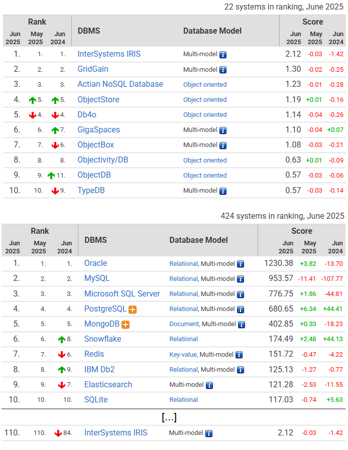
</div>

Boa parte dos sistemas computacionais modernos é desenvolvida utilizando os princípios da programação orientada a objetos (POO). Em POO, objetos podem ser organizados, classificados, criados, destruídos e inter-relacionados de formas complexas. Linguagens como Java, C# ou Smalltalk são exemplos proeminentes desse paradigma. Para nivelar o conhecimento e estruturar uma linha de raciocínio coesa, é essencial uma revisão dos principais conceitos de orientação a objetos que formam a base para o entendimento dos BDOOs.

## Revisão dos Conceitos Fundamentais de Orientação a Objetos

O tema da orientação a objetos é tratado em grande detalhe nas disciplinas de engenharia e desenvolvimento de software. Contudo, para que seja possível compreender plenamente como esses conceitos são aplicados ao armazenamento de dados, é essencial fazer uma revisão que estabeleça uma base sólida.

Os conceitos de orientação a objetos (OO) remontam à década de 1960, com o surgimento da linguagem de programação **Simula**, uma abreviação de **Simulation Language**. Ela foi concebida para a construção de modelos computacionais precisos e complexos, utilizados para descrever e simular grandes construções, aeronaves, navios e outras máquinas pesadas. Esses modelos, geralmente, possuem milhares de variáveis e comportamentos, que, no paradigma de OO, são agregados de acordo com suas funcionalidades em **objetos**.

A composição de objetos menores pode dar origem a um objeto maior e mais complexo. Imagine o contexto da aviação: o motor, as asas, a cabine, o sistema de navegação – todos são objetos que, juntos, compõem o objeto "avião". Um **objeto** pode ser definido como uma unidade autocontida que possui **operações** (seu comportamento) e **dados** (seu estado). As operações são também conhecidas como **métodos**, e os dados, como **atributos**.

Diferentemente da programação estruturada, onde dados e procedimentos que operam sobre eles são entidades separadas, na OO os dados não aparecem mais isolados; eles são intimamente acoplados aos seus comportamentos dentro dos objetos. Essa ideia pode ser visualizada na figura abaixo.

<div align="center">
  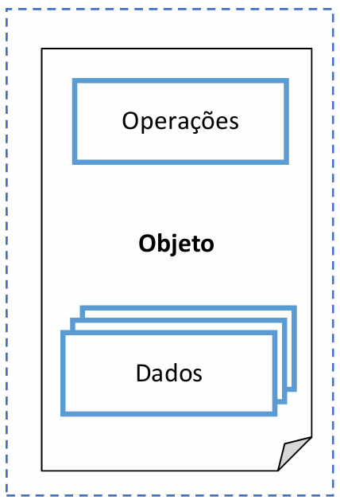
</div>

Sistemas orientados a objetos devem fornecer benefícios significativos em termos de **reutilização de código** e **facilidade de manutenção** de software. No entanto, o paradigma de objetos e o modelo relacional de bancos de dados atuam, de certa forma, em sentidos opostos. A OO agrupa dados e comportamento em objetos complexos, enquanto o modelo relacional "achata" os dados em tabelas bidimensionais simples e normalizadas. Apesar disso, essas duas tecnologias precisam se comunicar de forma minimamente amigável, um desafio que levou ao desenvolvimento de técnicas de mapeamento objeto-relacional (ORM), que serão vistas mais à frente.

É preciso entender que um programa orientado a objetos pode ser visto como uma coleção bem definida de objetos. Todos esses objetos se relacionam e trocam mensagens entre si quando necessário para executar os processos ou as operações definidas no código para o sistema.

Para ilustrar, um cachorro pode ser imaginado como um objeto. Seus olhos, orelhas, focinho e patas são os seus **atributos**. Da mesma forma, as ações de latir, comer e correr são seus **métodos**. Essa natureza autossuficiente dos objetos é muito interessante e poderosa. No momento em que se pensa em um cachorro, é possível descrever tudo sobre ele, quer sob a forma de seus atributos, quer de seus métodos. Esta característica dos objetos é bastante cativante e útil do ponto de vista do design de software. Ser autossuficiente significa que um objeto não depende de outros objetos para organizar seus próprios recursos e características internas. Do ponto de vista do programador, um objeto pode ser construído como uma "caixa preta", que é completamente autossuficiente e pode ser seguramente isolada do mundo exterior através do **encapsulamento**.

Outro ponto importante na construção dos conceitos de OO são os **Tipos Abstratos de Dados (TADs)**. Um TAD oculta as estruturas internas de armazenamento dos dados e especifica todas as possíveis operações externas que são aplicáveis a um objeto por meio da **assinatura dos métodos**. Isso leva diretamente ao conceito de encapsulamento. Na literatura, a linguagem de programação **Smalltalk** foi uma das primeiras a incorporar explicitamente conceitos avançados de OO, como a troca de mensagens como principal forma de interação e a herança como mecanismo de especialização. Smalltalk é, inclusive, considerada por muitos como a primeira linguagem de programação OO "pura".

<div align="center">
  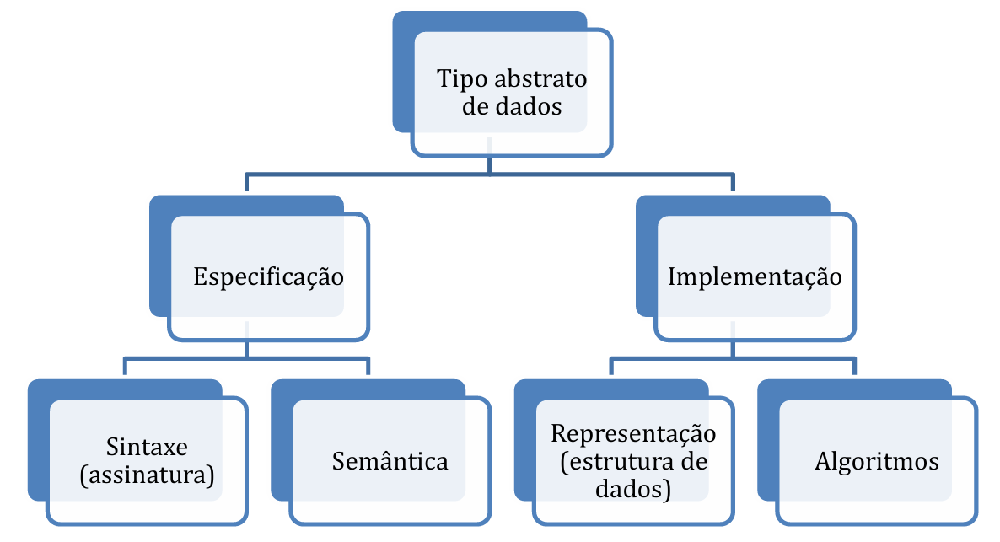
</div>

Como já mencionado, um objeto possui dois componentes principais: **estado** (os valores atuais de seus atributos) e **comportamento** (as operações ou métodos que ele pode executar). Esses objetos podem ter estruturas de dados de complexidade arbitrária e operações típicas definidas durante a implementação do programa. Os objetos possuem ainda outras peculiaridades, sobre as quais se falará agora.

### Persistência, Identidade e Estrutura dos Objetos

Os objetos podem ser classificados como **transientes**, que só existem durante a execução do programa em memória RAM, ou **persistentes**. Um banco de dados pode estender a existência de um objeto, armazenando-o de forma permanente em memória secundária (disco). Neste caso, os objetos são denominados persistentes. Objetos persistentes permitem o compartilhamento desses objetos entre vários programas e várias execuções do mesmo programa. O compartilhamento de objetos, por sua vez, leva à necessidade de mecanismos de **controle de concorrência** e **recuperação de falhas**, que são características clássicas dos SGBDs.

A estrutura interna de um objeto nas linguagens de programação OO inclui a especificação de **variáveis de instância**, as quais mantêm os valores que definem o estado interno do objeto. Em outras palavras, elas armazenam os valores dos atributos de uma **classe** (o "molde" a partir do qual os objetos são criados). Os atributos de um objeto podem ser, eles próprios, outros objetos.

Esses atributos internos podem não ser visíveis aos usuários externos ao objeto. Se for tomado como exemplo a linguagem de programação Java, é possível definir um atributo como `private`. Neste caso, o atributo, por si só, não é visível (acessível diretamente) por código fora da classe do objeto. Os outros **modificadores de acesso** comuns são `public` (acessível de qualquer lugar), `protected` (acessível dentro da própria classe, subclasses e classes do mesmo pacote) e `default` (acessível apenas por classes dentro do mesmo pacote). A figura a seguir resume esses modificadores.

<div align="center">
  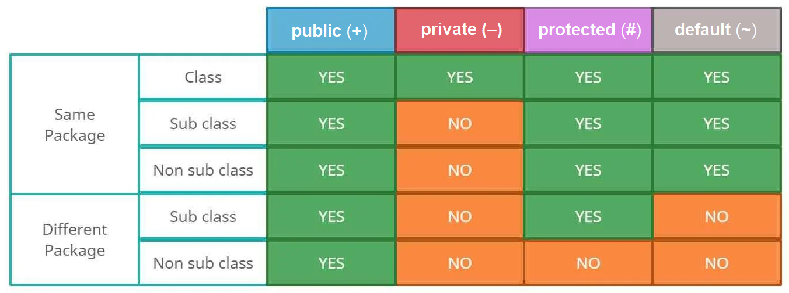
</div>

O conceito de **encapsulamento** é uma das principais características das linguagens e dos sistemas OO. Ele consiste em agrupar os dados (atributos) e os métodos que operam sobre esses dados dentro de uma única unidade (o objeto) e, crucialmente, em **separar a interface de um objeto dos detalhes de sua implementação interna**. Ele também está relacionado ao conceito de Tipos Abstratos de Dados e à **ocultação de informações (information hiding)**. Esse conceito é aplicado a objetos de bancos de dados OO no momento em que se pode definir o comportamento de um tipo de objeto com base nas operações que podem ser aplicadas externamente a ele.

<div align="center">
  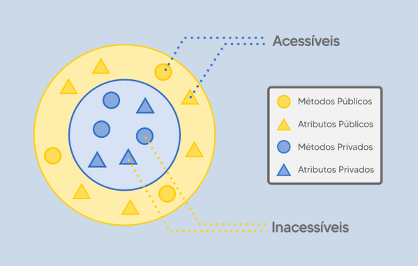
</div>

Algumas operações podem ser usadas para criar (**construtores**) ou destruir (**destrutores**) os objetos. Outras têm a capacidade de modificar o estado interno do objeto (**métodos de atualização ou setters**) ou de recuperar os valores de seus atributos (**métodos de acesso ou getters**). Em geral, a implementação de uma operação (o método) pode ser especificada em uma linguagem de programação de uso geral, o que oferece uma enorme flexibilidade e poder na definição dos comportamentos dos objetos.

Os usuários externos dos objetos só tomam conhecimento da **interface** das operações. A interface de uma operação define o seu **nome** e os **parâmetros** que ela aceita. A junção desses dois elementos (nome e lista de parâmetros) é conhecida também como a **assinatura** do método. Por outro lado, a implementação ou a codificação da operação (o código que efetivamente executa a ação) é denominada **método**. De posse da assinatura, um usuário (ou outro objeto) pode fazer chamadas ao método.

A necessidade de se criar um método específico para acessar cada resultado diferente que poderia ser retornado de um determinado objeto não seria uma tarefa fácil ou flexível, especialmente em um contexto de banco de dados onde consultas ad hoc são comuns. Pensando nisso, as aplicações de banco de dados e os SGBDOOs geralmente **relaxam o requisito de encapsulamento total**. Uma forma de construir esse relaxamento é permitir que a estrutura de um objeto seja dividida em **atributos visíveis** e **atributos ocultos**. Atributos visíveis podem ser acessados diretamente por meio de uma linguagem de consulta declarativa, como a **OQL (Object Query Language)**. Para acessar os objetos e seus atributos, eles precisam estar definidos em forma de uma **classe**.

Navathe explica que um dos objetivos dos bancos de dados orientados a objetos é manter uma correspondência direta entre os objetos do banco de dados e os objetos do mundo real. Assim, esses objetos não perdem sua integridade e sua **identidade** única, podendo ser facilmente identificados e acessados. Para garantir isso, o SGBDOO fornece um **Identificador de Objeto (OID - Object Identifier)**, que é único, gerado pelo sistema e atribuído a cada objeto persistente no momento de sua criação.

A principal propriedade exigida de um OID é que ele seja **imutável**, isto é, o valor do OID para um objeto específico não deve ser modificado durante todo o ciclo de vida do objeto. Também é desejável que cada OID seja utilizado apenas uma vez; ou seja, mesmo que o objeto seja removido do banco de dados, seu OID não deverá mais ser reutilizado para um novo objeto. Essas propriedades reforçam a necessidade de o OID não depender de quaisquer valores de atributos do objeto (como uma chave primária no modelo relacional), uma vez que esses valores podem, teoricamente, ser modificados ou corrigidos.

A maioria dos SGBDOOs permite a representação tanto de **objetos** (que possuem um OID) quanto de **valores** (que não possuem um OID). Se for tomado Java como exemplo, os "valores" são análogos aos tipos primitivos (como `int`, `double`, `char`) e a objetos imutáveis como `String`, enquanto os "objetos" são as instâncias de classes que criamos. Cada objeto persistente deve possuir um OID não modificável, enquanto um valor não possui um OID. Desta forma, um valor normalmente é armazenado "dentro" de um objeto e não pode ser referenciado diretamente a partir de outros objetos. Em alguns sistemas, se necessário, valores complexos estruturados (como um endereço composto por rua, número e cidade) também podem ser criados sem possuir um OID correspondente, sendo tratados como um valor complexo em vez de um objeto independente.

Esses valores e objetos complexos são uma consequência de outra característica da orientação a objetos: a capacidade de um objeto ter uma estrutura de complexidade arbitrária, de forma a conter todas as informações necessárias para descrever o objeto em uma única unidade. Essa complexidade torna a implementação de SGBDOOs bem mais sofisticada quando comparada à do modelo relacional. No modelo relacional, a complexidade é distribuída entre várias tabelas simples, e a estrutura complexa de um objeto do mundo real é reconstruída por meio do relacionamento (junção) entre os registros dessas tabelas.

Nos bancos de dados de objetos, um tipo complexo pode ser construído com base em outros tipos através do aninhamento de **construtores de tipo**. Os três construtores de tipo mais básicos são:

- **`atomic`**: Define os tipos primitivos da linguagem (inteiro, string, booleano, etc.).
- **`struct` ou `tuple`**: Trata dos tipos compostos, que agrupam um conjunto fixo de atributos nomeados. É análogo a um `struct` em C++ ou a um objeto sem métodos.
- **Construtores de coleções ou multivalorados**: Permitem agrupar múltiplos valores ou objetos. Incluem `set(T)` (conjunto de elementos do tipo T, sem duplicatas e sem ordem), `list(T)` (sequência ordenada de elementos do tipo T), `array(T)` (vetor de elementos do tipo T) e `dictionary(K, T)` (mapa de chaves do tipo K para valores do tipo T).

As tuplas no modelo relacional são descritas por meio das linhas de uma relação. Em termos de objetos, é mais fácil visualizar as tuplas ou `structs` como a definição dos atributos de uma classe Java que utiliza apenas tipos primitivos ou outros `structs` aninhados.

### Herança, Polimorfismo e Sobrecarga

Outro conceito chave em sistemas OO é o de **herança** e as **hierarquias de tipos e classes**. Este conceito permite a especificação de novos tipos ou classes (subclasses) que herdam parte de sua estrutura (atributos) e/ou de seu comportamento (métodos) de classes previamente definidas (superclasses).

As definições de **sobrecarga de operador** e **polimorfismo** são igualmente importantes. A **sobrecarga de operador (operator overloading)** refere-se à capacidade de uma mesma operação (ou um mesmo nome de método) ser aplicada a diferentes tipos de objetos. Em tal situação, um único nome de operação pode se referir a diferentes implementações, dependendo do tipo de objeto ao qual é aplicado.

Esse recurso também é chamado de **polimorfismo de operador** ou **polimorfismo ad-hoc**. Por exemplo, uma operação `calcularArea()` pode ser definida para diferentes objetos geométricos, e seu método (a implementação) será diferente dependendo se o objeto é do tipo `Triangulo`, `Retangulo` ou `Circulo`. Para que isso funcione em tempo de execução, o sistema pode exigir o uso de uma funcionalidade conhecida como **ligação tardia (_late binding_)**, que é responsável por fazer a escolha e a execução do método correto de acordo com o tipo real do objeto sobre o qual a operação é executada no momento da chamada, e não no momento da compilação.

Um resumo com as principais características da orientação a objetos relevantes para os bancos de dados é apresentado a seguir:

- **Identidade de Objetos:** Os objetos possuem identificadores únicos (OIDs) que são independentes de seus valores de atributos.
- **Construtores de Tipos:** Estruturas de objetos complexas podem ser construídas recursivamente, aplicando-se um conjunto de construtores básicos como `tuple`, `set`, `list` e `bag`.
- **Encapsulamento de Operações:** A estrutura interna do objeto e as operações (métodos) que podem ser aplicadas aos objetos são incluídas nas definições da classe de objetos.
- **Compatibilidade com a Linguagem de Programação:** Objetos transientes (em memória) e persistentes (no banco de dados) são, idealmente, manipulados de modo uniforme pela linguagem de programação.
- **Hierarquia de Tipos e Herança:** Tipos de objetos podem ser especificados pelo uso de uma hierarquia de tipos (superclasses e subclasses), o que permite a herança de atributos e métodos anteriormente definidos. A herança múltipla é permitida em alguns modelos.
- **Extensões:** Todos os objetos persistentes de um tipo particular podem ser armazenados em uma coleção gerenciada pelo sistema, chamada de **extensão** da classe. As extensões correspondentes a uma hierarquia de tipos possuem restrições de conjunto/subconjunto associadas a elas.
- **Suporte a Objetos Complexos:** Objetos complexos, tanto estruturados quanto não estruturados (como imagens, áudios, textos longos), podem ser armazenados e manipulados.
- **Polimorfismo e Sobrecarga de Operador:** Operações e nomes de métodos podem ser sobrecarregados para serem aplicados a diferentes tipos de objetos com diferentes implementações.
- **Criação de Versões (Versioning):** Alguns sistemas de BDOO oferecem suporte para a manutenção de diversas versões do mesmo objeto.

## Características Essenciais dos Bancos de Dados Orientados a Objetos (SGBDOO)

Outra percepção possível, e bastante prática, é que os SGBDOOs permitem uma **integração direta e mais transparente** entre as linguagens de programação orientadas a objetos (como Java, C++, Python) e as funcionalidades clássicas de um SGBD (como persistência, controle de transações, recuperação e consultas). A figura a abaixo apresenta a sistematização desta composição, mostrando como o BDOO atua como uma ponte entre o mundo da aplicação OO e o armazenamento persistente.

<div align="center">
  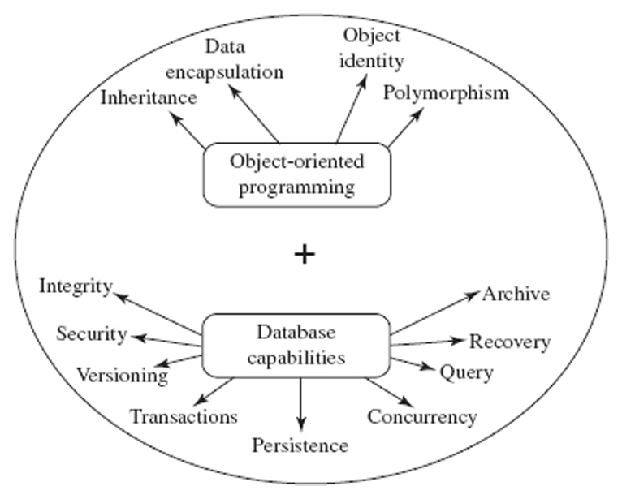
</div>

Bancos de dados orientados a objetos, portanto, combinam os conceitos da programação orientada a objetos e os recursos de um banco de dados tradicional para fornecer um sistema de desenvolvimento de aplicativos mais integrado e coeso. Além dos conceitos básicos de programação orientada a objetos, tais como encapsulamento, herança, polimorfismo e ligação dinâmica, os bancos de dados orientados a objetos também suportam funcionalidades cruciais de banco de dados, como **persistência** e **controle de versão**.

A **persistência** é, talvez, a característica mais fundamental que um SGBDOO adiciona ao paradigma de OO. Em uma linguagem de programação orientada a objetos (LPOO) padrão, os objetos são de natureza **transiente**, ou seja, eles só existem na memória RAM durante a execução do programa e desaparecem (são destruídos pelo garbage collector ou pelo término do processo) após o programa terminar. A fim de converter uma LPOO em uma linguagem de programação com capacidade de persistência, os objetos precisam poder ser feitos **persistentes**. Isso significa que o estado de um objeto deve poder ser salvo em um meio de armazenamento não volátil (como um disco) e persistir mesmo após o término do programa que o criou.

Bancos de dados OO armazenam objetos persistentes permanentemente no armazenamento secundário, para que eles possam ser recuperados e compartilhados por vários programas e em diferentes momentos. Idealmente, os dados armazenados no BDOO são acessados diretamente a partir da linguagem de programação orientada a objetos, sem a necessidade de um "mapeamento" complexo ou da tradução para um modelo de dados diferente, como o relacional. Sempre que um objeto persistente é criado, o sistema retorna um **OID (Identificador de Objeto) persistente**. O OID persistente é implementado, conceitualmente, através de um **ponteiro persistente**, que aponta para um objeto no banco de dados e permanece válido mesmo após o término do programa.

Outra característica importante encontrada em alguns SGBDOOs é o **versionamento (versioning)**. O versionamento permite manter várias versões históricas de um mesmo objeto. O SGBDOO fornece, então, recursos para criar novas versões, navegar entre as versões e, eventualmente, fundir ou descartar versões. Esse recurso é especialmente útil para aplicações de engenharia e design (como CAD/CAM ou desenvolvimento de software), onde a versão mais antiga de um objeto (que pode conter um modelo testado e verificado) deve ser mantida até que a sua nova versão seja completamente testada, validada e lançada.

##  O Modelo de Objetos ODMG: Em Busca de um Padrão

O **Object Data Management Group (ODMG)** foi um consórcio de fornecedores e pesquisadores da área de bancos de dados orientados a objetos, formado como um subgrupo do **Object Management Group (OMG)**, com o objetivo de criar um padrão para SGBDOOs. O OMG, por sua vez, é um consórcio de centenas de fornecedores e usuários de soluções de tecnologia OO, cuja finalidade é estabelecer padrões para a interoperabilidade de objetos, sendo mais conhecido por ter criado o padrão UML (Unified Modeling Language).

Em 1993, a primeira versão do padrão ODMG foi publicada e ficou conhecida como **ODMG-93** ou **ODMG 1.0**. Mais tarde, o padrão foi revisado, resultando no **ODMG 2.0** e em versões posteriores. O padrão ODMG definia uma arquitetura e componentes comuns para um SGBDOO, incluindo:

- Um **Modelo de Objeto** padronizado.
- Uma **Linguagem de Definição de Objetos (ODL - Object Definition Language)**.
- Uma **Linguagem de Consulta de Objetos (OQL - Object Query Language)**.
- Vínculos (bindings) para linguagens de programação específicas, como C++, Java e Smalltalk.

### Linguagem de Definição de Objetos (ODL)

A **Linguagem de Definição de Objetos (ODL)** foi concebida para permitir a especificação da estrutura de um banco de dados orientado a objetos de forma declarativa. A ODL serve, no mundo dos BDOOs, a uma finalidade semelhante à da DDL (Data Definition Language) do SQL no mundo relacional. Ela é usada para suportar e definir as várias construções especificadas no modelo de objetos ODMG.

Uma característica importante da ODL é que o esquema do banco de dados é definido de forma **independente de qualquer linguagem de programação específica**. Uma vez que o esquema é definido em ODL, **vínculos de linguagem (language bindings)** específicos são utilizados para mapear as construções da ODL (como classes, atributos, relacionamentos) para as construções correspondentes nas linguagens de programação orientadas a objetos, como C++, Java ou Smalltalk.

O principal objetivo da ODL é modelar as especificações de objetos – ou seja, as **classes** e **interfaces** – e suas características, que incluem **atributos**, **relacionamentos** e **métodos**. A sintaxe geral para a definição de uma classe usando ODL é mostrada abaixo:

```
class <nome_da_classe>
  (extent <nome_da_extensao>
   key <lista_de_chaves>)
{
  <lista de propriedades (atributos, relacionamentos, métodos)>
};
```

A seguir, um exemplo prático. No contexto de uma livraria online, o objeto `LIVRO` pode ser definido com três atributos: `ISBN`, `TITULO` e `TIPO`.

```
class LIVRO
  (extent livros
   key ISBN)
{
  attribute string ISBN;
  attribute string TITULO;
  attribute enum TIPO {Novel, Textbook, Languagebook} categoria;
  relationship set<CLIENTE> compradosPor
    inverse CLIENTE::compras;
};
```

O campo `categoria` é do tipo `enum` e pode receber como valores qualquer um dos três tipos listados: `Novel`, `Textbook` ou `Languagebook`. Outro ponto interessante é a criação de um **relacionamento**. A palavra-chave `relationship` é usada para definir uma associação com outra classe. Neste caso, `relationship set<CLIENTE> compradosPor` indica que um livro pode ser comprado por um **conjunto de clientes**, e a cláusula `inverse CLIENTE::compras` especifica a contraparte do relacionamento na classe `CLIENTE` (ou seja, um cliente realiza um conjunto de compras).

É possível ainda usar a linguagem ODL para a definição de **métodos** e de **hierarquias de tipos (herança)**. Um exemplo da construção da assinatura de um método, onde é possível visualizar um parâmetro de entrada (`in`), um de saída (`out`), bem como a possibilidade de lançamento de exceção (`raises`):

```
void find_cust(in string city, out string cust_name)
  raises(city_not_valid);
```

A estrutura definida pela ODL para a **extensão de tipos (herança)** permite construir um modelo aderente aos conceitos de orientação a objetos. O exemplo da construção de uma classe `JOURNAL` que herda (estende) da classe `LIVRO` é apresentado abaixo:

```
class JOURNAL extends LIVRO
{
  attribute string VOLUME;
  attribute string Emailauthor1;
  attribute string Emailauthor2;
};
```

Neste caso, a classe `JOURNAL` herda todos os atributos, relacionamentos e métodos da classe `LIVRO` e adiciona os seus próprios.

### Linguagem de Consulta de Objetos (OQL)

Até aqui, foi seguido o fluxo de tarefas referentes à **definição** dos objetos nas bases de dados OO, representado na figura abaixo pela cadeia mais à esquerda (ODL). Agora, o entendimento seguirá com os conceitos referentes à **manipulação** e **consulta** desses objetos, representados pela cadeia da direita (OML/OQL).

<div align="center">
  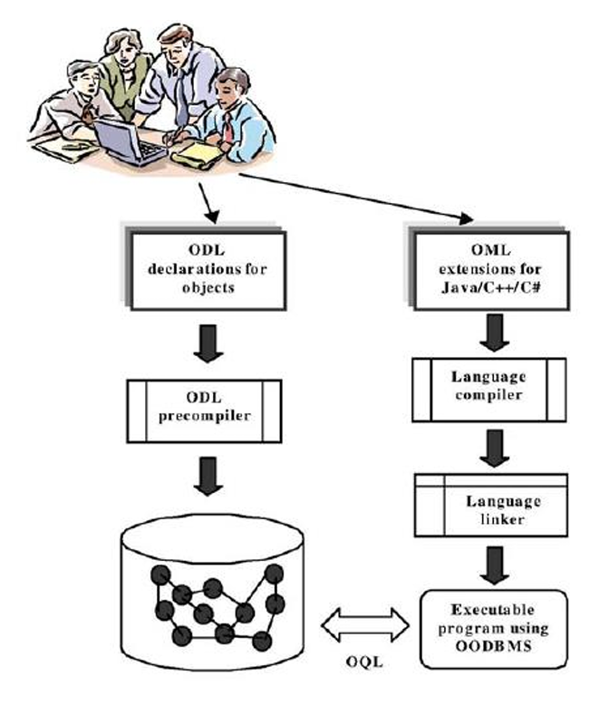
</div>

A **Linguagem de Manipulação de Objetos (OML - Object Manipulation Language)** do padrão ODMG é, na verdade, uma extensão da **OQL**. Considerando que a OQL é um padrão de consulta declarativo e genérico que pode ser usado a partir de diferentes linguagens de programação orientadas a objetos (assim como a sintaxe do SQL é a mesma, não importa qual linguagem de programação seja usada para acessá-lo), a OML é específica para cada linguagem OO. Assim, a sintaxe da OQL seria sempre a mesma para Java, C++ e Smalltalk, mas a forma de invocar a OQL e de manipular os objetos retornados pela consulta (a OML) seria diferente para cada uma dessas linguagens, seguindo as convenções da linguagem hospedeira. A OML inclui suporte para operações de criação, atualização (`UPDATE`) e exclusão (`DELETE`) de objetos.

O foco da atenção será na **OQL (Object Query Language)**. A OQL é uma linguagem de consulta declarativa e padrão, projetada para o modelo de objetos ODMG. Ela assemelha-se em muitos aspectos ao SQL, mas também suporta nativamente os conceitos da orientação a objetos, tais como identidade de objeto (OID), herança, conjuntos de relacionamento e a invocação de métodos dos objetos. Ela pode ser usada para consultar bancos de dados de objetos interativamente, escrevendo consultas ad hoc, ou pode ser incorporada em linguagens de programação orientadas a objetos como C++, Java ou Smalltalk. Uma consulta OQL incorporada em um programa resulta em objetos que se encaixam no sistema de tipos da linguagem de programação hospedeira, evitando o problema da "impedância objeto-relacional".

Cada consulta em OQL precisa de um **ponto de entrada** no banco de dados para iniciar o seu processamento. Geralmente, o nome de uma **extensão** de uma classe (a coleção de todos os objetos persistentes daquela classe) é utilizado como um ponto de entrada. No entanto, qualquer objeto persistente nomeado também pode ser utilizado como um ponto de entrada para a consulta. Usando um nome de extensão como um ponto de entrada, uma consulta retorna uma referência a uma coleção persistente de objetos. Em OQL, cada objeto dentro dessa coleção é referenciado por uma **variável de iteração** (semelhante às variáveis de tupla ou aos aliases de tabela em SQL), que "varia" ou "percorre" cada objeto na coleção durante a avaliação da consulta.

A sintaxe básica da OQL usa a estrutura `SELECT ... FROM ... WHERE ...`, muito similar ao SQL. Por exemplo, a consulta para recuperar os títulos de todos os livros que são do tipo `Textbook` pode ser especificada da seguinte forma:

```
SELECT L.TITULO
FROM livros L
WHERE L.categoria = ‘Textbook’;
```

Aqui, `livros` é o nome da extensão da classe `LIVRO`, e `L` é a variável de iteração que representa cada objeto `LIVRO` na coleção.

Para acessar os atributos de objetos relacionados e os próprios objetos relacionados, pode-se especificar uma **expressão de caminho (path expression)**. Ela começa no nome de um objeto persistente ou na variável de iteração, e então é seguida por zero ou mais nomes de atributos ou nomes de conjuntos de relacionamento, conectados usando a notação de ponto (`.`). Para entender a expressão de caminho, considere uma consulta que exibe os títulos de todos os livros comprados por uma cliente chamada "Flavia":

```
SELECT L.TITULO
FROM livros L
WHERE ‘Flavia’ in L.compradosPor.nome;
```

A sintaxe exata para navegar em coleções pode variar. Uma forma alternativa e mais clara poderia ser:

```
SELECT L.TITULO
FROM livros L, L.compradosPor C
WHERE C.nome = ‘Flavia’;
```

Esta consulta itera sobre todos os livros `L` e, para cada livro, itera sobre a coleção de clientes `C` no relacionamento `compradosPor`, verificando se o nome do cliente é "Flavia".

Agora, uma explanação sobre o mapeamento entre o modelo de objetos e o modelo relacional, uma técnica crucial dado o domínio do modelo relacional no mercado.

## Mapeamento Objeto-Relacional (ORM)

O **Mapeamento Objeto-Relacional** (ou **ORM**, do inglês: Object-Relational Mapping) é uma técnica de programação e desenvolvimento de software utilizada para reduzir o que se conhece como a **impedância objeto-relacional**. Este termo descreve as dificuldades e incompatibilidades conceituais que surgem ao se tentar utilizar um banco de dados relacional (que armazena dados em tabelas planas e normalizadas) a partir de uma aplicação escrita em uma linguagem de programação orientada a objetos (que trabalha com objetos complexos, herança, encapsulamento, etc.). O ORM busca criar uma "ponte" entre esses dois mundos.

Nesta técnica, as **tabelas** do banco de dados relacional são representadas através de **classes** na aplicação, e os **registros (linhas)** de cada tabela são representados como **instâncias** dessas classes correspondentes. Com o uso de uma ferramenta ou framework ORM, o programador pode, idealmente, interagir com os dados do banco de forma muito mais natural dentro do paradigma orientado a objetos, sem precisar escrever comandos SQL manualmente para operações de CRUD (Create, Read, Update, Delete). Ele utiliza uma interface de programação de objetos simples, e a ferramenta ORM faz todo o trabalho de "traduzir" essas operações em comandos SQL e de persistir (salvar) e recuperar o estado dos objetos no banco de dados.

Não é necessária uma correspondência direta e um-para-um entre as tabelas de dados e as classes do programa. A relação entre as tabelas de onde os dados se originam e o objeto que os disponibiliza na aplicação é configurada pelo programador, geralmente através de metadados. Isso ajuda a isolar o código da aplicação de muitas das alterações que possam ocorrer na organização física ou lógica dos dados nas tabelas do banco de dados.

A forma como este mapeamento é configurado depende da ferramenta ORM que está sendo usada. Como exemplo, o programador que utilize o **Hibernate** na linguagem Java pode usar arquivos de mapeamento em XML ou, mais modernamente, o sistema de **anotações (annotations)** diretamente no código das classes Java. Em outros casos, o mapeamento é feito diretamente no código através da herança de classes especiais, como é o caso do ORM do framework **Django** e da biblioteca **SQLAlchemy** na linguagem Python. Algumas ferramentas gráficas, como o **Pony ORM** (também para Python), podem até mesmo ser usadas para gerar o código das classes a partir do modelo do banco.

Em termos conceituais, uma **Camada de Persistência de Objetos** (ou Persistence Layer) é uma biblioteca ou um conjunto de componentes que permite a realização do processo de persistência de forma transparente. Dentre as diversas vantagens obtidas com a utilização de uma Camada de Persistência, pode-se destacar o fato de o analista ou programador poder trabalhar como se estivesse em um sistema completamente orientado a objetos, focando na lógica de negócio em vez de nos detalhes do acesso a dados. Outra vantagem muito importante é que os acessos realizados diretamente ao banco de dados pela aplicação são isolados, e os processos de construção de consultas e operações de manipulação de dados são centralizados em uma camada de objetos, que pode ser mais facilmente mantida e otimizada. Esse encapsulamento torna as aplicações mais robustas e portáteis, permitindo até mesmo que o próprio SGBD ou a estrutura de suas tabelas possam ser alterados com um impacto mínimo no código da aplicação.

Apesar da ajuda das ferramentas ORM, o modelo de classes de um projeto orientado a objetos não pode, em geral, ser simplesmente traduzido de forma automática e ingênua em um script SQL de criação de banco de dados relacional. É necessário um processo consciente de **mapeamento do modelo de objetos em um modelo de dados Entidade-Relacionamento** (ou diretamente para um esquema relacional).

Para garantir que todas as características do modelo de objetos sejam reproduzidas o mais fielmente possível pelo banco de dados relacional, alguns aspectos e padrões de mapeamento merecem ser destacados. Os objetos formam unidades que encapsulam atributos e operações. Os bancos de dados relacionais representam de forma bastante eficiente os atributos, mas são limitados na representação direta das operações (comportamento), que geralmente permanecem na camada de aplicação. É possível, contudo, estabelecer uma analogia entre classes e tabelas, e entre atributos e colunas.

### Regras e Padrões de Mapeamento

Ao se realizar uma transposição de um modelo orientado a objetos para um modelo relacional, algumas regras e padrões devem ser seguidos. É importante destacar que essas regras não são rígidas, mas representam as práticas mais comuns e eficazes.

1. **Mapeamento de Classes e Identidade de Objetos:** A regra mais básica é que **cada classe concreta da aplicação é mapeada para uma tabela no banco de dados**. Para preservar a identidade única de cada objeto, que no mundo OO é garantida pelo **Identificador de Objeto (OID)**, é prática comum criar uma coluna na tabela para atuar como **chave primária**. Frequentemente, essa chave primária é um identificador artificial (uma **surrogate key**), como um número inteiro autoincremental, que corresponde ao OID do objeto e não depende dos valores dos atributos de negócio. Na figura abaixo, é mostrado um exemplo de como seria o mapeamento do objeto `Pedido` para a tabela `Pedido`, com a criação de uma coluna `OIDPedido` como chave primária.

<div align="center">
  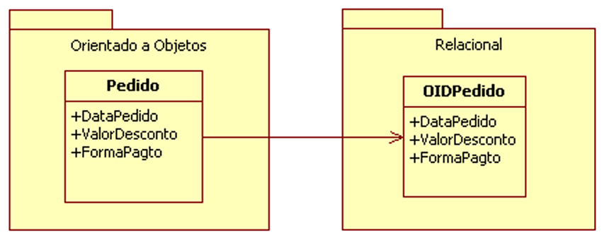
</div>

2. **Mapeamento de Atributos:** Existem diferentes tipos de atributos em um modelo de objetos, e seu mapeamento para o modelo relacional varia:
    - **Atributos Simples (de tipo primitivo):** São mapeados diretamente para colunas na tabela, com o tipo de dado SQL correspondente (por exemplo, `String` para `VARCHAR`, `int` para `INTEGER`).
    - **Atributos Compostos (ou de valor complexo):** Um atributo que é, ele próprio, um objeto ou uma estrutura sem identidade própria (como um `Endereco` composto por `rua`, `cidade`, `cep`) pode ser mapeado de duas formas: ou achatado em múltiplas colunas na tabela principal (ex: `rua_cliente`, `cidade_cliente`, `cep_cliente`), ou mapeado para uma tabela separada se for reutilizável ou muito complexo.
    - **Atributos Multivalorados:** Um atributo que pode conter uma coleção de valores (como uma lista de telefones ou emails) deve ser mapeado para uma **tabela separada**. A chave primária desta nova tabela é tipicamente composta pela chave primária da tabela que representa a classe principal (como uma chave estrangeira) e pelo próprio valor do atributo (se for único dentro da coleção) ou por uma coluna de ordenação. Na figura abaixo, pode ser observado um exemplo de mapeamento de um atributo simples (`Nome`, `DataNasc`), de um atributo composto (`Endereco`, mapeado para múltiplas colunas na tabela `Cliente`), e de um atributo multivalorado (`ClienteTelefone`, mapeado para uma tabela separada `ClienteFone`).

<div align="center">
  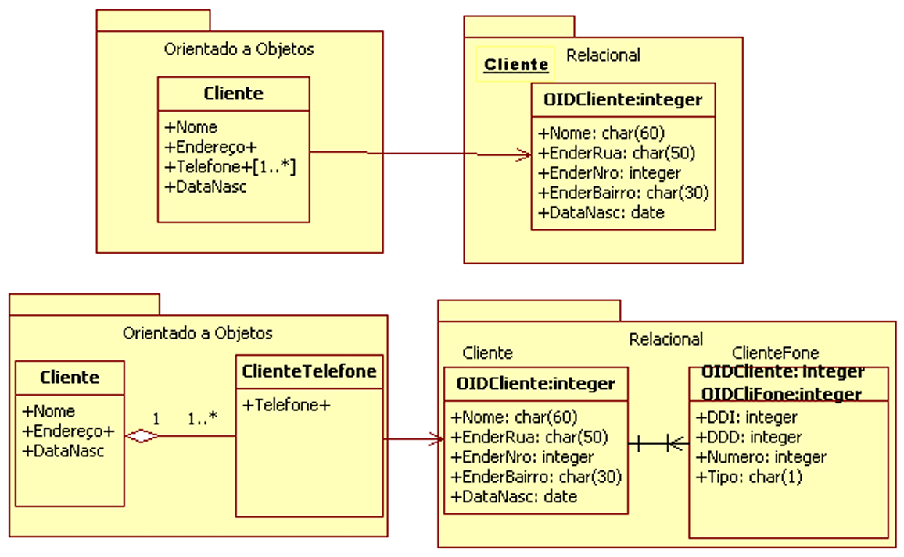
</div>

3. **Mapeamento de Herança:** O conceito de herança, central na OO, não existe nativamente no modelo relacional. Portanto, é necessário mapeá-lo usando uma das três estratégias principais:
    - **Uma Tabela por Classe na Hierarquia (Table per Class Hierarchy ou Single Table Inheritance):** Nesta abordagem, cria-se uma **única tabela** para toda a hierarquia de classes (incluindo a superclasse e todas as subclasses). Essa tabela contém colunas para todos os atributos de todas as classes na hierarquia, além de uma **coluna discriminadora** que indica a qual subclasse cada registro pertence. A principal vantagem é a simplicidade e o bom desempenho para consultas polimórficas (que buscam objetos de diferentes tipos na hierarquia), pois não são necessárias junções. As desvantagens são o potencial desperdício de espaço (muitas colunas ficarão nulas para registros de certas subclasses) e a dificuldade de aplicar restrições `NOT NULL` em atributos de subclasses.

<div align="center">
  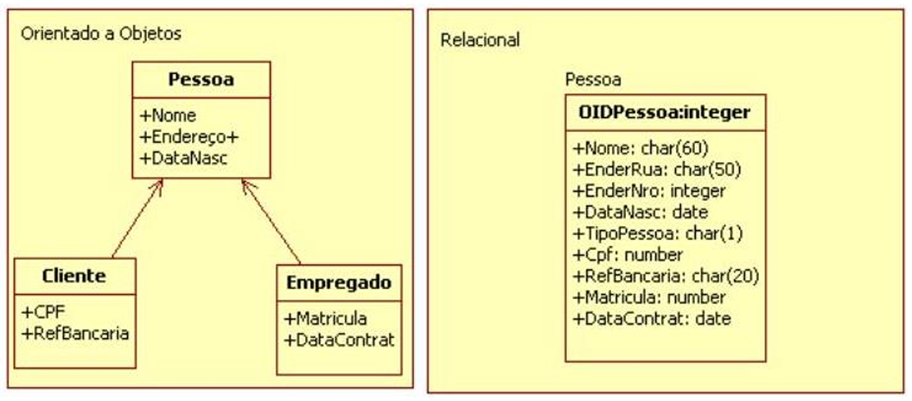
</div>

- **Uma Tabela por Subclasse (Table per Subclass ou Joined Subclass):** Nesta técnica, cria-se uma **tabela para a superclasse** (contendo os atributos comuns) e **uma tabela separada para cada subclasse** (contendo apenas os atributos específicos daquela subclasse). A chave primária da tabela da superclasse também atua como chave primária e chave estrangeira nas tabelas das subclasses, ligando-as. As vantagens são um modelo de dados normalizado e sem desperdício de espaço. A desvantagem é que a recuperação de um objeto de uma subclasse sempre exigirá uma operação de junção (`JOIN`) entre a tabela da subclasse e a da superclasse, o que pode impactar o desempenho.

<div align="center">
  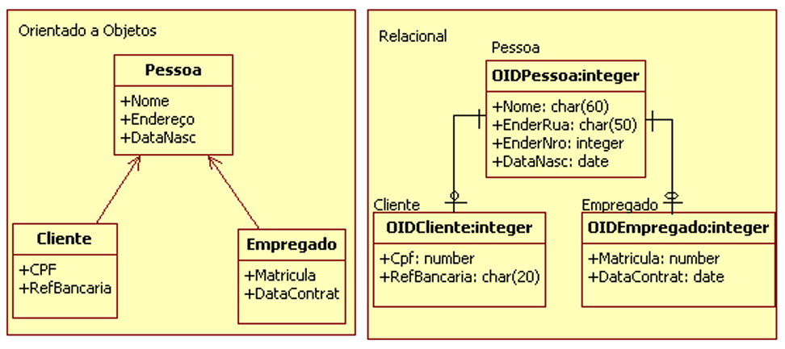
</div>

- **Uma Tabela por Classe Concreta (Table per Concrete Class):** Neste caso, cria-se uma tabela separada para **cada classe concreta** da hierarquia (classes que podem ser instanciadas; classes abstratas não teriam tabela). Cada tabela inclui tanto os atributos específicos da classe concreta quanto **todos os atributos herdados** de suas superclasses. As vantagens são o bom desempenho para buscar objetos de uma classe concreta específica (não são necessárias junções) e a ausência de colunas nulas. As desvantagens são a duplicação de colunas dos atributos herdados em múltiplas tabelas, o que dificulta a manutenção do esquema, e a maior complexidade para consultas polimórficas que abrangem múltiplas classes concretas.

<div align="center">
  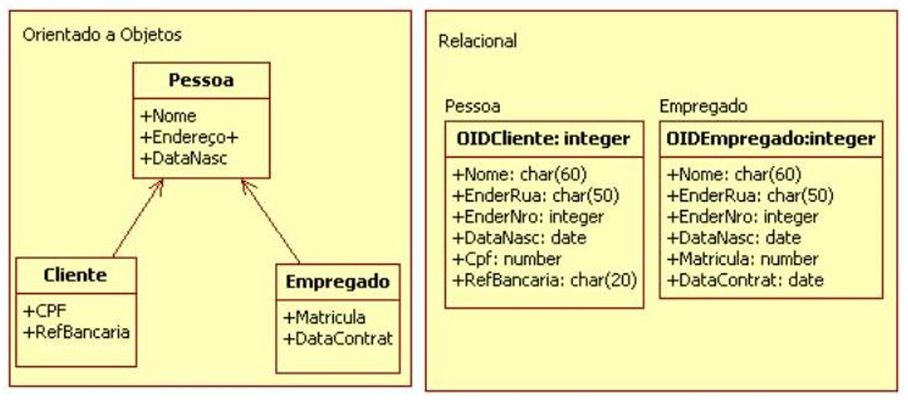
</div>

4. **Mapeamento de Associações:**
    - **Associação Muitos-para-Muitos (N:M):** Neste caso, é necessário criar uma **tabela associativa (ou tabela de junção)** intermediária. A chave primária desta tabela é composta pelas chaves estrangeiras que referenciam as chaves primárias das duas tabelas associadas. Na figura a seguir, pode ser visto um exemplo da transposição de uma associação muitos-para-muitos entre `Aluno` e `Disciplina`. No modelo orientado a objetos, havia dois objetos. No modelo relacional, eles passaram a ser representados por três tabelas: `Aluno`, `Disciplina` e a tabela associativa `Frequenta`.

<div align="center">
  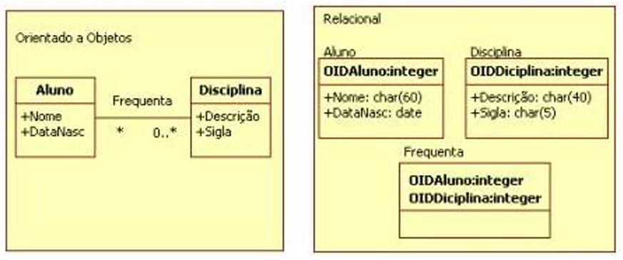
</div>

- **Associação Muitos-para-Muitos com Classe de Associação:** Se a associação N:M possui atributos próprios (o que no modelo de objetos é representado por uma classe de associação), aplica-se a mesma regra da associação muitos-para-muitos (cria-se uma tabela associativa), e os atributos da classe de associação se tornam colunas normais nesta tabela de junção.

<div align="center">
  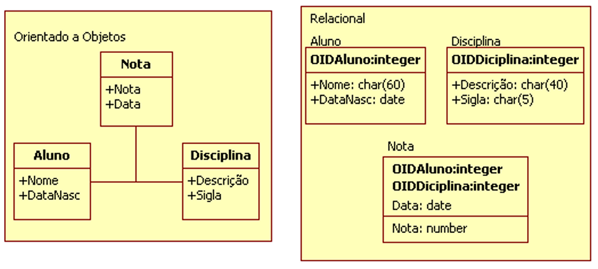
</div>

- **Associação Um-para-Muitos (1:N):** Neste caso, a tabela que está do lado "Muitos" do relacionamento é a que "herda" a referência da tabela cuja correspondência é "Um". Isso é feito adicionando-se uma coluna de **chave estrangeira (FK)** na tabela do lado "Muitos", que referencia a chave primária da tabela do lado "Um". Na figura, pode-se observar um exemplo onde a tabela `Pedido` possui uma chave estrangeira `id_cliente` que referencia a chave primária da tabela `Cliente`.
- 
<div align="center">
  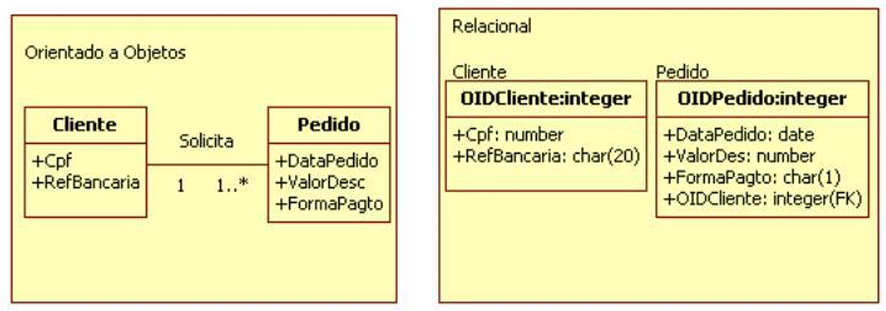
</div>

- **Associação Um-para-Muitos com Classe de Associação:** Neste caso, aplica-se a regra da associação um-para-muitos, e os atributos da classe de associação são "herdados" como colunas normais pela tabela que já herda a chave estrangeira (a tabela do lado "Muitos").

<div align="center">
  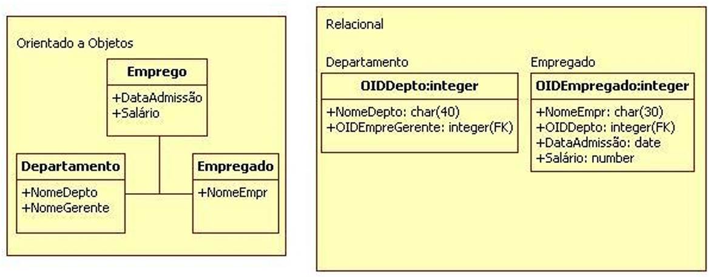
</div>

- **Associação Um-para-Um (1:1):** Nesse tipo de associação, o projetista deve optar entre duas abordagens principais:
    - **Gerar uma Única Tabela:** Os atributos da classe "agregada" (a que é parte da outra) são colocados na mesma tabela da classe "agregadora", geralmente com um prefixo para distinguir os atributos. Nesta técnica, a performance de leitura é melhor, pois é preciso acessar uma única tabela. A desvantagem é que, se a associação for opcional, as colunas da parte agregada ficarão nulas, e se a parte agregada for grande, isso pode aumentar desnecessariamente o tamanho da tabela principal. Na figura abaixo, os objetos `Pedido` e `PagtoCheque` são transpostos para uma única tabela `Pedido`.

<div align="center">
  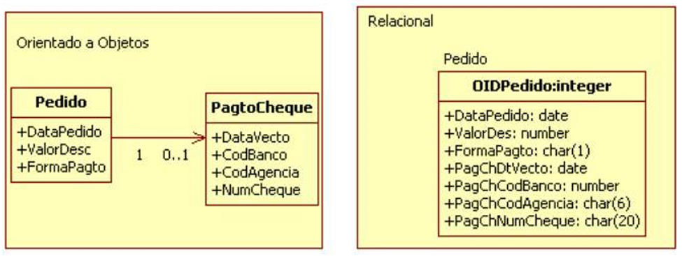
</div>

- **Gerar Duas Tabelas:** Uma tabela é criada para cada classe. A chave primária de uma das tabelas é também armazenada como chave estrangeira e, idealmente, como chave primária na outra tabela, para garantir a relação um-para-um. Esta técnica facilita a manutenção e torna a estrutura do banco de dados mais flexível e normalizada, especialmente se a associação for opcional. Porém, as consultas aos dados completos necessitarão de uma operação de junção (`JOIN`). Na figura a seguir, os objetos `Pedido` e `PagtoCheque` são transpostos para duas tabelas, `Pagamento` e `PagamentoCheque`, ligadas por uma chave.

<div align="center">
  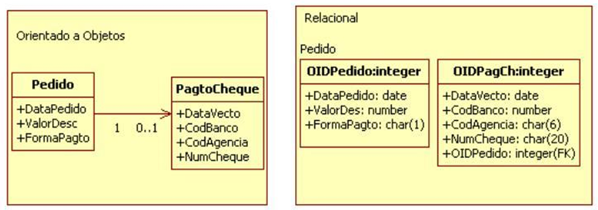
</div>

A próxima figura mostra como seria o mapeamento de um sistema simplificado de controle de uma biblioteca, aplicando algumas das regras vistas até aqui.

<div align="center">
  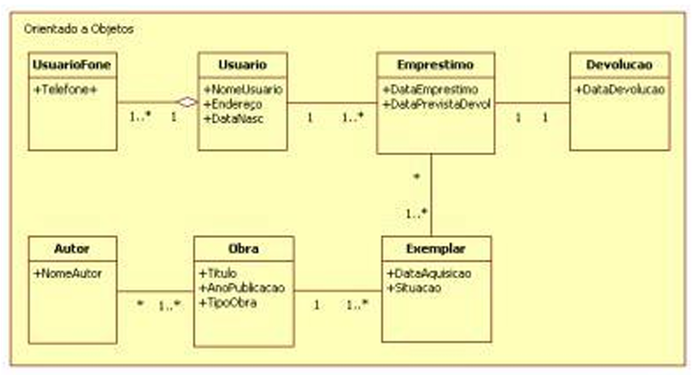
</div>

<div align="center">
  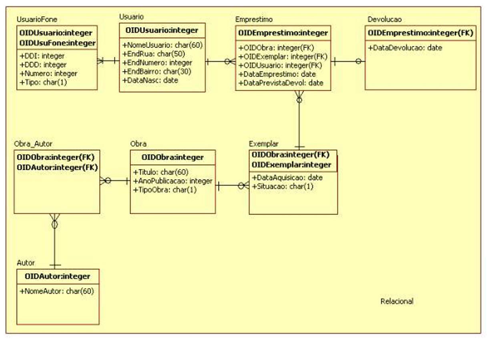
</div>

## Considerações Finais

Neste capítulo, explorou-se o paradigma dos **bancos de dados orientados a objetos (BDOO)**, uma abordagem que emergiu para endereçar as limitações do modelo relacional na representação de dados complexos e para criar uma sinergia mais natural com as linguagens de programação orientadas a objetos. Embora não tenham alcançado a dominância de mercado dos sistemas relacionais, os BDOOs introduziram conceitos valiosos e encontraram nichos importantes em aplicações de engenharia, design e sistemas de informação geográfica.

Foram revisitados os conceitos fundamentais da orientação a objetos — como **encapsulamento**, **herança** e **polimorfismo** — e analisado como eles são adaptados e estendidos em um contexto de banco de dados, com a adição de características cruciais como **persistência**, **identidade de objeto (OID)** e **versionamento**. Foi discutido o esforço de padronização do **ODMG**, com sua **ODL** para definição de esquemas e sua **OQL** para consultas, que buscaram trazer uma base comum para este campo.

Talvez o legado mais impactante e difundido do pensamento orientado a objetos no mundo dos dados seja a técnica de **Mapeamento Objeto-Relacional (ORM)**. Reconhecendo a onipresença dos bancos de dados relacionais, o ORM surgiu como uma "ponte" essencial para mitigar a impedância entre o mundo dos objetos da aplicação e o mundo das tabelas do banco de dados. Foram detalhados os principais padrões de mapeamento para classes, atributos, herança e associações, demonstrando que, com as estratégias corretas, é possível representar a riqueza de um modelo de objetos sobre a fundação robusta e comprovada do modelo relacional.

Conclui-se, portanto, que, seja através de um SGBDOO puro ou, mais comumente, através do uso de ferramentas ORM sobre um SGBD relacional, os princípios da orientação a objetos transformaram profundamente a maneira como os desenvolvedores interagem com os dados. Eles permitiram um nível mais alto de abstração, maior produtividade e um código mais limpo e orientado ao domínio do negócio, consolidando-se como uma parte indispensável do ecossistema de desenvolvimento de software moderno.