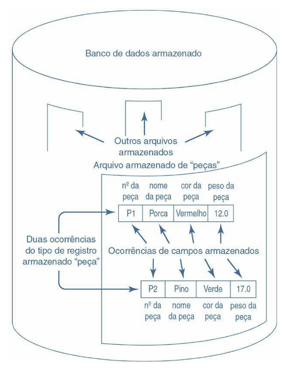
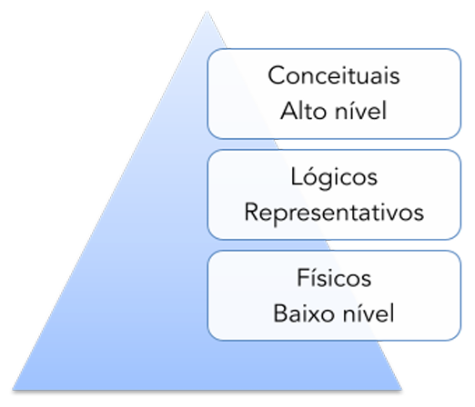
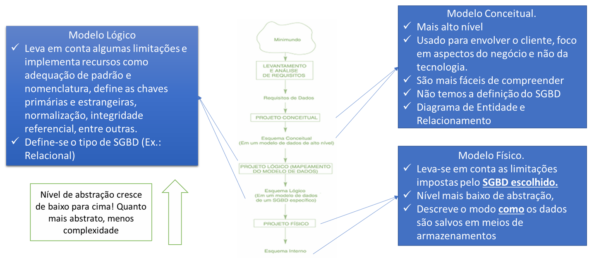
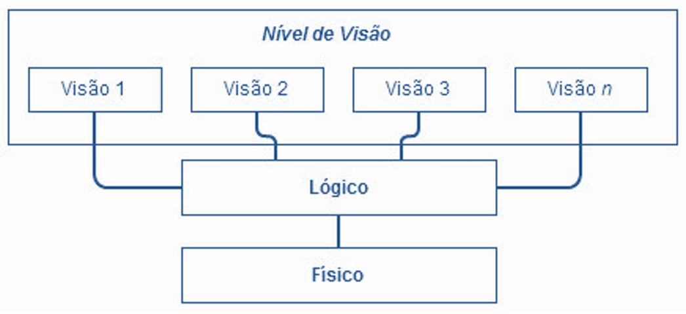
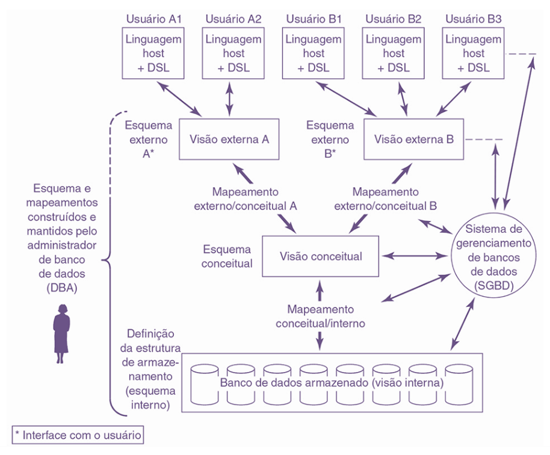
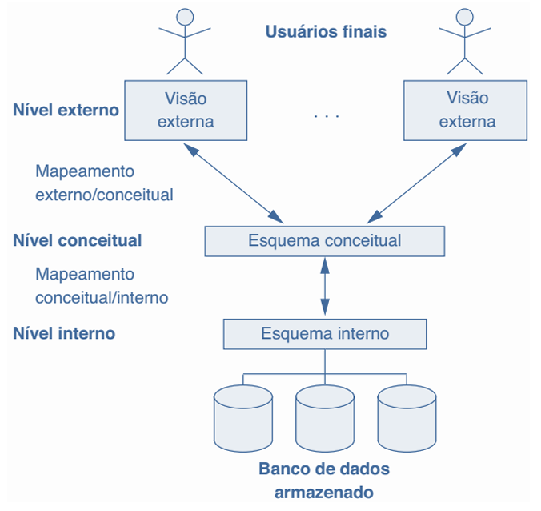
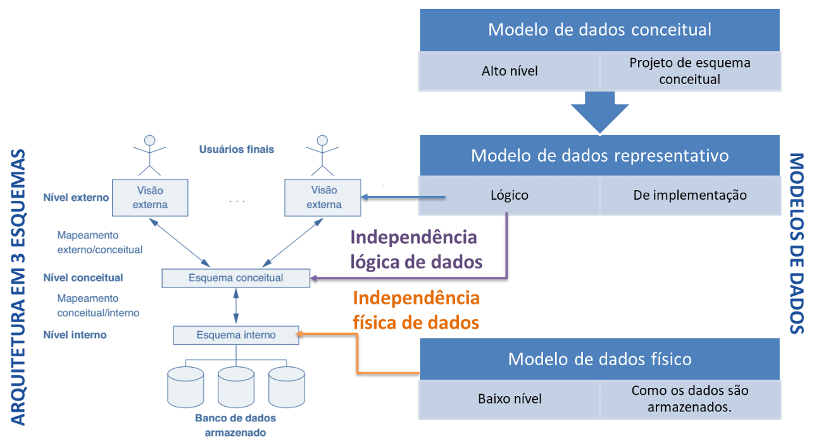

# Capítulo 4 – Modelos de Dados e Arquitetura em Três Esquemas

No capítulo anterior, exploramos os conceitos fundamentais de um sistema de banco de dados, como SGBD, banco de dados, sistema de banco de dados e dicionário de dados. Agora, vamos avançar na direção do entendimento dos elementos que participam do processo de construção e definição de um banco de dados, com foco nos **modelos de dados** e na chamada **arquitetura em três esquemas**, que constitui a base conceitual para muitos dos sistemas de banco de dados modernos.

## Esquemas e Instâncias: a Estrutura e o Estado de um Banco de Dados

Antes de nos aprofundarmos nos modelos de dados propriamente ditos, é essencial compreendermos a diferença entre dois conceitos centrais: **esquema** e **instância**.

Um **esquema** representa a **estrutura do banco de dados** — ou seja, sua definição formal. Ele especifica os tipos de dados, as tabelas, os relacionamentos e as restrições. Pode ser pensado como o projeto ou a planta do banco de dados, descrevendo como os dados devem ser organizados e inter-relacionados.

Por outro lado, uma **instância** representa o **estado atual dos dados armazenados** em determinado momento. Assim como uma fotografia registra uma cena em um instante específico, a instância captura os valores presentes nas tabelas de um banco de dados em um ponto no tempo.

A tabela a seguir ilustra essa diferença conceitual:

|Esquema (Intenção)|Instância (Extensão)|
|---|---|
|Projeto do banco|Fotografia dos dados|
|Descrição|Ocorrências|
|Conotação|Estado|

Fazendo um exemplo prático, suponha que temos um banco de dados com uma tabela chamada `Clientes` com os seguintes atributos:

```sql
CREATE TABLE Clientes (
  id_cliente INTEGER,
  nome VARCHAR(100),
  cidade VARCHAR(100)
);
```

Essa definição é o **esquema** da tabela `Clientes`. Agora, se em um determinado momento, essa tabela contém os seguintes dados:

|id_cliente|nome|cidade|
|---|---|---|
|1|Ana Lima|São Paulo|
|2|João Reis|Belo Horizonte|

Esses dados constituem uma **instância** do banco de dados. Com o tempo, os dados podem ser modificados (novos registros inseridos, outros removidos), gerando novas instâncias, mas o esquema pode permanecer o mesmo.

Essa distinção é particularmente importante quando pensamos na manutenção do banco de dados. Podemos alterar os dados armazenados sem alterar a estrutura, e vice-versa, desde que mantenhamos a coerência entre as definições e os dados.

### Campo, Registro e Arquivo

Para aprofundar ainda mais essa compreensão, é útil considerar a hierarquia dos dados armazenados. Como destacado por C.J. Date, os dados em um banco podem ser visualizados em três níveis:

- **Campo:** a menor unidade de dados armazenados. Cada valor individual de um atributo é um campo.
- **Registro:** uma coleção de campos que representam uma entidade. Por exemplo, um cliente específico.
- **Arquivo:** o conjunto de registros do mesmo tipo. Todos os clientes formam o arquivo de clientes.

A figura abaixo ilustra esses conceitos, mostrando como os dados são organizados no armazenamento.

<div align="center">
  
</div>

## Modelos de Dados: Representações Estruturadas da Realidade

Um **modelo de dados** é um conjunto de conceitos que servem para representar a estrutura e as propriedades dos dados de forma abstrata. Ele fornece a base para o desenvolvimento e a manipulação de bancos de dados, permitindo que diferentes níveis de usuários compreendam, definam e operem sobre os dados sem precisar conhecer os detalhes de sua implementação física.

Todo modelo de dados deve oferecer mecanismos para representar:

- A **estrutura dos dados**, por exemplo, os tipos de entidades, atributos e relacionamentos.
- Os **relacionamentos** entre os dados, como associações entre entidades.
- A **semântica**, ou seja, o significado dos dados e das relações.
- As **restrições de integridade**, como regras que os dados devem obedecer.

Alguns modelos também fornecem **operações** associadas aos dados, o que permite manipulação, consulta e atualização.

### Categorias de Modelos de Dados

Os modelos de dados podem ser classificados de acordo com o nível de abstração que oferecem. A seguir, apresentamos as três principais categorias:

1. **Modelo Conceitual (ou de Alto Nível):** Reflete a visão do domínio do problema do ponto de vista dos usuários finais. Foca no quê será armazenado, sem se preocupar com como isso será feito. Um exemplo clássico é o modelo Entidade-Relacionamento (ER).
2. **Modelo Lógico (ou Representacional):** Traduz a visão conceitual para estruturas mais próximas das implementações, como tabelas e chaves. Aqui já introduzimos conceitos de como os dados serão organizados no SGBD, mas ainda sem se preocupar com detalhes físicos. Exemplos incluem o modelo relacional, o modelo de objetos, entre outros.
3. **Modelo Físico (ou de Baixo Nível):** Representa os dados na forma como são efetivamente armazenados no disco ou em outro meio físico. Inclui detalhes sobre índices, estruturas de armazenamento, segmentação de dados, etc.

<div align="center">
  
</div>

A figura acima resume as três categorias e como elas se relacionam em termos de abstração e proximidade com o meio físico.

Também é comum representar a evolução do projeto de um banco de dados passando do modelo conceitual para o lógico e, por fim, para o físico. Esse processo é conhecido como **refinamento de modelo**, como mostrado a seguir:

<div align="center">
  
</div>

## Níveis de Abstração: Como os Dados São Vistos

Para lidar com a complexidade dos bancos de dados, é comum dividir sua representação em **níveis de abstração**. Silberschatz propõe três níveis principais:

1. **Nível Físico:** Descreve como os dados são realmente armazenados — por exemplo, o tipo de arquivo, blocos de disco, índices. É o nível mais baixo e mais próximo do hardware.
2. **Nível Lógico:** Descreve **quais** dados estão armazenados e **como** eles estão organizados logicamente. Define tabelas, atributos e relacionamentos. É independente da implementação física.
3. **Nível de Visão (ou Externo):** Apresenta aos usuários finais apenas uma parte do banco de dados, aquela que é relevante para suas atividades. Cada usuário pode ter uma visão diferente do mesmo banco.

<div align="center">
  
</div>

## Arquitetura em Três Esquemas: Organização Modular de um SGBD

A arquitetura em três esquemas, proposta pelo American National Standards Institute (**ANSI**) através do Standards Planning and Requirements Committee **(SPARC)**, é uma extensão direta dos níveis de abstração. Ela organiza os bancos de dados em três níveis distintos, cada um com sua própria função, descrição e linguagem de definição:

- **Esquema Interno:** Representa os dados no nível mais próximo ao armazenamento físico. Trata de estruturas como blocos, endereços, ponteiros e técnicas de acesso.
- **Esquema Conceitual:**  Fornece uma visão unificada e lógica dos dados, independente da aplicação ou do armazenamento físico. Corresponde ao modelo lógico do banco.
- **Esquema Externo:** Descreve visões personalizadas do banco para diferentes usuários ou grupos de usuários. Cada esquema externo corresponde à parte dos dados que o usuário precisa ver e manipular.

<div align="center">
  
</div>

A figura mostra como diferentes usuários (A e B) acessam o banco através de visões externas distintas, usando sublinguagens de dados (DSLs), compostas por **DDL** (Data Definition Language — Linguagem de Definição de Dados), que dá suporte à criação de objetos no banco de dados, e **DML** (Data Manipulation Language — Linguagem de Manipulação de Dados), que permite o processamento ou manipulação dos objetos.

 O nível externo é o nível de usuário individual. Uma **visão externa** representa o conteúdo visto por um determinado usuário. Muitas vezes, um usuário tem acesso a apenas alguns atributos de uma tabela ou arquivo. Essa composição de atributos que não compreende a totalidade das colunas é conhecida como registro externo. Cada visão externa é definida como um esquema externo e descrita por meio de uma DDL externa.

A **visão conceitual** representa todo o conteúdo do banco de dados também em um nível de abstração razoável quando comparado ao nível interno. A visão conceitual consiste em várias ocorrências de cada um dos tipos de registros conceituais. Um esquema conceitual é usado para descrever cada um dos registros e para tal usa uma linguagem de definição conhecida como DDL conceitual.

A **visão interna** é uma representação de baixo nível do banco de dados inteiro. Ela é formada por várias ocorrências dos registros interno. No nível interno deverá haver referência a representações de campos armazenados, sequências de registros armazenados, índices, esquemas de hashing, ponteiros ou outros detalhes de armazenamento e acesso. Para tal, vamos usar um esquema interno usando uma DDL interna.

A tabela abaixo resume a terminologia utilizada nos três níveis:

|Nível|Registros|Esquemas|DDL|
|---|---|---|---|
|Externo|Externos|Externo|DDL Externa|
|Conceitual|Conceituais|Conceitual|DDL Conceitual|
|Interno|Internos|Interno|DDL Interna|

A presença dos três esquemas exige a existência de **mapeamentos** entre eles, que são responsáveis por garantir a **independência dos dados**, um dos objetivos mais importantes de um SGBD moderno. Os tipos de mapeamento existentes são:

- **Mapeamento Conceitual/Interno:** Relaciona o esquema conceitual com o armazenamento físico dos dados. Permite que mudanças no nível físico não afetem o nível conceitual.
- **Mapeamento Externo/Conceitual:** Relaciona uma visão externa com o esquema conceitual. Permite que o mesmo dado seja visto de formas diferentes por diferentes usuários.
- **Mapeamento Externo/Externo:** Eventualmente, pode-se criar uma visão externa a partir de outra já existente, exigindo esse tipo de mapeamento adicional.

### Independência dos Dados

Conceito central no design de sistemas de banco de dados, a independência dos dados permite modificar os esquemas em um nível sem impactar os demais. Segundo Navathe, ela se divide em:

- **Independência Física dos Dados:** Possibilita alterações no nível interno (como mudar a estrutura de indexação) sem afetar o esquema conceitual.
- **Independência Lógica dos Dados:** Permite alterar o esquema conceitual (por exemplo, adicionar uma nova entidade ou atributo) sem afetar as visões externas dos usuários.

Se a estrutura do banco de dados armazenado for alterada – isto é, se for efetuada uma mudança na definição do banco de dados armazenado – o mapeamento conceitual/interno terá de ser alterado de acordo, a fim de que o esquema conceitual possa permanecer invariável. Em outras palavras, os efeitos dessas mudanças devem ser isolados abaixo do nível conceitual, a fim de preservar a independência de dados física.

Apresentamos a seguir uma figura que descreve os níveis da arquitetura em três esquemas. Observem que pela definição de independência de dados é necessário a existência de um nível superior ao esquema alterado. Desta forma só temos o conceito para os níveis conceitual e interno da figura.

<div align="center">
  
</div>

## Considerações Finais

Neste capítulo, exploramos em profundidade os conceitos de modelos de dados e arquitetura em três esquemas. Compreendemos que os modelos de dados são fundamentais para representar a estrutura da informação, e que a arquitetura modular do banco — com seus esquemas interno, conceitual e externo — permite maior flexibilidade, segurança e independência.

A figura a seguir faz um resumo e correlação dos conceitos aprendidos:

<div align="center">
  
</div>

A figura mostra como grudar a hierarquia dos modelos de dados com a hierarquia dos níveis da arquitetura em 3 esquemas. Tanto o nível externo quanto o conceitual da arquitetura em 3 esquemas são representados por esquemas descritos por modelos lógicos.