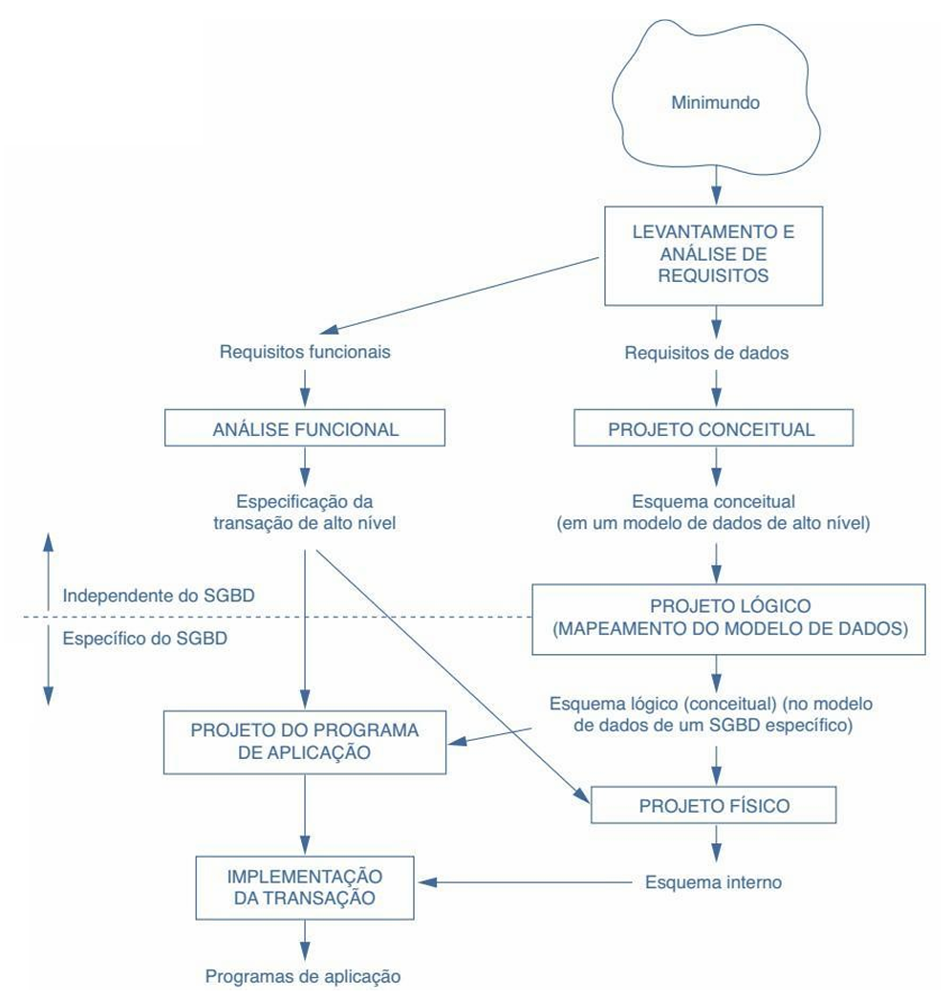
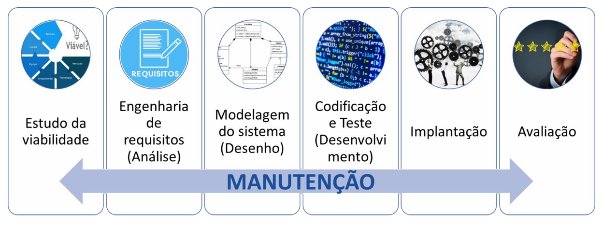
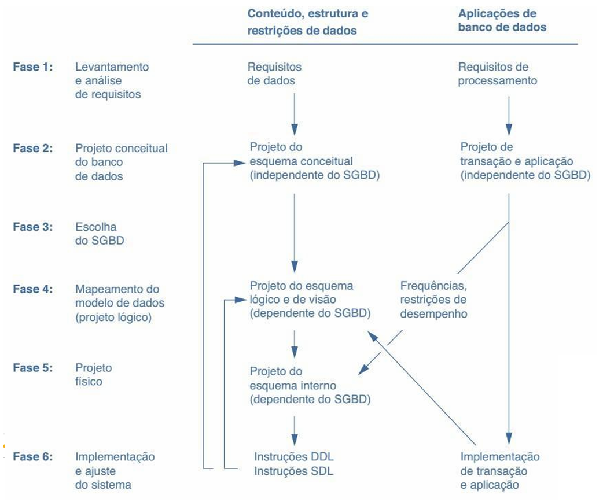
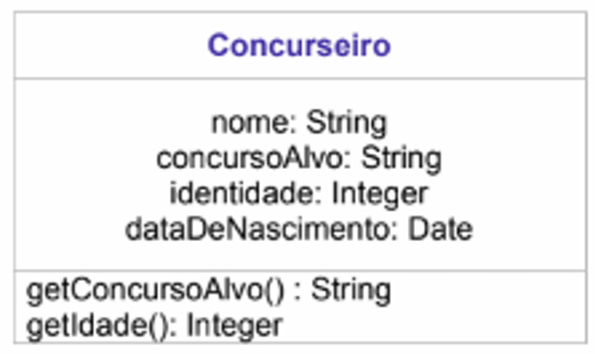
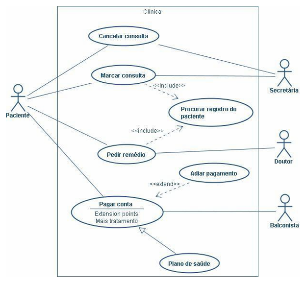

# Capítulo 6 – Projeto de Banco de Dados e Modelo Conceitual

Neste capítulo, vamos nos aprofundar no processo de projeto de um banco de dados, com ênfase na modelagem conceitual — etapa fundamental que precede a implementação de qualquer sistema de gerenciamento de dados.

A modelagem conceitual permite representar, de forma abstrata e compreensível, as informações relevantes do domínio de aplicação, facilitando o entendimento entre usuários e projetistas. A partir dessa representação inicial, evoluímos para modelos lógicos e físicos, refinando a estrutura até sua implementação em um SGBD.

Além disso, abordaremos conceitos importantes relacionados à análise funcional, técnicas de modelagem como a UML e os fundamentos da administração de dados no contexto da governança da informação.

## Introdução ao Projeto de Banco de Dados

O desenvolvimento de uma aplicação baseada em banco de dados é uma tarefa que exige uma abordagem sistemática e rigorosa. Não se trata apenas de criar tabelas ou escrever comandos SQL: é preciso entender profundamente o problema a ser resolvido, identificar as necessidades dos usuários e, a partir disso, estruturar os dados de forma adequada, eficiente e duradoura.

Nesse processo, uma das atividades mais importantes é o projeto do **esquema do banco de dados**, que pode ser comparado à planta de uma construção. Assim como um arquiteto desenha uma planta detalhada para guiar a construção de uma casa ou edifício, o projetista de banco de dados define um esquema que servirá de guia para a implementação da estrutura de armazenamento e manipulação de dados.

Esse esquema define quais objetos existirão no banco — como tabelas, atributos e relacionamentos — e quais restrições serão aplicadas para garantir a integridade e consistência dos dados. Porém, antes de chegar a esse nível de detalhamento técnico, é necessário compreender **quais são os dados relevantes** e **como eles se relacionam entre si no contexto da organização**. Essa compreensão é capturada por meio da **modelagem conceitual de dados**, cujo objetivo é representar, de forma abstrata e independente de qualquer tecnologia, as informações percebidas pelos usuários.

Modelos conceituais não se preocupam com detalhes técnicos, como formatos de armazenamento ou comandos específicos de um SGBD. Ao contrário, eles permitem representar graficamente a realidade do domínio da aplicação, por meio de elementos como **entidades**, **atributos** e **relacionamentos**. Isso torna o modelo facilmente compreensível por pessoas não técnicas, permitindo que usuários e projetistas trabalhem em conjunto para validar e refinar a estrutura proposta.

Um bom modelo conceitual torna o projeto mais robusto e adequado, pois reflete com fidelidade as necessidades da organização. Ele é o primeiro passo no processo de desenvolvimento de um banco de dados, servindo como base para as etapas posteriores de projeto lógico e físico.

## Etapas do Projeto de Banco de Dados

A construção de um banco de dados segue um processo composto por três grandes etapas: o **projeto conceitual**, o **projeto lógico** e o **projeto físico**. Cada uma dessas etapas gera um produto — chamado de **esquema** — que servirá como entrada para a próxima fase.

No **projeto conceitual**, o objetivo é capturar os requisitos do sistema e representá-los por meio de um modelo de alto nível, como o **Modelo Entidade-Relacionamento (ER)**. Esse modelo expressa as informações do mundo real por meio de elementos gráficos, sem se preocupar com questões técnicas de implementação. Ele é completamente independente do sistema de gerenciamento de banco de dados que será utilizado, bem como da plataforma de hardware.

Uma vez validado o modelo conceitual, seguimos para o **projeto lógico**, que consiste em transformar o modelo de alto nível em uma representação compatível com um modelo de dados específico, como o **modelo relacional**. Nessa etapa, o projetista define quais tabelas existirão, quais serão seus atributos, como as chaves primárias e estrangeiras se relacionarão e quais restrições serão impostas. Embora mais técnico, o projeto lógico ainda é independente do SGBD, focando na estrutura dos dados de forma abstrata.

Finalmente, no **projeto físico**, o esquema lógico é traduzido para os comandos específicos da linguagem SQL, com a finalidade de criar a estrutura no SGBD escolhido. Nessa etapa são definidos aspectos de desempenho, como índices, tipos de dados exatos, métodos de particionamento, e estratégias de armazenamento.

A figura a seguir apresenta esse fluxo de maneira resumida:

  

É importante perceber que cada projeto — conceitual, lógico e físico — resulta na definição de um esquema correspondente. Esses esquemas podem ser refinados iterativamente à medida que o projeto avança, sendo comum a retroalimentação entre as etapas.

Ao observarmos a figura acima, notamos que ao lado esquerdo do fluxo de projeto existe uma outra cadeia de atividades que acontece em paralelo: trata-se da **análise funcional**. Essa análise é fundamental para descrever as funcionalidades esperadas do sistema e será abordada na próxima seção.

## Análise Funcional: Definindo as Funcionalidades do Sistema

A análise funcional é uma etapa complementar ao projeto de dados que visa identificar e documentar os **requisitos funcionais** do sistema. Esses requisitos correspondem às operações que os usuários deverão realizar sobre os dados, como cadastrar clientes, emitir relatórios, agendar consultas, entre outras.

Esse processo é parte do que chamamos de **ciclo de vida macro** do sistema de informação, que abrange todas as etapas de desenvolvimento, desde a análise de viabilidade até a manutenção após a implantação. As principais fases desse ciclo são:

- Análise de viabilidade
- Levantamento e análise de requisitos
- Projeto
- Implementação
- Validação e teste de aceitação
- Implantação
- Operação e manutenção

  

Especificamente no que diz respeito ao banco de dados, temos o **ciclo de vida micro**, que foca nas atividades diretamente relacionadas à construção e operação da base de dados. As fases são:

- **Definição do sistema**: definição de escopo, usuários, aplicações e restrições. As interfaces para diversas categorias de usuários, as restrições do tempo de resposta e as necessidades de armazenamento são identificadas.
- **Projeto de banco de dados**: elaboração dos modelos conceitual, lógico e físico.
- **Implementação**: criação dos esquemas no SGBD.
- **Carga ou conversão de dados**: povoamento da base com dados existentes ou novos.
- **Conversão de aplicações**: adaptação de sistemas antigos ao novo banco.
- **Teste e validação**: verificação do correto funcionamento do sistema.
- **Operação**: entrada em produção, com possível paralelismo com sistemas antigos.
- **Monitoramento e manutenção**: ajustes, correções e evolução da base e das aplicações.

A figura a seguir resume as etapas de projeto e implementação de um grande banco de dados:

  

Para descrever os requisitos funcionais com precisão e clareza, é essencial adotar uma linguagem comum entre analistas e usuários. Uma das abordagens mais utilizadas para isso é o uso da **UML (Unified Modeling Language)**.

## UML: Uma Linguagem Unificada para Modelagem

A **UML (Unified Modeling Language)** é uma linguagem padronizada que oferece uma série de recursos para modelar sistemas de informação de maneira completa. Ela abrange desde a análise de requisitos até a modelagem de processos, estruturas de dados e interações entre componentes.

A UML é independente de plataforma e linguagem de programação, e combina conceitos das principais metodologias orientadas a objetos. Seus diagramas estão divididos em duas categorias principais:

- **Diagramas estruturais**: representam os aspectos estáticos do sistema.
- **Diagramas comportamentais**: representam os aspectos dinâmicos e interativos.

Um dos diagramas estruturais mais importantes é o **Diagrama de Classes**, utilizado para representar as entidades, seus atributos e os métodos associados. Veja a figura a seguir:

  

A figura mostra a classe `Concurseiro`, com seus atributos (`nome`, `concursoAlvo`, `identidade`, `dataDeNascimento`) e os métodos que operam sobre esses dados. Cada atributo possui um tipo de dado, e os métodos representam comportamentos associados à classe.

Como exemplo de diagrama comportamental, temos o **Diagrama de Casos de Uso**, que representa as funcionalidades do sistema do ponto de vista dos usuários:

  

Os elementos centrais desse diagrama são:

- **Atores**: representados por ícones de pessoas, indicam os usuários do sistema.
- **Casos de uso**: elipses que descrevem funcionalidades principais.
- **Relacionamentos**: linhas que ligam atores a casos de uso.

Além disso, dois estereótipos importantes aparecem nos diagramas:

- `<<include>>`: indica que um caso de uso depende obrigatoriamente de outro. Exemplo: “Marcar Consulta” inclui “Identificar Paciente”.
- `<<extends>>`: indica que um caso de uso pode opcionalmente estender outro. Exemplo: “Pagar Conta” pode ser estendido por “Adiar Pagamento”.

## Administração de Dados e Governança da Informação

A **Administração de Dados (AD)** é uma função estratégica dentro das organizações modernas. Ela vai além da operação técnica do banco de dados, buscando garantir que os dados corporativos tenham significado claro, qualidade confiável e estejam disponíveis de forma segura e integrada.

A implantação de uma política de AD visa reduzir riscos associados à complexidade das informações e promover o uso eficaz dos dados como ativos organizacionais. As principais atividades envolvidas nesse processo são:

- **Modelagem de dados corporativos**: elaboração de modelos que representem os dados em todos os níveis da organização. Devem seguir seis princípios:
    - Abordagem top-down
    - Foco no core business
    - Cobertura ampla
    - Antecipação de mudanças futuras
    - Desenvolvimento colaborativo
    - Busca por consenso
- **Definição de dados e nomenclatura**: padronização dos nomes e significados dos dados, facilitando a comunicação e o entendimento entre equipes.
- **Metadados**: gestão de dados sobre os dados, como definições, descrições, formatos e regras de negócio.
- **Qualidade de dados**: controle e melhoria da precisão, consistência e completude das informações armazenadas.
- **Acessibilidade e segurança**: garantir que os dados estejam disponíveis para quem tem permissão e protegidos contra acessos indevidos.
- **Gerenciamento de dados mestres**: padronização de dados essenciais, como clientes, produtos ou fornecedores, que são compartilhados por vários sistemas da organização.

Todas essas atividades fazem parte da chamada **governança de dados**, definida como a orquestração formal de pessoas, processos e tecnologias para permitir que a organização maximize o valor estratégico de seus dados.

O profissional responsável por essas atividades é o **Administrador de Dados (AD)**, também chamado de projetista de dados. Sua função é planejar, controlar e garantir a qualidade e a coerência dos dados corporativos, atuando de forma estratégica para atender às necessidades de informação da organização.

## Considerações Finais

O projeto de banco de dados é uma atividade essencial para garantir que as informações armazenadas reflitam com fidelidade as necessidades do negócio. Por meio da modelagem conceitual, é possível construir uma base sólida que serve como alicerce para todas as demais etapas do desenvolvimento.

Neste capítulo, vimos que um bom projeto começa com a escuta ativa dos usuários, evolui com representações gráficas que facilitam o entendimento e culmina em implementações eficientes e seguras. A análise funcional, a adoção de padrões como a UML e a atenção à administração e governança de dados completam esse ciclo, mostrando que projetar um banco de dados é tanto uma tarefa técnica quanto estratégica. Compreender e aplicar esses conceitos é o primeiro passo para construir sistemas de informação eficazes, duradouros e alinhados aos objetivos da organização.
