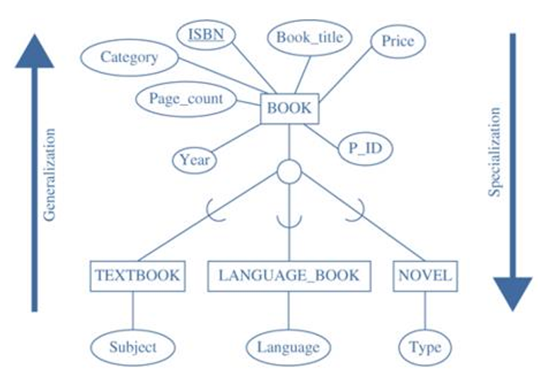
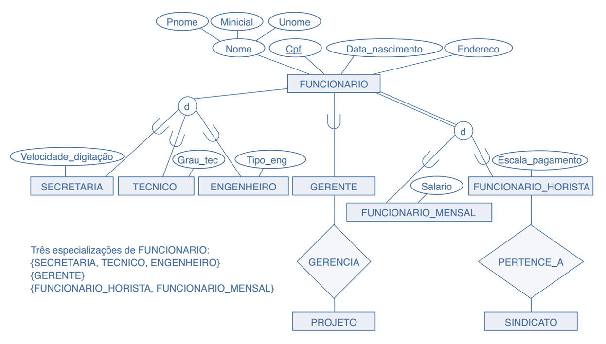
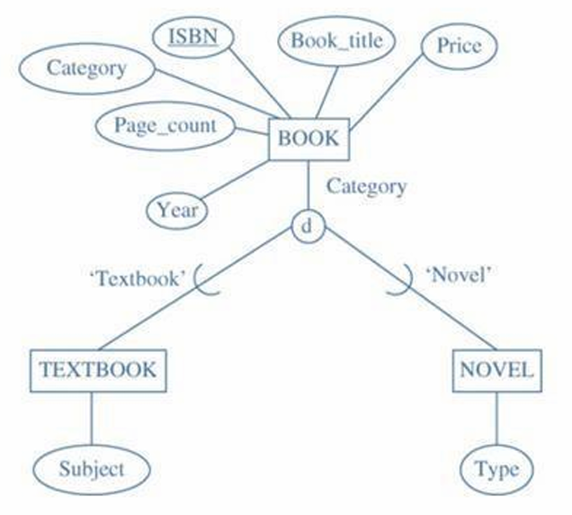
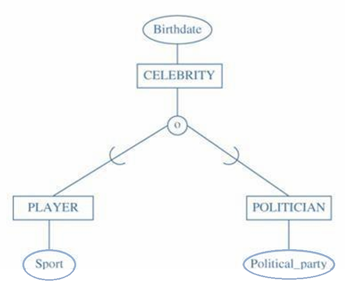
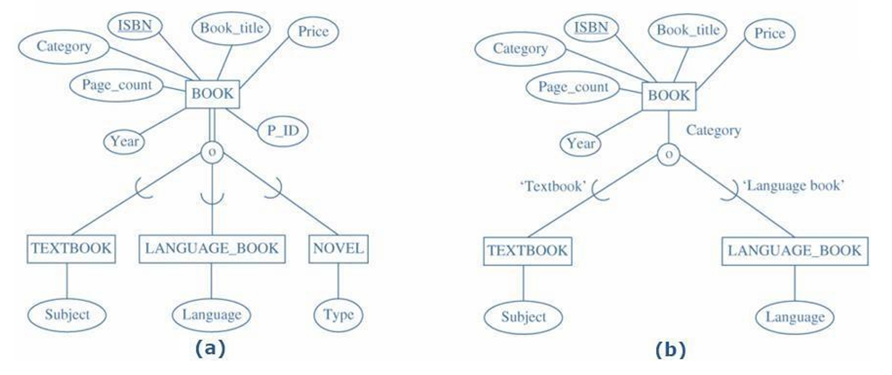
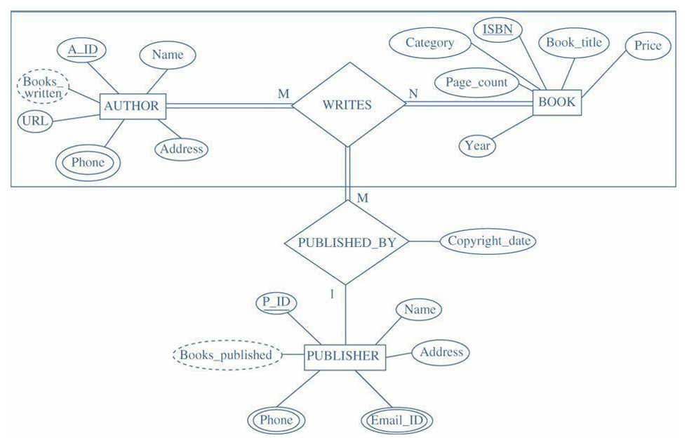
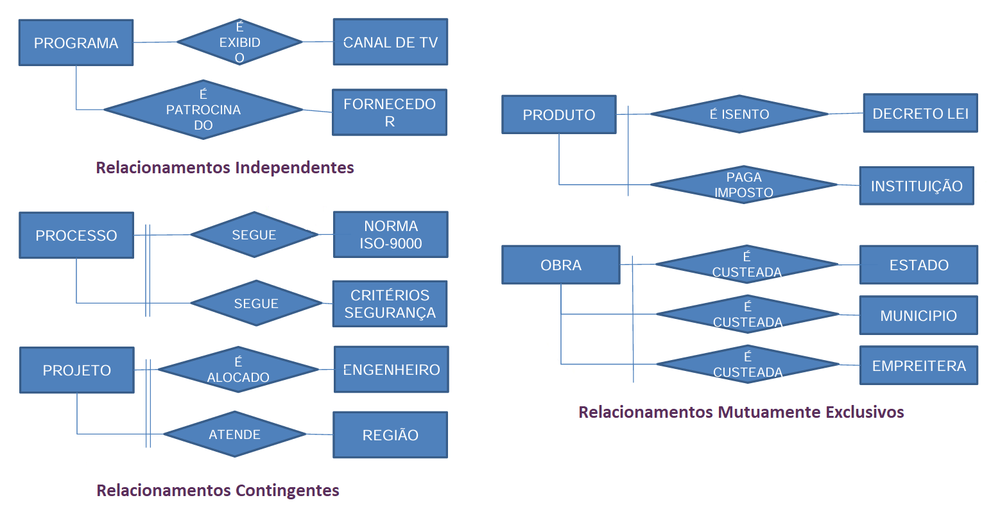

# Capítulo 8 – Modelo Entidade-Relacionamento Estendido (EER)

Ao longo dos capítulos anteriores, exploramos os fundamentos da modelagem conceitual de dados utilizando o Modelo Entidade-Relacionamento (ER), que se mostrou altamente eficaz para representar objetos, seus atributos e os relacionamentos entre eles. No entanto, à medida que lidamos com domínios de aplicação mais complexos — como sistemas de informação geográfica, telecomunicações, aplicações científicas e outros contextos com regras de negócio mais sofisticadas — percebemos que o modelo ER básico apresenta limitações. Há aspectos da realidade que simplesmente não podem ser capturados de forma direta utilizando apenas entidades, atributos e relacionamentos.

Foi com o objetivo de superar essas limitações que surgiu o **Modelo Entidade-Relacionamento Estendido (EER)**, uma evolução natural do modelo original proposta para tratar com maior expressividade fenômenos como **herança**, **especialização**, **generalização**, **agregação** e **relacionamentos complexos**. Este modelo amplia a capacidade de representação do projetista de banco de dados, permitindo a construção de esquemas conceituais mais aderentes à realidade do domínio de aplicação.

Neste capítulo, aprofundaremos o entendimento desses novos elementos, sempre mantendo o estilo visual e semântico familiar ao modelo ER, mas agora com maior poder de abstração.

## Especialização e Generalização: Refinando e Agrupando Entidades

Um dos grandes avanços introduzidos pelo modelo EER é a capacidade de representar **hierarquias entre entidades**. Em muitos contextos, é natural pensar em **entidades genéricas** e, a partir delas, em entidades **mais específicas** que compartilham algumas características, mas que também possuem propriedades distintas. Essa ideia remete diretamente ao conceito de herança, já consolidado em linguagens de programação orientadas a objetos.

### O que é Especialização?

A **especialização** é o processo de identificação de **subgrupos dentro de uma entidade mais geral**, chamados de **subclasses**, que herdam os atributos e relacionamentos da entidade genérica — chamada de **superclasse** — mas que também introduzem **atributos ou comportamentos próprios**.

Por exemplo, considere a entidade genérica **LIVRO**. Podemos especializá-la em três subtipos:

- **TEXTBOOK**: livros didáticos, com um atributo adicional chamado **assunto** (como Computação, Matemática, Física...);
- **LANGUAGE_BOOK**: livros para aprendizado de idiomas, que possuem um atributo próprio **idioma** (como Francês, Alemão, Japonês...);
- **NOVEL**: romances, com um atributo **tipo** (como Ficção, Mistério, Fantasia...).

Note que todos esses subtipos mantêm os atributos básicos da entidade LIVRO, como título, autor, número de páginas, mas acrescentam suas próprias particularidades. Essa **herança de atributos** da superclasse é um dos pilares fundamentais da especialização.

A especialização é um processo **top-down**, no qual partimos de uma entidade genérica para decompor suas variações mais específicas.

### O que é Generalização?

A **generalização**, por outro lado, é o processo inverso. Trata-se de **identificar semelhanças entre entidades distintas** e, a partir delas, **agrupar os atributos comuns em uma entidade mais abstrata**.

Suponha que inicialmente tenhamos modelado separadamente as entidades TEXTBOOK, LANGUAGE_BOOK e NOVEL. Ao percebermos que todas compartilham um conjunto comum de atributos (como título, autor, editora), podemos generalizá-las em uma única entidade mais ampla chamada **LIVRO**.

Enquanto a especialização foca na **diversidade** entre as subentidades, a generalização enfatiza a **unidade e os aspectos comuns**.

### Representação gráfica

Nos diagramas EER, tanto a especialização quanto a generalização são representadas por uma estrutura semelhante: a superclasse se liga a um **círculo**, do qual saem linhas conectando às subclasses. O símbolo `∪` (união) indica que cada subclasse é um subconjunto da superclasse. Esse círculo pode conter símbolos adicionais, que discutiremos adiante.

  

Na figura acima, a entidade **LIVRO** é especializada em três subclasses, cada uma com seus atributos específicos. Este diagrama pode ter surgido a partir de uma generalização de entidades distintas, ou de uma especialização de uma entidade única — ambas as abordagens são válidas e dependem do contexto do projeto.

## Herança, Disjunção e Sobreposição

O conceito de **herança** é fundamental para entender como as subclasses se comportam no modelo EER. Toda subclasse **herda automaticamente** os atributos e relacionamentos definidos na superclasse. Ou seja, ao modelar a subclasse TEXTBOOK, não é necessário repetir os atributos de LIVRO como título ou autor — presume-se que ela já os possui.

Quando realizamos uma especialização, é importante definir **como as subclasses se relacionam entre si**. Para isso, utilizamos duas restrições importantes: **disjunção** e **sobreposição**. A figura a seguir é um exemplo de modelo mais elaborado com aplicação desses conceitos:

  

Essas distinções são muito relevantes quando projetamos restrições de integridade ou construímos o modelo lógico do banco de dados a partir da modelagem conceitual. A escolha entre disjunção e sobreposição impacta diretamente na **normalização** e **implementação das tabelas**.

### Disjunção

A **restrição de disjunção** estabelece que uma instância da superclasse **só pode pertencer a uma das subclasses**. Em termos práticos, um mesmo livro não pode ser ao mesmo tempo um TEXTBOOK e um NOVEL. Ele deve pertencer a uma única subentidade.

Essa restrição é representada no diagrama EER por um **círculo contendo a letra "d"** (de **disjoint**, em inglês).

  

### Sobreposição

Já a **restrição de sobreposição** admite que uma mesma instância da superclasse **possa pertencer a múltiplas subclasses simultaneamente**. Por exemplo, uma celebridade pode ser ao mesmo tempo **jogador (PLAYER)** e **político (POLITICIAN)**. Da mesma forma, um livro de idiomas pode também ser adotado como material didático, ou seja, um mesmo exemplar pode pertencer às subclasses **LANGUAGE_BOOK** e **TEXTBOOK**.

Esse tipo de especialização é representado por um **círculo contendo a letra "o"**, indicando sobreposição (**overlapping**).

  

### Especialização Total e Parcial

A última restrição que pode ser aplicada à generalização ou especialização, é a restrição à participação ou integralidade. Ela determina se uma entidade no conjunto de entidades de nível superior deve ou não pertencer a, pelo menos, um dos conjuntos de entidades de nível inferior. A restrição de participação pode ser total ou parcial.

- **Especialização Total**: Especifica que cada entidade de nível superior deve pertencer a, pelo menos um, dos tipos de entidade de nível inferior na especialização. A Figura (a) mostra a especialização total do tipo de entidade BOOK. Aqui, cada elemento da entidade livro deve pertencer a um ou outro TEXTBOOK ou LANGUAGE BOOK ou NOVEL. A especialização total é representada por linhas duplas que ligam a superclasse com o círculo.
- **Especialização Parcial**: Ela permite que algumas das instâncias de tipo de entidade de nível superior não pertencerem a qualquer um dos tipos de entidade de nível inferior. A figura (b) mostra a especialização parcial do tipo de entidade BOOK, como todos os livros não necessariamente pertencem às categorias TEXTBOOK ou LANGUAGE BOOK, alguns podem pertencer à categoria NOVEL, por exemplo.

  

Vale ressaltar que a especialização total ou parcial é válida tanto para Disjunção quanto para a Sobreposição. Logo, temos quatro restrições possíveis na especialização:

- Disjunção total.
- Disjunção parcial.
- Sobreposição total.
- Sobreposição parcial.

## Agregação: Representando Relacionamentos entre Relacionamentos

Embora o modelo ER tradicional permita representar relacionamentos entre entidades, ele **não contempla diretamente relacionamentos entre relacionamentos**. Em contextos mais complexos, pode surgir a necessidade de modelar **um fato que depende da existência de um relacionamento anterior**.

Esse é o papel da **agregação** — um conceito fundamental no modelo EER que permite tratar **relacionamentos como se fossem entidades**, agregando-os em novos relacionamentos.

Considere o seguinte cenário:

- Um **autor** escreve um **livro**. Esse relacionamento é representado por **ESCREVE**.
- Após o livro ser escrito, ele pode ser **publicado** por uma **editora**.

Note que a publicação só faz sentido se o relacionamento anterior (ESCREVE) já tiver ocorrido. Logo, precisamos representar a associação entre o relacionamento ESCREVE e a entidade EDITORA.

Para isso, utilizamos a **agregação**, transformando o relacionamento ESCREVE em um **bloco que pode ser referenciado por outros relacionamentos**. Veja a figura a seguir:

  

Nessa representação, o relacionamento **PUBLISHED_BY** conecta a entidade **EDITORA** à agregação **ESCREVE**, que, por sua vez, conecta **AUTOR** e **LIVRO**. Assim, conseguimos expressar claramente que a publicação só acontece **após a escrita**, respeitando a ordem lógica dos fatos no domínio do problema.

Esse tipo de estrutura é particularmente útil em aplicações que envolvem **processos encadeados**, **eventos dependentes** ou **registros históricos compostos**.

## Relacionamentos Complexos: Independentes, Contingentes e Mutuamente Exclusivos

Ao utilizarmos o modelo EER, é comum lidarmos com **relações múltiplas** entre entidades, que podem ter **vínculos condicionais** ou até mesmo **regras de exclusividade** entre si. Essa complexidade requer atenção especial no momento da modelagem, pois impacta diretamente as regras de negócio que o banco de dados deverá respeitar.

Alguns tipos de relacionamentos complexos que existem são:

- **Relacionamentos independentes**: não há vínculo lógico ou restritivo entre múltiplos relacionamentos envolvendo a mesma entidade. Por exemplo, um professor pode supervisionar pesquisas e também coordenar disciplinas, sem que uma ação dependa da outra.
- **Relacionamentos contingentes**: a ocorrência de um relacionamento **depende da existência de outro**. Por exemplo, um contrato de trabalho só pode existir se houver um vínculo de matrícula entre o funcionário e a empresa.
- **Relacionamentos mutuamente exclusivos**: representam situações em que uma entidade **só pode participar de um dos relacionamentos**, mas **não de ambos simultaneamente**. Por exemplo, um funcionário pode estar lotado em um setor fixo **ou** atuar como consultor externo, mas não nas duas funções ao mesmo tempo.

A representações simbólicas desses relacionamentos podem ser observadas a seguir:

  

A modelagem desses vínculos pode ser feita por meio de **regras adicionais**, restrições no modelo lógico ou mesmo por atributos auxiliares. Em alguns casos, o projetista opta por **inserir atributos booleanos** ou criar **relacionamentos condicionais**, que serão refinados durante o projeto lógico ou físico do banco de dados.

## Considerações Finais

O **Modelo Entidade-Relacionamento Estendido (EER)** amplia significativamente a expressividade da modelagem conceitual, permitindo capturar nuances da realidade que não são tratáveis pelo modelo ER tradicional. A introdução de conceitos como **especialização**, **generalização**, **agregação** e **relacionamentos complexos** oferece aos projetistas de banco de dados um arsenal conceitual mais poderoso e flexível para representar cenários ricos e multifacetados.

O uso adequado do modelo EER contribui para um projeto mais **estruturado**, **modularizado** e **semântico**, facilitando a comunicação entre os envolvidos e proporcionando uma transição mais suave para as etapas seguintes de projeto lógico e físico.
